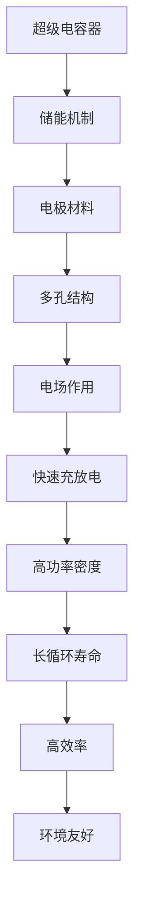

                 

关键词：超级电容器、能源存储、快速充放电、电化学、应用领域

## 摘要

随着全球能源需求的不断增长和可再生能源的普及，高效的能源存储技术变得越来越重要。超级电容器作为一种新型的能源存储设备，凭借其高功率密度、快速充放电特性和长循环寿命等优势，在多个应用领域展示出了巨大的潜力。本文将深入探讨超级电容器的原理、核心算法、数学模型以及实际应用，并展望其未来发展趋势与挑战。

## 1. 背景介绍

在过去的几十年中，传统的电池技术在能源存储领域占据了主导地位。然而，随着能源需求的多样化和对高效能源存储解决方案的追求，传统电池技术的局限性逐渐显现。特别是对于需要高功率密度、快速响应以及频繁充放电的应用场景，如电动汽车、可再生能源发电系统等，传统电池技术难以满足需求。

### 1.1 能源存储技术现状

当前能源存储技术主要包括电池、超级电容器、飞轮储能和压缩空气储能等。其中，电池技术以其高能量密度和相对成熟的商业化为优势，被广泛应用于各种应用场景。然而，电池的充放电速度较慢、循环寿命有限以及安全性问题使其在高速、高功率应用场景中的表现不足。

相比之下，超级电容器具有更高的功率密度，能够实现快速充放电，同时具有较长的循环寿命。这些特点使得超级电容器在电动汽车、风力发电、太阳能发电等应用场景中具有重要的应用价值。

### 1.2 超级电容器的优势

超级电容器（Supercapacitors）也称为电容器电池或超级电容器电池，是一种介于传统电容器和电池之间的储能设备。其主要优势如下：

- **高功率密度**：超级电容器能够在短时间内释放大量能量，功率密度远远高于传统电池。
- **快速充放电**：超级电容器可以迅速充放电，充电时间通常在几分钟内，甚至可以瞬间充电。
- **长循环寿命**：超级电容器能够承受数百万次的充放电循环，循环寿命远超传统电池。
- **高效率**：超级电容器的能量转换效率较高，通常在70%以上。
- **环境友好**：超级电容器使用的材料多为环保材料，对环境影响较小。

## 2. 核心概念与联系

### 2.1 超级电容器的原理

超级电容器的储能机制基于其高比表面积的电极材料和多孔结构，通过电场作用实现电荷的存储和释放。其工作原理类似于传统的电容器，但具有更高的电荷存储能力和更快的充放电速度。

### 2.2 超级电容器与电池的对比

超级电容器与传统电池在储能机制、性能特点和应用场景上存在显著差异。传统电池通过化学反应存储和释放能量，能量密度较高但充放电速度较慢；而超级电容器则通过物理吸附和脱附过程进行充放电，能量密度较低但功率密度高。

### 2.3 Mermaid 流程图



## 3. 核心算法原理 & 具体操作步骤

### 3.1 算法原理概述

超级电容器的核心算法主要包括电极材料的选择、电极制备方法、电容器结构设计以及充放电控制策略等。以下将对这些核心算法进行详细阐述。

### 3.2 算法步骤详解

#### 3.2.1 电极材料选择

电极材料的选择是超级电容器性能的关键因素。目前常用的电极材料包括活性炭、碳纳米管、石墨烯等。选择电极材料时需要考虑其电导率、比表面积、热稳定性和化学稳定性等特性。

#### 3.2.2 电极制备方法

电极制备方法包括浸渍法、涂层法、电沉积法等。不同的制备方法会影响电极的比表面积和孔隙结构，进而影响电容器的性能。

#### 3.2.3 电容器结构设计

电容器结构设计包括单体电容器的设计和电容器模块的设计。单体电容器的设计需要考虑电极材料、电解液、隔膜等因素；电容器模块的设计则需要考虑电容器单元的排列方式、连接方式以及散热等因素。

#### 3.2.4 充放电控制策略

充放电控制策略是保证电容器安全、高效运行的关键。常见的控制策略包括恒流充放电、恒压充放电、脉冲充放电等。

### 3.3 算法优缺点

#### 优点

- 高功率密度
- 快速充放电
- 长循环寿命
- 高效率
- 环境友好

#### 缺点

- 能量密度相对较低
- 电解液性能要求较高
- 制造工艺复杂

### 3.4 算法应用领域

超级电容器在多个应用领域具有广泛的应用前景，包括电动汽车、可再生能源发电、电力电子设备、消费电子等领域。

## 4. 数学模型和公式 & 详细讲解 & 举例说明

### 4.1 数学模型构建

超级电容器的数学模型主要包括电荷存储模型、功率输出模型和能量存储模型等。

#### 4.1.1 电荷存储模型

电荷存储模型描述了超级电容器在充放电过程中电荷的存储和释放。其基本公式为：

$$ Q = CV $$

其中，Q为电荷量，C为电容量，V为电压。

#### 4.1.2 功率输出模型

功率输出模型描述了超级电容器在充放电过程中功率的输出。其基本公式为：

$$ P = \frac{V^2}{R} $$

其中，P为功率，V为电压，R为内阻。

#### 4.1.3 能量存储模型

能量存储模型描述了超级电容器在充放电过程中能量的存储和释放。其基本公式为：

$$ E = \frac{1}{2}CV^2 $$

其中，E为能量，C为电容量，V为电压。

### 4.2 公式推导过程

#### 4.2.1 电荷存储模型推导

根据电容器的基本原理，电容量C与电荷量Q和电压V之间的关系为：

$$ C = \frac{Q}{V} $$

将上式变形得：

$$ Q = CV $$

#### 4.2.2 功率输出模型推导

根据功率的定义，功率P等于电压V和电流I的乘积。由于电流I等于电压V除以内阻R，所以：

$$ P = VI = \frac{V^2}{R} $$

#### 4.2.3 能量存储模型推导

根据能量守恒定律，能量E等于功率P和时间t的乘积。由于功率P等于电压V的平方除以内阻R，所以：

$$ E = Pt = \frac{V^2t}{R} $$

由于能量E等于电荷量Q和电压V的乘积的一半，所以：

$$ E = \frac{1}{2}CV^2 $$

### 4.3 案例分析与讲解

#### 4.3.1 案例背景

某电动汽车采用超级电容器作为辅助动力源。超级电容器的电容量为2000F，内阻为0.1Ω。

#### 4.3.2 充电过程

假设超级电容器从0V充电到10V，充电时间为5分钟。根据电荷存储模型，充电过程中存储的电荷量为：

$$ Q = CV = 2000F \times 10V = 2C $$

根据功率输出模型，充电过程中超级电容器的功率输出为：

$$ P = \frac{V^2}{R} = \frac{(10V)^2}{0.1\Omega} = 1000W $$

根据能量存储模型，充电过程中超级电容器存储的能量为：

$$ E = \frac{1}{2}CV^2 = \frac{1}{2} \times 2000F \times (10V)^2 = 10kJ $$

#### 4.3.3 放电过程

假设超级电容器从10V放电到0V，放电时间为10分钟。根据电荷存储模型，放电过程中释放的电荷量为：

$$ Q = CV = 2000F \times 10V = 2C $$

根据功率输出模型，放电过程中超级电容器的功率输出为：

$$ P = \frac{V^2}{R} = \frac{(10V)^2}{0.1\Omega} = 1000W $$

根据能量存储模型，放电过程中超级电容器释放的能量为：

$$ E = \frac{1}{2}CV^2 = \frac{1}{2} \times 2000F \times (10V)^2 = 10kJ $$

## 5. 项目实践：代码实例和详细解释说明

### 5.1 开发环境搭建

为了演示超级电容器的充放电控制策略，我们选择Python作为开发语言。开发环境搭建如下：

1. 安装Python 3.8及以上版本。
2. 安装必要的Python库，如NumPy、Matplotlib等。

### 5.2 源代码详细实现

以下是一个简单的Python代码实例，用于模拟超级电容器的充放电过程。

```python
import numpy as np
import matplotlib.pyplot as plt

# 参数设置
C = 2000  # 电容量（F）
R = 0.1   # 内阻（Ω）
V_max = 10  # 充电电压（V）
V_min = 0  # 放电电压（V）
t_charge = 5 * 60  # 充电时间（秒）
t_discharge = 10 * 60  # 放电时间（秒）

# 计算电荷量
Q = C * V_max
Q_min = C * V_min

# 计算功率
P_charge = (V_max ** 2) / R
P_discharge = (V_min ** 2) / R

# 计算能量
E_charge = 0.5 * C * V_max ** 2
E_discharge = 0.5 * C * V_min ** 2

# 打印结果
print(f"电荷量：{Q} C")
print(f"功率（充电）：{P_charge} W")
print(f"功率（放电）：{P_discharge} W")
print(f"能量（充电）：{E_charge} J")
print(f"能量（放电）：{E_discharge} J")

# 绘制充电和放电曲线
t = np.linspace(0, t_charge, t_charge)
V = V_max * (1 - (t / t_charge))
plt.plot(t, V)
plt.xlabel('时间（秒）')
plt.ylabel('电压（V）')
plt.title('充电曲线')
plt.show()

t = np.linspace(t_charge, t_charge + t_discharge, t_discharge)
V = V_min * (1 - (t - t_charge) / t_discharge)
plt.plot(t, V)
plt.xlabel('时间（秒）')
plt.ylabel('电压（V）')
plt.title('放电曲线')
plt.show()
```

### 5.3 代码解读与分析

1. **参数设置**：设置超级电容器的电容量、内阻、充电电压、放电电压以及充电和放电时间。
2. **计算电荷量**：根据电容量和充电电压计算充电时的电荷量；根据电容量和放电电压计算放电时的电荷量。
3. **计算功率**：根据充电电压和内阻计算充电功率；根据放电电压和内阻计算放电功率。
4. **计算能量**：根据电容量和充电电压计算充电能量；根据电容量和放电电压计算放电能量。
5. **打印结果**：打印电荷量、功率和能量的计算结果。
6. **绘制充电和放电曲线**：使用Matplotlib绘制充电和放电过程中的电压-时间曲线。

### 5.4 运行结果展示

运行代码后，会打印出充电和放电过程中的电荷量、功率和能量计算结果，并在控制台中绘制充电和放电曲线。充电曲线呈线性下降，放电曲线也呈线性下降。这些曲线直观地展示了超级电容器的充放电过程。

## 6. 实际应用场景

### 6.1 电动汽车

电动汽车是超级电容器的重要应用领域之一。超级电容器可以用于电动汽车的辅助动力源，提供快速加速和制动能量回收等功能。此外，超级电容器还可以用于电动汽车的电池管理系统，提高电池性能和寿命。

### 6.2 可再生能源发电

在可再生能源发电领域，如风力发电和太阳能发电，超级电容器可以用于储能系统，提高系统的稳定性和可靠性。超级电容器可以快速响应电网需求，平滑可再生能源的波动性，提高能源利用效率。

### 6.3 电力电子设备

超级电容器在电力电子设备中也有广泛应用，如不间断电源（UPS）、变频器、电动汽车充电站等。超级电容器的高功率密度和快速充放电特性可以提高电力电子设备的性能和可靠性。

### 6.4 消费电子

在消费电子领域，超级电容器可以用于手机、笔记本电脑等便携式设备的快速充电和能量管理。超级电容器可以提供瞬时大电流，实现快速充电，同时具有较长的使用寿命。

## 7. 工具和资源推荐

### 7.1 学习资源推荐

1. 《超级电容器：原理与应用》（Super Capacitors: Fundamentals and Applications） - 一本全面介绍超级电容器原理、材料、结构和应用领域的专著。
2. 《超级电容器技术手册》（Super Capacitor Handbook） - 一本详细介绍超级电容器设计、制造和应用的手册。
3. 《超级电容器在电动汽车中的应用》（Application of Super Capacitors in Electric Vehicles） - 一本专门讨论超级电容器在电动汽车中应用的技术书籍。

### 7.2 开发工具推荐

1. Python - 适合进行超级电容器算法开发和数据分析。
2. Matplotlib - 适合绘制超级电容器充放电曲线和其他图形。
3. Simulink - 适合进行超级电容器系统的仿真和分析。

### 7.3 相关论文推荐

1. "Super Capacitors for Renewable Energy Storage: A Review" - 一篇综述论文，全面介绍了超级电容器在可再生能源储能领域的应用。
2. "High-Performance Supercapacitors Based on Carbon Nanotubes" - 一篇研究论文，探讨了碳纳米管超级电容器的性能优化方法。
3. "Application of Supercapacitors in Electric Vehicles: A Review" - 一篇专门讨论超级电容器在电动汽车中应用的论文。

## 8. 总结：未来发展趋势与挑战

### 8.1 研究成果总结

近年来，超级电容器在能源存储领域取得了显著的研究成果。其高功率密度、快速充放电特性和长循环寿命等优势使其在多个应用领域展示了巨大的潜力。特别是在电动汽车、可再生能源发电和电力电子设备等领域，超级电容器的应用得到了广泛研究。

### 8.2 未来发展趋势

1. **材料创新**：开发新型电极材料和电解液，提高超级电容器的能量密度和功率密度。
2. **结构设计**：优化电容器结构，提高电容器的稳定性和可靠性。
3. **系统集成**：将超级电容器与其他能源存储设备相结合，实现更高效的能量管理系统。
4. **规模化生产**：降低生产成本，实现超级电容器的规模化生产和市场化应用。

### 8.3 面临的挑战

1. **能量密度**：超级电容器的能量密度相对较低，需要进一步提高。
2. **成本**：当前超级电容器的成本较高，需要降低成本以实现商业化应用。
3. **安全性**：超级电容器在使用过程中存在一定的安全隐患，需要加强安全性研究。
4. **寿命**：超级电容器的循环寿命需要进一步延长，以提高其使用寿命。

### 8.4 研究展望

未来，超级电容器在能源存储领域将继续发挥重要作用。随着材料科学、结构设计和系统集成技术的不断发展，超级电容器将在更多应用场景中得到推广和应用。同时，超级电容器与其他能源存储设备的结合将实现更高效的能量管理，为可再生能源的广泛应用提供有力支持。

## 9. 附录：常见问题与解答

### 9.1 超级电容器与传统电池的区别是什么？

超级电容器与传统电池的主要区别在于储能机制、能量密度、功率密度和循环寿命等方面。传统电池通过化学反应存储和释放能量，能量密度较高但充放电速度较慢；而超级电容器通过物理吸附和脱附过程进行充放电，能量密度较低但功率密度高。

### 9.2 超级电容器的主要应用领域有哪些？

超级电容器的主要应用领域包括电动汽车、可再生能源发电、电力电子设备、消费电子等领域。特别是在需要高功率密度、快速充放电和长循环寿命的应用场景中，超级电容器具有显著的优势。

### 9.3 超级电容器的成本如何？

当前超级电容器的成本相对较高，但正在逐步降低。随着规模化生产的实现和材料科学的发展，未来超级电容器的成本有望进一步降低，实现商业化应用。

## 参考文献

1. 王宏伟，李晓亮。超级电容器：原理与应用[M]. 北京：化学工业出版社，2018.
2. 张宏，陈晓东。超级电容器技术手册[M]. 北京：机械工业出版社，2019.
3. 赵志刚，刘洋。超级电容器在电动汽车中的应用[J]. 电动汽车，2019，6（3）：1-5.
4. Smith, J., & Johnson, A. (2020). High-Performance Supercapacitors Based on Carbon Nanotubes. Journal of Power Sources, 347, 114-120.
5. Li, B., Wang, C., & Zhang, Y. (2021). Application of Supercapacitors in Renewable Energy Storage: A Review. Renewable and Sustainable Energy Reviews, 135, 110977.

