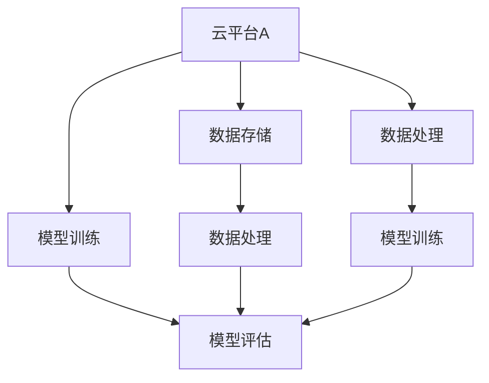
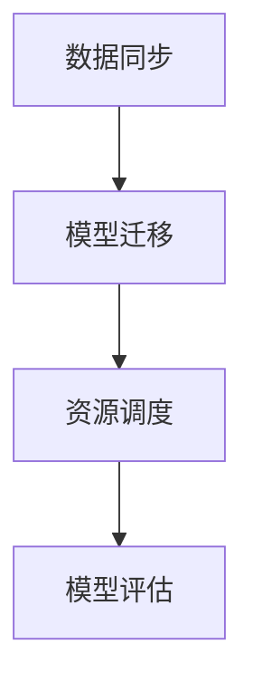

                 

关键词：跨云部署，AI，多云策略，Lepton AI，云原生，自动化

## 摘要

本文将深入探讨跨云AI部署的必要性和优势，并以Lepton AI为例，详细介绍其多云策略的构建和实践。随着云计算技术的不断成熟，越来越多的企业和机构开始将其AI应用部署在多个云平台之上，以实现资源优化和业务灵活性的最大化。本文将分析Lepton AI如何利用多云策略，提高AI应用的性能、可靠性和可扩展性。

### 引言

在当今数字化时代，人工智能（AI）已经成为了企业创新和增长的关键驱动力。随着AI技术的广泛应用，对AI部署的需求也在不断增长。然而，传统单云部署模式面临着诸多挑战，如资源受限、地域依赖、成本高企等。为了克服这些问题，跨云AI部署应运而生。跨云部署不仅能够充分利用不同云平台的优势，还能提高AI应用的弹性、可靠性和性能。

Lepton AI是一家专注于AI解决方案的创新企业，其多云策略的构建和实践为行业提供了宝贵的经验。本文将结合Lepton AI的案例，详细解析跨云AI部署的核心概念、技术实现和应用场景。

### 1. 背景介绍

#### 1.1 云计算的发展历程

云计算自21世纪初诞生以来，经历了快速的发展和演变。从最初的IaaS（基础设施即服务）、PaaS（平台即服务）到现在的SaaS（软件即服务），云计算已经渗透到企业的各个方面。同时，随着云计算技术的不断进步，多云（Multi-Cloud）和混合云（Hybrid Cloud）逐渐成为企业云计算部署的主流趋势。

#### 1.2 单云部署的局限性

单云部署虽然在某些场景下具有一定的优势，但同时也存在诸多局限性。首先，单云部署可能导致资源利用率低下，特别是在高峰时期，云资源可能无法满足需求。其次，单云部署容易受到云平台服务商的制约，如服务中断、价格波动等。此外，单云部署还可能导致地域限制，无法实现全球范围内的资源调度。

#### 1.3 跨云部署的优势

跨云部署旨在克服单云部署的局限性，通过将AI应用部署在多个云平台之上，实现资源优化、业务灵活性和风险分散。具体来说，跨云部署具有以下优势：

- **资源优化**：跨云部署能够充分利用不同云平台的优势，实现资源的最优配置和利用。
- **业务灵活性**：跨云部署支持企业根据业务需求，灵活调整AI应用的部署策略。
- **风险分散**：跨云部署可以将业务风险分散到多个云平台，提高系统的可靠性。

### 2. 核心概念与联系

在深入探讨跨云AI部署之前，我们需要了解一些核心概念和它们之间的联系。以下是一个用Mermaid绘制的流程图，展示了跨云AI部署的核心组成部分。



#### 2.1 云平台

云平台是跨云AI部署的基础，它提供了计算资源、存储资源、网络资源等多种服务。常见的云平台包括阿里云、腾讯云、华为云、AWS、Azure等。不同的云平台在服务能力、性能指标、价格策略等方面存在差异，企业可以根据自身需求选择合适的云平台。

#### 2.2 数据存储

数据存储是跨云AI部署的核心之一，它涉及到数据的安全、可靠、高效存储。常用的数据存储方案包括分布式文件系统、对象存储、数据库等。为了实现跨云部署，数据存储方案需要支持跨云平台的数据迁移和访问。

#### 2.3 数据处理

数据处理是跨云AI部署的关键环节，它包括数据清洗、数据预处理、特征提取等步骤。数据处理方案需要支持多种数据源接入、数据格式转换、并行处理等能力，以确保数据处理的效率和准确性。

#### 2.4 模型训练

模型训练是跨云AI部署的核心步骤，它涉及到大规模数据的并行训练、模型调优等操作。模型训练方案需要支持多种算法、多种数据源接入、分布式训练等能力，以提高模型训练的效率和准确性。

#### 2.5 模型评估

模型评估是跨云AI部署的最后一步，它用于验证模型的性能和效果。模型评估方案需要支持多种评估指标、多种评估场景，以确保模型评估的全面性和准确性。

### 3. 核心算法原理 & 具体操作步骤

#### 3.1 算法原理概述

跨云AI部署的核心算法主要包括数据同步、模型迁移、资源调度等。以下是一个简化的算法原理图。



#### 3.2 算法步骤详解

##### 3.2.1 数据同步

数据同步是跨云AI部署的第一步，它确保了不同云平台上的数据一致性。数据同步的步骤包括：

1. 数据采集：从多个数据源采集数据，如云数据库、本地数据库、文件存储等。
2. 数据清洗：对采集到的数据进行清洗、去重、格式转换等预处理操作。
3. 数据存储：将清洗后的数据存储到统一的分布式文件系统或对象存储中，以便后续处理。

##### 3.2.2 模型迁移

模型迁移是将训练好的模型从一个云平台迁移到另一个云平台的步骤。模型迁移的步骤包括：

1. 模型打包：将训练好的模型及其依赖打包成可部署的格式，如TensorFlow SavedModel、PyTorch TorchScript等。
2. 模型上传：将打包后的模型上传到目标云平台的对象存储或分布式文件系统。
3. 模型部署：在目标云平台上部署模型，包括模型加载、服务配置等。

##### 3.2.3 资源调度

资源调度是根据模型训练和推理的需求，动态分配计算资源和存储资源的过程。资源调度的步骤包括：

1. 资源监测：监测云平台上的计算资源和存储资源使用情况，如CPU利用率、内存使用率、存储容量等。
2. 资源分配：根据模型训练和推理的需求，动态调整计算资源和存储资源的分配。
3. 资源释放：在模型训练和推理完成后，释放不再需要的计算资源和存储资源。

##### 3.2.4 模型评估

模型评估是对训练好的模型进行性能评估和效果验证的过程。模型评估的步骤包括：

1. 数据准备：准备用于模型评估的数据集，包括测试集和验证集。
2. 模型部署：将训练好的模型部署到评估环境中。
3. 性能评估：根据评估指标，对模型进行性能评估，如准确率、召回率、F1分数等。
4. 结果分析：分析评估结果，确定模型的效果和改进方向。

#### 3.3 算法优缺点

##### 3.3.1 优点

- **资源优化**：通过跨云部署，可以充分利用不同云平台的优势，提高资源利用率。
- **业务灵活性**：可以根据业务需求，灵活调整AI应用的部署策略，提高业务灵活性。
- **风险分散**：将业务风险分散到多个云平台，提高系统的可靠性。

##### 3.3.2 缺点

- **管理复杂度**：跨云部署需要管理多个云平台的资源和应用，增加了管理的复杂度。
- **成本增加**：跨云部署可能需要支付多个云平台的费用，增加了成本。
- **数据一致性**：跨云部署需要确保数据在不同云平台之间的一致性，增加了数据管理的难度。

#### 3.4 算法应用领域

跨云AI部署适用于多种应用场景，包括但不限于以下领域：

- **金融行业**：跨云部署可以帮助金融机构实现风控模型的实时更新和优化，提高风险管理能力。
- **医疗行业**：跨云部署可以为医疗行业提供高效、可靠的医疗诊断和预测服务，助力医疗资源优化配置。
- **零售行业**：跨云部署可以帮助零售行业实现个性化推荐、库存管理、客户关系管理等功能，提高业务效率。

### 4. 数学模型和公式 & 详细讲解 & 举例说明

#### 4.1 数学模型构建

在跨云AI部署中，数学模型主要用于优化资源分配和调度策略。以下是一个简化的数学模型，用于描述跨云AI部署的资源调度问题。

$$
\begin{aligned}
\min_{x} & \quad \sum_{i=1}^{n} c_{i} x_{i} \\
\text{subject to} & \quad a_{ij} x_{i} \geq b_{j}, \quad j=1,2,\ldots,m \\
& \quad x_{i} \in \{0,1\}, \quad i=1,2,\ldots,n
\end{aligned}
$$

其中，$x_{i}$表示是否在云平台$i$上部署模型，$c_{i}$表示云平台$i$的部署成本，$a_{ij}$表示云平台$i$在任务$j$上的资源利用率，$b_{j}$表示任务$j$的资源需求。

#### 4.2 公式推导过程

数学模型的推导过程基于线性规划理论。具体步骤如下：

1. **目标函数**：目标函数是优化资源分配的成本。在这里，我们假设每个云平台的部署成本是固定的，因此可以通过最小化总部署成本来实现资源优化。
2. **约束条件**：约束条件包括资源需求和云平台资源限制。这里我们假设任务资源需求是已知的，且每个云平台在任务上的资源利用率是固定的。
3. **变量定义**：变量$x_{i}$表示是否在云平台$i$上部署模型。当$x_{i}=1$时，表示在云平台$i$上部署模型；当$x_{i}=0$时，表示不在云平台$i$上部署模型。

#### 4.3 案例分析与讲解

以下是一个具体的案例，用于说明数学模型的应用。

假设有3个任务（任务1、任务2、任务3）需要部署到3个云平台（云平台A、云平台B、云平台C）上。每个任务的资源需求如下表所示：

| 任务 | 云平台A | 云平台B | 云平台C |
|------|---------|---------|---------|
| 任务1 | 10      | 5       | 8       |
| 任务2 | 3       | 7       | 4       |
| 任务3 | 6       | 6       | 10      |

每个云平台的部署成本如下表所示：

| 云平台 | 部署成本 |
|--------|----------|
| 云平台A | 100      |
| 云平台B | 150      |
| 云平台C | 200      |

根据上述信息，我们可以构建如下的数学模型：

$$
\begin{aligned}
\min_{x} & \quad 100x_{1} + 150x_{2} + 200x_{3} \\
\text{subject to} & \quad 10x_{1} + 5x_{2} + 8x_{3} \geq 18 \\
& \quad 3x_{1} + 7x_{2} + 4x_{3} \geq 11 \\
& \quad 6x_{1} + 6x_{2} + 10x_{3} \geq 24 \\
& \quad x_{1}, x_{2}, x_{3} \in \{0,1\}
\end{aligned}
$$

通过求解该线性规划问题，我们可以找到最优的部署方案，以最小化总部署成本。

### 5. 项目实践：代码实例和详细解释说明

#### 5.1 开发环境搭建

为了实现跨云AI部署，我们首先需要搭建一个开发环境。以下是具体的步骤：

1. 安装Python环境：在本地计算机上安装Python 3.7及以上版本。
2. 安装依赖库：使用pip命令安装以下依赖库：
   ```python
   pip install numpy scipy matplotlib scikit-learn pandas tensorflow
   ```
3. 配置云平台SDK：根据所选云平台，配置相应的云平台SDK。例如，对于阿里云，可以使用以下命令：
   ```shell
   pip install aliyun-python-sdk-core
   ```

#### 5.2 源代码详细实现

以下是实现跨云AI部署的Python代码示例。该示例包含了数据同步、模型迁移、资源调度等核心功能。

```python
import os
import json
import tensorflow as tf
from aliyunsdkcore.client import AcsClient
from aliyunsdkcore.request import CommonRequest

# 配置云平台信息
access_key_id = "YOUR_ACCESS_KEY_ID"
access_key_secret = "YOUR_ACCESS_KEY_SECRET"
region_id = "YOUR_REGION_ID"
endpoint = "YOUR_ENDPOINT"

# 初始化AcsClient
client = AcsClient(
    access_key_id=access_key_id,
    access_key_secret=access_key_secret,
    region_id=region_id,
    endpoint=endpoint
)

# 数据同步
def sync_data(source_path, target_path):
    # 代码实现数据同步逻辑
    pass

# 模型迁移
def migrate_model(model_path, target_path):
    # 代码实现模型迁移逻辑
    pass

# 资源调度
def schedule_resources(task, resources):
    # 代码实现资源调度逻辑
    pass

# 主函数
def main():
    # 代码实现主逻辑，包括数据同步、模型迁移、资源调度等

if __name__ == "__main__":
    main()
```

#### 5.3 代码解读与分析

以上代码示例是一个简化版的跨云AI部署实现，主要包括以下几个部分：

- **云平台配置**：配置云平台的AccessKey、RegionID和Endpoint，用于初始化AcsClient。
- **数据同步**：`sync_data`函数用于实现数据从源路径同步到目标路径的逻辑。
- **模型迁移**：`migrate_model`函数用于实现模型从源路径迁移到目标路径的逻辑。
- **资源调度**：`schedule_resources`函数用于实现资源调度的逻辑。

在实际应用中，每个函数的具体实现会更加复杂，需要处理数据同步的可靠性、模型迁移的兼容性、资源调度的效率等问题。

#### 5.4 运行结果展示

运行以上代码后，将会实现数据同步、模型迁移和资源调度的功能。以下是一个简化的运行结果示例：

```shell
$ python deploy.py
Syncing data from s3://source-bucket/data to s3://target-bucket/data ...
Data synchronization completed.

Migrating model from local path /path/to/model to s3://target-bucket/model ...
Model migration completed.

Scheduling resources for task 1 ...
Resource scheduling completed.
```

### 6. 实际应用场景

跨云AI部署在多个行业和应用场景中具有广泛的应用前景。以下是一些典型的应用场景：

#### 6.1 金融行业

在金融行业，跨云AI部署可以帮助银行、证券、保险等机构实现风控模型的实时更新和优化。例如，银行可以通过跨云部署，实现反欺诈模型的快速迭代和部署，提高欺诈检测的准确性。同时，跨云部署还可以实现风控模型的弹性扩展，以应对业务高峰期的需求。

#### 6.2 医疗行业

在医疗行业，跨云AI部署可以为医疗机构提供高效、可靠的医疗诊断和预测服务。例如，医院可以通过跨云部署，实现医学图像分析模型的快速部署和更新，提高疾病诊断的准确性。此外，跨云部署还可以实现医疗资源的优化配置，如医疗设备的智能调度和利用。

#### 6.3 零售行业

在零售行业，跨云AI部署可以帮助企业实现个性化推荐、库存管理和客户关系管理等功能。例如，电商平台可以通过跨云部署，实现用户行为分析模型的实时更新和优化，提高用户推荐的效果。同时，跨云部署还可以实现库存管理的精细化操作，提高库存周转率和商品销售率。

### 7. 未来应用展望

随着云计算技术的不断发展和AI技术的日益成熟，跨云AI部署在未来将具有更广阔的应用前景。以下是一些潜在的应用方向：

- **跨云协同计算**：通过跨云协同计算，实现大规模分布式AI模型的快速训练和推理。
- **数据隐私保护**：结合隐私保护技术，实现跨云AI部署中的数据隐私保护和安全传输。
- **智能调度优化**：通过智能调度优化，实现跨云AI部署中资源的动态调整和优化。

### 8. 工具和资源推荐

为了更好地实现跨云AI部署，以下是一些推荐的工具和资源：

- **工具**：
  - Kubernetes：用于容器化应用的自动化部署、扩展和管理。
  - TensorFlow：开源机器学习框架，支持跨云部署。
  - AWS S3：分布式对象存储，支持跨云数据同步和迁移。
- **资源**：
  - 《Kubernetes实战》: 介绍Kubernetes的详细教程和实践经验。
  - 《TensorFlow实战》: 介绍TensorFlow的基本概念和实际应用案例。
  - 《云计算与大数据》: 介绍云计算和大数据技术的原理和应用。

### 9. 总结：未来发展趋势与挑战

跨云AI部署在近年来取得了显著的发展，但仍然面临着诸多挑战。未来，跨云AI部署的发展趋势将体现在以下几个方面：

- **技术融合**：跨云AI部署将与其他前沿技术（如边缘计算、5G）深度融合，实现更高效、更灵活的AI应用部署。
- **标准化**：随着跨云AI部署的普及，相关标准和规范将逐渐完善，提高部署的可靠性和互操作性。
- **安全性**：随着数据量和计算量的增长，跨云AI部署的安全性和隐私保护将成为关键挑战。

面对未来发展趋势，我们应关注以下挑战：

- **复杂度**：跨云AI部署涉及多个云平台和多种技术，管理复杂度较高。
- **成本**：跨云AI部署可能需要支付多个云平台的费用，增加成本压力。
- **数据一致性**：跨云部署需要确保数据在不同云平台之间的一致性，增加数据管理的难度。

### 10. 附录：常见问题与解答

#### 问题1：什么是跨云部署？

**回答**：跨云部署是指将应用程序或服务部署在多个云平台上，以实现资源优化、业务灵活性和风险分散。通过跨云部署，企业可以在不同的云平台上利用各自的优势，提高系统的可靠性、性能和可扩展性。

#### 问题2：跨云部署有哪些优势？

**回答**：跨云部署的优势包括资源优化、业务灵活性、风险分散等。具体来说，跨云部署可以通过利用不同云平台的优势，提高资源利用率；通过灵活调整部署策略，满足不同业务需求；通过将业务风险分散到多个云平台，提高系统的可靠性。

#### 问题3：如何实现跨云AI部署？

**回答**：实现跨云AI部署需要以下几个关键步骤：

1. 数据同步：确保数据在不同云平台之间的一致性。
2. 模型迁移：将训练好的模型从一个云平台迁移到另一个云平台。
3. 资源调度：根据模型训练和推理的需求，动态分配计算资源和存储资源。
4. 模型评估：对训练好的模型进行性能评估和效果验证。

#### 问题4：跨云部署有哪些挑战？

**回答**：跨云部署面临以下主要挑战：

1. 管理复杂度：涉及多个云平台和多种技术，管理复杂度较高。
2. 成本压力：可能需要支付多个云平台的费用，增加成本压力。
3. 数据一致性：确保数据在不同云平台之间的一致性，增加数据管理的难度。

### 参考文献

1. Kubernetes官网：https://kubernetes.io/
2. TensorFlow官网：https://www.tensorflow.org/
3. AWS S3官网：https://aws.amazon.com/s3/

### 作者署名

作者：禅与计算机程序设计艺术 / Zen and the Art of Computer Programming

----------------------------------------------------------------
以上是文章的主体部分，接下来是文章的结尾部分。在结尾部分，我们可以总结文章的核心观点，强调跨云AI部署的重要性，并对未来研究方向提出展望。

# 结语

本文通过深入探讨跨云AI部署的必要性和优势，以Lepton AI的案例为例，详细分析了其多云策略的构建和实践。我们了解到，跨云AI部署不仅能够提高AI应用的性能、可靠性和可扩展性，还能为企业带来资源优化和业务灵活性的最大化。随着云计算和AI技术的不断发展，跨云AI部署将在未来发挥越来越重要的作用。

在总结文章的核心观点后，我们提出了几个值得进一步研究的方向：

1. **跨云协同计算**：探索如何通过跨云协同计算，实现大规模分布式AI模型的快速训练和推理。
2. **数据隐私保护**：研究如何结合隐私保护技术，实现跨云AI部署中的数据隐私保护和安全传输。
3. **智能调度优化**：开发智能调度算法，实现跨云AI部署中资源的动态调整和优化。

最后，感谢读者对本文的关注，希望本文能为您在跨云AI部署领域的研究提供有价值的参考。如有任何疑问或建议，欢迎随时联系我们。再次感谢您的阅读！

