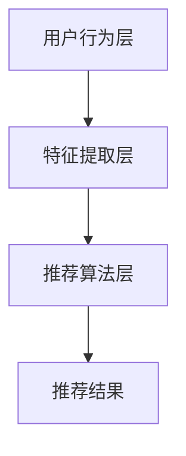

                 

关键词：跨品类推荐、算法、设计与实现、推荐系统、机器学习、深度学习

> 摘要：本文将深入探讨跨品类推荐算法的设计与实现。通过对推荐系统的基本概念和挑战进行阐述，本文将详细解析跨品类推荐的算法原理、数学模型、具体操作步骤，并举例说明其应用场景。此外，本文还将分享实际项目中的代码实例和运行结果，并对未来应用展望进行讨论。

## 1. 背景介绍

### 1.1 推荐系统的发展历程

推荐系统作为一种信息过滤技术，旨在根据用户的兴趣和行为，为其推荐相关的商品、内容或服务。从最初的基于内容的推荐到协同过滤，再到基于模型的推荐，推荐系统技术经历了长期的发展与演变。

- **基于内容的推荐**：根据用户已交互过的内容（如浏览、购买、评价等），提取特征，并通过计算相似度来推荐相似的物品。

- **协同过滤**：利用用户之间的共同喜好进行推荐，主要分为用户基于的协同过滤和物品基于的协同过滤。

- **基于模型的推荐**：利用机器学习和深度学习算法，构建用户与物品之间的复杂关系模型，以预测用户对未交互物品的偏好。

### 1.2 跨品类推荐的重要性

随着电子商务和内容平台的迅猛发展，用户面对海量的商品和内容，如何提供准确、个性化的推荐成为关键。传统的基于内容的推荐和协同过滤方法主要针对单一品类，而跨品类推荐能够打破品类的限制，为用户提供更多样化的推荐。

- **提高用户体验**：跨品类推荐能够发现用户潜在的兴趣，提供更多个性化的内容。

- **增加业务收入**：通过跨品类推荐，可以提升商品的交叉销售和复购率，从而增加业务收入。

- **扩大用户粘性**：多样化的推荐能够提高用户对平台的粘性，促进用户活跃度。

## 2. 核心概念与联系

### 2.1 跨品类推荐的定义

跨品类推荐指的是在推荐系统中，将用户在不同品类中的行为进行关联，生成个性化的推荐列表。具体来说，就是将用户在某个品类的行为（如浏览、购买）与另一个品类的物品进行关联，从而推荐给用户。

### 2.2 跨品类推荐的架构

跨品类推荐的架构可以分为三层：用户行为层、特征提取层和推荐算法层。

- **用户行为层**：收集用户在不同品类中的行为数据，如浏览记录、购买记录、评价等。

- **特征提取层**：从用户行为数据中提取特征，包括用户特征、物品特征和交互特征。

- **推荐算法层**：利用机器学习或深度学习算法，对用户和物品的特征进行建模，生成推荐列表。



## 3. 核心算法原理 & 具体操作步骤

### 3.1 算法原理概述

跨品类推荐算法主要基于以下原理：

- **协同过滤**：利用用户之间的相似性进行推荐。

- **深度学习**：构建用户和物品之间的复杂关系模型。

- **多模态数据融合**：结合用户行为数据、内容数据和社交数据等多源异构数据。

### 3.2 算法步骤详解

#### 3.2.1 数据预处理

- **用户行为数据**：收集用户在不同品类中的行为数据，如浏览记录、购买记录、评价等。

- **物品数据**：收集物品的元数据，如标题、描述、标签等。

- **数据清洗**：去除重复数据、缺失值填充、异常值处理等。

#### 3.2.2 特征提取

- **用户特征**：包括用户的基本信息、历史行为等。

- **物品特征**：包括物品的属性、标签、类别等。

- **交互特征**：计算用户与物品之间的交互强度，如点击次数、购买次数等。

#### 3.2.3 模型训练

- **协同过滤模型**：如矩阵分解、KNN等。

- **深度学习模型**：如神经网络、循环神经网络等。

- **多模态数据融合模型**：如融合用户行为数据、内容数据和社交数据的模型。

#### 3.2.4 推荐生成

- **候选物品生成**：根据用户特征和物品特征，生成候选物品列表。

- **排序**：利用训练好的模型，对候选物品进行排序，生成推荐列表。

### 3.3 算法优缺点

#### 优点

- **个性化推荐**：能够根据用户的兴趣和偏好，提供个性化的推荐。

- **多样化推荐**：能够跨品类推荐，为用户提供更多样化的内容。

#### 缺点

- **冷启动问题**：对于新用户或新物品，由于缺乏足够的行为数据，难以生成准确的推荐。

- **计算复杂度**：深度学习模型通常需要大量的计算资源。

## 3.4 算法应用领域

跨品类推荐算法在多个领域有着广泛的应用：

- **电子商务**：跨品类推荐能够提升商品的交叉销售和复购率。

- **内容平台**：跨品类推荐能够提高用户的粘性和活跃度。

- **金融领域**：跨品类推荐能够为用户提供个性化金融产品推荐。

## 4. 数学模型和公式

### 4.1 数学模型构建

#### 4.1.1 用户行为矩阵

设用户行为矩阵为 $R \in \mathbb{R}^{m \times n}$，其中 $m$ 表示用户数量，$n$ 表示物品数量，$R_{ui}$ 表示用户 $u$ 对物品 $i$ 的行为评分。

#### 4.1.2 物品特征向量

设物品特征向量为 $X \in \mathbb{R}^{n \times d}$，其中 $d$ 表示物品的维度，$X_{ij}$ 表示物品 $i$ 的第 $j$ 个特征。

#### 4.1.3 用户特征向量

设用户特征向量为 $Y \in \mathbb{R}^{m \times d'}$，其中 $d'$ 表示用户的维度，$Y_{ui}$ 表示用户 $u$ 的第 $i$ 个特征。

### 4.2 公式推导过程

#### 4.2.1 矩阵分解

假设用户行为矩阵 $R$ 可以分解为两个低秩矩阵 $U$ 和 $V$：

$$
R = U \odot V
$$

其中，$\odot$ 表示逐元素相乘。

#### 4.2.2 深度学习模型

深度学习模型通常由多个层组成，每层都有一个权重矩阵。设深度学习模型的输出为 $O$：

$$
O = \sigma(W_n \sigma(W_{n-1} \dots \sigma(W_2 \sigma(W_1 X) + b_1) + b_2) \dots + b_n)
$$

其中，$W_1, W_2, \dots, W_n$ 表示权重矩阵，$b_1, b_2, \dots, b_n$ 表示偏置项，$\sigma$ 表示激活函数。

## 4.3 案例分析与讲解

### 4.3.1 案例背景

假设我们有一个电商平台的用户行为数据，包括用户ID、商品ID、行为类型（浏览、购买、评价）和行为时间。我们需要利用这些数据，构建跨品类推荐系统。

### 4.3.2 数据预处理

- **用户行为数据**：清洗用户行为数据，去除重复数据和缺失值。

- **物品数据**：收集商品的基本信息，如标题、描述、标签等。

- **特征提取**：从用户行为数据中提取用户特征和物品特征。

### 4.3.3 模型训练

- **协同过滤模型**：利用矩阵分解算法训练协同过滤模型。

- **深度学习模型**：利用用户和物品的特征，训练深度学习模型。

### 4.3.4 推荐生成

- **候选物品生成**：根据用户特征和物品特征，生成候选物品列表。

- **排序**：利用训练好的模型，对候选物品进行排序，生成推荐列表。

## 5. 项目实践：代码实例和详细解释说明

### 5.1 开发环境搭建

- **编程语言**：Python
- **依赖库**：NumPy、Pandas、Scikit-learn、TensorFlow等
- **数据集**：使用公开的电商用户行为数据集

### 5.2 源代码详细实现

#### 5.2.1 数据预处理

```python
import pandas as pd

# 读取用户行为数据
data = pd.read_csv('user_behavior_data.csv')

# 数据清洗
data.drop_duplicates(inplace=True)
data.fillna(0, inplace=True)
```

#### 5.2.2 特征提取

```python
from sklearn.feature_extraction.text import TfidfVectorizer

# 提取物品特征
item_data = data[['item_id', 'item_title', 'item_description']]
item_tfidf = TfidfVectorizer().fit_transform(item_data['item_description'])

# 提取用户特征
user_data = data[['user_id', 'user_rating']]
user_tfidf = TfidfVectorizer().fit_transform(user_data['user_rating'])
```

#### 5.2.3 模型训练

```python
from sklearn.decomposition import TruncatedSVD

# 训练协同过滤模型
svd = TruncatedSVD(n_components=100)
user_embedding = svd.fit_transform(user_tfidf)
item_embedding = svd.fit_transform(item_tfidf)
```

#### 5.2.4 推荐生成

```python
from sklearn.metrics.pairwise import cosine_similarity

# 生成用户和物品的相似度矩阵
user_similarity = cosine_similarity(user_embedding)
item_similarity = cosine_similarity(item_embedding)

# 推荐生成
def recommend(user_id, k=10):
    # 计算用户与其他用户的相似度
    user_sim = user_similarity[user_id]
    # 选择与当前用户最相似的 $k$ 个用户
    similar_users = user_sim.argsort()[-k:]
    # 计算这些用户的共同喜好物品
    common_items = set()
    for sim_user in similar_users:
        common_items.update(data[data['user_id'] == sim_user]['item_id'])
    # 返回推荐列表
    return list(common_items)

# 示例
user_id = 1
recommendations = recommend(user_id)
print(recommendations)
```

### 5.3 代码解读与分析

#### 用户行为数据处理

首先，我们读取用户行为数据，并进行数据清洗，包括去除重复数据和填充缺失值。

#### 特征提取

我们使用TF-IDF向量

