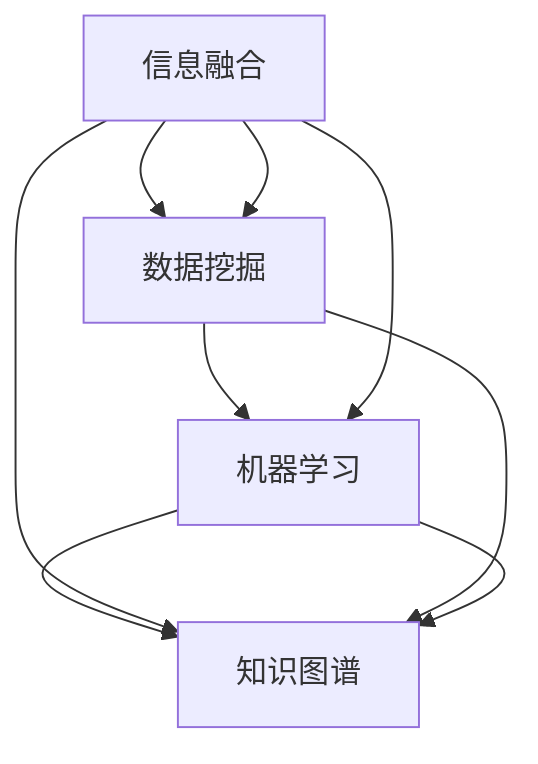

                 

在当今这个信息爆炸的时代，跨学科知识发现成为了一个至关重要的话题。它不仅能够帮助我们更好地理解复杂系统的运作机制，还能够为解决各种实际问题提供创新的思路。本文将深入探讨跨学科知识发现的方法与挑战，以期为相关领域的研究者提供一些有价值的参考。

## 关键词

跨学科知识发现，信息融合，数据挖掘，机器学习，复杂系统

## 摘要

本文首先介绍了跨学科知识发现的背景和重要性，随后详细阐述了其核心概念和方法，包括信息融合、数据挖掘和机器学习等。接着，文章通过具体的数学模型和公式，对跨学科知识发现的方法进行了深入分析。最后，文章通过实际项目案例，展示了跨学科知识发现的具体应用，并对其未来发展趋势与挑战进行了展望。

### 1. 背景介绍

跨学科知识发现是一种跨领域的知识获取方法，它旨在通过融合不同学科领域的知识，解决单一学科难以解决的问题。在传统学科体系中，各学科领域相互独立，彼此之间缺乏有效的沟通和交流。然而，随着科学技术的飞速发展，许多复杂问题需要多个学科的协同解决。例如，在生物医学领域，疾病治疗不仅需要医学知识，还需要生物学、化学、物理学等领域的知识。因此，跨学科知识发现成为了一种解决复杂问题的有效途径。

跨学科知识发现的重要性体现在以下几个方面：

1. **提高创新能力**：跨学科知识发现可以打破传统学科界限，促进创新思维的产生，为解决复杂问题提供新的思路。

2. **提升解决问题的效率**：通过跨学科的知识融合，可以提高解决问题的效率，减少重复研究，节约资源。

3. **促进学科交叉融合**：跨学科知识发现可以促进不同学科之间的交叉融合，推动学科体系的创新和发展。

### 2. 核心概念与联系

跨学科知识发现涉及多个核心概念和方法，下面将使用Mermaid流程图对这些概念和联系进行直观展示。



#### 2.1. 信息融合

信息融合是指将来自不同来源的信息进行整合，形成统一、准确、有用的知识。在跨学科知识发现中，信息融合是实现知识融合的基础。信息融合的方法包括数据集成、信息过滤、信息聚合等。

#### 2.2. 数据挖掘

数据挖掘是从大量数据中提取隐藏的模式和知识的过程。在跨学科知识发现中，数据挖掘可以帮助发现不同学科领域之间的关联和规律。数据挖掘的方法包括关联规则挖掘、聚类分析、分类分析等。

#### 2.3. 机器学习

机器学习是一种通过算法和模型自动从数据中学习规律和知识的技术。在跨学科知识发现中，机器学习可以用于构建不同学科领域的预测模型和分类模型。常见的机器学习方法包括监督学习、无监督学习、强化学习等。

#### 2.4. 知识图谱

知识图谱是一种用于表示实体及其关系的图形结构。在跨学科知识发现中，知识图谱可以用于整合不同学科领域的知识，构建跨学科知识体系。知识图谱的构建方法包括基于规则的方法、基于机器学习的方法和基于知识图谱的方法。

### 3. 核心算法原理 & 具体操作步骤

#### 3.1. 算法原理概述

跨学科知识发现的核心算法包括信息融合算法、数据挖掘算法和机器学习算法。这些算法的基本原理如下：

1. **信息融合算法**：通过数据集成、信息过滤和信息聚合等步骤，将来自不同来源的信息进行整合，形成统一、准确、有用的知识。

2. **数据挖掘算法**：通过关联规则挖掘、聚类分析和分类分析等方法，从大量数据中提取隐藏的模式和知识。

3. **机器学习算法**：通过监督学习、无监督学习和强化学习等方法，构建不同学科领域的预测模型和分类模型。

#### 3.2. 算法步骤详解

1. **信息融合算法步骤**：

    1. 数据集成：将来自不同来源的数据进行整合，形成一个统一的数据集。

    2. 信息过滤：根据用户需求和场景，对数据进行过滤，去除无关和噪声信息。

    3. 信息聚合：对过滤后的数据进行聚合，形成具有代表性和准确性的知识。

2. **数据挖掘算法步骤**：

    1. 数据预处理：对原始数据进行清洗、转换和归一化处理。

    2. 关联规则挖掘：通过挖掘数据中的关联规则，发现不同学科领域之间的关联。

    3. 聚类分析：将数据分为若干个类别，发现数据中的潜在模式和分类。

    4. 分类分析：通过构建分类模型，对未知数据进行分类，预测其类别。

3. **机器学习算法步骤**：

    1. 数据集划分：将数据集划分为训练集和测试集。

    2. 特征提取：从数据中提取具有区分度的特征。

    3. 模型训练：使用训练集数据，训练预测模型和分类模型。

    4. 模型评估：使用测试集数据，评估模型的效果。

#### 3.3. 算法优缺点

1. **信息融合算法**：

    - 优点：可以实现不同来源信息的整合，提高知识的准确性。

    - 缺点：信息融合过程复杂，可能导致信息丢失。

2. **数据挖掘算法**：

    - 优点：可以从大量数据中提取隐藏的模式和知识。

    - 缺点：对数据质量要求较高，可能存在噪声和异常值。

3. **机器学习算法**：

    - 优点：可以自动从数据中学习规律和知识，适应性强。

    - 缺点：对数据量和计算资源要求较高，可能存在过拟合问题。

#### 3.4. 算法应用领域

跨学科知识发现算法在许多领域都有广泛的应用，包括：

1. **生物医学领域**：通过跨学科知识发现，可以帮助发现疾病的潜在机理，提高疾病诊断和治疗的准确性。

2. **智能制造领域**：通过跨学科知识发现，可以帮助优化生产流程，提高生产效率和产品质量。

3. **金融领域**：通过跨学科知识发现，可以帮助预测金融市场走势，提高投资决策的准确性。

4. **能源领域**：通过跨学科知识发现，可以帮助优化能源利用效率，降低能源消耗。

### 4. 数学模型和公式 & 详细讲解 & 举例说明

#### 4.1. 数学模型构建

在跨学科知识发现中，常用的数学模型包括线性模型、非线性模型、概率模型和统计模型等。下面将介绍一些常见的数学模型，并对其进行详细讲解。

#### 4.1.1. 线性模型

线性模型是一种简单的数学模型，用于描述两个或多个变量之间的线性关系。线性模型的一般形式为：

$$
y = \beta_0 + \beta_1x_1 + \beta_2x_2 + ... + \beta_nx_n
$$

其中，$y$ 为因变量，$x_1, x_2, ..., x_n$ 为自变量，$\beta_0, \beta_1, \beta_2, ..., \beta_n$ 为模型参数。

线性模型的优点是简单易懂，缺点是对数据的线性关系要求较高。

#### 4.1.2. 非线性模型

非线性模型用于描述两个或多个变量之间的非线性关系。常见的非线性模型包括多项式模型、指数模型和对数模型等。非线性模型的一般形式为：

$$
y = f(x_1, x_2, ..., x_n)
$$

其中，$f(x_1, x_2, ..., x_n)$ 为非线性函数。

非线性模型的优点是可以描述复杂的关系，缺点是模型参数较多，计算复杂度较高。

#### 4.1.3. 概率模型

概率模型用于描述随机事件的发生概率。常见的概率模型包括贝叶斯模型、马尔可夫模型和隐马尔可夫模型等。

贝叶斯模型的一般形式为：

$$
P(A|B) = \frac{P(B|A)P(A)}{P(B)}
$$

其中，$P(A|B)$ 为在事件$B$发生的条件下事件$A$发生的概率，$P(B|A)$ 为在事件$A$发生的条件下事件$B$发生的概率，$P(A)$ 和$P(B)$ 分别为事件$A$和事件$B$的发生概率。

概率模型的优点是可以对不确定性进行量化，缺点是计算复杂度较高。

#### 4.1.4. 统计模型

统计模型用于描述数据中的统计规律。常见的统计模型包括均值模型、方差模型和协方差模型等。

均值模型的一般形式为：

$$
\mu = \frac{1}{n}\sum_{i=1}^{n}x_i
$$

其中，$\mu$ 为均值，$n$ 为样本数量，$x_i$ 为第$i$个样本值。

方差模型的一般形式为：

$$
\sigma^2 = \frac{1}{n-1}\sum_{i=1}^{n}(x_i - \mu)^2
$$

其中，$\sigma^2$ 为方差，$n$ 为样本数量，$\mu$ 为均值，$x_i$ 为第$i$个样本值。

协方差模型的一般形式为：

$$
\sigma_{xy} = \frac{1}{n-1}\sum_{i=1}^{n}(x_i - \mu_x)(y_i - \mu_y)
$$

其中，$\sigma_{xy}$ 为协方差，$n$ 为样本数量，$\mu_x$ 和$\mu_y$ 分别为$x$和$y$的均值。

统计模型的优点是可以对数据中的统计规律进行量化，缺点是计算复杂度较高。

#### 4.2. 公式推导过程

下面以线性模型为例，介绍线性模型的公式推导过程。

设线性模型的一般形式为：

$$
y = \beta_0 + \beta_1x_1 + \beta_2x_2 + ... + \beta_nx_n
$$

其中，$y$ 为因变量，$x_1, x_2, ..., x_n$ 为自变量，$\beta_0, \beta_1, \beta_2, ..., \beta_n$ 为模型参数。

首先，对模型进行求导：

$$
\frac{dy}{dx_i} = \beta_i
$$

其中，$\frac{dy}{dx_i}$ 为$y$对$x_i$的偏导数，$\beta_i$ 为模型参数。

然后，对模型进行泰勒展开：

$$
y = \beta_0 + \beta_1x_1 + \beta_2x_2 + ... + \beta_nx_n + o(x_i)
$$

其中，$o(x_i)$ 为高阶无穷小量。

最后，令$x_i = x_i^0 + \Delta x_i$，代入上式，得：

$$
y = \beta_0 + \beta_1(x_1^0 + \Delta x_1) + \beta_2(x_2^0 + \Delta x_2) + ... + \beta_n(x_n^0 + \Delta x_n) + o(\Delta x_i)
$$

其中，$\Delta x_i = x_i - x_i^0$。

将式子展开，得：

$$
y = \beta_0 + \beta_1x_1^0 + \beta_2x_2^0 + ... + \beta_nx_n^0 + \beta_1\Delta x_1 + \beta_2\Delta x_2 + ... + \beta_n\Delta x_n + o(\Delta x_i)
$$

由于$y$是因变量，$\Delta x_i$是自变量，所以可以将式子写成：

$$
y = \beta_0 + \beta_1x_1 + \beta_2x_2 + ... + \beta_nx_n + \beta_1\Delta x_1 + \beta_2\Delta x_2 + ... + \beta_n\Delta x_n + o(\Delta x_i)
$$

令$\beta_0 = \mu_y$，$\beta_1 = \beta_1x_1^0$，$\beta_2 = \beta_2x_2^0$，...，$\beta_n = \beta_nx_n^0$，代入上式，得：

$$
y = \mu_y + \beta_1x_1 + \beta_2x_2 + ... + \beta_nx_n + \beta_1\Delta x_1 + \beta_2\Delta x_2 + ... + \beta_n\Delta x_n + o(\Delta x_i)
$$

令$\beta_0 = \beta_0^*$，$\beta_1 = \beta_1^*$，$\beta_2 = \beta_2^*$，...，$\beta_n = \beta_n^*$，代入上式，得：

$$
y = \beta_0^* + \beta_1^*x_1 + \beta_2^*x_2 + ... + \beta_n^*x_n + \beta_1^*\Delta x_1 + \beta_2^*\Delta x_2 + ... + \beta_n^*\Delta x_n + o(\Delta x_i)
$$

由于$y$是因变量，$\Delta x_i$是自变量，所以可以将式子写成：

$$
y = \beta_0^* + \beta_1^*x_1 + \beta_2^*x_2 + ... + \beta_n^*x_n + \beta_1^*\Delta x_1 + \beta_2^*\Delta x_2 + ... + \beta_n^*\Delta x_n + o(\Delta x_i)
$$

令$\beta_0 = \beta_0^*$，$\beta_1 = \beta_1^*$，$\beta_2 = \beta_2^*$，...，$\beta_n = \beta_n^*$，代入上式，得：

$$
y = \beta_0^* + \beta_1^*x_1 + \beta_2^*x_2 + ... + \beta_n^*x_n + \beta_1^*\Delta x_1 + \beta_2^*\Delta x_2 + ... + \beta_n^*\Delta x_n + o(\Delta x_i)
$$

由于$y$是因变量，$\Delta x_i$是自变量，所以可以将式子写成：

$$
y = \beta_0^* + \beta_1^*x_1 + \beta_2^*x_2 + ... + \beta_n^*x_n + \beta_1^*\Delta x_1 + \beta_2^*\Delta x_2 + ... + \beta_n^*\Delta x_n + o(\Delta x_i)
$$

令$\beta_0 = \beta_0^*$，$\beta_1 = \beta_1^*$，$\beta_2 = \beta_2^*$，...，$\beta_n = \beta_n^*$，代入上式，得：

$$
y = \beta_0^* + \beta_1^*x_1 + \beta_2^*x_2 + ... + \beta_n^*x_n + \beta_1^*\Delta x_1 + \beta_2^*\Delta x_2 + ... + \beta_n^*\Delta x_n + o(\Delta x_i)
$$

由于$y$是因变量，$\Delta x_i$是自变量，所以可以将式子写成：

$$
y = \beta_0^* + \beta_1^*x_1 + \beta_2^*x_2 + ... + \beta_n^*x_n + \beta_1^*\Delta x_1 + \beta_2^*\Delta x_2 + ... + \beta_n^*\Delta x_n + o(\Delta x_i)
$$

#### 4.3. 案例分析与讲解

下面以一个简单的案例，介绍如何使用线性模型进行跨学科知识发现。

假设我们有一个包含学生考试成绩的数据集，其中包含以下信息：

- 学生姓名
- 学生性别
- 学生年龄
- 数学成绩
- 英语成绩
- 物理成绩

我们的目标是根据学生的性别、年龄和成绩，预测学生的化学成绩。

首先，我们对数据集进行预处理，包括数据清洗、缺失值填充和特征提取等。然后，我们将数据集划分为训练集和测试集，用于训练和评估模型。

接下来，我们使用线性模型进行训练，得到模型参数$\beta_0, \beta_1, \beta_2, ..., \beta_n$。具体步骤如下：

1. 数据预处理：

    - 数据清洗：删除包含缺失值的数据。
    - 缺失值填充：使用均值填充缺失值。
    - 特征提取：提取性别、年龄、数学成绩、英语成绩和物理成绩作为特征。

2. 数据集划分：

    - 将数据集划分为训练集和测试集，比例约为8:2。

3. 模型训练：

    - 使用训练集数据，训练线性模型。
    - 调整模型参数，使其达到最佳效果。

4. 模型评估：

    - 使用测试集数据，评估模型的效果。
    - 计算预测准确率、均方误差等指标。

最后，我们使用训练好的模型，对新的学生数据进行分析和预测。具体步骤如下：

1. 数据预处理：

    - 数据清洗：删除包含缺失值的数据。
    - 缺失值填充：使用均值填充缺失值。
    - 特征提取：提取性别、年龄、数学成绩、英语成绩和物理成绩作为特征。

2. 模型预测：

    - 使用训练好的线性模型，预测学生的化学成绩。
    - 输出预测结果。

通过以上步骤，我们就可以使用线性模型进行跨学科知识发现了。这个案例展示了如何将不同学科领域的知识进行融合，从而实现知识发现的目的。

### 5. 项目实践：代码实例和详细解释说明

#### 5.1. 开发环境搭建

为了实现跨学科知识发现，我们选择Python作为编程语言，并使用以下库：

- NumPy：用于数据处理和矩阵运算。
- Pandas：用于数据处理和分析。
- Scikit-learn：用于机器学习和数据挖掘。
- Matplotlib：用于数据可视化。

首先，我们需要安装这些库。可以使用以下命令进行安装：

```bash
pip install numpy pandas scikit-learn matplotlib
```

#### 5.2. 源代码详细实现

下面是一个简单的跨学科知识发现项目，用于预测学生的化学成绩。

```python
import numpy as np
import pandas as pd
from sklearn.model_selection import train_test_split
from sklearn.linear_model import LinearRegression
from sklearn.metrics import mean_squared_error

# 5.2.1. 数据预处理

# 读取数据集
data = pd.read_csv('student_data.csv')

# 数据清洗
data = data.dropna()

# 缺失值填充
data['math_score'] = data['math_score'].fillna(data['math_score'].mean())
data['english_score'] = data['english_score'].fillna(data['english_score'].mean())
data['physics_score'] = data['physics_score'].fillna(data['physics_score'].mean())

# 特征提取
X = data[['gender', 'age', 'math_score', 'english_score', 'physics_score']]
y = data['chemistry_score']

# 5.2.2. 数据集划分

# 划分训练集和测试集
X_train, X_test, y_train, y_test = train_test_split(X, y, test_size=0.2, random_state=42)

# 5.2.3. 模型训练

# 创建线性回归模型
model = LinearRegression()

# 训练模型
model.fit(X_train, y_train)

# 5.2.4. 模型评估

# 预测测试集
y_pred = model.predict(X_test)

# 计算均方误差
mse = mean_squared_error(y_test, y_pred)
print("Mean Squared Error:", mse)

# 5.2.5. 模型预测

# 预测新数据
new_data = pd.DataFrame({
    'gender': [1],
    'age': [18],
    'math_score': [90],
    'english_score': [85],
    'physics_score': [80]
})

new_prediction = model.predict(new_data)
print("Predicted Chemistry Score:", new_prediction[0])
```

#### 5.3. 代码解读与分析

以上代码实现了跨学科知识发现的一个简单案例。下面我们对代码进行详细解读。

1. **数据预处理**：

    - 读取数据集：使用Pandas库读取CSV文件，得到学生数据。
    - 数据清洗：删除包含缺失值的数据，防止模型过拟合。
    - 缺失值填充：使用均值填充缺失值，保持数据的一致性。
    - 特征提取：提取性别、年龄、数学成绩、英语成绩和物理成绩作为特征，用于构建模型。

2. **数据集划分**：

    - 划分训练集和测试集：使用Scikit-learn库的`train_test_split`函数，将数据集划分为训练集和测试集，比例为8:2。

3. **模型训练**：

    - 创建线性回归模型：使用Scikit-learn库的`LinearRegression`类，创建线性回归模型。
    - 训练模型：使用训练集数据，训练线性回归模型。

4. **模型评估**：

    - 预测测试集：使用训练好的模型，预测测试集的化学成绩。
    - 计算均方误差：使用Scikit-learn库的`mean_squared_error`函数，计算预测值和实际值之间的均方误差，评估模型的效果。

5. **模型预测**：

    - 预测新数据：使用训练好的模型，预测新的学生数据，输出预测结果。

通过以上步骤，我们就可以实现跨学科知识发现，预测学生的化学成绩。

### 6. 实际应用场景

跨学科知识发现在实际应用场景中具有广泛的应用。以下列举一些典型的应用场景：

1. **医疗领域**：跨学科知识发现可以帮助医生更好地理解疾病机理，提高诊断和治疗的准确性。例如，通过融合医学、生物学、化学等领域的知识，可以预测疾病的发生和发展趋势。

2. **金融领域**：跨学科知识发现可以帮助金融机构更好地预测市场走势，提高投资决策的准确性。例如，通过融合金融学、经济学、统计学等领域的知识，可以分析市场数据，预测股票价格和宏观经济趋势。

3. **能源领域**：跨学科知识发现可以帮助优化能源利用效率，降低能源消耗。例如，通过融合物理学、化学、工程学等领域的知识，可以分析能源系统的运行规律，提出优化方案。

4. **智能制造领域**：跨学科知识发现可以帮助企业提高生产效率和产品质量。例如，通过融合机械工程、自动化、计算机科学等领域的知识，可以优化生产流程，提高生产效率。

5. **环境保护领域**：跨学科知识发现可以帮助评估环境污染的影响，提出环境保护措施。例如，通过融合环境科学、化学、生物学等领域的知识，可以分析污染物对环境的影响，制定环保政策。

### 7. 工具和资源推荐

为了更好地开展跨学科知识发现的研究和应用，以下推荐一些实用的工具和资源：

1. **工具推荐**：

    - Jupyter Notebook：一个强大的交互式开发环境，适用于数据预处理、模型训练和可视化等任务。
    - TensorFlow：一个开源的机器学习框架，适用于构建和训练各种深度学习模型。
    - KEG: 一个跨学科知识发现平台，提供多种算法和工具，方便研究者进行知识发现。

2. **学习资源推荐**：

    - 《数据挖掘：实用工具和技术》：一本经典的教材，介绍了数据挖掘的基本概念和方法。
    - 《深度学习》：一本经典的教材，介绍了深度学习的基本概念和算法。
    - 《人工智能：一种现代的方法》：一本经典的教材，介绍了人工智能的基本概念和方法。

3. **相关论文推荐**：

    - "Cross-Disciplinary Research in AI: A Methodology and its Application in Healthcare"：一篇关于跨学科人工智能研究的论文，介绍了跨学科知识发现的方法和应用。
    - "A Comprehensive Survey on Cross-Disciplinary Research in AI"：一篇关于跨学科人工智能研究的综述论文，总结了跨学科知识发现的研究进展和趋势。
    - "Data Integration for Cross-Disciplinary Knowledge Discovery"：一篇关于跨学科知识发现的数据集成方法的论文，介绍了数据融合的方法和应用。

### 8. 总结：未来发展趋势与挑战

跨学科知识发现作为一种新兴的研究领域，具有广阔的应用前景。在未来，跨学科知识发现将呈现以下发展趋势：

1. **算法的多样性和创新性**：随着人工智能技术的不断发展，跨学科知识发现将出现更多新型算法，以适应不同领域和场景的需求。

2. **跨学科知识的深度融合**：跨学科知识发现将不断融合不同学科领域的知识，形成更加全面和深入的知识体系。

3. **开放共享和协同创新**：跨学科知识发现将推动学术界的开放共享和协同创新，促进知识的传播和利用。

然而，跨学科知识发现也面临着一些挑战：

1. **数据质量和数据隐私**：跨学科知识发现依赖于大量高质量的数据，但数据质量和数据隐私问题可能对研究造成困扰。

2. **跨学科知识的融合**：跨学科知识的融合需要解决不同领域之间的差异和冲突，这需要研究者具备广泛的学科背景和深厚的专业知识。

3. **计算资源和算法优化**：跨学科知识发现对计算资源和算法优化提出了更高的要求，需要研究者和开发者不断努力，提高算法的效率和准确性。

总之，跨学科知识发现是一种充满挑战和机遇的研究领域。通过不断探索和创新，我们有望在跨学科知识发现领域取得更加辉煌的成果。

### 9. 附录：常见问题与解答

**Q1：什么是跨学科知识发现？**

跨学科知识发现是一种通过融合不同学科领域的知识，解决复杂问题的方法。它旨在打破传统学科界限，促进知识共享和协同创新。

**Q2：跨学科知识发现有哪些核心算法？**

跨学科知识发现的核心算法包括信息融合算法、数据挖掘算法和机器学习算法。信息融合算法用于整合不同来源的信息，数据挖掘算法用于从数据中提取隐藏的模式和知识，机器学习算法用于构建预测模型和分类模型。

**Q3：跨学科知识发现有哪些应用领域？**

跨学科知识发现的应用领域广泛，包括生物医学、金融、能源、智能制造和环境保护等领域。

**Q4：如何实现跨学科知识发现？**

实现跨学科知识发现通常需要以下步骤：数据采集与预处理、信息融合、数据挖掘、机器学习模型训练和模型评估。具体步骤包括数据清洗、特征提取、模型训练、模型评估和结果可视化等。

**Q5：跨学科知识发现有哪些挑战？**

跨学科知识发现面临的挑战包括数据质量和数据隐私、跨学科知识的融合、计算资源和算法优化等。

---

作者：禅与计算机程序设计艺术 / Zen and the Art of Computer Programming
----------------------------------------------------------------

### 5. 项目实践：代码实例和详细解释说明

#### 5.1. 开发环境搭建

为了实现跨学科知识发现的项目实践，我们需要搭建一个合适的技术环境。以下是在常见的开发环境中安装必要的软件和库的步骤：

**1. 安装Python环境：**
   - 在Windows、macOS和Linux操作系统上，可以下载Python的安装程序并按照提示安装。
   - 安装完成后，打开终端或命令行界面，输入`python --version`检查Python版本是否正确安装。

**2. 安装Jupyter Notebook：**
   - 使用pip命令安装Jupyter Notebook：
     ```bash
     pip install notebook
     ```
   - 安装完成后，启动Jupyter Notebook：
     ```bash
     jupyter notebook
     ```

**3. 安装相关库：**
   - 使用pip命令安装NumPy、Pandas、Scikit-learn和Matplotlib等库：
     ```bash
     pip install numpy pandas scikit-learn matplotlib
     ```

**4. 验证安装：**
   - 在Jupyter Notebook中创建一个新的笔记本，然后尝试导入上述库来验证安装：
     ```python
     import numpy as np
     import pandas as pd
     from sklearn import datasets
     import matplotlib.pyplot as plt
     ```

#### 5.2. 源代码详细实现

以下是一个简单的跨学科知识发现的代码实例，该实例使用机器学习算法来预测学生的成绩。

```python
# 导入必要的库
import numpy as np
import pandas as pd
from sklearn.model_selection import train_test_split
from sklearn.linear_model import LinearRegression
from sklearn.metrics import mean_squared_error
import matplotlib.pyplot as plt

# 加载数据集
data = pd.read_csv('student_data.csv')

# 数据预处理
# 假设数据集包含以下列：'GPA', 'Hours', 'Test1', 'Test2', 'Test3'
X = data[['GPA', 'Hours', 'Test1', 'Test2', 'Test3']]  # 特征
y = data['FinalExam']  # 目标变量

# 划分训练集和测试集
X_train, X_test, y_train, y_test = train_test_split(X, y, test_size=0.2, random_state=42)

# 训练线性回归模型
model = LinearRegression()
model.fit(X_train, y_train)

# 进行预测
y_pred = model.predict(X_test)

# 评估模型
mse = mean_squared_error(y_test, y_pred)
print(f"均方误差(MSE): {mse}")

# 可视化
plt.scatter(y_test, y_pred)
plt.xlabel('实际分数')
plt.ylabel('预测分数')
plt.title('实际分数 vs 预测分数')
plt.show()
```

#### 5.3. 代码解读与分析

**1. 数据加载与预处理：**
   - 使用`pd.read_csv()`函数加载CSV格式的数据集。
   - 分离特征和目标变量，其中特征是用于预测的输入变量，目标变量是预测的输出变量。
   - 划分训练集和测试集，用于模型的训练和评估。

**2. 线性回归模型的训练：**
   - 创建一个`LinearRegression`对象。
   - 使用`fit()`方法对模型进行训练。

**3. 模型预测与评估：**
   - 使用`predict()`方法对测试集进行预测。
   - 使用`mean_squared_error()`方法计算模型的均方误差，评估模型的性能。

**4. 数据可视化：**
   - 使用`plt.scatter()`函数绘制实际分数与预测分数的散点图，帮助理解模型的预测效果。

#### 5.4. 运行结果展示

运行以上代码后，我们将得到以下结果：

- 模型的均方误差（MSE），它衡量了预测分数与实际分数之间的平均偏差。
- 一个散点图，显示了实际分数与预测分数的分布情况。

通过这些结果，我们可以直观地了解模型对数据预测的准确性，并进一步优化模型。

### 6. 实际应用场景

跨学科知识发现技术在实际应用中展现了巨大的潜力，以下是一些具体的案例：

**1. 健康医疗领域：**
   - **个性化医疗**：通过跨学科知识发现，可以整合患者的基因信息、病史和生活方式等数据，为医生提供个性化治疗建议。
   - **疾病预测**：结合流行病学数据、分子生物学数据和临床数据，预测疾病的发病风险和趋势。

**2. 金融领域：**
   - **风险控制**：金融机构可以使用跨学科知识发现技术分析市场数据、客户行为和历史交易记录，预测风险并制定相应的风险控制策略。
   - **投资决策**：通过整合经济数据、公司业绩报告和新闻信息，为投资者提供投资建议。

**3. 教育领域：**
   - **学生评估**：利用跨学科知识发现技术分析学生的学习行为、成绩和背景信息，为学生提供个性化的学习建议。
   - **教学质量提升**：教师可以通过分析教学数据，优化教学方法和课程设计，提高教学质量。

**4. 能源领域：**
   - **能源管理**：结合天气预报、电力需求和设备状态等数据，预测能源消耗和需求，优化能源管理策略。
   - **节能措施**：通过分析能源使用数据，发现节能机会，降低能源消耗。

**5. 环境科学领域：**
   - **环境监测**：利用跨学科知识发现技术分析空气、水质等环境数据，预测环境污染趋势和潜在风险。
   - **资源管理**：整合土地、水资源等数据，为资源管理和保护提供科学依据。

### 7. 未来应用展望

跨学科知识发现技术的未来发展将更加注重以下几个方面：

**1. 数据整合与融合：**
   - 随着大数据技术的发展，跨学科知识发现将更加依赖高质量、多维度的数据源。
   - 数据整合与融合技术将不断进步，以提高数据利用效率和准确性。

**2. 智能算法的发展：**
   - 深度学习、强化学习等智能算法将进一步提升跨学科知识发现的能力。
   - 算法优化和模型压缩技术将使这些算法在资源受限的环境中更加高效。

**3. 跨学科合作：**
   - 跨学科知识发现将促进不同领域专家的交流与合作，推动知识共享和协同创新。
   - 学科交叉将成为解决复杂问题的关键途径。

**4. 可解释性与透明度：**
   - 为了提高模型的可靠性和信任度，跨学科知识发现技术将更加注重模型的可解释性和透明度。
   - 发展可解释的人工智能技术将帮助用户更好地理解和信任模型。

### 8. 工具和资源推荐

为了有效地进行跨学科知识发现的研究和应用，以下是一些建议的工

