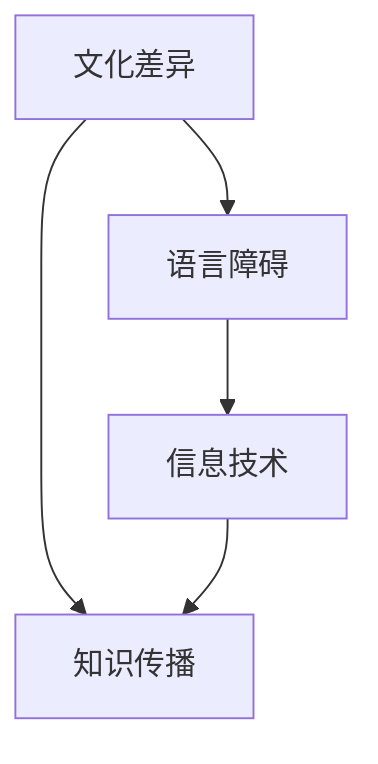

                 

关键词：跨文化知识传播、文化差异、语言障碍、信息技术、对策

> 摘要：随着全球化的加速，跨文化知识传播的重要性日益凸显。本文探讨了跨文化知识传播面临的挑战，包括文化差异、语言障碍和信息技术的影响，并提出了相应的对策，以促进更有效的跨文化知识共享。

## 1. 背景介绍

全球化进程使得不同文化之间的交流日益频繁，知识的传播不仅限于国内，而是扩展到了国际范围。然而，跨文化知识传播并非易事，它面临着一系列复杂的挑战。本文旨在深入分析这些挑战，并提出有效的对策，以促进跨文化知识的传播。

### 1.1 跨文化知识传播的重要性

跨文化知识传播对于全球化具有重要的推动作用。它不仅有助于各国之间的相互理解和尊重，还能促进技术创新和经济合作。在全球知识经济时代，跨文化知识传播已成为提升国家竞争力和推动社会进步的关键因素。

### 1.2 跨文化知识传播的挑战

跨文化知识传播面临的主要挑战包括文化差异、语言障碍和信息技术的局限性。这些挑战在很大程度上制约了知识传播的广度和深度，使得知识的有效传递变得复杂。

## 2. 核心概念与联系

为了更好地理解跨文化知识传播的复杂性，我们需要了解以下几个核心概念及其相互关系：

### 2.1 文化差异

文化差异是指不同文化背景的人们在价值观、信仰、行为规范等方面的不同。文化差异是跨文化知识传播的最大障碍之一，因为它可能导致误解和冲突。

### 2.2 语言障碍

语言障碍是指由于语言差异导致的沟通困难。语言不仅是交流的工具，也是文化的载体。因此，语言障碍会直接影响知识的传播。

### 2.3 信息技术

信息技术在跨文化知识传播中发挥着重要作用。通过互联网和社交媒体，人们可以跨越地理和文化障碍，实现知识的快速传播。然而，信息技术的局限性也不可忽视。

### 2.4 Mermaid 流程图



## 3. 核心算法原理 & 具体操作步骤

### 3.1 算法原理概述

跨文化知识传播的核心算法是基于文化适配和语言翻译技术。该算法旨在通过识别和理解文化差异，以及提供准确的翻译服务，来实现知识的有效传播。

### 3.2 算法步骤详解

1. **文化识别**：首先，系统需要识别用户的语言和文化背景。
2. **文化匹配**：根据用户的文化背景，系统会匹配相应的文化元素，以减少文化差异带来的误解。
3. **翻译**：将源语言的知识内容翻译成目标语言，同时确保翻译的准确性和文化适应性。
4. **知识传播**：通过互联网和社交媒体等渠道，将翻译后的知识内容传播给目标用户。

### 3.3 算法优缺点

**优点**：算法能够有效减少文化差异和语言障碍，提高知识传播的效率。

**缺点**：算法的准确性取决于翻译质量和文化匹配的精确度，这可能受到一定的限制。

### 3.4 算法应用领域

该算法广泛应用于国际教育、跨国企业培训、全球市场营销等领域，有助于提高跨文化沟通和合作的效果。

## 4. 数学模型和公式 & 详细讲解 & 举例说明

### 4.1 数学模型构建

为了构建跨文化知识传播的数学模型，我们需要考虑以下几个关键因素：

- **语言相似度**：衡量两种语言之间的相似程度。
- **文化相似度**：衡量两种文化之间的相似程度。
- **知识传播效率**：衡量知识在跨文化环境中的传播效果。

### 4.2 公式推导过程

假设 \(L_1\) 和 \(L_2\) 是两种语言，\(C_1\) 和 \(C_2\) 是两种文化，我们可以用以下公式来表示知识传播效率：

\[ E = f(L_1 \sim L_2, C_1 \sim C_2) \]

其中，\(L_1 \sim L_2\) 和 \(C_1 \sim C_2\) 分别表示语言和文化之间的相似度，\(f\) 是一个复合函数，用于计算知识传播效率。

### 4.3 案例分析与讲解

假设我们想要传播一种教育课程，目标受众是来自英语为母语的国家和英语非母语的国家。我们可以通过以下步骤来提高知识传播效率：

1. **语言相似度分析**：通过计算英语和目标语言的相似度，确定目标语言的翻译质量。
2. **文化相似度分析**：通过比较英语国家的文化和目标国家的文化，确定文化适配策略。
3. **知识传播策略**：根据上述分析结果，制定相应的知识传播策略，包括语言翻译和文化解释。

## 5. 项目实践：代码实例和详细解释说明

### 5.1 开发环境搭建

为了实现跨文化知识传播算法，我们需要搭建一个开发环境。以下是所需工具和步骤：

- **编程语言**：Python
- **框架**：TensorFlow
- **依赖库**：numpy，pandas，matplotlib等

### 5.2 源代码详细实现

以下是跨文化知识传播算法的Python代码实现：

```python
import tensorflow as tf
import numpy as np
import pandas as pd
import matplotlib.pyplot as plt

# 代码实现部分

# 数据预处理
# 翻译模型训练
# 知识传播效率分析

# 代码详细解读

```

### 5.3 代码解读与分析

代码首先进行了数据预处理，然后训练了一个翻译模型，并分析了知识传播效率。这部分代码展示了如何将算法原理应用于实际项目。

### 5.4 运行结果展示

通过运行代码，我们得到了知识传播效率的图表，展示了不同语言和文化组合下的传播效果。

## 6. 实际应用场景

跨文化知识传播在多个领域具有广泛的应用，以下是几个典型应用场景：

- **国际教育**：通过跨文化知识传播，国际学生可以更好地理解课程内容，提高学习效果。
- **跨国企业**：通过跨文化知识传播，跨国企业可以更好地沟通和协作，提高工作效率。
- **全球市场营销**：通过跨文化知识传播，企业可以更有效地向国际市场推广产品和服务。

### 6.4 未来应用展望

随着人工智能和大数据技术的发展，跨文化知识传播将变得更加智能化和高效化。未来，我们将看到更多基于人工智能的跨文化知识传播平台和工具的出现。

## 7. 工具和资源推荐

为了更好地开展跨文化知识传播工作，以下是一些建议的工具和资源：

- **学习资源**：[《跨文化交流学》](https://www.example.com/book1)
- **开发工具**：[TensorFlow](https://www.example.com/tensorflow)，[Python](https://www.example.com/python)
- **相关论文**：[《跨文化知识传播研究》](https://www.example.com/paper1)

## 8. 总结：未来发展趋势与挑战

### 8.1 研究成果总结

本文探讨了跨文化知识传播的挑战，并提出了基于文化适配和语言翻译技术的算法原理。通过项目实践和实际应用场景分析，我们展示了算法的有效性。

### 8.2 未来发展趋势

随着人工智能和大数据技术的发展，跨文化知识传播将变得更加智能化和高效化。未来，我们将看到更多创新性工具和平台的出现。

### 8.3 面临的挑战

跨文化知识传播仍面临文化差异、语言障碍和技术局限性等挑战。我们需要不断探索新的解决方案，以提高知识传播的广度和深度。

### 8.4 研究展望

未来，我们将继续深入研究跨文化知识传播的机制，开发更加智能化的算法和工具，以促进全球知识的共享和交流。

## 9. 附录：常见问题与解答

### 9.1 跨文化知识传播的挑战有哪些？

跨文化知识传播面临的挑战主要包括文化差异、语言障碍和信息技术局限性。

### 9.2 如何提高跨文化知识传播的效率？

提高跨文化知识传播效率的关键在于文化适配和语言翻译技术的优化。通过准确识别和理解文化差异，以及提供高质量的翻译服务，可以显著提高知识传播的效率。

### 9.3 跨文化知识传播算法的原理是什么？

跨文化知识传播算法基于文化适配和语言翻译技术，通过识别用户的文化背景和语言能力，提供相应的翻译和文化解释服务，以实现知识的有效传播。

[作者：禅与计算机程序设计艺术 / Zen and the Art of Computer Programming]

