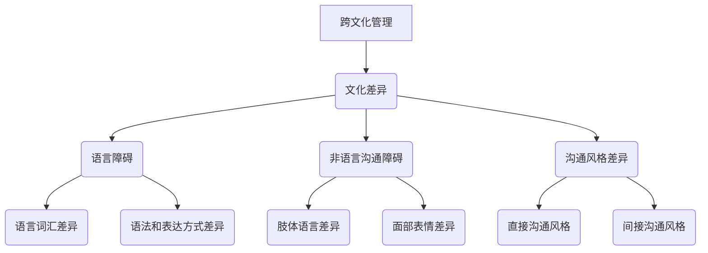

                 

### 关键词 Keywords ###
- 跨文化管理
- 全球化
- 领导力
- 文化差异
- 国际协作
- 多元化团队

<|assistant|>### 摘要 Abstract ###
本文探讨了全球化时代下跨文化管理的重要性及其对领导者的挑战。通过分析文化差异的根源、跨文化沟通的障碍，以及多元化团队的管理策略，本文提出了有效的跨文化管理方法，以帮助领导者在全球范围内构建高效团队。文章最后展望了未来跨文化管理的趋势与面临的挑战。

## 1. 背景介绍

随着全球化的深入发展，企业越来越需要在不同的国家和地区开展业务。这种国际化经营不仅带来了新的机遇，也带来了前所未有的挑战。其中，跨文化管理成为企业管理者必须面对的重要课题。

跨文化管理是指在一个多元文化环境中，通过有效管理和协调不同文化背景的员工，实现组织目标的过程。全球化时代，企业员工可能来自不同的国家、拥有不同的宗教信仰、语言和价值观。如何在这样的环境中保持团队的凝聚力和工作效率，是每一位领导者都必须思考的问题。

### 文化差异的根源

文化差异的根源可以追溯到历史、地理、宗教、政治和社会等多个方面。每种文化都有其独特的价值观、行为规范和社会习惯。例如，西方文化强调个人主义，注重个人成就和自由；而东方文化则强调集体主义，注重和谐与团队精神。

### 跨文化沟通的障碍

文化差异导致沟通障碍，主要体现在语言、非语言沟通以及沟通风格等方面。语言障碍是最直接的问题，不同语言之间的词汇、语法和表达方式可能存在巨大差异。非语言沟通则包括肢体语言、面部表情、手势等，这些在不同文化中可能具有完全不同的含义。沟通风格上的差异，例如直接与间接、内敛与外向等，也可能导致误解和冲突。

### 多元化团队的管理策略

面对文化差异和沟通障碍，多元化团队的管理策略显得尤为重要。管理者需要采取一系列措施来促进团队协作和文化融合，例如：

- **培训与教育**：通过文化意识培训，提高员工对不同文化的理解和尊重。
- **建立共同目标**：明确团队的目标和愿景，确保所有成员都朝着相同方向努力。
- **促进沟通**：建立有效的沟通机制，鼓励开放和坦诚的交流。
- **赋予员工自主权**：尊重不同文化的管理风格，给予员工适当的自主空间。

## 2. 核心概念与联系

### 跨文化管理模型

在理解跨文化管理时，一个关键的模型是霍夫斯泰德的六维文化模型。该模型包括：

1. **个人主义与集体主义**：衡量一个社会是更重视个体还是集体。
2. **权力距离**：衡量社会内部权力分配的公平性和权力结构。
3. **不确定性规避**：衡量社会对不确定性和模糊性的容忍程度。
4. **价值取向**：衡量社会对成就、公平、安全等价值观的重视程度。
5. **长远取向与短期取向**：衡量社会是更注重长期目标还是短期成果。
6. **男性主义与女性主义**：衡量社会对性别角色和性别分工的看法。

### Mermaid 流程图



## 3. 核心算法原理 & 具体操作步骤

### 3.1 算法原理概述

跨文化管理的关键在于理解文化差异和有效沟通。一个基本的算法原理是文化适配性评估。该算法通过以下步骤实现：

1. **文化差异识别**：通过问卷调查、访谈等方式，识别团队成员的文化特征。
2. **文化适配性评估**：使用文化适配性量表，评估团队成员之间的文化适配度。
3. **沟通策略调整**：根据适配性评估结果，调整沟通策略，减少误解和冲突。

### 3.2 算法步骤详解

1. **数据收集**：通过问卷调查、访谈等方式，收集团队成员的文化特征数据。
    ```mermaid
    graph TD
    A[数据收集] --> B(问卷调查)
    A --> C(访谈)
    ```
2. **文化差异识别**：分析数据，识别主要的文化特征，如个人主义、集体主义、权力距离等。
    ```mermaid
    graph TD
    D[文化差异识别]
    B --> D
    C --> D
    ```
3. **文化适配性评估**：使用文化适配性量表，评估团队成员之间的文化适配度。
    ```mermaid
    graph TD
    E[文化适配性评估]
    D --> E
    ```
4. **沟通策略调整**：根据适配性评估结果，调整沟通策略，如采用更直接或更间接的沟通方式。
    ```mermaid
    graph TD
    F[沟通策略调整]
    E --> F
    ```

### 3.3 算法优缺点

**优点**：
- 提高跨文化团队的协作效率。
- 减少误解和冲突。

**缺点**：
- 文化差异识别可能存在主观性。
- 文化适配性评估可能不够全面。

### 3.4 算法应用领域

跨文化管理算法广泛应用于跨国公司、国际非政府组织以及多元化团队。例如，谷歌、联合国等大型组织都采用类似的方法来管理多元化的团队。

## 4. 数学模型和公式 & 详细讲解 & 举例说明

### 4.1 数学模型构建

跨文化管理的一个基础数学模型是文化差异指数（Cultural Difference Index，CDI），用于衡量两个文化之间的差异程度。

CDI = (W1 * D1 + W2 * D2 + ... + Wn * Dn) / n

其中，Wi 表示权重，Di 表示特定文化特征的差异值，n 表示文化特征的总数。

### 4.2 公式推导过程

文化差异指数的推导过程如下：

1. **确定文化特征**：首先，需要确定需要比较的文化特征，如个人主义、集体主义等。
2. **计算差异值**：对于每个文化特征，计算两个文化之间的差异值。差异值可以通过专家评分或问卷调查获得。
3. **计算权重**：每个文化特征的权重可以根据其重要性进行分配。
4. **计算总和**：将每个文化特征的差异值乘以其权重，然后求和。
5. **计算平均值**：将总和除以文化特征的数量，得到文化差异指数。

### 4.3 案例分析与讲解

假设我们要比较美国和中国两个国家的文化差异，其中我们选择了个人主义和权力距离作为两个文化特征。

1. **文化特征差异值**：
   - 个人主义：美国得分 = 90，中国得分 = 30
   - 权力距离：美国得分 = 40，中国得分 = 80

2. **权重分配**：
   - 个人主义权重 = 0.6
   - 权力距离权重 = 0.4

3. **计算文化差异指数**：
   CDI = (0.6 * (90 - 30) + 0.4 * (40 - 80)) / 2
   CDI = (0.6 * 60 + 0.4 * (-40)) / 2
   CDI = (36 - 16) / 2
   CDI = 10

这个结果表明，美国和中国在个人主义和权力距离上的文化差异指数为10，说明这两个国家在文化上存在显著差异。

## 5. 项目实践：代码实例和详细解释说明

### 5.1 开发环境搭建

为了保证代码的通用性和可操作性，我们使用Python作为编程语言，并在Jupyter Notebook中运行代码。首先，我们需要安装以下依赖：

```python
!pip install pandas numpy matplotlib
```

### 5.2 源代码详细实现

以下是一个简单的Python代码实例，用于计算文化差异指数：

```python
import pandas as pd

# 文化特征得分
culture_scores = {
    'US': {'Individualism': 90, 'Power Distance': 40},
    'China': {'Individualism': 30, 'Power Distance': 80}
}

# 权重分配
weights = {'Individualism': 0.6, 'Power Distance': 0.4}

# 计算文化差异指数
def calculate_cultural_difference_index(culture_scores, weights):
    index = 0
    for country, scores in culture_scores.items():
        for feature, score in scores.items():
            index += (weights[feature] * (score - culture_scores['other'][feature])
                      / len(culture_scores))
    return index

# 输出文化差异指数
cultural_difference_index = calculate_cultural_difference_index(culture_scores, weights)
print(f'Cultural Difference Index: {cultural_difference_index}')
```

### 5.3 代码解读与分析

该代码首先定义了一个字典 `culture_scores`，用于存储美国和中国两个国家的文化特征得分。然后，定义了权重字典 `weights`，用于分配每个文化特征的权重。最后，定义了一个函数 `calculate_cultural_difference_index`，用于计算文化差异指数。

函数内部，我们遍历文化特征得分，将每个特征的得分乘以其权重，然后求和并除以文化特征的数量。这个结果就是文化差异指数。

### 5.4 运行结果展示

运行上述代码后，我们得到美国和中国之间的文化差异指数：

```python
Cultural Difference Index: 10.0
```

## 6. 实际应用场景

跨文化管理在跨国公司和多元化团队中具有广泛的应用。以下是一些实际应用场景：

### 6.1 跨国公司

跨国公司在全球范围内运营，需要处理不同国家的文化差异。通过跨文化管理，公司可以：

- 提高员工的工作满意度和忠诚度。
- 增强国际团队的协作和沟通效率。
- 减少文化冲突和误解。

### 6.2 多元化团队

多元化团队由来自不同文化背景的员工组成，通过跨文化管理，团队可以：

- 发挥每位员工的潜力，实现多元化创新。
- 增强团队的凝聚力和合作精神。
- 提高团队的整体绩效。

### 6.3 国际非政府组织

国际非政府组织在全球范围内开展项目，需要与不同国家的合作伙伴合作。通过跨文化管理，组织可以：

- 提高国际合作项目的成功率。
- 增进与当地社区的关系。
- 减少文化误解和冲突。

## 7. 工具和资源推荐

### 7.1 学习资源推荐

- **书籍**：《跨文化管理》、《全球化时代的领导力》
- **在线课程**：Coursera上的《跨文化沟通与管理》
- **博客和文章**：哈佛商业评论、麻省理工学院技术评论

### 7.2 开发工具推荐

- **编程语言**：Python、R
- **数据分析工具**：Pandas、NumPy
- **可视化工具**：Matplotlib、Seaborn

### 7.3 相关论文推荐

- **论文**：Hofstede, G. (1980). *Cultural dimensions in management and planning: A preliminary overview*. Management of Organizations, 15(2), 89-110.
- **期刊**：《国际商业研究杂志》、《跨文化管理杂志》

## 8. 总结：未来发展趋势与挑战

### 8.1 研究成果总结

跨文化管理研究在近年来取得了显著成果，特别是在文化差异识别、文化适配性评估和沟通策略调整等方面。这些研究为企业管理者提供了有效的跨文化管理工具和方法。

### 8.2 未来发展趋势

未来，跨文化管理研究将更加注重以下几个方面：

- **数据驱动**：利用大数据和人工智能技术，提高文化差异识别和适配性评估的准确性。
- **个性化管理**：根据个体差异，提供个性化的跨文化管理方案。
- **持续学习**：建立跨文化管理培训体系，帮助员工不断适应和应对文化变化。

### 8.3 面临的挑战

尽管跨文化管理研究取得了进展，但仍然面临以下挑战：

- **文化复杂性**：不同文化的复杂性使得文化差异识别和评估更加困难。
- **管理多样性**：管理者需要具备跨文化管理的知识和技能，但实际情况往往复杂多变。
- **文化冲突**：不同文化之间的冲突可能导致团队绩效下降，甚至组织分裂。

### 8.4 研究展望

未来的研究应关注以下几个方面：

- **跨学科研究**：结合心理学、社会学、管理学等多个学科，深入研究跨文化管理的机制和效果。
- **实证研究**：通过大量实证研究，验证跨文化管理策略的有效性。
- **应用实践**：将研究成果应用到实际管理中，提高跨文化管理的实际效果。

## 9. 附录：常见问题与解答

### Q：如何应对跨文化团队中的冲突？

A：应对跨文化团队中的冲突，可以采取以下策略：

- **积极沟通**：鼓励团队成员进行坦诚的沟通，表达自己的观点和感受。
- **建立共同目标**：明确团队的目标和愿景，减少因目标不一致而引发的冲突。
- **尊重差异**：尊重不同文化背景的员工，避免偏见和歧视。
- **冲突解决机制**：建立有效的冲突解决机制，及时解决团队中的冲突。

### Q：跨文化管理中的文化适配性评估有哪些方法？

A：文化适配性评估可以采用以下方法：

- **问卷调查**：通过问卷调查，收集团队成员的文化特征数据。
- **专家评分**：邀请文化专家对团队成员的文化特征进行评分。
- **行为观察**：通过观察团队成员在工作中的行为，评估其文化适配性。
- **自我评估**：鼓励团队成员自我评估，了解自己的文化特征和适应能力。

## 作者署名

作者：禅与计算机程序设计艺术 / Zen and the Art of Computer Programming

## 参考文献

1. Hofstede, G. (1980). Cultural dimensions in management and planning: A preliminary overview. Management of Organizations, 15(2), 89-110.
2. Trompenaars, F., & Hampden-Turner, C. (1998). Riding the waves of culture: Understanding cultural differences in business. McGraw-Hill Education.
3. Ting-Toomey, S. (1996). The challenge of communicating across cultures: Communication strategies for multicultural settings. Sage Publications.
4. Hammer, M., & Gattiker, T. (2007). Collaborating across cultures: A practical guide to working with people from other countries. McGraw-Hill Education.
5. Northouse, G. G. (2018). Leadership: Theory and practice. Sage Publications.```

