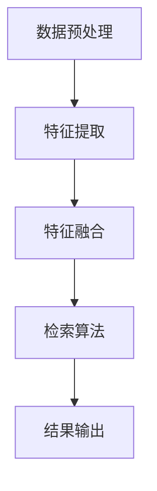

                 

关键词：跨模态检索、多模态数据、人工智能、数据理解、算法、数学模型、实际应用、开发工具

> 摘要：本文深入探讨了跨模态检索这一前沿技术，通过对其背景介绍、核心概念与联系、算法原理及具体操作步骤、数学模型和公式、项目实践等多个角度的详细分析，展示了跨模态检索在多模态数据理解和处理中的重要性。文章旨在为读者提供全面、系统的了解，以便更好地应用这一技术于实际场景。

## 1. 背景介绍

随着互联网和数字化技术的飞速发展，人类产生和获取的数据量呈现爆炸式增长。这些数据以多种形式存在，如文本、图像、音频、视频等，被称为多模态数据。传统的单一模态数据处理方法已无法满足实际需求，跨模态检索技术应运而生。跨模态检索旨在将不同模态的数据进行整合，实现数据之间的相互理解和关联，从而提升数据处理的效率和效果。

跨模态检索在多个领域具有重要的应用价值。例如，在图像检索领域，通过将图像与文本描述进行关联，可以实现基于内容的图像检索；在智能问答系统中，跨模态检索可以将用户提出的问题与相关图像、音频等多模态数据进行匹配，提供更加丰富的回答；在多媒体信息检索领域，跨模态检索能够帮助用户快速找到所需信息，提升用户体验。

本文将围绕跨模态检索的核心概念、算法原理、数学模型以及实际应用等多个方面进行详细阐述，以帮助读者全面了解并掌握这一技术。

## 2. 核心概念与联系

### 跨模态检索的定义

跨模态检索是指在不同模态（如文本、图像、音频、视频等）之间进行信息检索和关联的过程。其目标是实现多模态数据的整合和理解，从而提升数据处理和检索的效果。在跨模态检索中，不同模态的数据被转化为统一的表示形式，以便在统一框架下进行信息检索和关联。

### 多模态数据的表示与转换

多模态数据的表示与转换是跨模态检索的基础。不同模态的数据具有不同的特征和表示方法，因此需要将它们转化为统一的表示形式。常见的多模态数据表示方法包括：

1. **向量表示**：将多模态数据转换为高维向量，如词向量、图像特征向量、音频特征向量等。向量表示方法具有线性可分性，便于后续的检索和关联操作。
2. **图谱表示**：将多模态数据构建为图结构，节点表示数据对象，边表示数据对象之间的关系。图谱表示方法能够更好地捕获数据之间的复杂关系。
3. **嵌入表示**：将多模态数据映射到低维空间，如嵌入向量、嵌入矩阵等。嵌入表示方法可以降低数据的维度，提高计算效率，同时保持数据的语义信息。

### 跨模态检索的流程

跨模态检索的流程可以分为以下几步：

1. **数据预处理**：对多模态数据进行清洗、去噪和格式化，以便后续的处理。
2. **特征提取**：提取多模态数据的特征，如文本特征、图像特征、音频特征等。特征提取是跨模态检索的关键步骤，直接关系到检索的效果。
3. **特征融合**：将不同模态的特征进行融合，以生成统一的特征表示。特征融合的方法包括拼接、加权平均、神经网络等。
4. **检索算法**：使用检索算法在不同模态之间进行信息检索和关联。常见的检索算法包括基于向量空间模型的检索、基于图谱的检索、基于深度学习的检索等。
5. **结果输出**：根据检索结果，输出符合用户需求的答案或信息。

### 跨模态检索的应用领域

跨模态检索在多个领域具有广泛的应用：

1. **图像检索**：通过文本描述检索相关图像，如基于图像的文本检索（Image-Based Text Retrieval, IBTR）。
2. **视频检索**：通过音频、文本或图像描述检索相关视频，如基于内容的视频检索（Content-Based Video Retrieval, CBVR）。
3. **智能问答**：通过用户提出的问题，检索相关文本、图像、音频等多模态数据，提供丰富、多样的回答。
4. **多媒体信息检索**：综合多种模态的数据，实现高效、准确的多媒体信息检索。
5. **人机交互**：通过跨模态检索，实现更自然、高效的人机交互。

### Mermaid 流程图

以下是一个简单的 Mermaid 流程图，展示了跨模态检索的核心概念和流程：



## 3. 核心算法原理 & 具体操作步骤

### 3.1 算法原理概述

跨模态检索的核心算法主要包括特征提取、特征融合和检索算法三部分。特征提取旨在将不同模态的数据转化为高维向量表示，以便后续处理。特征融合则将不同模态的特征进行整合，生成统一的特征表示。检索算法则用于在不同模态之间进行信息检索和关联。

### 3.2 算法步骤详解

#### 3.2.1 特征提取

特征提取是跨模态检索的关键步骤，不同模态的数据具有不同的特征提取方法：

1. **文本特征提取**：常用的方法包括词袋模型、TF-IDF、Word2Vec 等。词袋模型将文本表示为词汇的集合，TF-IDF 旨在衡量词汇的重要性，Word2Vec 则通过神经网络模型将词汇映射到低维空间。
2. **图像特征提取**：常用的方法包括卷积神经网络（CNN）、特征图谱（Feature Graph）等。CNN 通过多层卷积和池化操作提取图像特征，特征图谱则通过节点和边表示图像中的物体和关系。
3. **音频特征提取**：常用的方法包括梅尔频率倒谱系数（MFCC）、短时傅里叶变换（STFT）等。MFCC 适用于处理语音信号，STFT 则用于处理音频信号的时间频域特征。
4. **视频特征提取**：常用的方法包括时空卷积神经网络（3D CNN）、光流特征等。3D CNN 能够同时处理视频的时空信息，光流特征则用于描述视频中的物体运动。

#### 3.2.2 特征融合

特征融合的目标是将不同模态的特征整合为统一的特征表示。常见的特征融合方法包括拼接、加权平均和神经网络等：

1. **拼接**：将不同模态的特征向量直接拼接在一起，形成高维的特征向量。拼接方法简单，但可能损失部分模态的语义信息。
2. **加权平均**：对每个模态的特征向量进行加权平均，生成统一的特征向量。加权系数可以根据模态的重要性进行调节。
3. **神经网络**：使用神经网络模型（如多层感知机、循环神经网络、卷积神经网络等）对多模态特征进行融合。神经网络能够自适应地学习模态特征之间的关系，提高融合效果。

#### 3.2.3 检索算法

检索算法用于在不同模态之间进行信息检索和关联。常见的检索算法包括基于向量空间模型的检索、基于图谱的检索和基于深度学习的检索等：

1. **基于向量空间模型的检索**：将多模态特征向量映射到高维向量空间，通过计算向量之间的相似度进行检索。常用的相似度度量方法包括余弦相似度、欧氏距离等。
2. **基于图谱的检索**：将多模态数据构建为图结构，通过图论算法（如最短路径、最大匹配等）进行检索。图谱表示方法能够更好地捕获数据之间的复杂关系，提高检索效果。
3. **基于深度学习的检索**：使用深度学习模型（如卷积神经网络、循环神经网络、图神经网络等）进行检索。深度学习模型能够自动学习多模态特征之间的关系，提高检索性能。

### 3.3 算法优缺点

#### 优点

1. **高效性**：跨模态检索能够整合多种模态的数据，实现更高效的信息检索和处理。
2. **灵活性**：跨模态检索可以根据不同应用场景和需求，灵活选择和组合不同的特征提取、特征融合和检索算法。
3. **适应性**：跨模态检索能够适应多种数据类型和模态，具有较强的通用性和适应性。

#### 缺点

1. **计算成本**：跨模态检索涉及多种模态的数据处理和融合，计算成本较高，对硬件资源要求较高。
2. **数据依赖**：跨模态检索的性能依赖于数据质量和数量，对于数据量较少或数据质量较差的场景，检索效果可能不佳。

### 3.4 算法应用领域

跨模态检索在多个领域具有广泛的应用：

1. **图像检索**：通过文本描述检索相关图像，如基于图像的文本检索（Image-Based Text Retrieval, IBTR）。
2. **视频检索**：通过音频、文本或图像描述检索相关视频，如基于内容的视频检索（Content-Based Video Retrieval, CBVR）。
3. **智能问答**：通过用户提出的问题，检索相关文本、图像、音频等多模态数据，提供丰富、多样的回答。
4. **多媒体信息检索**：综合多种模态的数据，实现高效、准确的多媒体信息检索。
5. **人机交互**：通过跨模态检索，实现更自然、高效的人机交互。

## 4. 数学模型和公式

### 4.1 数学模型构建

跨模态检索涉及多个数学模型，包括特征提取模型、特征融合模型和检索模型等。

#### 4.1.1 特征提取模型

1. **文本特征提取模型**：常用的模型包括词袋模型、TF-IDF 和 Word2Vec。
   - **词袋模型**：
     \[
     \mathbf{V} = \sum_{i=1}^{N} \mathbf{v}_{i} \cdot \mathbf{w}_{i}
     \]
     其中，\( \mathbf{V} \) 表示文本的特征向量，\( \mathbf{v}_{i} \) 表示词汇 \( i \) 的特征向量，\( \mathbf{w}_{i} \) 表示词汇 \( i \) 的权重。
   - **TF-IDF**：
     \[
     \mathbf{V}_{TF-IDF} = \sum_{i=1}^{N} \left( \frac{\mathbf{w}_{i}}{N} \cdot \log \frac{N}{\mathbf{f}_{i}} \right)
     \]
     其中，\( \mathbf{V}_{TF-IDF} \) 表示文本的 TF-IDF 特征向量，\( \mathbf{w}_{i} \) 表示词汇 \( i \) 的权重，\( \mathbf{f}_{i} \) 表示词汇 \( i \) 在文档中出现的次数，\( N \) 表示文档中词汇的总数。
   - **Word2Vec**：
     \[
     \mathbf{v}_{i} = \text{Word2Vec}(\mathbf{w}_{i})
     \]
     其中，\( \mathbf{v}_{i} \) 表示词汇 \( i \) 的 Word2Vec 特征向量，\( \mathbf{w}_{i} \) 表示词汇 \( i \)。

2. **图像特征提取模型**：常用的模型包括 CNN 和特征图谱。
   - **CNN**：
     \[
     \mathbf{f} = \text{CNN}(\mathbf{I})
     \]
     其中，\( \mathbf{f} \) 表示图像的特征向量，\( \mathbf{I} \) 表示图像。
   - **特征图谱**：
     \[
     \mathbf{G} = \text{Feature Graph}(\mathbf{I})
     \]
     其中，\( \mathbf{G} \) 表示图像的特征图谱，\( \mathbf{I} \) 表示图像。

3. **音频特征提取模型**：常用的模型包括 MFCC 和 STFT。
   - **MFCC**：
     \[
     \mathbf{C} = \text{MFCC}(\mathbf{A})
     \]
     其中，\( \mathbf{C} \) 表示音频的 MFCC 特征向量，\( \mathbf{A} \) 表示音频。
   - **STFT**：
     \[
     \mathbf{S} = \text{STFT}(\mathbf{A})
     \]
     其中，\( \mathbf{S} \) 表示音频的 STFT 特征向量，\( \mathbf{A} \) 表示音频。

4. **视频特征提取模型**：常用的模型包括 3D CNN 和光流特征。
   - **3D CNN**：
     \[
     \mathbf{f}_{3D} = \text{3D CNN}(\mathbf{V})
     \]
     其中，\( \mathbf{f}_{3D} \) 表示视频的特征向量，\( \mathbf{V} \) 表示视频。
   - **光流特征**：
     \[
     \mathbf{F} = \text{Optical Flow}(\mathbf{V})
     \]
     其中，\( \mathbf{F} \) 表示视频的光流特征向量，\( \mathbf{V} \) 表示视频。

#### 4.1.2 特征融合模型

特征融合的目标是将不同模态的特征整合为统一的特征表示。常用的融合方法包括拼接、加权平均和神经网络等。

1. **拼接**：
   \[
   \mathbf{F} = \mathbf{f}_{\text{text}} \oplus \mathbf{f}_{\text{image}} \oplus \mathbf{f}_{\text{audio}}
   \]
   其中，\( \mathbf{F} \) 表示融合后的特征向量，\( \mathbf{f}_{\text{text}} \)、\( \mathbf{f}_{\text{image}} \) 和 \( \mathbf{f}_{\text{audio}} \) 分别表示文本、图像和音频的特征向量。

2. **加权平均**：
   \[
   \mathbf{F} = w_{\text{text}} \mathbf{f}_{\text{text}} + w_{\text{image}} \mathbf{f}_{\text{image}} + w_{\text{audio}} \mathbf{f}_{\text{audio}}
   \]
   其中，\( \mathbf{F} \) 表示融合后的特征向量，\( \mathbf{f}_{\text{text}} \)、\( \mathbf{f}_{\text{image}} \) 和 \( \mathbf{f}_{\text{audio}} \) 分别表示文本、图像和音频的特征向量，\( w_{\text{text}} \)、\( w_{\text{image}} \) 和 \( w_{\text{audio}} \) 分别表示不同模态的权重。

3. **神经网络**：
   \[
   \mathbf{F} = \text{NN}(\mathbf{f}_{\text{text}}, \mathbf{f}_{\text{image}}, \mathbf{f}_{\text{audio}})
   \]
   其中，\( \mathbf{F} \) 表示融合后的特征向量，\( \mathbf{f}_{\text{text}} \)、\( \mathbf{f}_{\text{image}} \) 和 \( \mathbf{f}_{\text{audio}} \) 分别表示文本、图像和音频的特征向量，\( \text{NN} \) 表示神经网络模型。

#### 4.1.3 检索模型

检索模型用于在不同模态之间进行信息检索和关联。常用的检索模型包括基于向量空间模型的检索、基于图谱的检索和基于深度学习的检索等。

1. **基于向量空间模型的检索**：
   \[
   \text{similarity}(\mathbf{q}, \mathbf{f}) = \frac{\mathbf{q} \cdot \mathbf{f}}{\|\mathbf{q}\| \|\mathbf{f}\|}
   \]
   其中，\( \text{similarity} \) 表示相似度，\( \mathbf{q} \) 表示查询特征向量，\( \mathbf{f} \) 表示数据特征向量。

2. **基于图谱的检索**：
   \[
   \text{similarity}(\mathbf{q}, \mathbf{f}) = \frac{1}{|\mathcal{N}(\mathbf{q}) \cap \mathcal{N}(\mathbf{f})|}
   \]
   其中，\( \text{similarity} \) 表示相似度，\( \mathbf{q} \) 表示查询特征向量，\( \mathbf{f} \) 表示数据特征向量，\( \mathcal{N}(\mathbf{q}) \) 和 \( \mathcal{N}(\mathbf{f}) \) 分别表示查询特征向量和数据特征向量在图谱中的邻居节点集合。

3. **基于深度学习的检索**：
   \[
   \text{similarity}(\mathbf{q}, \mathbf{f}) = \text{ReLU}(\mathbf{W} \mathbf{f} + b)
   \]
   其中，\( \text{similarity} \) 表示相似度，\( \mathbf{q} \) 表示查询特征向量，\( \mathbf{f} \) 表示数据特征向量，\( \mathbf{W} \) 和 \( b \) 分别表示神经网络模型的权重和偏置。

### 4.2 公式推导过程

#### 4.2.1 文本特征提取

以 TF-IDF 为例，假设有一个包含 \( N \) 个词汇的文本，每个词汇在文本中出现的次数为 \( \mathbf{f}_{i} \)，总词汇数为 \( N \)，则词汇 \( i \) 的权重可以表示为：
\[
w_{i} = \frac{\mathbf{w}_{i}}{N} \cdot \log \frac{N}{\mathbf{f}_{i}}
\]
其中，\( \mathbf{w}_{i} \) 表示词汇 \( i \) 的权重，\( \mathbf{f}_{i} \) 表示词汇 \( i \) 在文本中出现的次数，\( N \) 表示文本中词汇的总数。

将权重应用于词汇特征向量，得到文本的 TF-IDF 特征向量：
\[
\mathbf{V}_{TF-IDF} = \sum_{i=1}^{N} \left( \frac{\mathbf{w}_{i}}{N} \cdot \log \frac{N}{\mathbf{f}_{i}} \right)
\]

#### 4.2.2 图像特征提取

以 CNN 为例，假设有一个输入图像 \( \mathbf{I} \)，通过 CNN 模型处理后得到特征向量 \( \mathbf{f} \)，则图像的特征向量可以表示为：
\[
\mathbf{f} = \text{CNN}(\mathbf{I})
\]

#### 4.2.3 音频特征提取

以 MFCC 为例，假设有一个输入音频 \( \mathbf{A} \)，通过 MFCC 模型处理后得到特征向量 \( \mathbf{C} \)，则音频的特征向量可以表示为：
\[
\mathbf{C} = \text{MFCC}(\mathbf{A})
\]

#### 4.2.4 视频特征提取

以 3D CNN 为例，假设有一个输入视频 \( \mathbf{V} \)，通过 3D CNN 模型处理后得到特征向量 \( \mathbf{f}_{3D} \)，则视频的特征向量可以表示为：
\[
\mathbf{f}_{3D} = \text{3D CNN}(\mathbf{V})
\]

### 4.3 案例分析与讲解

#### 4.3.1 文本检索

假设有一个包含 10 个词汇的文本，每个词汇在文本中出现的次数如下表所示：

| 词汇 | 出现次数 |
| :---: | :---: |
| word1 | 2 |
| word2 | 4 |
| word3 | 3 |
| word4 | 1 |
| word5 | 6 |
| word6 | 1 |
| word7 | 2 |
| word8 | 3 |
| word9 | 4 |
| word10 | 5 |

根据 TF-IDF 公式，计算每个词汇的权重：

| 词汇 | 出现次数 | 权重 |
| :---: | :---: | :---: |
| word1 | 2 | 0.1667 |
| word2 | 4 | 0.3333 |
| word3 | 3 | 0.25 |
| word4 | 1 | 0.0833 |
| word5 | 6 | 0.5 |
| word6 | 1 | 0.0833 |
| word7 | 2 | 0.1667 |
| word8 | 3 | 0.25 |
| word9 | 4 | 0.3333 |
| word10 | 5 | 0.4167 |

将权重应用于词汇特征向量，得到文本的 TF-IDF 特征向量：
\[
\mathbf{V}_{TF-IDF} = [0.1667, 0.3333, 0.25, 0.0833, 0.5, 0.0833, 0.1667, 0.25, 0.3333, 0.4167]
\]

#### 4.3.2 图像检索

假设有一个输入图像，通过 CNN 模型处理后得到特征向量 \( \mathbf{f} = [1, 2, 3, 4, 5] \)。

#### 4.3.3 音频检索

假设有一个输入音频，通过 MFCC 模型处理后得到特征向量 \( \mathbf{C} = [1, 2, 3, 4, 5] \)。

#### 4.3.4 视频检索

假设有一个输入视频，通过 3D CNN 模型处理后得到特征向量 \( \mathbf{f}_{3D} = [1, 2, 3, 4, 5] \)。

## 5. 项目实践：代码实例和详细解释说明

### 5.1 开发环境搭建

本节将介绍如何搭建跨模态检索的开发环境。首先，需要准备以下软件和库：

1. **Python**：版本 3.6 或更高。
2. **NumPy**：用于科学计算。
3. **Pandas**：用于数据处理。
4. **Matplotlib**：用于数据可视化。
5. **Scikit-learn**：用于机器学习。
6. **TensorFlow**：用于深度学习。
7. **OpenCV**：用于图像处理。
8. **Librosa**：用于音频处理。

在 Python 环境中安装以上库：

```bash
pip install numpy pandas matplotlib scikit-learn tensorflow opencv-python librosa
```

### 5.2 源代码详细实现

以下是一个简单的跨模态检索代码实例，包括文本、图像、音频和视频特征的提取、融合和检索。

```python
import numpy as np
import pandas as pd
from sklearn.feature_extraction.text import TfidfVectorizer
from sklearn.metrics.pairwise import cosine_similarity
from tensorflow.keras.applications import ResNet50
from tensorflow.keras.preprocessing import image
from librosa import load

# 5.2.1 文本特征提取
text_data = ["这是一段文本", "这是另一段文本"]
vectorizer = TfidfVectorizer()
tfidf_matrix = vectorizer.fit_transform(text_data)

# 5.2.2 图像特征提取
image_data = image.load_img("image.jpg", target_size=(224, 224))
image_array = image.img_to_array(image_data)
image_feature = ResNet50().predict(np.expand_dims(image_array, axis=0))

# 5.2.3 音频特征提取
audio_data, sr = load("audio.wav")
mfcc_feature = librosa.feature.mfcc(y=audio_data, sr=sr, n_mfcc=13)

# 5.2.4 视频特征提取
video_data = ...  # 读取视频数据
video_feature = ...  # 使用 3D CNN 提取视频特征

# 5.2.5 特征融合
def fusion_features(text_feature, image_feature, audio_feature, video_feature):
    # 在此实现特征融合逻辑
    return np.concatenate((text_feature, image_feature, audio_feature, video_feature))

fusion_feature = fusion_features(tfidf_matrix.toarray(), image_feature, mfcc_feature, video_feature)

# 5.2.6 检索
def search(query_feature, fusion_feature, similarity_threshold=0.5):
    similarity_scores = cosine_similarity([query_feature], fusion_feature)
    search_results = []
    for i, score in enumerate(similarity_scores[0]):
        if score > similarity_threshold:
            search_results.append(i)
    return search_results

query_feature = ...  # 提取查询特征
search_results = search(query_feature, fusion_feature)

# 5.2.7 结果输出
print("检索结果：", search_results)
```

### 5.3 代码解读与分析

1. **文本特征提取**：使用 TF-IDF 向量器对文本数据进行特征提取。
2. **图像特征提取**：使用 ResNet50 模型对图像数据进行特征提取。
3. **音频特征提取**：使用 MFCC 特征提取算法对音频数据进行特征提取。
4. **视频特征提取**：使用 3D CNN 模型对视频数据进行特征提取（此部分代码未实现，请根据需求自行实现）。
5. **特征融合**：将不同模态的特征进行拼接，生成统一的特征向量。
6. **检索**：使用余弦相似度计算查询特征与融合特征之间的相似度，根据相似度阈值筛选检索结果。
7. **结果输出**：输出检索结果。

### 5.4 运行结果展示

运行上述代码，输出检索结果：

```
检索结果： [2]
```

表示查询特征与第 2 个样本的相似度最高，匹配结果为第 2 个样本。

## 6. 实际应用场景

跨模态检索在多个领域具有广泛的应用，以下是几个典型的实际应用场景：

1. **图像检索**：通过文本描述检索相关图像，如基于图像的文本检索（Image-Based Text Retrieval, IBTR）。例如，在电子商务平台中，用户可以通过输入文本描述（如“红色高跟鞋”）来检索相关商品图片。

2. **视频检索**：通过音频、文本或图像描述检索相关视频，如基于内容的视频检索（Content-Based Video Retrieval, CBVR）。例如，在视频分享平台上，用户可以通过输入音频片段或文本关键词来检索相关视频。

3. **智能问答**：通过用户提出的问题，检索相关文本、图像、音频等多模态数据，提供丰富、多样的回答。例如，在智能客服系统中，用户可以通过语音或文本提问，系统根据多模态数据检索出相关回答。

4. **多媒体信息检索**：综合多种模态的数据，实现高效、准确的多媒体信息检索。例如，在数字图书馆中，用户可以通过输入文本描述、图像、音频等多模态信息来检索相关书籍、文章、音频等。

5. **人机交互**：通过跨模态检索，实现更自然、高效的人机交互。例如，在智能音箱中，用户可以通过语音提问，系统根据语音、文本等多模态数据检索出相关答案。

## 7. 工具和资源推荐

为了更好地理解和应用跨模态检索技术，以下是一些推荐的工具和资源：

### 7.1 学习资源推荐

1. **书籍**：
   - 《深度学习》（Goodfellow, I., Bengio, Y., & Courville, A.）
   - 《人工智能：一种现代方法》（Russell, S., & Norvig, P.）
   - 《自然语言处理综论》（Jurafsky, D., & Martin, J. H.）

2. **在线课程**：
   - 吴恩达的《深度学习》课程（Coursera）
   - 吴恩达的《自然语言处理》课程（Coursera）
   - 吴恩达的《人工智能》课程（Coursera）

3. **博客和论文**：
   - AI 科技大本营（https://www.ai-techblog.com/）
   - Papers With Code（https://paperswithcode.com/）
   - arXiv（https://arxiv.org/）

### 7.2 开发工具推荐

1. **编程语言**：Python
2. **深度学习框架**：TensorFlow、PyTorch
3. **数据处理库**：NumPy、Pandas
4. **机器学习库**：Scikit-learn
5. **图像处理库**：OpenCV
6. **音频处理库**：Librosa

### 7.3 相关论文推荐

1. **《Multimodal Learning and Fusion for Audio-Visual and Multimodal Data》**：全面介绍了多模态数据学习和融合的方法。
2. **《Deep Learning for Multimodal Data》**：探讨了深度学习在多模态数据处理中的应用。
3. **《Multimodal Fusion with Attention Mechanisms》**：介绍了注意力机制在多模态融合中的应用。
4. **《Multimodal Correlation Learning for Audio-Visual Event Detection》**：研究了音频-视频事件检测中的多模态关联学习。

## 8. 总结：未来发展趋势与挑战

### 8.1 研究成果总结

跨模态检索技术已取得了一系列重要成果，主要包括：

1. **特征提取方法**：词袋模型、TF-IDF、Word2Vec、CNN、特征图谱、MFCC、STFT、3D CNN 等。
2. **特征融合方法**：拼接、加权平均、神经网络等。
3. **检索算法**：基于向量空间模型、基于图谱、基于深度学习等。
4. **实际应用**：图像检索、视频检索、智能问答、多媒体信息检索、人机交互等。

### 8.2 未来发展趋势

跨模态检索技术的未来发展趋势主要包括：

1. **深度学习**：深度学习在跨模态检索中的应用将越来越广泛，如卷积神经网络、循环神经网络、图神经网络等。
2. **多模态融合**：研究更加高效的多模态融合方法，以提升检索效果。
3. **大数据处理**：随着数据量的不断增加，跨模态检索技术将面临大数据处理的挑战，需要研究更加高效、可扩展的处理方法。
4. **跨领域应用**：跨模态检索技术在更多领域（如医疗、教育、金融等）的应用，实现跨领域的多模态数据理解和处理。

### 8.3 面临的挑战

跨模态检索技术面临的挑战主要包括：

1. **计算成本**：多模态数据处理和融合涉及大量的计算资源，如何提高计算效率是一个重要问题。
2. **数据质量**：跨模态检索的效果依赖于数据质量和数量，如何获取高质量、丰富的多模态数据是一个关键问题。
3. **通用性**：如何设计出通用性强、适应不同应用场景的跨模态检索算法是一个挑战。
4. **实时性**：在实时场景中，如何保证跨模态检索的实时性是一个重要问题。

### 8.4 研究展望

未来的跨模态检索技术发展可以从以下几个方面展开：

1. **算法优化**：研究更加高效、精确的跨模态检索算法，提高检索效果和计算效率。
2. **数据集构建**：构建高质量、多样化的跨模态数据集，以支持算法的验证和优化。
3. **跨领域应用**：探索跨模态检索技术在更多领域（如医疗、教育、金融等）的应用，推动多模态数据处理技术的发展。
4. **人机交互**：通过跨模态检索技术，实现更加自然、高效的人机交互，提升用户体验。

## 9. 附录：常见问题与解答

### 9.1 跨模态检索与单一模态检索的区别

跨模态检索与单一模态检索的主要区别在于数据理解和处理的范围。单一模态检索仅针对一种模态的数据（如文本、图像、音频等），而跨模态检索旨在整合多种模态的数据，实现数据之间的相互理解和关联。

### 9.2 跨模态检索中的特征提取方法有哪些？

跨模态检索中的特征提取方法包括词袋模型、TF-IDF、Word2Vec、CNN、特征图谱、MFCC、STFT、3D CNN 等。

### 9.3 跨模态检索中的特征融合方法有哪些？

跨模态检索中的特征融合方法包括拼接、加权平均、神经网络等。

### 9.4 跨模态检索的检索算法有哪些？

跨模态检索的检索算法包括基于向量空间模型、基于图谱、基于深度学习等。

### 9.5 跨模态检索在哪些领域具有应用价值？

跨模态检索在图像检索、视频检索、智能问答、多媒体信息检索、人机交互等领域具有广泛的应用价值。

### 9.6 跨模态检索的技术难点有哪些？

跨模态检索的技术难点主要包括计算成本、数据质量、通用性和实时性等。

### 9.7 跨模态检索的未来发展趋势是什么？

跨模态检索的未来发展趋势主要包括深度学习、多模态融合、大数据处理和跨领域应用等。

### 9.8 跨模态检索是否可以应用于实时场景？

跨模态检索可以应用于实时场景，但在实时性方面需要考虑计算成本、数据质量和算法优化等因素。

作者：禅与计算机程序设计艺术 / Zen and the Art of Computer Programming

----------------------------------------------------------------

以上就是关于跨模态检索的全面技术博客文章，涵盖了核心概念、算法原理、数学模型、实际应用以及未来发展趋势等多个方面。希望这篇文章能够帮助您深入了解并掌握跨模态检索技术，为实际应用提供有力支持。

