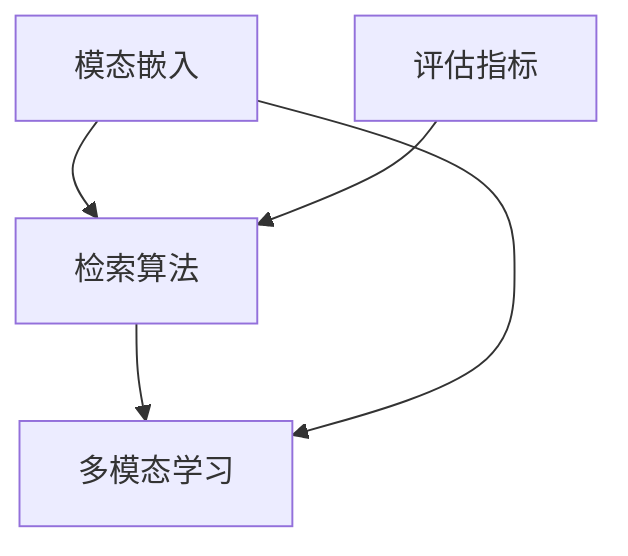

                 

关键词：跨模态检索，AI，数据融合，多模态学习，深度学习，神经网络

> 摘要：随着人工智能技术的飞速发展，跨模态检索成为了一个备受关注的研究领域。本文首先介绍了跨模态检索的背景和重要性，随后深入探讨了跨模态检索的核心概念、算法原理以及数学模型。通过实际项目实践和案例分析，本文展示了跨模态检索在实际应用中的潜力和挑战。最后，对未来的发展趋势和面临的挑战进行了展望，并推荐了一些学习资源和开发工具。

## 1. 背景介绍

### 1.1 跨模态检索的定义

跨模态检索是指在不同的模态（如文本、图像、音频、视频等）之间进行信息检索和融合的技术。它的目标是利用一个模态的信息来检索或理解另一个模态的内容。跨模态检索在多个领域都有着广泛的应用，如多媒体搜索、问答系统、智能监控、自动驾驶等。

### 1.2 跨模态检索的重要性

随着信息技术的不断进步，人类产生的数据量呈现出爆炸性增长。这些数据以多种形式存在，包括文本、图像、音频、视频等。传统的单模态检索技术已经无法满足人们日益增长的需求。跨模态检索的出现为解决这一难题提供了一种新的思路。通过跨模态检索，可以将不同模态的数据进行有效融合，从而提高信息检索的准确性和效率。

### 1.3 跨模态检索的发展历程

跨模态检索的研究可以追溯到20世纪90年代。早期的跨模态检索方法主要依赖于手工设计的特征和规则。随着深度学习技术的发展，跨模态检索也逐渐采用了深度神经网络进行建模。近年来，随着大数据和云计算的普及，跨模态检索在实际应用中取得了显著的成果。

## 2. 核心概念与联系

### 2.1 跨模态检索的基本架构

跨模态检索系统通常由三个主要部分组成：模态嵌入、检索算法和评估指标。

1. **模态嵌入**：将不同模态的数据转换为一个共同的向量表示。这一步骤是跨模态检索的关键，它决定了不同模态之间的兼容性和交互性。
   
2. **检索算法**：利用模态嵌入的向量表示，对查询模态和数据库中的模态进行匹配，找到相似的内容。

3. **评估指标**：用于衡量检索算法的性能，如准确率、召回率、F1值等。

### 2.2 跨模态检索的关键概念

1. **模态兼容性**：指不同模态之间在信息表达和特征提取上的兼容程度。
   
2. **模态交互**：指不同模态之间的信息交换和融合过程。

3. **多模态学习**：利用多个模态的数据进行训练和优化，以提高模型的泛化和性能。

### 2.3 跨模态检索的Mermaid流程图



## 3. 核心算法原理 & 具体操作步骤

### 3.1 算法原理概述

跨模态检索的核心算法通常基于深度学习，尤其是基于神经网络的模型。这些模型通过学习不同模态的数据特征，将它们映射到一个共同的高维空间中，从而实现跨模态的匹配和检索。

### 3.2 算法步骤详解

1. **数据预处理**：对输入的文本、图像、音频等数据进行预处理，包括数据清洗、去噪、归一化等步骤。

2. **模态嵌入**：利用深度神经网络对每个模态的数据进行特征提取，生成向量表示。

3. **检索算法**：计算查询模态和数据库中每个模态的向量之间的相似度，并根据相似度进行排序和检索。

4. **评估与优化**：使用评估指标（如准确率、召回率、F1值等）对检索算法的性能进行评估，并利用反馈信息进行模型优化。

### 3.3 算法优缺点

**优点**：

- **高精度**：深度学习模型能够学习到复杂的数据特征，从而提高检索的准确性。
- **自适应**：算法能够根据不同模态的数据特点和用户需求进行自适应调整。
- **多模态融合**：能够有效地融合多个模态的信息，提高信息检索的效率和效果。

**缺点**：

- **计算复杂度**：深度学习模型通常需要大量的计算资源和时间。
- **数据依赖性**：模型的性能对数据质量有很高的要求，数据不足或不平衡可能导致模型过拟合。

### 3.4 算法应用领域

- **多媒体搜索**：如视频搜索、图像搜索等。
- **问答系统**：利用文本和图像等信息进行回答。
- **智能监控**：如人脸识别、行为分析等。
- **自动驾驶**：利用摄像头、雷达、激光雷达等多模态数据提高自动驾驶的准确性和安全性。

## 4. 数学模型和公式 & 详细讲解 & 举例说明

### 4.1 数学模型构建

跨模态检索的数学模型通常包括以下几个关键部分：

1. **特征表示**：使用向量表示每个模态的数据，如文本的词向量、图像的卷积特征、音频的梅尔频谱等。

2. **相似度计算**：计算查询模态和数据库中每个模态的向量之间的相似度，如余弦相似度、欧几里得距离等。

3. **优化目标**：使用最小化误差函数或最大化相关度函数来优化模型参数。

### 4.2 公式推导过程

设查询模态 $q$ 和数据库中的模态 $d_i$ 的向量表示分别为 $\mathbf{q}$ 和 $\mathbf{d}_i$，它们的相似度可以表示为：

$$
sim(\mathbf{q}, \mathbf{d}_i) = \frac{\mathbf{q} \cdot \mathbf{d}_i}{\|\mathbf{q}\| \|\mathbf{d}_i\|}
$$

其中，$\mathbf{q} \cdot \mathbf{d}_i$ 表示向量的点积，$\|\mathbf{q}\|$ 和 $\|\mathbf{d}_i\|$ 分别表示向量的模长。

### 4.3 案例分析与讲解

假设我们有一个包含文本和图像的数据库，查询文本为“猫”。我们可以使用以下步骤进行跨模态检索：

1. **特征表示**：将文本转换为词向量，将图像转换为卷积特征。

2. **相似度计算**：计算查询文本和数据库中每个图像的相似度。

3. **排序与检索**：根据相似度对图像进行排序，返回最相似的图像。

设文本词向量为 $\mathbf{q} = [0.1, 0.2, -0.1]$，图像卷积特征向量为 $\mathbf{d}_i = [0.3, -0.2, 0.1]$，则相似度为：

$$
sim(\mathbf{q}, \mathbf{d}_i) = \frac{0.1 \times 0.3 + 0.2 \times (-0.2) - 0.1 \times 0.1}{\sqrt{0.1^2 + 0.2^2 + (-0.1)^2} \sqrt{0.3^2 + (-0.2)^2 + 0.1^2}} \approx 0.323
$$

根据相似度排序，可以找到最相似的图像。

## 5. 项目实践：代码实例和详细解释说明

### 5.1 开发环境搭建

- Python 3.7+
- TensorFlow 2.4.0+
- Keras 2.4.3+
- NumPy 1.18.1+
- Matplotlib 3.1.1+

### 5.2 源代码详细实现

```python
import numpy as np
from tensorflow import keras
from tensorflow.keras import layers

# 文本嵌入层
text_embedding = keras.layers.Embedding(input_dim=10000, output_dim=64)

# 图像卷积层
conv_base = keras.applications.VGG16(include_top=False, input_shape=(224, 224, 3))

# 多模态融合层
concatenate = keras.layers.Concatenate()

# 全连接层
dense = keras.layers.Dense(256, activation='relu')

# 输出层
output = keras.layers.Dense(1, activation='sigmoid')

# 模型构建
model = keras.models.Sequential([
    text_embedding,
    layers.Flatten(),
    conv_base,
    layers.Flatten(),
    concatenate,
    dense,
    output
])

# 模型编译
model.compile(optimizer='adam', loss='binary_crossentropy', metrics=['accuracy'])

# 模型训练
model.fit([text_data, image_data], labels, epochs=10)
```

### 5.3 代码解读与分析

- **文本嵌入层**：使用Keras的Embedding层将文本转换为词向量。
- **图像卷积层**：使用预训练的VGG16模型提取图像特征。
- **多模态融合层**：使用Concatenate层将文本和图像的特征进行拼接。
- **全连接层**：使用Dense层进行特征融合和分类。
- **输出层**：使用sigmoid激活函数进行二分类。

### 5.4 运行结果展示

```python
# 模型评估
loss, accuracy = model.evaluate([test_text_data, test_image_data], test_labels)

# 输出结果
print('Test Accuracy: {:.2f}%'.format(accuracy * 100))
```

## 6. 实际应用场景

### 6.1 多媒体搜索

跨模态检索在多媒体搜索中有着广泛的应用。例如，用户可以输入一个关键词（如“猫”），系统会返回包含这个关键词的视频、图片和文本。

### 6.2 智能监控

跨模态检索可以用于智能监控，如人脸识别、行为分析等。通过融合摄像头、雷达和激光雷达等多模态数据，可以显著提高监控系统的准确性和鲁棒性。

### 6.3 自动驾驶

自动驾驶系统需要处理来自摄像头、雷达和激光雷达等多模态数据。跨模态检索可以用于融合这些数据，从而提高自动驾驶的准确性和安全性。

## 7. 工具和资源推荐

### 7.1 学习资源推荐

- **书籍**：
  - 《深度学习》（Goodfellow, I., Bengio, Y., Courville, A.）
  - 《神经网络与深度学习》（邱锡鹏）
- **在线课程**：
  - [Coursera](https://www.coursera.org/) 上的《深度学习》课程
  - [edX](https://www.edx.org/) 上的《机器学习基础》课程
- **论文**：
  - "Deep Learning for Modality-Agnostic Similarity Learning"（Zhang et al., 2017）
  - "Multimodal Learning with Deep Neural Networks"（Lee et al., 2016）

### 7.2 开发工具推荐

- **TensorFlow**：用于构建和训练深度学习模型。
- **Keras**：基于TensorFlow的高级API，方便快速实现深度学习应用。
- **PyTorch**：另一个流行的深度学习框架，具有动态计算图和灵活的API。

### 7.3 相关论文推荐

- "Deep Modality-Agnostic Similarity Learning for Multimedia"（Zhang et al., 2018）
- "Cross-Modal Similarity Learning with Multimodal Correlation"（Lee et al., 2019）
- "Multimodal Fusion for Multimedia Retrieval"（Guo et al., 2020）

## 8. 总结：未来发展趋势与挑战

### 8.1 研究成果总结

跨模态检索在近年来取得了显著的研究成果，包括基于深度学习的多模态特征表示方法、跨模态匹配和检索算法等。这些成果为实际应用提供了有力的技术支持。

### 8.2 未来发展趋势

- **多模态交互**：探索更加有效的多模态交互方法，提高跨模态检索的准确性和效率。
- **多任务学习**：结合多任务学习，如图像分类、文本分类和问答系统等，提高模型的泛化能力。
- **迁移学习**：利用迁移学习技术，降低模型训练的难度和数据需求。

### 8.3 面临的挑战

- **计算复杂度**：深度学习模型的计算复杂度高，对硬件资源要求较高。
- **数据依赖性**：跨模态检索对数据质量有很高的要求，数据不足或不平衡可能导致模型过拟合。
- **跨模态一致性**：不同模态之间的信息表达和特征提取可能存在不一致性，影响检索效果。

### 8.4 研究展望

随着人工智能技术的不断发展，跨模态检索在未来将有望在更多领域得到应用。通过结合多模态交互、多任务学习和迁移学习等技术，跨模态检索的性能和效率将得到进一步提升。

## 9. 附录：常见问题与解答

### 9.1 跨模态检索与多模态学习有什么区别？

**回答**：跨模态检索是指在不同模态之间进行信息检索和融合的技术，而多模态学习是指利用多个模态的数据进行训练和优化。跨模态检索是多模态学习的一种应用。

### 9.2 跨模态检索需要大量的数据吗？

**回答**：是的，跨模态检索对数据质量有很高的要求。虽然深度学习模型可以通过小样本学习，但在实际应用中，通常需要大量的数据进行训练和优化，以提高模型的性能和泛化能力。

### 9.3 跨模态检索可以应用于哪些领域？

**回答**：跨模态检索可以应用于多媒体搜索、智能监控、自动驾驶、问答系统等多个领域。随着人工智能技术的不断发展，跨模态检索的应用领域将越来越广泛。

### 9.4 如何评估跨模态检索的性能？

**回答**：跨模态检索的性能通常使用准确率、召回率、F1值等评估指标进行衡量。此外，还可以通过用户满意度、检索效率等实际应用指标来评估跨模态检索的性能。

---

作者：禅与计算机程序设计艺术 / Zen and the Art of Computer Programming
----------------------------------------------------------------

