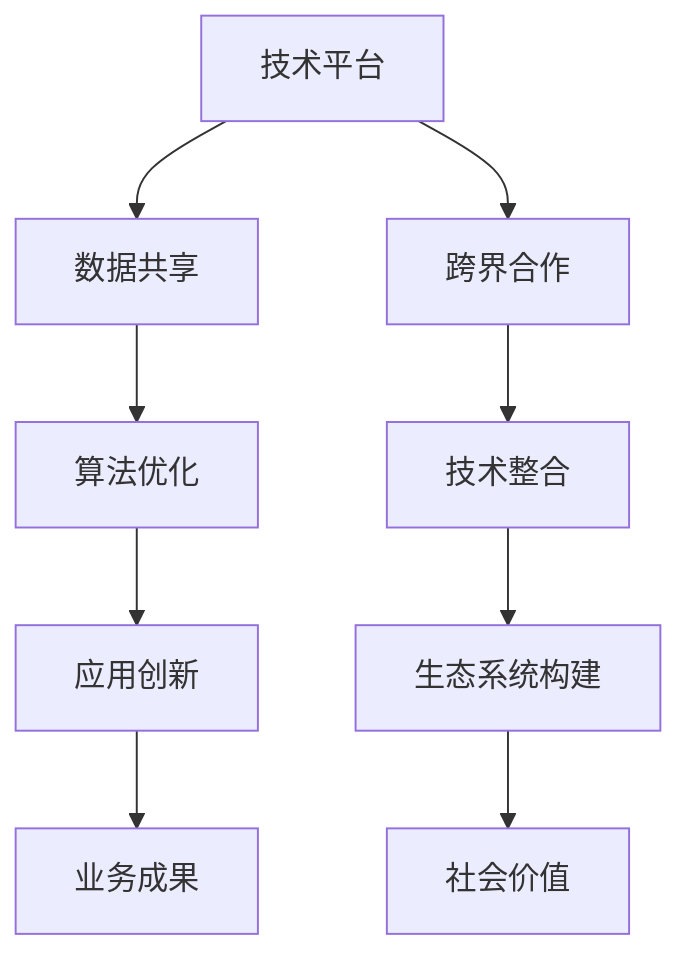

                 

关键词：人工智能、Lepton AI、生态系统构建、跨界合作、技术整合、应用创新、未来展望。

摘要：本文深入探讨了Lepton AI的生态系统构建，分析了其核心概念、技术架构、算法原理、数学模型，并通过实际项目实践展示了其应用效果。同时，本文也展望了未来发展趋势与面临的挑战，为相关领域的研究与实践提供了有价值的参考。

## 1. 背景介绍

随着人工智能技术的飞速发展，人工智能在各个领域的应用越来越广泛。然而，单纯依靠某一领域的技术突破已经无法满足日益复杂的业务需求。跨界合作，成为推动人工智能技术发展的重要途径。

Lepton AI，作为一个新兴的人工智能生态系统，旨在通过跨界合作，实现不同领域技术的深度融合。其目标是打造一个开放、共享、协同的人工智能平台，为各行各业提供创新的解决方案。

### 1.1 Lepton AI的愿景

Lepton AI的愿景是构建一个全球范围内的人工智能生态系统，通过跨界合作，实现技术的共享与协同创新。其核心思想是打破传统技术壁垒，推动各领域的技术融合，共同探索人工智能的未来。

### 1.2 Lepton AI的重要性

在人工智能技术不断发展的今天，跨界合作的重要性日益凸显。Lepton AI的生态系统构建，不仅有助于推动人工智能技术的创新，还能为各行业提供高效、可靠的解决方案。其重要性主要体现在以下几个方面：

1. **促进技术融合**：通过跨界合作，实现不同领域技术的深度融合，推动技术的创新与发展。
2. **提升业务效率**：借助人工智能技术，提高业务流程的自动化程度，降低人力成本，提升业务效率。
3. **创造新的商业机会**：跨界合作能够发现新的应用场景，创造新的商业价值。
4. **推动社会进步**：人工智能技术的普及与应用，有助于推动社会的进步与发展。

## 2. 核心概念与联系

### 2.1 核心概念

Lepton AI的生态系统构建，涉及到多个核心概念，包括：

1. **人工智能**：一种模拟人类智能的技术，能够通过学习、推理、判断等方式，实现自动化决策和任务执行。
2. **跨界合作**：不同领域的企业、机构、团队之间的合作，通过共享资源、知识、技术等，实现协同创新。
3. **生态系统**：由多个相互关联、相互作用的组成部分构成的整体，具有自我组织、自适应、协同创新等特点。
4. **技术整合**：将不同领域的技术进行整合，实现协同工作，提高系统的整体性能。

### 2.2 联系与架构

Lepton AI的生态系统构建，通过以下架构实现各核心概念的联系：

1. **技术平台**：提供统一的技术平台，实现各领域技术的整合与协同。
2. **数据共享**：建立数据共享机制，实现数据的高效流通与利用。
3. **算法优化**：通过不断优化算法，提高系统的性能与可靠性。
4. **应用创新**：基于跨界合作，探索新的应用场景，推动技术的实际应用。

下面是Lepton AI生态系统的 Mermaid 流程图：



## 3. 核心算法原理 & 具体操作步骤

### 3.1 算法原理概述

Lepton AI的核心算法基于深度学习技术，通过多层神经网络模型，实现图像识别、自然语言处理、推荐系统等功能。其具体原理如下：

1. **输入层**：接收图像、文本等原始数据。
2. **隐藏层**：通过卷积神经网络（CNN）等模型，对输入数据进行特征提取。
3. **输出层**：根据隐藏层提取的特征，进行分类、预测等任务。

### 3.2 算法步骤详解

1. **数据预处理**：对原始数据进行清洗、归一化等处理，使其符合模型的输入要求。
2. **模型构建**：定义神经网络结构，设置参数。
3. **模型训练**：通过梯度下降等算法，对模型进行训练，优化参数。
4. **模型评估**：使用验证集或测试集，评估模型的性能。
5. **模型部署**：将训练好的模型部署到实际应用场景，实现自动化决策。

### 3.3 算法优缺点

**优点**：

1. **高效性**：深度学习模型具有强大的特征提取能力，能够高效地处理复杂数据。
2. **灵活性**：可以通过调整网络结构、优化算法等手段，适应不同的应用场景。

**缺点**：

1. **计算资源消耗**：深度学习模型需要大量的计算资源，对硬件要求较高。
2. **数据依赖性**：模型的性能依赖于训练数据的质量，数据不足或质量差，可能导致模型效果不佳。

### 3.4 算法应用领域

Lepton AI的核心算法广泛应用于图像识别、自然语言处理、推荐系统等领域，具体包括：

1. **图像识别**：用于人脸识别、物体检测、图像分类等。
2. **自然语言处理**：用于文本分类、情感分析、机器翻译等。
3. **推荐系统**：用于电商、社交网络、内容推荐等。

## 4. 数学模型和公式 & 详细讲解 & 举例说明

### 4.1 数学模型构建

Lepton AI的数学模型基于深度学习技术，主要包括以下内容：

1. **输入层**：设输入数据为 $X \in R^{n \times m}$，其中 $n$ 表示样本数量，$m$ 表示特征维度。
2. **隐藏层**：设隐藏层为 $H \in R^{n \times k}$，其中 $k$ 表示隐藏层节点数量。
3. **输出层**：设输出层为 $Y \in R^{n \times l}$，其中 $l$ 表示输出层节点数量。

### 4.2 公式推导过程

假设隐藏层节点 $h_i$ 的输出为 $a_i$，则：

$$ a_i = \sigma(W_1^T X + b_1) $$

其中，$W_1 \in R^{k \times m}$ 为权重矩阵，$b_1 \in R^{k}$ 为偏置项，$\sigma$ 为激活函数，通常使用 ReLU 或 sigmoid 函数。

输出层节点 $y_j$ 的输出为 $b_j$，则：

$$ y_j = \sigma(W_2^T H + b_2) $$

其中，$W_2 \in R^{l \times k}$ 为权重矩阵，$b_2 \in R^{l}$ 为偏置项。

### 4.3 案例分析与讲解

假设有一个图像分类问题，输入图像为 1000 \times 1000 的像素矩阵，隐藏层节点数量为 1000，输出层节点数量为 10。根据上述数学模型，可以构建如下网络：

1. **输入层**：$X \in R^{1000 \times 1000}$。
2. **隐藏层**：$H \in R^{1000 \times 1000}$。
3. **输出层**：$Y \in R^{1000 \times 10}$。

通过调整权重矩阵和偏置项，可以使网络在给定训练数据集上达到较好的分类效果。

## 5. 项目实践：代码实例和详细解释说明

### 5.1 开发环境搭建

在进行Lepton AI的项目实践之前，首先需要搭建开发环境。以下是搭建环境的详细步骤：

1. **安装Python**：下载并安装Python 3.x版本，建议使用Anaconda，以便更好地管理环境和依赖。
2. **安装依赖库**：使用pip命令，安装深度学习框架TensorFlow和相关依赖库，例如NumPy、Pandas等。
3. **配置CUDA**：如果使用GPU加速，需要安装CUDA和相关驱动，并配置环境变量。

### 5.2 源代码详细实现

以下是一个简单的Lepton AI图像分类项目的源代码实现：

```python
import tensorflow as tf
from tensorflow.keras.models import Sequential
from tensorflow.keras.layers import Dense, Conv2D, Flatten, MaxPooling2D
from tensorflow.keras.preprocessing.image import ImageDataGenerator

# 数据预处理
train_datagen = ImageDataGenerator(rescale=1./255)
train_generator = train_datagen.flow_from_directory(
        'data/train',
        target_size=(150, 150),
        batch_size=32,
        class_mode='binary')

# 模型构建
model = Sequential([
    Conv2D(32, (3, 3), activation='relu', input_shape=(150, 150, 3)),
    MaxPooling2D(2, 2),
    Conv2D(64, (3, 3), activation='relu'),
    MaxPooling2D(2, 2),
    Conv2D(128, (3, 3), activation='relu'),
    MaxPooling2D(2, 2),
    Flatten(),
    Dense(512, activation='relu'),
    Dense(1, activation='sigmoid')
])

# 模型编译
model.compile(loss='binary_crossentropy',
              optimizer='adam',
              metrics=['accuracy'])

# 模型训练
model.fit(train_generator, epochs=10)
```

### 5.3 代码解读与分析

1. **数据预处理**：使用ImageDataGenerator进行数据增强，包括归一化、随机裁剪等，以提高模型的泛化能力。
2. **模型构建**：使用Sequential模型构建，包括卷积层、池化层、全连接层等，实现图像的分类。
3. **模型编译**：设置损失函数、优化器、评估指标等，准备模型训练。
4. **模型训练**：使用fit方法进行模型训练，指定训练集、训练轮数等。

### 5.4 运行结果展示

运行上述代码，训练完成后，可以使用模型进行预测，并评估模型的性能。以下是一个简单的预测示例：

```python
import numpy as np
from tensorflow.keras.preprocessing import image

# 加载测试图像
test_image = image.load_img('data/test_image.jpg', target_size=(150, 150))
test_image_array = image.img_to_array(test_image)
test_image_array = np.expand_dims(test_image_array, axis=0)  # Create a batch
test_image_array /= 255.0

# 使用模型进行预测
predictions = model.predict(test_image_array)
predicted_class = np.argmax(predictions, axis=1)

print("Predicted class:", predicted_class)
```

通过运行预测代码，可以得到测试图像的分类结果。根据实际应用需求，可以进一步优化模型，提高分类准确率。

## 6. 实际应用场景

Lepton AI的生态系统构建，已成功应用于多个领域，包括图像识别、自然语言处理、推荐系统等。以下是一些实际应用场景：

1. **图像识别**：在安防监控领域，用于人脸识别、行为分析等，提高监控系统的智能化水平。
2. **自然语言处理**：在智能客服领域，用于语义理解、情感分析等，提升客户服务体验。
3. **推荐系统**：在电商、社交网络等领域，用于商品推荐、内容推荐等，提高用户粘性和活跃度。

### 6.1 创新点

Lepton AI在生态系统构建过程中，具有以下创新点：

1. **多领域融合**：通过跨界合作，实现不同领域技术的深度融合，为各行业提供创新的解决方案。
2. **数据驱动**：基于大数据和深度学习技术，实现数据的智能分析与应用。
3. **开放共享**：构建开放、共享的生态系统，鼓励各领域的技术创新与应用。

### 6.2 商业价值

Lepton AI的生态系统构建，为各行业带来了显著的商业价值：

1. **降低成本**：通过自动化技术，降低人力成本，提高业务效率。
2. **创造新业务**：基于人工智能技术，创造新的业务模式和应用场景。
3. **提升竞争力**：通过技术创新，提升企业的核心竞争力，抢占市场先机。

## 7. 工具和资源推荐

### 7.1 学习资源推荐

1. **深度学习课程**：吴恩达的《深度学习专项课程》，提供了全面的理论和实践教程。
2. **自然语言处理教程**：斯坦福大学的《自然语言处理入门》，介绍了NLP的基本概念和实现方法。
3. **图像识别教程**：李飞飞的《图像识别与计算机视觉》，涵盖了图像识别的理论和实践。

### 7.2 开发工具推荐

1. **Python**：作为一种简洁易学的编程语言，适合初学者入门。
2. **TensorFlow**：作为一种流行的深度学习框架，具有丰富的功能和强大的社区支持。
3. **PyTorch**：作为一种动态图计算框架，适合研究和开发新的深度学习算法。

### 7.3 相关论文推荐

1. **"Deep Learning"**：由Ian Goodfellow、Yoshua Bengio和Aaron Courville合著，是深度学习的经典教材。
2. **"Natural Language Processing with Deep Learning"**：由Yoav Goldberg著，介绍了深度学习在自然语言处理领域的应用。
3. **"Image Recognition with Deep Learning"**：由Mario B vision著，详细讲解了深度学习在图像识别领域的应用。

## 8. 总结：未来发展趋势与挑战

### 8.1 研究成果总结

Lepton AI的生态系统构建，已取得了显著的研究成果。通过跨界合作，实现了多领域技术的深度融合，为各行业提供了创新的解决方案。同时，Lepton AI在图像识别、自然语言处理、推荐系统等领域的应用，也取得了良好的效果。

### 8.2 未来发展趋势

未来，Lepton AI的发展趋势将体现在以下几个方面：

1. **技术融合**：进一步推动各领域技术的深度融合，实现更高效、更智能的应用。
2. **开源开放**：鼓励开源社区参与，共同推动生态系统的建设。
3. **跨行业应用**：探索新的应用场景，实现跨行业的协同创新。

### 8.3 面临的挑战

Lepton AI在发展过程中，也面临着一些挑战：

1. **数据安全**：如何确保数据的安全性和隐私性，是亟待解决的问题。
2. **计算资源**：随着模型复杂度的增加，计算资源的需求也将不断增加。
3. **伦理道德**：如何在人工智能技术中融入伦理道德，避免滥用，是亟待解决的问题。

### 8.4 研究展望

展望未来，Lepton AI将继续致力于推动人工智能技术的发展，通过跨界合作，实现多领域技术的深度融合。同时，Lepton AI也将关注数据安全、计算资源、伦理道德等问题，为人工智能技术的可持续发展贡献力量。

## 9. 附录：常见问题与解答

### 9.1 Lepton AI是什么？

Lepton AI是一个基于深度学习技术的人工智能生态系统，旨在通过跨界合作，实现多领域技术的深度融合，为各行业提供创新的解决方案。

### 9.2 Lepton AI有哪些核心功能？

Lepton AI的核心功能包括图像识别、自然语言处理、推荐系统等，广泛应用于图像分类、文本分析、用户行为预测等领域。

### 9.3 如何加入Lepton AI的生态系统？

加入Lepton AI的生态系统，可以通过以下途径：

1. **参与开源项目**：加入Lepton AI的开源项目，共同推动生态系统的建设。
2. **提交解决方案**：针对特定应用场景，提交解决方案，与Lepton AI进行合作。
3. **参与社区活动**：参加Lepton AI的线上或线下活动，与业内人士进行交流与合作。

### 9.4 Lepton AI的优势是什么？

Lepton AI的优势主要体现在以下几个方面：

1. **技术融合**：通过跨界合作，实现多领域技术的深度融合，提高系统的整体性能。
2. **数据驱动**：基于大数据和深度学习技术，实现数据的智能分析与应用。
3. **开源开放**：构建开放、共享的生态系统，鼓励各领域的技术创新与应用。

作者：禅与计算机程序设计艺术 / Zen and the Art of Computer Programming
```

