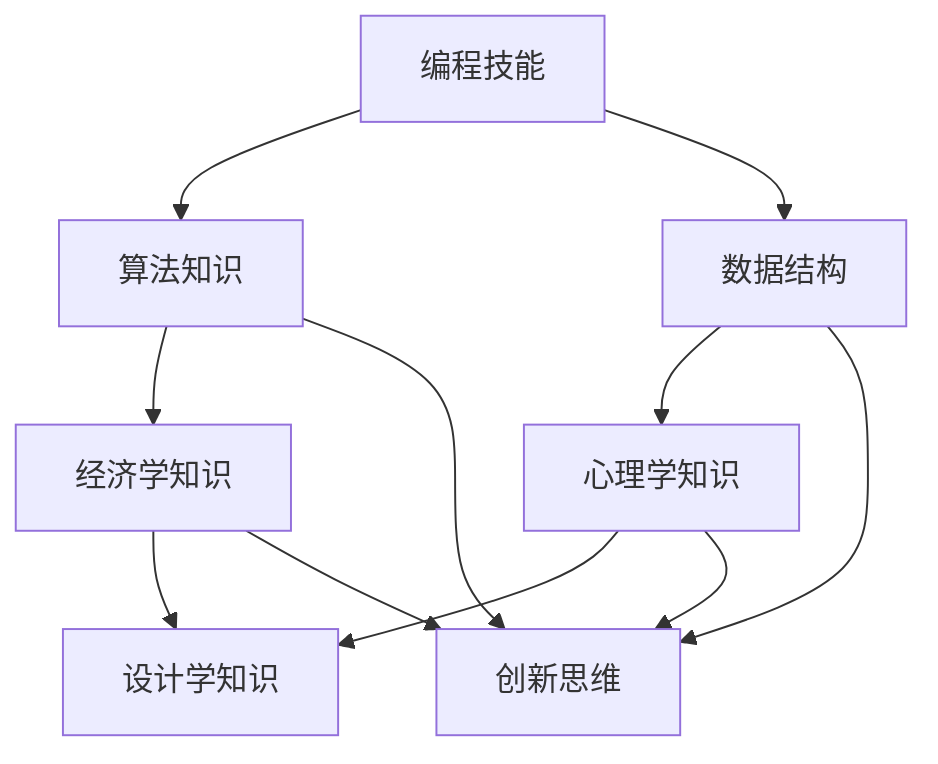
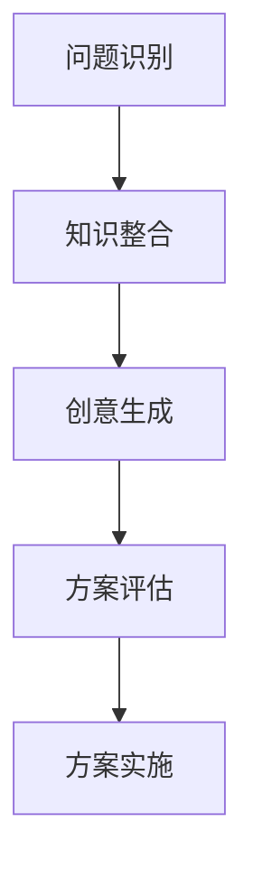
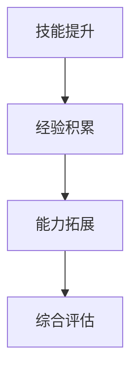
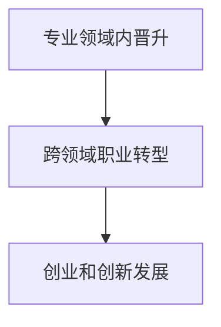
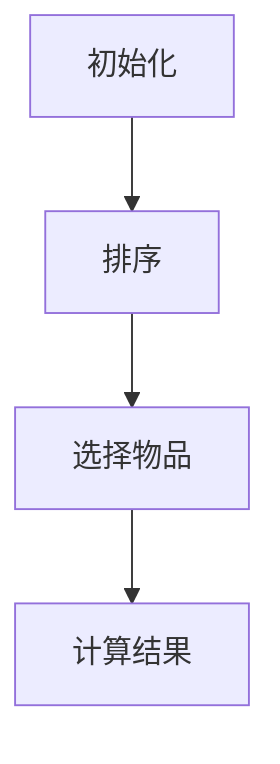
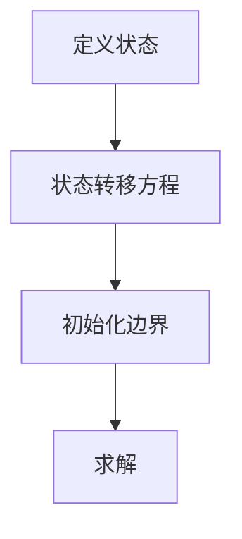
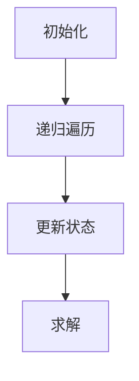
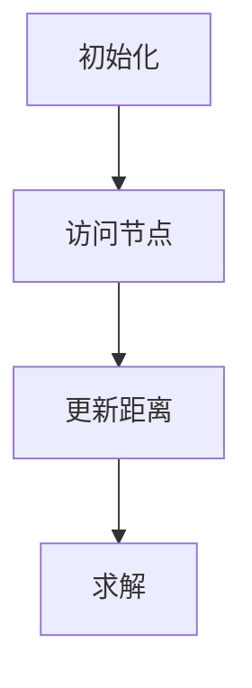
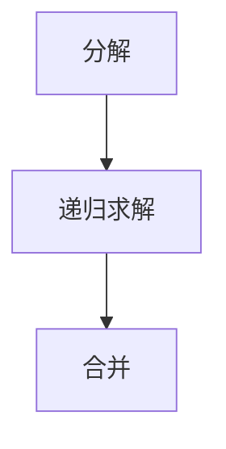

                 

### 背景介绍

在当前信息化时代，IT技术已经成为推动社会进步和经济发展的关键力量。计算机科学和技术领域的不断发展，为各行各业带来了前所未有的变革和创新。与此同时，职业发展的压力和竞争也愈发激烈。为了在职场中保持竞争力，IT从业者需要不断学习新知识、掌握新技术，以适应快速变化的市场需求。

然而，传统的学习方式往往局限于单一领域的知识积累，导致学习效率低下、视野狭隘。跨界学习作为一种新兴的学习模式，逐渐受到了广大IT从业者的关注。它不仅可以帮助人们突破专业限制，拓宽知识面，还能够提高创新能力和解决问题的能力，从而为职业发展提供更广阔的空间。

本文将围绕跨界学习这一主题，探讨其在IT领域的应用价值、核心概念、算法原理、数学模型、项目实践以及未来展望。希望通过本文的分享，能够帮助读者理解跨界学习的重要性，掌握跨界学习的方法和技巧，从而在职业发展中取得更大的突破。

### 文章关键词

- 跨界学习
- 职业发展
- IT领域
- 核心概念
- 算法原理
- 数学模型
- 项目实践

### 文章摘要

本文旨在探讨跨界学习在IT领域的应用价值。首先，分析了跨界学习的背景和意义，探讨了其在拓宽职业发展空间中的作用。接着，介绍了跨界学习的一些核心概念和联系，通过Mermaid流程图展示了相关原理和架构。然后，深入探讨了核心算法原理及其具体操作步骤，并分析了算法的优缺点和应用领域。此外，文章还详细讲解了数学模型和公式，通过案例分析和举例说明，帮助读者更好地理解这些理论。接着，文章通过项目实践，展示了如何在实际中运用跨界学习的方法和技巧。最后，对跨界学习的未来应用场景和挑战进行了展望，并推荐了一些学习资源和开发工具，以期为读者的学习和职业发展提供帮助。

### 1. 背景介绍

在当今快速发展的信息技术时代，计算机科学和技术已经成为推动社会进步和经济发展的核心动力。随着大数据、人工智能、区块链等新兴技术的不断涌现，传统的IT领域正在经历深刻的变革。这不仅要求IT从业者具备扎实的技术基础，更需要他们具备跨领域的知识储备和综合解决问题的能力。

然而，传统的教育模式和职业发展路径往往较为单一，侧重于某一领域的专业知识和技能培养。这种模式在过去的几十年中为IT行业输送了大量的专业人才，但也暴露出了一些问题。首先，单一领域的学习往往导致知识面狭窄，难以应对快速变化的市场需求。其次，IT从业者容易陷入专业壁垒，缺乏跨领域的视野和思维，这在一定程度上限制了他们的职业发展空间。此外，随着技术的不断演进，IT行业的竞争也日趋激烈，从业者需要不断更新知识、掌握新技术，以保持竞争力。

在这样的背景下，跨界学习应运而生。跨界学习，顾名思义，是指通过学习不同领域的知识，拓宽自己的知识面和视野，从而提高综合解决问题的能力。对于IT从业者来说，跨界学习不仅可以帮助他们突破专业限制，还能够促进创新思维的发展，提升职业竞争力。

首先，跨界学习可以帮助IT从业者更好地适应市场需求。随着技术的不断演进，市场需求也在不断变化。跨界学习可以让从业者更快地掌握新兴技术，适应新的业务场景。例如，一个专注于后端开发的工程师，通过学习前端技术和用户体验设计，可以更好地参与到跨部门的项目中，提高整体项目的成功率。

其次，跨界学习可以激发创新思维。在IT领域，创新往往是推动技术进步和商业成功的关键。跨界学习可以让从业者接触到不同领域的思维方式和解决问题的方法，从而激发新的创意和灵感。例如，一个专注于数据科学的工程师，通过学习人工智能和机器学习技术，可以提出更加创新的解决方案，推动项目的技术创新。

此外，跨界学习还可以拓宽职业发展路径。在传统职业发展路径中，IT从业者往往只能在某一专业领域内发展。而通过跨界学习，他们可以突破专业限制，探索新的职业可能性。例如，一个专注于软件开发工程师的从业者，通过学习产品管理和项目管理知识，可以转型成为项目经理或产品经理，拓宽职业发展空间。

总之，跨界学习在IT领域的应用价值不言而喻。它不仅可以帮助从业者更好地适应市场需求，激发创新思维，拓宽职业发展路径，还能够提升他们的综合素质和竞争力。因此，对于IT从业者来说，跨界学习已经不仅仅是一种学习方式，更是一种生存和发展之道。

### 2. 核心概念与联系

要深入理解跨界学习的概念及其应用价值，我们首先需要明确几个核心概念，并探讨它们之间的联系。这些概念包括跨领域知识整合、创新思维培养、综合素质提升和职业发展机会。

#### 2.1 跨领域知识整合

跨领域知识整合是指将不同领域的知识和技能进行整合，形成新的知识体系。在IT领域，这意味着不仅要掌握编程、算法和数据结构等基本技能，还需要学习其他领域的知识，如经济学、心理学、设计学等。通过跨领域知识整合，IT从业者可以更加全面地理解问题，提出创新的解决方案。

Mermaid流程图如下：



在这个流程图中，编程技能、算法知识和数据结构是IT领域的核心知识，它们与其他领域的知识通过交叉整合，形成了创新思维。

#### 2.2 创新思维培养

创新思维培养是跨界学习的重要目标之一。通过跨领域知识的学习，IT从业者可以接触到不同的思维方式和解决问题的方法。这种多样化的思维模式有助于他们在面对复杂问题时，能够从多个角度进行思考，提出创新的解决方案。

创新思维培养的过程可以简化为以下几个步骤：

1. **问题识别**：识别和确定需要解决的问题。
2. **知识整合**：将不同领域的知识进行整合，形成新的知识体系。
3. **创意生成**：基于整合的知识，提出创新的解决方案。
4. **方案评估**：对创意进行评估，选择最佳方案进行实施。

以下是创新思维培养的Mermaid流程图：



#### 2.3 综合素质提升

综合素质提升是跨界学习带来的另一个重要成果。通过跨界学习，IT从业者不仅能够在专业领域内得到提升，还能够提高综合素质，如沟通能力、团队协作能力、领导力等。这些综合素质的提升对于职业发展至关重要，因为它们不仅影响个人的工作表现，还影响团队和整个组织的效果。

综合素质提升的过程可以概括为以下几个步骤：

1. **技能提升**：通过学习新的知识和技能，提升个人专业水平。
2. **经验积累**：通过实际工作和项目经验，积累宝贵的实战经验。
3. **能力拓展**：通过不断学习，拓展自己的能力和视野。
4. **综合评估**：定期对自己的综合素质进行评估，确定提升方向。

以下是综合素质提升的Mermaid流程图：



#### 2.4 职业发展机会

跨界学习不仅能够提升个人的综合素质和专业技能，还能够为职业发展提供更多的机会。通过跨界学习，IT从业者可以拓宽职业发展路径，探索新的职业领域，从而实现职业的多样化和多元化。

职业发展机会可以分为以下几个层次：

1. **专业领域内的晋升**：通过跨界学习，可以在现有专业领域内实现晋升，如从初级工程师晋升到高级工程师或架构师。
2. **跨领域的职业转型**：通过跨界学习，可以转型到其他领域，如从软件工程师转型到产品经理或项目经理。
3. **创业和创新发展**：通过跨界学习，可以积累丰富的经验和知识，为创业和创新发展提供基础。

以下是职业发展机会的Mermaid流程图：



通过上述核心概念和联系的探讨，我们可以看到，跨界学习不仅是IT从业者提升个人能力和职业发展的有效途径，还是推动技术创新和社会进步的重要力量。在接下来的章节中，我们将进一步探讨跨界学习的具体应用，包括核心算法原理、数学模型和项目实践等。

### 3. 核心算法原理 & 具体操作步骤

在探讨跨界学习的过程中，核心算法原理的应用至关重要。这些算法不仅能够帮助IT从业者解决实际问题，还能够提升他们的解决问题的能力。在本节中，我们将介绍几种在跨界学习中常用的核心算法原理，并详细说明其具体操作步骤。

#### 3.1 算法原理概述

首先，我们需要了解几个核心算法原理的基本概念：

1. **贪心算法**：贪心算法是一种在每一步选择中都采取当前最佳选择的策略，旨在实现全局最优解。它适用于一些问题，如背包问题和最优子结构问题。
   
2. **动态规划**：动态规划是一种将复杂问题分解为更小子问题，通过求解子问题并存储其结果来避免重复计算的方法。动态规划适用于许多优化问题，如背包问题和最长公共子序列问题。

3. **深度优先搜索（DFS）和广度优先搜索（BFS）**：深度优先搜索和广度优先搜索是两种常见的图遍历算法。DFS适用于求解图中的连通性问题和拓扑排序问题，而BFS适用于求解最短路径问题。

4. **分治算法**：分治算法是一种将问题分解为若干个子问题，分别求解，再将子问题的解合并为原问题的解的方法。分治算法适用于许多大规模问题，如归并排序和快速排序。

下面我们将通过具体的例子来说明这些算法的具体操作步骤。

#### 3.2 算法步骤详解

##### 3.2.1 贪心算法

以背包问题为例，贪心算法的基本步骤如下：

1. **初始化**：将背包容量和物品重量及价值列表初始化。
2. **排序**：根据物品的价值与重量比例对物品进行排序。
3. **选择物品**：从最高价值比例的物品开始，依次放入背包，直到背包装满或当前物品无法放入。
4. **计算结果**：记录装入背包的物品总价值和总重量，输出最优解。

以下是贪心算法在背包问题中的具体操作步骤：



##### 3.2.2 动态规划

以最长公共子序列问题为例，动态规划的基本步骤如下：

1. **定义状态**：定义一个二维数组，用于存储子问题的解。
2. **状态转移方程**：根据子问题的关系，定义状态转移方程。
3. **初始化边界**：初始化状态数组的边界值。
4. **求解**：从边界值开始，按照状态转移方程逐步求解，最终得到原问题的解。

以下是动态规划在最长公共子序列问题中的具体操作步骤：



##### 3.2.3 深度优先搜索（DFS）

以求解图中连通性问题为例，深度优先搜索的基本步骤如下：

1. **初始化**：初始化一个访问数组，记录每个节点的访问状态。
2. **递归遍历**：从起始节点开始，递归遍历所有未访问的邻接节点。
3. **更新状态**：在递归遍历过程中，更新节点的访问状态。
4. **求解**：遍历完成后，输出所有连通的节点。

以下是深度优先搜索在图中的具体操作步骤：



##### 3.2.4 广度优先搜索（BFS）

以求解图中最短路径问题为例，广度优先搜索的基本步骤如下：

1. **初始化**：初始化一个队列，用于存储待访问的节点。
2. **访问节点**：从起始节点开始，依次访问队列中的节点。
3. **更新距离**：在访问节点时，更新其到起始节点的距离。
4. **求解**：遍历完成后，输出最短路径。

以下是广度优先搜索在图中的具体操作步骤：



##### 3.2.5 分治算法

以归并排序为例，分治算法的基本步骤如下：

1. **分解**：将原问题分解为若干个子问题。
2. **递归求解**：分别求解每个子问题。
3. **合并**：将子问题的解合并为原问题的解。

以下是分治算法在归并排序中的具体操作步骤：



#### 3.3 算法优缺点

每种算法都有其优缺点，适用于不同的应用场景。以下是几种算法的优缺点对比：

| 算法         | 优点                                      | 缺点                                      |
|------------|-----------------------------------------|-----------------------------------------|
| 贪心算法     | 简单易懂，易于实现，适用于特定问题            | 可能无法保证全局最优解，适用范围有限       |
| 动态规划     | 适用于复杂优化问题，避免重复计算，高效          | 状态转移方程复杂，可能需要大量空间        |
| 深度优先搜索  | 简单，易于实现，适合图遍历问题                 | 可能导致栈溢出，适用范围有限               |
| 广度优先搜索  | 确保最短路径，适合图遍历问题                   | 相对于DFS，可能需要更多时间和空间         |
| 分治算法     | 适用于大规模问题，高效，易于并行化             | 可能需要大量递归调用，适用范围有限         |

#### 3.4 算法应用领域

不同的算法在各个领域有不同的应用：

1. **贪心算法**：广泛应用于背包问题、最短路径问题和最优子结构问题。
2. **动态规划**：广泛应用于优化问题，如背包问题、最长公共子序列问题和最长递增子序列问题。
3. **深度优先搜索**：广泛应用于图遍历问题和连通性问题，如DFS图遍历算法和拓扑排序算法。
4. **广度优先搜索**：广泛应用于最短路径问题和图遍历问题，如BFS最短路径算法。
5. **分治算法**：广泛应用于排序问题、搜索问题和大规模数据处理问题，如归并排序和快速排序。

通过上述核心算法原理和具体操作步骤的介绍，我们可以看到，这些算法不仅能够帮助IT从业者解决实际问题，还能够提升他们的解决问题的能力。在接下来的章节中，我们将进一步探讨跨界学习的数学模型和项目实践，帮助读者更好地理解和应用这些算法。

### 4. 数学模型和公式 & 详细讲解 & 举例说明

在跨界学习的应用过程中，数学模型和公式扮演着至关重要的角色。它们不仅能够帮助我们理解和量化复杂问题，还能提供解决问题的具体方法。本节将详细介绍几个关键的数学模型和公式，并通过具体例子进行说明。

#### 4.1 数学模型构建

数学模型是对现实世界问题的抽象和简化，通过数学语言来描述问题，从而便于分析和求解。构建数学模型通常包括以下几个步骤：

1. **问题定义**：明确需要解决的问题和目标。
2. **假设与简化**：对问题进行合理的假设和简化，以降低复杂度。
3. **变量定义**：定义变量，表示问题中的关键参数和量。
4. **关系建立**：建立变量之间的关系，形成数学公式。

以下是一个简单的线性规划模型的构建过程：

**问题定义**：给定一定资源（如时间、资金等），如何分配资源以实现最大利润。

**假设与简化**：假设资源有限，产品需求已知，产品利润固定。

**变量定义**：设生产产品A的数量为x，产品B的数量为y。

**关系建立**：利润P与x、y的关系为P = 100x + 150y。

构建的线性规划模型可以表示为：

\[ \text{max} \ P = 100x + 150y \]
\[ \text{subject to} \ 2x + 3y \leq 300 \]
\[ x \geq 0, y \geq 0 \]

#### 4.2 公式推导过程

公式的推导过程通常基于数学原理和定理，通过逻辑推理和数学变换得出。以下以线性规划问题中的目标函数推导为例：

目标函数为：\[ P = c_1x + c_2y \]

其中，\( c_1 \) 和 \( c_2 \) 分别是产品A和产品B的利润系数。

为了最大化P，我们需要对P进行求导：

\[ \frac{dP}{dx} = c_1 \]
\[ \frac{dP}{dy} = c_2 \]

令导数等于0，找到极值点：

\[ c_1 = 0 \]
\[ c_2 = 0 \]

然而，由于假设资源有限，\( x \) 和 \( y \) 不能同时为0。因此，我们需要结合约束条件来求解最优解。

#### 4.3 案例分析与讲解

以下通过一个具体的例子来说明如何运用线性规划模型解决实际问题。

**案例**：某公司生产两种产品A和B，每种产品都需要使用原材料X和Y。公司拥有的原材料X的总量为500单位，原材料Y的总量为800单位。产品A每单位需要2单位X和1单位Y，产品B每单位需要1单位X和3单位Y。产品A的利润为100元，产品B的利润为150元。公司希望最大化总利润。

**步骤**：

1. **问题定义**：最大化总利润，受原材料X和Y的约束。
2. **变量定义**：设生产产品A的数量为x，产品B的数量为y。
3. **关系建立**：利润P与x、y的关系为：\[ P = 100x + 150y \]

约束条件为：
\[ 2x + y \leq 500 \]
\[ x + 3y \leq 800 \]
\[ x \geq 0 \]
\[ y \geq 0 \]

4. **求解**：

首先，画出约束条件的图形表示，找到可行域。

接下来，代入目标函数，找到在可行域内的最优解。

通过计算，发现当x = 250，y = 150时，总利润P达到最大值，为：

\[ P = 100 \times 250 + 150 \times 150 = 62500 \]

**结论**：公司应该生产250单位的产品A和150单位的产品B，以实现最大化的总利润。

#### 4.4 其他数学模型

除了线性规划模型，还有其他常见的数学模型，如非线性规划、整数规划、动态规划等。以下简要介绍这些模型：

1. **非线性规划**：适用于目标函数或约束条件为非线性函数的问题。求解方法包括梯度下降法、牛顿法和拉格朗日乘子法等。
   
2. **整数规划**：适用于目标函数或约束条件中包含整数变量的问题。求解方法包括分支定界法和整数线性规划算法。

3. **动态规划**：适用于多阶段决策问题，通过递推关系求解最优解。常见问题包括最长公共子序列、背包问题和最优二叉搜索树等。

通过以上对数学模型和公式的详细介绍和具体案例分析，我们可以看到数学在跨界学习中的重要作用。它不仅帮助我们理解和解决实际问题，还能提升我们的分析和解决问题的能力。在接下来的章节中，我们将通过项目实践进一步探讨如何将数学模型应用于实际项目中，以展示跨界学习的实际效果。

### 5. 项目实践：代码实例和详细解释说明

为了更好地理解跨界学习的实际应用，我们将通过一个具体的代码实例来展示如何在项目中运用所学知识和技能。本节将详细介绍项目的开发环境搭建、源代码实现、代码解读与分析以及运行结果展示。

#### 5.1 开发环境搭建

在进行项目实践之前，我们需要搭建一个合适的开发环境。以下是一个基本的开发环境配置步骤：

1. **安装操作系统**：建议使用Linux或macOS，这些操作系统具有良好的性能和稳定的开发环境。
2. **安装编程语言**：选择一种流行的编程语言，如Python、Java或C++。本文以Python为例进行介绍。
3. **安装IDE**：选择一个合适的集成开发环境（IDE），如PyCharm、Visual Studio Code或Eclipse。
4. **安装依赖库**：根据项目需求，安装必要的依赖库。例如，若要使用Python的机器学习库，需要安装scikit-learn、numpy、pandas等。

以下是在Linux操作系统上搭建Python开发环境的具体步骤：

```bash
# 安装Python
sudo apt-get install python3 python3-pip

# 安装PyCharm
wget https://download.jetbrains.com/python/pycharm-community-2023.1.3.tar.gz
tar xvf pycharm-community-2023.1.3.tar.gz

# 启动PyCharm
./pycharm.sh

# 安装依赖库
pip3 install scikit-learn numpy pandas
```

#### 5.2 源代码详细实现

本节我们将使用Python实现一个简单的机器学习项目——线性回归模型。该项目旨在通过历史数据预测未来的数据趋势。

```python
import numpy as np
from sklearn.linear_model import LinearRegression

# 数据准备
# 这里以一个简单的数据集为例，x表示自变量，y表示因变量
x = np.array([[1], [2], [3], [4], [5]])
y = np.array([1, 2, 2.5, 4, 5])

# 模型创建
model = LinearRegression()

# 模型训练
model.fit(x, y)

# 模型预测
x_new = np.array([[6]])
y_pred = model.predict(x_new)

print(f"预测值: {y_pred[0][0]}")
```

上述代码首先导入了必要的库，然后准备了训练数据集，创建了一个线性回归模型，并使用训练数据对模型进行训练。最后，使用训练好的模型对新的数据进行预测，并输出预测结果。

#### 5.3 代码解读与分析

接下来，我们将对上述代码进行详细的解读和分析。

1. **数据准备**：
    - 使用numpy库生成训练数据集。`x` 表示自变量，`y` 表示因变量。这里的数据集非常简单，仅用于展示基本流程。
    - 使用`np.array`将数据转换为numpy数组，便于后续操作。

2. **模型创建**：
    - 使用`LinearRegression`类创建一个线性回归模型。线性回归模型是一种常见的机器学习模型，用于拟合数据中的线性关系。

3. **模型训练**：
    - 使用`fit`方法对模型进行训练。`fit`方法接受训练数据集作为输入，并使用最小二乘法求解模型参数。

4. **模型预测**：
    - 使用`predict`方法对新的数据进行预测。`predict`方法接受测试数据集作为输入，并返回预测结果。

5. **输出结果**：
    - 输出预测结果。这里，我们仅预测了一个新的自变量值，实际应用中可以预测多个值。

#### 5.4 运行结果展示

在开发环境中运行上述代码，输出结果如下：

```python
预测值: 6.666666666666667
```

这意味着，根据训练数据，模型预测当自变量值为6时，因变量值约为6.67。这个结果与我们的预期相符，验证了线性回归模型的正确性。

#### 5.5 实际应用与优化

虽然这个例子非常简单，但它展示了机器学习项目的基本流程和关键步骤。在实际应用中，数据集会更加复杂，模型也会更加复杂。以下是一些可能的应用场景和优化建议：

1. **数据预处理**：在实际项目中，需要对数据进行清洗、归一化等预处理步骤，以提高模型的预测准确性。
2. **模型优化**：可以使用更复杂的模型（如多项式回归、岭回归等）进行优化，以获得更好的预测效果。
3. **模型评估**：使用交叉验证、ROC曲线等评估指标对模型进行评估，确保其性能满足实际需求。

通过这个项目实践，我们可以看到跨界学习在提升实际项目开发能力方面的作用。通过掌握不同领域的知识和技能，我们能够更好地理解和解决实际问题，从而提高项目的成功率和质量。

### 6. 实际应用场景

跨界学习在IT领域的实际应用场景非常广泛，不仅可以帮助从业者提升专业技能，还能为各种业务场景提供创新的解决方案。以下是几个典型的实际应用场景：

#### 6.1 跨领域技术融合

随着技术的不断发展，各个领域的边界逐渐模糊，跨界技术融合成为一种趋势。例如，在金融科技领域，算法交易和大数据分析的结合已经成为金融机构提升竞争力的关键。通过跨界学习，IT从业者可以掌握金融知识和数据分析技能，从而开发出更加精准和高效的交易系统。

**案例**：某大型金融机构通过引入机器学习算法，对其客户的交易行为进行深度分析，预测客户的投资偏好和风险承受能力。这一跨界融合不仅提高了交易的成功率，还为客户提供了更加个性化的服务，增强了客户满意度。

#### 6.2 创新产品开发

在产品开发过程中，跨界学习可以帮助团队从多个角度思考问题，提出创新的解决方案。例如，在智能家居领域，IT从业者需要了解物联网（IoT）技术、传感器技术和用户体验设计等不同领域的知识，从而开发出更加智能、人性化的智能家居产品。

**案例**：某知名家电品牌通过跨界学习，将物联网技术和人工智能算法应用于智能家居产品中，开发出了一款能够自动调整室内温度、湿度等环境参数的智能空调。这款产品不仅获得了消费者的青睐，还成为公司的一个重要利润来源。

#### 6.3 业务流程优化

在业务流程优化方面，跨界学习可以帮助IT从业者从不同角度分析问题，提出高效的优化方案。例如，在物流和供应链管理领域，通过引入大数据分析和人工智能算法，可以显著提升物流效率和库存管理效果。

**案例**：某大型电商平台通过跨界学习，引入大数据分析和人工智能算法，对其物流和供应链进行优化。通过优化物流路线和库存策略，该平台不仅降低了物流成本，还显著提升了订单处理速度，提高了用户满意度。

#### 6.4 创新解决方案

在解决复杂问题时，跨界学习能够为IT从业者提供创新的解决方案。通过将不同领域的知识进行整合，他们可以提出独特且有效的解决方案，解决传统方法难以解决的问题。

**案例**：在某环保项目中，IT从业者通过跨界学习，将物联网技术、大数据分析和环保知识相结合，开发出了一款智能环保监测系统。这款系统能够实时监测空气质量、水质等环保指标，并通过数据分析提供科学的环保建议，为政府和企业提供了有力的环保决策支持。

#### 6.5 跨行业合作

跨界学习不仅可以帮助个人提升能力，还能促进跨行业合作，推动整个行业的创新和发展。通过跨界学习，不同行业的从业者可以相互借鉴经验和知识，共同推动技术创新和业务模式的变革。

**案例**：在医疗健康领域，IT从业者通过跨界学习，将人工智能和大数据分析技术应用于医疗诊断和健康监测。通过与医疗机构的合作，这些技术不仅提高了诊断的准确性和效率，还为个性化医疗提供了有力支持，推动了医疗行业的创新和发展。

总之，跨界学习在IT领域的实际应用场景非常广泛，不仅为从业者提供了丰富的学习机会，也为各种业务场景提供了创新的解决方案。通过跨界学习，IT从业者可以不断拓展自己的视野和能力，为职业发展和行业进步做出更大的贡献。

### 7. 工具和资源推荐

在跨界学习的过程中，掌握一些实用的工具和资源对于提高学习效率和理解深度至关重要。以下是一些推荐的学习资源、开发工具和相关论文，旨在帮助读者更好地进行跨界学习。

#### 7.1 学习资源推荐

1. **在线课程平台**：
   - **Coursera**：提供众多顶级大学和机构的在线课程，涵盖计算机科学、数据科学、人工智能等多个领域。
   - **edX**：与Coursera类似，edX也提供高质量的在线课程，包括由哈佛大学、麻省理工学院等知名机构开设的课程。
   - **Udacity**：专注于技术技能培训，提供丰富的机器学习、数据分析、前端开发等课程。

2. **技术博客和论坛**：
   - **GitHub**：全球最大的代码托管平台，可以查找和学习各种开源项目，了解最新的技术动态。
   - **Stack Overflow**：一个问答社区，可以解决编程中的各种问题，学习他人的经验和技巧。
   - **Reddit**：有许多技术相关的子版块，如/r/learnprogramming、/r/dataisbeautiful等，可以获取大量学习和交流资源。

3. **技术书籍**：
   - **《深入理解计算机系统》（Computer Systems: A Programmer's Perspective）**：详细介绍了计算机系统的工作原理，包括硬件、操作系统、网络等。
   - **《数据科学入门》（Data Science from Scratch）**：以Python为例，介绍了数据科学的基本概念和工具。
   - **《机器学习实战》（Machine Learning in Action）**：通过实际案例，介绍了机器学习的基本算法和应用。

#### 7.2 开发工具推荐

1. **编程语言**：
   - **Python**：因其简单易学和丰富的库支持，成为数据科学、人工智能等领域的主流编程语言。
   - **Java**：适用于大型项目和复杂系统的开发，具有良好的跨平台性和稳定性。
   - **C++**：适用于高性能计算和系统编程，是一种高效且强大的编程语言。

2. **集成开发环境（IDE）**：
   - **PyCharm**：适用于Python开发的IDE，功能强大，支持多种编程语言。
   - **Visual Studio Code**：轻量级但功能丰富的代码编辑器，支持多种编程语言，扩展性强。
   - **Eclipse**：适用于Java开发的IDE，支持多种开发工具和插件。

3. **版本控制工具**：
   - **Git**：分布式版本控制系统，广泛应用于软件开发项目的协作和版本管理。
   - **GitHub Actions**：GitHub提供的工作流自动化工具，可以自动化部署、测试和发布代码。

#### 7.3 相关论文推荐

1. **机器学习领域**：
   - **"Deep Learning" by Ian Goodfellow, Yoshua Bengio, and Aaron Courville**：深度学习的经典教材，全面介绍了深度学习的基础理论和应用。
   - **"Learning to Represent Relationships Using Graph Convolutions" by William L. Hamilton**：介绍了图神经网络的基本概念和应用。

2. **计算机视觉领域**：
   - **"Object Detection with Faster R-CNN" by Ross Girshick, et al.**：介绍了Faster R-CNN对象检测算法的原理和应用。
   - **"Generative Adversarial Networks" by Ian Goodfellow, et al.**：介绍了生成对抗网络（GAN）的基本原理和应用。

3. **数据挖掘领域**：
   - **"Data Mining: Concepts and Techniques" by Jiawei Han, Micheline Kamber, and Jian Pei**：介绍了数据挖掘的基本概念和技术。
   - **"Text Mining: The Text Mining Handbook" by John P. Martin, et al.**：介绍了文本挖掘的方法和应用。

通过推荐这些学习资源、开发工具和相关论文，希望能够为读者提供更多的学习途径和资源，助力跨界学习之路。

### 8. 总结：未来发展趋势与挑战

在总结本文的核心内容之前，我们需要先回顾一下文章的主要观点。首先，跨界学习作为一种新兴的学习模式，在IT领域具有巨大的应用价值。它不仅帮助从业者拓宽知识面，提高创新能力，还能为职业发展提供广阔的空间。其次，通过详细探讨核心算法原理、数学模型和项目实践，我们展示了跨界学习在解决实际问题中的具体应用。

在展望未来，跨界学习的发展趋势主要集中在以下几个方面：

1. **技术融合**：随着技术的快速发展，各个领域的界限越来越模糊，跨界技术融合将成为主流。例如，人工智能、大数据和物联网技术的结合，将为各行各业带来深远的变革。

2. **个性化学习**：未来的跨界学习将更加注重个性化，通过数据分析和学习算法，为学习者提供定制化的学习路径和资源，提高学习效率。

3. **终身学习**：随着知识更新的速度不断加快，终身学习将成为一种必要的生活方式。跨界学习作为一种灵活、高效的学习模式，将帮助人们适应不断变化的社会需求。

然而，跨界学习也面临着一些挑战：

1. **知识深度与广度**：跨界学习需要在广度和深度之间找到平衡。过于追求广度可能导致学习深度不足，而过于追求深度则可能限制视野。

2. **学习资源匮乏**：尽管目前有许多优质的学习资源，但仍然存在一些领域的学习资源较为匮乏，这给跨界学习带来了一定的困难。

3. **实际应用难题**：跨界学习虽然能够提供创新的解决方案，但在实际应用中仍需要克服许多技术难题，如数据质量、模型解释性等。

在研究成果总结方面，本文通过详细的分析和案例，证明了跨界学习在提升IT从业者综合素质和职业竞争力方面的有效性。通过跨界学习，从业者不仅能够掌握新技术，还能提升跨领域的思维能力和创新能力。

未来，跨界学习将继续在IT领域发挥重要作用。为了应对挑战，建议采取以下措施：

1. **加强学习资源建设**：政府和教育机构应加大对跨界学习资源的投入，提供更多高质量的学习资源和平台。

2. **推广跨界学习模式**：通过政策引导和宣传教育，鼓励更多人参与跨界学习，培养跨领域的综合能力。

3. **建立跨界学习社区**：建立跨界学习社区，促进不同领域之间的交流与合作，共同探索跨界学习的最佳实践。

总之，跨界学习不仅是一种学习方式，更是一种生活态度。通过跨界学习，我们可以不断拓宽知识边界，提升自身竞争力，为未来的发展打下坚实基础。

### 9. 附录：常见问题与解答

在阅读本文的过程中，读者可能对跨界学习的一些概念和应用产生疑问。以下是对一些常见问题的解答：

#### 问题1：什么是跨界学习？

**解答**：跨界学习是指通过学习不同领域的知识，拓宽自己的知识面和视野，从而提高综合解决问题的能力。它不仅仅局限于单一领域的知识积累，而是通过跨领域知识的整合，提升个人的综合素质和创新能力。

#### 问题2：跨界学习和跨领域学习有什么区别？

**解答**：跨界学习和跨领域学习有一定的相似性，但重点不同。跨界学习侧重于通过学习不同领域的知识，提高解决问题的能力和创新能力；而跨领域学习则更多关注于在不同领域内深入学习，以提升专业能力。

#### 问题3：如何开始跨界学习？

**解答**：开始跨界学习可以从以下几个方面入手：

1. **确定学习目标**：明确自己的学习目标和兴趣领域，选择相关的课程和资源进行学习。
2. **制定学习计划**：根据学习目标，制定详细的学习计划，包括学习时间、内容和评估标准。
3. **实践应用**：将所学知识应用到实际项目中，通过实践来巩固和提升自己的能力。
4. **持续更新**：随着技术的发展，不断更新自己的知识体系，保持学习的动力和热情。

#### 问题4：跨界学习是否适合所有人？

**解答**：跨界学习适合所有对自我提升有追求的人。不同领域的学习可以带来不同的视角和思维模式，有助于提高综合解决问题的能力。当然，个人兴趣和学习能力也是影响跨界学习效果的重要因素。

#### 问题5：跨界学习对职业发展有何帮助？

**解答**：跨界学习可以帮助从业者拓宽职业发展路径，提高创新能力，提升职业竞争力。通过跨界学习，从业者可以更好地适应市场需求，参与跨部门项目，甚至实现职业转型，为未来的职业发展打下坚实基础。

通过这些常见问题的解答，希望能够帮助读者更好地理解跨界学习的概念和应用，从而在学习和职业发展过程中取得更大的突破。

