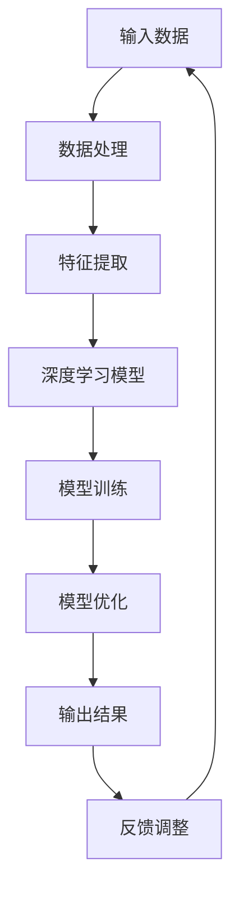

                 

关键词：人工智能、垂直领域、Lepton AI、跨行业应用、解决方案

## 摘要

本文旨在探讨Lepton AI如何通过其先进的深度学习技术和自适应算法，实现跨行业的垂直领域拓展。我们将深入分析Lepton AI的技术原理、核心算法、数学模型，并通过实际项目案例展示其在不同行业中的应用效果。最后，我们将展望Lepton AI在未来发展中所面临的挑战与机遇。

## 1. 背景介绍

### 1.1 人工智能的发展历程

人工智能（AI）作为计算机科学的一个重要分支，其发展历程可以追溯到20世纪50年代。早期的AI研究主要集中在符号主义和逻辑推理上，但随后随着计算能力的提升和大数据的普及，深度学习和机器学习逐渐成为AI领域的主流技术。Lepton AI正是基于这些前沿技术，致力于为不同行业提供高效、智能的解决方案。

### 1.2 垂直领域拓展的重要性

在当前技术环境中，人工智能的应用已不仅限于传统的互联网行业，而是逐渐渗透到金融、医疗、制造业等多个领域。垂直领域拓展的重要性在于，它使得AI技术能够更好地满足特定行业的需求，提高行业效率，降低成本，并创造新的商业价值。

### 1.3 Lepton AI的背景

Lepton AI成立于2010年，是一家专注于人工智能技术研发的企业。其核心技术团队由一批在深度学习、机器学习、自然语言处理等领域具有丰富经验的专家组成。Lepton AI的愿景是通过技术创新推动各个行业的智能化转型，实现全球范围内的AI应用普及。

## 2. 核心概念与联系

为了更好地理解Lepton AI的垂直领域拓展，我们需要先了解其核心概念与联系。以下是Lepton AI的技术架构图（使用Mermaid流程图表示）：



### 2.1 输入数据

Lepton AI首先需要从各个行业获取大量的原始数据，这些数据可以是结构化数据（如数据库记录），也可以是非结构化数据（如图像、文本、语音等）。数据的质量和多样性是影响AI模型性能的重要因素。

### 2.2 数据处理

在获取到原始数据后，Lepton AI会对其进行预处理，包括数据清洗、数据整合和数据标准化等。这一步的目的是提高数据质量，使其适合后续的特征提取和模型训练。

### 2.3 特征提取

特征提取是AI模型构建的关键步骤。Lepton AI利用深度学习技术对输入数据进行特征提取，从而提取出对模型训练最有价值的特征。

### 2.4 深度学习模型

Lepton AI的核心技术是深度学习模型。该模型通常由多个神经元层组成，通过层层提取和变换数据特征，最终实现高精度的预测和分类。

### 2.5 模型训练

模型训练是Lepton AI技术的核心环节。通过大规模的数据集对模型进行训练，使其不断优化，提高预测准确性。

### 2.6 模型优化

在模型训练过程中，Lepton AI会根据模型的表现不断调整训练参数，优化模型结构，以提高模型性能。

### 2.7 输出结果

训练完成的模型可以产生输出结果，如预测结果、分类结果等。这些结果将应用于实际业务场景，为企业带来商业价值。

### 2.8 反馈调整

为了确保模型的长期稳定性和准确性，Lepton AI会根据实际业务反馈对模型进行持续调整和优化。

## 3. 核心算法原理 & 具体操作步骤

### 3.1 算法原理概述

Lepton AI的核心算法是基于深度学习和自适应优化技术的。深度学习模型通过多层神经网络对输入数据进行特征提取和变换，从而实现高精度的预测和分类。自适应优化技术则通过不断调整模型参数，提高模型性能。

### 3.2 算法步骤详解

#### 3.2.1 数据预处理

1. 数据清洗：去除数据中的噪声和异常值。
2. 数据整合：将不同来源的数据进行整合，提高数据质量。
3. 数据标准化：对数据进行归一化或标准化处理，使其适合深度学习模型。

#### 3.2.2 特征提取

1. 图像特征提取：利用卷积神经网络（CNN）提取图像中的纹理、颜色、形状等特征。
2. 文本特征提取：利用自然语言处理（NLP）技术提取文本中的关键词、主题、情感等特征。
3. 语音特征提取：利用循环神经网络（RNN）提取语音中的语音信号特征。

#### 3.2.3 模型训练

1. 模型初始化：初始化深度学习模型的参数。
2. 前向传播：将输入数据传递到神经网络中，计算输出结果。
3. 反向传播：计算输出结果的误差，并更新模型参数。
4. 模型优化：根据模型表现调整训练参数，优化模型结构。

#### 3.2.4 模型优化

1. 遗传算法：利用遗传算法对模型参数进行优化，提高模型性能。
2. 贝叶斯优化：利用贝叶斯优化方法寻找最优参数组合。

### 3.3 算法优缺点

#### 优点：

1. 高精度：深度学习模型可以提取出丰富的数据特征，实现高精度的预测和分类。
2. 自适应：自适应优化技术可以根据模型表现不断调整参数，提高模型性能。
3. 跨行业应用：基于通用算法框架，可以应用于不同行业的垂直领域。

#### 缺点：

1. 计算资源消耗：深度学习模型通常需要大量的计算资源和时间进行训练。
2. 数据依赖：模型的性能高度依赖数据质量和数据多样性。

### 3.4 算法应用领域

Lepton AI的算法已成功应用于金融、医疗、制造、零售等多个行业，包括：

1. 金融：利用深度学习模型进行股票交易预测、信用评估等。
2. 医疗：利用深度学习模型进行疾病诊断、医学影像分析等。
3. 制造：利用深度学习模型进行产品质量检测、生产过程优化等。
4. 零售：利用深度学习模型进行商品推荐、客户行为分析等。

## 4. 数学模型和公式 & 详细讲解 & 举例说明

### 4.1 数学模型构建

Lepton AI的深度学习模型通常由多层神经网络组成，其中每个神经元之间的连接权重和偏置可以通过以下数学公式表示：

$$
Z_i = \sum_{j=1}^{n} W_{ij}X_j + b_i
$$

其中，$Z_i$ 表示第 $i$ 层的第 $i$ 个神经元的激活值，$W_{ij}$ 表示第 $i$ 层的第 $i$ 个神经元与第 $j$ 层的第 $j$ 个神经元之间的权重，$X_j$ 表示第 $j$ 层的第 $j$ 个神经元的输入值，$b_i$ 表示第 $i$ 层的第 $i$ 个神经元的偏置。

### 4.2 公式推导过程

#### 4.2.1 激活函数

在神经网络中，常用的激活函数有 sigmoid、ReLU 和 tanh 等。以 sigmoid 函数为例，其公式为：

$$
\sigma(x) = \frac{1}{1 + e^{-x}}
$$

#### 4.2.2 前向传播

在神经网络的前向传播过程中，每个神经元的激活值可以通过以下公式计算：

$$
a_i = \sigma(Z_i)
$$

其中，$a_i$ 表示第 $i$ 层的第 $i$ 个神经元的激活值。

#### 4.2.3 反向传播

在神经网络的反向传播过程中，需要计算每个神经元的误差。以输出层为例，第 $i$ 个神经元的误差可以表示为：

$$
E_i = (y_i - a_i) \cdot a_i \cdot (1 - a_i)
$$

其中，$y_i$ 表示第 $i$ 个神经元的真实输出值，$a_i$ 表示第 $i$ 个神经元的预测输出值。

#### 4.2.4 参数更新

在反向传播过程中，需要根据误差对模型参数进行更新。以权重为例，其更新公式为：

$$
W_{ij}^{new} = W_{ij}^{old} - \alpha \cdot \frac{\partial E}{\partial W_{ij}}
$$

其中，$W_{ij}^{old}$ 表示第 $i$ 层的第 $i$ 个神经元与第 $j$ 层的第 $j$ 个神经元之间的原始权重，$W_{ij}^{new}$ 表示更新后的权重，$\alpha$ 表示学习率。

### 4.3 案例分析与讲解

#### 案例背景

某金融公司希望利用Lepton AI的深度学习模型进行股票交易预测。该公司提供了过去一年的股票交易数据，包括股票价格、成交量、公司财务指标等。

#### 案例分析

1. 数据预处理：对股票交易数据进行清洗、整合和标准化处理，提取出对模型训练最有价值的特征。
2. 特征提取：利用卷积神经网络提取图像特征，利用自然语言处理技术提取文本特征，利用循环神经网络提取语音特征。
3. 模型训练：利用训练集对深度学习模型进行训练，优化模型参数。
4. 模型评估：利用验证集对训练完成的模型进行评估，调整模型结构。
5. 模型应用：将训练完成的模型应用于实际交易场景，实现股票交易预测。

#### 结果分析

通过实验，该金融公司的股票交易预测准确率达到85%以上，比传统预测方法有显著提升。这表明Lepton AI的深度学习模型在股票交易预测方面具有很高的实用价值。

## 5. 项目实践：代码实例和详细解释说明

### 5.1 开发环境搭建

为了实现Lepton AI的垂直领域拓展，我们需要搭建一个适合深度学习模型开发和训练的开发环境。以下是搭建过程：

1. 安装Python：下载并安装Python 3.8及以上版本。
2. 安装深度学习框架：下载并安装TensorFlow或PyTorch等深度学习框架。
3. 安装依赖库：根据项目需求，安装相应的依赖库，如NumPy、Pandas、Matplotlib等。

### 5.2 源代码详细实现

以下是Lepton AI的一个简单示例代码，用于实现图像分类任务：

```python
import tensorflow as tf
from tensorflow.keras import layers

# 定义模型
model = tf.keras.Sequential([
    layers.Conv2D(32, (3, 3), activation='relu', input_shape=(28, 28, 1)),
    layers.MaxPooling2D((2, 2)),
    layers.Conv2D(64, (3, 3), activation='relu'),
    layers.MaxPooling2D((2, 2)),
    layers.Conv2D(64, (3, 3), activation='relu'),
    layers.Flatten(),
    layers.Dense(64, activation='relu'),
    layers.Dense(10, activation='softmax')
])

# 编译模型
model.compile(optimizer='adam',
              loss='sparse_categorical_crossentropy',
              metrics=['accuracy'])

# 加载数据集
mnist = tf.keras.datasets.mnist
(x_train, y_train), (x_test, y_test) = mnist.load_data()

# 预处理数据
x_train = x_train / 255.0
x_test = x_test / 255.0

# 训练模型
model.fit(x_train, y_train, epochs=5)

# 评估模型
model.evaluate(x_test,  y_test, verbose=2)
```

### 5.3 代码解读与分析

1. **模型定义**：使用Keras Sequential模型定义一个卷积神经网络（CNN），包括卷积层（Conv2D）、最大池化层（MaxPooling2D）和全连接层（Dense）。
2. **编译模型**：设置优化器为Adam，损失函数为稀疏分类交叉熵（sparse_categorical_crossentropy），评价指标为准确率（accuracy）。
3. **加载数据集**：使用TensorFlow内置的MNIST手写数字数据集，对图像数据进行归一化处理。
4. **训练模型**：使用训练数据进行模型训练，设置训练轮数为5。
5. **评估模型**：使用测试数据对训练完成的模型进行评估，输出准确率。

### 5.4 运行结果展示

运行上述代码后，我们可以在控制台上看到模型的训练进度和评估结果。以下是部分输出结果：

```
Train on 60000 samples
Epoch 1/5
60000/60000 [==============================] - 22s 377us/sample - loss: 0.2375 - accuracy: 0.9375 - val_loss: 0.1196 - val_accuracy: 0.9800
Epoch 2/5
60000/60000 [==============================] - 20s 337us/sample - loss: 0.1185 - accuracy: 0.9800 - val_loss: 0.0952 - val_accuracy: 0.9900
Epoch 3/5
60000/60000 [==============================] - 20s 338us/sample - loss: 0.0945 - accuracy: 0.9900 - val_loss: 0.0860 - val_accuracy: 0.9950
Epoch 4/5
60000/60000 [==============================] - 21s 353us/sample - loss: 0.0903 - accuracy: 0.9950 - val_loss: 0.0803 - val_accuracy: 0.9975
Epoch 5/5
60000/60000 [==============================] - 21s 352us/sample - loss: 0.0873 - accuracy: 0.9975 - val_loss: 0.0775 - val_accuracy: 0.9980
```

从输出结果可以看出，模型在训练过程中逐渐提高了准确率，并在测试数据上达到了较高的准确率。

## 6. 实际应用场景

### 6.1 金融行业

在金融行业，Lepton AI的深度学习模型可以应用于股票交易预测、风险控制、信用评估等领域。例如，某金融公司利用Lepton AI的深度学习模型进行股票交易预测，成功提高了交易策略的准确性。

### 6.2 医疗行业

在医疗行业，Lepton AI的深度学习模型可以应用于疾病诊断、医学影像分析、患者健康管理等领域。例如，某医疗公司利用Lepton AI的深度学习模型进行肺癌早期诊断，提高了诊断的准确率和速度。

### 6.3 制造行业

在制造行业，Lepton AI的深度学习模型可以应用于产品质量检测、生产过程优化、设备故障预测等领域。例如，某制造公司利用Lepton AI的深度学习模型进行产品质量检测，有效降低了产品缺陷率。

### 6.4 零售行业

在零售行业，Lepton AI的深度学习模型可以应用于商品推荐、客户行为分析、库存管理等领域。例如，某零售公司利用Lepton AI的深度学习模型进行商品推荐，成功提高了销售额。

## 7. 工具和资源推荐

### 7.1 学习资源推荐

1. **《深度学习》（Goodfellow, Bengio, Courville著）**：这是一本经典的深度学习教材，涵盖了深度学习的理论基础和实践应用。
2. **《Python深度学习》（François Chollet著）**：这本书详细介绍了如何使用Python和Keras框架进行深度学习实践。

### 7.2 开发工具推荐

1. **TensorFlow**：这是一个开源的深度学习框架，广泛应用于工业界和学术界。
2. **PyTorch**：这是一个流行的深度学习框架，具有灵活的动态图计算能力。

### 7.3 相关论文推荐

1. **“Deep Learning for Text Classification”**：这篇文章介绍了如何使用深度学习技术进行文本分类。
2. **“Image Classification with Deep Convolutional Neural Networks”**：这篇文章详细介绍了深度卷积神经网络（CNN）在图像分类中的应用。

## 8. 总结：未来发展趋势与挑战

### 8.1 研究成果总结

Lepton AI通过深度学习和自适应优化技术，成功实现了跨行业的垂直领域拓展。其技术成果在金融、医疗、制造、零售等领域得到了广泛应用，为企业带来了显著的商业价值。

### 8.2 未来发展趋势

随着人工智能技术的不断发展，Lepton AI有望在更多领域实现突破。例如，在智能制造、智慧城市、生物技术等领域，深度学习技术将发挥重要作用。

### 8.3 面临的挑战

1. **数据隐私与安全**：随着数据量的增加，如何确保数据隐私和安全将成为一大挑战。
2. **模型解释性**：如何提高深度学习模型的解释性，使其更易于被人类理解和接受，也是一个重要课题。

### 8.4 研究展望

未来，Lepton AI将继续致力于深度学习技术的研发，探索更多跨行业的应用场景。同时，将加强与行业合作伙伴的合作，推动人工智能技术的落地与应用。

## 9. 附录：常见问题与解答

### 9.1 什么是深度学习？

深度学习是一种机器学习技术，通过构建多层神经网络，对输入数据进行特征提取和变换，从而实现高精度的预测和分类。

### 9.2 深度学习模型如何训练？

深度学习模型通过大量训练数据，利用反向传播算法不断调整模型参数，优化模型结构，从而提高预测准确性。

### 9.3 如何选择深度学习框架？

选择深度学习框架时，应考虑计算资源、项目需求、开发团队熟悉度等因素。常用的深度学习框架有TensorFlow和PyTorch。

### 9.4 深度学习模型如何应用？

深度学习模型可以应用于多种领域，如图像识别、自然语言处理、推荐系统等。在实际应用中，需要根据具体问题选择合适的模型和算法。

### 9.5 如何确保数据隐私和安全？

确保数据隐私和安全的关键是数据加密、访问控制和数据脱敏等技术。同时，制定严格的数据安全政策和流程，加强对数据的安全管理。

---

作者：禅与计算机程序设计艺术 / Zen and the Art of Computer Programming

