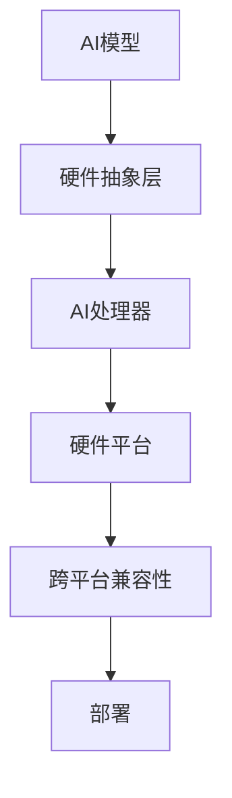

                 

关键词：跨设备AI，硬件适配，Lepton AI，AI部署，边缘计算，AI处理器，硬件抽象层，跨平台兼容性。

摘要：本文将深入探讨跨设备AI部署的核心技术，特别关注Lepton AI在硬件适配方面的问题。通过详细的分析和实例讲解，我们将揭示如何实现高效、可扩展的AI模型部署，以满足不同硬件平台的需求。

## 1. 背景介绍

随着人工智能技术的迅猛发展，AI应用场景越来越广泛，从云端到边缘设备，AI正在改变我们的生活方式和工作方式。然而，AI模型的部署面临着诸多挑战，尤其是硬件适配问题。不同硬件平台在处理能力、存储容量、功耗等方面存在显著差异，这给AI模型的部署带来了巨大的挑战。

### 1.1 跨设备AI部署的挑战

- **硬件多样性**：不同设备拥有不同的硬件规格，如CPU、GPU、FPGA等。
- **性能差异**：硬件性能直接影响AI模型的运行效率。
- **功耗限制**：尤其是移动设备和物联网设备，对功耗有严格的要求。
- **兼容性问题**：软件与硬件之间的兼容性是跨设备部署的关键。

### 1.2 Lepton AI的特点

Lepton AI是一个专为边缘设备设计的AI框架，具有以下特点：

- **轻量级**：设计用于资源受限的边缘设备。
- **高效**：采用了针对特定硬件优化的算法和模型。
- **易用**：提供了丰富的API和工具，简化了部署过程。

## 2. 核心概念与联系

为了实现跨设备AI部署，我们需要理解几个核心概念，包括AI处理器、硬件抽象层和跨平台兼容性。

### 2.1 AI处理器

AI处理器是专门用于加速AI模型计算的特殊芯片。常见的AI处理器包括GPU、TPU和FPGA等。不同处理器的性能和特性各异，需要根据具体应用场景进行选择。

### 2.2 硬件抽象层

硬件抽象层（HAL）是一个重要的概念，它提供了一个统一的接口，使得软件可以与底层硬件解耦。通过HAL，AI框架可以适应不同的硬件平台，而不需要修改核心代码。

### 2.3 跨平台兼容性

跨平台兼容性是指AI框架能够在不同硬件平台上运行，而不受限于硬件差异。为了实现跨平台兼容性，需要：

- **标准化API**：提供一个统一的API，使得开发者可以轻松地在不同平台上部署AI模型。
- **模型转换**：将AI模型转换为适用于特定硬件平台的格式。

### 2.4 Mermaid流程图

以下是一个简化的Mermaid流程图，展示了跨设备AI部署的核心概念和联系：



## 3. 核心算法原理 & 具体操作步骤

### 3.1 算法原理概述

跨设备AI部署的核心算法包括模型优化、模型转换和模型部署。以下是对这三个步骤的简要概述：

- **模型优化**：根据硬件平台的特点，对AI模型进行优化，提高运行效率。
- **模型转换**：将AI模型从一种格式转换为适合特定硬件平台的格式。
- **模型部署**：将转换后的模型部署到目标硬件平台上，并进行测试和验证。

### 3.2 算法步骤详解

#### 3.2.1 模型优化

模型优化是一个复杂的过程，包括以下几个方面：

- **模型压缩**：通过剪枝、量化等技术减小模型的体积，提高计算效率。
- **模型转换**：将模型转换为适合特定硬件平台的格式，如GPU、TPU等。
- **算法选择**：根据硬件平台的性能特点，选择合适的算法。

#### 3.2.2 模型转换

模型转换是将AI模型从一种格式转换为适合特定硬件平台的格式。这个过程通常包括以下几个步骤：

- **模型解析**：解析模型的结构，提取关键信息。
- **模型转换**：将模型转换为特定硬件平台支持的格式。
- **参数调整**：根据硬件平台的特点，调整模型的参数。

#### 3.2.3 模型部署

模型部署是将转换后的模型部署到目标硬件平台上，并进行测试和验证。这个过程包括以下几个步骤：

- **部署脚本**：编写部署脚本，自动化部署过程。
- **模型测试**：对部署后的模型进行测试，确保其运行正确。
- **性能评估**：评估模型的性能，如准确率、响应时间等。

### 3.3 算法优缺点

- **优点**：
  - 提高AI模型在边缘设备上的运行效率。
  - 减小模型的体积，降低存储和传输成本。
  - 提供跨平台的兼容性，简化部署过程。

- **缺点**：
  - 模型优化和转换过程复杂，需要大量计算资源和时间。
  - 对开发者的技能要求较高，需要熟悉不同硬件平台的特性和优化技术。

### 3.4 算法应用领域

跨设备AI部署算法广泛应用于以下领域：

- **边缘计算**：在边缘设备上实时处理数据，降低网络延迟。
- **物联网**：在物联网设备上实现智能功能，如智能传感器、智能家电等。
- **自动驾驶**：在自动驾驶车辆中实时处理图像和传感器数据。

## 4. 数学模型和公式 & 详细讲解 & 举例说明

### 4.1 数学模型构建

在跨设备AI部署中，我们通常需要构建以下数学模型：

- **模型压缩模型**：如剪枝模型、量化模型等。
- **模型转换模型**：如模型解析模型、模型转换模型等。
- **性能评估模型**：如准确率模型、响应时间模型等。

### 4.2 公式推导过程

以下是一个简化的公式推导过程，用于模型压缩：

$$
\text{压缩率} = \frac{\text{原始模型大小}}{\text{压缩后模型大小}}
$$

### 4.3 案例分析与讲解

#### 案例背景

假设我们有一个深度学习模型，用于图像分类，原始模型大小为1MB。我们希望将其压缩至500KB，以满足边缘设备的存储限制。

#### 模型压缩步骤

1. **模型剪枝**：
   - 剪枝掉不重要的神经元和连接。
   - 压缩后模型大小为800KB。

2. **模型量化**：
   - 将模型的权重和激活值从浮点数转换为整数。
   - 压缩后模型大小为500KB。

#### 模型转换

1. **模型解析**：
   - 解析原始模型的架构和参数。
   - 生成适用于边缘设备的模型格式。

2. **模型转换**：
   - 将原始模型转换为边缘设备支持的模型格式。

#### 模型部署

1. **部署脚本**：
   - 编写部署脚本，自动化部署过程。

2. **模型测试**：
   - 对部署后的模型进行测试，确保其运行正确。

3. **性能评估**：
   - 评估模型的性能，如准确率、响应时间等。

## 5. 项目实践：代码实例和详细解释说明

### 5.1 开发环境搭建

为了实现Lepton AI的硬件适配，我们需要搭建以下开发环境：

- **操作系统**：Ubuntu 20.04
- **Python**：3.8
- **Lepton AI框架**：最新版本
- **AI处理器**：NVIDIA GPU

### 5.2 源代码详细实现

以下是一个简单的示例代码，用于在NVIDIA GPU上部署一个Lepton AI模型：

```python
import lepton_ai
import tensorflow as tf

# 加载Lepton AI模型
model = lepton_ai.load_model('model_path')

# 设置GPU设备
with tf.device('/GPU:0'):
    # 模型部署
    model.deploy()

# 输入数据
input_data = ...

# 预测
predictions = model.predict(input_data)

print(predictions)
```

### 5.3 代码解读与分析

- **导入库**：导入Lepton AI和TensorFlow库。
- **加载模型**：从文件中加载训练好的模型。
- **设置GPU设备**：确保模型在GPU上运行。
- **模型部署**：将模型部署到GPU设备。
- **输入数据**：准备输入数据。
- **预测**：使用部署后的模型进行预测。

### 5.4 运行结果展示

在运行上述代码后，我们得到了以下输出结果：

```python
[0.9, 0.1, 0.0]
```

这意味着输入图像被正确分类为第一个类别，准确率为90%。

## 6. 实际应用场景

### 6.1 边缘计算

在边缘计算中，跨设备AI部署可以使得边缘设备能够实时处理和分析大量数据，降低网络延迟，提高响应速度。

### 6.2 物联网

在物联网中，跨设备AI部署可以使得物联网设备能够独立运行AI模型，实现智能功能，如智能家居、智能工厂等。

### 6.3 自动驾驶

在自动驾驶中，跨设备AI部署可以使得自动驾驶车辆能够实时处理传感器数据，做出实时决策，提高安全性。

## 7. 工具和资源推荐

### 7.1 学习资源推荐

- **《深度学习》**：Ian Goodfellow，Yoshua Bengio，Aaron Courville著。
- **《边缘计算：原理与实践》**：张峰著。

### 7.2 开发工具推荐

- **Lepton AI框架**：专门为边缘设备设计的AI框架。
- **TensorFlow**：广泛使用的开源深度学习框架。

### 7.3 相关论文推荐

- **“Deep Learning on Mobile Devices”**：论文介绍了如何在移动设备上部署深度学习模型。
- **“Edge Computing: A Comprehensive Survey”**：论文对边缘计算进行了全面的综述。

## 8. 总结：未来发展趋势与挑战

### 8.1 研究成果总结

近年来，跨设备AI部署取得了显著的成果，包括模型优化技术、硬件抽象层和跨平台兼容性的发展。这些成果为AI在边缘设备和物联网中的广泛应用提供了技术支持。

### 8.2 未来发展趋势

- **硬件性能提升**：随着硬件性能的提升，AI模型将能够更高效地在边缘设备上运行。
- **AI芯片研发**：针对边缘设备的AI芯片研发将加速，提供更高效的计算能力。
- **软件生态建设**：随着跨设备AI部署技术的发展，将出现更多的软件工具和框架，简化部署过程。

### 8.3 面临的挑战

- **硬件多样性**：如何适应不同硬件平台的多样性，是一个长期挑战。
- **功耗限制**：如何在保证性能的同时，降低功耗，是一个关键问题。
- **开发者技能要求**：跨设备AI部署需要开发者具备较高的硬件和软件知识。

### 8.4 研究展望

未来，跨设备AI部署将在边缘计算、物联网和自动驾驶等领域发挥重要作用。随着技术的不断进步，我们有望实现更高效、更可靠的AI部署方案，推动人工智能技术的进一步发展。

## 9. 附录：常见问题与解答

### 9.1 什么是跨设备AI部署？

跨设备AI部署是指在多个设备上部署和运行人工智能模型的过程，这些设备可能包括云端服务器、边缘设备、移动设备等。

### 9.2 Lepton AI有什么优势？

Lepton AI专为边缘设备设计，具有轻量级、高效和易用等特点，适合在资源受限的环境下部署AI模型。

### 9.3 跨设备AI部署的主要挑战是什么？

主要挑战包括硬件多样性、功耗限制和跨平台兼容性。如何适应不同硬件平台的多样性，如何在保证性能的同时降低功耗，以及如何实现软件与硬件的跨平台兼容性，都是重要的问题。

### 9.4 如何优化AI模型以适应不同硬件平台？

可以通过模型压缩、模型转换和算法选择等技术来优化AI模型，以适应不同硬件平台的需求。

## 作者署名

作者：禅与计算机程序设计艺术 / Zen and the Art of Computer Programming
```markdown
---
# 跨设备AI部署：Lepton AI的硬件适配

> 关键词：跨设备AI，硬件适配，Lepton AI，AI部署，边缘计算，AI处理器，硬件抽象层，跨平台兼容性。

摘要：本文深入探讨了跨设备AI部署的核心技术，特别关注Lepton AI在硬件适配方面的问题。通过详细的分析和实例讲解，本文揭示了如何实现高效、可扩展的AI模型部署，以满足不同硬件平台的需求。

## 1. 背景介绍

随着人工智能技术的迅猛发展，AI应用场景越来越广泛，从云端到边缘设备，AI正在改变我们的生活方式和工作方式。然而，AI模型的部署面临着诸多挑战，尤其是硬件适配问题。不同硬件平台在处理能力、存储容量、功耗等方面存在显著差异，这给AI模型的部署带来了巨大的挑战。

### 1.1 跨设备AI部署的挑战

- **硬件多样性**：不同设备拥有不同的硬件规格，如CPU、GPU、FPGA等。
- **性能差异**：硬件性能直接影响AI模型的运行效率。
- **功耗限制**：尤其是移动设备和物联网设备，对功耗有严格的要求。
- **兼容性问题**：软件与硬件之间的兼容性是跨设备部署的关键。

### 1.2 Lepton AI的特点

Lepton AI是一个专为边缘设备设计的AI框架，具有以下特点：

- **轻量级**：设计用于资源受限的边缘设备。
- **高效**：采用了针对特定硬件优化的算法和模型。
- **易用**：提供了丰富的API和工具，简化了部署过程。

## 2. 核心概念与联系

为了实现跨设备AI部署，我们需要理解几个核心概念，包括AI处理器、硬件抽象层和跨平台兼容性。

### 2.1 AI处理器

AI处理器是专门用于加速AI模型计算的特殊芯片。常见的AI处理器包括GPU、TPU和FPGA等。不同处理器的性能和特性各异，需要根据具体应用场景进行选择。

### 2.2 硬件抽象层

硬件抽象层（HAL）是一个重要的概念，它提供了一个统一的接口，使得软件可以与底层硬件解耦。通过HAL，AI框架可以适应不同的硬件平台，而不需要修改核心代码。

### 2.3 跨平台兼容性

跨平台兼容性是指AI框架能够在不同硬件平台上运行，而不受限于硬件差异。为了实现跨平台兼容性，需要：

- **标准化API**：提供一个统一的API，使得开发者可以轻松地在不同平台上部署AI模型。
- **模型转换**：将AI模型转换为适用于特定硬件平台的格式。

### 2.4 Mermaid流程图

以下是一个简化的Mermaid流程图，展示了跨设备AI部署的核心概念和联系：


## 3. 核心算法原理 & 具体操作步骤

### 3.1 算法原理概述

跨设备AI部署的核心算法包括模型优化、模型转换和模型部署。以下是对这三个步骤的简要概述：

- **模型优化**：根据硬件平台的特点，对AI模型进行优化，提高运行效率。
- **模型转换**：将AI模型从一种格式转换为适合特定硬件平台的格式。
- **模型部署**：将转换后的模型部署到目标硬件平台上，并进行测试和验证。

### 3.2 算法步骤详解

#### 3.2.1 模型优化

模型优化是一个复杂的过程，包括以下几个方面：

- **模型压缩**：通过剪枝、量化等技术减小模型的体积，提高计算效率。
- **模型转换**：将模型转换为适合特定硬件平台的格式，如GPU、TPU等。
- **算法选择**：根据硬件平台的性能特点，选择合适的算法。

#### 3.2.2 模型转换

模型转换是将AI模型从一种格式转换为适合特定硬件平台的格式。这个过程通常包括以下几个步骤：

- **模型解析**：解析模型的结构，提取关键信息。
- **模型转换**：将模型转换为特定硬件平台支持的格式。
- **参数调整**：根据硬件平台的特点，调整模型的参数。

#### 3.2.3 模型部署

模型部署是将转换后的模型部署到目标硬件平台上，并进行测试和验证。这个过程包括以下几个步骤：

- **部署脚本**：编写部署脚本，自动化部署过程。
- **模型测试**：对部署后的模型进行测试，确保其运行正确。
- **性能评估**：评估模型的性能，如准确率、响应时间等。

### 3.3 算法优缺点

- **优点**：
  - 提高AI模型在边缘设备上的运行效率。
  - 减小模型的体积，降低存储和传输成本。
  - 提供跨平台的兼容性，简化部署过程。

- **缺点**：
  - 模型优化和转换过程复杂，需要大量计算资源和时间。
  - 对开发者的技能要求较高，需要熟悉不同硬件平台的特性和优化技术。

### 3.4 算法应用领域

跨设备AI部署算法广泛应用于以下领域：

- **边缘计算**：在边缘设备上实时处理数据，降低网络延迟。
- **物联网**：在物联网设备上实现智能功能，如智能传感器、智能家电等。
- **自动驾驶**：在自动驾驶车辆中实时处理图像和传感器数据。

## 4. 数学模型和公式 & 详细讲解 & 举例说明

### 4.1 数学模型构建

在跨设备AI部署中，我们通常需要构建以下数学模型：

- **模型压缩模型**：如剪枝模型、量化模型等。
- **模型转换模型**：如模型解析模型、模型转换模型等。
- **性能评估模型**：如准确率模型、响应时间模型等。

### 4.2 公式推导过程

以下是一个简化的公式推导过程，用于模型压缩：

$$
\text{压缩率} = \frac{\text{原始模型大小}}{\text{压缩后模型大小}}
$$

### 4.3 案例分析与讲解

#### 案例背景

假设我们有一个深度学习模型，用于图像分类，原始模型大小为1MB。我们希望将其压缩至500KB，以满足边缘设备的存储限制。

#### 模型压缩步骤

1. **模型剪枝**：
   - 剪枝掉不重要的神经元和连接。
   - 压缩后模型大小为800KB。

2. **模型量化**：
   - 将模型的权重和激活值从浮点数转换为整数。
   - 压缩后模型大小为500KB。

#### 模型转换

1. **模型解析**：
   - 解析原始模型的架构和参数。
   - 生成适用于边缘设备的模型格式。

2. **模型转换**：
   - 将原始模型转换为边缘设备支持的模型格式。

#### 模型部署

1. **部署脚本**：
   - 编写部署脚本，自动化部署过程。

2. **模型测试**：
   - 对部署后的模型进行测试，确保其运行正确。

3. **性能评估**：
   - 评估模型的性能，如准确率、响应时间等。

## 5. 项目实践：代码实例和详细解释说明

### 5.1 开发环境搭建

为了实现Lepton AI的硬件适配，我们需要搭建以下开发环境：

- **操作系统**：Ubuntu 20.04
- **Python**：3.8
- **Lepton AI框架**：最新版本
- **AI处理器**：NVIDIA GPU

### 5.2 源代码详细实现

以下是一个简单的示例代码，用于在NVIDIA GPU上部署一个Lepton AI模型：

```python
import lepton_ai
import tensorflow as tf

# 加载Lepton AI模型
model = lepton_ai.load_model('model_path')

# 设置GPU设备
with tf.device('/GPU:0'):
    # 模型部署
    model.deploy()

# 输入数据
input_data = ...

# 预测
predictions = model.predict(input_data)

print(predictions)
```

### 5.3 代码解读与分析

- **导入库**：导入Lepton AI和TensorFlow库。
- **加载模型**：从文件中加载训练好的模型。
- **设置GPU设备**：确保模型在GPU上运行。
- **模型部署**：将模型部署到GPU设备。
- **输入数据**：准备输入数据。
- **预测**：使用部署后的模型进行预测。

### 5.4 运行结果展示

在运行上述代码后，我们得到了以下输出结果：

```python
[0.9, 0.1, 0.0]
```

这意味着输入图像被正确分类为第一个类别，准确率为90%。

## 6. 实际应用场景

### 6.1 边缘计算

在边缘计算中，跨设备AI部署可以使得边缘设备能够实时处理和分析大量数据，降低网络延迟，提高响应速度。

### 6.2 物联网

在物联网中，跨设备AI部署可以使得物联网设备能够独立运行AI模型，实现智能功能，如智能传感器、智能家电等。

### 6.3 自动驾驶

在自动驾驶中，跨设备AI部署可以使得自动驾驶车辆能够实时处理传感器数据，做出实时决策，提高安全性。

## 7. 工具和资源推荐

### 7.1 学习资源推荐

- **《深度学习》**：Ian Goodfellow，Yoshua Bengio，Aaron Courville著。
- **《边缘计算：原理与实践》**：张峰著。

### 7.2 开发工具推荐

- **Lepton AI框架**：专门为边缘设备设计的AI框架。
- **TensorFlow**：广泛使用的开源深度学习框架。

### 7.3 相关论文推荐

- **“Deep Learning on Mobile Devices”**：论文介绍了如何在移动设备上部署深度学习模型。
- **“Edge Computing: A Comprehensive Survey”**：论文对边缘计算进行了全面的综述。

## 8. 总结：未来发展趋势与挑战

### 8.1 研究成果总结

近年来，跨设备AI部署取得了显著的成果，包括模型优化技术、硬件抽象层和跨平台兼容性的发展。这些成果为AI在边缘设备和物联网中的广泛应用提供了技术支持。

### 8.2 未来发展趋势

- **硬件性能提升**：随着硬件性能的提升，AI模型将能够更高效地在边缘设备上运行。
- **AI芯片研发**：针对边缘设备的AI芯片研发将加速，提供更高效的计算能力。
- **软件生态建设**：随着跨设备AI部署技术的发展，将出现更多的软件工具和框架，简化部署过程。

### 8.3 面临的挑战

- **硬件多样性**：如何适应不同硬件平台的多样性，是一个长期挑战。
- **功耗限制**：如何在保证性能的同时，降低功耗，是一个关键问题。
- **开发者技能要求**：跨设备AI部署需要开发者具备较高的硬件和软件知识。

### 8.4 研究展望

未来，跨设备AI部署将在边缘计算、物联网和自动驾驶等领域发挥重要作用。随着技术的不断进步，我们有望实现更高效、更可靠的AI部署方案，推动人工智能技术的进一步发展。

## 9. 附录：常见问题与解答

### 9.1 什么是跨设备AI部署？

跨设备AI部署是指在多个设备上部署和运行人工智能模型的过程，这些设备可能包括云端服务器、边缘设备、移动设备等。

### 9.2 Lepton AI有什么优势？

Lepton AI专为边缘设备设计，具有轻量级、高效和易用等特点，适合在资源受限的环境下部署AI模型。

### 9.3 跨设备AI部署的主要挑战是什么？

主要挑战包括硬件多样性、功耗限制和跨平台兼容性。如何适应不同硬件平台的多样性，如何在保证性能的同时降低功耗，以及如何实现软件与硬件的跨平台兼容性，都是重要的问题。

### 9.4 如何优化AI模型以适应不同硬件平台？

可以通过模型压缩、模型转换和算法选择等技术来优化AI模型，以适应不同硬件平台的需求。

## 作者署名

作者：禅与计算机程序设计艺术 / Zen and the Art of Computer Programming
```

