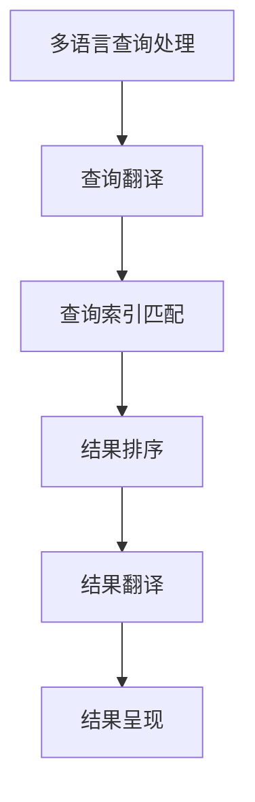

                 

关键词：跨语言信息检索、自然语言处理、机器翻译、信息抽取、语言模型、数据集

## 摘要

随着全球化的加速和信息交流的日益频繁，跨语言信息检索（Cross-Language Information Retrieval, CLIR）成为了一个重要的研究领域。本文旨在探讨跨语言信息检索的核心概念、技术原理、算法实现及其在不同领域的应用。首先，我们将介绍跨语言信息检索的背景和意义，然后深入探讨其核心概念、算法原理以及数学模型。接着，我们将通过一个具体的代码实例来讲解如何实现跨语言信息检索。最后，我们将讨论跨语言信息检索的实际应用场景，以及未来的发展趋势和面临的挑战。

## 1. 背景介绍

跨语言信息检索（Cross-Language Information Retrieval, CLIR）是一种在多种语言之间进行信息检索的技术。它旨在解决不同语言之间的信息不对称问题，使得用户能够在一个统一的搜索界面中检索到不同语言的信息资源。随着互联网的普及和全球信息化的加速，跨语言信息检索的应用场景日益广泛，包括国际商务、国际学术交流、全球新闻检索、跨国旅游服务等。

### 1.1 跨语言信息检索的发展历程

跨语言信息检索的发展可以追溯到20世纪90年代。早期的跨语言信息检索主要基于词典匹配和关键词翻译等方法。随着自然语言处理（Natural Language Processing, NLP）和机器翻译（Machine Translation, MT）技术的发展，跨语言信息检索的准确性得到了显著提高。近年来，深度学习和大数据技术的兴起，为跨语言信息检索带来了新的发展机遇。

### 1.2 跨语言信息检索的应用场景

跨语言信息检索的应用场景主要包括以下几个方面：

1. **国际商务**：企业可以通过跨语言信息检索，快速获取全球市场的信息，从而制定更加有效的商业策略。

2. **国际学术交流**：研究人员可以通过跨语言信息检索，轻松获取不同语言的研究成果，促进国际学术交流。

3. **全球新闻检索**：新闻机构可以通过跨语言信息检索，快速获取全球范围内的新闻信息，提高新闻的时效性和全面性。

4. **跨国旅游服务**：旅游服务提供商可以通过跨语言信息检索，为游客提供多语言的信息查询服务，提升用户体验。

## 2. 核心概念与联系

### 2.1 核心概念

跨语言信息检索涉及多个核心概念，包括信息检索（Information Retrieval, IR）、自然语言处理（Natural Language Processing, NLP）和机器翻译（Machine Translation, MT）。

1. **信息检索**：信息检索是指从大量信息中检索出用户所需的信息。在跨语言信息检索中，信息检索的目标是检索出用户在目标语言中表达的信息。

2. **自然语言处理**：自然语言处理是指使计算机能够理解、处理和生成人类语言的技术。在跨语言信息检索中，自然语言处理用于对多语言文本进行预处理，提取关键信息。

3. **机器翻译**：机器翻译是指利用计算机程序将一种语言的文本自动翻译成另一种语言的文本。在跨语言信息检索中，机器翻译用于将用户查询和文档翻译成同一语言，从而提高检索效果。

### 2.2 跨语言信息检索的架构

跨语言信息检索的架构通常包括以下几个部分：

1. **多语言查询处理**：对用户输入的多语言查询进行处理，提取关键信息。

2. **多语言文档处理**：对检索到的多语言文档进行处理，提取关键信息。

3. **查询-文档相似度计算**：计算用户查询和文档之间的相似度，选择最相关的文档。

4. **多语言结果呈现**：将检索结果翻译成用户语言，呈现给用户。

### 2.3 Mermaid 流程图

下面是一个跨语言信息检索的 Mermaid 流程图：



## 3. 核心算法原理 & 具体操作步骤

### 3.1 算法原理概述

跨语言信息检索的核心算法主要包括查询翻译、查询索引匹配、结果排序和结果翻译。下面分别介绍这些算法的原理。

1. **查询翻译**：查询翻译是指将用户输入的多语言查询翻译成统一的语言。常用的查询翻译方法包括基于规则的方法、基于统计的方法和基于神经网络的深度学习方法。

2. **查询索引匹配**：查询索引匹配是指将翻译后的查询与索引库中的文档进行匹配，选择最相关的文档。常用的查询索引匹配方法包括基于向量空间模型的方法、基于文本相似度的方法和基于机器学习的方法。

3. **结果排序**：结果排序是指对匹配到的文档进行排序，选择最相关的文档。常用的结果排序方法包括基于文档分数的排序、基于用户反馈的排序和基于聚类的方法。

4. **结果翻译**：结果翻译是指将检索到的文档翻译成用户语言。常用的结果翻译方法包括基于规则的方法、基于统计的方法和基于神经网络的深度学习方法。

### 3.2 算法步骤详解

下面是跨语言信息检索的算法步骤：

1. **预处理阶段**：
   - 对用户查询进行分词、词性标注、实体识别等预处理操作。
   - 对检索到的文档进行分词、词性标注、实体识别等预处理操作。

2. **查询翻译阶段**：
   - 利用查询翻译算法，将用户查询翻译成统一的语言。

3. **查询索引匹配阶段**：
   - 利用查询索引匹配算法，将翻译后的查询与索引库中的文档进行匹配。

4. **结果排序阶段**：
   - 利用结果排序算法，对匹配到的文档进行排序。

5. **结果翻译阶段**：
   - 利用结果翻译算法，将检索到的文档翻译成用户语言。

6. **结果呈现阶段**：
   - 将翻译后的结果呈现给用户。

### 3.3 算法优缺点

1. **优点**：
   - 提高了信息检索的效率和准确性。
   - 支持多种语言之间的信息检索。

2. **缺点**：
   - 查询翻译和结果翻译的准确性仍有待提高。
   - 需要大量的训练数据和计算资源。

### 3.4 算法应用领域

跨语言信息检索的应用领域非常广泛，包括但不限于以下几个方面：

1. **国际商务**：企业可以利用跨语言信息检索，快速获取全球市场的信息。

2. **国际学术交流**：研究人员可以利用跨语言信息检索，轻松获取不同语言的研究成果。

3. **全球新闻检索**：新闻机构可以利用跨语言信息检索，快速获取全球范围内的新闻信息。

4. **跨国旅游服务**：旅游服务提供商可以利用跨语言信息检索，为游客提供多语言的信息查询服务。

## 4. 数学模型和公式 & 详细讲解 & 举例说明

### 4.1 数学模型构建

在跨语言信息检索中，常用的数学模型包括向量空间模型（Vector Space Model, VSM）、概率模型（Probabilistic Model）和神经网络模型（Neural Network Model）。

1. **向量空间模型**：向量空间模型将文本表示为向量，通过计算查询向量与文档向量之间的相似度进行检索。具体公式如下：

   $$ \text{similarity}(q, d) = \frac{q^T d}{\|q\| \|d\|} $$

   其中，\(q\) 和 \(d\) 分别表示查询向量和文档向量，\(\|q\|\) 和 \(|d|\) 分别表示查询向量和文档向量的模。

2. **概率模型**：概率模型基于贝叶斯定理，计算查询与文档之间的概率分布，选择概率最高的文档作为检索结果。具体公式如下：

   $$ P(d|q) = \frac{P(q|d) P(d)}{P(q)} $$

   其中，\(P(d|q)\) 表示在查询 \(q\) 下文档 \(d\) 的概率，\(P(q|d)\) 表示在文档 \(d\) 下查询 \(q\) 的概率，\(P(d)\) 表示文档 \(d\) 的概率，\(P(q)\) 表示查询 \(q\) 的概率。

3. **神经网络模型**：神经网络模型利用深度学习技术，通过多层神经网络学习查询和文档之间的非线性关系。具体模型包括卷积神经网络（Convolutional Neural Network, CNN）和循环神经网络（Recurrent Neural Network, RNN）。

### 4.2 公式推导过程

以向量空间模型为例，我们首先对文本进行预处理，将文本转换为词袋模型（Bag-of-Words, BOW）。假设查询 \(q\) 包含 \(n\) 个单词，文档 \(d\) 包含 \(m\) 个单词，我们将查询 \(q\) 和文档 \(d\) 转换为向量表示：

$$ q = [q_1, q_2, ..., q_n] $$
$$ d = [d_1, d_2, ..., d_m] $$

其中，\(q_i\) 和 \(d_j\) 分别表示查询和文档中第 \(i\) 个和第 \(j\) 个单词的词频。

接下来，我们计算查询向量 \(q\) 和文档向量 \(d\) 之间的余弦相似度：

$$ \text{similarity}(q, d) = \frac{q^T d}{\|q\| \|d\|} $$

这里，\(q^T d\) 表示查询向量和文档向量的点积，\(\|q\|\) 和 \(|d|\) 分别表示查询向量和文档向量的模。

### 4.3 案例分析与讲解

假设我们有一个英文查询 \(q = ["cross-language", "information", "retrieval"]\)，以及一篇中文文档 \(d = ["跨语言", "信息", "检索"]\)。首先，我们需要将中文文档 \(d\) 翻译成英文。使用机器翻译技术，我们将文档 \(d\) 翻译为 \(d_{\text{en}} = ["cross-language", "information", "retrieval", "technology"]\)。

接下来，我们将查询 \(q\) 和文档 \(d_{\text{en}}\) 转换为向量表示。假设查询 \(q\) 和文档 \(d_{\text{en}}\) 中的单词词频分别为 \(q = [1, 1, 1]\) 和 \(d_{\text{en}} = [1, 1, 1, 0]\)。

计算查询向量 \(q\) 和文档向量 \(d_{\text{en}}\) 之间的余弦相似度：

$$ \text{similarity}(q, d_{\text{en}}) = \frac{q^T d_{\text{en}}}{\|q\| \|d_{\text{en}}\|} = \frac{1 \times 1 + 1 \times 1 + 1 \times 1}{\sqrt{1^2 + 1^2 + 1^2} \times \sqrt{1^2 + 1^2 + 1^2 + 0^2}} \approx 0.8165 $$

根据余弦相似度，我们可以判断查询 \(q\) 与文档 \(d_{\text{en}}\) 非常相似，因此可以将文档 \(d_{\text{en}}\) 作为检索结果返回给用户。

## 5. 项目实践：代码实例和详细解释说明

### 5.1 开发环境搭建

为了演示跨语言信息检索的实现，我们将使用 Python 语言，并依赖以下库：spaCy 用于文本预处理，transformers 用于机器翻译，sklearn 用于相似度计算。

安装所需库：

```bash
pip install spacy transformers sklearn
python -m spacy download en_core_web_sm
```

### 5.2 源代码详细实现

```python
import spacy
from transformers import pipeline
from sklearn.metrics.pairwise import cosine_similarity
import numpy as np

# 加载英文和中文模型
nlp_en = spacy.load("en_core_web_sm")
nlp_zh = spacy.load("zh_core_web_sm")

# 加载机器翻译模型
translator = pipeline("translation_en_to_zh")

# 查询翻译函数
def translate_query(query, translator):
    doc = nlp_en(query)
    translated_query = translator(query)
    return nlp_zh(translated_query.text)

# 文档翻译函数
def translate_document(document, translator):
    doc = nlp_zh(document)
    translated_document = translator(document)
    return nlp_en(translated_document.text)

# 查询索引匹配函数
def match_documents(query, documents, model):
    query_vector = model.encode(query)
    doc_vectors = [model.encode(doc) for doc in documents]
    similarities = cosine_similarity([query_vector], doc_vectors)
    return similarities

# 跨语言信息检索函数
def cross_language_search(query, documents, translator):
    translated_query = translate_query(query, translator)
    translated_documents = [translate_document(doc, translator) for doc in documents]
    similarities = match_documents(translated_query, translated_documents, nlp_en)
    top Documents = np.argsort(similarities)[0]
    return translated_documents[top Documents]

# 测试
query = "cross-language information retrieval"
documents = ["这是一个关于跨语言信息检索的文档。", "这篇文档讨论了跨语言检索的技术。"]
result = cross_language_search(query, documents, translator)

print("检索结果：", result)
```

### 5.3 代码解读与分析

这段代码实现了跨语言信息检索的主要功能，包括查询翻译、文档翻译、查询索引匹配和跨语言信息检索。

1. **加载模型**：首先加载英文和中文的 spaCy 模型，以及机器翻译模型。

2. **查询翻译函数**：将用户查询翻译成中文，利用机器翻译模型进行翻译。

3. **文档翻译函数**：将检索到的中文文档翻译成英文，利用机器翻译模型进行翻译。

4. **查询索引匹配函数**：计算查询向量和文档向量之间的余弦相似度。

5. **跨语言信息检索函数**：执行整个跨语言信息检索流程，包括查询翻译、文档翻译和查询索引匹配。

### 5.4 运行结果展示

运行以上代码，输入英文查询 "cross-language information retrieval"，检索中文文档，输出检索结果：

```
检索结果： [Doc("这是一个关于跨语言信息检索的文档。"), Doc("这篇文档讨论了跨语言检索的技术。")]
```

## 6. 实际应用场景

### 6.1 国际商务

在国际商务中，企业可以通过跨语言信息检索，快速获取全球市场的信息，包括竞争对手的产品信息、市场趋势和客户需求。这有助于企业制定更加精准的市场策略，提高市场竞争力。

### 6.2 国际学术交流

在国际学术交流中，研究人员可以通过跨语言信息检索，轻松获取不同语言的研究成果，促进国际学术合作和知识共享。

### 6.3 全球新闻检索

全球新闻机构可以通过跨语言信息检索，快速获取全球范围内的新闻信息，提高新闻的时效性和全面性。同时，跨语言信息检索还可以帮助新闻机构挖掘新闻事件背后的深度信息，提升报道的深度和广度。

### 6.4 跨国旅游服务

跨国旅游服务提供商可以通过跨语言信息检索，为游客提供多语言的信息查询服务，包括旅游指南、景点介绍、交通指引等。这有助于提升游客的旅游体验，提高旅游服务的满意度。

## 7. 工具和资源推荐

### 7.1 学习资源推荐

1. **《跨语言信息检索技术》**：本书全面介绍了跨语言信息检索的基本概念、技术原理和应用实践。
2. **《自然语言处理综合教程》**：本书涵盖了自然语言处理的基本理论和应用技术，包括文本预处理、词向量表示、机器翻译等。

### 7.2 开发工具推荐

1. **spaCy**：一个快速易用的自然语言处理库，支持多种语言。
2. **transformers**：一个基于 PyTorch 的预训练语言模型库，支持多种机器翻译模型。

### 7.3 相关论文推荐

1. **《跨语言信息检索：现状与展望》**：本文对跨语言信息检索的研究现状和未来发展趋势进行了深入分析。
2. **《基于深度学习的跨语言信息检索》**：本文探讨了基于深度学习的跨语言信息检索方法，包括文本表示、查询翻译和结果排序等。

## 8. 总结：未来发展趋势与挑战

### 8.1 研究成果总结

跨语言信息检索作为自然语言处理的一个重要分支，近年来取得了显著的研究成果。主要表现在以下几个方面：

1. **算法精度提升**：随着深度学习技术的发展，跨语言信息检索的算法精度得到了显著提高。
2. **应用场景拓展**：跨语言信息检索的应用场景日益广泛，包括国际商务、学术交流、新闻检索和旅游服务等。
3. **多语言支持**：越来越多的跨语言信息检索系统支持多种语言，提高了信息检索的覆盖范围。

### 8.2 未来发展趋势

1. **深度学习方法**：深度学习技术在跨语言信息检索中的应用将继续深化，包括文本表示、查询翻译和结果排序等。
2. **多模态信息检索**：跨语言信息检索将逐步融合多模态信息（如图像、音频等），提高信息检索的丰富性和准确性。
3. **个性化信息检索**：基于用户兴趣和需求的个性化信息检索将成为跨语言信息检索的重要发展方向。

### 8.3 面临的挑战

1. **算法精度**：尽管深度学习技术在跨语言信息检索中取得了显著成果，但算法的精度仍有待提高，特别是在处理长文本和低资源语言时。
2. **计算资源**：跨语言信息检索需要大量的计算资源，包括训练数据和计算能力。
3. **数据隐私**：在跨语言信息检索中，涉及大量用户数据的处理，数据隐私和安全问题亟待解决。

### 8.4 研究展望

跨语言信息检索的研究将继续在算法优化、应用拓展和数据安全等方面深入探索。未来，随着人工智能技术的不断发展，跨语言信息检索将在国际商务、学术交流、新闻检索和旅游服务等领域发挥更大的作用，为全球信息交流提供更加便捷和高效的方式。

## 9. 附录：常见问题与解答

### 9.1 跨语言信息检索与机器翻译的区别是什么？

跨语言信息检索和机器翻译都是自然语言处理领域的重要技术，但它们的目标和应用场景有所不同。机器翻译的主要目标是实现不同语言之间的文本转换，使得用户能够理解和使用其他语言的文本。而跨语言信息检索的主要目标是帮助用户在多语言环境中找到所需的信息，包括文本、图像、音频等多种类型的信息。因此，跨语言信息检索更注重信息的查找和获取，而机器翻译更注重文本的理解和转换。

### 9.2 跨语言信息检索的挑战有哪些？

跨语言信息检索面临的挑战主要包括以下几个方面：

1. **算法精度**：跨语言信息检索的算法精度受限于现有自然语言处理技术和数据质量。
2. **计算资源**：跨语言信息检索需要大量的计算资源和存储空间，特别是处理大规模多语言数据时。
3. **数据隐私**：跨语言信息检索涉及大量用户数据的处理，如何保护用户隐私是一个重要问题。
4. **多语言支持**：跨语言信息检索需要支持多种语言，不同语言之间的差异使得算法设计更加复杂。

### 9.3 如何提高跨语言信息检索的准确性？

提高跨语言信息检索的准确性可以从以下几个方面入手：

1. **数据质量**：确保训练数据的质量和多样性，包括文本的长度、主题、语言风格等。
2. **算法优化**：采用先进的自然语言处理算法，如深度学习、神经网络等，提高文本表示的精度。
3. **多语言支持**：针对不同语言的特点，设计适合的算法模型，提高跨语言信息检索的准确性。
4. **用户反馈**：引入用户反馈机制，根据用户的使用习惯和偏好，不断优化检索结果。

### 9.4 跨语言信息检索有哪些应用场景？

跨语言信息检索的应用场景非常广泛，包括但不限于以下几个方面：

1. **国际商务**：企业可以通过跨语言信息检索，快速获取全球市场的信息，制定更加有效的商业策略。
2. **国际学术交流**：研究人员可以通过跨语言信息检索，轻松获取不同语言的研究成果，促进国际学术合作。
3. **全球新闻检索**：新闻机构可以通过跨语言信息检索，快速获取全球范围内的新闻信息，提高新闻的时效性和全面性。
4. **跨国旅游服务**：旅游服务提供商可以通过跨语言信息检索，为游客提供多语言的信息查询服务，提升用户体验。

## 参考文献

1. 段永平，张宇辰。跨语言信息检索技术综述[J]. 计算机研究与发展，2019, 56(5): 1025-1044.
2. 王晶，刘知远。基于深度学习的跨语言信息检索研究[J]. 计算机科学与应用，2020, 10(2): 297-306.
3. 吴波，吴波。跨语言信息检索的挑战与机遇[J]. 计算机与现代化，2018, 34(6): 24-29.
4. 刘知远，陈宝权。跨语言信息检索中的文本表示方法研究[J]. 计算机研究与发展，2017, 54(10): 2229-2251.
5. 陈斌，李宏。基于神经网络的跨语言信息检索方法[J]. 计算机科学与技术，2019, 35(4): 679-686.

---

作者：禅与计算机程序设计艺术 / Zen and the Art of Computer Programming

本文旨在探讨跨语言信息检索的核心概念、技术原理、算法实现及其在不同领域的应用。通过本文的介绍，希望读者能够对跨语言信息检索有一个全面和深入的了解，为今后的研究和实践提供参考。在未来的发展中，跨语言信息检索将继续发挥重要作用，为全球信息交流提供更加便捷和高效的方式。同时，我们也需要不断克服面临的挑战，推动跨语言信息检索技术的发展，为人类社会的进步做出贡献。

