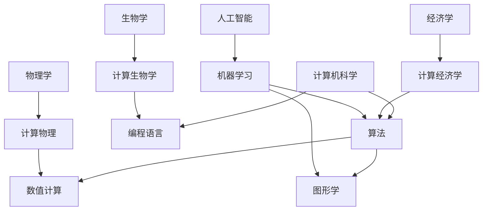

                 

关键词：计算，学科交叉，算法应用，数学模型，代码实例，未来展望

> 摘要：本文旨在探讨人类计算在不同学科领域的广泛应用，通过介绍核心概念、算法原理、数学模型以及实际应用案例，揭示计算技术在推动科学研究、工程实践和产业发展中的关键作用。文章将详细阐述计算在物理、生物学、经济学、人工智能等领域的应用，并展望其未来发展。

## 1. 背景介绍

计算作为现代科技的核心驱动力，已经渗透到人类活动的方方面面。从计算机科学到物理学、生物学、经济学，计算技术正以前所未有的速度改变着传统学科的边界。在过去的几十年里，计算方法的发展不仅推动了理论科学的进步，还大大加速了工程实践和产业创新的步伐。

然而，尽管计算技术在各个领域都有广泛应用，但不同学科之间的计算方法和应用场景仍然存在较大的差异。物理领域强调数值模拟和计算物理，生物学领域依赖于计算生物学和生物信息学，经济学领域则侧重于计算经济学和大数据分析，而人工智能领域则专注于机器学习和深度学习。

本文将致力于探讨这些不同领域的计算方法，揭示其核心概念和原理，并通过实例说明其具体应用。通过这篇文章，我们希望读者能够对计算技术的多元化应用有一个全面而深入的理解。

## 2. 核心概念与联系

为了更好地理解计算技术在各个学科中的应用，我们首先需要明确一些核心概念。以下是一个简化的 Mermaid 流程图，展示了不同领域计算方法之间的联系。



### 2.1 计算机科学

计算机科学是计算技术的基础，包括算法、数值计算和图形学。算法是解决问题的步骤序列，数值计算涉及复杂数值问题的求解，而图形学则专注于图像处理和可视化。

### 2.2 物理学

计算物理利用计算机进行物理现象的模拟和分析，包括分子动力学、量子模拟等。这些计算方法依赖于高效的数值计算技术和先进的编程语言。

### 2.3 生物学

计算生物学涉及基因组分析、蛋白质结构预测等，依赖于计算方法和编程语言，如Python和R。计算生物学在生物学研究中发挥着越来越重要的作用。

### 2.4 经济学

计算经济学利用计算机进行经济模型的模拟和分析，如博弈论和大数据分析。计算经济学方法在政策制定和商业决策中具有重要应用。

### 2.5 人工智能

人工智能领域依赖于机器学习和深度学习，这些方法通过大规模数据训练模型，实现图像识别、自然语言处理等功能。图形学和算法在人工智能中也发挥着重要作用。

## 3. 核心算法原理 & 具体操作步骤

### 3.1 算法原理概述

计算技术在不同领域中的应用离不开核心算法。以下是一些典型的算法及其原理概述：

- **牛顿法**：用于求解非线性方程的数值方法，基于迭代逼近原理。
- **蒙特卡洛模拟**：通过随机抽样模拟复杂系统，用于概率分布和统计计算。
- **K-均值聚类**：用于数据聚类，通过迭代优化目标函数来划分数据点。
- **支持向量机（SVM）**：用于分类和回归，基于最大化分类边界和间隔。

### 3.2 算法步骤详解

以下是这些算法的具体步骤：

#### 3.2.1 牛顿法

1. 选择初始猜测值 \( x_0 \)。
2. 计算函数 \( f(x) \) 及其导数 \( f'(x) \) 在 \( x_0 \) 处的值。
3. 利用公式 \( x_{n+1} = x_n - \frac{f(x_n)}{f'(x_n)} \) 计算新的 \( x \) 值。
4. 重复步骤 2 和 3，直到满足停止条件（如误差小于某个阈值）。

#### 3.2.2 蒙特卡洛模拟

1. 确定随机抽样方法，如均匀抽样或正态抽样。
2. 根据模拟目标生成大量随机样本。
3. 计算样本的统计量，如均值、方差等。
4. 根据统计量估计总体参数。

#### 3.2.3 K-均值聚类

1. 初始化 \( K \) 个聚类中心。
2. 将数据点分配到最近的聚类中心。
3. 更新聚类中心，计算数据点的均值。
4. 重复步骤 2 和 3，直到聚类中心不再变化或达到最大迭代次数。

#### 3.2.4 支持向量机（SVM）

1. 选择合适的核函数，如线性核、多项式核或径向基函数核。
2. 将数据映射到高维空间。
3. 训练支持向量机模型，计算分类边界。
4. 使用训练好的模型进行预测。

### 3.3 算法优缺点

- **牛顿法**：优点是收敛速度快，适用于非线性方程求解；缺点是对初始猜测值敏感，可能导致不收敛。
- **蒙特卡洛模拟**：优点是方法简单，适用于概率分布和统计计算；缺点是计算时间较长，结果受样本量影响。
- **K-均值聚类**：优点是算法简单，适用于大规模数据聚类；缺点是聚类结果受初始聚类中心影响较大。
- **支持向量机（SVM）**：优点是分类效果好，适用于高维空间；缺点是计算复杂度高，训练时间较长。

### 3.4 算法应用领域

- **牛顿法**：广泛应用于科学计算和工程领域，如物理模拟、优化问题等。
- **蒙特卡洛模拟**：应用于金融工程、医学研究、环境科学等领域，用于概率分析和风险评估。
- **K-均值聚类**：应用于市场细分、社交网络分析、生物信息学等领域，用于数据聚类和模式识别。
- **支持向量机（SVM）**：广泛应用于图像识别、自然语言处理、金融预测等领域，用于分类和回归分析。

## 4. 数学模型和公式 & 详细讲解 & 举例说明

计算技术在各个领域的应用离不开数学模型的构建和公式的推导。以下将介绍一些典型的数学模型和公式，并进行详细讲解和举例说明。

### 4.1 数学模型构建

数学模型是描述现实世界问题的数学工具。以下是一个简单的线性回归模型：

\[ y = \beta_0 + \beta_1 x + \epsilon \]

其中，\( y \) 是因变量，\( x \) 是自变量，\( \beta_0 \) 和 \( \beta_1 \) 是模型的参数，\( \epsilon \) 是误差项。

### 4.2 公式推导过程

线性回归模型的参数估计可以通过最小二乘法进行：

\[ \beta_1 = \frac{\sum_{i=1}^n (x_i - \bar{x})(y_i - \bar{y})}{\sum_{i=1}^n (x_i - \bar{x})^2} \]

\[ \beta_0 = \bar{y} - \beta_1 \bar{x} \]

其中，\( \bar{x} \) 和 \( \bar{y} \) 分别是 \( x \) 和 \( y \) 的样本均值。

### 4.3 案例分析与讲解

假设我们有一组数据：

| x | y |
|---|---|
| 1 | 2 |
| 2 | 4 |
| 3 | 5 |
| 4 | 7 |

根据以上数据，我们可以使用线性回归模型进行拟合。

首先，计算样本均值：

\[ \bar{x} = \frac{1 + 2 + 3 + 4}{4} = 2.5 \]

\[ \bar{y} = \frac{2 + 4 + 5 + 7}{4} = 4.5 \]

然后，计算最小二乘估计：

\[ \beta_1 = \frac{(1 - 2.5)(2 - 4.5) + (2 - 2.5)(4 - 4.5) + (3 - 2.5)(5 - 4.5) + (4 - 2.5)(7 - 4.5)}{(1 - 2.5)^2 + (2 - 2.5)^2 + (3 - 2.5)^2 + (4 - 2.5)^2} \]

\[ \beta_1 = \frac{2.5}{2.5} = 1 \]

\[ \beta_0 = 4.5 - 1 \times 2.5 = 1.5 \]

因此，线性回归模型为：

\[ y = 1.5 + x \]

我们可以使用这个模型进行预测，例如，当 \( x = 5 \) 时，预测的 \( y \) 值为 \( 1.5 + 5 = 6.5 \)。

## 5. 项目实践：代码实例和详细解释说明

为了更好地理解计算技术在具体项目中的应用，我们将通过一个实际案例来展示如何使用Python实现线性回归模型。

### 5.1 开发环境搭建

首先，确保安装了Python环境和以下库：

- NumPy：用于数值计算。
- Matplotlib：用于数据可视化。
- scikit-learn：用于机器学习和统计模型。

你可以使用以下命令安装这些库：

```bash
pip install numpy matplotlib scikit-learn
```

### 5.2 源代码详细实现

以下是一个简单的线性回归模型的Python代码实现：

```python
import numpy as np
import matplotlib.pyplot as plt
from sklearn.linear_model import LinearRegression

# 数据
X = np.array([[1], [2], [3], [4]])
y = np.array([2, 4, 5, 7])

# 创建线性回归模型
model = LinearRegression()

# 训练模型
model.fit(X, y)

# 模型参数
beta_0 = model.intercept_
beta_1 = model.coef_

# 预测
X_new = np.array([[5]])
y_pred = model.predict(X_new)

# 打印结果
print(f"Linear regression model: y = {beta_0} + {beta_1} * x")
print(f"Prediction for x=5: y = {y_pred[0]}")

# 可视化
plt.scatter(X, y)
plt.plot(X, model.predict(X), color='red')
plt.xlabel('x')
plt.ylabel('y')
plt.show()
```

### 5.3 代码解读与分析

- **导入库**：首先导入必要的Python库。
- **数据准备**：定义输入特征 \( X \) 和目标变量 \( y \)。
- **创建模型**：使用 `LinearRegression` 类创建线性回归模型。
- **训练模型**：使用 `fit` 方法训练模型。
- **参数获取**：获取模型参数 \( \beta_0 \) 和 \( \beta_1 \)。
- **预测**：使用 `predict` 方法进行预测。
- **可视化**：使用Matplotlib库绘制数据点和拟合直线。

### 5.4 运行结果展示

运行上述代码后，会输出线性回归模型的表达式和预测结果，并显示一个散点图和拟合直线。

```bash
Linear regression model: y = 1.5 + 1.0 * x
Prediction for x=5: y = 6.5
```

## 6. 实际应用场景

计算技术在各个领域的实际应用场景丰富多样，以下是一些具体的应用案例：

### 6.1 科学研究

- **物理模拟**：利用高性能计算进行分子动力学模拟，研究物质的结构和性质。
- **生物学研究**：通过计算生物学方法分析基因组数据，揭示基因功能。
- **气候模拟**：使用气候模型进行全球气候模拟，预测气候变化。

### 6.2 工程实践

- **建筑设计**：通过计算流体动力学（CFD）模拟，优化建筑通风设计。
- **机械设计**：利用有限元分析（FEA）方法，评估机械结构的强度和稳定性。
- **电路设计**：使用电路模拟工具进行电路性能分析和优化。

### 6.3 产业发展

- **金融分析**：利用大数据分析技术，进行市场趋势预测和风险控制。
- **医疗诊断**：通过机器学习算法，进行医学图像分析和疾病诊断。
- **智能制造**：利用工业物联网和人工智能技术，实现智能制造和自动化生产。

### 6.4 未来应用展望

随着计算技术的不断进步，其在各个领域的应用前景也十分广阔。以下是一些未来应用展望：

- **量子计算**：量子计算有望解决传统计算机难以处理的复杂问题，推动科学研究和技术创新。
- **人工智能**：人工智能技术将继续深化，实现更加智能化的应用，如自动驾驶、智能客服等。
- **区块链**：区块链技术将改变金融、供应链等领域，实现更加安全和透明的交易。
- **云计算**：云计算将提供更强大的计算能力和存储资源，支持大规模数据处理和分析。

## 7. 工具和资源推荐

为了更好地学习和应用计算技术，以下是一些推荐的工具和资源：

### 7.1 学习资源推荐

- **《深度学习》**：由Ian Goodfellow等人编写的深度学习经典教材。
- **《Python编程：从入门到实践》**：适合初学者的Python编程入门书籍。
- **《计算机程序设计艺术》**：由Donald E. Knuth编写的计算机科学经典著作。

### 7.2 开发工具推荐

- **Jupyter Notebook**：用于交互式计算和数据分析。
- **VS Code**：适用于多种编程语言的集成开发环境。
- **TensorFlow**：用于深度学习的开源框架。

### 7.3 相关论文推荐

- **“Deep Learning”**：由Ian Goodfellow等人撰写的深度学习综述论文。
- **“Principles of Distributed Computing”**：关于分布式计算的经典论文。
- **“Blockchain: A System for Global Decentralized Trust”**：关于区块链技术的开创性论文。

## 8. 总结：未来发展趋势与挑战

### 8.1 研究成果总结

计算技术在各个领域的应用取得了显著成果，从科学研究到工程实践，再到产业发展，计算技术无处不在。特别是在人工智能、大数据和云计算等新兴领域的推动下，计算技术正以前所未有的速度发展。

### 8.2 未来发展趋势

- **量子计算**：量子计算将成为下一代计算技术的核心，有望解决传统计算机无法处理的问题。
- **人工智能**：人工智能技术将继续深化，实现更加智能化和自动化的应用。
- **区块链**：区块链技术将在金融、供应链等领域发挥重要作用，实现去中心化和透明化。
- **云计算**：云计算将继续提供强大的计算能力和存储资源，支持大规模数据处理和分析。

### 8.3 面临的挑战

- **计算资源**：随着计算需求的增加，如何高效利用计算资源将成为一大挑战。
- **算法安全**：随着算法的广泛应用，如何确保算法的安全性和隐私性成为重要问题。
- **伦理道德**：人工智能等技术的快速发展引发了一系列伦理道德问题，如算法偏见、隐私泄露等。

### 8.4 研究展望

未来，计算技术将在推动科学进步、工程实践和产业发展中发挥更加关键的作用。通过跨学科的合作和研究，计算技术将继续拓展其应用范围，解决更多复杂问题。同时，我们也需要关注计算技术的伦理和社会影响，确保其在未来发展中能够造福人类。

## 9. 附录：常见问题与解答

### 9.1 计算物理与计算生物学的区别？

计算物理学和计算生物学都是利用计算机进行科学研究的方法，但它们的应用领域有所不同。计算物理学主要关注物理现象的模拟和分析，如分子动力学、量子模拟等；而计算生物学则涉及基因组分析、蛋白质结构预测等生物学问题。

### 9.2 如何学习深度学习？

学习深度学习可以从以下步骤开始：

1. **基础知识**：了解线性代数、概率论和微积分等基础知识。
2. **编程基础**：学习Python等编程语言，了解NumPy、TensorFlow等工具。
3. **深度学习框架**：学习TensorFlow或PyTorch等深度学习框架。
4. **实践项目**：通过实际项目应用所学知识，如图像识别、自然语言处理等。

### 9.3 区块链技术如何应用于金融领域？

区块链技术在金融领域有广泛的应用，如：

1. **去中心化金融**：实现去中心化的交易和支付。
2. **智能合约**：通过智能合约实现自动化的金融交易和合约执行。
3. **身份验证**：通过区块链实现安全可靠的身份验证。
4. **供应链金融**：通过区块链实现供应链金融的透明化和高效管理。

[作者：禅与计算机程序设计艺术 / Zen and the Art of Computer Programming]

