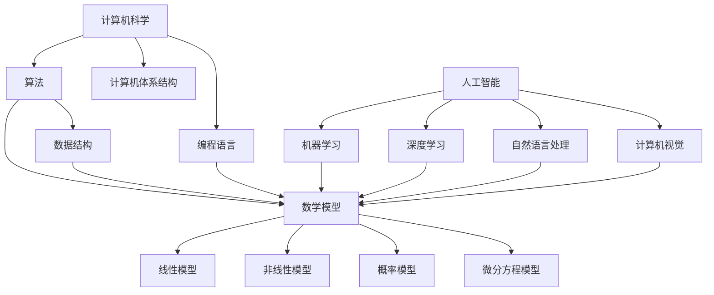

                 

关键词：跨学科计算，人工智能，计算机科学，应用领域，算法，数学模型

> 摘要：本文将探讨人类计算在跨学科领域的多元化应用，从算法原理、数学模型到项目实践，分析其在各个领域的实际应用和未来展望。作者：禅与计算机程序设计艺术 / Zen and the Art of Computer Programming

## 1. 背景介绍

在当今科技迅猛发展的时代，计算已经成为推动各个学科进步的关键力量。从基础的数学和物理学到复杂的生物信息学和人工智能，计算技术正在不断跨越学科边界，为科学研究、工业制造、医疗诊断等多个领域带来深远影响。本文旨在梳理计算技术在跨学科领域中的应用，探讨其在不同场景下的具体实现和未来发展趋势。

### 1.1 计算技术的起源与发展

计算技术的起源可以追溯到古代的算盘和计算尺。随着数学和逻辑学的发展，19世纪末至20世纪初，计算机科学逐渐形成一门独立的学科。计算机的诞生和发展，标志着计算技术从手工计算向自动化计算转变。随着计算机硬件性能的提升和软件算法的优化，计算技术的应用范围逐渐扩大，从科学计算、数据处理到人工智能，无所不能。

### 1.2 跨学科计算的重要性

跨学科计算的重要性体现在多个方面。首先，不同学科之间的交叉融合能够产生新的研究方向和突破点，从而推动科学技术的整体进步。例如，生物信息学结合了生物学、计算机科学和数学，为基因组研究和生物数据分析提供了强有力的工具。其次，跨学科计算能够提高研究效率和解决复杂问题。许多实际问题需要多个学科的知识和技能，单靠某一学科难以解决。最后，跨学科计算能够促进知识传播和学术交流，培养跨学科人才，为未来科技发展储备力量。

## 2. 核心概念与联系

### 2.1 计算机科学的基本概念

计算机科学是一门研究计算机系统设计和应用的学科，包括算法、数据结构、编程语言、计算机体系结构等多个方面。算法是计算机科学的核心，它是一系列解决问题的步骤和方法。数据结构是算法的基础，它决定了数据在计算机中的存储和操作方式。编程语言是编写算法的工具，计算机体系结构则决定了计算机硬件的运行原理。

### 2.2 人工智能的核心概念

人工智能（Artificial Intelligence，AI）是计算机科学的一个分支，它研究如何构建智能系统，使计算机具备类似人类智能的能力。人工智能的核心概念包括机器学习、深度学习、自然语言处理、计算机视觉等。机器学习是一种让计算机通过数据学习的方法，深度学习是机器学习的一种特殊形式，它通过多层神经网络模拟人类大脑的学习过程。自然语言处理和计算机视觉则是人工智能在语言理解和图像识别领域的应用。

### 2.3 数学模型在计算中的应用

数学模型是描述现实世界问题的一种抽象方法，它在计算技术中扮演着重要角色。数学模型包括线性模型、非线性模型、概率模型、微分方程模型等。这些模型通过数学公式和算法，帮助计算机处理复杂问题，如优化问题、预测问题和分类问题。

### 2.4 Mermaid 流程图

下面是一个简单的 Mermaid 流程图，展示了计算机科学、人工智能和数学模型之间的联系：



## 3. 核心算法原理 & 具体操作步骤

### 3.1 算法原理概述

算法在计算机科学中起着至关重要的作用。一个优秀的算法不仅能够高效地解决问题，还能在有限的时间和空间资源下实现。算法的设计和实现涉及到多个方面，如算法思想、时间复杂度、空间复杂度等。

### 3.2 算法步骤详解

算法的设计通常遵循以下步骤：

1. **问题定义**：明确问题的目标和输入输出。
2. **算法设计**：根据问题特点选择合适的算法思想和数据结构。
3. **算法实现**：用编程语言实现算法。
4. **算法优化**：分析算法的时间和空间复杂度，进行优化。
5. **算法验证**：通过测试数据验证算法的正确性和性能。

### 3.3 算法优缺点

算法优缺点主要体现在以下几个方面：

- **时间复杂度**：算法执行的时间随着问题规模的增长而增加的速度。低时间复杂度的算法更高效。
- **空间复杂度**：算法执行过程中所需的内存空间。低空间复杂度的算法更节省资源。
- **正确性**：算法能否正确地解决问题。
- **可读性**：算法的代码是否易于理解和维护。

### 3.4 算法应用领域

算法在计算机科学中的各个领域都有广泛应用，如排序算法、搜索算法、图算法、机器学习算法等。以下是一些典型的算法应用领域：

- **科学计算**：用于解决物理、化学、生物学等领域的复杂问题。
- **数据挖掘**：用于从大量数据中提取有价值的信息。
- **人工智能**：用于构建智能系统，如图像识别、自然语言处理等。
- **优化问题**：用于解决资源分配、路径规划等优化问题。

## 4. 数学模型和公式 & 详细讲解 & 举例说明

### 4.1 数学模型构建

数学模型是计算技术的重要组成部分。构建数学模型通常包括以下步骤：

1. **问题定义**：明确需要解决的问题。
2. **数据收集**：收集与问题相关的数据。
3. **模型假设**：根据问题特点做出合理的假设。
4. **数学公式推导**：根据假设和数据推导出数学公式。
5. **模型验证**：通过实际数据验证模型的准确性。

### 4.2 公式推导过程

以下是一个简单的线性回归模型的推导过程：

$$
y = \beta_0 + \beta_1 x + \epsilon
$$

其中，$y$ 是因变量，$x$ 是自变量，$\beta_0$ 和 $\beta_1$ 是模型参数，$\epsilon$ 是误差项。

为了求解 $\beta_0$ 和 $\beta_1$，我们使用最小二乘法：

$$
\min \sum_{i=1}^{n} (y_i - (\beta_0 + \beta_1 x_i))^2
$$

通过求导和化简，得到：

$$
\beta_0 = \frac{\sum_{i=1}^{n} y_i - \beta_1 \sum_{i=1}^{n} x_i}{n}
$$

$$
\beta_1 = \frac{\sum_{i=1}^{n} (y_i - \beta_0 - \beta_1 x_i) x_i}{\sum_{i=1}^{n} x_i^2 - n \bar{x}^2}
$$

其中，$\bar{x}$ 是自变量的均值。

### 4.3 案例分析与讲解

以下是一个简单的线性回归模型案例：

给定以下数据：

| $x$ | $y$ |
|-----|-----|
| 1   | 2   |
| 2   | 4   |
| 3   | 6   |
| 4   | 8   |

我们要预测当 $x=5$ 时，$y$ 的值。

根据上面的推导过程，我们得到线性回归模型：

$$
y = 1 + 1 \cdot x
$$

将 $x=5$ 代入模型，得到：

$$
y = 1 + 1 \cdot 5 = 6
$$

因此，当 $x=5$ 时，预测的 $y$ 值为 6。

## 5. 项目实践：代码实例和详细解释说明

### 5.1 开发环境搭建

在本项目中，我们将使用 Python 作为编程语言，因为 Python 具有简洁的语法和丰富的库资源，非常适合进行算法和数学模型的开发。

1. **安装 Python**：从官方网站 [https://www.python.org/](https://www.python.org/) 下载并安装 Python。
2. **安装必要的库**：使用 pip 工具安装所需的库，例如 NumPy、SciPy 和 Matplotlib：

```bash
pip install numpy scipy matplotlib
```

### 5.2 源代码详细实现

以下是一个简单的线性回归模型的 Python 实现示例：

```python
import numpy as np
import matplotlib.pyplot as plt

# 数据
x = np.array([1, 2, 3, 4])
y = np.array([2, 4, 6, 8])

# 模型参数
beta_0 = 1
beta_1 = 1

# 预测
x_pred = np.array([5])
y_pred = beta_0 + beta_1 * x_pred

# 绘图
plt.scatter(x, y, label='Data')
plt.plot(x_pred, y_pred, 'r-', label='Regression Line')
plt.xlabel('x')
plt.ylabel('y')
plt.legend()
plt.show()
```

### 5.3 代码解读与分析

1. **导入库**：导入 NumPy 和 Matplotlib 库。
2. **数据**：创建包含 $x$ 和 $y$ 数据的 NumPy 数组。
3. **模型参数**：定义线性回归模型的参数 $\beta_0$ 和 $\beta_1$。
4. **预测**：使用模型参数预测 $x=5$ 时的 $y$ 值。
5. **绘图**：使用 Matplotlib 绘制数据点和回归线。

### 5.4 运行结果展示

运行上述代码后，我们将看到一个包含数据点和回归线的散点图。这个简单的例子展示了如何使用 Python 实现线性回归模型，并对其结果进行可视化。

## 6. 实际应用场景

### 6.1 医疗诊断

计算机技术在医疗诊断中有着广泛的应用。例如，通过图像识别技术，可以自动分析医学影像，帮助医生诊断疾病。此外，基于机器学习的算法可以分析患者的电子病历，预测疾病发生的风险，为个性化治疗提供依据。

### 6.2 工业制造

在工业制造领域，计算机技术用于生产过程的监控和优化。通过实时数据分析和预测，可以优化生产计划，减少停机时间，提高生产效率。例如，在汽车制造中，计算机技术用于生产线上的质量检测和故障诊断。

### 6.3 金融科技

金融科技（FinTech）是计算机技术在金融领域的应用。例如，通过大数据分析和机器学习，可以预测股票市场的走势，进行风险管理和投资决策。此外，区块链技术可以用于金融交易的加密和去中心化，提高交易的安全性和透明度。

### 6.4 未来应用展望

随着计算技术的不断发展，未来将有更多的跨学科应用场景。例如，在生命科学领域，计算技术可以用于基因编辑和个性化医疗。在能源领域，计算技术可以用于智能电网和可再生能源的管理。在环境保护领域，计算技术可以用于环境监测和污染预测，为可持续发展提供支持。

## 7. 工具和资源推荐

### 7.1 学习资源推荐

- **《计算机程序设计艺术》**：作者：唐纳德·E·克努特（Donald E. Knuth）。这本书是计算机科学的经典之作，涵盖了算法、数据结构等多个方面。
- **《深度学习》**：作者：伊恩·古德费洛（Ian Goodfellow）、约书亚·本吉奥（Joshua Bengio）和阿德里安·弗雷歇（Achri

