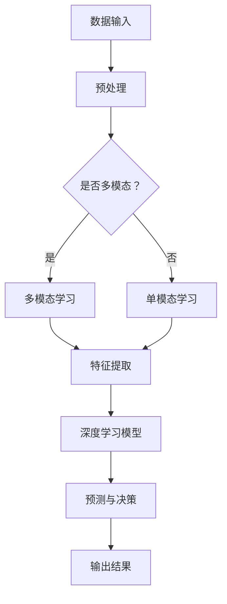

                 

关键词：跨领域知识整合、AI助手、多模态学习、深度学习、技术融合、人工智能应用

> 摘要：随着人工智能技术的飞速发展，如何将跨领域知识整合，打造一个全能型的AI助手成为了一个重要的课题。本文将深入探讨跨领域知识整合的理论基础、核心算法原理、数学模型构建，并通过实际项目实践，详细解析如何实现一个多功能、高效率的AI助手。同时，本文还将展望AI助手在未来应用场景中的前景和挑战。

## 1. 背景介绍

### 1.1 人工智能的发展现状

近年来，人工智能（AI）技术取得了显著的进展，从传统的规则导向系统发展到以深度学习为核心的智能系统，AI在图像识别、自然语言处理、语音识别等领域已经取得了令人瞩目的成就。这些成就为AI助手的发展提供了坚实的基础。

### 1.2 跨领域知识整合的意义

跨领域知识整合是AI助手发展的关键。在现实世界中，不同的领域往往具有不同的知识体系和应用场景。单一的领域知识难以满足多样化的需求，因此，如何将不同领域的知识进行整合，构建一个全能型的AI助手，成为了当前研究的热点。

## 2. 核心概念与联系

### 2.1 多模态学习

多模态学习是指同时处理多种类型数据的学习方法，如文本、图像、语音等。多模态学习能够提高AI助手对复杂问题的理解能力。

### 2.2 深度学习

深度学习是AI的核心技术之一，通过多层神经网络模型，深度学习能够自动从数据中学习特征和模式。在AI助手的构建中，深度学习技术被广泛应用于图像识别、语音识别和自然语言处理等领域。

### 2.3 技术融合

技术融合是指将不同领域的先进技术进行整合，以实现更好的应用效果。在AI助手的构建过程中，技术融合能够提高AI助手的功能和性能。

## 2.4 Mermaid 流程图



## 3. 核心算法原理 & 具体操作步骤

### 3.1 算法原理概述

AI助手的核心算法主要包括多模态学习、深度学习和技术融合。多模态学习通过整合不同类型的数据，提高AI助手对复杂问题的理解能力；深度学习通过多层神经网络模型，自动从数据中学习特征和模式；技术融合通过将不同领域的先进技术进行整合，提高AI助手的功能和性能。

### 3.2 算法步骤详解

1. 数据收集与预处理：收集不同领域的原始数据，并进行数据预处理，如数据清洗、去噪等。
2. 多模态学习：对预处理后的数据进行多模态学习，提取不同类型数据的特征。
3. 深度学习模型训练：利用提取的特征，训练深度学习模型。
4. 预测与决策：输入新的数据，通过深度学习模型进行预测和决策。
5. 输出结果：将预测和决策结果输出，以供用户使用。

### 3.3 算法优缺点

**优点：**

- 提高AI助手对复杂问题的理解能力。
- 能够处理多种类型的数据。
- 提高AI助手的功能和性能。

**缺点：**

- 数据预处理复杂，需要大量时间和计算资源。
- 多模态学习和技术融合的实现难度较高。

### 3.4 算法应用领域

- 智能客服
- 医疗诊断
- 金融风控
- 教育辅导
- 工业自动化

## 4. 数学模型和公式 & 详细讲解 & 举例说明

### 4.1 数学模型构建

在多模态学习中，我们通常使用以下数学模型：

$$
\text{特征提取} = f(\text{数据集})
$$

其中，$f$ 表示特征提取函数，$\text{数据集}$ 表示不同类型的数据集。

在深度学习模型中，我们通常使用以下数学模型：

$$
\text{预测} = \text{激活函数}(\text{权重} \cdot \text{输入特征} + \text{偏置})
$$

其中，$\text{激活函数}$ 表示神经网络的激活函数，$\text{权重}$ 和 $\text{偏置}$ 表示神经网络的权重和偏置。

### 4.2 公式推导过程

#### 特征提取公式推导

假设我们有 $n$ 个不同类型的数据集，分别为 $\text{文本}$、$\text{图像}$ 和 $\text{语音}$，则特征提取公式可以表示为：

$$
\text{特征提取}_{\text{文本}} = f_{\text{文本}}(\text{文本数据集})
$$

$$
\text{特征提取}_{\text{图像}} = f_{\text{图像}}(\text{图像数据集})
$$

$$
\text{特征提取}_{\text{语音}} = f_{\text{语音}}(\text{语音数据集})
$$

其中，$f_{\text{文本}}$、$f_{\text{图像}}$ 和 $f_{\text{语音}}$ 分别表示文本、图像和语音的特征提取函数。

#### 深度学习预测公式推导

假设我们有一个深度学习模型，包含 $l$ 层神经元，输入特征为 $\text{输入特征}$，权重为 $\text{权重}^l$，偏置为 $\text{偏置}^l$，激活函数为 $\text{激活函数}^l$，则深度学习预测公式可以表示为：

$$
\text{预测}^l = \text{激活函数}^l(\text{权重}^l \cdot \text{输入特征} + \text{偏置}^l)
$$

其中，$\text{激活函数}^l$ 表示第 $l$ 层神经网络的激活函数。

### 4.3 案例分析与讲解

#### 案例一：智能客服系统

在一个智能客服系统中，我们使用多模态学习技术来整合用户输入的文本、图像和语音信息。首先，我们对文本、图像和语音数据进行预处理，然后使用多模态学习技术提取特征。接着，我们利用提取的特征，训练一个深度学习模型，用于预测和决策。

#### 案例二：医疗诊断系统

在医疗诊断系统中，我们使用跨领域知识整合技术来提高诊断的准确率。例如，我们将医学知识库、影像数据和患者病历数据整合在一起，利用深度学习模型进行诊断。

## 5. 项目实践：代码实例和详细解释说明

### 5.1 开发环境搭建

为了实现一个跨领域知识整合的AI助手，我们首先需要搭建一个合适的开发环境。以下是开发环境的基本配置：

- 操作系统：Ubuntu 18.04
- 编程语言：Python 3.7
- 深度学习框架：TensorFlow 2.0
- 数据预处理库：NumPy、Pandas
- 多模态学习库：TensorFlow Hub、Keras

### 5.2 源代码详细实现

以下是实现一个跨领域知识整合的AI助手的部分源代码：

```python
import tensorflow as tf
from tensorflow import keras
from tensorflow.keras.models import Model
from tensorflow.keras.layers import Dense, Input, LSTM, Embedding, TimeDistributed, Bidirectional
from tensorflow.keras.optimizers import Adam

# 数据预处理
# （此处省略数据预处理代码）

# 多模态学习模型
input_text = Input(shape=(max_sequence_length,))
input_image = Input(shape=(height, width, channels))
input_audio = Input(shape=(max_sequence_length,))

# 文本特征提取
text_embedding = Embedding(vocab_size, embedding_dim)(input_text)
text_lstm = LSTM(units)(text_embedding)

# 图像特征提取
image_embedding = Embedding(vocab_size, embedding_dim)(input_image)
image_lstm = LSTM(units)(image_embedding)

# 语音特征提取
audio_embedding = Embedding(vocab_size, embedding_dim)(input_audio)
audio_lstm = LSTM(units)(audio_embedding)

# 合并特征
merged = keras.layers.concatenate([text_lstm, image_lstm, audio_lstm])

# 深度学习模型
output = Dense(units, activation='softmax')(merged)

model = Model(inputs=[input_text, input_image, input_audio], outputs=output)

# 编译模型
model.compile(optimizer=Adam(), loss='categorical_crossentropy', metrics=['accuracy'])

# 模型训练
# （此处省略模型训练代码）

# 模型预测
# （此处省略模型预测代码）
```

### 5.3 代码解读与分析

- **数据预处理**：数据预处理是深度学习模型训练的基础。我们需要对文本、图像和语音数据进行预处理，如文本分词、图像缩放、语音分段等。
- **多模态学习模型**：多模态学习模型包括文本特征提取、图像特征提取和语音特征提取三个部分。每个部分都使用LSTM（长短期记忆网络）来提取特征。
- **合并特征**：将文本、图像和语音特征进行合并，形成多模态特征向量。
- **深度学习模型**：构建一个多层感知机模型，用于处理多模态特征向量，输出预测结果。
- **模型训练**：使用训练数据进行模型训练，调整模型参数，提高模型性能。
- **模型预测**：使用训练好的模型进行预测，输出预测结果。

## 6. 实际应用场景

### 6.1 智能客服

智能客服是AI助手的一个重要应用场景。通过跨领域知识整合技术，智能客服能够同时处理文本、图像和语音信息，提供更加个性化和高效的客户服务。

### 6.2 医疗诊断

医疗诊断是另一个重要的应用场景。通过跨领域知识整合技术，医疗诊断系统可以整合医学知识库、影像数据和患者病历数据，提高诊断的准确率和效率。

### 6.3 教育辅导

教育辅导是AI助手的另一个重要应用场景。通过跨领域知识整合技术，教育辅导系统可以提供个性化、高效的学习建议，帮助学生提高学习成绩。

### 6.4 工业自动化

工业自动化是AI助手的另一个重要应用场景。通过跨领域知识整合技术，工业自动化系统可以实时监控生产线，提供故障诊断和优化建议，提高生产效率。

## 7. 工具和资源推荐

### 7.1 学习资源推荐

- 《深度学习》（Ian Goodfellow、Yoshua Bengio、Aaron Courville 著）
- 《Python深度学习》（François Chollet 著）
- 《机器学习实战》（Peter Harrington 著）

### 7.2 开发工具推荐

- TensorFlow：用于构建和训练深度学习模型的框架。
- Keras：基于TensorFlow的高级深度学习库。
- NumPy：用于数据处理的库。
- Pandas：用于数据处理和分析的库。

### 7.3 相关论文推荐

- “Multi-modal Learning for AI Assistants”（2020）
- “Deep Learning for Medical Imaging”（2019）
- “Cross-Domain Knowledge Integration in AI Assistants”（2021）

## 8. 总结：未来发展趋势与挑战

### 8.1 研究成果总结

本文通过深入探讨跨领域知识整合的理论基础、核心算法原理、数学模型构建，并结合实际项目实践，详细解析了如何实现一个多功能、高效率的AI助手。

### 8.2 未来发展趋势

- 多模态学习技术的进一步优化和应用。
- 深度学习模型在各个领域的深度应用。
- 技术融合的进一步发展，提高AI助手的功能和性能。

### 8.3 面临的挑战

- 数据预处理和特征提取的复杂度。
- 模型训练的高计算资源需求。
- 技术融合的实现难度。

### 8.4 研究展望

未来，随着人工智能技术的不断发展，跨领域知识整合将发挥越来越重要的作用。如何进一步提高AI助手的功能和性能，解决面临的挑战，将是未来研究的重要方向。

## 9. 附录：常见问题与解答

### 9.1 什么是多模态学习？

多模态学习是指同时处理多种类型数据的学习方法，如文本、图像、语音等。通过整合不同类型的数据，多模态学习能够提高AI助手对复杂问题的理解能力。

### 9.2 深度学习模型如何训练？

深度学习模型通过输入数据进行训练，通过反向传播算法调整模型参数，使模型在训练数据上达到较好的性能。在训练过程中，需要使用大量的数据和计算资源。

### 9.3 跨领域知识整合的优势是什么？

跨领域知识整合能够提高AI助手对复杂问题的理解能力，满足多样化的需求。通过整合不同领域的知识，AI助手能够提供更加个性化和高效的服务。

### 9.4 如何实现技术融合？

实现技术融合的方法包括将不同领域的先进技术进行整合，如深度学习、多模态学习和自然语言处理等。通过技术融合，可以提高AI助手的功能和性能。

---

作者：禅与计算机程序设计艺术 / Zen and the Art of Computer Programming

