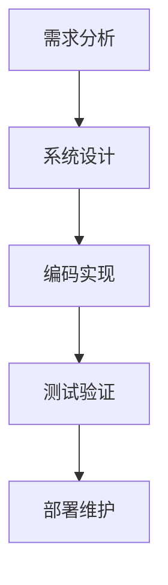

                 

关键词：软件工程，方法学体系，开发过程，项目管理，技术实践

摘要：本文将对软件工程的方法学体系进行深入探讨。首先，我们将回顾软件工程的发展历程，然后详细介绍当前主流的软件工程方法学，包括其核心概念、适用场景以及优缺点。随后，我们将探讨如何在实际项目中应用这些方法学，并提供相关的数学模型和公式。最后，我们将讨论软件工程领域的未来发展趋势和挑战。

## 1. 背景介绍

软件工程是系统化、规范化和可量化的方法，用于开发、运营和维护软件。它涉及多个学科领域，包括计算机科学、项目管理、系统工程和数学。软件工程的目标是确保软件系统的质量、可靠性和可维护性，同时提高开发效率和降低成本。

软件工程的发展历程可以分为几个阶段：手工作坊时代、结构化开发时代、面向对象开发时代以及敏捷开发时代。每个阶段都引入了新的开发方法和工具，促进了软件工程的演进。

## 2. 核心概念与联系

### 软件开发生命周期（SDLC）

软件开发生命周期是指软件开发和维护的全过程，通常包括需求分析、设计、编码、测试、部署和维护等阶段。SDLC 提供了一种系统化的方法，以确保软件项目按时交付、满足用户需求和具有高质量。

### 统一过程（UP）

统一过程是一种迭代和增量的软件开发方法，强调用户参与、灵活性和适应性。UP 包括四个主要阶段：初始阶段、细化阶段、构建阶段和交付阶段。每个阶段都包含一系列活动和任务，旨在逐步完善软件系统。

### Mermaid 流程图



### 核心概念原理和架构

- 需求管理：确保项目团队能够准确理解用户需求，并有效地管理和满足这些需求。
- 设计模式：提供了解决常见软件设计问题的通用解决方案。
- 测试方法：用于验证软件系统的正确性和性能。
- 项目管理：确保项目按计划进行，资源得到有效利用。

## 3. 核心算法原理 & 具体操作步骤

### 3.1 算法原理概述

软件工程中的核心算法通常包括排序算法、搜索算法、图算法和优化算法等。每种算法都有其独特的原理和应用场景。

### 3.2 算法步骤详解

- 排序算法：冒泡排序、选择排序、插入排序、快速排序等。
- 搜索算法：线性搜索、二分搜索、深度优先搜索、广度优先搜索等。
- 图算法：最短路径算法、最小生成树算法、拓扑排序等。
- 优化算法：贪心算法、动态规划、分支定界等。

### 3.3 算法优缺点

每种算法都有其优缺点。例如，快速排序在平均情况下具有较好的性能，但在最坏情况下性能较差。贪心算法通常能快速找到局部最优解，但未必是全局最优解。

### 3.4 算法应用领域

排序算法和搜索算法广泛应用于数据库、算法竞赛和实际应用中。图算法在社交网络分析、路由规划和网络流问题中具有重要应用。优化算法在资源分配、调度问题和路径规划等领域具有重要应用。

## 4. 数学模型和公式

### 4.1 数学模型构建

软件工程中的数学模型用于描述软件系统的属性和行为。常见的数学模型包括线性规划、非线性规划、博弈论和排队论等。

### 4.2 公式推导过程

以线性规划为例，其标准形式为：

$$
\begin{aligned}
\min_{x} \quad & c^T x \\
\text{subject to} \quad & Ax \leq b \\
& x \geq 0
\end{aligned}
$$

### 4.3 案例分析与讲解

假设我们要解决一个资源分配问题，目标是最小化总成本。通过构建线性规划模型并使用求解器，我们可以得到最优解。

## 5. 项目实践：代码实例和详细解释说明

### 5.1 开发环境搭建

在本节中，我们将介绍如何搭建一个简单的软件开发环境，包括安装所需的编程语言和开发工具。

### 5.2 源代码详细实现

以下是一个简单的冒泡排序算法的实现：

```python
def bubble_sort(arr):
    n = len(arr)
    for i in range(n):
        for j in range(0, n-i-1):
            if arr[j] > arr[j+1]:
                arr[j], arr[j+1] = arr[j+1], arr[j]
    return arr
```

### 5.3 代码解读与分析

这段代码使用冒泡排序算法对一个整数数组进行排序。在每轮迭代中，相邻的元素进行比较并交换，以确保最终数组按升序排列。

### 5.4 运行结果展示

假设输入数组为 `[3, 2, 1]`，执行排序后输出结果为 `[1, 2, 3]`。

## 6. 实际应用场景

### 6.1 项目管理

在软件项目中，项目管理是确保项目成功的关键。常见的项目管理工具包括 Jira、Trello 和 Asana 等。

### 6.2 自动化测试

自动化测试可以显著提高软件质量。常用的自动化测试工具包括 Selenium、JUnit 和 TestNG 等。

### 6.3 代码质量管理

代码质量管理是确保代码可读性、可维护性和可靠性的重要手段。常见的代码质量管理工具包括 SonarQube、Checkstyle 和 PMD 等。

## 7. 工具和资源推荐

### 7.1 学习资源推荐

- 《软件工程：实践者的研究方法》（Roger S. Pressman）
- 《敏捷软件开发：原则、实践与模式》（Robert C. Martin）
- 《代码大全》（Steve McConnell）

### 7.2 开发工具推荐

- IntelliJ IDEA、Visual Studio Code、PyCharm
- Git、GitHub、GitLab
- Jira、Trello、Asana

### 7.3 相关论文推荐

- 《敏捷软件开发：迭代方法论》（Alistair Cockburn）
- 《极限编程实践》（Kent Beck）
- 《代码整洁：改善软件的的艺术》（Robert C. Martin）

## 8. 总结：未来发展趋势与挑战

### 8.1 研究成果总结

近年来，软件工程领域取得了显著进展，包括敏捷开发、DevOps、人工智能和自动化测试等。

### 8.2 未来发展趋势

未来，软件工程将更加注重自动化、智能化和协作化。人工智能和机器学习将在软件工程中发挥重要作用。

### 8.3 面临的挑战

软件工程面临的主要挑战包括不断变化的需求、复杂的应用场景和高度竞争的市场。

### 8.4 研究展望

未来，软件工程将需要更加灵活、高效和可持续的方法和技术，以应对不断变化的挑战。

## 9. 附录：常见问题与解答

- **Q:** 软件工程与计算机科学有何区别？
  **A:** 软件工程是计算机科学的一个分支，专注于软件开发的过程和方法。计算机科学则更广泛地研究计算机系统的理论、算法和数据结构。

- **Q:** 敏捷开发与瀑布开发有何区别？
  **A:** 敏捷开发是一种迭代和增量的开发方法，强调用户参与、灵活性和适应性。瀑布开发是一种线性顺序的开发方法，强调前期规划和设计。

----------------------------------------------------------------

### 9. 附录：常见问题与解答

#### 9.1 软件工程与计算机科学有何区别？

软件工程和计算机科学都是与计算机相关的领域，但它们的关注点和应用范围有所不同。

**软件工程** 是一门应用科学，专注于设计、开发、维护和测试软件。软件工程的目标是创建高质量、可靠、可维护和有效的软件系统。它涉及项目管理、需求分析、设计、编程、测试和维护等各个阶段。

**计算机科学** 则更偏向于理论和原理，它研究计算机系统的基础知识和算法。计算机科学涵盖计算机理论、算法、数据结构、操作系统、网络、人工智能等主题。

两者的主要区别在于：

- **目标**：软件工程侧重于实际问题的解决，而计算机科学侧重于理论和基础研究的创新。
- **方法**：软件工程使用系统化的方法来开发软件，而计算机科学更注重研究和开发新的算法和理论。
- **领域**：软件工程关注的是软件产品的生产和维护，而计算机科学关注的是计算机系统的设计和运行。

尽管有这些区别，软件工程和计算机科学在许多方面是相互交织的。计算机科学提供了软件开发所需的基础理论和技术，而软件工程将这些技术应用于实际项目中。

#### 9.2 敏捷开发与瀑布开发有何区别？

敏捷开发（Agile Development）和瀑布开发（Waterfall Development）是两种不同的软件开发生命周期模型，它们在项目管理和开发方法上有着根本的不同。

**瀑布开发** 是一种传统的线性顺序开发模型。它将软件开发过程划分为多个阶段，每个阶段必须完全完成后才能开始下一个阶段。这些阶段通常包括需求分析、系统设计、编码、测试和部署。瀑布模型的主要特点是：

- **顺序性**：每个阶段都必须在前一个阶段完成后开始。
- **文档优先**：每个阶段都会产生大量的文档，这些文档是项目进展的关键。
- **阶段明确**：每个阶段有明确的输入和输出。

**敏捷开发** 是一种迭代和增量的开发模型，强调快速响应变化和持续交付价值。敏捷开发的主要特点包括：

- **迭代性**：开发过程分为多个短周期的迭代，每个迭代都包含需求收集、设计、编码、测试和评审。
- **灵活性**：敏捷方法允许在项目进行中随时调整需求，以更好地适应变化。
- **协作**：敏捷方法强调团队合作，用户和开发人员之间的紧密沟通。

两者的主要区别在于：

- **方法**：瀑布模型是线性的，而敏捷方法是非线性的，支持迭代和增量开发。
- **适应性**：敏捷方法能够更好地适应需求变化，而瀑布模型一旦进入下一个阶段，就很难调整。
- **沟通**：敏捷方法强调频繁的交流和反馈，而瀑布模型更多地依赖文档和审批流程。

选择哪种开发模型取决于项目的具体需求和环境。瀑布模型适合需求明确、变化较小的项目，而敏捷开发则适用于需求不确定、需要快速响应变化的场景。

#### 9.3 什么是DevOps，它如何影响软件工程？

**DevOps** 是一种结合了开发（Development）和运营（Operations）的方法论，旨在通过自动化、协作和文化变革来提高软件交付的速度和质量。DevOps 的主要目标是缩短软件交付周期、提高交付频率、增加基础设施的可靠性和灵活性。

**DevOps** 对软件工程的影响包括：

- **自动化**：通过自动化工具和流程，DevOps 可以实现基础设施的配置、代码的部署和环境的持续集成和持续交付（CI/CD）。
- **协作**：DevOps 强调开发人员、运维人员和测试人员之间的紧密协作，以实现更高效的流程。
- **快速反馈**：通过持续集成和持续交付，DevOps 能够快速反馈开发中的错误和问题，从而提高软件的质量。
- **可靠性**：通过自动化测试和监控，DevOps 能够提高软件的可靠性，减少人为错误。
- **基础设施即代码**：DevOps 推广基础设施即代码（Infrastructure as Code，IaC）的概念，使得基础设施的配置和管理像编写代码一样精确和可重复。

DevOps 改变了传统的软件交付模式，使得软件团队能够更快地交付高质量的产品。它对软件工程的影响是深远的，推动了软件工程方法的创新和发展。

### 9.4 什么是代码复用，它的重要性是什么？

**代码复用** 是指在软件开发过程中，重复使用已有的代码片段、模块或库，以减少重复劳动、提高开发效率和确保代码的一致性。代码复用可以通过多种方式实现，包括：

- **模块化编程**：将软件功能分解为独立的模块，每个模块可以单独开发、测试和部署。
- **函数库**：创建和维护一系列可重用的函数库，这些库提供了通用的算法和功能。
- **框架**：使用预定义的框架和组件，简化开发过程，提高代码的可维护性和可扩展性。
- **第三方库和开源软件**：使用现有的开源库和框架，避免从头开始编写代码。

**代码复用** 的重要性体现在以下几个方面：

- **提高开发效率**：通过复用现有的代码，可以节省开发时间和资源，提高开发效率。
- **确保代码一致性**：复用经过验证和测试的代码，可以减少错误和漏洞，提高软件质量。
- **降低维护成本**：复用代码可以减少代码的冗余，使得维护工作更加简单和高效。
- **促进知识共享**：通过共享和复用代码，开发人员可以更好地共享经验和最佳实践，提高整个团队的技能水平。

然而，代码复用也需要注意一些潜在的问题，如代码的可维护性、依赖性管理和版本兼容性等。因此，在实施代码复用时，需要仔细评估和权衡其优势和风险。

### 9.5 软件工程中的敏捷开发与传统开发方法的比较

**敏捷开发** 和 **传统开发方法**（如瀑布开发）在软件开发过程中有着显著的差异，主要体现在以下几个方面：

- **灵活性**：敏捷开发强调适应性，能够灵活应对需求变化。而传统开发方法通常在项目初期就确定所有需求，后续变化较为困难。

- **迭代周期**：敏捷开发以短周期（如两周）为迭代，每次迭代都会交付可运行的产品。传统开发方法通常以长时间阶段为周期，每个阶段结束后才交付部分成果。

- **用户参与**：敏捷开发重视用户的持续参与和反馈，确保开发的产品符合用户需求。传统开发方法用户参与较少，主要依赖文档和评审。

- **沟通协作**：敏捷开发强调团队成员之间的紧密协作和沟通，以快速解决问题和调整方向。传统开发方法往往依赖于文档和会议。

- **测试**：敏捷开发强调测试的持续性和自动化，以快速发现和修复问题。传统开发方法通常在开发完成后进行集中测试。

- **变更管理**：敏捷开发支持灵活的变更管理，鼓励在开发过程中调整需求。传统开发方法对变更控制较为严格，变更可能会影响项目进度和成本。

敏捷开发的优势在于其灵活性、快速响应变化的能力和持续交付价值。然而，它也需要高度的组织协作和成熟的项目管理。传统开发方法则更适合需求明确、变更较少的项目。在实际应用中，两者可以结合使用，以实现最佳的开发效果。

### 9.6 软件工程中的需求管理的重要性

**需求管理** 在软件工程中扮演着至关重要的角色，它是确保项目成功和满足用户需求的基础。需求管理的核心目标是：

- **识别**：准确识别和理解用户需求。
- **分析**：分析需求的优先级、可行性和依赖关系。
- **文档化**：清晰地记录需求，确保所有相关方对需求有共同的理解。
- **跟踪**：跟踪需求的实现和变更情况，确保需求得到满足。

需求管理的重要性体现在以下几个方面：

- **项目成功**：明确和一致的需求是项目成功的关键。良好的需求管理可以减少项目风险，确保项目按时交付。
- **用户满意度**：满足用户需求是软件项目成功的标志。需求管理确保开发的产品符合用户预期，提高用户满意度。
- **资源优化**：通过分析需求的优先级和可行性，项目团队能够更有效地分配资源，提高开发效率。
- **变更控制**：需求管理可以帮助团队更好地应对需求变更，确保项目在变更过程中仍然能够按时交付。

在软件工程中，需求管理是一个持续的过程，贯穿于项目的整个生命周期。它需要密切的用户沟通和项目管理，以确保需求得到有效管理和实现。

### 9.7 软件工程中的代码质量管理

**代码质量管理** 是确保代码质量、可维护性和可靠性的重要环节。它涉及多个方面，包括：

- **代码规范**：制定和遵守代码编写规范，确保代码的可读性和一致性。
- **代码审查**：通过同行评审和自动化工具对代码进行审查，识别潜在的错误和问题。
- **单元测试**：编写单元测试来验证代码的功能和性能，确保代码的正确性。
- **自动化测试**：实施自动化测试，提高测试效率和覆盖率。
- **代码维护**：持续维护代码库，修复漏洞、优化性能和改进代码结构。

代码质量管理的重要性在于：

- **提高软件质量**：通过代码审查、单元测试和自动化测试，可以确保代码的正确性和可靠性。
- **降低维护成本**：良好的代码质量使得代码易于维护，减少了后续的修复和优化工作。
- **提高开发效率**：通过代码规范和自动化工具，可以提高开发效率，减少重复劳动。
- **促进知识共享**：代码质量管理鼓励团队成员之间分享最佳实践和经验，提高整个团队的技能水平。

在软件工程中，代码质量管理是一个持续的过程，需要全体团队成员的共同努力和参与。

### 9.8 软件工程中的测试方法及其重要性

**测试方法** 是软件工程中确保软件质量和可靠性的关键环节。以下是一些常见的测试方法：

- **单元测试**：针对单个模块或函数的测试，以验证其功能是否符合预期。
- **集成测试**：测试模块之间的交互和集成，确保系统组件协同工作。
- **系统测试**：对整个软件系统进行测试，验证其功能、性能和可靠性。
- **验收测试**：用户对软件的最终验收，以确保软件满足用户需求和预期。
- **性能测试**：评估软件在特定负载下的性能，确保其能够满足性能要求。
- **安全测试**：检测软件的安全性漏洞和弱点，确保软件的安全性。

**测试方法的重要性** 在以下几个方面体现：

- **提高软件质量**：测试可以识别和修复软件中的错误和缺陷，确保软件的质量和可靠性。
- **降低风险**：通过早期发现和修复问题，可以降低软件发布后出现严重问题的风险。
- **验证需求**：测试可以验证软件是否满足用户需求，确保软件的功能和性能符合预期。
- **持续改进**：测试结果可以提供反馈，帮助团队改进开发过程和质量控制。

在软件工程中，测试方法是一个持续和迭代的过程，对于确保软件质量和用户满意度至关重要。

