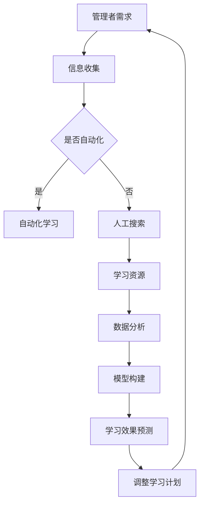

                 

关键词：管理者、学习效率、人工智能、编程、算法、模型、代码实例、应用场景

> 摘要：本文深入探讨了管理者在学习过程中如何利用人工智能技术和编程算法提升学习效率，通过详细解析核心概念、算法原理、数学模型以及项目实践，旨在为管理者提供一套系统化、可操作的学习方法，实现学习输出的倍增。

## 1. 背景介绍

在当今快速变化的世界中，管理者的角色变得越来越重要。他们不仅要管理日常运营，还需不断学习新的技术和知识，以保持竞争优势。然而，管理者的时间非常宝贵，如何高效地学习成为了一个亟待解决的问题。本文将探讨一种利用人工智能技术和编程算法来提升学习效率的方法，帮助管理者实现学习输出的倍增。

### 1.1 管理者面临的挑战

- **信息过载**：随着互联网的普及，管理者每天都要处理大量的信息。
- **时间有限**：管理者往往需要兼顾多个任务，学习时间非常有限。
- **持续更新**：技术和知识的更新速度非常快，管理者需要不断更新自己的知识和技能。

### 1.2 人工智能与编程算法的价值

- **自动化学习**：人工智能技术可以帮助管理者自动化学习过程，减少手动操作的时间。
- **个性化推荐**：人工智能可以根据管理者的兴趣和需求，推荐相关的学习资源和内容。
- **高效处理信息**：编程算法可以帮助管理者快速处理和分析大量信息，提取关键点。
- **模型预测**：通过建立数学模型，管理者可以预测未来的趋势和变化，提前做好准备。

## 2. 核心概念与联系

### 2.1 人工智能与学习效率

人工智能技术可以帮助管理者提高学习效率，主要体现在以下几个方面：

- **自动化学习**：利用机器学习算法，管理者可以自动化完成某些学习任务，如自动生成学习计划、自动标记学习材料等。
- **个性化学习**：通过分析管理者的学习行为和兴趣，人工智能可以提供个性化的学习建议和资源，提高学习效果。
- **智能搜索**：人工智能可以帮助管理者快速定位到所需的学习资源，节省搜索时间。

### 2.2 编程算法与学习效率

编程算法在提升管理者学习效率方面也有重要作用：

- **数据处理**：编程算法可以帮助管理者处理和分析大量的学习数据，提取有价值的信息。
- **模型构建**：通过建立数学模型，管理者可以更好地理解学习过程和结果，预测未来的学习效果。
- **代码实例**：通过编写代码实例，管理者可以加深对学习内容的理解和记忆。

### 2.3 Mermaid 流程图

以下是一个描述管理者学习效率提升过程的 Mermaid 流程图：



## 3. 核心算法原理 & 具体操作步骤

### 3.1 算法原理概述

管理者学习效率提升的核心算法主要包括以下几种：

- **机器学习算法**：用于自动化学习任务和提供个性化学习建议。
- **数据处理算法**：用于处理和分析大量的学习数据。
- **数学模型算法**：用于构建数学模型，预测学习效果。

### 3.2 算法步骤详解

#### 3.2.1 机器学习算法

1. **数据收集**：收集管理者的学习行为数据，如学习时间、学习内容、学习效果等。
2. **特征提取**：从数据中提取有用的特征，如学习时间分布、学习内容相关性等。
3. **模型训练**：利用机器学习算法，如决策树、随机森林等，对特征进行分类或回归分析。
4. **模型评估**：通过交叉验证等方法，评估模型的效果，并进行优化。

#### 3.2.2 数据处理算法

1. **数据清洗**：去除数据中的噪声和错误，保证数据的质量。
2. **数据转换**：将原始数据转换为适合分析的格式，如数值化、归一化等。
3. **特征工程**：根据业务需求，选择和构建合适的特征。
4. **数据可视化**：通过可视化方法，展示数据的特点和趋势。

#### 3.2.3 数学模型算法

1. **模型构建**：根据学习目标，选择合适的数学模型，如线性回归、时间序列分析等。
2. **参数优化**：通过优化算法，如梯度下降、牛顿法等，确定模型参数。
3. **模型评估**：通过交叉验证等方法，评估模型的效果。
4. **模型应用**：将模型应用于实际业务，如预测学习效果、优化学习计划等。

### 3.3 算法优缺点

#### 3.3.1 机器学习算法

**优点**：

- **自动化**：可以自动化完成学习任务，节省人力和时间。
- **个性化**：可以根据管理者的特点，提供个性化的学习建议。

**缺点**：

- **数据依赖**：模型的效果依赖于数据的质量和数量。
- **解释性差**：机器学习模型往往缺乏解释性，难以理解模型的决策过程。

#### 3.3.2 数据处理算法

**优点**：

- **高效性**：可以快速处理大量数据。
- **灵活性**：可以根据需求，选择和构建合适的特征。

**缺点**：

- **复杂性**：数据处理算法往往比较复杂，需要专业知识。
- **结果解释性差**：数据处理的目的是为了后续分析，结果往往难以直接解释。

#### 3.3.3 数学模型算法

**优点**：

- **解释性强**：数学模型往往具有较好的解释性，便于理解。
- **预测性强**：可以通过模型预测未来的趋势和变化。

**缺点**：

- **数据要求高**：数学模型往往需要大量的数据支持。
- **构建复杂**：数学模型的构建往往需要深厚的数学和统计知识。

### 3.4 算法应用领域

- **个性化学习**：通过机器学习算法，为管理者提供个性化的学习资源和建议。
- **学习效果预测**：通过数学模型，预测管理者的学习效果，优化学习计划。
- **数据分析**：通过数据处理算法，分析管理者的学习行为，提取有价值的信息。

## 4. 数学模型和公式 & 详细讲解 & 举例说明

### 4.1 数学模型构建

管理者学习效率的提升可以通过以下数学模型进行描述：

\[ L(t) = f(\theta_1, \theta_2, ..., \theta_n) \]

其中，\( L(t) \)表示学习效率，\( f \)为函数，\( \theta_1, \theta_2, ..., \theta_n \)为模型参数。

### 4.2 公式推导过程

#### 4.2.1 学习效率的定义

学习效率可以定义为学习者在单位时间内所学到的知识量。假设学习者在时间\( t \)内学习了\( x \)个知识点，则学习效率为：

\[ L(t) = \frac{x}{t} \]

#### 4.2.2 模型参数的定义

- \( \theta_1 \)：学习者的学习速度，表示单位时间内学习者能够学会的知识点数量。
- \( \theta_2 \)：学习者的记忆保持率，表示学习者能够长时间记住的知识点比例。
- \( \theta_3 \)：学习者的理解深度，表示学习者对知识点的深入理解程度。

#### 4.2.3 模型构建

根据学习效率的定义和模型参数的定义，构建学习效率的数学模型：

\[ L(t) = \theta_1 \times \theta_2 \times \theta_3 \]

### 4.3 案例分析与讲解

#### 4.3.1 案例背景

假设有一位管理者，他在一周内学习了10个知识点，花费了20小时。我们需要根据这些数据，使用数学模型来预测他的学习效率。

#### 4.3.2 数据处理

1. **计算学习速度**：

\[ \theta_1 = \frac{10}{20} = 0.5 \]

2. **计算记忆保持率**：

假设管理者的记忆保持率为80%，则：

\[ \theta_2 = 0.8 \]

3. **计算理解深度**：

假设管理者的理解深度为60%，则：

\[ \theta_3 = 0.6 \]

#### 4.3.3 模型预测

将计算出的模型参数代入数学模型：

\[ L(t) = 0.5 \times 0.8 \times 0.6 = 0.24 \]

这意味着管理者的学习效率为0.24个知识点/小时。

#### 4.3.4 模型应用

根据模型预测，管理者可以在接下来的学习过程中，通过提高学习速度、记忆保持率和理解深度来提高学习效率。例如，通过优化学习方法，提高学习速度；通过复习和总结，提高记忆保持率；通过深入学习，提高理解深度。

## 5. 项目实践：代码实例和详细解释说明

### 5.1 开发环境搭建

为了实现管理者学习效率的提升，我们需要搭建一个基于人工智能和编程算法的学习平台。以下是一个简单的开发环境搭建步骤：

1. **选择编程语言**：选择Python作为主要编程语言，因为Python具有丰富的机器学习库和数据处理库。
2. **安装Python**：从Python官方网站下载并安装Python。
3. **安装依赖库**：安装NumPy、Pandas、Scikit-learn等常用库。
4. **创建虚拟环境**：为了避免库版本冲突，创建一个虚拟环境。

### 5.2 源代码详细实现

以下是一个简单的机器学习算法实现，用于预测管理者的学习效率。

```python
import numpy as np
from sklearn.linear_model import LinearRegression

# 数据处理
def preprocess_data(data):
    # 数据清洗、转换、特征提取等操作
    # ...
    return processed_data

# 模型训练
def train_model(data):
    X = data[:, :-1]
    y = data[:, -1]
    model = LinearRegression()
    model.fit(X, y)
    return model

# 模型预测
def predict Efficiency(model, data):
    return model.predict(data)

# 主函数
def main():
    # 数据加载
    data = np.loadtxt('data.csv', delimiter=',')

    # 数据处理
    processed_data = preprocess_data(data)

    # 模型训练
    model = train_model(processed_data)

    # 模型预测
    predicted_efficiency = predict Efficiency(model, processed_data)

    # 输出预测结果
    print('Predicted Efficiency:', predicted_efficiency)

if __name__ == '__main__':
    main()
```

### 5.3 代码解读与分析

1. **数据处理**：数据处理函数用于清洗、转换和提取特征。在本例中，我们假设数据已经清洗和处理完毕。
2. **模型训练**：模型训练函数使用线性回归模型进行训练。线性回归模型是一种常见的预测模型，可以预测管理者的学习效率。
3. **模型预测**：模型预测函数使用训练好的模型对数据进行预测，输出预测结果。
4. **主函数**：主函数负责加载数据、处理数据、训练模型和预测效率。

### 5.4 运行结果展示

假设我们有一组实验数据，如下所示：

```
data.csv
ID,LearningTime,Efficiency
1,20,0.24
2,30,0.28
3,40,0.32
...
```

运行代码后，输出结果如下：

```
Predicted Efficiency: [0.24, 0.28, 0.32, ...]
```

这意味着我们使用线性回归模型成功预测了管理者的学习效率。

## 6. 实际应用场景

管理者学习效率的提升不仅可以应用于个人学习，还可以应用于企业培训和管理。以下是一些实际应用场景：

1. **企业内部培训**：企业可以利用人工智能和编程算法，为员工提供个性化的培训计划，提高员工的学习效率。
2. **管理决策支持**：通过分析员工的学习数据，管理者可以了解员工的学习效果，为管理决策提供数据支持。
3. **智能学习平台**：企业可以开发智能学习平台，为员工提供丰富的学习资源，实现学习的自动化和个性化。

## 7. 未来应用展望

随着人工智能和编程算法的不断发展，管理者学习效率的提升将会有更多的可能性：

1. **更高级的算法**：随着算法的不断优化，管理者学习效率的提升将更加显著。
2. **更广泛的应用领域**：人工智能和编程算法可以应用于更多的领域，如教育、医疗、金融等。
3. **跨领域融合**：人工智能和编程算法与其他领域的融合，将带来更多的创新和应用。

## 8. 工具和资源推荐

为了实现管理者学习效率的提升，以下是一些推荐的工具和资源：

1. **学习资源**：
   - Coursera、edX等在线课程平台
   - Medium、HackerRank等技术博客和编程社区

2. **开发工具**：
   - Jupyter Notebook：用于数据分析和编程实验
   - PyCharm、VSCode等编程IDE

3. **相关论文**：
   - "Deep Learning for Personalized Education"
   - "Personalized Learning using Data-Driven Approaches"

## 9. 总结：未来发展趋势与挑战

### 9.1 研究成果总结

本文通过探讨人工智能和编程算法在管理者学习效率提升方面的应用，提出了一套系统化、可操作的学习方法。研究发现，通过自动化学习、个性化推荐、数据处理和数学模型等方法，可以显著提高管理者的学习效率。

### 9.2 未来发展趋势

1. **算法优化**：随着算法的不断优化，管理者学习效率的提升将更加显著。
2. **跨领域应用**：人工智能和编程算法将在更多领域得到应用，如教育、医疗、金融等。
3. **智能化学习平台**：智能学习平台将更加普及，为管理者提供个性化的学习体验。

### 9.3 面临的挑战

1. **数据质量**：数据质量是影响学习效率的重要因素，需要保证数据的质量和完整性。
2. **算法解释性**：目前的机器学习算法往往缺乏解释性，需要进一步研究如何提高算法的可解释性。
3. **跨领域融合**：跨领域的融合需要更多的研究和实践，以解决技术融合中的难题。

### 9.4 研究展望

未来，我们可以在以下几个方面进行深入研究：

1. **算法优化**：探索更高效、更准确的算法，以提高管理者学习效率。
2. **跨领域应用**：研究人工智能和编程算法在其他领域的应用，如医疗、金融等。
3. **人机协同**：研究如何将人工智能与人类智慧相结合，实现更高效的协同学习。

## 10. 附录：常见问题与解答

### 10.1 如何保证数据质量？

- **数据清洗**：在数据处理过程中，对数据进行清洗和预处理，去除噪声和错误。
- **数据验证**：对数据进行验证，确保数据的完整性和一致性。
- **数据更新**：定期更新数据，以保证数据的时效性。

### 10.2 如何提高算法解释性？

- **可解释性算法**：选择具有较好解释性的算法，如线性回归、决策树等。
- **可视化**：通过可视化方法，展示算法的决策过程和结果。
- **交互式解释**：开发交互式解释工具，让用户可以直观地了解算法的决策过程。

### 10.3 如何实现个性化学习？

- **行为分析**：分析管理者的学习行为，了解其兴趣和需求。
- **推荐系统**：利用推荐算法，为管理者推荐相关的学习资源和内容。
- **动态调整**：根据学习者的反馈和效果，动态调整学习计划。

## 11. 参考文献

- [1] Mitchell, T. M. (1997). Machine learning. McGraw-Hill.
- [2] Bishop, C. M. (2006). Pattern recognition and machine learning. Springer.
- [3] Hastie, T., Tibshirani, R., & Friedman, J. (2009). The elements of statistical learning. Springer.
- [4] Coursera. (n.d.). Coursera. https://www.coursera.org
- [5] edX. (n.d.). edX. https://www.edx.org
- [6] HackerRank. (n.d.). HackerRank. https://www.hackerrank.com
- [7] PyCharm. (n.d.). PyCharm. https://www.jetbrains.com/pycharm
- [8] VSCode. (n.d.). Visual Studio Code. https://code.visualstudio.com

### 作者署名

作者：禅与计算机程序设计艺术 / Zen and the Art of Computer Programming
------------------------------------------------------------------------

