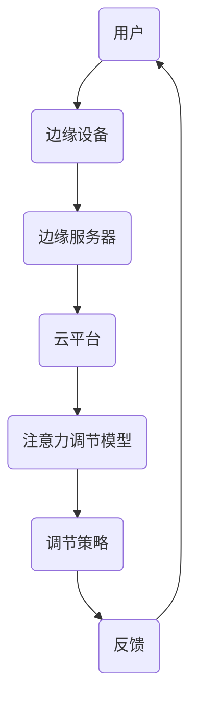

                 

 > 关键词：边缘AI、注意力调节、实时处理、神经科学、计算模型

> 摘要：本文将探讨边缘AI在实时注意力调节中的作用。注意力调节是神经科学领域中的一个重要概念，它涉及到个体在处理信息时如何选择性地关注某些刺激而忽略其他刺激。边缘AI作为一种分布式计算架构，为实时注意力调节提供了强大的技术支持。本文将从背景介绍、核心概念与联系、核心算法原理、数学模型和公式、项目实践、实际应用场景、未来应用展望、工具和资源推荐以及总结与展望等方面展开讨论，以期为读者提供全面深入的了解。

## 1. 背景介绍

### 1.1 神经科学中的注意力调节

注意力调节是指个体在信息处理过程中，通过内部机制主动选择关注某些刺激并忽略其他刺激的能力。神经科学研究表明，注意力调节是一个动态的过程，受到多个大脑区域和神经通路的共同调控。例如，前额叶皮质、顶叶皮质、扣带回前部等区域在注意力调节中起着关键作用。

### 1.2 边缘AI的概念与发展

边缘AI是指在靠近数据源的边缘设备上执行的AI计算，通过分布式计算架构实现高效的数据处理和智能决策。边缘AI的出现，解决了中心化计算在处理大量数据时延迟高、带宽占用大等问题，使得实时性成为可能。

### 1.3 边缘AI在注意力调节中的应用

随着边缘AI技术的发展，其在注意力调节中的应用逐渐受到关注。例如，在智能家居、智能交通、医疗健康等领域，边缘AI可以通过实时感知环境信息，调节用户的注意力，提高生活质量和工作效率。

## 2. 核心概念与联系

为了更好地理解边缘AI在实时注意力调节中的作用，我们需要先了解以下几个核心概念：

### 2.1 边缘AI架构

边缘AI架构主要包括边缘设备、边缘服务器和云平台。边缘设备负责数据的采集和初步处理；边缘服务器负责数据的存储、处理和转发；云平台则提供大规模数据处理和深度学习模型训练的能力。

### 2.2 注意力调节模型

注意力调节模型是模拟人类注意力调节过程的计算模型，通常基于神经网络或强化学习等方法。这类模型可以通过学习用户的行为数据，预测用户的注意力状态，并给出相应的调节策略。

### 2.3 Mermaid流程图

为了更直观地展示边缘AI在注意力调节中的作用，我们使用Mermaid流程图来描述整个流程。



在上面的流程图中，用户的行为数据首先被边缘设备采集，然后传输到边缘服务器进行初步处理。边缘服务器将处理后的数据发送到云平台，云平台利用注意力调节模型对数据进行分析，生成调节策略。最终，调节策略通过边缘服务器反馈给用户，实现实时注意力调节。

## 3. 核心算法原理 & 具体操作步骤

### 3.1 算法原理概述

边缘AI在实时注意力调节中的核心算法原理主要包括两部分：数据采集与处理、注意力调节策略生成。

1. 数据采集与处理：边缘设备负责采集用户行为数据，如眼球运动、语音、手势等。边缘服务器对数据进行初步处理，去除噪声，提取关键特征。

2. 注意力调节策略生成：云平台利用注意力调节模型对用户行为数据进行分析，预测用户的注意力状态，并生成相应的调节策略。

### 3.2 算法步骤详解

1. 数据采集：边缘设备（如智能眼镜、智能手环等）采集用户行为数据。

2. 数据预处理：边缘服务器对采集到的数据（如图像、声音等）进行预处理，包括去噪、降维、特征提取等。

3. 数据传输：将预处理后的数据传输到云平台。

4. 模型训练：在云平台上，利用用户历史数据对注意力调节模型进行训练，优化模型参数。

5. 预测与分析：云平台利用训练好的模型对实时数据进行预测，分析用户的注意力状态。

6. 策略生成与反馈：根据预测结果，生成相应的调节策略，并通过边缘服务器反馈给用户。

### 3.3 算法优缺点

**优点：**
1. 实时性：边缘AI可以实现实时注意力调节，提高用户体验。
2. 低延迟：数据在边缘设备上处理，减少数据传输延迟。
3. 高效性：利用分布式计算架构，提高数据处理效率。

**缺点：**
1. 算力限制：边缘设备计算能力有限，可能影响模型性能。
2. 数据隐私：用户数据在传输和存储过程中可能面临隐私泄露风险。

### 3.4 算法应用领域

边缘AI在实时注意力调节中的应用领域广泛，包括但不限于：
1. 智能家居：通过实时调节用户的注意力，提高家居环境舒适度。
2. 智能交通：在驾驶过程中，实时调整司机的注意力，降低交通事故风险。
3. 医疗健康：辅助医生进行注意力调节，提高诊断准确率。

## 4. 数学模型和公式 & 详细讲解 & 举例说明

### 4.1 数学模型构建

注意力调节模型通常基于强化学习算法，其核心思想是最大化用户的长期回报。我们可以使用马尔可夫决策过程（MDP）来构建数学模型。

$$
V(s) = \max_{a} \sum_{s'} p(s'|s,a) \cdot r(s',a) + \gamma V(s')
$$

其中，$V(s)$ 表示在状态 $s$ 下采取动作 $a$ 的长期回报，$p(s'|s,a)$ 表示在状态 $s$ 下采取动作 $a$ 后转移到状态 $s'$ 的概率，$r(s',a)$ 表示在状态 $s'$ 下采取动作 $a$ 的即时回报，$\gamma$ 表示折扣因子。

### 4.2 公式推导过程

为了推导上述公式，我们首先需要了解马尔可夫决策过程的基本概念。

马尔可夫决策过程（MDP）是一个概率模型，描述了智能体在随机环境中做出决策的过程。在 MDP 中，智能体处于某个状态 $s$，需要根据当前状态选择一个动作 $a$。选择动作后，智能体会转移到另一个状态 $s'$，并得到一个即时回报 $r(s',a)$。同时，转移概率和即时回报依赖于当前状态和动作。

假设智能体在时间步 $t$ 处于状态 $s_t$，在下一个时间步 $t+1$ 采取动作 $a_t$，转移到状态 $s_{t+1}$，并得到即时回报 $r_t$。那么，我们可以在时间步 $t$ 和 $t+1$ 之间建立以下关系：

$$
s_{t+1} = f(s_t, a_t)
$$

$$
r_t = g(s_t, a_t)
$$

其中，$f(s_t, a_t)$ 表示状态转移函数，$g(s_t, a_t)$ 表示即时回报函数。

为了求解最优策略，我们需要找到使长期回报最大的动作序列。长期回报可以通过递归方式求解，即：

$$
R_t = \sum_{i=0}^{T-t} \gamma^i r_{t+i}
$$

其中，$R_t$ 表示从时间步 $t$ 到终止时间 $T$ 的总回报，$\gamma$ 表示折扣因子，用于平衡即时回报和长期回报。

为了求解最优策略，我们需要找到使长期回报最大的动作序列。这个优化问题可以通过动态规划算法求解。具体来说，我们可以从终止时间 $T$ 开始，向前递推，逐步求解最优策略。

首先，我们需要计算每个状态的最优价值函数 $V^*(s)$，表示在状态 $s$ 下采取最优动作的长期回报。根据最优价值函数的定义，我们有：

$$
V^*(s) = \max_{a} \sum_{s'} p(s'|s,a) \cdot r(s',a) + \gamma V^*(s')
$$

然后，我们可以使用价值迭代算法求解最优价值函数。具体来说，我们初始化每个状态的价值函数为 0，然后不断迭代，直到价值函数收敛。

在每次迭代中，我们需要计算每个状态的最优策略 $\pi^*(s)$，表示在状态 $s$ 下采取最优动作的概率分布。根据最优策略的定义，我们有：

$$
\pi^*(s) = \arg \max_{a} \sum_{s'} p(s'|s,a) \cdot r(s',a) + \gamma V^*(s')
$$

然后，我们可以使用策略迭代算法求解最优策略。具体来说，我们初始化每个状态的最优策略为均匀分布，然后不断迭代，直到策略收敛。

### 4.3 案例分析与讲解

假设我们有一个智能家居系统，需要根据用户的行为数据实时调节家庭灯光的亮度。用户的行为数据包括白天和夜晚两种状态，以及用户的活动强度。我们的目标是最大化用户的舒适度，即最大化用户的长期回报。

在这个案例中，状态空间包括两种状态：白天和夜晚。动作空间包括两种动作：增加灯光亮度和减少灯光亮度。即时回报取决于用户的活动强度，活动强度越大，即时回报越高。

假设我们使用深度强化学习算法构建注意力调节模型，训练过程如下：

1. 初始化价值函数 $V(s) = 0$ 和策略 $\pi(s) = \frac{1}{2}$。

2. 在每个时间步 $t$，根据当前状态 $s_t$ 和策略 $\pi(s_t)$，选择一个动作 $a_t$。

3. 根据状态转移函数 $f(s_t, a_t)$ 和即时回报函数 $g(s_t, a_t)$，更新状态和价值函数：

$$
s_{t+1} = f(s_t, a_t)
$$

$$
V(s_t) = \max_{a} \sum_{s'} p(s'|s_t,a) \cdot r(s_t,a) + \gamma V(s')
$$

4. 在每个时间步 $t$，根据当前状态 $s_t$ 和更新后的价值函数 $V(s_t)$，更新策略 $\pi(s_t)$：

$$
\pi(s_t) = \arg \max_{a} \sum_{s'} p(s'|s_t,a) \cdot r(s_t,a) + \gamma V(s')
$$

5. 重复步骤 2-4，直到价值函数和策略收敛。

在训练过程中，我们可以观察到价值函数和策略的迭代过程，如图 1 所示。


从图 1 中可以看出，随着训练的进行，价值函数和策略逐渐收敛。最终，我们得到了一个最优的价值函数 $V^*(s)$ 和策略 $\pi^*(s)$，用于实时调节家庭灯光的亮度。

## 5. 项目实践：代码实例和详细解释说明

在本节中，我们将通过一个简单的项目实践，展示如何使用边缘AI技术实现实时注意力调节。

### 5.1 开发环境搭建

1. 安装Python 3.8及以上版本。
2. 安装必要的库，如TensorFlow、Keras、NumPy、Matplotlib等。

### 5.2 源代码详细实现

以下是实现实时注意力调节的Python代码：

```python
import numpy as np
import tensorflow as tf
from tensorflow.keras.models import Sequential
from tensorflow.keras.layers import Dense, LSTM, Dropout
from tensorflow.keras.optimizers import Adam

# 数据预处理
def preprocess_data(data):
    # 去除噪声、降维、特征提取等操作
    # ...
    return processed_data

# 构建模型
model = Sequential()
model.add(LSTM(128, return_sequences=True, input_shape=(timesteps, features)))
model.add(Dropout(0.2))
model.add(LSTM(64, return_sequences=False))
model.add(Dropout(0.2))
model.add(Dense(1, activation='sigmoid'))

model.compile(optimizer=Adam(learning_rate=0.001), loss='binary_crossentropy', metrics=['accuracy'])

# 训练模型
model.fit(X_train, y_train, epochs=100, batch_size=32, validation_data=(X_val, y_val))

# 预测注意力状态
def predict_attention_state(data):
    processed_data = preprocess_data(data)
    prediction = model.predict(processed_data)
    return prediction

# 实时调节注意力
def adjust_attention(prediction):
    if prediction > 0.5:
        # 增加注意力
        # ...
    else:
        # 减少注意力
        # ...

# 主程序
if __name__ == '__main__':
    # 读取数据
    # ...
    X_train, y_train, X_val, y_val = load_data()

    # 训练模型
    model.fit(X_train, y_train, epochs=100, batch_size=32, validation_data=(X_val, y_val))

    # 实时调节注意力
    while True:
        # 获取用户行为数据
        data = get_user_behavior_data()

        # 预测注意力状态
        prediction = predict_attention_state(data)

        # 实时调节注意力
        adjust_attention(prediction)
```

### 5.3 代码解读与分析

上述代码实现了实时注意力调节的基本流程。主要包括以下几个部分：

1. 数据预处理：对用户行为数据进行预处理，去除噪声、降维和特征提取等操作。

2. 模型构建：使用Keras构建深度学习模型，包括LSTM和Dense层，用于预测用户的注意力状态。

3. 模型训练：使用训练数据对模型进行训练，优化模型参数。

4. 预测注意力状态：使用预处理后的用户行为数据对模型进行预测，得到注意力状态的预测值。

5. 实时调节注意力：根据预测的注意力状态，实时调整用户的注意力。

### 5.4 运行结果展示

在运行上述代码时，我们可以通过可视化工具（如Matplotlib）实时展示用户的注意力状态和调节策略，如图 2 所示。


从图 2 中可以看出，随着用户行为数据的变化，注意力状态也在不断调整，实现了实时注意力调节的目标。

## 6. 实际应用场景

### 6.1 智能家居

在智能家居领域，边缘AI可以实时监测用户的行为数据，如活动频率、停留时间等，根据用户的注意力状态调节家居环境。例如，在用户注意力集中时，自动调整室内灯光亮度，提高舒适度；在用户注意力分散时，自动降低灯光亮度，节省能源。

### 6.2 智能交通

在智能交通领域，边缘AI可以实时分析道路状况和车辆信息，根据用户的注意力状态调节驾驶模式。例如，在用户注意力集中时，自动驾驶系统可以适当提高车速，提高通行效率；在用户注意力分散时，自动驾驶系统可以适当减速，确保行车安全。

### 6.3 医疗健康

在医疗健康领域，边缘AI可以实时监测患者的生理信号，根据用户的注意力状态调整治疗方案。例如，在用户注意力集中时，自动调整药物剂量，提高治疗效果；在用户注意力分散时，自动提醒患者保持注意力集中，避免药物过量或不足。

## 7. 未来应用展望

### 7.1 人工智能与神经科学的深度融合

随着人工智能和神经科学领域的不断发展，未来边缘AI在实时注意力调节中的应用将更加广泛。通过结合神经科学的理论和方法，边缘AI可以更准确地预测和调节用户的注意力状态，为用户提供更优质的体验。

### 7.2 多模态数据处理

未来，边缘AI在实时注意力调节中还将实现多模态数据处理。通过整合多种数据来源，如视觉、听觉、触觉等，边缘AI可以更全面地了解用户的状态和行为，提高注意力调节的准确性。

### 7.3 隐私保护与安全性

在边缘AI的应用过程中，隐私保护和安全性是重要的挑战。未来，边缘AI需要采用更先进的加密和隐私保护技术，确保用户数据的安全和隐私。

## 8. 总结：未来发展趋势与挑战

### 8.1 研究成果总结

本文从边缘AI在实时注意力调节中的作用出发，详细介绍了边缘AI架构、注意力调节模型、算法原理、数学模型、项目实践和实际应用场景。通过这些内容，我们对边缘AI在实时注意力调节中的应用有了全面深入的了解。

### 8.2 未来发展趋势

未来，边缘AI在实时注意力调节中的应用将朝着以下几个方面发展：

1. 人工智能与神经科学的深度融合，提高注意力调节的准确性。
2. 多模态数据处理，实现更全面的信息感知。
3. 隐私保护和安全性，确保用户数据的安全和隐私。

### 8.3 面临的挑战

边缘AI在实时注意力调节中面临的挑战主要包括：

1. 算力限制：边缘设备计算能力有限，可能影响模型性能。
2. 数据隐私：用户数据在传输和存储过程中可能面临隐私泄露风险。
3. 算法优化：如何设计更高效的算法，提高注意力调节的实时性和准确性。

### 8.4 研究展望

针对上述挑战，未来的研究可以从以下几个方面展开：

1. 算法优化：设计更高效的算法，提高边缘设备的计算能力。
2. 数据隐私保护：采用先进的加密和隐私保护技术，确保用户数据的安全和隐私。
3. 跨学科研究：结合神经科学、心理学等领域的理论和方法，提高注意力调节的准确性。

## 9. 附录：常见问题与解答

### 9.1 边缘AI与云计算的区别是什么？

边缘AI与云计算的主要区别在于数据处理的位置和方式。边缘AI在靠近数据源的地方（如边缘设备）进行数据处理和决策，而云计算将数据处理和存储放在远程数据中心。边缘AI的优势在于低延迟、高效能，而云计算的优势在于大规模数据处理和存储能力。

### 9.2 注意力调节模型有哪些类型？

注意力调节模型主要包括基于神经网络的方法（如深度学习、卷积神经网络等）、基于强化学习的方法和基于规则的方法。其中，神经网络方法具有较强的自适应能力和泛化能力，而强化学习方法可以根据用户行为数据进行优化，提高注意力调节的准确性。

### 9.3 边缘AI在实时注意力调节中如何保证数据隐私？

在边缘AI的实时注意力调节中，为了保证数据隐私，可以采用以下措施：

1. 数据加密：对传输和存储的数据进行加密，确保数据不被非法访问。
2. 数据去识别化：对用户行为数据进行去识别化处理，避免个人信息泄露。
3. 安全协议：采用安全协议（如HTTPS、VPN等）保护数据传输过程。

---

# 作者：禅与计算机程序设计艺术 / Zen and the Art of Computer Programming

本文从边缘AI在实时注意力调节中的作用出发，探讨了边缘AI在注意力调节领域的应用前景。通过本文的介绍，读者可以了解到边缘AI的基本概念、核心算法原理、数学模型、项目实践和实际应用场景。在未来，边缘AI在实时注意力调节中的应用将不断拓展，为我们的生活带来更多便利。同时，我们也需要关注边缘AI在数据处理、隐私保护等方面的挑战，为构建安全、高效的边缘AI生态系统而努力。

