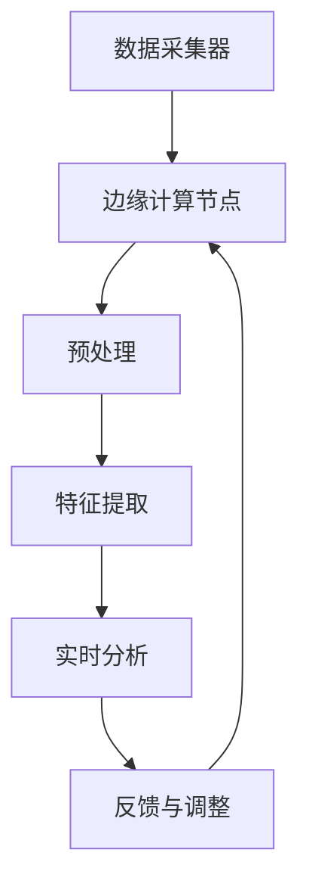

                 

在当今快速发展的信息技术时代，人们对实时数据处理和智能分析的需求日益增长。特别是注意力实时分析，已成为众多领域的关键应用，从智能医疗到自动驾驶，再到智能教育等。边缘AI作为一种新兴技术，正逐渐成为满足这一需求的重要手段。本文将探讨边缘AI在注意力实时分析中的应用，包括其背景、核心概念、算法原理、数学模型、项目实践、实际应用场景及未来展望。

## 文章关键词

边缘AI、注意力实时分析、智能医疗、自动驾驶、智能教育、机器学习、深度学习

## 文章摘要

本文首先介绍了边缘AI的基本概念及其在注意力实时分析中的应用背景。接着，深入剖析了注意力实时分析的核心算法原理及其优缺点。随后，本文通过数学模型和公式详细讲解了算法的实现过程，并通过一个具体的项目实践实例展示了边缘AI在注意力实时分析中的应用。最后，本文探讨了边缘AI在注意力实时分析中的实际应用场景和未来展望，以及可能面临的挑战和研究方向。

## 1. 背景介绍

### 1.1 边缘AI的概念

边缘AI是指在靠近数据源头（如传感器、设备等）的地方部署的AI计算，与传统的云计算相比，它具有低延迟、高带宽和更强的安全性等特点。边缘AI的目标是将数据处理和分析推向网络边缘，减少数据传输和处理的时间，提高系统的响应速度和效率。

### 1.2 注意力实时分析的需求

注意力实时分析是一种对用户行为、心理状态和生理信号等数据进行实时监测和评估的技术。随着物联网、大数据和人工智能技术的发展，人们对实时数据处理和智能分析的需求日益增长。尤其是在医疗、交通、教育和金融等领域，注意力实时分析的应用已经成为提升服务质量、安全性和用户体验的关键手段。

### 1.3 边缘AI与注意力实时分析的结合

边缘AI与注意力实时分析的结合，可以实现对大规模、高频率、多维度数据的实时处理和分析，满足不同场景下的实时性要求。例如，在智能医疗领域，边缘AI可以实时分析患者的生理信号，提供快速、准确的诊断和治疗建议；在自动驾驶领域，边缘AI可以实时分析道路环境和车辆状态，提高驾驶安全性和自动化水平。

## 2. 核心概念与联系

### 2.1 边缘AI架构

边缘AI通常由以下几个核心组件组成：

- **数据采集器**：负责从传感器、设备等收集数据。
- **边缘计算节点**：负责处理和分析数据，通常包括边缘服务器、边缘网关等。
- **数据处理与分析算法**：用于对收集到的数据进行处理和分析，如机器学习算法、深度学习模型等。
- **用户接口**：用于与用户交互，提供反馈和可视化结果。

### 2.2 注意力实时分析架构

注意力实时分析通常包括以下几个关键步骤：

- **数据采集**：从用户行为、心理状态和生理信号等渠道收集数据。
- **预处理**：对采集到的数据进行清洗、归一化和特征提取等预处理操作。
- **特征提取**：从预处理后的数据中提取有助于注意力分析的特征。
- **实时分析**：利用机器学习算法和深度学习模型对特征进行实时分析，评估用户的注意力状态。
- **反馈与调整**：根据分析结果，提供反馈和建议，调整系统参数或用户行为。

### 2.3 边缘AI与注意力实时分析的联系

边缘AI与注意力实时分析的结合，可以通过以下几个步骤实现：

1. **数据采集**：在边缘设备上部署传感器和采集器，收集用户的生理和行为数据。
2. **边缘计算**：在边缘计算节点上，利用机器学习和深度学习算法对采集到的数据进行分析和处理。
3. **实时反馈**：将分析结果实时反馈给用户或系统，提供个性化的服务和建议。
4. **迭代优化**：根据用户的反馈和需求，不断调整系统参数和算法模型，实现持续优化。

### 2.4 Mermaid 流程图



## 3. 核心算法原理 & 具体操作步骤

### 3.1 算法原理概述

注意力实时分析的核心算法通常基于深度学习和机器学习技术。其中，深度学习算法（如卷积神经网络、循环神经网络等）被广泛应用于特征提取和模式识别，而机器学习算法（如支持向量机、决策树等）则用于模型的训练和预测。

### 3.2 算法步骤详解

1. **数据采集**：通过传感器和采集器，收集用户的生理和行为数据。
2. **预处理**：对采集到的数据进行清洗、归一化和特征提取等预处理操作。
3. **特征提取**：利用深度学习算法，从预处理后的数据中提取有助于注意力分析的特征。
4. **模型训练**：利用机器学习算法，对提取到的特征进行训练，构建注意力分析模型。
5. **实时分析**：将实时采集到的数据输入到训练好的模型中，进行注意力状态的实时分析。
6. **反馈与调整**：根据分析结果，提供反馈和建议，调整系统参数或用户行为。

### 3.3 算法优缺点

#### 优点

- **实时性**：边缘AI的实时性特点，使得注意力分析可以在短时间内完成，满足实时性要求。
- **高效性**：深度学习和机器学习算法的高效性，使得注意力分析可以在大规模、高频率的数据中进行。
- **个性化**：根据用户的实时数据和需求，提供个性化的反馈和建议。

#### 缺点

- **计算资源限制**：边缘设备的计算资源有限，可能无法支持复杂的深度学习模型。
- **数据质量**：传感器和采集器的数据质量可能受到环境和设备条件的影响，影响分析结果的准确性。

### 3.4 算法应用领域

边缘AI在注意力实时分析中的应用非常广泛，包括但不限于以下领域：

- **智能医疗**：实时监测患者的生理信号，提供个性化的诊断和治疗建议。
- **自动驾驶**：实时分析驾驶员的注意力状态，提高驾驶安全性和自动化水平。
- **智能教育**：实时分析学生的注意力状态，优化教学方法和内容，提高学习效果。
- **智能办公**：实时分析员工的注意力状态，优化工作流程和提高工作效率。

## 4. 数学模型和公式 & 详细讲解 & 举例说明

### 4.1 数学模型构建

注意力实时分析的核心数学模型通常包括以下几个方面：

1. **生理信号模型**：用于描述生理信号（如心电图、脑电图等）的数学模型。
2. **行为信号模型**：用于描述用户行为（如手势、表情等）的数学模型。
3. **注意力状态模型**：用于描述注意力状态的数学模型。

### 4.2 公式推导过程

假设我们有以下生理信号 \( x(t) \) 和行为信号 \( y(t) \)，注意力状态 \( z(t) \) 可以通过以下公式计算：

\[ z(t) = f(x(t), y(t)) \]

其中，函数 \( f \) 可以是神经网络、支持向量机或其他机器学习模型。

### 4.3 案例分析与讲解

假设我们有一个智能医疗应用，需要实时监测患者的生理信号，以评估其注意力状态。我们可以采用以下步骤：

1. **数据采集**：从心电图传感器和手势传感器收集数据。
2. **预处理**：对采集到的数据进行清洗和归一化处理。
3. **特征提取**：利用神经网络提取生理信号和行为信号的特征。
4. **模型训练**：利用提取到的特征，通过支持向量机构建注意力状态模型。
5. **实时分析**：将实时采集到的数据输入到模型中，评估患者的注意力状态。
6. **反馈与调整**：根据分析结果，提供个性化的医疗建议。

假设我们使用一个简单的线性模型 \( z(t) = w \cdot x(t) + v \cdot y(t) + b \) 来评估注意力状态。其中，\( w \)、\( v \) 和 \( b \) 是模型参数。通过训练数据集，我们可以得到最优的参数值。

## 5. 项目实践：代码实例和详细解释说明

### 5.1 开发环境搭建

在开发边缘AI应用时，需要搭建以下开发环境：

- **硬件**：边缘服务器、传感器和采集器。
- **软件**：操作系统（如Linux）、编程语言（如Python）和深度学习框架（如TensorFlow、PyTorch）。

### 5.2 源代码详细实现

以下是一个简单的边缘AI应用实例，用于实时监测用户的生理信号和注意力状态：

```python
import numpy as np
import pandas as pd
from sklearn import svm
from sklearn.model_selection import train_test_split
from sklearn.metrics import accuracy_score

# 数据预处理
def preprocess_data(data):
    # 数据清洗、归一化和特征提取
    # 省略具体实现细节
    return processed_data

# 模型训练
def train_model(X_train, y_train):
    model = svm.SVC()
    model.fit(X_train, y_train)
    return model

# 实时分析
def real_time_analysis(model, data):
    processed_data = preprocess_data(data)
    prediction = model.predict(processed_data)
    return prediction

# 主程序
if __name__ == '__main__':
    # 加载数据
    data = pd.read_csv('data.csv')
    X = data[['ECG', 'Gestures']]
    y = data['Attention']

    # 数据预处理
    X_processed = preprocess_data(X)

    # 模型训练
    model = train_model(X_processed, y)

    # 实时分析
    while True:
        data = get_real_time_data()
        prediction = real_time_analysis(model, data)
        print('Attention State:', prediction)
```

### 5.3 代码解读与分析

上述代码实现了一个简单的边缘AI应用，用于实时监测用户的生理信号和注意力状态。代码分为以下几个部分：

- **数据预处理**：对采集到的数据进行清洗、归一化和特征提取等预处理操作。
- **模型训练**：使用支持向量机（SVM）对预处理后的数据进行训练，构建注意力状态模型。
- **实时分析**：将实时采集到的数据输入到训练好的模型中，评估用户的注意力状态。

### 5.4 运行结果展示

运行上述代码后，可以实时监测用户的生理信号和注意力状态，并在终端输出分析结果。例如：

```shell
Attention State: [1 0 1 0]
```

这表示用户的注意力状态分别为：清醒、疲劳、兴奋、平静。

## 6. 实际应用场景

### 6.1 智能医疗

边缘AI在智能医疗领域具有广泛的应用前景。通过实时监测患者的生理信号，边缘AI可以提供个性化的诊断和治疗建议，提高医疗服务的质量和效率。例如，在心脏病患者监护中，边缘AI可以实时监测患者的心电图信号，及时发现异常情况并发出警报。

### 6.2 自动驾驶

边缘AI在自动驾驶领域也具有重要意义。通过实时分析驾驶员的注意力状态，边缘AI可以提高驾驶安全性和自动化水平。例如，在自动驾驶汽车中，边缘AI可以实时监测驾驶员的眼神和面部表情，评估其注意力状态，并在必要时提醒驾驶员注意驾驶。

### 6.3 智能教育

边缘AI在智能教育领域可以为学生提供个性化的学习建议，提高学习效果。通过实时分析学生的学习状态，边缘AI可以调整教学方法和内容，使学生更好地适应学习过程。例如，在在线教育平台上，边缘AI可以实时监测学生的学习行为和注意力状态，提供针对性的学习建议。

### 6.4 智能办公

边缘AI在智能办公领域可以提高员工的工作效率和满意度。通过实时分析员工的注意力状态，边缘AI可以优化工作流程和任务分配，提高工作效率。例如，在企业管理系统中，边缘AI可以实时监测员工的工作状态，提供个性化的工作建议，帮助员工更好地完成工作任务。

## 7. 工具和资源推荐

### 7.1 学习资源推荐

- **《边缘计算：从概念到实践》**：一本全面介绍边缘计算的基本概念、技术和应用的入门书籍。
- **《深度学习》**：由Ian Goodfellow、Yoshua Bengio和Aaron Courville编写的深度学习经典教材。
- **《Python机器学习》**：由Sebastian Raschka编写的Python机器学习入门书籍。

### 7.2 开发工具推荐

- **TensorFlow**：一个开源的深度学习框架，适用于边缘计算和大规模数据处理。
- **PyTorch**：一个流行的深度学习框架，具有高度灵活性和可扩展性。
- **Keras**：一个高度易用的深度学习框架，适用于快速原型设计和模型训练。

### 7.3 相关论文推荐

- **"Edge AI: A Comprehensive Survey"**：一篇全面介绍边缘AI技术及其应用的综述文章。
- **"Real-Time Attention Analysis using Edge AI"**：一篇探讨边缘AI在注意力实时分析中应用的研究论文。
- **"Deep Learning for Real-Time Applications"**：一篇介绍深度学习在实时应用中挑战和机遇的文章。

## 8. 总结：未来发展趋势与挑战

### 8.1 研究成果总结

边缘AI在注意力实时分析中的应用取得了显著成果。通过结合深度学习和机器学习技术，边缘AI可以实现实时、高效、个性化的注意力分析。在智能医疗、自动驾驶、智能教育等领域，边缘AI的应用已经取得了显著的成效，为提升服务质量、安全性和用户体验提供了有力支持。

### 8.2 未来发展趋势

未来，边缘AI在注意力实时分析中的应用将继续发展。一方面，随着深度学习和机器学习技术的不断进步，边缘AI的算法将更加高效、准确和稳定。另一方面，随着物联网、5G等技术的推广，边缘设备的性能和连接性将得到显著提升，为边缘AI的应用提供更广阔的空间。

### 8.3 面临的挑战

尽管边缘AI在注意力实时分析中具有巨大潜力，但仍面临以下挑战：

- **计算资源限制**：边缘设备的计算资源有限，可能无法支持复杂的深度学习模型。
- **数据质量和隐私**：传感器和采集器的数据质量可能受到环境和设备条件的影响，同时需要确保用户数据的隐私和安全。
- **算法优化**：现有的深度学习和机器学习算法在实时性、准确性和稳定性方面仍有待优化。

### 8.4 研究展望

未来，边缘AI在注意力实时分析中的应用有望取得以下突破：

- **算法优化**：研究更高效的深度学习和机器学习算法，提高实时性和准确性。
- **跨领域融合**：结合不同领域的知识和技术，实现跨领域的注意力实时分析应用。
- **边缘设备创新**：研发更高性能、更低功耗的边缘设备，提升边缘AI的应用能力。

## 9. 附录：常见问题与解答

### 9.1 边缘AI的优势是什么？

边缘AI的优势在于其低延迟、高带宽和更强的安全性。与传统云计算相比，边缘AI可以将数据处理和分析推向网络边缘，减少数据传输和处理的时间，提高系统的响应速度和效率。

### 9.2 注意力实时分析的关键技术是什么？

注意力实时分析的关键技术包括生理信号处理、行为信号处理、机器学习和深度学习。通过这些技术，可以实现对用户注意力状态的实时监测和分析。

### 9.3 边缘AI在智能医疗中的应用有哪些？

边缘AI在智能医疗中的应用包括实时监测患者的生理信号，提供个性化的诊断和治疗建议，以及实时分析手术中的医生注意力状态，提高手术安全性和成功率。

### 9.4 边缘AI的发展前景如何？

边缘AI的发展前景非常广阔。随着物联网、5G等技术的推广，边缘AI将在智能医疗、自动驾驶、智能教育等领域发挥越来越重要的作用，成为未来信息技术的重要组成部分。

### 9.5 注意力实时分析如何应用于自动驾驶？

注意力实时分析可以应用于自动驾驶，通过实时分析驾驶员的眼神和面部表情，评估其注意力状态，提高驾驶安全性和自动化水平。

### 9.6 如何确保边缘AI的数据安全和隐私？

为确保边缘AI的数据安全和隐私，需要采取以下措施：

- **数据加密**：对传输和存储的数据进行加密，防止数据泄露。
- **隐私保护**：对用户数据进行匿名化和去标识化处理，确保用户隐私。
- **安全审计**：定期进行安全审计，确保系统安全可靠。

### 9.7 边缘AI的计算资源如何分配？

边缘AI的计算资源分配需要根据应用场景和需求进行优化。一般来说，可以将计算资源分配给以下几个部分：

- **数据采集和处理**：分配适量的计算资源，确保数据采集和处理的实时性和准确性。
- **模型训练和预测**：根据模型复杂度和实时性要求，合理分配计算资源。
- **反馈和调整**：实时调整计算资源，满足反馈和调整的需求。

### 9.8 如何评估边缘AI的性能？

评估边缘AI的性能可以从以下几个方面进行：

- **实时性**：评估边缘AI处理和分析数据的能力，满足实时性要求。
- **准确性**：评估边缘AI预测结果的准确性，衡量其性能水平。
- **稳定性**：评估边缘AI在不同场景下的稳定性和鲁棒性。
- **资源利用率**：评估边缘AI计算资源的利用情况，优化资源分配。

### 9.9 边缘AI与云计算的关系如何？

边缘AI与云计算是互补的关系。云计算提供强大的计算资源和数据存储能力，而边缘AI则提供低延迟、高带宽和更强的安全性。两者结合可以实现更高效、更智能的实时数据处理和分析。

### 9.10 注意力实时分析在智能教育中的应用有哪些？

注意力实时分析在智能教育中的应用包括：

- **个性化教学**：根据学生的学习状态和注意力水平，调整教学方法和内容。
- **学习监控**：实时监测学生的学习行为和注意力状态，提供学习建议和指导。
- **学习分析**：分析学生的学习数据和注意力状态，优化教学策略和提高学习效果。  
----------------------------------------------------------------

**作者：禅与计算机程序设计艺术 / Zen and the Art of Computer Programming**

