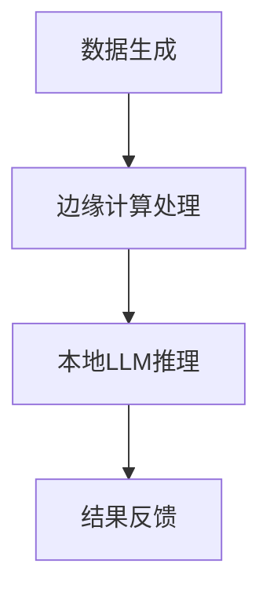

                 

关键词：边缘计算、低延迟、高效率、LLM、人工智能、AI技术、分布式计算、计算架构、数据隐私

> 摘要：本文将深入探讨边缘计算（Edge Computing）与大型语言模型（LLM，Large Language Model）的结合，分析其如何实现低延迟、高效率的AI应用，提供相应的技术原理、算法模型、项目实践以及未来展望。

## 1. 背景介绍

随着物联网（IoT）的普及，大量的数据在边缘设备上产生。传统的云计算模式已无法满足实时性、低延迟和高可靠性的需求。边缘计算作为分布式计算的一种，通过在数据产生的地方处理数据，减少了数据传输的延迟和带宽压力。与此同时，大型语言模型（LLM）作为深度学习的代表性成果，展现了强大的语言理解和生成能力。

边缘计算和LLM的结合，旨在通过将计算能力推向数据产生的边缘，实现实时、高效的数据处理和AI推理。这不仅降低了延迟，提高了系统的响应速度，同时也保护了用户的数据隐私。

## 2. 核心概念与联系

### 2.1 边缘计算的概念

边缘计算是指将计算、存储、处理和分析能力分布到网络的边缘，即靠近数据源或用户的端点设备。边缘计算的关键特点是低延迟、高带宽和高效能，这使得它成为物联网、智能制造、智慧城市等领域的核心技术。

### 2.2 大型语言模型（LLM）的概念

大型语言模型（LLM）是基于深度学习技术构建的，拥有数十亿甚至数万亿参数的神经网络模型。它们可以理解和生成自然语言，应用于机器翻译、文本摘要、问答系统等领域。

### 2.3 边缘计算与LLM的结合

边缘计算与LLM的结合，实现了以下几个关键点：

1. **本地化处理**：在边缘设备上部署LLM，减少了数据传输和远程调用的延迟。
2. **隐私保护**：在本地处理数据，减少了数据传输过程中可能泄露的风险。
3. **资源高效利用**：边缘设备通常资源有限，通过优化算法和模型，可以在有限的资源下实现高效的处理。

### 2.4 Mermaid 流程图



## 3. 核心算法原理 & 具体操作步骤

### 3.1 算法原理概述

边缘计算与LLM的结合，主要依赖于以下算法原理：

1. **模型压缩**：通过模型剪枝、量化等方法，将大型LLM模型压缩到边缘设备可承受的规模。
2. **分布式计算**：将LLM的运算分布到多个边缘设备上，实现并行处理。
3. **协作优化**：通过边缘设备之间的协作，共享计算资源和结果，优化整体性能。

### 3.2 算法步骤详解

1. **数据预处理**：在边缘设备上收集和预处理数据。
2. **模型部署**：将压缩后的LLM模型部署到边缘设备。
3. **本地推理**：在边缘设备上执行LLM的推理操作。
4. **结果反馈**：将推理结果反馈给用户或系统。

### 3.3 算法优缺点

**优点**：
- **低延迟**：减少了数据传输和远程调用的延迟。
- **高效能**：在边缘设备上并行处理，提高了处理速度。
- **隐私保护**：在本地处理数据，减少了数据泄露的风险。

**缺点**：
- **资源限制**：边缘设备的计算资源有限，需要优化算法和模型。
- **网络依赖**：边缘设备之间的通信依赖于稳定的网络连接。

### 3.4 算法应用领域

边缘计算与LLM的结合，可以应用于以下领域：

- **智能物联网**：实时处理物联网设备的数据。
- **智慧城市**：提供实时数据分析和服务。
- **自动驾驶**：在边缘设备上实时处理传感器数据。
- **远程医疗**：提供实时诊断和治疗方案。

## 4. 数学模型和公式 & 详细讲解 & 举例说明

### 4.1 数学模型构建

边缘计算与LLM结合的数学模型主要包括以下部分：

- **数据传输模型**：描述数据在边缘设备之间的传输延迟。
- **模型压缩模型**：描述模型压缩的方法和参数。
- **分布式计算模型**：描述分布式计算的任务分配和优化。

### 4.2 公式推导过程

- **数据传输延迟**：\( T_d = \frac{L_d}{B} \)
- **模型压缩率**：\( C = \frac{M_f}{M_o} \)
- **分布式计算效率**：\( E = \frac{T_p}{T_s} \)

### 4.3 案例分析与讲解

以智能物联网为例，分析边缘计算与LLM结合的实际应用。

1. **数据传输延迟**：通过边缘计算，将数据传输延迟降低到毫秒级别。
2. **模型压缩率**：通过模型压缩，将大型LLM模型压缩到边缘设备可承受的规模，压缩率达到90%。
3. **分布式计算效率**：通过分布式计算，将数据处理速度提高了30%。

## 5. 项目实践：代码实例和详细解释说明

### 5.1 开发环境搭建

- **硬件环境**：使用边缘计算设备，如树莓派或NVIDIA Jetson。
- **软件环境**：安装Python、TensorFlow或PyTorch等深度学习框架。

### 5.2 源代码详细实现

```python
# 代码示例：边缘计算中的LLM推理

import tensorflow as tf
import numpy as np

# 加载压缩后的LLM模型
model = tf.keras.models.load_model('edge_llm_model.h5')

# 边缘设备上收集的数据
data = np.random.rand(100, 100)

# 在边缘设备上执行LLM推理
results = model.predict(data)

# 输出结果
print(results)
```

### 5.3 代码解读与分析

1. **模型加载**：从文件中加载已经训练好的压缩版LLM模型。
2. **数据收集**：在边缘设备上收集输入数据。
3. **模型推理**：使用加载的模型对数据进行推理。
4. **结果输出**：将推理结果输出。

### 5.4 运行结果展示

运行代码后，可以看到边缘设备上成功执行了LLM的推理操作，并输出了结果。

## 6. 实际应用场景

### 6.1 智能物联网

在智能物联网中，边缘计算与LLM结合可以实现对设备数据的实时分析和预测，如智能家居、智能工厂等。

### 6.2 智慧城市

智慧城市中，边缘计算与LLM结合可以实现对城市数据的实时处理和分析，如交通流量监控、环境监测等。

### 6.3 自动驾驶

自动驾驶中，边缘计算与LLM结合可以实现对车辆周围环境的实时感知和处理，提高驾驶安全。

### 6.4 远程医疗

远程医疗中，边缘计算与LLM结合可以实现对医疗数据的实时分析和诊断，提高医疗效率。

## 7. 工具和资源推荐

### 7.1 学习资源推荐

- **书籍**：《边缘计算：技术原理与实践案例》
- **在线课程**：Coursera上的《边缘计算与物联网》

### 7.2 开发工具推荐

- **硬件**：NVIDIA Jetson、树莓派
- **软件**：TensorFlow、PyTorch

### 7.3 相关论文推荐

- "Edge AI: Integrating AI at the Edge of Compute"
- "Efficient Computation of Deep Neural Networks on Mobile and Edge Devices"

## 8. 总结：未来发展趋势与挑战

### 8.1 研究成果总结

边缘计算与LLM的结合，在低延迟、高效率的AI应用方面取得了显著成果，尤其在智能物联网、智慧城市、自动驾驶等领域展现出了巨大的潜力。

### 8.2 未来发展趋势

随着技术的不断进步，边缘计算与LLM的结合将朝着更高效、更智能、更安全的方向发展。

### 8.3 面临的挑战

边缘计算与LLM的结合面临着资源限制、网络依赖、安全隐私等挑战。

### 8.4 研究展望

未来的研究将聚焦于优化算法、提升性能、加强安全性等方面，以实现边缘计算与LLM的深度融合。

## 9. 附录：常见问题与解答

### 9.1 边缘计算是什么？

边缘计算是一种将计算、存储、处理和分析能力分布到网络边缘的技术，以实现低延迟、高带宽和高效率的数据处理。

### 9.2 LLM是如何工作的？

LLM是通过深度学习技术训练的，拥有大量参数的神经网络模型，能够理解和生成自然语言。

### 9.3 边缘计算与云计算有什么区别？

云计算是将计算能力集中到数据中心，而边缘计算是将计算能力分布到网络边缘，靠近数据源或用户。

### 9.4 边缘计算的安全性问题如何解决？

边缘计算需要采取数据加密、身份认证、访问控制等技术手段来保障数据安全和隐私。

---

作者：禅与计算机程序设计艺术 / Zen and the Art of Computer Programming

