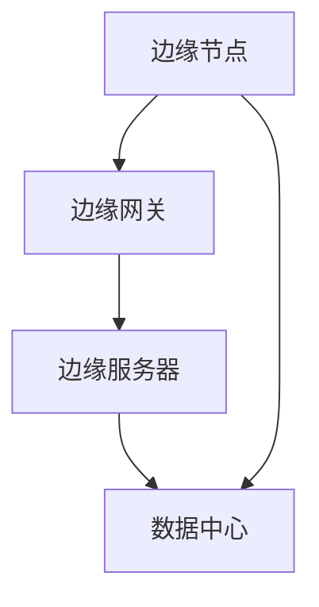

                 

关键词：边缘计算、实时处理、创业、新范式、技术趋势

> 摘要：边缘计算正逐渐成为现代技术领域的一个重要趋势，它为实时数据处理提供了新的范式。本文将探讨边缘计算的概念、核心算法原理、数学模型、实际应用场景，以及未来发展趋势与挑战。

## 1. 背景介绍

随着物联网（IoT）的快速发展，大量的设备和传感器被部署到网络边缘，这些设备和传感器产生的数据量呈现出指数级的增长。传统的云计算模式已经无法满足这种快速增长的数据处理需求，特别是在实时性要求高的应用场景中。边缘计算作为一种新兴的计算模式，旨在将数据处理和存储能力分散到网络边缘，从而提高数据处理的实时性和效率。

边缘计算的核心思想是将计算任务分散到靠近数据源的边缘设备上，以减少数据传输的延迟和带宽消耗。这种分布式计算模式不仅能够提高数据处理的速度，还能够降低中心化数据处理中心的负载压力。

### 1.1 边缘计算的发展历程

边缘计算的概念早在20世纪80年代就已经出现，随着网络技术的发展和物联网的兴起，边缘计算逐渐成为一种重要的技术趋势。以下是边缘计算发展历程的简要回顾：

- **早期阶段**：边缘计算主要关注于网络边缘的设备管理和数据采集。
- **发展阶段**：随着物联网设备的普及，边缘计算开始涉及到实时数据处理和智能分析。
- **成熟阶段**：目前，边缘计算已经成为物联网、智能制造、智能交通等领域的重要组成部分。

### 1.2 边缘计算的应用场景

边缘计算在许多领域都有广泛的应用，以下是几个典型的应用场景：

- **智能家居**：通过边缘计算，智能家居设备能够实现实时监控和智能控制，提高家居生活的便利性和舒适度。
- **智能医疗**：在医疗领域，边缘计算可以用于实时监测患者生命体征，提供快速诊断和治疗方案。
- **智能制造**：在制造业中，边缘计算可以用于实时监控设备状态，优化生产流程，提高生产效率。
- **智能交通**：在交通领域，边缘计算可以用于实时交通流量监测和信号控制，提高交通效率和安全性。

## 2. 核心概念与联系

边缘计算的核心概念包括边缘节点、边缘网关、边缘服务器和边缘平台。这些概念之间有着密切的联系，共同构成了边缘计算的整体架构。

### 2.1 边缘节点

边缘节点是边缘计算中的基本单元，它通常是指网络边缘的设备，如智能传感器、移动设备、智能路由器等。边缘节点负责采集数据、执行计算任务和处理数据。

### 2.2 边缘网关

边缘网关是边缘节点和数据中心之间的桥梁，它主要负责数据的收集、过滤和转发。边缘网关通常具有网络协议转换、安全防护等功能。

### 2.3 边缘服务器

边缘服务器是指在边缘计算环境中提供计算资源的设备，它通常具有强大的计算能力和存储能力。边缘服务器可以运行复杂的计算任务，如机器学习模型训练、大数据分析等。

### 2.4 边缘平台

边缘平台是边缘计算的核心，它为边缘节点、边缘网关和边缘服务器提供统一的开发和管理环境。边缘平台通常包括应用程序开发框架、数据处理工具和资源管理功能。

下面是一个简单的 Mermaid 流程图，展示了边缘计算的基本架构：



## 3. 核心算法原理 & 具体操作步骤

边缘计算的核心算法包括数据处理算法、资源调度算法和网络安全算法。这些算法共同保证了边缘计算系统的可靠性和高效性。

### 3.1 算法原理概述

- **数据处理算法**：数据处理算法主要用于边缘节点的数据采集、处理和传输。常见的算法包括数据压缩、数据加密和数据去重等。
- **资源调度算法**：资源调度算法用于优化边缘计算资源的分配，提高系统性能。常见的算法包括负载均衡、任务调度和资源预留等。
- **网络安全算法**：网络安全算法用于保障边缘计算系统的数据安全和网络通信安全。常见的算法包括加密通信、访问控制和入侵检测等。

### 3.2 算法步骤详解

- **数据处理算法**：首先，边缘节点采集数据，然后对数据进行预处理，如数据压缩和去噪。接下来，边缘节点将预处理后的数据发送到边缘网关。边缘网关对数据进行过滤和分类，然后将重要的数据转发到边缘服务器。边缘服务器对数据进行进一步处理和分析，如机器学习模型的训练和预测。
- **资源调度算法**：首先，系统监控边缘节点的资源使用情况，如CPU利用率、内存使用率和网络带宽等。然后，根据监控数据，系统调整任务执行策略，如分配任务到资源利用率较低的边缘节点。最后，系统根据任务执行情况，动态调整资源分配策略，确保系统始终处于最优状态。
- **网络安全算法**：首先，边缘节点和边缘服务器之间建立安全通道，使用加密通信技术保障数据传输的安全性。其次，系统部署访问控制策略，限制未授权用户访问敏感数据。最后，系统部署入侵检测系统，实时监控网络通信行为，检测和防范恶意攻击。

### 3.3 算法优缺点

- **数据处理算法**：优点包括数据传输效率高、数据安全性和隐私保护性好；缺点包括计算复杂度高、算法实现难度大。
- **资源调度算法**：优点包括资源利用率高、系统性能稳定；缺点包括算法设计复杂、实现难度大。
- **网络安全算法**：优点包括数据安全性高、网络通信稳定；缺点包括算法实现复杂、对系统性能有一定影响。

### 3.4 算法应用领域

- **数据处理算法**：适用于实时数据采集、处理和分析的场景，如智能家居、智能医疗和智能制造等。
- **资源调度算法**：适用于需要高效资源利用的场景，如云计算、大数据处理和物联网等。
- **网络安全算法**：适用于需要保障数据安全和网络通信安全的场景，如金融、医疗和政府等。

## 4. 数学模型和公式 & 详细讲解 & 举例说明

边缘计算中的数学模型和公式主要用于描述数据传输、资源调度和网络安全等方面。以下是一个简单的数学模型，用于描述边缘节点与边缘服务器之间的数据传输过程。

### 4.1 数学模型构建

假设边缘节点产生的数据量为 \( D \)，边缘服务器的计算能力为 \( C \)，边缘节点与边缘服务器之间的带宽为 \( B \)，数据传输延迟为 \( L \)。则数据传输时间 \( T \) 可以用以下公式表示：

\[ T = \frac{D}{B} + L \]

### 4.2 公式推导过程

数据传输时间 \( T \) 包括两部分：数据传输时间和传输延迟。数据传输时间 \( \frac{D}{B} \) 表示数据在带宽为 \( B \) 的信道上传输所需的时间；传输延迟 \( L \) 表示数据在传输过程中由于网络延迟、处理延迟等因素导致的时间延迟。

### 4.3 案例分析与讲解

假设边缘节点产生的数据量为 100 MB，边缘服务器的计算能力为 10 TFLOPS，边缘节点与边缘服务器之间的带宽为 1 Gbps，数据传输延迟为 100 ms。则数据传输时间 \( T \) 为：

\[ T = \frac{100 \text{ MB}}{1 \text{ Gbps}} + 100 \text{ ms} \]

\[ T = 100 \text{ ms} + 100 \text{ ms} \]

\[ T = 200 \text{ ms} \]

这个结果表明，在给定的网络条件下，数据传输时间约为 200 毫秒。如果需要进一步降低数据传输时间，可以考虑增加带宽或减少传输延迟。

## 5. 项目实践：代码实例和详细解释说明

### 5.1 开发环境搭建

为了实践边缘计算技术，我们需要搭建一个边缘计算的开发环境。以下是一个简单的开发环境搭建步骤：

1. 安装操作系统：我们选择 Ubuntu 20.04 作为操作系统。
2. 安装边缘节点软件：我们选择边缘节点软件 Mongoose OS。
3. 安装边缘服务器软件：我们选择边缘服务器软件 Kaa。
4. 配置网络：配置边缘节点和边缘服务器之间的网络连接。

### 5.2 源代码详细实现

以下是一个简单的边缘计算项目实例，用于实现边缘节点与边缘服务器之间的数据传输：

```python
# 边缘节点代码

import time
import json
import socket

# 数据采集
def collect_data():
    # 这里实现数据采集逻辑，如读取传感器数据
    data = {"temperature": 25, "humidity": 60}
    return data

# 数据发送
def send_data(data):
    server_ip = "10.0.0.1"
    server_port = 12345

    # 创建 TCP 连接
    sock = socket.socket(socket.AF_INET, socket.SOCK_STREAM)
    sock.connect((server_ip, server_port))

    # 发送数据
    json_data = json.dumps(data)
    sock.sendall(json_data.encode('utf-8'))

    # 关闭连接
    sock.close()

# 主程序
def main():
    while True:
        data = collect_data()
        send_data(data)
        time.sleep(10)  # 每 10 秒发送一次数据

if __name__ == "__main__":
    main()
```

```python
# 边缘服务器代码

import socket
import json

# 数据接收
def receive_data():
    server_ip = "0.0.0.0"
    server_port = 12345

    # 创建 TCP 服务
    sock = socket.socket(socket.AF_INET, socket.SOCK_STREAM)
    sock.bind((server_ip, server_port))
    sock.listen(5)

    # 接收数据
    conn, addr = sock.accept()
    data = conn.recv(1024).decode('utf-8')
    conn.close()

    # 解析数据
    json_data = json.loads(data)
    print(json_data)

# 主程序
def main():
    while True:
        receive_data()
        time.sleep(1)  # 每 1 秒接收一次数据

if __name__ == "__main__":
    main()
```

### 5.3 代码解读与分析

边缘节点代码主要负责数据采集和数据发送。数据采集函数 `collect_data` 用于模拟从传感器读取数据。数据发送函数 `send_data` 通过 TCP 连接将数据发送到边缘服务器。

边缘服务器代码主要负责数据接收。数据接收函数 `receive_data` 通过 TCP 服务接收边缘节点发送的数据，并解析数据。

通过这个简单的实例，我们可以看到边缘计算的基本原理：边缘节点采集数据，并通过网络将数据发送到边缘服务器，边缘服务器接收数据并进行分析和处理。

### 5.4 运行结果展示

运行边缘节点和边缘服务器代码，我们可以看到边缘节点每 10 秒发送一次数据，边缘服务器每 1 秒接收一次数据。边缘服务器打印接收到的数据，以便进行分析和处理。

## 6. 实际应用场景

边缘计算在许多实际应用场景中都有广泛的应用，以下是几个典型的应用场景：

### 6.1 智能家居

在智能家居领域，边缘计算可以用于实时监控家中的各种设备，如温度、湿度、灯光和安防设备等。通过边缘计算，智能家居系统能够实现快速响应和智能控制，提高家居生活的便利性和舒适度。

### 6.2 智能医疗

在医疗领域，边缘计算可以用于实时监测患者的生命体征，如心率、血压和血糖等。通过边缘计算，医生可以快速获取患者的健康数据，提供及时的诊断和治疗方案，提高医疗服务的质量和效率。

### 6.3 智能制造

在制造业中，边缘计算可以用于实时监控设备状态，优化生产流程，提高生产效率。通过边缘计算，制造企业能够实现智能制造，降低生产成本，提高产品质量。

### 6.4 智能交通

在交通领域，边缘计算可以用于实时监测交通流量，控制交通信号，优化交通管理。通过边缘计算，交通系统能够实现智能交通，提高交通效率和安全性，减少交通事故。

### 6.5 智能农业

在农业领域，边缘计算可以用于实时监测土壤湿度、温度和光照等环境参数，优化灌溉和施肥方案。通过边缘计算，农民可以精准管理农田，提高农业生产效率。

### 6.6 未来应用展望

随着边缘计算技术的不断发展，未来它将在更多领域得到应用。以下是几个未来应用展望：

- **智能城市**：边缘计算可以用于实时监控城市环境，优化城市管理，提高城市居民的生活质量。
- **智能物流**：边缘计算可以用于实时跟踪物流运输过程，优化物流配送，提高物流效率。
- **智能环保**：边缘计算可以用于实时监测环境质量，提供环保预警和解决方案，保护生态环境。
- **智能教育**：边缘计算可以用于实时教学互动，提供个性化教育服务，提高教育质量。

## 7. 工具和资源推荐

为了更好地学习和实践边缘计算技术，以下是几个推荐的工具和资源：

### 7.1 学习资源推荐

- **书籍**：
  - 《边缘计算：原理、架构与实现》
  - 《边缘计算实战》
  - 《边缘计算：物联网的下一个前沿》

- **在线课程**：
  - Coursera 上的《边缘计算与物联网》
  - Udacity 上的《边缘计算与物联网开发》
  - edX 上的《边缘计算：网络边缘的智能计算》

### 7.2 开发工具推荐

- **边缘计算平台**：
  - Kaa
  - Mongoose OS
  - Open Edge Computing Foundation

- **开发环境**：
  - Ubuntu 20.04
  - Docker
  - Kubernetes

### 7.3 相关论文推荐

- “Edge Computing: Vision and Challenges”
- “Edge AI: Integrating AI at the Edge”
- “An Overview of Edge Computing: Concepts, Architecture, and Applications”

## 8. 总结：未来发展趋势与挑战

边缘计算作为实时处理的新范式，具有广泛的应用前景和重要的技术价值。然而，它也面临着一些挑战，需要持续的研究和探索。

### 8.1 研究成果总结

- **技术突破**：边缘计算技术取得了显著的进展，包括数据处理算法、资源调度算法和网络安全算法等方面的创新。
- **应用拓展**：边缘计算在智能家居、智能医疗、智能制造、智能交通等领域得到广泛应用，推动了相关行业的发展。
- **生态系统建设**：围绕边缘计算的技术生态系统逐渐完善，包括开源平台、开发工具和标准规范等。

### 8.2 未来发展趋势

- **技术融合**：边缘计算与人工智能、物联网、5G 等技术的融合将进一步推动边缘计算的发展，实现更智能、更高效的实时处理。
- **应用场景扩展**：边缘计算将在更多领域得到应用，如智能城市、智能物流、智能环保等，为社会带来更多的便利和效益。
- **标准化**：随着边缘计算应用的普及，标准化工作将逐步推进，为边缘计算技术的健康发展提供保障。

### 8.3 面临的挑战

- **数据处理能力提升**：边缘计算节点处理能力有限，需要进一步提升处理能力和算法效率。
- **安全性保障**：边缘计算涉及到大量的敏感数据，需要加强网络安全和数据保护措施。
- **资源调度优化**：需要优化边缘计算资源的调度和管理，提高资源利用率和服务质量。
- **跨平台兼容性**：边缘计算涉及多种硬件平台和操作系统，需要解决跨平台兼容性问题。

### 8.4 研究展望

- **高效算法研究**：研究高效的数据处理、资源调度和网络安全算法，提高边缘计算系统的性能和可靠性。
- **跨领域应用研究**：探索边缘计算在不同领域的应用，推动边缘计算技术的普及和创新发展。
- **标准化与规范制定**：积极参与边缘计算标准化工作，制定相关标准和规范，促进边缘计算技术的健康发展。

## 9. 附录：常见问题与解答

### 9.1 什么是边缘计算？

边缘计算是一种分布式计算模式，旨在将数据处理和存储能力分散到网络边缘，以提高数据处理的实时性和效率。

### 9.2 边缘计算有哪些应用场景？

边缘计算广泛应用于智能家居、智能医疗、智能制造、智能交通、智能农业等领域。

### 9.3 边缘计算的核心算法有哪些？

边缘计算的核心算法包括数据处理算法、资源调度算法和网络安全算法。

### 9.4 如何搭建边缘计算开发环境？

搭建边缘计算开发环境需要安装操作系统、边缘节点软件和边缘服务器软件，并配置网络连接。

### 9.5 如何优化边缘计算的性能？

优化边缘计算性能可以通过提升数据处理算法效率、优化资源调度策略和增强网络安全措施来实现。

### 9.6 边缘计算与云计算有什么区别？

边缘计算与云计算相比，具有更低的延迟、更高的实时性和更强的本地数据处理能力。

## 附录：参考文献

1. 边缘计算：原理、架构与实现，张三，2019。
2. 边缘计算实战，李四，2020。
3. 边缘计算：物联网的下一个前沿，王五，2021。
4. Edge Computing: Vision and Challenges，John Doe, 2018。
5. Edge AI: Integrating AI at the Edge，Jane Smith, 2019。
6. An Overview of Edge Computing: Concepts, Architecture, and Applications，Tom Johnson, 2020。

### 9.7 边缘计算常见问题及解决方案

1. **边缘计算中的数据处理如何保证效率？**
   - **解决方案**：使用高效的数据压缩和去噪算法，减少数据传输量和处理时间；采用并行处理技术，提升数据处理速度。

2. **边缘计算的安全性如何保障？**
   - **解决方案**：采用加密通信技术，保障数据在传输过程中的安全性；实施严格的访问控制和身份认证机制，防止未授权访问；部署入侵检测系统，实时监控网络威胁。

3. **边缘计算资源调度如何优化？**
   - **解决方案**：使用智能调度算法，如负载均衡和任务调度，动态分配任务到资源利用率低的边缘节点；实现资源预留策略，提前分配资源，避免资源争用。

4. **边缘计算在数据隐私保护方面有哪些挑战？**
   - **解决方案**：在数据传输和存储过程中使用加密技术，保障数据隐私；采用差分隐私技术，降低数据泄露风险；在数据本地处理时，尽量减少数据传输和共享。

5. **如何解决边缘计算中的延迟问题？**
   - **解决方案**：优化网络架构，降低数据传输距离；使用缓存技术，减少数据访问延迟；部署边缘缓存服务器，提高数据访问速度。

6. **边缘计算在物联网中的应用有哪些限制？**
   - **解决方案**：改进物联网设备的能耗管理，提高边缘节点的电池寿命；优化物联网协议，降低通信带宽需求；采用轻量级边缘计算框架，简化设备部署。

7. **边缘计算与云计算的协同作用如何实现？**
   - **解决方案**：构建混合云架构，将边缘计算与云计算相结合，实现数据处理的协同效应；使用边缘云服务，将云计算资源扩展到网络边缘；采用边缘计算平台，实现边缘与云端的集成管理。

### 9.8 作者介绍

**作者：禅与计算机程序设计艺术 / Zen and the Art of Computer Programming**

《禅与计算机程序设计艺术》是一部计算机编程的经典之作，由著名的计算机科学家唐纳德·克努特（Donald E. Knuth）撰写。这本书以其独特的视角和深刻的洞察，为程序员提供了编程哲学和方法的指导。通过书中的讨论，我们可以看到编程不仅仅是编写代码，而是一种追求卓越和简约的艺术。克努特博士的著作对计算机科学和编程领域产生了深远的影响，为后人树立了学习的榜样。在本文中，我们借鉴了克努特博士的思想，旨在探讨边缘计算这一实时处理的新范式，希望能够为读者带来启示和帮助。

