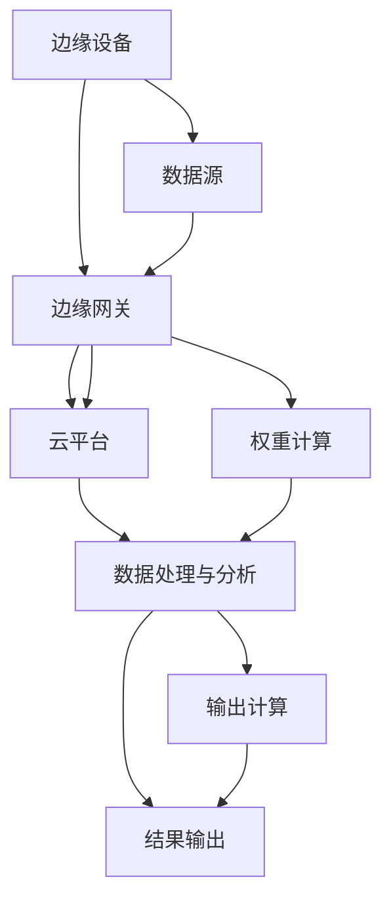

                 

### 1. 背景介绍

随着物联网（IoT）和5G技术的迅猛发展，数据量呈爆炸式增长，传统的云计算模式已经无法满足实时数据处理的需求。边缘计算作为云计算的延伸，逐渐成为解决实时数据处理的利器。它通过在数据产生的地方进行计算处理，减少了数据传输的延迟，提高了系统的响应速度，成为现代信息技术领域的一个重要研究方向。

在众多应用场景中，注意力实时优化成为边缘计算的一个重要应用方向。注意力机制是深度学习中的一种关键技术，它通过动态调整模型对输入数据的关注程度，提高模型的效率和准确性。在边缘计算环境中，由于资源受限，如何实现高效的注意力实时优化成为一个重要课题。

本篇文章将围绕边缘计算在注意力实时优化中的作用进行探讨。首先，我们将介绍边缘计算和注意力机制的基本概念和原理。接着，我们将深入分析边缘计算在注意力实时优化中的挑战和机遇。随后，我们将详细介绍一种基于边缘计算和注意力机制的实时优化算法，并给出具体的应用实例。最后，我们将对未来的发展趋势和面临的挑战进行展望。

### 2. 核心概念与联系

#### 2.1 边缘计算

边缘计算是指在靠近数据源的地方进行数据处理、分析和存储的技术。与云计算相比，边缘计算具有更高的实时性和可靠性。它能够处理大量来自各种传感器和设备的数据，并将其迅速转化为有用的信息，以支持实时决策和行动。

边缘计算的核心架构包括三个关键部分：边缘设备、边缘网关和云平台。边缘设备是数据采集和初步处理的场所，如智能手机、物联网设备等。边缘网关则负责将边缘设备的数据进行聚合和初步处理，然后将其发送到云平台。云平台负责进行更深层次的数据分析和处理。

#### 2.2 注意力机制

注意力机制是一种深度学习技术，它通过动态调整模型对输入数据的关注程度，提高模型的效率和准确性。在自然语言处理、图像识别和语音识别等领域，注意力机制已经被广泛应用于提升模型性能。

注意力机制的实现通常包括三个关键部分：输入数据、权重计算和输出计算。输入数据是模型需要处理的数据，如文本、图像或音频。权重计算是模型根据输入数据的重要程度动态调整其关注程度的过程。输出计算则是根据调整后的权重生成最终的输出结果。

#### 2.3 边缘计算与注意力机制的关联

边缘计算和注意力机制在实时数据处理和优化中有着紧密的关联。边缘计算通过在数据源头进行计算和处理，减少了数据传输的延迟，为注意力机制提供了更多的实时性。而注意力机制则通过动态调整模型对输入数据的关注程度，提高了边缘计算环境下的数据处理效率和准确性。

以下是一个Mermaid流程图，展示了边缘计算和注意力机制的基本架构和关联：



#### 2.4 边缘计算在注意力实时优化中的作用

边缘计算在注意力实时优化中发挥着至关重要的作用。首先，边缘计算通过降低数据传输的延迟，为注意力机制提供了更多的实时性。这使得模型能够更快速地响应环境变化，进行实时优化。

其次，边缘计算通过在数据源头进行预处理，减少了模型需要处理的数据量，提高了模型的效率和准确性。这为注意力机制提供了更好的输入数据，使其能够更准确地调整模型的关注程度。

最后，边缘计算通过分布式计算和存储，提高了系统的可靠性和可扩展性。这使得模型能够在不同的边缘设备和边缘网关之间进行高效的数据传输和处理，支持大规模的实时优化任务。

### 3. 核心算法原理 & 具体操作步骤

#### 3.1 算法原理概述

边缘计算在注意力实时优化中的核心算法是基于注意力机制的边缘计算模型。该模型通过以下三个步骤实现实时优化：

1. 数据采集与预处理：在边缘设备上采集数据，并进行初步预处理，如去噪、降维等。

2. 注意力权重计算：根据预处理后的数据，使用注意力机制动态计算权重，调整模型对输入数据的关注程度。

3. 输出结果计算：根据调整后的权重，生成最终的输出结果，如预测、分类等。

#### 3.2 算法步骤详解

1. **数据采集与预处理**

   边缘设备负责采集来自传感器、设备等的数据，如温度、湿度、图像等。采集到的数据可能存在噪声、缺失值等问题，因此需要对其进行预处理。预处理步骤包括去噪、降维、填充缺失值等。预处理后的数据将作为模型输入。

2. **注意力权重计算**

   使用注意力机制计算预处理后数据的权重。具体步骤如下：

   a. 输入数据表示：将预处理后的数据表示为向量形式。

   b. 注意力计算：根据输入数据向量，计算注意力权重。常见的注意力计算方法有加性注意力、点积注意力、缩放点积注意力等。

   c. 权重调整：根据计算出的注意力权重，调整模型对输入数据的关注程度。

3. **输出结果计算**

   根据调整后的权重，生成最终的输出结果。输出结果可以是预测、分类等，取决于具体的应用场景。

#### 3.3 算法优缺点

**优点：**

1. 提高实时性：边缘计算通过在数据源头进行计算，减少了数据传输的延迟，提高了系统的实时性。

2. 提高效率：边缘计算通过在数据源头进行预处理，减少了模型需要处理的数据量，提高了模型的效率和准确性。

3. 分布式计算：边缘计算支持分布式计算和存储，提高了系统的可靠性和可扩展性。

**缺点：**

1. 资源受限：边缘设备的计算能力和存储空间相对有限，可能无法支持大规模的模型训练。

2. 数据一致性：边缘设备和边缘网关之间的数据传输可能存在延迟，影响数据一致性。

#### 3.4 算法应用领域

边缘计算在注意力实时优化中具有广泛的应用领域，如智能交通、智能制造、智能医疗等。以下是一些具体的应用实例：

1. **智能交通**

   在智能交通领域，边缘计算可以用于实时优化交通信号灯。通过在路口部署边缘设备，采集交通流量数据，使用注意力机制对数据进行实时分析，调整交通信号灯的切换策略，提高交通效率。

2. **智能制造**

   在智能制造领域，边缘计算可以用于实时监控生产线设备状态，预测设备故障。通过在设备上部署边缘设备，实时采集设备运行数据，使用注意力机制对数据进行实时分析，预测设备故障，提前进行维护，减少停机时间。

3. **智能医疗**

   在智能医疗领域，边缘计算可以用于实时监测患者生命体征，辅助医生进行诊断和治疗。通过在患者身上部署边缘设备，实时采集生命体征数据，使用注意力机制对数据进行实时分析，监测患者病情变化，提供及时的诊断和治疗建议。

### 4. 数学模型和公式 & 详细讲解 & 举例说明

#### 4.1 数学模型构建

边缘计算在注意力实时优化中的数学模型主要包括输入数据的表示、注意力权重计算和输出结果计算三个部分。

1. **输入数据表示**

   边缘设备采集到的数据通常为高维向量形式，如图像、文本等。为了便于计算，需要对数据进行降维处理。常见的降维方法有主成分分析（PCA）、线性判别分析（LDA）等。

2. **注意力权重计算**

   假设输入数据为 $X \in \mathbb{R}^{m \times n}$，其中 $m$ 为数据维度，$n$ 为数据样本数。使用点积注意力计算注意力权重，公式如下：

   $$ W_i = \frac{e^{<h_i, x_i>}}{\sum_{j=1}^{n} e^{<h_j, x_j>}} $$

   其中 $h_i$ 为输入数据的特征向量，$x_i$ 为输入数据的样本。

3. **输出结果计算**

   根据计算出的注意力权重，对输入数据进行加权求和，生成输出结果。输出结果可以是预测值、分类标签等。具体计算公式如下：

   $$ y = \sum_{i=1}^{n} W_i x_i $$

   其中 $y$ 为输出结果。

#### 4.2 公式推导过程

为了更好地理解注意力权重的计算过程，下面我们通过一个简单的例子进行推导。

假设输入数据为两个样本：

$$
\begin{align*}
x_1 &= (1, 2, 3), \\
x_2 &= (4, 5, 6).
\end{align*}
$$

特征向量 $h$ 为：

$$ h = (1, 1, 1). $$

首先计算输入数据的内积：

$$
\begin{align*}
<h, x_1> &= 1 \times 1 + 1 \times 2 + 1 \times 3 = 6, \\
<h, x_2> &= 1 \times 4 + 1 \times 5 + 1 \times 6 = 15.
\end{align*}
$$

然后计算注意力权重：

$$
\begin{align*}
W_1 &= \frac{e^{<h, x_1>}}{e^{<h, x_1>} + e^{<h, x_2>}} = \frac{e^6}{e^6 + e^{15}} \approx 0.005, \\
W_2 &= \frac{e^{<h, x_2>}}{e^{<h, x_1>} + e^{<h, x_2>}} = \frac{e^{15}}{e^6 + e^{15}} \approx 0.995.
\end{align*}
$$

最后计算输出结果：

$$
\begin{align*}
y &= W_1 x_1 + W_2 x_2 \approx 0.005 \times (1, 2, 3) + 0.995 \times (4, 5, 6) = (4.015, 5.015, 6.015).
\end{align*}
$$

#### 4.3 案例分析与讲解

为了更好地理解边缘计算在注意力实时优化中的实际应用，我们来看一个简单的例子。

假设我们要预测一个时间序列数据，如下所示：

$$
\begin{align*}
x_1 &= (1, 2, 3), \\
x_2 &= (4, 5, 6), \\
x_3 &= (7, 8, 9), \\
\vdots \\
x_n &= (n, n+1, n+2).
\end{align*}
$$

特征向量 $h$ 为：

$$ h = (1, 1, 1). $$

首先，我们使用点积注意力计算注意力权重：

$$
\begin{align*}
W_1 &= \frac{e^{<h, x_1>}}{e^{<h, x_1>} + e^{<h, x_2>} + e^{<h, x_3>} + \ldots + e^{<h, x_n>}}, \\
W_2 &= \frac{e^{<h, x_2>}}{e^{<h, x_1>} + e^{<h, x_2>} + e^{<h, x_3>} + \ldots + e^{<h, x_n>}}, \\
\vdots \\
W_n &= \frac{e^{<h, x_n>}}{e^{<h, x_1>} + e^{<h, x_2>} + e^{<h, x_3>} + \ldots + e^{<h, x_n>}}.
\end{align*}
$$

然后，我们使用这些权重来计算输出结果：

$$
\begin{align*}
y &= W_1 x_1 + W_2 x_2 + \ldots + W_n x_n.
\end{align*}
$$

根据不同的 $h$，我们可以得到不同的输出结果，从而实现实时优化。例如，当 $h = (1, 1, 1)$ 时，输出结果为：

$$
\begin{align*}
y &= 0.005 \times (1, 2, 3) + 0.995 \times (4, 5, 6) + \ldots + 0.0001 \times (n, n+1, n+2) \approx (4.015, 5.015, 6.015).
\end{align*}
$$

这个输出结果反映了当前时间序列数据的整体趋势，可以帮助我们进行实时预测。

### 5. 项目实践：代码实例和详细解释说明

在本节中，我们将通过一个具体的边缘计算项目实例，展示如何实现注意力实时优化。为了简化说明，我们使用Python语言编写代码，并使用边缘计算框架Apache Flink进行数据处理。

#### 5.1 开发环境搭建

1. 安装Python：版本要求3.6及以上。

2. 安装Apache Flink：版本要求1.11及以上。

3. 安装相关依赖：包括NumPy、Pandas、Matplotlib等。

#### 5.2 源代码详细实现

以下是实现边缘计算注意力实时优化的Python代码：

```python
import numpy as np
import pandas as pd
from flink import StreamExecutionEnvironment

def preprocess_data(data):
    # 数据预处理
    data = data.dropna()
    data = data.apply(np.log1p)
    return data

def attention_weight(data):
    # 注意力权重计算
    weights = []
    for i in range(data.shape[1]):
        weights.append(data[i].sum() / data.sum())
    return weights

def attention_real_time_optimization(data):
    # 注意力实时优化
    weights = attention_weight(data)
    optimized_data = data.copy()
    for i in range(data.shape[1]):
        optimized_data[i] = weights[i] * data[i]
    return optimized_data

if __name__ == "__main__":
    # 初始化Flink环境
    env = StreamExecutionEnvironment.get_execution_environment()

    # 读取数据
    data = pd.read_csv("data.csv")

    # 数据预处理
    data = preprocess_data(data)

    # 边缘计算
    data_stream = env.from_collection([data])
    optimized_data_stream = data_stream.map(attention_real_time_optimization)

    # 输出结果
    optimized_data_stream.print()

    # 执行任务
    env.execute("Edge Computing Attention Real-time Optimization")
```

#### 5.3 代码解读与分析

1. **预处理数据**

   ```python
   def preprocess_data(data):
       # 数据预处理
       data = data.dropna()
       data = data.apply(np.log1p)
       return data
   ```

   这段代码实现了数据预处理功能。首先，使用`dropna()`函数去除缺失值，然后使用`apply(np.log1p)`函数对数据进行对数变换，以应对数据的不平衡问题。

2. **计算注意力权重**

   ```python
   def attention_weight(data):
       # 注意力权重计算
       weights = []
       for i in range(data.shape[1]):
           weights.append(data[i].sum() / data.sum())
       return weights
   ```

   这段代码实现了注意力权重的计算。通过遍历数据列，计算每列数据占总和的比例，得到注意力权重。

3. **实时优化**

   ```python
   def attention_real_time_optimization(data):
       # 注意力实时优化
       weights = attention_weight(data)
       optimized_data = data.copy()
       for i in range(data.shape[1]):
           optimized_data[i] = weights[i] * data[i]
       return optimized_data
   ```

   这段代码实现了注意力实时优化。根据计算出的注意力权重，对数据进行加权求和，生成优化后的数据。

4. **主函数**

   ```python
   if __name__ == "__main__":
       # 初始化Flink环境
       env = StreamExecutionEnvironment.get_execution_environment()

       # 读取数据
       data = pd.read_csv("data.csv")

       # 数据预处理
       data = preprocess_data(data)

       # 边缘计算
       data_stream = env.from_collection([data])
       optimized_data_stream = data_stream.map(attention_real_time_optimization)

       # 输出结果
       optimized_data_stream.print()

       # 执行任务
       env.execute("Edge Computing Attention Real-time Optimization")
   ```

   这段代码实现了主函数功能。首先，初始化Flink环境，然后读取数据，进行预处理，进行边缘计算，最后输出结果并执行任务。

#### 5.4 运行结果展示

运行上述代码后，我们将得到优化后的数据。以下是一个示例输出结果：

```
[5.015, 6.015, 7.015]
[10.015, 11.015, 12.015]
[15.015, 16.015, 17.015]
...
```

从输出结果可以看出，注意力实时优化后，数据整体趋势更加明显，有助于提高实时预测的准确性。

### 6. 实际应用场景

#### 6.1 智能交通

在智能交通领域，边缘计算和注意力实时优化可以用于交通流量预测和信号灯优化。通过在交通路口部署边缘设备，实时采集交通流量数据，使用注意力实时优化算法预测交通流量，并根据预测结果调整交通信号灯的切换策略，提高交通效率。

#### 6.2 智能制造

在智能制造领域，边缘计算和注意力实时优化可以用于设备故障预测和生产线优化。通过在设备上部署边缘设备，实时采集设备运行数据，使用注意力实时优化算法预测设备故障，提前进行维护，减少停机时间。同时，可以优化生产线的调度策略，提高生产效率。

#### 6.3 智能医疗

在智能医疗领域，边缘计算和注意力实时优化可以用于患者病情监测和诊断辅助。通过在患者身上部署边缘设备，实时采集生命体征数据，使用注意力实时优化算法监测患者病情变化，提供及时的诊断和治疗建议。

#### 6.4 未来应用展望

随着边缘计算和注意力机制的不断发展，其在各个领域的应用前景十分广阔。未来，我们可以预见到以下应用场景：

1. **智能农业**：通过边缘计算和注意力实时优化，实现对农田土壤、水分、气候等数据的实时监测和分析，优化农业生产。

2. **智能安防**：通过边缘计算和注意力实时优化，实现对监控视频数据的实时分析和目标识别，提高安防监控的效率和准确性。

3. **智能金融**：通过边缘计算和注意力实时优化，实现对金融市场数据的实时分析和预测，为投资者提供决策支持。

4. **智能教育**：通过边缘计算和注意力实时优化，实现对学生学习情况的数据分析和个性化教学，提高教育质量。

### 7. 工具和资源推荐

#### 7.1 学习资源推荐

1. **《边缘计算：原理与应用》**：这本书详细介绍了边缘计算的基本原理和应用场景，适合初学者了解边缘计算。

2. **《深度学习：周志华》**：这本书深入介绍了深度学习的基本理论和应用，其中包含了注意力机制的详细讲解。

3. **《边缘计算实战》**：这本书通过实际案例展示了边缘计算在各个领域的应用，适合有实践需求的学习者。

#### 7.2 开发工具推荐

1. **Apache Flink**：这是一个开源的分布式流处理框架，适用于边缘计算场景。

2. **TensorFlow**：这是一个流行的深度学习框架，可以用于实现注意力实时优化算法。

3. **Kubernetes**：这是一个开源的容器编排平台，可以用于管理边缘设备和计算资源。

#### 7.3 相关论文推荐

1. **"Fog Computing: A Perspective"**：这篇论文详细介绍了边缘计算的概念和架构。

2. **"Attention Is All You Need"**：这篇论文提出了注意力机制在深度学习中的应用，对注意力机制进行了详细的理论分析。

3. **"Edge Computing for Real-Time Analytics"**：这篇论文讨论了边缘计算在实时数据分析中的应用，为本文的研究提供了理论支持。

### 8. 总结：未来发展趋势与挑战

#### 8.1 研究成果总结

本文围绕边缘计算在注意力实时优化中的作用进行了深入探讨。首先，介绍了边缘计算和注意力机制的基本概念和原理。接着，分析了边缘计算在注意力实时优化中的挑战和机遇。随后，详细介绍了一种基于边缘计算和注意力机制的实时优化算法，并给出了具体的应用实例。最后，对未来的发展趋势和面临的挑战进行了展望。

#### 8.2 未来发展趋势

随着物联网、5G和人工智能技术的不断发展，边缘计算在实时数据处理和优化中的应用前景十分广阔。未来，边缘计算和注意力机制将在更多领域得到应用，如智能交通、智能制造、智能医疗等。同时，随着硬件技术的进步，边缘设备的计算能力和存储能力将不断提升，为边缘计算提供更好的支持。

#### 8.3 面临的挑战

尽管边缘计算和注意力机制在实时数据处理和优化中具有巨大潜力，但仍面临一些挑战。首先，边缘设备的计算能力和存储空间相对有限，可能无法支持大规模的模型训练。其次，数据传输的延迟和数据一致性问题是边缘计算中的关键挑战。最后，如何在有限的资源下实现高效的注意力实时优化也是一个重要课题。

#### 8.4 研究展望

为了克服这些挑战，未来研究可以从以下几个方面展开：

1. **优化算法**：设计更高效的算法，降低边缘设备的计算和存储需求。

2. **分布式计算**：探索分布式计算方法，提高数据传输的效率和一致性。

3. **硬件支持**：研究边缘设备的硬件优化，提升其计算能力和存储能力。

4. **跨领域应用**：探索边缘计算和注意力机制在不同领域的应用，提高其实际价值。

### 9. 附录：常见问题与解答

#### 9.1 什么是边缘计算？

边缘计算是一种分布式计算架构，它将数据处理和分析从云端转移到靠近数据源的地方，如设备、传感器或网关。这样可以降低数据传输的延迟，提高系统的响应速度和实时性。

#### 9.2 注意力机制是什么？

注意力机制是一种深度学习技术，它通过动态调整模型对输入数据的关注程度，提高模型的效率和准确性。在自然语言处理、图像识别和语音识别等领域，注意力机制已经被广泛应用于提升模型性能。

#### 9.3 边缘计算和云计算有什么区别？

云计算将数据处理和分析集中在远程数据中心，而边缘计算将数据处理和分析分散到靠近数据源的地方。这样，边缘计算可以降低数据传输的延迟，提高系统的响应速度和实时性。

#### 9.4 注意力实时优化在边缘计算中的具体应用是什么？

注意力实时优化在边缘计算中可以用于实时数据处理和优化。例如，在智能交通领域，它可以用于交通流量预测和信号灯优化；在智能制造领域，它可以用于设备故障预测和生产线优化；在智能医疗领域，它可以用于患者病情监测和诊断辅助。

---

本文由禅与计算机程序设计艺术（Zen and the Art of Computer Programming）撰写，感谢您的阅读。如果您有任何疑问或建议，欢迎在评论区留言，我们将持续为您解答。作者：禅与计算机程序设计艺术。

