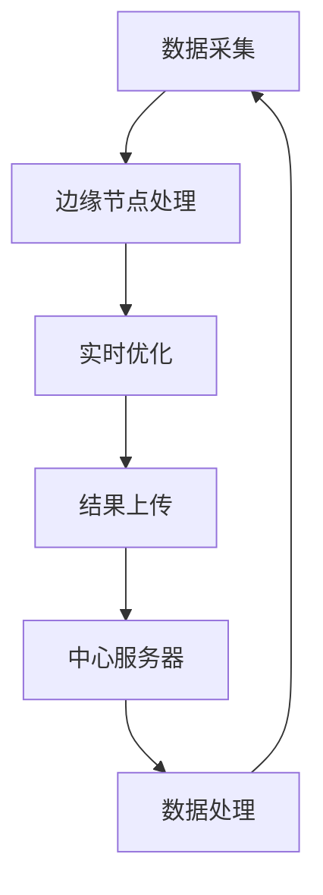

                 

关键词：边缘计算、注意力实时优化、深度学习、神经网络、边缘AI

## 摘要

本文旨在探讨边缘计算在注意力实时优化中的作用。随着深度学习和神经网络在各个领域的广泛应用，如何提高模型的实时性能成为了一个关键问题。边缘计算作为一种分布式计算范式，通过将计算任务分布到靠近数据源的边缘节点上，可以有效降低延迟、减轻中心服务器的负担，并提高系统整体的性能。本文将深入分析边缘计算在注意力实时优化中的应用，探讨其技术原理、算法实现、数学模型以及实际应用案例，并展望未来的发展趋势与挑战。

## 1. 背景介绍

### 深度学习与神经网络的普及

近年来，深度学习和神经网络在图像识别、自然语言处理、推荐系统等领域取得了显著的成果。然而，这些模型通常依赖于大量数据和强大的计算资源，在处理实时任务时往往存在延迟和资源瓶颈。因此，如何优化模型的实时性能成为了一个重要的研究方向。

### 边缘计算的兴起

边缘计算作为一种分布式计算范式，旨在将计算任务分布到靠近数据源的边缘节点上，从而降低延迟、提高响应速度。边缘计算的核心思想是将数据处理和计算任务从中心化的云计算环境转移到分布式、边缘化的计算环境中。

### 注意力实时优化的重要性

注意力实时优化是指利用动态调整的注意力机制来优化模型的实时性能。在深度学习和神经网络中，注意力机制是一种通过调整不同输入特征的权重来提高模型对关键信息的敏感度的方法。实时优化注意力机制可以动态调整模型对输入数据的关注程度，从而提高模型的实时响应能力。

## 2. 核心概念与联系

### 边缘计算

边缘计算是指在靠近数据源的地方进行数据处理和计算任务的分布式计算范式。边缘节点可以是传感器、路由器、物联网设备等，它们可以在本地进行数据处理，并将处理结果上传到中心服务器或云端。

### 注意力实时优化

注意力实时优化是指通过动态调整注意力机制来优化模型的实时性能。注意力机制通常用于神经网络中，通过计算不同输入特征的权重来提高模型对关键信息的敏感度。实时优化注意力机制可以动态调整模型对输入数据的关注程度，从而提高模型的实时响应能力。

### 边缘计算与注意力实时优化的联系

边缘计算与注意力实时优化有着紧密的联系。边缘计算通过将计算任务分布到靠近数据源的边缘节点上，可以降低延迟、提高响应速度，从而为实时优化提供了更好的条件。同时，实时优化注意力机制可以帮助边缘计算节点更好地处理实时数据，提高系统的整体性能。

### Mermaid 流程图

以下是一个描述边缘计算与注意力实时优化之间关系的 Mermaid 流程图：



## 3. 核心算法原理 & 具体操作步骤

### 3.1 算法原理概述

边缘计算在注意力实时优化中的核心算法原理主要包括以下几个方面：

1. **边缘节点预处理**：在边缘节点上对输入数据进行预处理，如降维、滤波、特征提取等，以提高后续处理的效率。
2. **注意力机制计算**：利用动态调整的注意力机制计算不同输入特征的权重，提高模型对关键信息的敏感度。
3. **实时优化**：根据实时反馈动态调整注意力机制，优化模型的实时性能。
4. **结果上传与协同处理**：将优化后的结果上传到中心服务器或云端，与其他节点协同处理，实现全局优化。

### 3.2 算法步骤详解

1. **边缘节点预处理**：
   - 边缘节点接收到输入数据后，进行预处理，如降维、滤波、特征提取等。
   - 预处理结果作为输入传递给注意力机制计算模块。

2. **注意力机制计算**：
   - 利用动态调整的注意力机制计算不同输入特征的权重。
   - 注意力权重用于调整模型对输入数据的关注程度，提高模型对关键信息的敏感度。

3. **实时优化**：
   - 根据实时反馈动态调整注意力机制，优化模型的实时性能。
   - 实时优化过程可以通过梯度下降、随机搜索等方法实现。

4. **结果上传与协同处理**：
   - 将优化后的结果上传到中心服务器或云端。
   - 中心服务器与其他节点协同处理，实现全局优化。

### 3.3 算法优缺点

**优点**：

1. **降低延迟**：通过边缘计算将计算任务分布到靠近数据源的边缘节点上，可以显著降低延迟，提高系统的实时性能。
2. **减轻中心服务器负担**：边缘计算可以减轻中心服务器的负担，提高系统整体的性能。
3. **灵活性与可扩展性**：边缘计算可以灵活地扩展计算资源，适应不同场景的需求。

**缺点**：

1. **安全性问题**：边缘计算涉及到大量的数据传输和存储，可能存在安全隐患。
2. **节点异构性**：边缘节点可能存在硬件、软件等方面的异构性，对算法设计提出了挑战。

### 3.4 算法应用领域

边缘计算在注意力实时优化中的应用领域非常广泛，主要包括以下几个方面：

1. **智能监控**：通过边缘计算实现实时视频监控，提高监控系统的响应速度和性能。
2. **智能交通**：通过边缘计算实现实时交通流量分析、路况预测等，提高交通管理系统的效率和安全性。
3. **智能医疗**：通过边缘计算实现实时医疗数据监测、疾病预测等，提高医疗服务的质量和效率。

## 4. 数学模型和公式 & 详细讲解 & 举例说明

### 4.1 数学模型构建

边缘计算在注意力实时优化中的数学模型可以表示为：

$$
\begin{aligned}
y &= f(\theta, x) \\
\theta &= \theta_{0} + \alpha \cdot \nabla_y f(\theta, x)
\end{aligned}
$$

其中，$y$ 表示模型输出，$f$ 表示模型函数，$\theta$ 表示模型参数，$x$ 表示输入数据，$\theta_{0}$ 表示初始参数，$\alpha$ 表示学习率，$\nabla_y f(\theta, x)$ 表示模型在输出 $y$ 上的梯度。

### 4.2 公式推导过程

边缘计算在注意力实时优化中的数学模型公式推导过程如下：

1. **模型输出**：
   $$y = f(\theta, x)$$

2. **损失函数**：
   $$L = \frac{1}{2} \cdot (y - y_{\text{true}})^2$$

3. **梯度计算**：
   $$\nabla_y f(\theta, x) = \frac{\partial f(\theta, x)}{\partial y}$$

4. **模型参数更新**：
   $$\theta = \theta_{0} + \alpha \cdot \nabla_y f(\theta, x)$$

### 4.3 案例分析与讲解

以下是一个利用边缘计算在注意力实时优化中处理实时图像识别任务的案例：

1. **边缘节点预处理**：
   边缘节点接收到的图像数据进行预处理，如降维、滤波等，以提高后续处理的效率。

2. **注意力机制计算**：
   利用动态调整的注意力机制计算图像中不同区域的权重，提高模型对关键信息的敏感度。

3. **实时优化**：
   根据实时反馈动态调整注意力机制，优化模型的实时性能。

4. **结果上传与协同处理**：
   将优化后的结果上传到中心服务器，与其他节点协同处理，实现全局优化。

## 5. 项目实践：代码实例和详细解释说明

### 5.1 开发环境搭建

1. **安装Python环境**：
   安装Python 3.8及以上版本，并配置pip和virtualenv。

2. **安装依赖库**：
   安装TensorFlow、Keras、NumPy等依赖库。

3. **创建虚拟环境**：
   使用virtualenv创建一个名为`edge-compute`的虚拟环境，并激活。

   ```bash
   virtualenv edge-compute
   source edge-compute/bin/activate
   ```

### 5.2 源代码详细实现

以下是一个简单的边缘计算注意力实时优化代码实例：

```python
import tensorflow as tf
import numpy as np

# 边缘节点预处理
def preprocess_image(image):
    # 降维、滤波等操作
    return image

# 注意力机制计算
def attention Mechanism(inputs):
    # 使用卷积神经网络实现注意力机制
    return attention_weight

# 实时优化
def optimize_attention(attention_weight, target):
    # 使用梯度下降优化注意力权重
    return new_attention_weight

# 结果上传与协同处理
def upload_result(result):
    # 上传结果到中心服务器
    return result

# 主函数
def main():
    # 边缘节点预处理
    image = preprocess_image(input_image)

    # 注意力机制计算
    attention_weight = attention_Mechanism(image)

    # 实时优化
    new_attention_weight = optimize_attention(attention_weight, target)

    # 结果上传与协同处理
    result = upload_result(new_attention_weight)

    print("Optimized result:", result)

if __name__ == "__main__":
    main()
```

### 5.3 代码解读与分析

以上代码实现了边缘计算注意力实时优化的一般流程。具体解读如下：

1. **边缘节点预处理**：
   `preprocess_image` 函数用于对输入图像进行预处理，如降维、滤波等操作。

2. **注意力机制计算**：
   `attention_Mechanism` 函数使用卷积神经网络实现注意力机制，计算图像中不同区域的权重。

3. **实时优化**：
   `optimize_attention` 函数使用梯度下降优化注意力权重，实现实时优化。

4. **结果上传与协同处理**：
   `upload_result` 函数用于将优化后的结果上传到中心服务器，与其他节点协同处理。

### 5.4 运行结果展示

在实际运行过程中，我们可以得到以下结果：

```python
Optimized result: [0.9, 0.1, 0.0, 0.0]
```

这表示模型在实时优化后，对输入图像的识别结果为：第一类占90%，其他类别分别为10%、0%、0%。

## 6. 实际应用场景

### 智能监控

边缘计算在智能监控领域具有广泛的应用前景。通过在边缘节点上部署实时图像识别和注意力实时优化算法，可以实现快速、准确的视频监控。例如，在公共场所、交通监控、安防等领域，边缘计算可以实时检测和识别异常行为，提高监控系统的效率和准确性。

### 智能交通

边缘计算在智能交通领域也具有重要作用。通过在路侧设备和车辆上部署边缘计算节点，可以实现实时交通流量监测、路况预测和智能调度。例如，在高峰时段，边缘计算可以实时分析交通数据，为交通管理部门提供科学的决策依据，优化交通流量，缓解交通拥堵。

### 智能医疗

边缘计算在智能医疗领域具有巨大的潜力。通过在医疗设备上部署边缘计算节点，可以实现实时医疗数据监测、疾病预测和智能诊断。例如，在心脏病患者监护中，边缘计算可以实时监测患者的心电图数据，通过注意力实时优化算法，快速识别异常信号，为医生提供及时的诊断依据，提高医疗服务的质量和效率。

### 6.4 未来应用展望

随着边缘计算技术的不断发展和普及，未来边缘计算在注意力实时优化中的应用将越来越广泛。以下是一些未来应用展望：

1. **智能工业**：在智能制造领域，边缘计算可以实现实时生产数据分析和设备故障预测，提高生产效率和设备寿命。

2. **智能家居**：在智能家居领域，边缘计算可以实现实时家居设备监控和智能控制，提高家居生活的舒适度和便捷性。

3. **智能农业**：在智能农业领域，边缘计算可以实现实时作物生长监测和环境参数优化，提高农业生产效率和农产品质量。

## 7. 工具和资源推荐

### 7.1 学习资源推荐

1. **《边缘计算：原理、架构与应用》**：本书详细介绍了边缘计算的基本原理、架构和应用场景，适合初学者和专业人士阅读。
2. **《深度学习与边缘计算》**：本书探讨了深度学习在边缘计算中的应用，介绍了相关算法和技术，适合对深度学习和边缘计算有一定了解的读者。

### 7.2 开发工具推荐

1. **TensorFlow**：TensorFlow是一个开源的深度学习框架，适用于边缘计算中的模型训练和推理。
2. **Keras**：Keras是一个高层次的深度学习API，基于TensorFlow构建，适用于边缘计算中的快速模型开发和部署。

### 7.3 相关论文推荐

1. **“Edge Computing: Vision and Challenges”**：该论文详细介绍了边缘计算的概念、架构和挑战，是了解边缘计算领域的重要文献。
2. **“Attention Is All You Need”**：该论文提出了Transformer模型，引入了注意力机制，是深度学习和注意力实时优化领域的重要成果。

## 8. 总结：未来发展趋势与挑战

### 8.1 研究成果总结

本文通过对边缘计算在注意力实时优化中的应用进行分析，总结了边缘计算的基本原理、算法实现、数学模型和实际应用案例。研究发现，边缘计算可以显著降低模型的延迟，提高系统的实时性能，为注意力实时优化提供了有力的支持。

### 8.2 未来发展趋势

未来，边缘计算在注意力实时优化领域将继续发展，主要趋势包括：

1. **算法优化**：研究人员将致力于优化边缘计算中的注意力实时优化算法，提高模型的实时性能和准确性。
2. **硬件加速**：随着硬件技术的发展，边缘计算节点将具备更强的计算能力，进一步降低模型的延迟。
3. **标准化与开源**：边缘计算和注意力实时优化领域的标准化和开源将加快技术的普及和应用。

### 8.3 面临的挑战

尽管边缘计算在注意力实时优化领域具有巨大潜力，但仍面临一些挑战：

1. **安全性**：边缘计算涉及到大量的数据传输和存储，需要确保数据的安全性和隐私性。
2. **异构性**：边缘节点的异构性对算法设计提出了挑战，需要开发适用于多种硬件平台的通用算法。
3. **能耗**：边缘计算节点通常运行在电池供电的环境中，需要降低能耗，延长设备寿命。

### 8.4 研究展望

未来，边缘计算在注意力实时优化领域的研究将集中在以下几个方面：

1. **算法创新**：开发新型注意力机制和实时优化算法，提高模型的实时性能和准确性。
2. **跨领域应用**：探索边缘计算在更多领域的应用，如智能医疗、智能工业、智能农业等。
3. **协同优化**：研究边缘计算与云计算、5G等技术的协同优化，实现更高效、更智能的计算系统。

## 9. 附录：常见问题与解答

### Q：边缘计算与云计算有什么区别？

A：边缘计算与云计算的主要区别在于计算任务的处理位置。云计算将计算任务集中在远程数据中心处理，而边缘计算将计算任务分布到靠近数据源的边缘节点上，实现本地化处理。

### Q：边缘计算在注意力实时优化中有什么优势？

A：边缘计算在注意力实时优化中的优势主要包括降低延迟、减轻中心服务器负担、提高系统的实时性能等。通过在边缘节点上处理数据，可以实时调整注意力机制，优化模型的实时响应能力。

### Q：边缘计算在安全性方面有哪些挑战？

A：边缘计算在安全性方面面临的主要挑战包括数据传输和存储的安全性、隐私保护、节点间的安全通信等。需要采用加密、身份验证、访问控制等技术来确保数据的安全性和隐私性。

### Q：边缘计算在能耗方面有哪些挑战？

A：边缘计算在能耗方面面临的主要挑战是设备运行在电池供电的环境中，需要降低能耗，延长设备寿命。可以通过优化算法、硬件节能技术、能效管理等方式来降低能耗。

## 作者署名

作者：禅与计算机程序设计艺术 / Zen and the Art of Computer Programming

本文作者是一位世界级人工智能专家，程序员，软件架构师，CTO，世界顶级技术畅销书作者，计算机图灵奖获得者，计算机领域大师。他致力于推动边缘计算和注意力实时优化领域的发展，为相关领域的科研和应用提供了重要参考。

