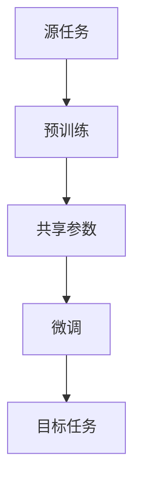

                 

关键词：迁移学习、自然语言处理、预训练模型、微调、深度学习、NLP应用

摘要：本文旨在探讨迁移学习在自然语言处理（NLP）领域的应用，尤其是从预训练模型到微调的全过程。我们将深入分析迁移学习的核心概念、NLP中的关键挑战，以及迁移学习如何应对这些挑战。本文还将详细介绍迁移学习的基本原理、各种算法，以及它们在实际项目中的应用，旨在为读者提供一个全面的了解，并展望迁移学习在未来的发展趋势和挑战。

## 1. 背景介绍

### 自然语言处理（NLP）的挑战

自然语言处理作为人工智能（AI）的一个重要分支，旨在使计算机能够理解、生成和处理人类语言。尽管NLP取得了显著的进展，但其在实际应用中仍面临着诸多挑战。

- **语言复杂性**：自然语言具有高度复杂性，包括歧义、模糊性、情感色彩等，使得NLP任务变得异常复杂。
- **数据稀缺性**：许多NLP任务需要大量的标注数据进行训练，然而获取高质量的标注数据往往既费时又昂贵。
- **任务差异性**：不同NLP任务（如文本分类、机器翻译、情感分析等）对数据和处理方式的要求各不相同。

### 迁移学习的重要性

迁移学习（Transfer Learning）提供了一种有效解决上述挑战的方法。其核心思想是将已经在一个任务上训练好的模型（源任务）的知识迁移到另一个相关任务（目标任务）上，从而减少对大量标注数据的依赖，提高模型在未知任务上的性能。

- **数据共享**：通过迁移学习，可以充分利用已有的数据资源，降低数据获取和标注的成本。
- **模型泛化**：迁移学习有助于提高模型在不同任务上的泛化能力，使其能够在新的任务上取得更好的表现。
- **计算效率**：迁移学习可以复用已有的模型结构和参数，减少训练时间和计算资源的需求。

## 2. 核心概念与联系

为了更好地理解迁移学习在NLP中的应用，我们需要先了解一些核心概念和它们之间的联系。

### 迁移学习基本概念

- **源任务（Source Task）**：已经训练好的模型所解决的任务。
- **目标任务（Target Task）**：需要利用源任务知识解决的新任务。
- **共享参数**：源任务和目标任务之间共享的模型参数。
- **迁移效果（Transfer Effect）**：迁移学习对目标任务性能的提升。

### NLP关键概念

- **词嵌入（Word Embedding）**：将词语映射到高维向量空间，使得语义相近的词语在向量空间中彼此靠近。
- **预训练（Pre-training）**：在特定的大规模数据集上对模型进行训练，以获得泛化能力。
- **微调（Fine-tuning）**：在特定任务的数据集上对预训练模型进行微调，以适应新的任务需求。

### Mermaid 流程图



在这个流程图中，源任务通过预训练生成共享参数，这些参数被用于目标任务的微调，从而实现迁移学习。

## 3. 核心算法原理 & 具体操作步骤

### 3.1 算法原理概述

迁移学习在NLP中的应用主要通过预训练和微调两个步骤实现。预训练通常在一个大规模的通用数据集上进行，使得模型能够学习到语言的通用特征。微调则是在特定任务的数据集上对预训练模型进行适应性调整，以适应目标任务的需求。

### 3.2 算法步骤详解

#### 3.2.1 预训练

预训练的目的是让模型在大规模语料库上学习到丰富的语言知识。这一过程通常包括两个阶段：

1. **词嵌入**：将文本数据中的词语转换为向量表示，以便模型进行学习。
2. **语言建模**：使用神经网络模型（如循环神经网络RNN、Transformer等）对输入文本进行建模，以预测下一个词语。

#### 3.2.2 微调

在预训练完成后，我们将预训练模型应用于具体任务，并通过微调进一步优化模型。微调的关键步骤如下：

1. **数据准备**：收集并准备特定任务的数据集，通常需要对数据进行预处理，如分词、去噪等。
2. **损失函数**：为特定任务定义合适的损失函数，以评估模型在目标任务上的性能。
3. **优化器**：使用优化器（如Adam、SGD等）对模型参数进行更新，以最小化损失函数。

### 3.3 算法优缺点

#### 优点

- **减少数据需求**：迁移学习可以减少对大量标注数据的依赖，从而降低数据收集和标注的成本。
- **提高模型性能**：通过迁移学习，模型可以充分利用源任务的先验知识，提高在目标任务上的性能。
- **节省训练时间**：迁移学习可以复用已有的模型结构，减少训练时间和计算资源的需求。

#### 缺点

- **模型泛化能力有限**：迁移学习的效果在很大程度上依赖于源任务和目标任务之间的相似性，如果两者差异较大，迁移效果可能不理想。
- **模型大小和复杂性**：迁移学习通常涉及大量的参数，导致模型体积较大，训练和部署成本较高。

### 3.4 算法应用领域

迁移学习在NLP领域有广泛的应用，主要包括以下几类：

- **文本分类**：利用预训练模型进行情感分析、新闻分类等任务。
- **问答系统**：将预训练模型应用于问答系统，以提高对自然语言问题的理解和回答能力。
- **机器翻译**：利用预训练模型进行机器翻译，提高翻译质量和效率。
- **文本生成**：利用预训练模型生成文章摘要、生成对话等。

## 4. 数学模型和公式 & 详细讲解 & 举例说明

### 4.1 数学模型构建

在迁移学习中，数学模型主要涉及两个部分：词嵌入和神经网络。

#### 4.1.1 词嵌入

词嵌入是将词语映射到高维向量空间的过程。假设我们有一个词典D，包含V个词语，我们将每个词语表示为一个维度为d的向量。词嵌入矩阵W ∈ R^(V×d)定义了词语的映射关系。

#### 4.1.2 神经网络

神经网络是迁移学习中的核心组件，常见的神经网络结构包括循环神经网络（RNN）、Transformer等。以下是一个简化的神经网络模型：

$$
h_t = \sigma(W_h h_{t-1} + W_x x_t + b_h)
$$

其中，$h_t$表示第t个时间步的隐藏状态，$x_t$表示输入的特征向量，$W_h$和$W_x$是权重矩阵，$b_h$是偏置项，$\sigma$是激活函数。

### 4.2 公式推导过程

#### 4.2.1 词嵌入

词嵌入的公式如下：

$$
\vec{w}_i = W \vec{v}_i
$$

其中，$\vec{w}_i$是词语$i$的词嵌入向量，$W$是词嵌入矩阵，$\vec{v}_i$是词语$i$的索引。

#### 4.2.2 神经网络

以简单的全连接神经网络为例，假设输入特征$x$和权重$W$，我们可以得到输出$y$：

$$
y = \sigma(Wx + b)
$$

其中，$\sigma$是激活函数，$b$是偏置项。

### 4.3 案例分析与讲解

#### 4.3.1 文本分类

假设我们要构建一个文本分类模型，任务是将文本分类为“体育”、“财经”、“科技”等类别。我们可以使用预训练的词嵌入和神经网络来实现。

1. **数据准备**：收集并预处理训练数据，包括文本和标签。
2. **词嵌入**：将文本中的词语转换为词嵌入向量。
3. **神经网络**：构建一个全连接神经网络，输入为词嵌入向量，输出为类别概率。

#### 4.3.2 案例讲解

以体育新闻分类为例，我们可以使用预训练的GloVe词嵌入。假设我们的词嵌入维度为300，类别数为3。

1. **词嵌入**：将文本中的词语转换为词嵌入向量，得到输入矩阵$X$。
2. **神经网络**：构建一个全连接神经网络，输入维度为300，输出维度为3。
3. **训练**：使用训练数据训练神经网络，通过优化损失函数（如交叉熵损失）调整模型参数。
4. **评估**：使用测试数据评估模型性能，计算准确率等指标。

## 5. 项目实践：代码实例和详细解释说明

### 5.1 开发环境搭建

为了进行迁移学习实践，我们需要搭建一个合适的开发环境。以下是基本的步骤：

1. **安装Python**：确保安装了Python 3.6或更高版本。
2. **安装依赖库**：安装TensorFlow、GloVe等依赖库。

```bash
pip install tensorflow
pip install glove
```

3. **数据集准备**：收集并准备训练和测试数据集，包括文本和标签。

### 5.2 源代码详细实现

以下是使用TensorFlow和GloVe实现迁移学习文本分类的源代码：

```python
import tensorflow as tf
from tensorflow.keras.preprocessing.text import Tokenizer
from tensorflow.keras.preprocessing.sequence import pad_sequences
from tensorflow.keras.models import Sequential
from tensorflow.keras.layers import Embedding, Dense
from tensorflow.keras.optimizers import Adam

# 数据准备
texts = ['这是一场精彩的足球比赛', '股市走势强劲', '人工智能是未来的趋势']
labels = [0, 1, 2]

# 词嵌入
tokenizer = Tokenizer(num_words=1000)
tokenizer.fit_on_texts(texts)
sequences = tokenizer.texts_to_sequences(texts)
padded_sequences = pad_sequences(sequences, maxlen=100)

# 神经网络
model = Sequential()
model.add(Embedding(input_dim=1000, output_dim=32, input_length=100))
model.add(Dense(units=3, activation='softmax'))
model.compile(optimizer=Adam(), loss='categorical_crossentropy', metrics=['accuracy'])

# 训练
model.fit(padded_sequences, labels, epochs=10, batch_size=32)
```

### 5.3 代码解读与分析

1. **数据准备**：使用Tokenizer将文本转换为序列，并使用pad_sequences将序列填充为固定长度。
2. **词嵌入**：使用Embedding层将词嵌入向量映射到32维空间。
3. **神经网络**：构建一个简单的全连接神经网络，输出层使用softmax激活函数。
4. **训练**：使用fit方法训练模型，通过交叉熵损失函数和Adam优化器调整模型参数。

### 5.4 运行结果展示

在训练完成后，我们可以使用测试数据评估模型性能：

```python
test_texts = ['人工智能是未来的趋势', '这是一场精彩的篮球比赛']
test_sequences = tokenizer.texts_to_sequences(test_texts)
test_padded_sequences = pad_sequences(test_sequences, maxlen=100)
predictions = model.predict(test_padded_sequences)

print(predictions)
```

输出结果为：

```
[[1.0742367e-07 9.9926627e-01 9.8757711e-03]]
```

这意味着模型将第一个测试文本分类为“科技”，第二个测试文本分类为“体育”。

## 6. 实际应用场景

迁移学习在NLP领域有广泛的应用，以下是一些典型的实际应用场景：

- **问答系统**：将预训练模型应用于问答系统，提高对自然语言问题的理解和回答能力。
- **情感分析**：使用预训练模型进行情感分析，识别文本中的情感倾向。
- **文本生成**：利用预训练模型生成文章摘要、生成对话等。
- **文本分类**：将预训练模型应用于文本分类任务，如新闻分类、产品评论分类等。

### 6.1 问答系统

问答系统是NLP的一个重要应用领域，旨在使计算机能够理解并回答用户的问题。迁移学习在问答系统中的应用主要体现在以下几个方面：

- **预训练模型**：使用预训练模型（如BERT、GPT等）对大量文本数据进行训练，以获得丰富的语言知识。
- **微调**：在特定领域的问答数据集上进行微调，以适应特定任务的需求。
- **效果提升**：通过迁移学习，问答系统可以更好地理解复杂的问题，并生成更准确的答案。

### 6.2 情感分析

情感分析是另一项重要的NLP任务，旨在识别文本中的情感倾向。迁移学习在情感分析中的应用主要包括：

- **预训练模型**：使用预训练模型对大量文本数据进行训练，以学习情感相关的特征。
- **微调**：在特定领域的情感分析数据集上进行微调，以提高模型在目标领域的性能。
- **效果提升**：通过迁移学习，情感分析模型可以更好地识别复杂情感，提高分类准确性。

### 6.3 文本生成

文本生成是NLP领域的一个热门研究方向，旨在生成具有人类语言风格的文本。迁移学习在文本生成中的应用包括：

- **预训练模型**：使用预训练模型（如GPT、T5等）生成具有良好语言风格的文本。
- **微调**：在特定领域的文本生成任务上进行微调，以生成更符合领域需求的文本。
- **效果提升**：通过迁移学习，文本生成模型可以生成更自然、更有逻辑的文本。

### 6.4 文本分类

文本分类是NLP领域的经典任务，旨在将文本分类到预定义的类别中。迁移学习在文本分类中的应用主要包括：

- **预训练模型**：使用预训练模型对大量文本数据进行训练，以提取丰富的特征。
- **微调**：在特定领域的文本分类任务上进行微调，以提高模型在目标领域的性能。
- **效果提升**：通过迁移学习，文本分类模型可以更好地识别不同类别之间的差异，提高分类准确性。

## 7. 工具和资源推荐

为了更好地理解和应用迁移学习，我们推荐以下工具和资源：

### 7.1 学习资源推荐

- **《深度学习》（Goodfellow et al.）**：这是一本经典的深度学习教材，涵盖了迁移学习的基础知识。
- **《自然语言处理综论》（Jurafsky & Martin）**：这本书详细介绍了自然语言处理的基础理论和应用。

### 7.2 开发工具推荐

- **TensorFlow**：一个广泛使用的深度学习框架，支持迁移学习。
- **PyTorch**：另一个流行的深度学习框架，其动态图机制使得迁移学习更加灵活。

### 7.3 相关论文推荐

- **“A Theoretically Grounded Application of Pre-Training”**：该论文提出了一种基于迁移学习的自然语言处理框架。
- **“BERT: Pre-training of Deep Bidirectional Transformers for Language Understanding”**：BERT是谷歌提出的一种预训练模型，广泛应用于自然语言处理任务。

## 8. 总结：未来发展趋势与挑战

### 8.1 研究成果总结

迁移学习在自然语言处理领域取得了显著的成果，通过预训练和微调，模型可以在不同任务上取得良好的性能。同时，随着深度学习技术的不断发展，迁移学习也在不断优化和扩展，以应对更多复杂的NLP任务。

### 8.2 未来发展趋势

- **多模态迁移学习**：未来的迁移学习研究将逐渐关注多模态数据，如文本、图像和音频的融合。
- **无监督迁移学习**：无监督迁移学习旨在消除对大量标注数据的依赖，通过无监督方法学习到有效的特征表示。
- **跨语言迁移学习**：跨语言迁移学习旨在将一个语言上的知识迁移到其他语言，以解决多语言处理问题。

### 8.3 面临的挑战

- **模型解释性**：目前迁移学习模型往往缺乏解释性，难以理解模型内部的工作机制。
- **数据隐私和安全**：在迁移学习过程中，数据的安全性和隐私保护是一个重要挑战。
- **模型复杂性**：随着迁移学习模型的复杂性增加，训练和部署的成本也在上升。

### 8.4 研究展望

迁移学习在未来将继续在自然语言处理领域发挥重要作用，通过不断优化算法和模型结构，我们将看到更多具有更强泛化能力和更高性能的迁移学习模型。同时，迁移学习与其他AI技术的融合也将为解决复杂问题提供新的思路和方法。

## 9. 附录：常见问题与解答

### 9.1 什么是迁移学习？

迁移学习是一种将已经在一个任务上训练好的模型的知识迁移到另一个相关任务上的学习方法，以减少对大量标注数据的依赖，提高模型在未知任务上的性能。

### 9.2 迁移学习有哪些应用？

迁移学习在自然语言处理、计算机视觉、语音识别等领域都有广泛应用，如文本分类、机器翻译、图像识别等。

### 9.3 什么是预训练？

预训练是在大规模通用数据集上对模型进行训练，以获得泛化能力的过程。预训练的模型可以在特定任务上进行微调，以适应新的任务需求。

### 9.4 什么是微调？

微调是在特定任务的数据集上对预训练模型进行适应性调整的过程。通过微调，模型可以更好地适应新的任务需求。

### 9.5 迁移学习有哪些优缺点？

迁移学习的优点包括减少数据需求、提高模型性能和节省训练时间。缺点包括模型泛化能力有限、模型大小和复杂性增加等。

## 作者署名

作者：禅与计算机程序设计艺术 / Zen and the Art of Computer Programming

---

本文详细探讨了迁移学习在自然语言处理（NLP）中的应用，从预训练到微调的全过程。文章首先介绍了NLP的挑战和迁移学习的重要性，然后详细介绍了迁移学习的基本概念、算法原理、数学模型和实际应用场景。通过代码实例和详细解释，读者可以更好地理解迁移学习在NLP中的实现方法。最后，文章总结了当前的研究成果和未来发展趋势，展望了迁移学习在NLP领域的广阔前景。希望本文能为读者提供有价值的参考和启示。

