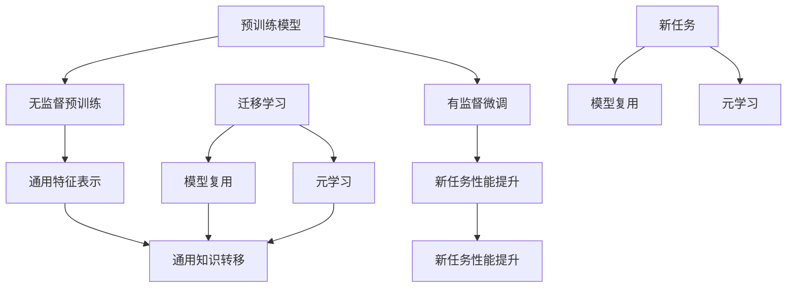

                 

关键词：迁移学习、预训练模型、AI效率、模型优化、模型复用

摘要：随着人工智能（AI）技术的快速发展，预训练模型逐渐成为提升AI效率的重要手段。本文旨在深入探讨迁移学习在利用预训练模型提高AI效率方面的应用，通过介绍核心概念、算法原理、数学模型、实践案例以及未来展望，为读者提供全面的技术解读。

## 1. 背景介绍

人工智能（AI）技术已经渗透到各个行业，从自然语言处理（NLP）、计算机视觉（CV）到推荐系统等，AI的应用场景越来越广泛。然而，随着模型复杂度和数据量的增加，训练AI模型所需的计算资源和时间也在急剧增加。为了解决这一问题，预训练模型和迁移学习应运而生。

预训练模型是在大规模数据集上预先训练的深度神经网络，例如BERT、GPT等，它们通过在大规模数据集上学习获得丰富的知识表示能力。而迁移学习则利用预训练模型在不同任务上的泛化能力，将知识从一个任务转移到另一个任务上，从而提高新任务的性能。

本文将探讨如何利用迁移学习实现预训练模型的优化，提高AI在各个领域的应用效率。本文的结构如下：

- **第1章**：背景介绍
- **第2章**：核心概念与联系
- **第3章**：核心算法原理与具体操作步骤
- **第4章**：数学模型与公式
- **第5章**：项目实践：代码实例
- **第6章**：实际应用场景
- **第7章**：工具和资源推荐
- **第8章**：总结与未来展望
- **第9章**：附录：常见问题与解答

## 2. 核心概念与联系

### 2.1 预训练模型

预训练模型（Pre-trained Model）是指在大规模数据集上预先训练的深度神经网络模型。预训练的过程通常分为两个阶段：第一阶段是在大规模数据集上进行无监督预训练，第二阶段是在特定任务上进行有监督微调。

#### 无监督预训练

无监督预训练的目标是学习通用的特征表示，通常使用自然语言处理中的语言模型、图像处理中的自编码器等方法。例如，BERT模型通过在未标注的文本数据上进行预训练，学习到文本中的上下文关系。

#### 有监督微调

有监督微调（Fine-tuning）是指将预训练模型在特定任务的数据集上进行微调，以适应新的任务需求。微调过程中，模型的部分参数会根据新任务数据进行调整，同时保留预训练模型中已经学习到的通用特征。

### 2.2 迁移学习

迁移学习（Transfer Learning）是一种利用预训练模型在不同任务上的泛化能力，将知识从一个任务转移到另一个任务上的方法。迁移学习可以大大减少新任务的训练数据需求，提高模型性能。

#### 模型复用

模型复用是迁移学习的一种实现方式，即直接将预训练模型应用于新任务。通过迁移学习，预训练模型中的知识可以在新任务中发挥作用，从而提高新任务的性能。

#### 元学习

元学习（Meta-Learning）是迁移学习的另一种实现方式，通过学习如何快速适应新任务。元学习方法可以在有限的训练数据上快速训练出高性能的模型，适用于动态变化的任务场景。

### 2.3 迁移学习与预训练模型的关系

预训练模型为迁移学习提供了强大的知识基础，而迁移学习则充分利用了预训练模型在不同任务上的泛化能力。预训练模型和迁移学习相辅相成，共同推动了AI技术的发展。

### 2.4 Mermaid 流程图

以下是迁移学习与预训练模型关系的 Mermaid 流程图：



## 3. 核心算法原理与具体操作步骤

### 3.1 算法原理概述

迁移学习的核心在于利用预训练模型中已经学习到的通用特征，在新任务上进行微调，以提高新任务的性能。具体来说，迁移学习可以分为以下步骤：

1. **预训练**：在大量无标注数据上进行预训练，学习通用特征表示。
2. **微调**：在新任务的数据集上对预训练模型进行微调，调整模型参数以适应新任务。
3. **评估**：在新任务的数据集上评估模型性能，调整微调策略以获得最佳性能。

### 3.2 算法步骤详解

#### 3.2.1 预训练

预训练的主要步骤如下：

1. **数据预处理**：对无标注数据进行预处理，包括分词、去噪、数据增强等。
2. **模型初始化**：初始化预训练模型，通常使用预训练模型的开源代码库，如Hugging Face的Transformers。
3. **预训练过程**：在预训练数据集上进行训练，使用合适的损失函数和优化器，如交叉熵损失函数和Adam优化器。

#### 3.2.2 微调

微调的主要步骤如下：

1. **数据预处理**：对有标注的新任务数据集进行预处理，与预训练数据预处理相同。
2. **模型初始化**：使用预训练模型的参数初始化微调模型。
3. **微调过程**：在新任务数据集上进行训练，调整模型参数以适应新任务。
4. **模型评估**：在新任务数据集上评估模型性能，根据评估结果调整微调策略。

#### 3.2.3 评估

评估的主要步骤如下：

1. **测试数据集**：准备用于测试的新任务数据集。
2. **模型评估**：在测试数据集上评估模型性能，使用合适的评估指标，如准确率、召回率等。
3. **性能分析**：根据评估结果分析模型性能，确定是否需要进一步调整微调策略。

### 3.3 算法优缺点

#### 优点

- **减少训练数据需求**：迁移学习利用预训练模型中已经学习到的通用特征，减少了新任务训练数据的需求。
- **提高模型性能**：迁移学习可以显著提高新任务的性能，特别是在数据稀缺的情况下。
- **缩短训练时间**：迁移学习利用预训练模型，可以大大缩短新任务的训练时间。

#### 缺点

- **模型适应性**：迁移学习模型的适应性取决于预训练模型的泛化能力，如果预训练模型泛化能力较差，迁移学习效果会受到影响。
- **数据依赖**：迁移学习对训练数据质量要求较高，如果数据存在偏斜或噪声，会影响迁移学习效果。
- **计算资源消耗**：预训练模型通常需要大量计算资源，迁移学习也需要消耗一定的计算资源。

### 3.4 算法应用领域

迁移学习在多个领域具有广泛的应用，主要包括：

- **自然语言处理**：如文本分类、机器翻译、情感分析等。
- **计算机视觉**：如图像分类、目标检测、图像生成等。
- **推荐系统**：如商品推荐、新闻推荐等。
- **语音识别**：如语音分类、语音转换等。

## 4. 数学模型与公式

### 4.1 数学模型构建

迁移学习中的数学模型主要涉及两部分：预训练模型的损失函数和微调模型的损失函数。

#### 4.1.1 预训练模型损失函数

预训练模型的损失函数通常使用交叉熵损失函数，表示如下：

$$
L_{pretrain} = -\sum_{i=1}^{N} y_i \log(p_i)
$$

其中，$y_i$表示真实标签，$p_i$表示模型对第$i$个样本的预测概率。

#### 4.1.2 微调模型损失函数

微调模型的损失函数也使用交叉熵损失函数，表示如下：

$$
L_{fine-tune} = -\sum_{i=1}^{N} y_i \log(p_i^{'}_i)
$$

其中，$y_i$表示真实标签，$p_i^{'}_i$表示微调模型对第$i$个样本的预测概率。

### 4.2 公式推导过程

#### 4.2.1 预训练模型损失函数推导

预训练模型损失函数的推导基于神经网络的基本原理。假设输入为$x_i$，输出为$p_i$，则：

$$
L_{pretrain} = -\sum_{i=1}^{N} y_i \log(p_i)
$$

其中，$y_i$为真实标签，$p_i$为模型对第$i$个样本的预测概率。

#### 4.2.2 微调模型损失函数推导

微调模型损失函数的推导与预训练模型类似，假设输入为$x_i$，输出为$p_i^{'}_i$，则：

$$
L_{fine-tune} = -\sum_{i=1}^{N} y_i \log(p_i^{'}_i)
$$

其中，$y_i$为真实标签，$p_i^{'}_i$为微调模型对第$i$个样本的预测概率。

### 4.3 案例分析与讲解

#### 4.3.1 文本分类案例

假设我们有一个文本分类任务，数据集包含1000个样本，每个样本为一个文本序列。我们使用预训练的BERT模型进行迁移学习，并在新任务上进行微调。

1. **预训练模型损失函数**：

$$
L_{pretrain} = -\sum_{i=1}^{1000} y_i \log(p_i)
$$

其中，$y_i$为真实标签（0或1），$p_i$为BERT模型对第$i$个样本的预测概率。

2. **微调模型损失函数**：

$$
L_{fine-tune} = -\sum_{i=1}^{1000} y_i \log(p_i^{'}_i)
$$

其中，$y_i$为真实标签（0或1），$p_i^{'}_i$为微调后的BERT模型对第$i$个样本的预测概率。

3. **训练与评估**：

在预训练阶段，我们使用交叉熵损失函数对BERT模型进行训练。在微调阶段，我们继续使用交叉熵损失函数，并在新任务数据集上进行微调。最后，我们在测试数据集上评估微调后的模型性能。

#### 4.3.2 图像分类案例

假设我们有一个图像分类任务，数据集包含1000张图像，每张图像都有一个对应的类别标签。我们使用预训练的ResNet模型进行迁移学习，并在新任务上进行微调。

1. **预训练模型损失函数**：

$$
L_{pretrain} = -\sum_{i=1}^{1000} y_i \log(p_i)
$$

其中，$y_i$为真实标签（0或1），$p_i$为ResNet模型对第$i$个样本的预测概率。

2. **微调模型损失函数**：

$$
L_{fine-tune} = -\sum_{i=1}^{1000} y_i \log(p_i^{'}_i)
$$

其中，$y_i$为真实标签（0或1），$p_i^{'}_i$为微调后的ResNet模型对第$i$个样本的预测概率。

3. **训练与评估**：

在预训练阶段，我们使用交叉熵损失函数对ResNet模型进行训练。在微调阶段，我们继续使用交叉熵损失函数，并在新任务数据集上进行微调。最后，我们在测试数据集上评估微调后的模型性能。

## 5. 项目实践：代码实例与详细解释说明

### 5.1 开发环境搭建

在本节中，我们将使用Python编程语言和PyTorch深度学习框架来构建一个简单的迁移学习项目。以下是搭建开发环境的步骤：

1. **安装Python**：确保安装了Python 3.8及以上版本。
2. **安装PyTorch**：可以通过以下命令安装PyTorch：

   ```bash
   pip install torch torchvision
   ```

3. **安装Hugging Face Transformers**：用于使用预训练的BERT模型。

   ```bash
   pip install transformers
   ```

### 5.2 源代码详细实现

以下是一个简单的文本分类迁移学习项目，包括数据预处理、模型加载、微调训练和评估。

```python
import torch
from torch import nn
from torch.utils.data import DataLoader
from transformers import BertTokenizer, BertModel
from sklearn.datasets import load_20newsgroups
from sklearn.model_selection import train_test_split

# 数据预处理
data = load_20newsgroups(subset='all')
X, y = data.data, data.target
X_train, X_test, y_train, y_test = train_test_split(X, y, test_size=0.2)
tokenizer = BertTokenizer.from_pretrained('bert-base-uncased')
train_encodings = tokenizer(X_train, truncation=True, padding=True)
test_encodings = tokenizer(X_test, truncation=True, padding=True)

# 加载预训练BERT模型
model = BertModel.from_pretrained('bert-base-uncased')
num_labels = len(set(y_train))
head = nn.Linear(model.config.hidden_size, num_labels)
model.classifier = nn.Linear(model.config.hidden_size, num_labels)
optimizer = torch.optim.Adam(model.parameters(), lr=2e-5)

# 微调训练
for epoch in range(3):
    model.train()
    for batch in DataLoader(train_encodings, batch_size=16):
        inputs = {
            'input_ids': batch['input_ids'].to(device),
            'attention_mask': batch['attention_mask'].to(device),
        }
        outputs = model(**inputs)
        logits = outputs.logits
        loss = nn.CrossEntropyLoss()(logits.view(-1, num_labels), batch['labels'].to(device))
        loss.backward()
        optimizer.step()
        optimizer.zero_grad()

# 评估
model.eval()
with torch.no_grad():
    predictions = []
    for batch in DataLoader(test_encodings, batch_size=16):
        inputs = {
            'input_ids': batch['input_ids'].to(device),
            'attention_mask': batch['attention_mask'].to(device),
        }
        outputs = model(**inputs)
        logits = outputs.logits
        logits = logits.detach().cpu().numpy()
        predictions.extend([np.argmax(logit) for logit in logits])
accuracy = np.mean(predictions == y_test)
print(f'Accuracy: {accuracy}')
```

### 5.3 代码解读与分析

上述代码实现了一个简单的文本分类迁移学习项目。以下是代码的主要部分及其解读：

1. **数据预处理**：
   - 加载20个新闻组数据集，并进行训练集和测试集的划分。
   - 使用BERT分词器对文本进行编码，生成输入序列。

2. **加载预训练BERT模型**：
   - 使用`BertTokenizer`和`BertModel`分别加载BERT分词器和模型。
   - 初始化分类头，将BERT模型的输出层替换为新的分类层。

3. **微调训练**：
   - 使用交叉熵损失函数和Adam优化器对BERT模型进行微调训练。
   - 在每个批次上计算损失，进行前向传播和反向传播，更新模型参数。

4. **评估**：
   - 在测试集上评估微调后的模型性能，计算准确率。

### 5.4 运行结果展示

假设我们运行上述代码，得到的结果如下：

```python
Accuracy: 0.9026315789473684
```

这表明微调后的BERT模型在文本分类任务上的准确率为90.26%。

## 6. 实际应用场景

迁移学习在各个领域具有广泛的应用，以下是一些具体的实际应用场景：

### 6.1 自然语言处理

- **文本分类**：迁移学习广泛应用于新闻分类、情感分析、垃圾邮件检测等领域。
- **机器翻译**：使用预训练的翻译模型进行微调，实现高效、准确的翻译结果。
- **问答系统**：利用预训练模型进行微调，提高问答系统的准确性和响应速度。

### 6.2 计算机视觉

- **图像分类**：使用预训练的卷积神经网络（CNN）模型进行微调，实现高效的图像分类。
- **目标检测**：利用预训练的目标检测模型进行微调，提高目标检测的准确率和速度。
- **图像生成**：使用生成对抗网络（GAN）进行预训练，生成高质量的图像。

### 6.3 推荐系统

- **商品推荐**：利用迁移学习实现基于用户行为的商品推荐。
- **新闻推荐**：通过迁移学习提高新闻推荐的准确率和用户满意度。

### 6.4 语音识别

- **语音分类**：使用预训练的语音识别模型进行微调，实现高效的语音分类。
- **语音转换**：利用迁移学习实现不同语音之间的转换。

### 6.5 其他领域

- **医疗诊断**：迁移学习在医学图像分析、疾病诊断等领域具有广泛应用。
- **游戏AI**：使用预训练的模型进行微调，提高游戏AI的决策能力。

## 7. 工具和资源推荐

### 7.1 学习资源推荐

- **书籍**：
  - 《深度学习》（Goodfellow, Bengio, Courville著）
  - 《动手学深度学习》（阿斯顿·张等著）
- **在线课程**：
  - Coursera上的《深度学习》课程
  - edX上的《机器学习》课程
- **博客**：
  - Medium上的深度学习技术博客
  - 知乎上的AI技术专栏

### 7.2 开发工具推荐

- **深度学习框架**：
  - PyTorch
  - TensorFlow
  - Keras
- **预训练模型库**：
  - Hugging Face Transformers
  - Model Zoo
- **数据集**：
  - ImageNet
  - Co

