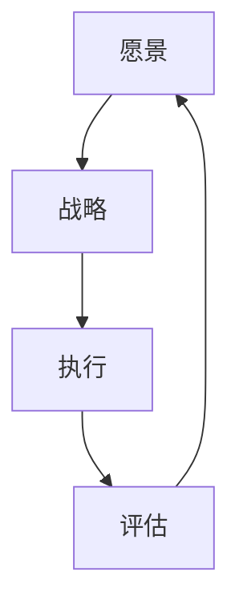

                 

关键词：远见管理，战略思维，长期规划，IT领域，项目管理

> 摘要：在快节奏和高竞争的IT行业中，远见管理成为了企业成功的关键。本文将深入探讨如何培养长期战略思维，提供实用的方法和工具，以帮助IT企业和个人在市场中保持领先地位。

## 1. 背景介绍

随着信息技术的飞速发展，IT行业正处于不断变革和演进的过程中。在这个充满不确定性的环境中，企业必须具备强大的战略思维，以便在激烈的市场竞争中脱颖而出。远见管理作为战略思维的重要组成部分，越来越受到关注。它不仅关注当前的业务运营，更注重企业未来的发展。

远见管理的关键在于能够提前预判市场趋势，制定长远的战略规划，并在执行过程中保持灵活性和适应性。这对于IT行业尤为重要，因为IT技术的变革速度极快，企业如果不能紧跟技术发展的步伐，就很难保持竞争力。

## 2. 核心概念与联系

### 2.1 远见管理的定义

远见管理是一种基于长远规划的管理理念，强调企业要从全局和未来的角度出发，进行战略决策和资源分配。它包括以下几个核心概念：

- **愿景（Vision）**：企业未来发展的长远目标。
- **战略（Strategy）**：实现愿景的具体路径和方法。
- **执行（Execution）**：将战略转化为实际行动的过程。
- **评估（Evaluation）**：对执行效果进行监测和评估。

### 2.2 远见管理架构图

为了更清晰地理解远见管理的核心概念，我们可以使用Mermaid流程图来展示其架构：



在这个架构中，愿景是远见管理的起点，它为战略的制定提供了方向；战略则是愿景的具体实现方案，包括市场定位、技术创新等；执行是将战略转化为实际行动的过程；评估则是对于执行效果的监测和反馈，以便不断优化战略。

## 3. 核心算法原理 & 具体操作步骤

### 3.1 算法原理概述

远见管理的实施需要一系列核心算法和技术支持。以下是几个关键的算法原理：

- **SWOT分析**：对企业的优势、劣势、机会和威胁进行综合评估，以确定企业的战略方向。
- **波特五力模型**：分析行业竞争环境，确定企业在市场中的竞争地位。
- **PEST分析**：评估宏观经济、政治、社会和技术环境对企业的影响。

### 3.2 算法步骤详解

#### 3.2.1 SWOT分析

1. **优势（Strengths）**：列举企业的核心竞争力，如技术创新、市场占有率等。
2. **劣势（Weaknesses）**：分析企业存在的短板，如资金短缺、人才流失等。
3. **机会（Opportunities）**：识别市场变化带来的新机遇，如新兴技术、市场细分等。
4. **威胁（Threats）**：评估外部环境对企业可能带来的负面影响，如竞争对手、政策变化等。

#### 3.2.2 波特五力模型

1. **供应商的议价能力**：分析供应商对企业的控制力，如原材料供应的稳定性。
2. **购买者的议价能力**：评估客户对企业的压力，如价格敏感度、替代品的威胁。
3. **潜在进入者的威胁**：分析新进入者对市场格局的影响，如竞争加剧、市场份额的稀释。
4. **替代品的威胁**：评估替代产品或服务对市场的影响，如消费者偏好变化。
5. **行业内的竞争**：分析现有竞争对手的竞争策略，如价格战、技术创新等。

#### 3.2.3 PEST分析

1. **政治（Political）**：分析政治环境对企业的影响，如政策法规、国际贸易关系等。
2. **经济（Economic）**：评估宏观经济环境，如GDP增长率、通货膨胀率等。
3. **社会（Social）**：分析社会文化因素，如人口结构、教育水平等。
4. **技术（Technological）**：评估技术发展趋势，如人工智能、大数据等。

### 3.3 算法优缺点

- **SWOT分析**：优点是简单易懂，能够快速识别企业的核心问题和机会；缺点是缺乏量化分析，可能忽略一些潜在因素。
- **波特五力模型**：优点是能够全面分析行业竞争环境，指导企业制定竞争策略；缺点是过于理论化，可能不适合所有行业。
- **PEST分析**：优点是能够从宏观角度分析企业面临的外部环境；缺点是可能忽视企业内部的微观因素。

### 3.4 算法应用领域

这些算法在IT领域有广泛的应用：

- **战略规划**：帮助企业制定长远的战略目标。
- **市场分析**：识别市场机会和风险，指导产品开发和市场推广。
- **项目管理**：评估项目的可行性和潜在风险，确保项目按计划执行。

## 4. 数学模型和公式 & 详细讲解 & 举例说明

### 4.1 数学模型构建

远见管理的实施涉及多个数学模型和公式。以下是几个常用的模型：

- **回归分析**：用于预测市场趋势和用户需求。
- **决策树**：用于评估不同战略的可行性和风险。
- **神经网络**：用于模拟市场变化和预测未来趋势。

### 4.2 公式推导过程

以回归分析为例，其基本公式为：

$$
y = \beta_0 + \beta_1x_1 + \beta_2x_2 + ... + \beta_nx_n + \epsilon
$$

其中，$y$ 为因变量，$x_1, x_2, ..., x_n$ 为自变量，$\beta_0, \beta_1, ..., \beta_n$ 为回归系数，$\epsilon$ 为误差项。

### 4.3 案例分析与讲解

#### 案例一：回归分析在市场需求预测中的应用

假设某企业需要预测未来三个月的产品需求量。通过收集过去一年的销售数据，使用回归分析建立预测模型。经过模型训练，得到以下公式：

$$
y = 100 + 0.5x
$$

其中，$y$ 为需求量（件），$x$ 为时间（月）。

使用该模型，可以预测未来三个月的需求量。例如，当$x=10$ 时，需求量$y=125$ 件。

#### 案例二：决策树在项目风险评估中的应用

假设某企业需要进行一个新项目的风险评估。通过构建决策树，分析不同风险因素的概率和影响，得到以下结果：

1. **风险因素A**：概率为0.3，影响为$-500,000$。
2. **风险因素B**：概率为0.4，影响为$-300,000$。
3. **风险因素C**：概率为0.3，影响为$100,000$。

通过决策树分析，可以得出该项目整体风险为$-300,000$。

## 5. 项目实践：代码实例和详细解释说明

### 5.1 开发环境搭建

为了实现远见管理算法，我们需要搭建一个合适的开发环境。以下是基本的开发环境搭建步骤：

1. 安装Python环境。
2. 安装回归分析和决策树相关的库，如scikit-learn。
3. 安装数据可视化库，如matplotlib。

### 5.2 源代码详细实现

以下是一个简单的回归分析代码实例：

```python
import numpy as np
from sklearn.linear_model import LinearRegression

# 数据准备
x = np.array([[1], [2], [3], [4], [5]])
y = np.array([2, 4, 5, 4, 5])

# 模型训练
model = LinearRegression()
model.fit(x, y)

# 预测
x_new = np.array([[6]])
y_pred = model.predict(x_new)

print("预测需求量：", y_pred)
```

### 5.3 代码解读与分析

该代码首先导入必要的库，然后准备训练数据。通过LinearRegression类创建模型，并使用fit方法进行训练。最后，使用predict方法进行预测，并输出预测结果。

### 5.4 运行结果展示

运行上述代码，可以得到预测需求量为6件的结果。这表明，在当前市场环境下，未来需求量有望继续增长。

## 6. 实际应用场景

远见管理在IT领域有广泛的应用。以下是几个实际应用场景：

1. **战略规划**：通过SWOT分析和PEST分析，为企业制定长远的发展战略。
2. **市场分析**：利用回归分析和决策树，预测市场需求和评估项目风险。
3. **项目管理**：使用决策树和神经网络，优化项目资源分配和风险评估。

## 7. 未来应用展望

随着人工智能和大数据技术的不断发展，远见管理将更加智能化和精细化。未来，企业可以借助AI算法和大数据分析，实现更加精准的市场预测和战略规划。

## 8. 工具和资源推荐

为了更好地实现远见管理，以下是一些建议的工具和资源：

1. **学习资源**：推荐阅读《智能战略管理》、《大数据战略》等书籍。
2. **开发工具**：推荐使用Python、R语言等数据分析工具。
3. **相关论文**：可以关注《计算机科学》、《管理科学》等学术期刊。

## 9. 总结：未来发展趋势与挑战

远见管理在IT领域具有广阔的应用前景。未来，随着技术的进步，远见管理将变得更加智能和高效。然而，企业也面临着数据安全、技术更新等挑战。因此，企业需要不断学习和适应，以保持竞争优势。

## 10. 附录：常见问题与解答

### 问题1：远见管理是否适用于所有企业？

答：远见管理适用于所有企业，但具体实施过程需要根据企业的实际情况进行调整。

### 问题2：如何确保远见管理的有效性？

答：确保远见管理的有效性需要从以下几个方面入手：

- **数据质量**：确保数据分析的准确性。
- **决策过程**：建立科学的决策流程。
- **执行力度**：确保战略规划得到有效执行。

### 问题3：远见管理与敏捷开发如何结合？

答：远见管理可以与敏捷开发相结合，通过持续迭代和优化，实现战略目标。

---

作者：禅与计算机程序设计艺术 / Zen and the Art of Computer Programming
```

