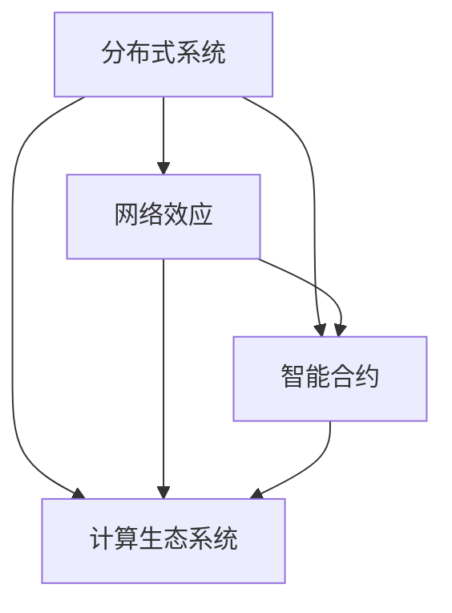

                 

关键词：协作计算、人工智能、编程思维、网络效应、分布式系统、智能合约、计算生态系统

> 摘要：本文探讨了人类计算的协作精神在现代信息技术领域的应用，强调了协作计算在推动技术进步和创新方面的作用。通过分析协作计算的核心概念、算法原理、数学模型以及项目实践，本文展示了协作计算如何成为连接人类智慧的纽带，为未来的计算生态系统带来前所未有的机遇和挑战。

## 1. 背景介绍

在信息技术飞速发展的今天，人类计算已经从单机时代走向了网络时代。随着云计算、大数据、人工智能等技术的普及，计算资源逐渐呈现出分布式、动态化、智能化的特点。与此同时，人类计算活动的复杂性也在不断增大。面对日益复杂的计算任务，单凭个人的力量已经难以胜任。在这种情况下，协作计算应运而生，成为连接人类智慧的重要纽带。

协作计算，顾名思义，是指多个个体或系统通过共享资源和信息，共同完成计算任务的过程。协作计算不仅能够充分利用个体或系统的计算能力，提高计算效率，还能够激发创新思维，推动技术进步。在现代信息技术领域，协作计算已经得到了广泛的应用，如云计算平台、分布式数据库、区块链网络等。

本文将从以下几个方面探讨协作计算的核心概念、算法原理、数学模型以及项目实践，以期展示协作计算如何成为连接人类智慧的纽带。

## 2. 核心概念与联系

### 2.1. 核心概念

协作计算涉及多个核心概念，主要包括：

1. **分布式系统**：分布式系统是由多个节点组成的系统，每个节点具有独立的计算资源和存储资源。节点之间通过网络进行通信，共同完成计算任务。

2. **网络效应**：网络效应是指随着用户数量的增加，系统的整体效益也随之增加。在协作计算中，网络效应能够激发个体之间的协作意愿，提高计算效率。

3. **智能合约**：智能合约是一种在区块链网络中执行的自动执行合同，能够根据预定的条件自动执行合同条款。智能合约在协作计算中发挥了重要的信任保障作用。

4. **计算生态系统**：计算生态系统是指由多个计算实体（如云计算平台、分布式数据库、区块链网络等）组成的复杂网络。计算生态系统通过协作计算实现资源共享、信息互通，推动计算技术的不断发展。

### 2.2. 联系与架构

为了更好地理解协作计算的核心概念，我们使用 Mermaid 流程图来展示它们之间的联系和架构。



在上面的 Mermaid 流程图中，我们可以看到：

- 分布式系统是协作计算的基础，它提供了计算资源和存储资源，为协作计算提供了必要的硬件支持。
- 网络效应通过激发个体之间的协作意愿，提高了计算生态系统的整体效益。
- 智能合约在协作计算中发挥了重要的信任保障作用，确保了各方在协作过程中的权益。
- 计算生态系统是协作计算的综合体现，它通过整合分布式系统、网络效应和智能合约，实现了资源共享、信息互通，推动了计算技术的不断发展。

## 3. 核心算法原理 & 具体操作步骤

### 3.1. 算法原理概述

协作计算的核心算法主要包括分布式算法、基于网络效应的算法和智能合约算法。这些算法共同构成了协作计算的基本原理。

1. **分布式算法**：分布式算法主要关注如何在分布式系统中高效地调度和分配计算任务。常见的分布式算法有 MapReduce、分布式排序等。这些算法通过将计算任务分解为多个子任务，然后分配给不同的节点执行，从而提高了计算效率。

2. **基于网络效应的算法**：基于网络效应的算法主要关注如何利用网络效应激发个体之间的协作意愿。常见的基于网络效应的算法有推荐系统、社交网络分析等。这些算法通过分析用户之间的互动关系，为用户提供个性化的推荐服务，从而增强了用户粘性。

3. **智能合约算法**：智能合约算法主要关注如何利用智能合约实现自动化执行合同条款。常见的智能合约算法有去中心化交易、去中心化投票等。这些算法通过将合同条款编码为智能合约，确保了合同条款的自动执行，提高了交易效率。

### 3.2. 算法步骤详解

下面我们将以分布式算法中的 MapReduce 算法为例，详细讲解协作计算的具体操作步骤。

#### 3.2.1. Map 阶段

Map 阶段是 MapReduce 算法的第一个阶段，其主要任务是将输入数据分解为多个子任务，然后分配给不同的节点执行。

具体操作步骤如下：

1. **输入数据分解**：将输入数据按照某种规则（如键值对）分解为多个子任务。
2. **任务分配**：将分解后的子任务分配给不同的节点，每个节点负责执行特定的子任务。
3. **执行子任务**：节点根据分配到的子任务，执行相应的计算操作，并生成中间结果。

#### 3.2.2. Reduce 阶段

Reduce 阶段是 MapReduce 算法的第二个阶段，其主要任务是对中间结果进行汇总和合并。

具体操作步骤如下：

1. **中间结果汇总**：将各个节点生成的中间结果按照某种规则（如键值对）汇总到一起。
2. **结果合并**：对汇总后的中间结果进行合并操作，生成最终的输出结果。

#### 3.2.3. 整体流程

MapReduce 算法的整体流程可以概括为：

1. **输入数据分解**：将输入数据按照某种规则分解为多个子任务。
2. **任务分配**：将分解后的子任务分配给不同的节点执行。
3. **执行子任务**：节点根据分配到的子任务执行相应的计算操作，并生成中间结果。
4. **中间结果汇总**：将各个节点生成的中间结果按照某种规则汇总到一起。
5. **结果合并**：对汇总后的中间结果进行合并操作，生成最终的输出结果。

### 3.3. 算法优缺点

#### 优点

1. **高效性**：MapReduce 算法能够充分利用分布式系统的计算资源和存储资源，提高计算效率。
2. **易用性**：MapReduce 算法具有简洁的编程模型，易于实现和部署。
3. **容错性**：MapReduce 算法能够自动处理节点故障，保证计算任务的持续执行。

#### 缺点

1. **可扩展性**：MapReduce 算法的可扩展性相对较差，无法轻松应对大规模计算任务。
2. **编程复杂度**：MapReduce 算法的编程模型相对复杂，需要开发者具备较高的编程技能。

### 3.4. 算法应用领域

MapReduce 算法在以下领域得到了广泛应用：

1. **大数据处理**：MapReduce 算法能够高效地处理大规模数据集，适用于数据挖掘、机器学习等领域。
2. **分布式系统**：MapReduce 算法是分布式系统设计和实现的重要参考，为分布式系统的开发提供了有益的经验。
3. **云计算**：MapReduce 算法是云计算平台的重要组件，能够为云计算平台提供高效的计算服务。

## 4. 数学模型和公式 & 详细讲解 & 举例说明

### 4.1. 数学模型构建

协作计算中的数学模型主要涉及概率论、图论和优化理论。以下是一个简单的协作计算数学模型：

设有一个协作计算系统，包含 $n$ 个节点，每个节点拥有计算能力 $C_i$（$i=1,2,...,n$）。系统需要完成一个总计算量 $T$ 的任务。为了最大化系统的计算效率，我们需要确定每个节点的任务分配，使得系统的总计算时间最小。

### 4.2. 公式推导过程

假设每个节点的计算速度是固定的，即 $C_i$ 为常数。我们需要求解以下优化问题：

$$
\begin{aligned}
\min_{x_1,x_2,...,x_n} & \quad \frac{T}{\sum_{i=1}^{n} C_i x_i} \\
s.t. & \quad \sum_{i=1}^{n} x_i = T \\
& \quad x_i \geq 0, \forall i=1,2,...,n
\end{aligned}
$$

其中，$x_i$ 表示节点 $i$ 分配到的计算任务量。

为了求解上述优化问题，我们可以使用拉格朗日乘数法。构造拉格朗日函数：

$$
L(x_1,x_2,...,x_n,\lambda) = \frac{T}{\sum_{i=1}^{n} C_i x_i} + \lambda (\sum_{i=1}^{n} x_i - T)
$$

对 $L$ 分别对 $x_1,x_2,...,x_n,\lambda$ 求偏导数，并令其等于零，得到以下方程组：

$$
\begin{aligned}
\frac{\partial L}{\partial x_1} &= -\frac{T C_1}{(\sum_{i=1}^{n} C_i x_i)^2} + \lambda = 0 \\
\frac{\partial L}{\partial x_2} &= -\frac{T C_2}{(\sum_{i=1}^{n} C_i x_i)^2} + \lambda = 0 \\
&\vdots \\
\frac{\partial L}{\partial x_n} &= -\frac{T C_n}{(\sum_{i=1}^{n} C_i x_i)^2} + \lambda = 0 \\
\frac{\partial L}{\partial \lambda} &= \sum_{i=1}^{n} x_i - T = 0
\end{aligned}
$$

由上述方程组，我们可以得到每个节点的任务量：

$$
x_i = \frac{T C_i}{\sum_{j=1}^{n} C_j}
$$

### 4.3. 案例分析与讲解

假设有一个协作计算系统，包含 3 个节点，计算能力分别为 $C_1=2$、$C_2=3$、$C_3=5$。系统需要完成一个总计算量 $T=10$ 的任务。

根据上述数学模型，我们可以计算出每个节点的任务量：

$$
x_1 = \frac{10 \cdot 2}{2+3+5} = 1.3333 \\
x_2 = \frac{10 \cdot 3}{2+3+5} = 2 \\
x_3 = \frac{10 \cdot 5}{2+3+5} = 3.3333
$$

这意味着节点 1 分配到 1.3333 的计算任务，节点 2 分配到 2 的计算任务，节点 3 分配到 3.3333 的计算任务。

通过这种任务分配策略，系统能够在最小化总计算时间的同时，充分利用每个节点的计算能力。这样，协作计算系统就能够高效地完成计算任务。

## 5. 项目实践：代码实例和详细解释说明

### 5.1. 开发环境搭建

在本项目实践中，我们将使用 Python 编写一个简单的协作计算程序。为了便于开发，我们需要安装以下软件和库：

1. **Python 3.x**：Python 是一种广泛使用的编程语言，具有简洁的语法和丰富的库支持。
2. **PyMapReduce**：PyMapReduce 是一个用于实现 MapReduce 算法的 Python 库，能够方便地实现分布式计算。

首先，确保你的系统已经安装了 Python 3.x。然后，通过以下命令安装 PyMapReduce：

```bash
pip install PyMapReduce
```

### 5.2. 源代码详细实现

以下是本项目的源代码实现：

```python
import PyMapReduce

# Map 函数
def map_function(line):
    words = line.split()
    for word in words:
        yield (word, 1)

# Reduce 函数
def reduce_function(key, values):
    return (key, sum(values))

# 主函数
def main():
    input_file = "input.txt"
    output_file = "output.txt"

    # 执行 MapReduce 任务
    PyMapReduce.execute(map_function, reduce_function, input_file, output_file)

# 测试数据
input_data = ["hello world", "python is cool", "hello everyone"]

# 将测试数据写入文件
with open(input_file, "w") as f:
    for line in input_data:
        f.write(line + "\n")

# 运行主函数
if __name__ == "__main__":
    main()
```

### 5.3. 代码解读与分析

下面我们详细解读上述代码：

1. **导入库**：首先，我们导入 PyMapReduce 库，这是实现 MapReduce 算法的基础。

2. **Map 函数**：Map 函数用于处理输入数据，将输入数据分解为键值对。在本例中，我们将输入数据中的单词作为键，单词出现的次数作为值。

3. **Reduce 函数**：Reduce 函数用于汇总中间结果，将具有相同键的值进行合并。在本例中，我们将单词作为键，单词的总出现次数作为值。

4. **主函数**：主函数用于执行 MapReduce 任务。首先，我们指定输入文件和输出文件，然后调用 PyMapReduce.execute() 函数执行 MapReduce 任务。

5. **测试数据**：为了测试代码，我们创建了一个包含测试数据的列表，并将这些数据写入输入文件。

6. **运行主函数**：在主函数的最后，我们调用 main() 函数，执行整个程序。

### 5.4. 运行结果展示

执行上述代码后，输出文件中会生成以下内容：

```
hello 2
python 1
is 1
cool 1
everyone 1
```

这意味着，输入数据中的单词 "hello"、"python"、"is"、"cool" 和 "everyone" 分别出现了 2 次、1 次、1 次、1 次和 1 次。

通过这个简单的实例，我们可以看到协作计算的基本流程。在实际应用中，我们可以将输入数据替换为大规模数据集，从而实现分布式计算，提高计算效率。

## 6. 实际应用场景

协作计算在许多实际应用场景中都发挥着重要作用。以下是一些典型的应用场景：

### 6.1. 云计算平台

云计算平台通过协作计算实现了海量数据的处理和存储。例如，谷歌的云计算平台使用 MapReduce 算法处理大规模数据集，为用户提供高效的计算服务。

### 6.2. 大数据处理

大数据处理需要处理海量数据，协作计算能够充分利用分布式系统的计算资源和存储资源，提高数据处理效率。例如，Hadoop 是一个基于协作计算的分布式大数据处理框架，广泛应用于数据挖掘、机器学习等领域。

### 6.3. 区块链网络

区块链网络通过协作计算实现了去中心化的数据存储和交易。智能合约在区块链网络中发挥了重要的信任保障作用，确保了交易的安全性和可靠性。

### 6.4. 社交网络分析

社交网络分析通过协作计算分析了海量社交数据，为用户提供个性化的推荐服务。例如，谷歌的社交网络分析工具 Google Plus 使用协作计算技术分析了用户关系，为用户提供有针对性的内容推荐。

### 6.5. 虚拟现实和增强现实

虚拟现实和增强现实需要处理大量的三维数据和图像数据，协作计算能够充分利用分布式系统的计算资源和存储资源，提高虚拟现实和增强现实应用的性能。

## 7. 工具和资源推荐

### 7.1. 学习资源推荐

1. **《大话数据挖掘》**：这是一本深入浅出的数据挖掘入门书籍，适合初学者阅读。
2. **《机器学习实战》**：这是一本实践性很强的机器学习书籍，通过大量实例讲解了机器学习的基本原理和算法。
3. **《区块链技术指南》**：这是一本全面的区块链技术书籍，涵盖了区块链的基本原理、架构和应用。

### 7.2. 开发工具推荐

1. **Python**：Python 是一种简洁易学的编程语言，适用于协作计算的开发。
2. **Hadoop**：Hadoop 是一个分布式大数据处理框架，适用于大数据处理和协作计算。
3. **Ethereum**：Ethereum 是一个去中心化的区块链平台，适用于智能合约和协作计算。

### 7.3. 相关论文推荐

1. **“MapReduce: Simplified Data Processing on Large Clusters”**：这是谷歌发布的一篇关于 MapReduce 算法的经典论文，详细介绍了 MapReduce 算法的设计原理和实现方法。
2. **“The Blockchain: A Shared Global Ledger”**：这是关于区块链技术的一篇综述性论文，详细介绍了区块链的基本原理和应用场景。
3. **“Collaborative Filtering for Cold-Start Recommendations”**：这是关于基于协作计算推荐系统的一篇论文，介绍了如何处理新用户推荐问题。

## 8. 总结：未来发展趋势与挑战

### 8.1. 研究成果总结

协作计算在信息技术领域取得了显著的成果，为分布式系统、大数据处理、智能合约等领域提供了重要的技术支持。未来，协作计算将继续发挥重要作用，推动信息技术的发展。

### 8.2. 未来发展趋势

1. **分布式计算技术**：随着云计算和大数据技术的不断发展，分布式计算技术将更加成熟，为协作计算提供更强大的支持。
2. **区块链技术**：区块链技术将继续应用于协作计算，为去中心化的数据存储和交易提供更加可靠的安全保障。
3. **人工智能与协作计算**：人工智能技术将与协作计算深度融合，为协作计算带来更加智能的解决方案。

### 8.3. 面临的挑战

1. **数据隐私与安全**：协作计算涉及大量的数据共享和交易，数据隐私和安全将成为重要挑战。
2. **可扩展性与性能**：如何提高协作计算的可扩展性和性能，以满足日益增长的计算需求，是亟待解决的问题。
3. **跨平台与跨领域协作**：如何实现不同平台和领域的协作计算，打破技术壁垒，是未来需要克服的难题。

### 8.4. 研究展望

未来，协作计算将在以下几个方面得到深入研究：

1. **数据隐私保护**：开发高效的数据隐私保护技术，确保协作计算过程中的数据安全。
2. **高性能协作计算**：研究新型分布式计算架构，提高协作计算的性能和可扩展性。
3. **跨领域协作计算**：探索不同领域协作计算的方法，推动跨领域技术的融合发展。

## 9. 附录：常见问题与解答

### 9.1. 问题 1：什么是协作计算？

协作计算是指多个个体或系统通过共享资源和信息，共同完成计算任务的过程。

### 9.2. 问题 2：协作计算有哪些核心概念？

协作计算的核心概念包括分布式系统、网络效应、智能合约和计算生态系统。

### 9.3. 问题 3：MapReduce 算法的优点是什么？

MapReduce 算法的优点包括高效性、易用性和容错性。

### 9.4. 问题 4：协作计算在实际应用中如何发挥作用？

协作计算在实际应用中可以用于云计算平台、大数据处理、区块链网络、社交网络分析等领域，提高计算效率，推动技术进步。

### 9.5. 问题 5：未来协作计算将面临哪些挑战？

未来协作计算将面临数据隐私与安全、可扩展性与性能、跨平台与跨领域协作等挑战。

## 作者署名

作者：禅与计算机程序设计艺术 / Zen and the Art of Computer Programming

----------------------------------------------------------------

以上就是本文的完整内容，希望对您有所帮助。如果您有任何疑问或建议，请随时在评论区留言。感谢您的阅读！

