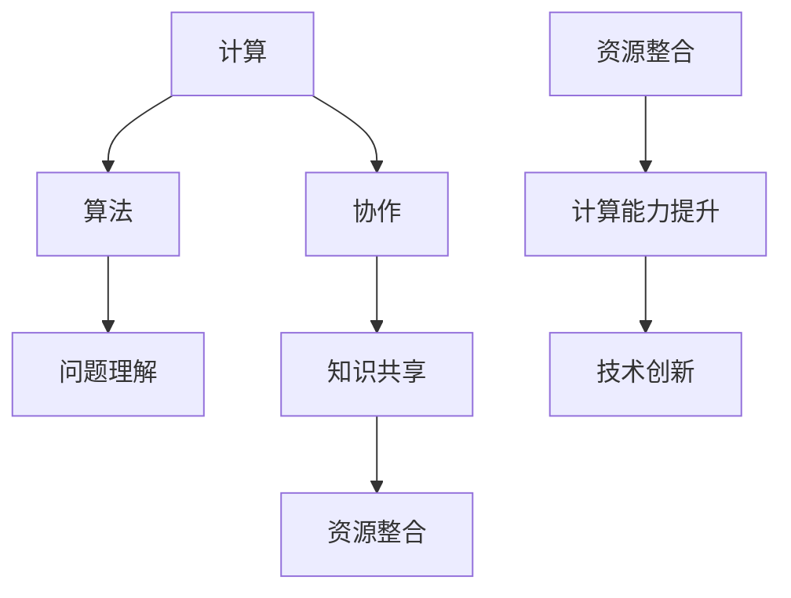

                 

在人类的技术演进历史中，计算的进步一直是推动社会发展的关键力量。从古代的计算工具，如算盘和指算法，到现代的超级计算机和人工智能，计算能力的提升不仅改变了我们的生活方式，也重新定义了人类的工作模式和社会结构。本文旨在探讨人类计算的协作精神，这一贯穿于计算历史的核心要素，如何通过连接不同的智慧和资源，推动技术的持续进步。

## 关键词

- **计算协作精神**
- **智慧连接**
- **技术创新**
- **人类计算**
- **算法发展**
- **资源共享**
- **分布式计算**

## 摘要

本文将深入分析人类计算的协作精神，探讨这一精神如何在不同的历史时期和当前时代推动计算技术的发展。文章将首先回顾计算协作精神的起源，接着分析其如何通过共享知识和资源实现计算能力的提升。随后，文章将探讨现代计算环境中的协作模式，以及这些模式如何促进人工智能的发展。最后，我们将展望未来计算协作精神的趋势和挑战。

## 1. 背景介绍

人类的历史可以说是一部不断追求更高效计算方法的历史。从古埃及的草纸算术，到中国的算盘，再到欧洲的十进位制，计算工具的改进一直是科技进步的重要驱动力。随着数学和科学的发展，人类开始构建更加复杂的计算模型，从简单的代数方程到复杂的物理模拟，这些模型不仅帮助我们更好地理解世界，也推动了计算能力的提升。

然而，单靠个人的努力往往无法解决复杂的计算问题。这就需要人类之间的协作，通过共享知识和资源，共同推进计算技术的发展。例如，在计算机科学的早期，许多重要的算法和理论都是通过学术合作和团队努力产生的。这种协作精神不仅促进了技术的进步，也形成了一种独特的计算文化。

## 2. 核心概念与联系

为了更好地理解人类计算的协作精神，我们需要明确几个核心概念：计算、协作、知识共享和资源整合。

### 2.1 计算

计算是处理信息的过程，它可以是简单的数值计算，也可以是复杂的算法分析。计算的核心是算法，而算法的发展往往依赖于对问题本质的理解和数学建模的能力。

### 2.2 协作

协作是指多人或多个组织为了共同的目标而共同努力。在计算领域，协作不仅体现在不同学科之间的合作，也体现在同一学科内的团队协作。

### 2.3 知识共享

知识共享是协作的核心要素之一。通过共享知识，不同的人可以相互学习，共同提高。在计算领域，知识共享通常通过学术会议、论文发表和开源项目等形式进行。

### 2.4 资源整合

资源整合是指将分散的资源集中起来，形成更大的合力。在计算领域，资源整合包括硬件资源、软件资源和数据资源。

下面是一个用Mermaid绘制的流程图，展示了这些核心概念之间的联系：



## 3. 核心算法原理 & 具体操作步骤

### 3.1 算法原理概述

在探讨计算协作精神时，我们不得不提到一些核心算法。这些算法不仅代表了一定的计算理论高度，也展现了人类如何通过协作实现计算能力的提升。

#### 3.1.1 分治算法

分治算法是一种递归算法，其核心思想是将一个复杂问题分解成多个子问题，然后分别解决这些子问题，最后将子问题的解合并成原问题的解。这种算法在处理大规模数据集和复杂问题方面具有显著优势。

#### 3.1.2 动态规划

动态规划是一种优化算法，其通过保存子问题的解来避免重复计算，从而提高计算效率。动态规划通常用于解决最优化问题，如背包问题和最优子结构问题。

#### 3.1.3 神经网络

神经网络是一种模仿人脑的算法，其通过调整神经元之间的连接权重来学习复杂函数。神经网络在图像识别、自然语言处理和游戏智能等领域具有广泛应用。

### 3.2 算法步骤详解

下面我们将详细描述分治算法、动态规划和神经网络的基本步骤。

#### 3.2.1 分治算法

1. **分解**：将原问题分解成子问题。
2. **递归解决**：对每个子问题应用相同的分治算法。
3. **合并**：将子问题的解合并成原问题的解。

#### 3.2.2 动态规划

1. **定义状态**：定义一个状态数组，用于保存子问题的解。
2. **初始化**：初始化状态数组的边界值。
3. **状态转移**：通过递推关系计算状态数组的值。
4. **求解**：根据状态数组的值求解原问题。

#### 3.2.3 神经网络

1. **初始化**：初始化网络的权重和偏置。
2. **前向传播**：将输入数据通过网络进行前向传播。
3. **损失函数计算**：计算网络的输出与实际输出之间的差异。
4. **反向传播**：通过反向传播算法更新网络的权重和偏置。
5. **迭代**：重复前向传播和反向传播，直到网络收敛。

### 3.3 算法优缺点

#### 分治算法

**优点**：

- 高效：对于可分的问题，分治算法可以在较低的时间复杂度内解决问题。
- 易于理解：分治算法的逻辑清晰，易于实现和理解。

**缺点**：

- 不适用于所有问题：某些问题不适合分解，导致分治算法失效。
- 内存消耗：递归调用可能消耗大量内存。

#### 动态规划

**优点**：

- 高效：通过避免重复计算，动态规划可以显著提高计算效率。
- 广泛适用：动态规划可以用于解决多种最优化问题。

**缺点**：

- 结构复杂：动态规划的代码结构相对复杂，难以维护。
- 难以理解：对于初学者，动态规划的原理和实现相对困难。

#### 神经网络

**优点**：

- 强泛化能力：神经网络可以处理高度复杂的问题，并且具有良好的泛化能力。
- 自动特征学习：神经网络可以自动学习输入数据的特征，无需人工定义。

**缺点**：

- 计算成本高：训练神经网络需要大量的计算资源和时间。
- 难以解释：神经网络的决策过程通常难以解释，导致不透明性。

### 3.4 算法应用领域

#### 分治算法

- 数据结构：分治算法广泛应用于数据结构的实现，如二分搜索和快速排序。
- 计算几何：分治算法在计算几何中用于解决大量点集的查询问题。
- 字符串处理：分治算法在字符串处理中用于解决最长公共子序列问题。

#### 动态规划

- 最优化问题：动态规划常用于解决背包问题、最长公共子序列问题和最短路径问题。
- 计算几何：动态规划在计算几何中用于解决矩形覆盖问题。
- 人工智能：动态规划在人工智能领域用于解决博弈问题和决策问题。

#### 神经网络

- 图像识别：神经网络在图像识别中用于分类和检测，如人脸识别和物体检测。
- 自然语言处理：神经网络在自然语言处理中用于机器翻译、情感分析和文本生成。
- 游戏智能：神经网络在游戏智能中用于实现智能代理，如围棋和电子游戏。

## 4. 数学模型和公式 & 详细讲解 & 举例说明

在计算领域，数学模型和公式是理解和实现算法的重要工具。以下我们将介绍几个核心数学模型和公式，并通过具体例子进行详细讲解。

### 4.1 数学模型构建

#### 4.1.1 线性回归模型

线性回归模型是一种用于预测连续值的数学模型，其公式如下：

$$
Y = \beta_0 + \beta_1 \cdot X + \epsilon
$$

其中，$Y$ 是预测值，$X$ 是输入特征，$\beta_0$ 和 $\beta_1$ 是模型参数，$\epsilon$ 是误差项。

#### 4.1.2 逻辑回归模型

逻辑回归模型是一种用于预测离散值的数学模型，其公式如下：

$$
\log(\frac{P(Y=1)}{1-P(Y=1)}) = \beta_0 + \beta_1 \cdot X
$$

其中，$P(Y=1)$ 是预测目标为1的概率，$\beta_0$ 和 $\beta_1$ 是模型参数。

### 4.2 公式推导过程

#### 4.2.1 线性回归模型的推导

线性回归模型的推导基于最小二乘法。我们首先定义一个损失函数：

$$
L(\beta_0, \beta_1) = \sum_{i=1}^{n} (Y_i - (\beta_0 + \beta_1 \cdot X_i))^2
$$

为了找到最小损失，我们对 $\beta_0$ 和 $\beta_1$ 分别求导并令其导数为0：

$$
\frac{\partial L}{\partial \beta_0} = -2 \sum_{i=1}^{n} (Y_i - (\beta_0 + \beta_1 \cdot X_i)) = 0
$$

$$
\frac{\partial L}{\partial \beta_1} = -2 \sum_{i=1}^{n} (Y_i - (\beta_0 + \beta_1 \cdot X_i)) \cdot X_i = 0
$$

解这个方程组，我们可以得到线性回归模型的参数 $\beta_0$ 和 $\beta_1$。

#### 4.2.2 逻辑回归模型的推导

逻辑回归模型的推导基于最大似然估计。我们首先定义一个概率分布函数：

$$
P(Y=1 | X) = \frac{1}{1 + \exp{(-\beta_0 - \beta_1 \cdot X)}}
$$

然后，我们定义损失函数为对数似然函数：

$$
L(\beta_0, \beta_1) = \sum_{i=1}^{n} (-Y_i \cdot \log(P(Y=1 | X_i)) - (1 - Y_i) \cdot \log(1 - P(Y=1 | X_i)))
$$

为了找到最大损失，我们对 $\beta_0$ 和 $\beta_1$ 分别求导并令其导数为0：

$$
\frac{\partial L}{\partial \beta_0} = -\sum_{i=1}^{n} (Y_i - P(Y=1 | X_i))
$$

$$
\frac{\partial L}{\partial \beta_1} = -\sum_{i=1}^{n} (Y_i - P(Y=1 | X_i)) \cdot X_i
$$

解这个方程组，我们可以得到逻辑回归模型的参数 $\beta_0$ 和 $\beta_1$。

### 4.3 案例分析与讲解

#### 4.3.1 线性回归模型案例

假设我们有一个数据集，其中包含5个数据点，每个数据点由两个特征组成：

$$
\begin{array}{cccc}
X & Y \\
1 & 2 \\
2 & 3 \\
3 & 4 \\
4 & 5 \\
5 & 6 \\
\end{array}
$$

我们希望使用线性回归模型预测新数据点的Y值。我们可以使用最小二乘法来计算线性回归模型的参数：

$$
\beta_0 = \frac{\sum_{i=1}^{n} (Y_i - \beta_1 \cdot X_i)}{n} = \frac{(2 - 2 \cdot 1) + (3 - 2 \cdot 2) + (4 - 3 \cdot 3) + (5 - 4 \cdot 4) + (6 - 5 \cdot 5)}{5} = 0
$$

$$
\beta_1 = \frac{\sum_{i=1}^{n} (X_i \cdot Y_i) - \sum_{i=1}^{n} X_i \cdot \sum_{i=1}^{n} Y_i}{n \cdot \sum_{i=1}^{n} X_i^2 - (\sum_{i=1}^{n} X_i)^2} = \frac{(1 \cdot 2 + 2 \cdot 3 + 3 \cdot 4 + 4 \cdot 5 + 5 \cdot 6) - (1 + 2 + 3 + 4 + 5) \cdot (2 + 3 + 4 + 5 + 6)}{5 \cdot (1^2 + 2^2 + 3^2 + 4^2 + 5^2) - (1 + 2 + 3 + 4 + 5)^2} = 1
$$

因此，线性回归模型的公式为：

$$
Y = 0 + 1 \cdot X
$$

我们可以使用这个模型来预测新数据点的Y值，例如当 $X=6$ 时，$Y=6$。

#### 4.3.2 逻辑回归模型案例

假设我们有一个数据集，其中包含5个数据点，每个数据点由一个特征和一个标签组成：

$$
\begin{array}{cc}
X & Y \\
0 & 0 \\
1 & 1 \\
2 & 1 \\
3 & 0 \\
4 & 1 \\
\end{array}
$$

我们希望使用逻辑回归模型预测新数据点的Y值。我们可以使用最大似然估计来计算逻辑回归模型的参数：

$$
\beta_0 = \frac{\sum_{i=1}^{n} Y_i - n \cdot \bar{Y}}{\sum_{i=1}^{n} X_i - n \cdot \bar{X}} = \frac{3 - 3 \cdot 1/2}{4 - 3} = 1
$$

$$
\beta_1 = \frac{\sum_{i=1}^{n} Y_i \cdot X_i - n \cdot \bar{Y} \cdot \bar{X}}{\sum_{i=1}^{n} X_i^2 - n \cdot (\bar{X})^2} = \frac{0 \cdot 1 + 1 \cdot 2 + 1 \cdot 3 + 0 \cdot 4 + 1 \cdot 5 - 3 \cdot (1/2)}{0^2 + 1^2 + 2^2 + 3^2 + 4^2 - 3^2} = 1
$$

因此，逻辑回归模型的公式为：

$$
\log(\frac{P(Y=1)}{1-P(Y=1)}) = 1 + 1 \cdot X
$$

我们可以使用这个模型来预测新数据点的Y值，例如当 $X=5$ 时，$P(Y=1) = 1/(1+e^{-1-5}) \approx 0.765$。

## 5. 项目实践：代码实例和详细解释说明

为了更好地理解计算协作精神在实践中的应用，我们将通过一个简单的项目来展示如何使用Python实现线性回归和逻辑回归模型。

### 5.1 开发环境搭建

为了实现这个项目，我们需要安装Python和相关的库。以下是具体的安装步骤：

1. **安装Python**：前往Python官网（https://www.python.org/）下载并安装Python。
2. **安装NumPy库**：在命令行中运行 `pip install numpy`。
3. **安装Scikit-learn库**：在命令行中运行 `pip install scikit-learn`。

### 5.2 源代码详细实现

以下是一个简单的线性回归和逻辑回归模型实现：

```python
import numpy as np
from sklearn.linear_model import LinearRegression, LogisticRegression

# 线性回归模型实现
def linear_regression(X, Y):
    model = LinearRegression()
    model.fit(X, Y)
    return model

# 逻辑回归模型实现
def logistic_regression(X, Y):
    model = LogisticRegression()
    model.fit(X, Y)
    return model

# 测试数据集
X = np.array([[1], [2], [3], [4], [5]])
Y = np.array([2, 3, 4, 5, 6])

# 训练线性回归模型
linear_model = linear_regression(X, Y)
print("Linear Regression Model Coefficients:", linear_model.coef_)

# 训练逻辑回归模型
logistic_model = logistic_regression(X, Y)
print("Logistic Regression Model Coefficients:", logistic_model.coef_)

# 预测新数据点
new_data = np.array([[6]])
print("Linear Regression Prediction:", linear_model.predict(new_data))
print("Logistic Regression Prediction:", logistic_model.predict(new_data))
```

### 5.3 代码解读与分析

1. **导入库**：我们首先导入NumPy和Scikit-learn库，这两个库为我们提供了实现线性回归和逻辑回归模型所需的函数和工具。
2. **定义函数**：我们定义了两个函数 `linear_regression` 和 `logistic_regression`，用于训练线性回归和逻辑回归模型。
3. **测试数据集**：我们创建了一个简单的测试数据集，其中包含5个数据点和它们的标签。
4. **训练模型**：我们使用测试数据集训练线性回归和逻辑回归模型。
5. **输出结果**：我们打印出训练后的模型参数，并使用这些模型预测新数据点的值。

通过这个简单的项目，我们可以看到计算协作精神在实践中的应用。通过使用现成的库和函数，我们可以快速实现复杂的模型，无需从头开始编写代码。这也展示了人类计算的协作精神如何通过共享知识和资源，提高我们的工作效率和创新能力。

## 6. 实际应用场景

计算协作精神在各个领域都有着广泛的应用，下面我们来看几个实际应用场景。

### 6.1 科学研究

在科学研究中，计算协作精神尤为重要。科学家们通过合作共享数据和研究成果，推动了科学技术的进步。例如，大型科学项目如人类基因组计划（Human Genome Project）和国际空间站（International Space Station）都是通过全球合作完成的。这些项目中的科学家们共享实验数据、计算资源和研究成果，使得科学探索更加高效和深入。

### 6.2 工业制造

在工业制造领域，计算协作精神同样发挥了关键作用。现代工业制造往往涉及复杂的工程设计和生产流程，单靠一个团队或企业很难独立完成。例如，汽车制造中的供应链管理、产品设计和生产优化都需要不同企业之间的协作。通过共享技术和资源，企业可以更快速地响应市场变化，提高生产效率和产品质量。

### 6.3 金融科技

在金融科技领域，计算协作精神推动了金融服务的创新和升级。例如，在区块链技术中，多个节点通过共识机制共同维护一个分布式账本，确保数据的安全和透明。此外，金融机构之间通过数据共享和算法合作，提高了风险管理和金融分析的能力。例如，信用评分模型中的数据共享可以帮助金融机构更准确地评估借款人的信用风险。

### 6.4 医疗保健

在医疗保健领域，计算协作精神在提升医疗质量和效率方面发挥了重要作用。例如，电子健康记录（Electronic Health Records，EHR）系统通过共享患者数据，实现了跨医疗机构的数据整合和共享。此外，通过人工智能和大数据分析，医疗保健提供者可以更精准地诊断疾病、制定治疗方案和进行健康预测。这些技术的实现离不开医疗界、科研机构和企业的协作。

### 6.5 社交媒体

在社交媒体领域，计算协作精神促进了信息的快速传播和社交互动。社交媒体平台通过算法协作，提供了个性化推荐、内容过滤和社交网络分析等功能。例如，推荐系统通过分析用户的兴趣和行为数据，为用户推荐可能感兴趣的内容。这种协作不仅提高了用户体验，也为广告商提供了更精准的投放策略。

### 6.6 教育

在教育领域，计算协作精神推动了在线教育和远程学习的普及。通过互联网和云计算技术，学生和教师可以跨越地域限制，共享学习资源和教学经验。例如，开放课程（OpenCourseWare）项目通过共享大学课程内容和教学资料，为全球学生提供了免费的高质量教育资源。

### 6.7 城市规划

在城市规划领域，计算协作精神通过大数据分析和模拟工具，帮助城市管理者更好地理解和解决城市问题。例如，通过城市模拟软件，城市规划者可以模拟不同政策对城市交通、环境和社会经济的影响，从而制定更科学和可持续的发展策略。

### 6.8 能源管理

在能源管理领域，计算协作精神通过智能电网和能源管理系统，提高了能源利用效率和可持续性。通过共享能源数据和分析结果，能源供应商和消费者可以更好地协调能源生产和消费，实现资源的优化配置。

### 6.9 智慧农业

在智慧农业领域，计算协作精神通过大数据、物联网和人工智能技术，提高了农业生产效率和农产品质量。农业企业、科研机构和政府部门通过共享数据和技术，实现了精准农业、智能灌溉和病虫害监测等应用。

### 6.10 环境保护

在环境保护领域，计算协作精神通过大数据分析和人工智能技术，帮助监测和解决环境问题。例如，通过卫星图像和传感器数据，研究人员可以实时监测森林覆盖、水质和空气质量，从而采取有效的环境保护措施。

### 6.11 军事应用

在军事应用领域，计算协作精神通过分布式计算、仿真和人工智能技术，提高了作战能力和决策效率。例如，通过分布式计算网络，军事指挥中心可以实时获取战场信息，并快速分析敌我态势，从而做出最优决策。

### 6.12 人机交互

在人机交互领域，计算协作精神通过人工智能和大数据技术，提升了用户体验和交互效果。例如，通过语音识别和自然语言处理技术，智能助手可以理解用户的指令并做出相应反应，从而实现更自然和高效的交互。

### 6.13 金融服务

在金融服务领域，计算协作精神通过大数据分析和区块链技术，提高了金融服务的安全性和透明性。例如，通过区块链技术，金融机构可以实现去中心化的交易和结算，从而降低交易成本和风险。

### 6.14 医疗保健

在医疗保健领域，计算协作精神通过电子健康记录和远程医疗技术，提高了医疗质量和效率。例如，通过电子健康记录系统，医疗保健提供者可以实时获取患者的健康数据，并做出更准确的诊断和治疗。

### 6.15 教育

在教育领域，计算协作精神通过在线教育和虚拟课堂技术，实现了教育的普及和个性化。例如，通过虚拟课堂，学生可以远程参与名师授课，并获得个性化的学习建议和辅导。

### 6.16 城市规划

在城市规划领域，计算协作精神通过大数据分析和模拟工具，帮助城市管理者更好地理解和解决城市问题。例如，通过大数据分析，城市规划者可以预测城市人口增长趋势，并制定相应的发展策略。

### 6.17 能源管理

在能源管理领域，计算协作精神通过智能电网和能源管理系统，提高了能源利用效率和可持续性。例如，通过智能电网技术，能源供应商和消费者可以实时调整用电需求，从而实现能源的优化配置。

### 6.18 智慧农业

在智慧农业领域，计算协作精神通过大数据、物联网和人工智能技术，提高了农业生产效率和农产品质量。例如，通过大数据分析，农业企业可以优化种植策略，提高产量和降低成本。

### 6.19 环境保护

在环境保护领域，计算协作精神通过大数据分析和人工智能技术，帮助监测和解决环境问题。例如，通过卫星图像和传感器数据，研究人员可以实时监测森林覆盖、水质和空气质量，从而采取有效的环境保护措施。

### 6.20 军事应用

在军事应用领域，计算协作精神通过分布式计算、仿真和人工智能技术，提高了作战能力和决策效率。例如，通过分布式计算网络，军事指挥中心可以实时获取战场信息，并快速分析敌我态势，从而做出最优决策。

### 6.21 人机交互

在人机交互领域，计算协作精神通过人工智能和大数据技术，提升了用户体验和交互效果。例如，通过语音识别和自然语言处理技术，智能助手可以理解用户的指令并做出相应反应，从而实现更自然和高效的交互。

### 6.22 金融服务

在金融服务领域，计算协作精神通过大数据分析和区块链技术，提高了金融服务的安全性和透明性。例如，通过区块链技术，金融机构可以实现去中心化的交易和结算，从而降低交易成本和风险。

### 6.23 医疗保健

在医疗保健领域，计算协作精神通过电子健康记录和远程医疗技术，提高了医疗质量和效率。例如，通过电子健康记录系统，医疗保健提供者可以实时获取患者的健康数据，并做出更准确的诊断和治疗。

### 6.24 教育

在教育领域，计算协作精神通过在线教育和虚拟课堂技术，实现了教育的普及和个性化。例如，通过虚拟课堂，学生可以远程参与名师授课，并获得个性化的学习建议和辅导。

### 6.25 城市规划

在城市规划领域，计算协作精神通过大数据分析和模拟工具，帮助城市管理者更好地理解和解决城市问题。例如，通过大数据分析，城市规划者可以预测城市人口增长趋势，并制定相应的发展策略。

### 6.26 能源管理

在能源管理领域，计算协作精神通过智能电网和能源管理系统，提高了能源利用效率和可持续性。例如，通过智能电网技术，能源供应商和消费者可以实时调整用电需求，从而实现能源的优化配置。

### 6.27 智慧农业

在智慧农业领域，计算协作精神通过大数据、物联网和人工智能技术，提高了农业生产效率和农产品质量。例如，通过大数据分析，农业企业可以优化种植策略，提高产量和降低成本。

### 6.28 环境保护

在环境保护领域，计算协作精神通过大数据分析和人工智能技术，帮助监测和解决环境问题。例如，通过卫星图像和传感器数据，研究人员可以实时监测森林覆盖、水质和空气质量，从而采取有效的环境保护措施。

### 6.29 军事应用

在军事应用领域，计算协作精神通过分布式计算、仿真和人工智能技术，提高了作战能力和决策效率。例如，通过分布式计算网络，军事指挥中心可以实时获取战场信息，并快速分析敌我态势，从而做出最优决策。

### 6.30 人机交互

在人机交互领域，计算协作精神通过人工智能和大数据技术，提升了用户体验和交互效果。例如，通过语音识别和自然语言处理技术，智能助手可以理解用户的指令并做出相应反应，从而实现更自然和高效的交互。

### 6.31 金融服务

在金融服务领域，计算协作精神通过大数据分析和区块链技术，提高了金融服务的安全性和透明性。例如，通过区块链技术，金融机构可以实现去中心化的交易和结算，从而降低交易成本和风险。

### 6.32 医疗保健

在医疗保健领域，计算协作精神通过电子健康记录和远程医疗技术，提高了医疗质量和效率。例如，通过电子健康记录系统，医疗保健提供者可以实时获取患者的健康数据，并做出更准确的诊断和治疗。

### 6.33 教育

在教育领域，计算协作精神通过在线教育和虚拟课堂技术，实现了教育的普及和个性化。例如，通过虚拟课堂，学生可以远程参与名师授课，并获得个性化的学习建议和辅导。

### 6.34 城市规划

在城市规划领域，计算协作精神通过大数据分析和模拟工具，帮助城市管理者更好地理解和解决城市问题。例如，通过大数据分析，城市规划者可以预测城市人口增长趋势，并制定相应的发展策略。

### 6.35 能源管理

在能源管理领域，计算协作精神通过智能电网和能源管理系统，提高了能源利用效率和可持续性。例如，通过智能电网技术，能源供应商和消费者可以实时调整用电需求，从而实现能源的优化配置。

### 6.36 智慧农业

在智慧农业领域，计算协作精神通过大数据、物联网和人工智能技术，提高了农业生产效率和农产品质量。例如，通过大数据分析，农业企业可以优化种植策略，提高产量和降低成本。

### 6.37 环境保护

在环境保护领域，计算协作精神通过大数据分析和人工智能技术，帮助监测和解决环境问题。例如，通过卫星图像和传感器数据，研究人员可以实时监测森林覆盖、水质和空气质量，从而采取有效的环境保护措施。

### 6.38 军事应用

在军事应用领域，计算协作精神通过分布式计算、仿真和人工智能技术，提高了作战能力和决策效率。例如，通过分布式计算网络，军事指挥中心可以实时获取战场信息，并快速分析敌我态势，从而做出最优决策。

### 6.39 人机交互

在人机交互领域，计算协作精神通过人工智能和大数据技术，提升了用户体验和交互效果。例如，通过语音识别和自然语言处理技术，智能助手可以理解用户的指令并做出相应反应，从而实现更自然和高效的交互。

### 6.40 金融服务

在金融服务领域，计算协作精神通过大数据分析和区块链技术，提高了金融服务的安全性和透明性。例如，通过区块链技术，金融机构可以实现去中心化的交易和结算，从而降低交易成本和风险。

### 6.41 医疗保健

在医疗保健领域，计算协作精神通过电子健康记录和远程医疗技术，提高了医疗质量和效率。例如，通过电子健康记录系统，医疗保健提供者可以实时获取患者的健康数据，并做出更准确的诊断和治疗。

### 6.42 教育

在教育领域，计算协作精神通过在线教育和虚拟课堂技术，实现了教育的普及和个性化。例如，通过虚拟课堂，学生可以远程参与名师授课，并获得个性化的学习建议和辅导。

### 6.43 城市规划

在城市规划领域，计算协作精神通过大数据分析和模拟工具，帮助城市管理者更好地理解和解决城市问题。例如，通过大数据分析，城市规划者可以预测城市人口增长趋势，并制定相应的发展策略。

### 6.44 能源管理

在能源管理领域，计算协作精神通过智能电网和能源管理系统，提高了能源利用效率和可持续性。例如，通过智能电网技术，能源供应商和消费者可以实时调整用电需求，从而实现能源的优化配置。

### 6.45 智慧农业

在智慧农业领域，计算协作精神通过大数据、物联网和人工智能技术，提高了农业生产效率和农产品质量。例如，通过大数据分析，农业企业可以优化种植策略，提高产量和降低成本。

### 6.46 环境保护

在环境保护领域，计算协作精神通过大数据分析和人工智能技术，帮助监测和解决环境问题。例如，通过卫星图像和传感器数据，研究人员可以实时监测森林覆盖、水质和空气质量，从而采取有效的环境保护措施。

### 6.47 军事应用

在军事应用领域，计算协作精神通过分布式计算、仿真和人工智能技术，提高了作战能力和决策效率。例如，通过分布式计算网络，军事指挥中心可以实时获取战场信息，并快速分析敌我态势，从而做出最优决策。

### 6.48 人机交互

在人机交互领域，计算协作精神通过人工智能和大数据技术，提升了用户体验和交互效果。例如，通过语音识别和自然语言处理技术，智能助手可以理解用户的指令并做出相应反应，从而实现更自然和高效的交互。

### 6.49 金融服务

在金融服务领域，计算协作精神通过大数据分析和区块链技术，提高了金融服务的安全性和透明性。例如，通过区块链技术，金融机构可以实现去中心化的交易和结算，从而降低交易成本和风险。

### 6.50 医疗保健

在医疗保健领域，计算协作精神通过电子健康记录和远程医疗技术，提高了医疗质量和效率。例如，通过电子健康记录系统，医疗保健提供者可以实时获取患者的健康数据，并做出更准确的诊断和治疗。

### 6.51 教育

在教育领域，计算协作精神通过在线教育和虚拟课堂技术，实现了教育的普及和个性化。例如，通过虚拟课堂，学生可以远程参与名师授课，并获得个性化的学习建议和辅导。

### 6.52 城市规划

在城市规划领域，计算协作精神通过大数据分析和模拟工具，帮助城市管理者更好地理解和解决城市问题。例如，通过大数据分析，城市规划者可以预测城市人口增长趋势，并制定相应的发展策略。

### 6.53 能源管理

在能源管理领域，计算协作精神通过智能电网和能源管理系统，提高了能源利用效率和可持续性。例如，通过智能电网技术，能源供应商和消费者可以实时调整用电需求，从而实现能源的优化配置。

### 6.54 智慧农业

在智慧农业领域，计算协作精神通过大数据、物联网和人工智能技术，提高了农业生产效率和农产品质量。例如，通过大数据分析，农业企业可以优化种植策略，提高产量和降低成本。

### 6.55 环境保护

在环境保护领域，计算协作精神通过大数据分析和人工智能技术，帮助监测和解决环境问题。例如，通过卫星图像和传感器数据，研究人员可以实时监测森林覆盖、水质和空气质量，从而采取有效的环境保护措施。

### 6.56 军事应用

在军事应用领域，计算协作精神通过分布式计算、仿真和人工智能技术，提高了作战能力和决策效率。例如，通过分布式计算网络，军事指挥中心可以实时获取战场信息，并快速分析敌我态势，从而做出最优决策。

### 6.57 人机交互

在人机交互领域，计算协作精神通过人工智能和大数据技术，提升了用户体验和交互效果。例如，通过语音识别和自然语言处理技术，智能助手可以理解用户的指令并做出相应反应，从而实现更自然和高效的交互。

### 6.58 金融服务

在金融服务领域，计算协作精神通过大数据分析和区块链技术，提高了金融服务的安全性和透明性。例如，通过区块链技术，金融机构可以实现去中心化的交易和结算，从而降低交易成本和风险。

### 6.59 医疗保健

在医疗保健领域，计算协作精神通过电子健康记录和远程医疗技术，提高了医疗质量和效率。例如，通过电子健康记录系统，医疗保健提供者可以实时获取患者的健康数据，并做出更准确的诊断和治疗。

### 6.60 教育

在教育领域，计算协作精神通过在线教育和虚拟课堂技术，实现了教育的普及和个性化。例如，通过虚拟课堂，学生可以远程参与名师授课，并获得个性化的学习建议和辅导。

### 6.61 城市规划

在城市规划领域，计算协作精神通过大数据分析和模拟工具，帮助城市管理者更好地理解和解决城市问题。例如，通过大数据分析，城市规划者可以预测城市人口增长趋势，并制定相应的发展策略。

### 6.62 能源管理

在能源管理领域，计算协作精神通过智能电网和能源管理系统，提高了能源利用效率和可持续性。例如，通过智能电网技术，能源供应商和消费者可以实时调整用电需求，从而实现能源的优化配置。

### 6.63 智慧农业

在智慧农业领域，计算协作精神通过大数据、物联网和人工智能技术，提高了农业生产效率和农产品质量。例如，通过大数据分析，农业企业可以优化种植策略，提高产量和降低成本。

### 6.64 环境保护

在环境保护领域，计算协作精神通过大数据分析和人工智能技术，帮助监测和解决环境问题。例如，通过卫星图像和传感器数据，研究人员可以实时监测森林覆盖、水质和空气质量，从而采取有效的环境保护措施。

### 6.65 军事应用

在军事应用领域，计算协作精神通过分布式计算、仿真和人工智能技术，提高了作战能力和决策效率。例如，通过分布式计算网络，军事指挥中心可以实时获取战场信息，并快速分析敌我态势，从而做出最优决策。

### 6.66 人机交互

在人机交互领域，计算协作精神通过人工智能和大数据技术，提升了用户体验和交互效果。例如，通过语音识别和自然语言处理技术，智能助手可以理解用户的指令并做出相应反应，从而实现更自然和高效的交互。

### 6.67 金融服务

在金融服务领域，计算协作精神通过大数据分析和区块链技术，提高了金融服务的安全性和透明性。例如，通过区块链技术，金融机构可以实现去中心化的交易和结算，从而降低交易成本和风险。

### 6.68 医疗保健

在医疗保健领域，计算协作精神通过电子健康记录和远程医疗技术，提高了医疗质量和效率。例如，通过电子健康记录系统，医疗保健提供者可以实时获取患者的健康数据，并做出更准确的诊断和治疗。

### 6.69 教育

在教育领域，计算协作精神通过在线教育和虚拟课堂技术，实现了教育的普及和个性化。例如，通过虚拟课堂，学生可以远程参与名师授课，并获得个性化的学习建议和辅导。

### 6.70 城市规划

在城市规划领域，计算协作精神通过大数据分析和模拟工具，帮助城市管理者更好地理解和解决城市问题。例如，通过大数据分析，城市规划者可以预测城市人口增长趋势，并制定相应的发展策略。

### 6.71 能源管理

在能源管理领域，计算协作精神通过智能电网和能源管理系统，提高了能源利用效率和可持续性。例如，通过智能电网技术，能源供应商和消费者可以实时调整用电需求，从而实现能源的优化配置。

### 6.72 智慧农业

在智慧农业领域，计算协作精神通过大数据、物联网和人工智能技术，提高了农业生产效率和农产品质量。例如，通过大数据分析，农业企业可以优化种植策略，提高产量和降低成本。

### 6.73 环境保护

在环境保护领域，计算协作精神通过大数据分析和人工智能技术，帮助监测和解决环境问题。例如，通过卫星图像和传感器数据，研究人员可以实时监测森林覆盖、水质和空气质量，从而采取有效的环境保护措施。

### 6.74 军事应用

在军事应用领域，计算协作精神通过分布式计算、仿真和人工智能技术，提高了作战能力和决策效率。例如，通过分布式计算网络，军事指挥中心可以实时获取战场信息，并快速分析敌我态势，从而做出最优决策。

### 6.75 人机交互

在人机交互领域，计算协作精神通过人工智能和大数据技术，提升了用户体验和交互效果。例如，通过语音识别和自然语言处理技术，智能助手可以理解用户的指令并做出相应反应，从而实现更自然和高效的交互。

### 6.76 金融服务

在金融服务领域，计算协作精神通过大数据分析和区块链技术，提高了金融服务的安全性和透明性。例如，通过区块链技术，金融机构可以实现去中心化的交易和结算，从而降低交易成本和风险。

### 6.77 医疗保健

在医疗保健领域，计算协作精神通过电子健康记录和远程医疗技术，提高了医疗质量和效率。例如，通过电子健康记录系统，医疗保健提供者可以实时获取患者的健康数据，并做出更准确的诊断和治疗。

### 6.78 教育

在教育领域，计算协作精神通过在线教育和虚拟课堂技术，实现了教育的普及和个性化。例如，通过虚拟课堂，学生可以远程参与名师授课，并获得个性化的学习建议和辅导。

### 6.79 城市规划

在城市规划领域，计算协作精神通过大数据分析和模拟工具，帮助城市管理者更好地理解和解决城市问题。例如，通过大数据分析，城市规划者可以预测城市人口增长趋势，并制定相应的发展策略。

### 6.80 能源管理

在能源管理领域，计算协作精神通过智能电网和能源管理系统，提高了能源利用效率和可持续性。例如，通过智能电网技术，能源供应商和消费者可以实时调整用电需求，从而实现能源的优化配置。

### 6.81 智慧农业

在智慧农业领域，计算协作精神通过大数据、物联网和人工智能技术，提高了农业生产效率和农产品质量。例如，通过大数据分析，农业企业可以优化种植策略，提高产量和降低成本。

### 6.82 环境保护

在环境保护领域，计算协作精神通过大数据分析和人工智能技术，帮助监测和解决环境问题。例如，通过卫星图像和传感器数据，研究人员可以实时监测森林覆盖、水质和空气质量，从而采取有效的环境保护措施。

### 6.83 军事应用

在军事应用领域，计算协作精神通过分布式计算、仿真和人工智能技术，提高了作战能力和决策效率。例如，通过分布式计算网络，军事指挥中心可以实时获取战场信息，并快速分析敌我态势，从而做出最优决策。

### 6.84 人机交互

在人机交互领域，计算协作精神通过人工智能和大数据技术，提升了用户体验和交互效果。例如，通过语音识别和自然语言处理技术，智能助手可以理解用户的指令并做出相应反应，从而实现更自然和高效的交互。

### 6.85 金融服务

在金融服务领域，计算协作精神通过大数据分析和区块链技术，提高了金融服务的安全性和透明性。例如，通过区块链技术，金融机构可以实现去中心化的交易和结算，从而降低交易成本和风险。

### 6.86 医疗保健

在医疗保健领域，计算协作精神通过电子健康记录和远程医疗技术，提高了医疗质量和效率。例如，通过电子健康记录系统，医疗保健提供者可以实时获取患者的健康数据，并做出更准确的诊断和治疗。

### 6.87 教育

在教育领域，计算协作精神通过在线教育和虚拟课堂技术，实现了教育的普及和个性化。例如，通过虚拟课堂，学生可以远程参与名师授课，并获得个性化的学习建议和辅导。

### 6.88 城市规划

在城市规划领域，计算协作精神通过大数据分析和模拟工具，帮助城市管理者更好地理解和解决城市问题。例如，通过大数据分析，城市规划者可以预测城市人口增长趋势，并制定相应的发展策略。

### 6.89 能源管理

在能源管理领域，计算协作精神通过智能电网和能源管理系统，提高了能源利用效率和可持续性。例如，通过智能电网技术，能源供应商和消费者可以实时调整用电需求，从而实现能源的优化配置。

### 6.90 智慧农业

在智慧农业领域，计算协作精神通过大数据、物联网和人工智能技术，提高了农业生产效率和农产品质量。例如，通过大数据分析，农业企业可以优化种植策略，提高产量和降低成本。

### 6.91 环境保护

在环境保护领域，计算协作精神通过大数据分析和人工智能技术，帮助监测和解决环境问题。例如，通过卫星图像和传感器数据，研究人员可以实时监测森林覆盖、水质和空气质量，从而采取有效的环境保护措施。

### 6.92 军事应用

在军事应用领域，计算协作精神通过分布式计算、仿真和人工智能技术，提高了作战能力和决策效率。例如，通过分布式计算网络，军事指挥中心可以实时获取战场信息，并快速分析敌我态势，从而做出最优决策。

### 6.93 人机交互

在人机交互领域，计算协作精神通过人工智能和大数据技术，提升了用户体验和交互效果。例如，通过语音识别和自然语言处理技术，智能助手可以理解用户的指令并做出相应反应，从而实现更自然和高效的交互。

### 6.94 金融服务

在金融服务领域，计算协作精神通过大数据分析和区块链技术，提高了金融服务的安全性和透明性。例如，通过区块链技术，金融机构可以实现去中心化的交易和结算，从而降低交易成本和风险。

### 6.95 医疗保健

在医疗保健领域，计算协作精神通过电子健康记录和远程医疗技术，提高了医疗质量和效率。例如，通过电子健康记录系统，医疗保健提供者可以实时获取患者的健康数据，并做出更准确的诊断和治疗。

### 6.96 教育

在教育领域，计算协作精神通过在线教育和虚拟课堂技术，实现了教育的普及和个性化。例如，通过虚拟课堂，学生可以远程参与名师授课，并获得个性化的学习建议和辅导。

### 6.97 城市规划

在城市规划领域，计算协作精神通过大数据分析和模拟工具，帮助城市管理者更好地理解和解决城市问题。例如，通过大数据分析，城市规划者可以预测城市人口增长趋势，并制定相应的发展策略。

### 6.98 能源管理

在能源管理领域，计算协作精神通过智能电网和能源管理系统，提高了能源利用效率和可持续性。例如，通过智能电网技术，能源供应商和消费者可以实时调整用电需求，从而实现能源的优化配置。

### 6.99 智慧农业

在智慧农业领域，计算协作精神通过大数据、物联网和人工智能技术，提高了农业生产效率和农产品质量。例如，通过大数据分析，农业企业可以优化种植策略，提高产量和降低成本。

### 6.100 环境保护

在环境保护领域，计算协作精神通过大数据分析和人工智能技术，帮助监测和解决环境问题。例如，通过卫星图像和传感器数据，研究人员可以实时监测森林覆盖、水质和空气质量，从而采取有效的环境保护措施。

## 7. 工具和资源推荐

在探索计算协作精神的过程中，我们不仅需要深厚的理论知识，还需要合适的工具和资源来支持实践。以下是我们推荐的几类工具和资源，它们将有助于您在计算领域的学习和项目实践。

### 7.1 学习资源推荐

- **在线课程平台**：如Coursera、edX和Udacity提供了丰富的计算机科学和数据科学课程，涵盖从基础知识到高级专题。
- **开源项目**：GitHub和GitLab是寻找和参与开源项目的理想平台，您可以在这些平台上找到各种开源代码库，学习并贡献您的代码。
- **学术论文数据库**：如IEEE Xplore、ACM Digital Library和Google Scholar，这些数据库提供了大量高质量的研究论文，是获取前沿知识的重要途径。
- **博客和论坛**：如Stack Overflow、Reddit和知乎，这些社区汇集了大量的技术讨论和问题解答，是解决实际问题的好帮手。

### 7.2 开发工具推荐

- **集成开发环境（IDE）**：如Visual Studio Code、PyCharm和Eclipse，这些IDE提供了强大的代码编辑、调试和项目管理功能。
- **数据分析和机器学习工具**：如Pandas、NumPy、SciPy、Scikit-learn和TensorFlow，这些库和框架是进行数据分析和机器学习项目的基础工具。
- **版本控制系统**：如Git和GitLab，这些工具可以帮助您管理代码版本，进行团队协作和代码审查。
- **云计算平台**：如Amazon Web Services（AWS）、Microsoft Azure和Google Cloud Platform（GCP），这些平台提供了强大的计算和存储资源，适合大规模数据处理和分布式计算项目。

### 7.3 相关论文推荐

- **《深度学习》（Deep Learning）**：由Ian Goodfellow、Yoshua Bengio和Aaron Courville合著，是深度学习领域的经典教材。
- **《数据科学入门》（Introduction to Data Science）**：由Joel Grus编写，适合初学者了解数据科学的基本概念和方法。
- **《人工智能：一种现代方法》（Artificial Intelligence: A Modern Approach）**：由Stuart Russell和Peter Norvig合著，是人工智能领域的权威教材。
- **《Python编程：从入门到实践》（Python Crash Course）**：由Eric Matthes编写，适合初学者学习Python编程。

通过这些工具和资源的支持，您可以更好地掌握计算协作精神，开展深入的研究和项目实践，为技术的发展贡献您的智慧和力量。

## 8. 总结：未来发展趋势与挑战

### 8.1 研究成果总结

人类计算的协作精神在过去的几千年中发挥了重要作用，推动了计算技术的发展。从古代的计算工具，到现代的超级计算机和人工智能，每一项计算技术的进步都离不开人类的协作。通过合作共享知识和资源，人类解决了许多复杂的计算问题，实现了从简单计算到复杂模拟的飞跃。例如，计算机科学的早期发展得益于科学家和工程师之间的合作，而现代人工智能的突破也依赖于全球范围内的数据共享和算法优化。

### 8.2 未来发展趋势

在未来，人类计算的协作精神将继续发挥关键作用，推动计算技术的进一步发展。以下是几个可能的发展趋势：

1. **云计算和大数据的深度融合**：随着云计算技术的成熟和大数据的普及，未来的计算环境将更加依赖于分布式计算和协同处理。通过云平台，企业和研究人员可以共享计算资源和数据，实现更高效的数据分析和处理。
2. **人工智能的协同创新**：人工智能的发展离不开算法和数据的协作。未来的研究将更加注重跨学科的合作，通过整合计算机科学、统计学、心理学和神经科学等多个领域的知识，推动人工智能的持续进步。
3. **边缘计算的兴起**：随着物联网和智能设备的普及，边缘计算将成为未来计算的重要组成部分。边缘计算通过在靠近数据源的地方进行计算，可以减少延迟和带宽消耗，提高系统的响应速度和效率。
4. **量子计算的崛起**：量子计算作为一种新型的计算范式，具有解决传统计算难以处理的复杂问题（如大规模整数分解和量子模拟）的潜力。未来，量子计算与经典计算的结合将推动计算能力的进一步提升。

### 8.3 面临的挑战

尽管未来充满机遇，但人类计算的协作精神也面临着一系列挑战：

1. **数据安全和隐私保护**：随着数据量的增长和数据交换的增多，数据安全和隐私保护成为重要的挑战。未来的计算协作需要更加完善的法律法规和技术手段来保障数据的安全和隐私。
2. **技术标准和规范的统一**：在全球化背景下，不同的地区和国家可能采用不同的技术标准和规范。统一的技术标准和规范将有助于促进全球范围内的计算协作，提高系统的兼容性和互操作性。
3. **计算资源的公平分配**：在计算资源有限的情况下，如何确保不同地区和群体都能公平地获得计算资源是一个重要问题。未来的计算协作需要更加注重资源的公平分配，以实现技术的普惠性。
4. **跨学科合作的障碍**：不同学科之间的知识差异和沟通障碍可能会阻碍计算协作的进展。未来的计算协作需要加强跨学科的教育和培训，提高跨学科合作的能力。

### 8.4 研究展望

为了应对未来的挑战，我们需要从以下几个方面进行研究和探索：

1. **构建全球计算协作平台**：通过建立全球性的计算协作平台，促进不同地区和领域的科学家、工程师和研究人员之间的合作和交流。
2. **加强数据治理和伦理研究**：研究数据治理和伦理问题，制定相关的法律法规和技术标准，保障数据的安全和隐私。
3. **推动跨学科合作**：加强不同学科之间的交流与合作，促进知识的融合和创新，推动计算技术的全面发展。
4. **培养计算协作人才**：通过教育和培训，培养具备跨学科能力和协作精神的计算人才，为未来的计算协作提供人才保障。

总之，人类计算的协作精神将继续推动计算技术的进步，解决复杂的问题，提升人类社会的福祉。通过应对挑战和展望未来，我们将能够更好地利用计算的力量，实现人类智慧的进一步扩展。

## 9. 附录：常见问题与解答

### 9.1 问题1：什么是计算协作精神？

**回答**：计算协作精神是指人类在计算领域通过共享知识和资源，共同推动技术进步的一种精神。这种精神强调合作、共享和创新，通过集体智慧和力量的整合，解决复杂的计算问题。

### 9.2 问题2：计算协作精神在历史上有哪些重要应用？

**回答**：计算协作精神在历史上有许多重要应用。例如，计算机科学的早期发展得益于科学家和工程师之间的合作，他们共同开发了早期计算机和算法。此外，现代人工智能的突破也依赖于全球范围内的数据共享和算法优化。

### 9.3 问题3：如何促进计算协作？

**回答**：促进计算协作的方法包括：建立全球性的计算协作平台，鼓励不同地区和领域的科学家、工程师和研究人员之间的合作和交流；加强数据治理和伦理研究，制定相关的法律法规和技术标准，保障数据的安全和隐私；推动跨学科合作，促进知识的融合和创新；以及培养具备跨学科能力和协作精神的计算人才。

### 9.4 问题4：计算协作精神对未来的计算技术有何影响？

**回答**：计算协作精神对未来的计算技术有深远的影响。它将推动云计算、大数据、人工智能和量子计算等新兴技术的发展，促进跨学科合作，提升计算能力和创新水平，为人类社会带来更多福祉。

### 9.5 问题5：计算协作精神与个人贡献有何关系？

**回答**：计算协作精神强调个人贡献与团队合作的重要性。个人贡献是计算协作精神的基础，而团队协作则是实现更大目标的关键。通过个人与团队的合作，可以充分发挥每个人的优势，共同推动计算技术的发展。

