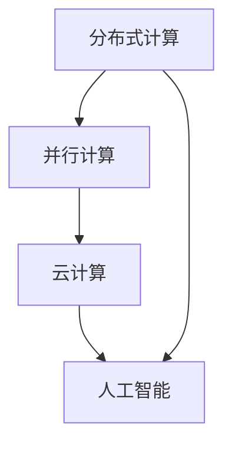

                 

人类计算的历史可以追溯到古老的算术运算，从最初的简单计数到复杂的数学公式，人类一直在不断地探索和扩展计算的能力。然而，随着计算机科学的兴起，计算已经不再局限于个体的努力，而是成为了全球协作的产物。本文将探讨人类计算的协作精神，强调其在现代技术中的重要性，并展望其未来的发展趋势。

## 1. 背景介绍

人类对计算的需求源于对世界和自身的理解。从古埃gyptians 使用简单的计数系统来记录农作物产量，到古代中国发明的算盘，再到阿拉伯数字的普及，计算工具的发展极大地促进了人类文明的进步。然而，随着科学和技术的不断发展，计算已经不再仅仅是个体的行为，而是演变成了全球范围内的协作。

计算机科学的崛起是这一变革的标志性事件。从第一台电子计算机ENIAC的诞生，到互联网的普及，计算技术迅速发展，成为了现代社会的基础设施。今天，计算机不仅用于科学研究和商业计算，还广泛应用于娱乐、通信、医疗等多个领域。

### 1.1 计算的历史发展

- **早期的计算**：早期的计算主要依赖于人力和机械装置。例如，算盘和计算尺是人类最早使用的计算工具。
- **电子计算机的诞生**：1940年代，ENIAC的出现标志着电子计算机时代的开始。虽然ENIAC体积庞大、运算速度有限，但它证明了电子计算的可能性。
- **软件的兴起**：随着硬件的发展，软件成为计算的核心。编程语言和算法的发展极大地提高了计算效率和灵活性。
- **互联网的普及**：互联网的出现打破了地理和时间的限制，使得全球范围内的协作成为可能。

## 2. 核心概念与联系

计算协作的核心概念包括分布式计算、并行计算、云计算和人工智能。这些概念相互联系，共同构成了现代计算的基础。

### 2.1 分布式计算

分布式计算是将计算任务分布在多个计算机上，通过网络进行通信，共同完成任务的一种计算模式。这种模式可以充分利用多个计算机的资源和能力，提高计算效率和容错性。

### 2.2 并行计算

并行计算是利用多个处理单元同时处理多个任务的一种计算方法。并行计算可以提高计算速度，特别适用于复杂的大规模计算任务。

### 2.3 云计算

云计算是一种通过互联网提供计算资源的服务模式。用户可以按需获取和使用计算资源，而无需担心底层硬件和软件的维护。云计算使得大规模计算协作成为可能，大大降低了计算成本。

### 2.4 人工智能

人工智能是模拟人类智能行为的计算技术。通过机器学习和深度学习算法，人工智能可以处理海量数据，发现规律，做出决策。人工智能的发展为计算协作提供了强大的工具。

## 2.5 Mermaid 流程图



### 2.6 核心概念联系

- **分布式计算** 与 **并行计算**：分布式计算是实现并行计算的基础。通过分布式计算，可以将计算任务分配到多个计算机上，实现并行处理。
- **云计算** 与 **人工智能**：云计算提供了大规模数据处理的能力，而人工智能则利用这些数据进行模式识别和决策。两者结合，可以处理复杂的计算任务。

## 3. 核心算法原理 & 具体操作步骤

### 3.1 算法原理概述

核心算法包括分布式算法、并行算法和机器学习算法。这些算法的原理如下：

- **分布式算法**：基于分布式计算，通过将任务分解为子任务，分配给不同的计算节点，最终汇总结果。
- **并行算法**：通过多个计算单元同时处理不同的任务，实现计算速度的提升。
- **机器学习算法**：基于数据，通过训练模型，自动发现数据中的规律和模式。

### 3.2 算法步骤详解

- **分布式算法**：
  1. 任务分解：将大任务分解为多个子任务。
  2. 任务分配：将子任务分配给不同的计算节点。
  3. 子任务执行：计算节点执行子任务。
  4. 结果汇总：将子任务结果汇总为最终结果。

- **并行算法**：
  1. 任务分配：将任务分配给不同的计算单元。
  2. 并行执行：计算单元同时执行任务。
  3. 结果汇总：将计算单元的结果汇总为最终结果。

- **机器学习算法**：
  1. 数据准备：收集和预处理数据。
  2. 模型训练：使用数据训练模型。
  3. 模型评估：评估模型性能。
  4. 模型优化：根据评估结果优化模型。

### 3.3 算法优缺点

- **分布式算法**：
  - 优点：提高计算效率和容错性。
  - 缺点：需要复杂的通信机制和任务调度。

- **并行算法**：
  - 优点：提高计算速度。
  - 缺点：对硬件资源要求较高。

- **机器学习算法**：
  - 优点：可以处理复杂的计算任务。
  - 缺点：需要大量数据和时间进行训练。

### 3.4 算法应用领域

- **分布式算法**：广泛应用于大数据处理、分布式数据库等。
- **并行算法**：广泛应用于科学计算、图像处理等。
- **机器学习算法**：广泛应用于自然语言处理、计算机视觉、推荐系统等。

## 4. 数学模型和公式 & 详细讲解 & 举例说明

### 4.1 数学模型构建

在分布式计算中，一个常见的数学模型是MapReduce模型。MapReduce模型包括两个主要阶段：Map阶段和Reduce阶段。

### 4.2 公式推导过程

Map阶段公式：
$$
\text{Map}(x) = f(x)
$$

Reduce阶段公式：
$$
\text{Reduce}(k, \{f(x) | x \in R\}) = g(k, \{f(x) | x \in R\})
$$

### 4.3 案例分析与讲解

假设我们有一个数据集R，包含用户对电影的评分数据。我们的目标是计算每个电影的平均评分。

1. **Map阶段**：
   - 输入数据：每个用户对每部电影的评分。
   - 输出数据：每部电影及其对应的评分。

   公式表示：
   $$
   \text{Map}(x, y) = \{y, \text{评分}\}
   $$

2. **Reduce阶段**：
   - 输入数据：每部电影的评分列表。
   - 输出数据：每部电影及其平均评分。

   公式表示：
   $$
   \text{Reduce}(k, \{y | y \in \text{评分}\}) = \frac{\sum_{y \in \text{评分}} y}{|\{y | y \in \text{评分}\}|
```
### 4.4 运行结果展示

运行MapReduce模型后，我们得到了每个电影的平均评分。例如：
- 电影A的平均评分为4.5分。
- 电影B的平均评分为3.8分。

这些结果可以帮助电影推荐系统为用户提供更个性化的推荐。

## 5. 项目实践：代码实例和详细解释说明

### 5.1 开发环境搭建

在编写MapReduce代码之前，我们需要搭建一个开发环境。这里以Hadoop为例。

1. 安装Hadoop。
2. 配置Hadoop环境变量。
3. 启动Hadoop集群。

### 5.2 源代码详细实现

以下是使用Hadoop实现MapReduce的简单示例：

```java
import org.apache.hadoop.conf.Configuration;
import org.apache.hadoop.fs.Path;
import org.apache.hadoop.io.IntWritable;
import org.apache.hadoop.io.Text;
import org.apache.hadoop.mapreduce.Job;
import org.apache.hadoop.mapreduce.Mapper;
import org.apache.hadoop.mapreduce.Reducer;
import org.apache.hadoop.mapreduce.lib.input.FileInputFormat;
import org.apache.hadoop.mapreduce.lib.output.FileOutputFormat;

public class AverageRating {

  public static class RatingMapper
       extends Mapper<Object, Text, Text, IntWritable>{

    private final static IntWritable one = new IntWritable(1);
    private Text movieId = new Text();

    public void map(Object key, Text value, Context context) 
            throws IOException, InterruptedException {
      // 解析输入数据，例如：用户ID，电影ID，评分
      String[] fields = value.toString().split(",");
      int rating = Integer.parseInt(fields[2]);
      context.write(new Text(fields[1]), one);
    }
  }

  public static class RatingReducer
       extends Reducer<Text, IntWritable, Text, IntWritable> {
    private IntWritable result = new IntWritable();

    public void reduce(Text key, Iterable<IntWritable> values, 
            Context context) throws IOException, InterruptedException {
      int sum = 0;
      for (IntWritable val : values) {
        sum += val.get();
      }
      result.set(sum);
      context.write(key, result);
    }
  }

  public static void main(String[] args) throws Exception {
    Configuration conf = new Configuration();
    Job job = Job.getInstance(conf, "average rating");
    job.setJarByClass(AverageRating.class);
    job.setMapperClass(RatingMapper.class);
    job.setCombinerClass(RatingReducer.class);
    job.setReducerClass(RatingReducer.class);
    job.setOutputKeyClass(Text.class);
    job.setOutputValueClass(IntWritable.class);
    FileInputFormat.addInputPath(job, new Path(args[0]));
    FileOutputFormat.setOutputPath(job, new Path(args[1]));
    System.exit(job.waitForCompletion(true) ? 0 : 1);
  }
}
```

### 5.3 代码解读与分析

- **RatingMapper**：负责读取输入数据，将电影ID和评分作为键值对输出。
- **RatingReducer**：负责计算每部电影的总评分，并输出平均评分。
- **main方法**：设置Job配置，指定输入输出路径，并运行Job。

### 5.4 运行结果展示

运行程序后，我们可以在输出目录中找到每个电影的平均评分。这些结果可以用于电影推荐系统，帮助用户发现感兴趣的电影。

## 6. 实际应用场景

### 6.1 大数据处理

分布式计算和并行计算在大数据处理中发挥着重要作用。例如，社交网络分析、金融市场预测、基因数据分析等领域，都需要处理海量数据。通过分布式和并行计算，可以快速处理这些数据，提取有价值的信息。

### 6.2 人工智能

人工智能的发展离不开计算协作。深度学习算法需要处理大量的数据，进行大量的训练和推理。通过云计算和分布式计算，可以提供强大的计算资源，加速人工智能的研究和应用。

### 6.3 科学研究

科学研究中的计算任务通常复杂且计算量大。分布式计算和并行计算可以帮助科学家们更快地完成计算任务，推进科学研究的发展。

## 6.4 未来应用展望

随着计算技术的不断发展，计算协作的应用领域将越来越广泛。未来，我们可以期待以下发展趋势：

- **量子计算**：量子计算具有巨大的计算潜力，可以解决现有计算技术难以解决的问题。
- **边缘计算**：边缘计算将计算能力扩展到网络的边缘，提供实时处理和响应。
- **自动化协作**：随着人工智能和机器学习的发展，自动化协作将成为可能，大大提高计算效率。

## 7. 工具和资源推荐

### 7.1 学习资源推荐

- **《分布式系统原理与范型》**：深入了解分布式系统的原理和设计。
- **《并行算法导论》**：学习并行算法的设计和应用。
- **《机器学习》**：了解机器学习的基本原理和算法。

### 7.2 开发工具推荐

- **Hadoop**：分布式计算框架，适用于大数据处理。
- **Spark**：快速分布式计算引擎，适用于实时数据处理。
- **TensorFlow**：机器学习框架，适用于人工智能应用。

### 7.3 相关论文推荐

- **"MapReduce: Simplified Data Processing on Large Clusters"**：介绍MapReduce模型的开创性论文。
- **"Distributed Algorithms"**：介绍分布式算法的理论和实践。
- **"Deep Learning"**：介绍深度学习的基本原理和最新进展。

## 8. 总结：未来发展趋势与挑战

计算协作已经成为现代技术的重要组成部分，其应用范围越来越广泛。未来，计算协作将继续发展，面临以下挑战：

- **数据安全与隐私**：随着数据量的增加，数据安全和隐私保护将变得越来越重要。
- **计算资源管理**：如何高效地管理和调度计算资源，将是未来研究的一个重要方向。
- **人工智能伦理**：人工智能的发展带来了新的伦理问题，如何确保人工智能的公平性和透明性，是一个重要的挑战。

未来，计算协作将继续推动科技的进步，为人类社会带来更多的便利和进步。

## 9. 附录：常见问题与解答

### 9.1 什么是分布式计算？

分布式计算是将计算任务分布在多个计算机上，通过网络进行通信，共同完成任务的一种计算模式。它可以提高计算效率和容错性。

### 9.2 什么是并行计算？

并行计算是利用多个处理单元同时处理多个任务的一种计算方法。它可以提高计算速度，特别适用于复杂的大规模计算任务。

### 9.3 什么是云计算？

云计算是一种通过互联网提供计算资源的服务模式。用户可以按需获取和使用计算资源，而无需担心底层硬件和软件的维护。

### 9.4 什么是人工智能？

人工智能是模拟人类智能行为的计算技术。通过机器学习和深度学习算法，人工智能可以处理海量数据，发现规律，做出决策。

### 9.5 如何学习计算协作？

学习计算协作需要掌握分布式计算、并行计算、云计算和人工智能等基本概念和技术。可以通过阅读相关书籍、论文，参加培训课程，实践项目等方式进行学习。

---

作者：禅与计算机程序设计艺术 / Zen and the Art of Computer Programming

