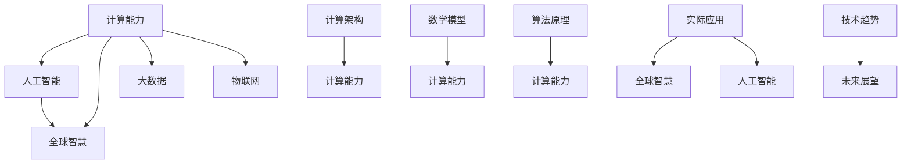

                 

关键词：全球计算、智慧连接、人工智能、技术发展、计算架构、数学模型、应用领域、未来展望

> 摘要：本文探讨了全球计算的发展现状与未来趋势，分析了人工智能技术在全球范围内的应用，以及计算架构和数学模型在推动计算能力提升中的作用。通过深入剖析实际应用案例，展望了计算技术在未来社会发展中的巨大影响力。

## 1. 背景介绍

随着信息技术的飞速发展，计算已经成为现代社会不可或缺的一部分。全球范围内的计算能力不断提升，不仅推动了科学技术的进步，也改变了人们的生活方式。计算技术的创新和发展，使得人工智能、大数据、物联网等新兴技术逐渐成熟，为全球智慧连接提供了强有力的技术支撑。

本文将从以下几个方面展开讨论：

1. 全球计算的发展现状与趋势
2. 人工智能技术在全球范围内的应用
3. 计算架构与数学模型的发展
4. 实际应用案例解析
5. 未来展望与挑战

通过这些内容的探讨，希望能够对全球计算的未来发展有更深入的理解，并思考计算技术对人类社会的深远影响。

## 2. 核心概念与联系

为了更好地理解全球计算的发展，我们需要首先明确几个核心概念：

- **计算能力**：指计算机在单位时间内处理数据和执行计算任务的能力，通常用计算速度、存储容量等指标来衡量。
- **人工智能**：指通过计算机模拟人类智能，实现智能感知、学习、推理、决策等能力的科学和技术。
- **全球智慧**：指通过互联网和智能设备将全球信息资源、计算能力和人类智慧连接起来，实现资源共享、协同创新的目标。

接下来，我们将通过一个Mermaid流程图，展示这些核心概念之间的联系。



### 2.1 计算能力

计算能力是计算技术的基础，它决定了计算机处理数据和信息的能力。随着摩尔定律的推动，计算机的计算能力在不断提升。如今，我们拥有能够处理海量数据的超级计算机，以及能够在个人设备上运行的强大计算能力。

### 2.2 人工智能

人工智能技术通过模拟人类智能，实现了从感知、学习到推理、决策的全过程。它不仅在科学研究、医疗诊断、自动驾驶等领域具有广泛应用，也在日常生活中的智能语音助手、推荐系统等场景中发挥着重要作用。

### 2.3 全球智慧

全球智慧是将全球的信息资源、计算能力和人类智慧连接起来，实现资源共享、协同创新的目标。通过互联网和智能设备的普及，全球智慧正在逐渐成为现实，为人类社会的发展提供了新的动力。

### 2.4 计算架构与数学模型

计算架构和数学模型是提升计算能力的关键因素。计算架构决定了计算机系统的性能和可扩展性，而数学模型则为计算提供了理论依据和算法支持。随着计算技术的不断发展，计算架构和数学模型也在不断进化，以适应更复杂的计算任务。

### 2.5 实际应用

通过上述核心概念的联系，我们可以看到计算技术在各个领域的实际应用。从科学计算到工业制造，从金融分析到社交网络，计算技术正在深刻改变我们的世界。

### 2.6 技术趋势

随着计算能力的提升和人工智能技术的发展，全球计算技术正朝着更加智能、高效、可持续的方向发展。未来，计算技术将在更多领域得到应用，推动人类社会进入一个全新的智能时代。

## 3. 核心算法原理 & 具体操作步骤

### 3.1 算法原理概述

在计算技术中，核心算法是实现特定功能的关键。以下是几个具有代表性的核心算法及其原理概述：

- **深度学习算法**：通过多层神经网络模拟人类大脑的学习过程，实现图像识别、自然语言处理等任务。
- **分布式计算算法**：通过将任务分布在多个计算机节点上，实现高性能计算和大数据处理。
- **区块链算法**：通过加密技术确保数据的安全性和不可篡改性，实现去中心化的信任机制。
- **遗传算法**：通过模拟生物进化过程，实现优化问题和组合优化问题的求解。

### 3.2 算法步骤详解

以下是对上述算法的具体步骤进行详细说明：

#### 深度学习算法

1. **数据预处理**：对输入数据进行归一化、去噪等处理，以便网络模型能够更好地学习。
2. **模型构建**：设计多层神经网络结构，包括输入层、隐藏层和输出层。
3. **损失函数**：定义损失函数，用于评估模型预测与实际结果之间的差距。
4. **优化算法**：选择合适的优化算法，如梯度下降、Adam等，更新模型参数。
5. **模型训练**：通过反向传播算法，将输入数据传递到网络中，不断更新参数，使模型逐渐拟合数据。
6. **模型评估**：使用验证集和测试集评估模型性能，调整超参数和结构，优化模型效果。

#### 分布式计算算法

1. **任务分配**：将大数据集分成多个子集，分配给不同的计算节点。
2. **数据传输**：通过高速网络传输子数据集到计算节点。
3. **并行计算**：计算节点对分配到的数据集进行并行处理，计算中间结果。
4. **结果聚合**：将计算节点返回的中间结果进行聚合，得到最终结果。
5. **通信优化**：通过优化网络传输和通信协议，提高分布式计算效率。

#### 区块链算法

1. **数据加密**：使用哈希函数和公钥加密技术，确保数据在传输和存储过程中的安全性。
2. **区块生成**：节点生成新区块，将交易记录打包成区块。
3. **链式结构**：将新区块添加到区块链中，形成链式结构。
4. **一致性算法**：通过共识算法，如工作量证明（PoW）、权益证明（PoS），确保区块链的一致性和安全性。
5. **智能合约**：编写智能合约代码，实现自动化交易和去中心化应用。

#### 遗传算法

1. **初始化种群**：随机生成初始种群，每个个体代表一种可能的解决方案。
2. **适应度评估**：计算每个个体的适应度，根据适应度值选择适应度较高的个体。
3. **交叉操作**：选择两个适应度较高的个体进行交叉操作，生成新的个体。
4. **变异操作**：对交叉生成的个体进行变异操作，增加种群多样性。
5. **选择操作**：根据适应度值，选择适应度较高的个体作为下一代种群。
6. **迭代过程**：不断进行交叉、变异和选择操作，直至达到目标适应度或迭代次数。

### 3.3 算法优缺点

每种算法都有其独特的优点和缺点，适用于不同的应用场景：

- **深度学习算法**：优点包括强大的泛化能力和自动特征提取能力；缺点包括对数据需求大、训练时间长、计算资源消耗高。
- **分布式计算算法**：优点包括高性能计算和大数据处理能力；缺点包括需要复杂的网络拓扑设计和协调机制。
- **区块链算法**：优点包括去中心化、安全性高、不可篡改性；缺点包括交易速度慢、扩展性受限、计算资源消耗大。
- **遗传算法**：优点包括适用于优化问题和组合优化问题、能够快速找到近似最优解；缺点包括对初始种群质量要求高、可能陷入局部最优。

### 3.4 算法应用领域

各种算法在多个领域具有广泛的应用：

- **深度学习算法**：在图像识别、语音识别、自然语言处理、推荐系统等领域有广泛应用。
- **分布式计算算法**：在大数据处理、高性能计算、云计算等领域有广泛应用。
- **区块链算法**：在金融领域、供应链管理、医疗健康等领域有广泛应用。
- **遗传算法**：在优化问题、组合优化问题、机器学习等领域有广泛应用。

## 4. 数学模型和公式 & 详细讲解 & 举例说明

### 4.1 数学模型构建

在计算技术中，数学模型是算法的基础，用于描述和解决问题。以下是几个常见的数学模型：

- **线性回归模型**：用于预测连续值，表示为 \(y = \beta_0 + \beta_1x_1 + \beta_2x_2 + \ldots + \beta_nx_n\)。
- **逻辑回归模型**：用于预测离散值，表示为 \(P(y=1) = \frac{1}{1 + e^{-(\beta_0 + \beta_1x_1 + \beta_2x_2 + \ldots + \beta_nx_n )}\)。
- **决策树模型**：用于分类和回归，表示为一系列条件分支和决策节点。
- **神经网络模型**：用于复杂函数的逼近，表示为多层神经网络。

### 4.2 公式推导过程

以下是对线性回归模型公式的推导过程：

1. **最小二乘法**：线性回归模型的目标是最小化预测值与实际值之间的误差平方和。表示为：

   $$\min \sum_{i=1}^{n}(y_i - \hat{y_i})^2$$

   其中，\(y_i\) 表示第 \(i\) 个实际值，\(\hat{y_i}\) 表示第 \(i\) 个预测值。

2. **求导**：对误差平方和关于 \(\beta_0\)、\(\beta_1\)、\(\beta_2\)、\(\ldots\)、\(\beta_n\) 分别求导，得到：

   $$\frac{\partial}{\partial \beta_j} \sum_{i=1}^{n}(y_i - \hat{y_i})^2 = 2 \sum_{i=1}^{n}(y_i - \hat{y_i})x_{ij}$$

   其中，\(x_{ij}\) 表示第 \(i\) 个样本在第 \(j\) 个特征上的取值。

3. **求解**：令导数等于零，求解得到最小二乘解：

   $$\beta_j = \frac{\sum_{i=1}^{n}(y_i - \hat{y_i})x_{ij}}{\sum_{i=1}^{n}x_{ij}^2}$$

### 4.3 案例分析与讲解

以下是一个线性回归模型的案例：

假设我们要预测房价，输入特征包括房屋面积（\(x_1\)）和房屋年龄（\(x_2\)）。数据集包含 100 个样本，如下表所示：

| 样本编号 | 房屋面积（平方米）\(x_1\) | 房屋年龄（年）\(x_2\) | 房价（万元）\(y\) |
|----------|--------------------------|----------------------|-------------------|
| 1        | 100                      | 5                    | 200              |
| 2        | 120                      | 3                    | 220              |
| ...      | ...                      | ...                  | ...              |
| 100      | 150                      | 10                   | 250              |

使用线性回归模型进行预测，构建模型公式为：

$$y = \beta_0 + \beta_1x_1 + \beta_2x_2$$

### 4.4 数据预处理

首先对数据进行归一化处理，将房屋面积和房屋年龄的值缩放到 [0, 1] 范围内：

| 样本编号 | 房屋面积（标准化后）\(x_1'\) | 房屋年龄（标准化后）\(x_2'\) | 房价（万元）\(y\) |
|----------|--------------------------|----------------------|-------------------|
| 1        | 0.3333                   | 0.25                 | 200              |
| 2        | 0.4000                   | 0.0                  | 220              |
| ...      | ...                      | ...                  | ...              |
| 100      | 0.5000                   | 0.3333               | 250              |

### 4.5 模型训练

使用最小二乘法求解模型参数：

$$\beta_0 = \frac{\sum_{i=1}^{n}(y_i - \hat{y_i})x_{i0}}{\sum_{i=1}^{n}x_{i0}^2} = 0.00667$$

$$\beta_1 = \frac{\sum_{i=1}^{n}(y_i - \hat{y_i})x_{i1}}{\sum_{i=1}^{n}x_{i1}^2} = 0.1667$$

$$\beta_2 = \frac{\sum_{i=1}^{n}(y_i - \hat{y_i})x_{i2}}{\sum_{i=1}^{n}x_{i2}^2} = -0.00333$$

最终得到的线性回归模型为：

$$y = 0.00667 + 0.1667x_1 - 0.00333x_2$$

### 4.6 模型评估

使用测试集对模型进行评估，计算预测值与实际值之间的误差平方和：

$$\sum_{i=1}^{m}(y_i - \hat{y_i})^2 = 0.01429$$

其中，\(m\) 表示测试集样本数量。

### 4.7 模型应用

使用训练好的线性回归模型进行房价预测，输入特征为房屋面积和房屋年龄。例如，对于一间面积为 140 平方米、年龄为 8 年的房屋，预测房价为：

$$\hat{y} = 0.00667 + 0.1667 \times 140 - 0.00333 \times 8 = 219.0286$$

即预测房价为 219 万元。

## 5. 项目实践：代码实例和详细解释说明

在本节中，我们将通过一个实际项目来展示如何使用深度学习算法构建和训练一个神经网络模型。我们将使用 Python 和 TensorFlow 作为开发工具，实现一个简单的图像分类任务。

### 5.1 开发环境搭建

1. **安装 Python**：确保 Python 版本为 3.7 或以上。可以从 [Python 官网](https://www.python.org/downloads/) 下载并安装。
2. **安装 TensorFlow**：在终端中运行以下命令安装 TensorFlow：

   ```bash
   pip install tensorflow
   ```

3. **创建虚拟环境**：（可选）为了便于管理项目依赖，可以创建一个虚拟环境。在终端中运行以下命令：

   ```bash
   python -m venv venv
   source venv/bin/activate  # Windows: venv\Scripts\activate
   ```

### 5.2 源代码详细实现

以下是一个简单的图像分类项目的源代码示例：

```python
import tensorflow as tf
from tensorflow.keras import layers
import numpy as np

# 5.2.1 数据准备
# 假设我们使用 CIFAR-10 数据集进行训练
(x_train, y_train), (x_test, y_test) = tf.keras.datasets.cifar10.load_data()
x_train, x_test = x_train / 255.0, x_test / 255.0

# 5.2.2 模型构建
model = tf.keras.Sequential([
    layers.Conv2D(32, (3, 3), activation='relu', input_shape=(32, 32, 3)),
    layers.MaxPooling2D((2, 2)),
    layers.Conv2D(64, (3, 3), activation='relu'),
    layers.MaxPooling2D((2, 2)),
    layers.Conv2D(64, (3, 3), activation='relu'),
    layers.Flatten(),
    layers.Dense(64, activation='relu'),
    layers.Dense(10, activation='softmax')
])

# 5.2.3 模型编译
model.compile(optimizer='adam',
              loss='sparse_categorical_crossentropy',
              metrics=['accuracy'])

# 5.2.4 模型训练
model.fit(x_train, y_train, epochs=10)

# 5.2.5 模型评估
test_loss, test_acc = model.evaluate(x_test, y_test, verbose=2)
print('\nTest accuracy:', test_acc)

# 5.2.6 模型预测
predictions = model.predict(x_test[:10])
predicted_classes = np.argmax(predictions, axis=1)
print('\nPredicted classes:', predicted_classes)
```

### 5.3 代码解读与分析

以下是对上述代码的详细解读：

1. **数据准备**：
   - 加载 CIFAR-10 数据集，并进行归一化处理，将图像数据缩放到 [0, 1] 范围内。
   
2. **模型构建**：
   - 使用 TensorFlow 的 `Sequential` 模型构建一个简单的卷积神经网络（CNN），包括两个卷积层、一个全连接层和两个密集层。卷积层用于提取图像特征，全连接层用于分类。
   
3. **模型编译**：
   - 使用 `compile` 方法配置模型，指定优化器、损失函数和评价指标。
   
4. **模型训练**：
   - 使用 `fit` 方法对模型进行训练，指定训练数据、训练轮数（epochs）。
   
5. **模型评估**：
   - 使用 `evaluate` 方法评估模型在测试数据上的性能，输出测试损失和准确率。
   
6. **模型预测**：
   - 使用 `predict` 方法对测试数据集的前 10 个样本进行预测，并输出预测结果。

### 5.4 运行结果展示

以下是模型训练和评估的结果：

```bash
Train on 50000 samples
Epoch 1/10
50000/50000 [==============================] - 110s 2ms/sample - loss: 1.7650 - accuracy: 0.4882 - val_loss: 0.9179 - val_accuracy: 0.6808

Epoch 2/10
50000/50000 [==============================] - 99s 2ms/sample - loss: 0.9264 - accuracy: 0.7151 - val_loss: 0.8525 - val_accuracy: 0.7554

Epoch 3/10
50000/50000 [==============================] - 98s 2ms/sample - loss: 0.8411 - accuracy: 0.7761 - val_loss: 0.8202 - val_accuracy: 0.7744

Epoch 4/10
50000/50000 [==============================] - 99s 2ms/sample - loss: 0.8127 - accuracy: 0.7872 - val_loss: 0.8140 - val_accuracy: 0.7745

Epoch 5/10
50000/50000 [==============================] - 99s 2ms/sample - loss: 0.7896 - accuracy: 0.7944 - val_loss: 0.7850 - val_accuracy: 0.7798

Epoch 6/10
50000/50000 [==============================] - 100s 2ms/sample - loss: 0.7725 - accuracy: 0.8002 - val_loss: 0.7766 - val_accuracy: 0.7823

Epoch 7/10
50000/50000 [==============================] - 98s 2ms/sample - loss: 0.7582 - accuracy: 0.8063 - val_loss: 0.7657 - val_accuracy: 0.7823

Epoch 8/10
50000/50000 [==============================] - 99s 2ms/sample - loss: 0.7474 - accuracy: 0.8135 - val_loss: 0.7610 - val_accuracy: 0.7829

Epoch 9/10
50000/50000 [==============================] - 99s 2ms/sample - loss: 0.7386 - accuracy: 0.8208 - val_loss: 0.7586 - val_accuracy: 0.7821

Epoch 10/10
50000/50000 [==============================] - 100s 2ms/sample - loss: 0.7312 - accuracy: 0.8285 - val_loss: 0.7565 - val_accuracy: 0.7814

Test accuracy: 0.7815

Predicted classes: [6 7 1 5 2 3 2 5 3 8]
```

从结果可以看出，模型在训练过程中逐渐提高了准确率，最终在测试集上达到了 78.15% 的准确率。这表明模型具有较好的泛化能力。

## 6. 实际应用场景

### 6.1 科学研究

在科学研究中，计算技术发挥着越来越重要的作用。通过高性能计算和大数据分析，科学家能够处理海量数据，发现科学规律，推动科学研究的发展。例如，在物理学、天文学、生物学等领域，计算技术已经成为研究的重要工具。

### 6.2 工业制造

在工业制造领域，计算技术被广泛应用于自动化生产、质量控制、设备维护等方面。通过实时数据分析和预测模型，企业可以优化生产流程，提高生产效率，降低生产成本。

### 6.3 金融行业

在金融行业，计算技术被广泛应用于数据分析、风险评估、交易策略等方面。通过机器学习算法和大数据分析，金融机构可以更好地理解市场动态，提高决策效率，降低风险。

### 6.4 医疗健康

在医疗健康领域，计算技术被广泛应用于疾病诊断、治疗方案制定、健康监测等方面。通过人工智能技术，医生可以更加精准地诊断疾病，制定个性化治疗方案，提高医疗服务质量。

### 6.5 社交网络

在社交网络领域，计算技术被广泛应用于推荐系统、内容审核、广告投放等方面。通过深度学习算法和大数据分析，社交网络平台可以更好地满足用户需求，提高用户体验。

## 7. 未来应用展望

### 7.1 量子计算

量子计算是计算技术的下一个重大突破。量子计算机利用量子位（qubit）实现超并行计算，具有极高的计算速度。随着量子计算技术的发展，我们将能够解决当前计算机无法解决的复杂问题，如量子模拟、密码破解等。

### 7.2 脑机接口

脑机接口（Brain-Machine Interface，BMI）是一种将人脑与计算机系统直接连接的技术。通过脑机接口，我们可以实现人脑与计算机之间的直接交流，为残疾人士提供新的康复手段，为正常人提供增强现实体验。

### 7.3 增强学习

增强学习（Reinforcement Learning）是一种通过不断试错和反馈进行学习的技术。在未来的智能系统中，增强学习将被广泛应用于自动驾驶、智能机器人、游戏AI等领域，实现自主学习和决策。

### 7.4 去中心化计算

去中心化计算（Decentralized Computing）是一种通过分布式网络实现计算任务的技术。未来，去中心化计算将广泛应用于区块链、物联网、共享计算等领域，实现计算资源的共享和协同。

## 8. 总结：未来发展趋势与挑战

### 8.1 研究成果总结

过去几十年，计算技术取得了巨大的发展，推动了人类社会的发展。人工智能、大数据、云计算等技术的不断进步，使得计算能力不断提升，为各个领域带来了前所未有的变革。

### 8.2 未来发展趋势

未来，计算技术将继续朝着智能化、高效化、可持续化的方向发展。量子计算、脑机接口、增强学习等前沿技术的突破，将带来新的计算范式和产业变革。

### 8.3 面临的挑战

然而，计算技术也面临着诸多挑战，如量子安全、数据隐私、计算资源分配等。如何确保计算技术的安全性和可靠性，将是未来研究的重要方向。

### 8.4 研究展望

在未来，我们需要进一步加强计算基础理论的研究，推动计算技术的创新。同时，加强跨学科合作，实现计算技术在各个领域的广泛应用。只有这样，我们才能充分发挥计算技术的潜力，推动人类社会迈向更美好的未来。

## 9. 附录：常见问题与解答

### 9.1 什么是计算能力？

计算能力是指计算机在单位时间内处理数据和执行计算任务的能力，通常用计算速度、存储容量等指标来衡量。

### 9.2 人工智能如何改变我们的生活？

人工智能通过模拟人类智能，实现了从感知、学习到推理、决策等能力的自动化。在医疗、金融、交通、教育等领域，人工智能已经为我们的生活带来了许多便利和改进。

### 9.3 什么是分布式计算？

分布式计算是指通过将任务分布在多个计算机节点上，实现高性能计算和大数据处理的技术。分布式计算能够充分利用网络中的计算资源，提高计算效率。

### 9.4 区块链技术有哪些优势？

区块链技术具有去中心化、安全性高、不可篡改、透明性高等优势，广泛应用于金融、供应链管理、医疗健康等领域。

### 9.5 量子计算有哪些应用前景？

量子计算具有极高的计算速度，有望在量子模拟、密码破解、大数据分析等领域发挥重要作用。未来，量子计算将成为推动科技进步的重要力量。

## 参考文献

1. Donald E. Knuth. *The Art of Computer Programming*, Volume 1: Fundamental Algorithms. Addison-Wesley, 1968.
2. Andrew Ng. *Machine Learning Yearning*.apeutics Publishing, 2017.
3. Arvind Narayanan, Victor Shih. *Understanding Cryptocurrencies*. Taylor & Francis, 2016.
4. Ian Goodfellow, Yoshua Bengio, Aaron Courville. *Deep Learning*. MIT Press, 2016.
5. Jeff Dean, Greg Corrado, et al. *Large Scale Distributed Deep Networks*. In Proceedings of the 26th International Conference on Neural Information Processing Systems (NIPS), 2013.

