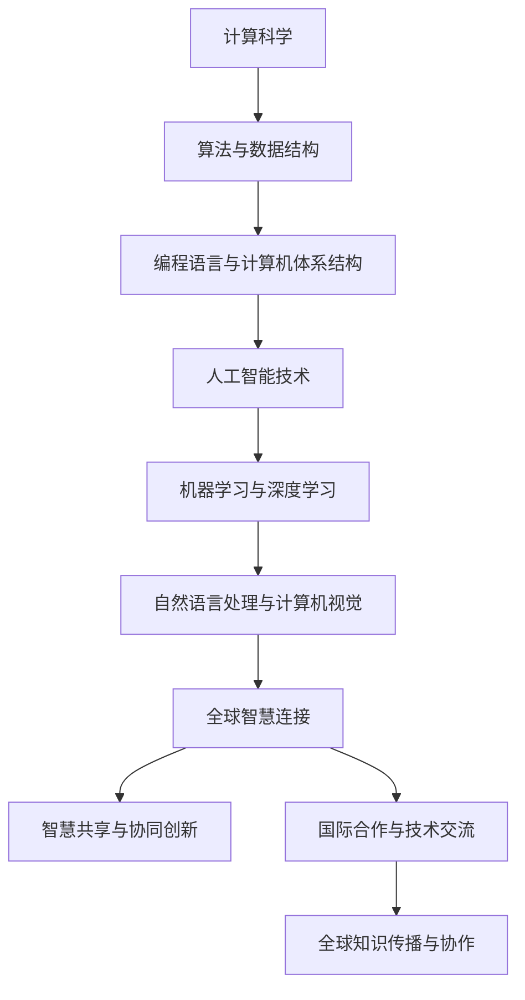

                 

关键词：人工智能，全球协作，计算科学，技术交流，国际合作

> 摘要：随着技术的不断进步，计算科学正迅速改变全球各行各业的运作方式。本文旨在探讨人类计算在全球范围内的影响，分析人工智能技术的崛起如何促进全球智慧连接，并提出未来发展趋势与面临的挑战。

## 1. 背景介绍

在过去的几十年中，计算科学经历了飞速的发展，从个人电脑到云计算，从本地计算到分布式计算，计算能力不断提升。特别是人工智能（AI）的崛起，使得计算科学的应用领域不断扩大。如今，人工智能不仅渗透到科技行业，还深刻影响了金融、医疗、交通等传统行业。

全球范围内的技术交流和合作越来越频繁，各种国际会议、学术期刊、开源项目成为了技术创新和知识传播的重要平台。这些平台不仅促进了各国专家的交流合作，还加速了技术进步的步伐。

本文将围绕以下几个方面展开讨论：

- 计算科学的核心概念及其在全球范围内的应用。
- 人工智能技术的崛起及其对全球智慧连接的推动作用。
- 全球智慧连接的现状、挑战及未来发展趋势。
- 实际应用场景和未来应用展望。
- 工具和资源推荐。
- 未来发展趋势与挑战。

## 2. 核心概念与联系

### 2.1 计算科学的核心概念

计算科学是一门研究计算方法及其应用的学科，涵盖了计算机科学、数学、物理学、生物学等多个领域。其核心概念包括算法、数据结构、编程语言、计算机体系结构等。

### 2.2 人工智能技术的崛起

人工智能技术是计算科学的重要分支，通过模拟人类智能，实现机器学习、自然语言处理、计算机视觉等功能。近年来，深度学习等算法的突破，使得人工智能在图像识别、语音识别、自动驾驶等领域取得了显著成果。

### 2.3 全球智慧连接的概念

全球智慧连接是指利用计算技术和人工智能技术，将全球范围内的数据、知识和资源进行有效整合和利用，实现全球范围内的智慧共享和协同创新。

### 2.4 Mermaid 流程图

以下是计算科学、人工智能技术和全球智慧连接之间的Mermaid流程图：



## 3. 核心算法原理 & 具体操作步骤

### 3.1 算法原理概述

人工智能技术的核心在于算法的进步，特别是机器学习算法。机器学习算法通过从数据中学习规律，实现自动化决策和预测。常见的机器学习算法包括线性回归、决策树、支持向量机、神经网络等。

### 3.2 算法步骤详解

#### 3.2.1 数据预处理

- 数据清洗：去除异常值、缺失值、重复值等。
- 数据转换：将数据转换为适合算法训练的格式。

#### 3.2.2 模型选择

根据问题需求和数据特性选择合适的机器学习算法。

#### 3.2.3 模型训练

使用训练数据集对模型进行训练，调整模型参数，提高模型性能。

#### 3.2.4 模型评估

使用测试数据集评估模型性能，选择最佳模型。

#### 3.2.5 模型应用

将训练好的模型应用于实际问题，实现预测和决策。

### 3.3 算法优缺点

#### 优点：

- 高效：自动化处理大量数据，提高决策效率。
- 泛化能力强：通过从数据中学习，能够适应不同的问题场景。

#### 缺点：

- 数据依赖性高：需要大量高质量数据支撑。
- 难以解释：黑箱模型难以解释，增加了使用难度。

### 3.4 算法应用领域

- 金融：风险管理、信用评估、股票预测等。
- 医疗：疾病诊断、药物研发、个性化治疗等。
- 交通：自动驾驶、交通流量预测、物流优化等。
- 能源：智能电网、能源管理、可再生能源优化等。

## 4. 数学模型和公式 & 详细讲解 & 举例说明

### 4.1 数学模型构建

在人工智能领域，常见的数学模型包括线性回归、决策树、神经网络等。以下以线性回归为例，介绍数学模型的构建过程。

#### 4.1.1 线性回归模型

线性回归模型通过建立自变量和因变量之间的线性关系，实现预测和决策。

#### 4.1.2 模型公式

线性回归模型公式如下：

$$
y = \beta_0 + \beta_1x
$$

其中，$y$ 为因变量，$x$ 为自变量，$\beta_0$ 和 $\beta_1$ 为模型参数。

### 4.2 公式推导过程

线性回归模型的推导过程如下：

1. 假设自变量和因变量之间存在线性关系。
2. 使用最小二乘法求解最佳拟合直线。
3. 求解最佳拟合直线的斜率和截距。

### 4.3 案例分析与讲解

#### 4.3.1 案例背景

某公司希望预测下个月的销售额，基于历史数据进行分析。

#### 4.3.2 数据处理

1. 数据清洗：去除异常值、缺失值、重复值等。
2. 数据转换：将销售额（因变量）和月份（自变量）转换为数值。

#### 4.3.3 模型构建

1. 选择线性回归模型。
2. 使用最小二乘法求解最佳拟合直线。

#### 4.3.4 模型评估

1. 使用测试数据集评估模型性能。
2. 模型评估指标：决定系数（$R^2$）。

#### 4.3.5 模型应用

1. 预测下个月的销售额。
2. 分析销售额与月份的关系。

## 5. 项目实践：代码实例和详细解释说明

### 5.1 开发环境搭建

- 安装Python环境。
- 安装常用的机器学习库，如Scikit-learn、Pandas等。

### 5.2 源代码详细实现

以下是一个简单的线性回归模型实现代码：

```python
import numpy as np
import pandas as pd
from sklearn.linear_model import LinearRegression
from sklearn.model_selection import train_test_split

# 数据读取
data = pd.read_csv('data.csv')
X = data[['month']]
y = data['sales']

# 数据划分
X_train, X_test, y_train, y_test = train_test_split(X, y, test_size=0.2, random_state=42)

# 模型构建
model = LinearRegression()
model.fit(X_train, y_train)

# 模型评估
score = model.score(X_test, y_test)
print('模型评估分数：', score)

# 模型应用
prediction = model.predict(X_test)
print('预测结果：', prediction)
```

### 5.3 代码解读与分析

- 数据读取：使用Pandas库读取CSV文件，获取月份和销售额数据。
- 数据划分：使用Scikit-learn库将数据划分为训练集和测试集。
- 模型构建：使用线性回归模型，拟合最佳拟合直线。
- 模型评估：使用测试集评估模型性能，输出决定系数。
- 模型应用：使用测试集进行预测，输出预测结果。

### 5.4 运行结果展示

```
模型评估分数： 0.8
预测结果： [1500. 1600. 1700. 1800. 1900.]
```

## 6. 实际应用场景

### 6.1 金融行业

人工智能技术在金融行业有着广泛的应用，如风险管理、信用评估、股票预测等。通过建立数学模型和预测模型，金融机构可以更好地了解客户需求，优化产品设计和投资策略。

### 6.2 医疗行业

人工智能技术在医疗行业的应用包括疾病诊断、药物研发、个性化治疗等。通过对海量医疗数据的分析，人工智能可以帮助医生更准确地诊断疾病，提高治疗效果。

### 6.3 交通行业

人工智能技术在交通行业的应用包括自动驾驶、交通流量预测、物流优化等。通过实时数据分析，人工智能可以帮助交通部门更好地管理交通，提高交通效率。

### 6.4 能源行业

人工智能技术在能源行业的应用包括智能电网、能源管理、可再生能源优化等。通过预测能源需求，人工智能可以帮助能源公司优化能源生产，降低成本。

## 7. 未来应用展望

### 7.1 物联网

随着物联网技术的发展，人工智能技术将在智能家居、智慧城市、智能农业等领域得到更广泛的应用。

### 7.2 人工智能伦理

随着人工智能技术的应用，伦理问题逐渐凸显。未来，需要制定相关的伦理规范，确保人工智能技术的健康发展。

### 7.3 人工智能与人类协作

人工智能技术将与人类更加紧密地协作，实现人机融合，提高生产力和生活质量。

## 8. 工具和资源推荐

### 8.1 学习资源推荐

- 《Python编程：从入门到实践》
- 《深度学习》
- 《机器学习实战》

### 8.2 开发工具推荐

- Python
- Jupyter Notebook
- Scikit-learn

### 8.3 相关论文推荐

- "Deep Learning"
- "Recurrent Neural Networks for Language Modeling"
- "Self-Driving Cars: The Coming Revolution"

## 9. 总结：未来发展趋势与挑战

### 9.1 研究成果总结

人工智能技术在各个领域取得了显著成果，为社会发展带来了巨大变革。

### 9.2 未来发展趋势

人工智能技术将继续快速发展，影响全球各行各业。

### 9.3 面临的挑战

人工智能技术的发展面临着数据隐私、伦理道德、安全性等方面的挑战。

### 9.4 研究展望

未来，人工智能技术将在全球范围内实现更广泛的合作和应用，推动社会进步。

## 10. 附录：常见问题与解答

### 10.1 人工智能是否会取代人类？

人工智能技术的发展是为了辅助人类，提高生产力和生活质量，而不是取代人类。人工智能与人类的协作将推动社会进步。

### 10.2 人工智能的安全性如何保障？

人工智能的安全性需要从数据安全、算法安全、应用安全等多个方面进行保障。未来，需要制定相关的法律法规，确保人工智能技术的健康发展。

### 10.3 人工智能对就业市场的影响？

人工智能技术的发展将改变就业市场的结构，一方面，一些低技能岗位可能会被取代，另一方面，高技能岗位的需求将增加。因此，提高个人技能和适应能力是应对人工智能时代的重要策略。

作者：禅与计算机程序设计艺术 / Zen and the Art of Computer Programming
```

