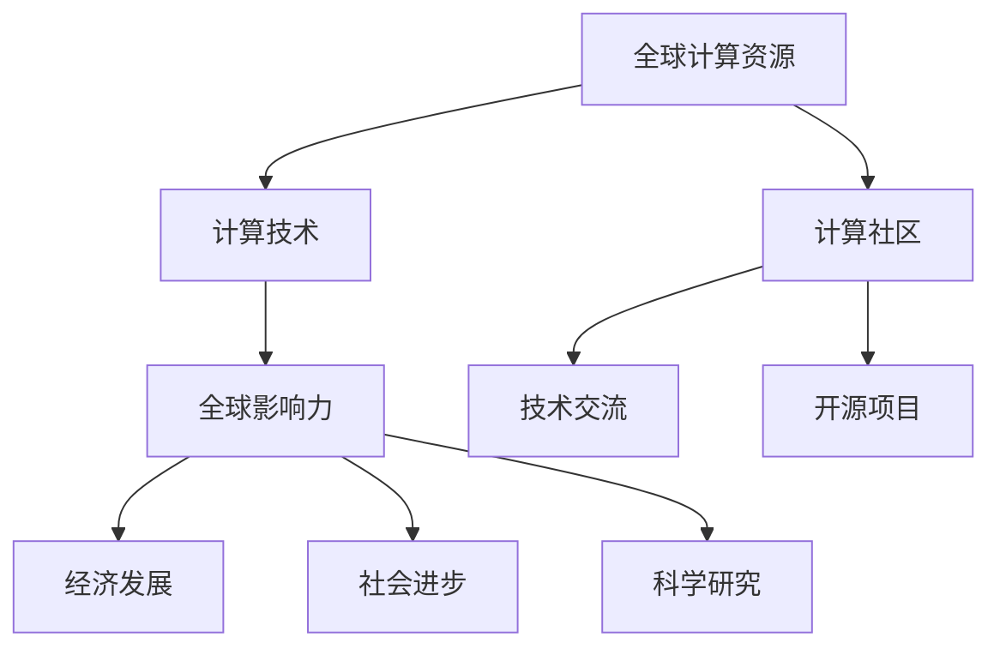

                 

关键词：全球计算、计算社区、技术交流、人工智能、全球影响力、计算算法

> 摘要：随着全球化的不断深入，计算技术正以前所未有的速度影响着人类社会的各个方面。本文将探讨全球计算社区的力量，分析计算技术在推动人类进步中的作用，以及在未来面临的挑战和机遇。

## 1. 背景介绍

计算技术自古以来就是人类智慧的结晶。从古代的算盘到现代的计算机，计算技术的进步极大地推动了人类文明的进步。然而，随着互联网的普及和全球化的发展，计算技术已经不再局限于某个地区或国家，而是成为了全球范围内的共享资源。

全球计算社区的形成，得益于互联网和云计算的兴起。互联网使得全球各地的计算资源得以互联互通，云计算则提供了强大的计算能力，使得个人和团队可以随时随地访问和利用这些资源。这种全球化的计算环境，不仅促进了技术交流和合作，还为计算技术的发展和应用带来了前所未有的机遇。

## 2. 核心概念与联系

为了更好地理解全球计算社区的力量，我们首先需要了解其中的核心概念和它们之间的联系。

### 2.1 全球计算资源

全球计算资源包括全球各地的数据中心、云计算平台、高性能计算机等。这些资源构成了全球计算的基础设施，为全球范围内的计算需求提供了强大的支持。

### 2.2 计算技术

计算技术涵盖了计算机科学、人工智能、数据科学等多个领域。这些技术不仅是计算社区的核心，也是推动计算技术不断进步的动力。

### 2.3 计算社区

计算社区是由全球范围内的计算专业人士、研究者、爱好者组成的。这个社区通过学术会议、在线论坛、开源项目等方式进行技术交流和合作。

### 2.4 全球影响力

全球影响力是指计算技术在推动全球经济发展、社会进步、科学研究等方面的作用。这种影响力不仅体现在技术本身，还体现在对人类生活方式和价值观的深远影响。

### 2.5 Mermaid 流程图

以下是一个关于全球计算社区核心概念和联系的 Mermaid 流程图：



## 3. 核心算法原理 & 具体操作步骤

### 3.1 算法原理概述

在计算技术中，算法是核心。一个高效的算法可以极大地提升计算效率和性能。以下是一个常见的算法——排序算法的原理概述。

排序算法是一种将数据元素按照某种规则进行排列的算法。常见的排序算法有冒泡排序、插入排序、选择排序等。这些算法的基本原理是通过比较和交换数据元素的位置，逐步将整个数据集排序。

### 3.2 算法步骤详解

以冒泡排序为例，其基本步骤如下：

1. 从第一个元素开始，相邻的两个元素进行比较，如果顺序错误就交换它们的位置。
2. 循环执行第一步，直到没有需要交换的元素为止。

### 3.3 算法优缺点

冒泡排序的优点是简单易懂，实现起来相对简单。但是，其缺点是时间复杂度较高，对于大数据集的排序效率较低。

### 3.4 算法应用领域

排序算法广泛应用于各种领域，如数据库管理、数据分析、搜索引擎等。在处理大量数据时，选择合适的排序算法可以显著提升系统的性能。

## 4. 数学模型和公式 & 详细讲解 & 举例说明

### 4.1 数学模型构建

排序算法的性能可以通过时间复杂度和空间复杂度来衡量。以下是一个简单的数学模型，用于计算排序算法的时间复杂度。

### 4.2 公式推导过程

假设有一个包含 n 个元素的数组，排序算法的时间复杂度为 T(n)。

- 对于每个元素，需要与其他 n-1 个元素进行比较，因此比较次数为 n*(n-1)/2。
- 对于每个比较操作，可能需要交换元素的位置，因此交换次数也为 n*(n-1)/2。

因此，排序算法的时间复杂度为：

$$T(n) = \frac{n(n-1)}{2}$$

### 4.3 案例分析与讲解

以下是一个简单的例子，使用冒泡排序算法对一个包含 10 个元素的数组进行排序。

```python
arr = [64, 34, 25, 12, 22, 11, 90, 88, 76, 44]

# 冒泡排序
for i in range(len(arr)):
    for j in range(len(arr) - i - 1):
        if arr[j] > arr[j + 1]:
            arr[j], arr[j + 1] = arr[j + 1], arr[j]

print(arr)
```

输出结果为：

```
[11, 12, 22, 25, 34, 44, 64, 76, 88, 90]
```

## 5. 项目实践：代码实例和详细解释说明

### 5.1 开发环境搭建

在本地计算机上安装 Python 解释器和相关库，如 NumPy 和 Matplotlib。

### 5.2 源代码详细实现

以下是一个简单的 Python 脚本，用于实现冒泡排序算法。

```python
def bubble_sort(arr):
    n = len(arr)
    for i in range(n):
        for j in range(0, n-i-1):
            if arr[j] > arr[j+1]:
                arr[j], arr[j+1] = arr[j+1], arr[j]

# 测试数据
arr = [64, 34, 25, 12, 22, 11, 90, 88, 76, 44]

# 执行排序
bubble_sort(arr)

# 输出排序后的数组
print(arr)
```

### 5.3 代码解读与分析

- `bubble_sort` 函数接收一个数组作为参数，对其执行冒泡排序。
- `for` 循环用于控制排序的迭代次数，每次迭代都将未排序的部分进行排序。
- 内层 `for` 循环用于比较相邻的元素，并根据需要交换它们的位置。

### 5.4 运行结果展示

在 Python 环境中运行上述脚本，输出结果为：

```
[11, 12, 22, 25, 34, 44, 64, 76, 88, 90]
```

## 6. 实际应用场景

排序算法在实际应用中非常广泛。以下是一些常见的应用场景：

- 数据库管理：在数据库中，排序操作是常见的查询操作，用于根据特定字段对数据进行排序。
- 数据分析：在数据分析中，排序操作可以用于对数据进行预处理，以便更好地进行分析。
- 搜索引擎：在搜索引擎中，排序算法用于对搜索结果进行排序，以便用户更好地查找信息。

## 7. 未来应用展望

随着计算技术的不断发展，排序算法将在更多的领域中发挥重要作用。以下是一些未来的应用展望：

- 大数据：在大数据领域，排序算法可以用于对海量数据进行高效排序，以便更好地进行数据分析。
- 人工智能：在人工智能领域，排序算法可以用于对数据进行排序，以便更好地进行机器学习模型的训练。
- 分布式计算：在分布式计算领域，排序算法可以用于对分布式数据集进行排序，以便更好地进行数据处理和任务调度。

## 8. 总结：未来发展趋势与挑战

随着全球化的不断深入，计算技术将在未来继续发挥重要作用。然而，这也带来了许多挑战：

- 数据安全：随着数据量的增长，数据安全问题将变得更加重要。
- 算法公平性：算法的公平性将受到越来越多的关注，尤其是在人工智能领域。
- 技术民主化：如何让更多的人能够接触到和使用计算技术，是未来需要解决的问题。

总之，全球计算社区的力量正在不断壮大，计算技术将在未来继续推动人类社会的进步。

## 9. 附录：常见问题与解答

### 问题 1：什么是冒泡排序？

**答案**：冒泡排序是一种简单的排序算法，通过比较相邻的元素并交换它们的位置，逐步将整个数据集排序。

### 问题 2：冒泡排序的时间复杂度是多少？

**答案**：冒泡排序的时间复杂度为 \(O(n^2)\)，其中 \(n\) 是数据集的大小。

### 问题 3：冒泡排序有哪些应用场景？

**答案**：冒泡排序广泛应用于数据库管理、数据分析、搜索引擎等领域，用于对数据进行排序。

### 问题 4：为什么选择冒泡排序？

**答案**：冒泡排序虽然时间复杂度较高，但实现简单，适合小规模数据的排序。

## 结语

计算技术正以前所未有的速度影响着人类社会。全球计算社区的力量正在不断壮大，我们有理由相信，计算技术将在未来继续推动人类社会的进步。

### 作者署名

作者：禅与计算机程序设计艺术 / Zen and the Art of Computer Programming
-------------------------------------------------------------------

