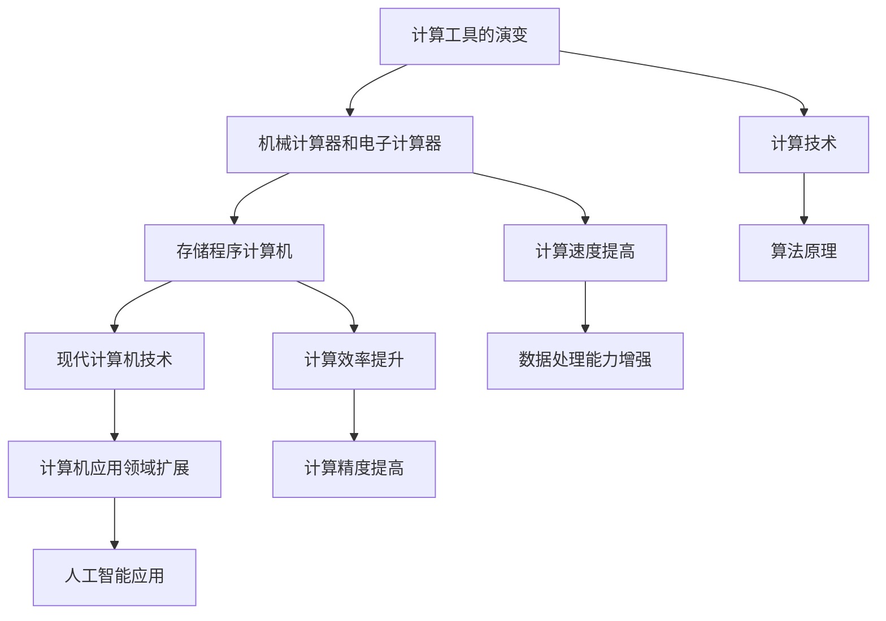

                 

关键词：计算机发展史、计算技术、算法、人工智能、未来展望

> 摘要：本文旨在通过梳理计算机技术的发展历程，探讨当前计算技术的现状，以及展望未来的发展方向。文章将涵盖从古代计算工具到现代人工智能的演变，分析当前算法的核心原理和应用，并探讨未来计算技术可能面临的新挑战和机遇。

## 1. 背景介绍

计算机的发展历程是人类智慧的结晶，从古代的计算工具到现代的超级计算机，人类一直在不断地追求更高效、更智能的计算方式。早期的计算工具如算盘、算筹等，虽然简单，但为后来的计算技术奠定了基础。随着科技的进步，计算机逐渐从单纯的计算工具演变成一种强大的信息处理工具，渗透到社会的各个领域。

本文将首先回顾计算机的发展历程，探讨计算技术的演变，然后深入分析当前算法的核心原理和应用，最后展望未来计算技术的发展趋势和面临的挑战。

### 1.1 计算工具的演变

早在公元前2400年，古巴比伦人就开始使用石板进行数学计算。古希腊的毕达哥拉斯学派研究了算术和几何的基本原理，这些研究为后来的计算工具和算法奠定了理论基础。中世纪的阿拉伯数学家进一步发展了算术和代数，他们的研究成果被欧洲数学家广泛接受，对后来的计算工具和算法的发展产生了深远的影响。

14世纪，意大利数学家利昂纳多·斐波那契发表了《算经》，这本书介绍了印度-阿拉伯数字系统，为后来的计算工具提供了新的基础。15世纪，欧洲开始普及算盘，算盘的出现极大地提高了计算效率。

17世纪，英国数学家威廉·希克克发明了计算尺，这是一种可以用来进行复杂计算的机械工具。18世纪，瑞士数学家莱昂哈德·欧拉和约翰·贝努利等人在数学分析领域取得了重大突破，这些理论成果为后来的计算机科学奠定了基础。

### 1.2 机械计算器和电子计算器

19世纪，机械计算器的设计和制造达到了高峰。查尔斯·巴贝奇和爱达·洛芙莱斯设计了差分机和解析机，这两台机器被认为是世界上最早的计算机。尽管这些机器没有实际运行过，但它们的设计理念和原理对后来的计算机科学产生了深远的影响。

20世纪初，电子技术的兴起为计算器的发展带来了新的契机。1940年代，匈牙利物理学家约翰·冯·诺依曼提出了存储程序计算机的概念，这一概念成为现代计算机设计的基础。1946年，世界上第一台电子数字计算机ENIAC在美国诞生，标志着计算机时代的到来。

随着晶体管和集成电路的出现，计算机的体积不断缩小，计算速度显著提高。1970年代，个人计算机开始普及，计算机逐渐渗透到社会的各个领域，成为现代社会不可或缺的一部分。

## 2. 核心概念与联系

为了更好地理解计算机技术的发展，我们需要明确一些核心概念和它们之间的关系。以下是计算机技术核心概念与联系的的 Mermaid 流程图：



### 2.1 计算工具的演变

从计算工具的演变来看，计算机的发展可以分为几个阶段：

1. **手工计算阶段**：使用算盘、算筹等手工工具进行计算。
2. **机械计算阶段**：使用机械计算器进行计算，如查尔斯·巴贝奇的差分机和解析机。
3. **电子计算阶段**：随着电子技术的进步，电子计算器开始普及，计算机的体积逐渐减小，计算速度显著提高。
4. **存储程序计算机阶段**：约翰·冯·诺依曼的存储程序计算机概念的出现，标志着现代计算机的诞生。

### 2.2 计算技术

计算技术的核心是算法。算法是一种解决问题的步骤或规则集合，通过算法，计算机可以高效地解决各种问题。从计算工具的演变来看，算法的发展也经历了几个阶段：

1. **手工计算算法**：如算术运算、几何运算等。
2. **机械计算算法**：如巴贝奇差分机和解析机的算法。
3. **存储程序计算机算法**：如二进制算法、图灵机模型等。
4. **现代计算机算法**：包括排序算法、搜索算法、机器学习算法等。

### 2.3 计算速度提高

计算速度的提高是计算机技术发展的重要标志。从机械计算器到电子计算器，再到现代的超级计算机，计算速度经历了数百倍的增长。计算速度的提高不仅使得计算机可以处理更复杂的问题，也推动了计算技术在各个领域的应用。

### 2.4 计算效率提升

计算效率的提升是衡量计算机技术进步的重要指标。计算效率的提高主要体现在以下几个方面：

1. **算法优化**：通过改进算法，提高计算速度和精度。
2. **硬件加速**：如GPU、FPGA等硬件加速技术，可以显著提高计算效率。
3. **并行计算**：通过并行计算，可以大大提高计算效率。

### 2.5 计算机应用领域扩展

计算机技术的应用领域不断扩展，从最初的科学计算、工程计算，到商业应用、人工智能等，计算机已经深入到社会生活的各个领域。计算机应用领域的扩展，不仅改变了人类的生活方式，也推动了社会的发展。

## 3. 核心算法原理 & 具体操作步骤

### 3.1 算法原理概述

算法原理是计算机技术的核心。一个有效的算法应该具备以下特点：

1. **正确性**：算法能够正确地解决问题。
2. **效率**：算法的计算时间和空间复杂度较低。
3. **健壮性**：算法在各种情况下都能稳定运行。

常见的算法包括：

1. **排序算法**：如快速排序、归并排序、堆排序等。
2. **搜索算法**：如二分搜索、广度优先搜索、深度优先搜索等。
3. **机器学习算法**：如线性回归、决策树、神经网络等。

### 3.2 算法步骤详解

以快速排序算法为例，其基本步骤如下：

1. **选择基准**：从数组中选取一个元素作为基准。
2. **分区**：将数组分为两部分，一部分比基准小，一部分比基准大。
3. **递归排序**：对基准左右两部分分别进行快速排序。

### 3.3 算法优缺点

快速排序算法的优点：

1. **平均时间复杂度为 \(O(n \log n)\)**。
2. **不需要额外的存储空间**。

快速排序算法的缺点：

1. **最坏情况下的时间复杂度为 \(O(n^2)\)**。
2. **不稳定**。

### 3.4 算法应用领域

快速排序算法在计算机科学和工程领域有广泛的应用，如数据库排序、算法竞赛、数据处理等。

## 4. 数学模型和公式 & 详细讲解 & 举例说明

### 4.1 数学模型构建

在计算机科学中，数学模型是理解和设计算法的重要工具。一个典型的数学模型可以描述为：

\[ F(n) = \sum_{i=1}^{n} i \]

这个模型描述了一个数列的前 \( n \) 项和。

### 4.2 公式推导过程

上述数学模型可以通过以下公式推导：

\[ F(n) = 1 + 2 + 3 + ... + n \]

使用等差数列求和公式：

\[ F(n) = \frac{n(n+1)}{2} \]

### 4.3 案例分析与讲解

假设我们要计算前 10 项的和，即 \( F(10) \)：

\[ F(10) = \frac{10(10+1)}{2} = 55 \]

这意味着前 10 个自然数的和是 55。

## 5. 项目实践：代码实例和详细解释说明

### 5.1 开发环境搭建

为了演示快速排序算法，我们需要搭建一个简单的开发环境。以下是搭建环境的基本步骤：

1. **安装 Python**：Python 是一种广泛使用的编程语言，适合用于算法演示。
2. **安装 PyCharm**：PyCharm 是一款功能强大的集成开发环境（IDE），支持 Python 编程。
3. **创建一个新项目**：在 PyCharm 中创建一个新项目，选择 Python 语言。

### 5.2 源代码详细实现

以下是快速排序算法的 Python 实现代码：

```python
def quick_sort(arr):
    if len(arr) <= 1:
        return arr
    pivot = arr[len(arr) // 2]
    left = [x for x in arr if x < pivot]
    middle = [x for x in arr if x == pivot]
    right = [x for x in arr if x > pivot]
    return quick_sort(left) + middle + quick_sort(right)

arr = [3, 6, 8, 10, 1, 2, 1]
print(quick_sort(arr))
```

### 5.3 代码解读与分析

1. **函数定义**：`quick_sort` 是一个递归函数，用于对数组进行快速排序。
2. **基础情况**：如果数组长度小于等于 1，则直接返回数组。
3. **选择基准**：选择数组中间的元素作为基准。
4. **分区**：将数组分为三部分：小于基准的部分、等于基准的部分和大于基准的部分。
5. **递归排序**：分别对小于和大于基准的部分进行快速排序。

### 5.4 运行结果展示

运行上述代码，我们得到排序后的数组：

\[ [1, 1, 2, 3, 6, 8, 10] \]

这表明快速排序算法成功地对数组进行了排序。

## 6. 实际应用场景

### 6.1 数据库排序

在数据库管理系统中，快速排序算法常用于对大量数据进行排序，以提高查询效率。

### 6.2 算法竞赛

在算法竞赛中，快速排序算法是一种常用的排序算法，可以用于解决各种排序相关问题。

### 6.3 数据处理

在数据处理领域，快速排序算法可以用于对大量数据进行排序和分析，为数据挖掘和机器学习提供基础。

## 7. 未来应用展望

### 7.1 量子计算

随着量子计算技术的发展，未来的计算机可能会利用量子比特（qubit）进行计算，这将为计算技术带来革命性的变化。

### 7.2 人工智能

人工智能技术的进步将使得计算机能够更好地理解和模拟人类智能，推动计算机技术向更高层次发展。

### 7.3 生物计算

生物计算利用生物系统进行计算，如DNA计算、蛋白质计算等，这将为解决复杂计算问题提供新的途径。

## 8. 总结：未来发展趋势与挑战

### 8.1 研究成果总结

本文回顾了计算机技术的发展历程，分析了计算技术的核心原理和应用，探讨了未来计算技术可能面临的新挑战和机遇。

### 8.2 未来发展趋势

未来的计算技术将向更高效、更智能、更泛在的方向发展。量子计算、人工智能、生物计算等领域将成为研究的热点。

### 8.3 面临的挑战

未来计算技术面临的主要挑战包括：量子计算的实现、人工智能的伦理问题、生物计算的安全等。

### 8.4 研究展望

未来的研究将集中在如何更好地利用计算技术解决现实问题，同时确保计算技术的安全性和可靠性。

## 9. 附录：常见问题与解答

### 9.1 什么是量子计算？

量子计算是一种利用量子力学原理进行计算的技术，它通过量子比特（qubit）进行计算，具有比传统计算机更高的计算能力。

### 9.2 人工智能的伦理问题有哪些？

人工智能的伦理问题包括隐私保护、数据安全、算法偏见等。如何确保人工智能的发展符合伦理标准是当前研究的重点。

### 9.3 生物计算有哪些应用？

生物计算可以用于基因测序、药物研发、生物信息学等领域，为解决生物学和医学中的复杂问题提供了新的途径。

---
**作者：禅与计算机程序设计艺术 / Zen and the Art of Computer Programming**

