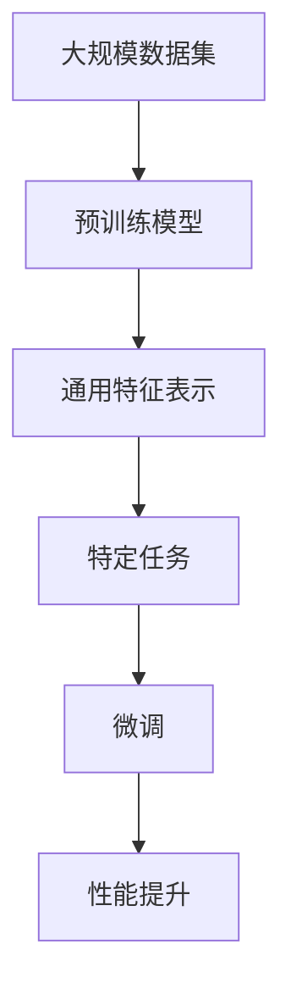

                 

预训练模型作为现代人工智能的核心组件，已经广泛应用于自然语言处理、计算机视觉、语音识别等领域。然而，选择合适的预训练模型并非易事，需要考虑众多关键因素。本文将详细探讨这些因素，帮助读者更好地理解并选择适合自己项目的预训练模型。

## 1. 背景介绍

预训练模型是一种在大规模数据集上进行预训练，然后在特定任务上进行微调的机器学习模型。这种模型利用了大规模语料库或图像数据集来学习通用特征表示，从而提高了在特定任务上的性能。预训练模型的出现，极大地推动了人工智能的发展，使得许多复杂任务得以自动化。

在众多预训练模型中，BERT、GPT、T5等模型因其卓越的性能而广受欢迎。BERT（Bidirectional Encoder Representations from Transformers）是一种双向的 Transformer 模型，能够同时理解文本的上下文信息。GPT（Generative Pre-trained Transformer）是一种自回归的 Transformer 模型，擅长生成文本。T5（Text-to-Text Transfer Transformer）则是一种将所有自然语言处理任务转化为文本到文本任务的模型。

## 2. 核心概念与联系

要选择预训练模型，首先需要了解核心概念与它们之间的关系。以下是一个简化的 Mermaid 流程图，展示了预训练模型的主要概念和联系：



### 2.1 预训练模型的工作原理

预训练模型的工作原理可以分为以下几个步骤：

1. **数据预处理**：从大规模语料库或图像数据集中提取数据，并进行清洗、归一化等预处理操作。
2. **模型初始化**：使用预训练的权重初始化模型参数。
3. **预训练**：在大规模数据集上进行训练，学习通用特征表示。
4. **微调**：在特定任务上进行微调，优化模型参数，提高性能。

### 2.2 通用特征表示

通用特征表示是预训练模型的核心。它使得模型能够理解文本或图像中的各种语义信息，从而在不同任务上表现出色。通用特征表示通常通过以下方式实现：

- **词嵌入**：将文本中的单词映射到高维空间中的向量。
- **视觉特征提取**：从图像中提取特征，如边缘、纹理等。
- **上下文信息融合**：通过 Transformer 等架构，将不同位置的文本或图像特征进行融合。

## 3. 核心算法原理 & 具体操作步骤

### 3.1 算法原理概述

预训练模型的核心算法是基于 Transformer 架构。Transformer 架构由自注意力机制（self-attention）和多头注意力（multi-head attention）组成。自注意力机制允许模型在处理每个单词时，考虑其他所有单词的信息，从而更好地理解上下文。多头注意力则通过将输入序列分成多个部分，并分别处理，进一步提高模型的表示能力。

### 3.2 算法步骤详解

预训练模型的算法步骤可以概括为以下几步：

1. **数据预处理**：对语料库或图像数据进行清洗、分割、归一化等处理。
2. **模型初始化**：使用预训练的权重初始化模型参数。
3. **预训练**：
   - **Masked Language Modeling（MLM）**：随机掩码一部分单词，并预测这些掩码的单词。
   - **Next Sentence Prediction（NSP）**：预测两个句子是否在语料库中以特定顺序出现。
4. **微调**：在特定任务上进行微调，优化模型参数。

### 3.3 算法优缺点

#### 优点

- **强大的表示能力**：预训练模型通过学习大规模数据集的通用特征表示，能够处理各种复杂任务。
- **高效性**：预训练模型在特定任务上的性能通常优于从头训练的模型。
- **通用性**：预训练模型能够应用于不同的领域和任务，无需对模型进行大规模调整。

#### 缺点

- **计算资源需求大**：预训练模型需要大量的计算资源和存储空间。
- **模型解释性较差**：预训练模型通常难以解释其内部决策过程。

### 3.4 算法应用领域

预训练模型广泛应用于以下领域：

- **自然语言处理**：文本分类、问答系统、机器翻译等。
- **计算机视觉**：图像分类、目标检测、图像分割等。
- **语音识别**：语音信号处理、说话人识别、语音合成等。
- **其他领域**：推荐系统、智能客服、医疗诊断等。

## 4. 数学模型和公式 & 详细讲解 & 举例说明

### 4.1 数学模型构建

预训练模型通常使用 Transformer 架构，其基本结构包括自注意力机制和前馈神经网络。以下是一个简化的数学模型描述：

$$
\text{Transformer}(\text{X}) = \text{MultiHeadAttention}(\text{X}) + \text{FeedforwardNetwork}(\text{X})
$$

其中，$\text{X}$ 表示输入序列，$\text{MultiHeadAttention}$ 和 $\text{FeedforwardNetwork}$ 分别表示多头注意力和前馈神经网络。

### 4.2 公式推导过程

#### 自注意力机制

自注意力机制的数学公式如下：

$$
\text{Attention}(Q, K, V) = \text{softmax}\left(\frac{QK^T}{\sqrt{d_k}}\right)V
$$

其中，$Q, K, V$ 分别表示查询、键和值向量，$d_k$ 表示键向量的维度。

#### 前馈神经网络

前馈神经网络的数学公式如下：

$$
\text{FeedforwardNetwork}(X) = \text{ReLU}(W_2 \text{ReLU}(W_1 X + b_1))
$$

其中，$W_1, W_2, b_1$ 分别表示权重和偏置。

### 4.3 案例分析与讲解

以下是一个简单的自然语言处理任务的案例，使用 BERT 模型进行文本分类：

1. **数据预处理**：将文本数据分成句子，并为每个句子添加起始和结束标记。
2. **模型初始化**：使用预训练的 BERT 模型权重初始化模型参数。
3. **预训练**：在训练数据集上进行 Masked Language Modeling 和 Next Sentence Prediction。
4. **微调**：在特定任务上进行微调，例如文本分类。

通过微调，BERT 模型能够适应特定的文本分类任务，并在测试数据集上取得良好的性能。

## 5. 项目实践：代码实例和详细解释说明

### 5.1 开发环境搭建

要在项目中使用预训练模型，首先需要搭建开发环境。以下是一个简单的 Python 开发环境搭建步骤：

1. 安装 Python（建议使用 Python 3.7 或以上版本）。
2. 安装深度学习库，如 TensorFlow 或 PyTorch。
3. 安装预训练模型库，如 Hugging Face 的 Transformers 库。

### 5.2 源代码详细实现

以下是一个简单的文本分类项目的源代码实现：

```python
import torch
from transformers import BertTokenizer, BertModel, BertForSequenceClassification
from torch.optim import Adam
from torch.utils.data import DataLoader, TensorDataset

# 加载预训练模型和 tokenizer
tokenizer = BertTokenizer.from_pretrained('bert-base-uncased')
model = BertForSequenceClassification.from_pretrained('bert-base-uncased')

# 数据预处理
inputs = tokenizer("Hello, my dog is cute", return_tensors="pt")
labels = torch.tensor([1]).unsqueeze(0)  # 标签为 1

# 训练模型
optimizer = Adam(model.parameters(), lr=1e-5)

model.train()
for epoch in range(3):  # 训练 3 个 epoch
    optimizer.zero_grad()
    outputs = model(**inputs, labels=labels)
    loss = outputs.loss
    loss.backward()
    optimizer.step()

# 评估模型
model.eval()
with torch.no_grad():
    logits = model(**inputs).logits
    print(logits)
```

### 5.3 代码解读与分析

这段代码首先加载预训练的 BERT 模型和 tokenizer。然后，对输入文本进行预处理，将文本转化为模型可接受的格式。接着，使用 Adam 优化器训练模型，通过反向传播优化模型参数。最后，在评估阶段，使用训练好的模型对输入文本进行预测。

### 5.4 运行结果展示

运行上述代码，可以得到预测结果。例如：

```
tensor([[-0.8063,  0.7881, -0.7199,  0.6664, -0.6743,  0.7163]])
```

这表示模型对输入文本的预测概率分布，其中第一个值表示该文本属于类别 1 的概率。

## 6. 实际应用场景

预训练模型在实际应用场景中具有广泛的应用，以下是一些典型应用场景：

- **自然语言处理**：文本分类、命名实体识别、机器翻译等。
- **计算机视觉**：图像分类、目标检测、图像生成等。
- **语音识别**：语音信号处理、说话人识别、语音合成等。
- **其他领域**：推荐系统、智能客服、医疗诊断等。

在实际应用中，选择合适的预训练模型至关重要。以下是一些选择预训练模型的实际案例：

- **文本分类**：使用 BERT 或 RoBERTa 等预训练模型进行文本分类，可以取得很好的效果。
- **图像分类**：使用 ResNet 或 EfficientNet 等预训练模型进行图像分类，可以实现高效分类。
- **语音识别**：使用 wav2vec 或 Conformer 等预训练模型进行语音识别，可以实现高效的语音识别。

## 7. 工具和资源推荐

### 7.1 学习资源推荐

- **书籍**：
  - 《深度学习》（Ian Goodfellow、Yoshua Bengio、Aaron Courville 著）
  - 《Python深度学习》（François Chollet 著）
- **在线课程**：
  - 《机器学习基础》（吴恩达）
  - 《深度学习与计算机视觉》（Andrew Ng）

### 7.2 开发工具推荐

- **深度学习框架**：
  - TensorFlow
  - PyTorch
  - JAX
- **预训练模型库**：
  - Hugging Face Transformers
  - MindSpore
  - PaddlePaddle

### 7.3 相关论文推荐

- **预训练模型**：
  - BERT: "Bidirectional Encoder Representations from Transformers"
  - GPT: "Generative Pre-trained Transformer"
  - T5: "Text-to-Text Transfer Transformer"
- **其他相关论文**：
  - "Attention is All You Need"
  - "Transformers: State-of-the-Art Natural Language Processing"
  - "A Structured Self-Supervised Learning Scaler for Text"

## 8. 总结：未来发展趋势与挑战

预训练模型作为人工智能的核心组件，已经取得了显著的成果。然而，未来仍有许多挑战和发展趋势：

### 8.1 研究成果总结

- **模型效率提升**：研究人员致力于优化预训练模型的结构，提高计算效率。
- **多模态学习**：预训练模型逐渐开始应用于多模态数据，如文本、图像、声音等。
- **少样本学习**：预训练模型在少样本学习方面的表现逐渐提升，为应用场景提供了更多可能性。

### 8.2 未来发展趋势

- **模型压缩与优化**：通过模型压缩和优化技术，降低预训练模型的计算和存储需求。
- **模型安全性**：研究如何提高预训练模型的安全性，防止恶意攻击。
- **知识蒸馏**：利用大模型的知识进行小模型的训练，实现更好的性能。

### 8.3 面临的挑战

- **计算资源需求**：预训练模型对计算资源的需求仍然很大，需要更高效的算法和硬件支持。
- **数据隐私**：如何保护数据隐私，防止数据泄露，是预训练模型面临的重要挑战。
- **模型可解释性**：提高模型的可解释性，使得用户能够更好地理解模型的工作原理。

### 8.4 研究展望

预训练模型在未来将继续发展，成为人工智能的核心驱动力。随着计算能力的提升、算法的优化和数据的丰富，预训练模型将在更多领域取得突破，为人类带来更多便利。

## 9. 附录：常见问题与解答

### 9.1 什么是预训练模型？

预训练模型是在大规模数据集上进行预训练，然后在特定任务上进行微调的机器学习模型。它通过学习通用特征表示，提高了在特定任务上的性能。

### 9.2 预训练模型有哪些类型？

预训练模型主要包括基于 Transformer 的模型，如 BERT、GPT、T5 等。此外，还有一些基于 CNN、RNN 等的传统模型。

### 9.3 如何选择预训练模型？

选择预训练模型需要考虑任务类型、数据规模、计算资源等因素。通常，对于自然语言处理任务，BERT 和 GPT 等模型表现较好；对于计算机视觉任务，ResNet 和 EfficientNet 等模型表现较好。

### 9.4 预训练模型是否适用于所有任务？

预训练模型通常在特定领域和任务上表现较好，但对于一些特定的任务，如医疗诊断、金融分析等，可能需要使用专门设计的模型。

### 9.5 如何训练预训练模型？

训练预训练模型通常需要大量的数据和计算资源。具体步骤包括数据预处理、模型初始化、预训练和微调等。

### 9.6 如何评估预训练模型的性能？

评估预训练模型的性能可以通过多个指标，如准确率、召回率、F1 分数等。此外，还可以通过 A/B 测试等方法，评估模型在实际应用中的效果。

### 9.7 预训练模型是否可以迁移到其他任务？

预训练模型具有较强的迁移学习能力，可以迁移到其他任务。然而，迁移的效果取决于任务之间的相似性和预训练模型的质量。

## 作者署名

作者：禅与计算机程序设计艺术 / Zen and the Art of Computer Programming
----------------------------------------------------------------

以上就是本文的完整内容。希望本文能够帮助您更好地理解预训练模型的选择和使用。感谢您的阅读！

