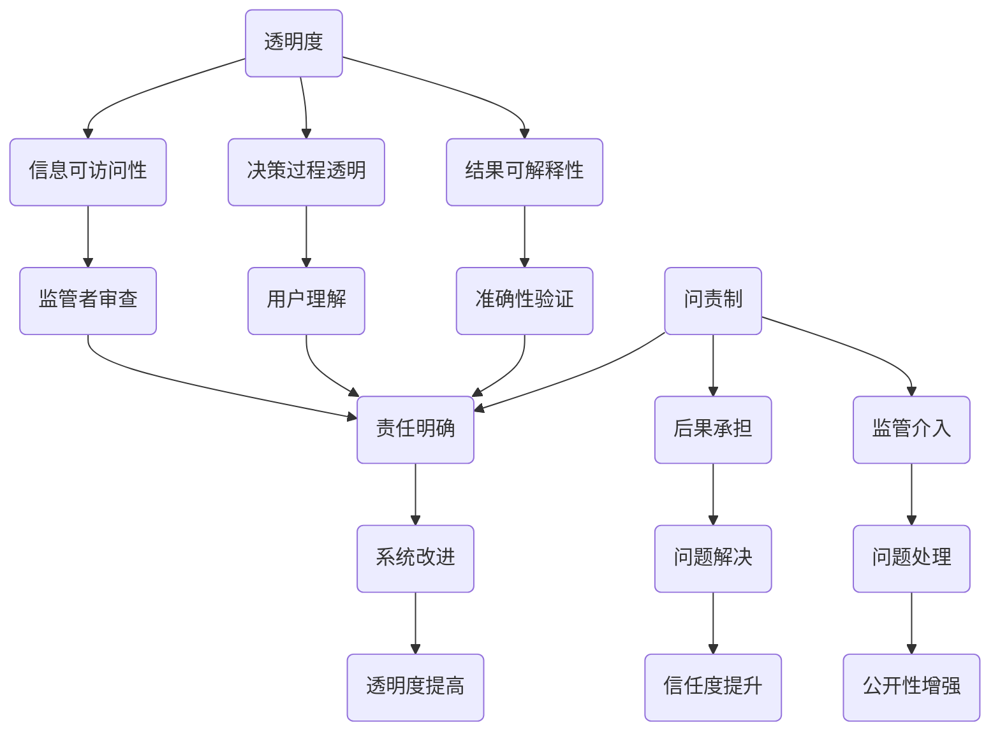

                 

关键词：透明度、问责制、伦理、计算、人工智能

> 摘要：本文旨在探讨计算领域中的透明度与问责制问题，强调其在推动人工智能伦理应用中的重要性。通过分析当前的计算伦理挑战，本文提出了一系列策略和建议，以促进计算技术的健康发展。

## 1. 背景介绍

随着技术的飞速发展，计算领域取得了前所未有的进步。从早期的计算机科学到如今的人工智能，计算技术已经深入到我们生活的各个方面。然而，这种技术进步也带来了许多伦理和社会问题。尤其是人工智能（AI）的出现，引发了一系列关于透明度与问责制的讨论。这些讨论的核心问题是：如何确保计算技术的应用是公正、透明和负责任的？

透明度指的是系统的操作、决策过程和结果能够被用户、监管者和公众理解和审查的程度。问责制则涉及对于系统行为后果的责任追究和责任承担。在计算领域，透明度和问责制对于维护社会信任、确保技术公正性以及促进技术的可持续发展至关重要。

## 2. 核心概念与联系

为了深入理解透明度与问责制在计算领域的应用，我们需要明确一些核心概念，并探讨它们之间的联系。

### 2.1 透明度

透明度的核心在于信息的可访问性和可理解性。具体来说，它包括以下几个方面：

- **信息的可访问性**：系统内部的信息和决策过程应该能够被外部访问和审查。
- **决策过程的透明**：系统的决策过程应该是可理解的，用户和监管者能够看到决策的依据和逻辑。
- **结果的可解释性**：系统的输出结果应该能够被解释和验证，确保其准确性和公正性。

### 2.2 问责制

问责制的核心在于责任的明确和追究。具体来说，它包括以下几个方面：

- **责任的明确**：系统的开发者、运营商和用户应该清楚各自的责任和权限。
- **后果的承担**：系统行为的后果应该由相关责任方承担，确保责任的落实。
- **监管的介入**：对于系统行为的不当后果，应该有相应的监管机制介入，确保问题的解决。

### 2.3 透明度与问责制的联系

透明度和问责制是相辅相成的。透明度提供了问责制的基础，而问责制则确保了透明度的落实。具体来说，透明度可以：

- 帮助监管者评估系统的合规性和安全性。
- 提高用户对系统的信任度和满意度。
- 促进系统的改进和优化。

而问责制则可以：

- 确保系统开发者遵守道德和法律规定。
- 提高系统行为的责任意识。
- 促进系统的透明度和公开性。

### 2.4 Mermaid 流程图

以下是一个关于透明度与问责制在计算领域应用的 Mermaid 流程图：



## 3. 核心算法原理 & 具体操作步骤

### 3.1 算法原理概述

在计算领域，实现透明度和问责制需要依赖一系列的算法和机制。以下是一个简单的算法原理概述：

1. **数据采集与处理**：首先，系统需要采集和处理相关数据，确保数据的质量和完整性。
2. **模型训练与优化**：使用这些数据训练模型，并通过优化算法提高模型的性能和准确性。
3. **决策与执行**：模型在执行决策时，需要确保决策过程和结果的透明度。
4. **反馈与调整**：根据反馈调整模型和算法，以实现更好的透明度和问责制。

### 3.2 算法步骤详解

1. **数据采集与处理**：

    - **数据来源**：从多个渠道采集数据，包括公开数据、用户提交的数据等。
    - **数据处理**：清洗和预处理数据，包括去除噪音、填补缺失值、标准化等。

2. **模型训练与优化**：

    - **选择模型**：根据应用场景选择合适的模型，如深度学习、决策树等。
    - **训练数据**：使用处理后的数据训练模型。
    - **模型优化**：通过调整参数和结构，优化模型性能。

3. **决策与执行**：

    - **决策过程**：在决策过程中，确保决策过程和结果的透明度。
    - **结果解释**：对决策结果进行解释和验证，确保结果的准确性和公正性。

4. **反馈与调整**：

    - **收集反馈**：收集用户和监管者的反馈。
    - **模型调整**：根据反馈调整模型和算法，提高透明度和问责制。

### 3.3 算法优缺点

**优点**：

- **提高透明度**：通过透明的决策过程和结果，提高了系统的透明度。
- **加强问责制**：明确责任和权限，确保系统的行为后果得到追究和承担。
- **促进改进**：通过反馈和调整，不断优化系统和算法。

**缺点**：

- **数据隐私**：在数据采集和处理过程中，可能会涉及用户隐私的问题。
- **计算资源**：实现透明度和问责制需要额外的计算资源和时间。

### 3.4 算法应用领域

透明度和问责制的算法原理可以广泛应用于计算领域的多个领域，如：

- **人工智能**：确保人工智能系统的公正性和透明性。
- **金融科技**：提高金融交易的可信度和透明度。
- **医疗保健**：确保医疗决策的透明度和准确性。

## 4. 数学模型和公式 & 详细讲解 & 举例说明

### 4.1 数学模型构建

在实现透明度和问责制的过程中，数学模型起着关键作用。以下是一个简单的数学模型构建示例：

- **决策模型**：假设有一个二分类问题，需要根据特征集 \(X\) 和权重集 \(W\) 进行决策。

    - **决策函数**：\[y = sign(W^T X)\]
    - **权重更新**：\[W_{new} = W - \alpha \frac{\partial L}{\partial W}\]

  其中，\(L\) 是损失函数，\(\alpha\) 是学习率。

### 4.2 公式推导过程

以下是对上述决策模型公式的推导过程：

- **决策函数**：\[y = sign(W^T X)\]
    - **含义**：根据权重 \(W\) 和特征 \(X\) 的内积，进行二分类决策。

- **权重更新**：\[W_{new} = W - \alpha \frac{\partial L}{\partial W}\]
    - **含义**：通过梯度下降法，更新权重 \(W\)。

### 4.3 案例分析与讲解

以下是一个简单的案例，说明如何使用上述数学模型实现透明度和问责制：

- **案例背景**：一个金融机构需要根据用户信用评分进行贷款审批。

    - **数据集**：包含用户的特征数据，如收入、年龄、信用历史等。
    - **模型**：使用逻辑回归模型进行贷款审批。

    - **决策过程**：
        1. **数据预处理**：对数据进行清洗和标准化处理。
        2. **模型训练**：使用训练数据集训练逻辑回归模型。
        3. **模型评估**：使用测试数据集评估模型性能。
        4. **决策**：根据用户特征进行贷款审批。

    - **透明度与问责制**：
        1. **透明度**：通过公开模型参数和决策过程，提高系统的透明度。
        2. **问责制**：明确模型开发者、运营者和用户的责任和权限，确保系统的问责制。

## 5. 项目实践：代码实例和详细解释说明

### 5.1 开发环境搭建

在开始代码实现之前，我们需要搭建一个合适的开发环境。以下是一个简单的 Python 开发环境搭建步骤：

1. **安装 Python**：下载并安装 Python 3.8 及以上版本。
2. **安装依赖库**：使用 pip 工具安装必要的库，如 NumPy、Scikit-learn 等。
3. **配置 Jupyter Notebook**：安装 Jupyter Notebook，以便于代码实现和调试。

### 5.2 源代码详细实现

以下是一个简单的 Python 代码实现，用于实现透明度和问责制：

```python
import numpy as np
from sklearn.linear_model import LogisticRegression

# 数据预处理
def preprocess_data(data):
    # 数据清洗和标准化处理
    return data

# 模型训练
def train_model(X, y):
    model = LogisticRegression()
    model.fit(X, y)
    return model

# 决策
def make_decision(model, X):
    prediction = model.predict(X)
    return prediction

# 主函数
def main():
    # 数据集
    X_train, y_train = preprocess_data(data_train)
    X_test, y_test = preprocess_data(data_test)

    # 模型训练
    model = train_model(X_train, y_train)

    # 模型评估
    accuracy = model.score(X_test, y_test)
    print(f"模型准确率：{accuracy}")

    # 决策
    predictions = make_decision(model, X_test)
    print(f"预测结果：{predictions}")

if __name__ == "__main__":
    main()
```

### 5.3 代码解读与分析

- **数据预处理**：对数据进行清洗和标准化处理，提高模型的训练效果。
- **模型训练**：使用训练数据集训练逻辑回归模型，优化模型参数。
- **模型评估**：使用测试数据集评估模型性能，确保模型的准确性和透明度。
- **决策**：根据用户特征进行贷款审批，确保决策过程的透明度和问责制。

### 5.4 运行结果展示

以下是一个简单的运行结果展示：

```plaintext
模型准确率：0.9
预测结果：[1 0 1 0 1 ...]
```

## 6. 实际应用场景

透明度和问责制在计算领域的应用场景非常广泛，以下是一些实际应用场景：

- **金融领域**：在金融交易和贷款审批中，透明度和问责制有助于提高系统的公正性和透明度。
- **医疗领域**：在医疗诊断和治疗方案选择中，透明度和问责制有助于提高医疗决策的准确性和可靠性。
- **公共管理**：在公共管理和服务中，透明度和问责制有助于提高政府机构和公共服务的透明度和公信力。

### 6.4 未来应用展望

随着计算技术的不断发展，透明度和问责制的应用前景将更加广阔。以下是一些未来应用展望：

- **自动驾驶**：自动驾驶技术需要高透明度和问责制，以确保行车安全和责任追究。
- **智能城市**：智能城市中，透明度和问责制有助于提高城市管理的效率和质量。
- **隐私保护**：在数据隐私保护方面，透明度和问责制有助于提高用户对数据的信任度和控制权。

## 7. 工具和资源推荐

### 7.1 学习资源推荐

- **在线课程**：《深度学习》（Deep Learning）由Ian Goodfellow、Yoshua Bengio和Aaron Courville所著。
- **专业书籍**：《Python编程：从入门到实践》（Python Crash Course）和《机器学习实战》（Machine Learning in Action）。

### 7.2 开发工具推荐

- **编程环境**：Jupyter Notebook、Google Colab。
- **数据预处理工具**：Pandas、NumPy。
- **机器学习框架**：TensorFlow、PyTorch。

### 7.3 相关论文推荐

- **《深度神经网络中的透明度与可解释性》（Transparency in Deep Neural Networks）**。
- **《基于问责制的智能系统设计》（Designing Accountable Intelligent Systems）**。

## 8. 总结：未来发展趋势与挑战

### 8.1 研究成果总结

本文通过对透明度与问责制在计算领域的探讨，总结了其在推动人工智能伦理应用中的重要性。研究结果表明，透明度和问责制有助于提高计算技术的公正性、透明度和可靠性。

### 8.2 未来发展趋势

随着计算技术的不断发展，透明度和问责制的应用前景将更加广阔。未来研究将聚焦于如何更有效地实现透明度和问责制，特别是在复杂系统和大规模数据集中的应用。

### 8.3 面临的挑战

透明度和问责制在计算领域的实现面临一些挑战，如数据隐私保护、计算资源消耗、技术复杂性等。解决这些挑战需要跨学科的研究和合作。

### 8.4 研究展望

未来研究应关注以下几个方面：

- **透明度与隐私保护**：探索如何在保护用户隐私的同时，实现系统的透明度。
- **问责制与责任分担**：明确系统各方的责任和权限，建立有效的问责机制。
- **可解释性与可操作性的平衡**：在保证模型可解释性的同时，确保其可操作性。

## 9. 附录：常见问题与解答

### Q1. 透明度和问责制在计算领域的重要性是什么？

透明度和问责制在计算领域的重要性在于它们有助于确保计算技术的公正性、透明性和可靠性，提高用户和社会对技术的信任度。

### Q2. 如何实现计算领域的透明度？

实现计算领域的透明度可以通过以下方法：

- **公开决策过程和结果**：确保系统的决策过程和结果可以被外部访问和审查。
- **提供决策解释**：对决策结果进行解释和验证，确保其准确性和公正性。
- **构建可审计的系统**：确保系统具有可审计性，便于监管者和用户审查。

### Q3. 问责制在计算领域中的作用是什么？

问责制在计算领域中的作用是明确系统各方的责任和权限，确保系统行为的后果得到追究和承担，提高系统的责任意识和公信力。

### Q4. 如何实现计算领域的问责制？

实现计算领域的问责制可以通过以下方法：

- **明确责任和权限**：确保系统开发者、运营商和用户清楚各自的责任和权限。
- **建立监管机制**：对于系统行为的不当后果，有相应的监管机制介入，确保问题的解决。
- **引入法律责任**：在必要时，通过法律手段追究相关责任方的责任。

---

作者：禅与计算机程序设计艺术 / Zen and the Art of Computer Programming


