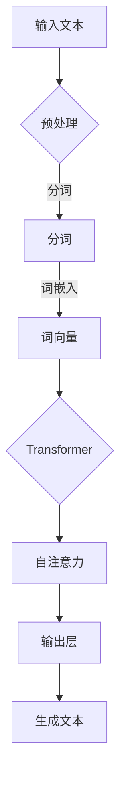

                 

关键词：通用人工智能，大语言模型，底层技术，算法原理，数学模型，应用场景，发展趋势，挑战与展望

> 摘要：本文从底层技术视角深入探讨了通用人工智能（AGI）的发展及其关键推动力——大型语言模型（LLM）。首先，我们回顾了通用人工智能的历史背景和基本概念，接着详细介绍了LLM的核心原理和架构，并通过Mermaid流程图展示了其内部流程。随后，文章探讨了LLM的数学模型和公式，并通过案例分析和代码实例详细解释了其具体应用。最后，我们讨论了LLM在实际应用场景中的挑战和未来展望。

## 1. 背景介绍

通用人工智能（Artificial General Intelligence，AGI）是人工智能（AI）领域的一个长期目标，旨在创建一个具有人类智能的机器。与当前广泛应用的狭义人工智能（Narrow AI）不同，AGI 具有跨领域的智能，能够理解、学习和适应各种复杂任务。自1956年达特茅斯会议以来，通用人工智能一直是人工智能研究的重要方向。

然而，尽管在机器学习、深度学习和自然语言处理等领域取得了显著进展，但实现通用人工智能仍然面临着巨大的挑战。这不仅涉及到算法和技术层面的创新，还需要对人类智能有深刻的理解和建模。

近年来，大型语言模型（Large Language Model，LLM）的兴起为通用人工智能带来了新的机遇。LLM 是一种基于神经网络的语言模型，通过学习大量文本数据，能够生成高质量的自然语言文本。其核心原理是深度学习和自然语言处理，这些技术已经取得了显著的成果，为通用人工智能的实现提供了重要的基础。

本文将从底层技术视角深入探讨通用人工智能的发展及其关键推动力——大型语言模型（LLM）。首先，我们将回顾通用人工智能的历史背景和基本概念，然后详细介绍LLM的核心原理和架构。接着，我们将探讨LLM的数学模型和公式，并通过案例分析和代码实例详细解释其具体应用。最后，我们将讨论LLM在实际应用场景中的挑战和未来展望。

### 1.1 通用人工智能的发展历史

通用人工智能的概念起源于人工智能的早期研究。1956年，约翰·麦卡锡（John McCarthy）等人在达特茅斯会议上提出了“人工智能”的概念，并将其定义为“制造智能机器的科学与工程”。从那时起，人工智能研究经历了多个阶段，包括符号主义、基于规则的系统、人工神经网络、机器学习等。

符号主义阶段（Symbolic AI）：在20世纪50年代和60年代，符号主义是人工智能研究的主流方法。该方法基于逻辑和符号表示，旨在通过推理和规划来模拟人类智能。然而，符号主义方法在面对复杂任务时表现不佳，因为其依赖大量的先验知识和规则。

人工神经网络阶段（Neural Networks）：20世纪80年代，人工神经网络（ANN）成为人工智能研究的热点。ANN 通过模拟人脑神经元之间的连接来处理数据，能够在某些任务上实现良好的性能。然而，早期的神经网络存在训练速度慢、泛化能力差等问题。

机器学习阶段（Machine Learning）：20世纪90年代至21世纪初，机器学习（ML）逐渐成为人工智能研究的核心。与传统的符号主义和人工神经网络不同，机器学习通过数据驱动的方法，让计算机从数据中自动学习和发现模式。这一阶段的代表性技术包括支持向量机、决策树、随机森林等。

深度学习阶段（Deep Learning）：21世纪初，深度学习（DL）技术的崛起标志着人工智能进入了一个新的时代。深度学习通过多层神经网络结构，能够自动提取数据的特征表示，并在图像识别、语音识别、自然语言处理等领域取得了突破性的成果。

近年来，随着计算能力的提升和大数据的普及，深度学习技术得到了广泛的应用。尤其是在自然语言处理领域，大型语言模型（LLM）的出现为通用人工智能的实现带来了新的机遇。

### 1.2 大型语言模型（LLM）的基本概念

大型语言模型（LLM）是一种基于神经网络的语言模型，通过学习大量文本数据，能够生成高质量的自然语言文本。LLM 的核心思想是利用深度学习技术，从大量数据中自动提取语言模式和结构，从而实现对自然语言的理解和生成。

LLM 的发展可以追溯到早期的自然语言处理模型，如基于规则的系统和统计模型。随着深度学习技术的成熟，大型语言模型开始出现，并在近年来取得了显著的成果。代表性的 LLM 模型包括 GPT（Generative Pre-trained Transformer）、BERT（Bidirectional Encoder Representations from Transformers）和 T5（Text-To-Text Transfer Transformer）等。

大型语言模型的显著特点是其能够生成高质量的自然语言文本，并具备一定的理解能力。这使得 LLM 在自然语言处理领域得到了广泛的应用，如文本生成、问答系统、机器翻译、文本分类等。

### 1.3 LLM 在通用人工智能中的作用

大型语言模型（LLM）在通用人工智能（AGI）中扮演着重要的角色。首先，LLM 提供了一种有效的自然语言处理工具，使得机器能够更好地理解和生成人类语言。这对于 AGI 的实现至关重要，因为人类语言是交流和信息传递的重要媒介。

其次，LLM 的能力超出了传统的自然语言处理任务，能够处理更复杂的任务，如多模态数据融合、跨领域知识推理等。这为 AGI 的全面发展提供了基础。

最后，LLM 的研究和应用推动了人工智能技术的进步。通过对 LLM 的研究，我们可以更深入地理解自然语言处理的原理和机制，从而为通用人工智能的实现提供新的思路和方法。

综上所述，大型语言模型（LLM）是通用人工智能（AGI）发展的重要推动力。在接下来的章节中，我们将详细探讨 LLM 的核心原理和架构，以及其在实际应用中的具体操作步骤。

## 2. 核心概念与联系

在本节中，我们将详细探讨大型语言模型（LLM）的核心概念和原理，并通过 Mermaid 流程图展示其内部流程。这将帮助我们更好地理解 LLM 的工作机制，以及其在通用人工智能（AGI）中的作用。

### 2.1 LLM 的核心概念

大型语言模型（LLM）是一种基于深度学习的自然语言处理模型，其主要目标是生成符合自然语言语法和语义的文本。LLM 的核心概念包括以下几个方面：

1. **词嵌入（Word Embedding）**：
   词嵌入是将单词转换为向量表示的过程，这是自然语言处理的基础。通过词嵌入，单词之间的语义关系可以被量化，从而为后续的建模提供基础。

2. **神经网络架构（Neural Network Architecture）**：
   LLM 通常采用深度神经网络架构，尤其是 Transformer 架构。Transformer 架构通过自注意力机制（Self-Attention Mechanism）能够捕捉单词之间的复杂关系，从而提高了模型的表示能力和生成质量。

3. **预训练与微调（Pre-training and Fine-tuning）**：
   预训练是指模型在大规模文本数据上进行训练，以获得对自然语言的一般理解和处理能力。微调则是在预训练的基础上，利用特定任务的数据对模型进行进一步优化，以提高其在特定任务上的性能。

4. **生成文本（Generated Text）**：
   生成文本是 LLM 的核心功能。通过输入任意长度的文本序列，LLM 能够预测下一个单词或句子，并生成连贯且符合语法和语义规则的文本。

### 2.2 LLM 的内部流程

为了更好地理解 LLM 的工作机制，我们可以通过 Mermaid 流程图来展示其内部流程。以下是一个简化的 Mermaid 流程图：

在这个流程图中，输入文本首先经过预处理，包括去除标点符号、转换为小写等。然后，文本被分词成单词或子词，并转换为词向量表示。接下来，词向量通过 Transformer 模型进行编码，Transformer 模型通过自注意力机制处理词向量，并生成自注意力权重。这些权重随后被传递到输出层，输出层通过softmax函数生成概率分布，并根据概率分布生成下一个单词或句子。

### 2.3 LLM 的核心原理

LLM 的核心原理主要包括以下几个方面：

1. **Transformer 架构**：
   Transformer 架构是由 Vaswani 等人于 2017 年提出的一种用于序列建模的深度学习模型。与传统的循环神经网络（RNN）不同，Transformer 架构通过自注意力机制（Self-Attention Mechanism）来处理序列数据，能够同时考虑序列中的所有单词，从而提高了模型的表示能力和生成质量。

2. **多头自注意力（Multi-Head Self-Attention）**：
   在 Transformer 架构中，多头自注意力是一种关键机制。多头自注意力通过将输入序列分成多个子序列，并对每个子序列应用不同的自注意力权重，从而捕捉更丰富的信息。这种方法能够提高模型的泛化能力和表示能力。

3. **位置编码（Positional Encoding）**：
   Transformer 架构通过位置编码来处理序列中的位置信息。位置编码是一种将序列位置信息编码为向量表示的方法，这使得模型能够理解单词的顺序关系。常用的位置编码方法包括绝对位置编码和相对位置编码。

4. **编码器-解码器架构（Encoder-Decoder Architecture）**：
   编码器-解码器架构是 Transformer 架构的一种变体，主要用于序列到序列的建模任务。编码器部分负责对输入序列进行编码，解码器部分负责生成输出序列。编码器和解码器之间通过自注意力机制和交叉注意力机制进行交互，从而提高了模型的生成质量。

### 2.4 LLM 在通用人工智能中的作用

LLM 在通用人工智能（AGI）中扮演着至关重要的角色。首先，LLM 提供了一种高效的自然语言处理工具，使得机器能够更好地理解和生成人类语言。这对于 AGI 的实现至关重要，因为人类语言是交流和信息传递的重要媒介。

其次，LLM 的能力超出了传统的自然语言处理任务，能够处理更复杂的任务，如多模态数据融合、跨领域知识推理等。这为 AGI 的全面发展提供了基础。

最后，LLM 的研究和应用推动了人工智能技术的进步。通过对 LLM 的研究，我们可以更深入地理解自然语言处理的原理和机制，从而为通用人工智能的实现提供新的思路和方法。

综上所述，大型语言模型（LLM）是通用人工智能（AGI）发展的重要推动力。在接下来的章节中，我们将详细探讨 LLM 的数学模型和公式，并通过案例分析和代码实例详细解释其具体应用。

### 3. 核心算法原理 & 具体操作步骤

在了解了大型语言模型（LLM）的核心概念和内部流程后，接下来我们将深入探讨其核心算法原理，具体操作步骤，以及算法的优缺点和应用领域。这将帮助我们更好地理解 LLM 的工作机制，并在实际应用中发挥其潜力。

#### 3.1 算法原理概述

大型语言模型的算法原理主要基于深度学习和自然语言处理技术，其中最典型的架构是 Transformer。Transformer 架构由编码器（Encoder）和解码器（Decoder）两部分组成，通过自注意力（Self-Attention）和多头注意力（Multi-Head Attention）机制实现对输入序列的编码和解码。

1. **编码器（Encoder）**：
   编码器负责对输入序列进行编码，将序列中的每个单词或子词转换为一个高维向量表示。编码器由多个编码层（Encoder Layer）组成，每个编码层包含多头自注意力（Multi-Head Self-Attention）和前馈网络（Feed-Forward Network）两个主要部分。

2. **解码器（Decoder）**：
   解码器负责生成输出序列，将编码器的输出转换为自然语言文本。解码器同样由多个解码层（Decoder Layer）组成，每个解码层包含多头自注意力（Multi-Head Self-Attention）、编码器-解码器注意力（Encoder-Decoder Attention）和前馈网络（Feed-Forward Network）三个主要部分。

3. **自注意力（Self-Attention）**：
   自注意力机制允许模型在同一输入序列内计算单词之间的相互关系，捕捉长距离依赖。自注意力通过计算每个单词与其余单词之间的相似性权重，从而生成一个表示这些关系的向量。

4. **多头注意力（Multi-Head Attention）**：
   多头注意力机制通过将输入序列分成多个子序列，并对每个子序列应用不同的自注意力权重，从而捕捉更丰富的信息。多头注意力能够提高模型的表示能力和泛化能力。

5. **位置编码（Positional Encoding）**：
   位置编码是一种将序列位置信息编码为向量表示的方法，使得模型能够理解单词的顺序关系。位置编码通常与自注意力机制结合使用，以增强模型的上下文理解能力。

6. **前馈网络（Feed-Forward Network）**：
   前馈网络是一种简单的全连接神经网络，用于在编码器和解码器的每个层中对自注意力或多头注意力生成的中间表示进行进一步处理。前馈网络通常包含两个线性变换和一个ReLU激活函数。

#### 3.2 算法步骤详解

以下是大型语言模型（LLM）的主要步骤详解：

1. **数据预处理**：
   - **分词**：将输入文本分割成单词或子词，通常使用分词工具（如 WordPiece）进行处理。
   - **词嵌入**：将分词后的单词或子词转换为高维向量表示，通常使用预训练的词嵌入模型（如 Word2Vec、GloVe）或基于上下文的嵌入方法（如 BERT）。
   - **位置编码**：对每个单词或子词的词嵌入向量添加位置编码，以表示其在输入序列中的位置。

2. **编码器处理**：
   - **输入层**：将词嵌入向量输入编码器。
   - **编码层**：通过多个编码层对输入进行编码，每个编码层包含多头自注意力和前馈网络。
   - **输出层**：编码器的输出是一个固定大小的向量表示，用于后续的解码器处理。

3. **解码器处理**：
   - **输入层**：将编码器的输出作为解码器的输入。
   - **解码层**：通过多个解码层对输入进行解码，每个解码层包含多头自注意力、编码器-解码器注意力和前馈网络。
   - **输出层**：解码器的输出是一个词向量序列，表示生成的自然语言文本。

4. **生成文本**：
   - **预测层**：解码器的输出通过预测层生成单词的概率分布。
   - **采样**：根据概率分布采样下一个单词，并将其添加到生成的文本中。
   - **重复**：重复步骤4，直到生成的文本达到期望长度或满足终止条件。

#### 3.3 算法优缺点

大型语言模型（LLM）的优点和缺点如下：

**优点**：
- **强大的表示能力**：LLM 通过自注意力机制能够捕捉长距离依赖，生成高质量的文本。
- **灵活的架构**：Transformer 架构适用于多种自然语言处理任务，如文本生成、机器翻译、问答系统等。
- **高效的计算**：相较于传统的循环神经网络，Transformer 在计算效率上有显著提升，能够更快地处理大量数据。

**缺点**：
- **资源消耗**：预训练 LLM 需要大量的计算资源和数据，对硬件和存储要求较高。
- **泛化能力有限**：LLM 的预训练任务和数据集有限，可能导致模型在特定任务上的泛化能力不足。
- **解释性不足**：LLM 的内部机制复杂，难以解释模型的决策过程。

#### 3.4 算法应用领域

大型语言模型（LLM）在自然语言处理领域有广泛的应用，以下是一些典型的应用场景：

1. **文本生成**：
   - **故事生成**：生成有趣的故事、文章和小说。
   - **报告生成**：自动生成商务报告、市场分析报告等。

2. **机器翻译**：
   - **跨语言翻译**：实现多种语言之间的自动翻译。
   - **语音识别**：将语音转换为文本。

3. **问答系统**：
   - **智能客服**：为用户提供自动化的客户服务。
   - **知识库查询**：根据用户的问题从知识库中检索答案。

4. **文本分类**：
   - **情感分析**：对文本进行情感分类，判断用户情感倾向。
   - **新闻分类**：将新闻文本分类到不同的主题。

5. **文本摘要**：
   - **自动摘要**：从长篇文章中提取关键信息生成摘要。
   - **会议摘要**：为会议记录生成摘要。

通过深入探讨 LLM 的核心算法原理和具体操作步骤，我们能够更好地理解其工作机制，并在实际应用中发挥其潜力。在接下来的章节中，我们将详细探讨 LLM 的数学模型和公式，并通过案例分析和代码实例进一步解释其应用。

### 4. 数学模型和公式 & 详细讲解 & 举例说明

在了解了大型语言模型（LLM）的核心算法原理后，接下来我们将深入探讨其数学模型和公式，通过详细的讲解和举例说明，帮助读者更好地理解 LL

