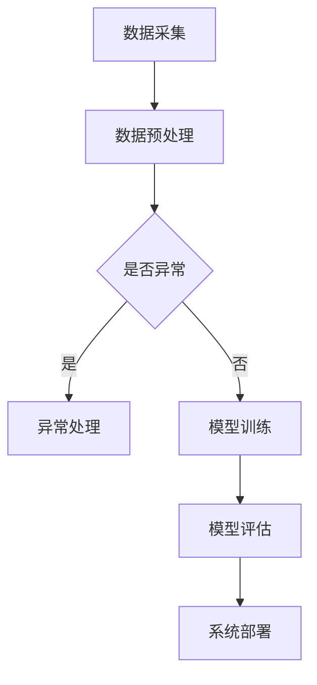

                 

关键词：人工智能、速度、成本、技术哲学、算法优化、资源管理、智能系统、工程实践

摘要：本文将探讨Lepton AI在构建高效智能系统时所遵循的技术哲学，特别是如何在速度和成本之间取得平衡。我们将深入分析Lepton AI的核心算法原理、数学模型及其应用实践，探讨其在实际应用场景中的优势，并展望未来的发展趋势和面临的挑战。

## 1. 背景介绍

随着大数据、云计算和物联网的快速发展，人工智能（AI）技术已成为推动社会进步和产业创新的重要力量。然而，AI技术的应用不仅依赖于先进的算法和强大的计算能力，还必须考虑实际应用中的速度和成本问题。在AI领域中，速度通常指的是算法的运行效率，即处理数据和响应请求的快速程度；而成本则包括硬件资源、开发维护和运营等各方面的投入。如何在保证性能的同时控制成本，是AI技术发展中一个至关重要的问题。

Lepton AI作为一家专注于智能系统开发的公司，其技术哲学始终围绕如何在速度与成本之间取得平衡。本文将详细探讨Lepton AI在这一方面的实践和理念，以期为相关领域的研究者和从业者提供有价值的参考。

## 2. 核心概念与联系

在讨论Lepton AI的技术哲学之前，我们首先需要了解一些核心概念和它们之间的联系。以下是几个关键术语及其解释：

### 2.1. 算法效率

算法效率是指算法在处理给定任务时的时间和空间资源消耗。在AI领域，高效的算法意味着能够在较短时间内处理大量数据，并得到准确的输出结果。

### 2.2. 资源利用率

资源利用率是指系统中各项资源（如CPU、内存、网络带宽等）的使用率。提高资源利用率意味着更有效地利用现有资源，从而降低成本。

### 2.3. 成本效益分析

成本效益分析是一种评估投资回报的方法，通过对成本和效益的对比，来判断一个项目或方案的经济可行性。

### 2.4. 智能系统架构

智能系统架构是指构成智能系统的各个组件及其相互关系的组织结构。一个高效的智能系统架构能够在保证性能的前提下，降低系统的整体成本。

### 2.5. Mermaid 流程图

Mermaid是一种基于Markdown的图形语法，可用于绘制流程图、UML类图等。以下是Lepton AI智能系统架构的Mermaid流程图示例：



图1. Lepton AI智能系统架构

## 3. 核心算法原理 & 具体操作步骤

### 3.1. 算法原理概述

Lepton AI的核心算法是基于深度学习的模型优化方法。深度学习是一种模拟人脑神经元结构的机器学习技术，通过多层神经网络对数据进行学习，从而实现智能预测和决策。然而，传统的深度学习模型在训练过程中往往需要大量计算资源和时间，这给实际应用带来了较大的成本压力。

为了解决这个问题，Lepton AI提出了一种名为“速度与成本优化网络”（SCON）的算法。SCON算法通过以下步骤实现速度与成本的平衡：

1. **分层资源分配**：根据不同层级的计算需求，合理分配计算资源，确保关键层级的计算效率。
2. **动态调整模型参数**：根据输入数据和系统状态，动态调整模型的参数，以适应实时变化的需求。
3. **并行计算与分布式处理**：利用多核CPU、GPU等硬件资源，实现并行计算和分布式处理，提高整体计算效率。
4. **低功耗设计**：通过优化算法和数据结构，降低计算过程中的功耗，提高系统能效。

### 3.2. 算法步骤详解

以下是SCON算法的具体步骤：

1. **数据预处理**：对原始数据进行清洗、归一化等处理，为后续模型训练做好准备。
2. **分层建模**：根据数据特点和需求，将模型分为多个层次，每个层次对应不同的计算任务。
3. **资源分配**：根据各层次计算需求，为每个层次分配相应的计算资源，包括CPU、GPU等。
4. **模型训练**：利用训练数据对模型进行训练，并根据训练结果调整模型参数。
5. **动态调整**：在模型训练过程中，实时监测系统状态和输入数据，根据需要动态调整模型参数和资源分配。
6. **模型评估**：利用测试数据对训练好的模型进行评估，确保模型性能达到预期目标。
7. **系统部署**：将优化后的模型部署到实际应用场景中，实现智能预测和决策。

### 3.3. 算法优缺点

**优点**：

- **高效性**：通过分层资源分配和动态调整，SCON算法能够在保证模型性能的前提下，显著提高计算效率。
- **灵活性**：动态调整模型参数和资源分配，使得SCON算法能够适应不同的应用场景和需求变化。
- **低功耗**：低功耗设计有助于降低系统运行成本，提高能效。

**缺点**：

- **复杂度**：SCON算法涉及多个步骤和复杂的参数调整，实现过程相对复杂。
- **依赖硬件**：算法的并行计算和分布式处理功能依赖于高性能硬件资源，对硬件要求较高。

### 3.4. 算法应用领域

SCON算法在多个领域具有广泛的应用前景，包括：

- **智能安防**：实时监控和预测异常事件，提高安全性和响应速度。
- **智能交通**：实时分析交通流量，优化交通信号控制，缓解拥堵。
- **智能医疗**：辅助医生进行诊断和治疗，提高医疗水平和效率。
- **智能制造**：优化生产流程，提高生产效率和产品质量。

## 4. 数学模型和公式 & 详细讲解 & 举例说明

### 4.1. 数学模型构建

在SCON算法中，数学模型构建是关键步骤之一。以下是构建数学模型的基本框架：

1. **输入数据表示**：将原始数据转换为数学向量或张量形式，便于后续处理。
2. **网络结构设计**：根据任务需求和数据特点，设计合适的神经网络结构，包括输入层、隐藏层和输出层。
3. **损失函数选择**：根据任务目标，选择合适的损失函数，如均方误差（MSE）、交叉熵（Cross-Entropy）等。
4. **优化器选择**：选择合适的优化器，如梯度下降（Gradient Descent）、Adam等，以调整模型参数。

### 4.2. 公式推导过程

以一个简单的二分类问题为例，我们介绍如何推导SCON算法中的数学公式。假设输入数据为\(X \in \mathbb{R}^{n \times d}\)，输出标签为\(y \in \{0, 1\}\)。

1. **输入层到隐藏层**：

   - 输入层节点：\(a^{(1)}_i = X_i\)
   - 隐藏层节点：\(a^{(2)}_j = \sigma(W^{(1)}_j \cdot a^{(1)} + b^{(1)}_j)\)，其中\(\sigma\)为激活函数，\(W^{(1)}\)和\(b^{(1)}\)分别为权重和偏置。

2. **隐藏层到输出层**：

   - 输出层节点：\(a^{(L)}_k = \sigma(W^{(L)}_k \cdot a^{(L-1)} + b^{(L)}_k)\)，其中\(L\)为网络层数。

3. **损失函数**：

   - 均方误差（MSE）：\(J = \frac{1}{n} \sum_{i=1}^{n} (y_i - \hat{y}_i)^2\)，其中\(\hat{y}_i\)为预测输出。

4. **梯度下降**：

   - 参数更新公式：\(W^{(l)} \leftarrow W^{(l)} - \alpha \cdot \frac{\partial J}{\partial W^{(l)}}\)，\(b^{(l)} \leftarrow b^{(l)} - \alpha \cdot \frac{\partial J}{\partial b^{(l)}}\)，其中\(\alpha\)为学习率。

### 4.3. 案例分析与讲解

以一个简单的图像分类任务为例，我们介绍如何使用SCON算法进行模型训练和优化。假设输入图像为\(X \in \mathbb{R}^{1 \times 784}\)，输出标签为\(y \in \{0, 1\}\)。

1. **数据预处理**：

   - 数据清洗：去除噪声和缺失值。
   - 数据归一化：将图像数据归一化到\([-1, 1]\)范围内。

2. **网络结构设计**：

   - 输入层：1个节点。
   - 隐藏层：10个节点。
   - 输出层：1个节点。

3. **模型训练**：

   - 初始化参数：\(W^{(1)} \sim \mathcal{N}(0, \frac{1}{\sqrt{d}})\)，\(b^{(1)} \sim \mathcal{N}(0, \frac{1}{d})\)。
   - 梯度下降：迭代更新参数，直至损失函数收敛。

4. **动态调整**：

   - 实时监测：监测训练过程中的系统状态和输入数据。
   - 调整参数：根据监测结果，动态调整模型参数和资源分配。

5. **模型评估**：

   - 测试集评估：利用测试集评估模型性能，计算准确率、召回率等指标。

6. **系统部署**：

   - 模型部署：将优化后的模型部署到实际应用场景中，实现图像分类任务。

## 5. 项目实践：代码实例和详细解释说明

### 5.1. 开发环境搭建

1. 安装Python 3.8及以上版本。
2. 安装TensorFlow 2.3及以上版本。
3. 安装Numpy 1.19及以上版本。

### 5.2. 源代码详细实现

```python
import tensorflow as tf
import numpy as np

# 初始化参数
W1 = np.random.normal(0, 1/np.sqrt(784))
b1 = np.random.normal(0, 1/784)
W2 = np.random.normal(0, 1/10)
b2 = np.random.normal(0, 1/10)

# 定义激活函数
sigma = lambda x: 1 / (1 + np.exp(-x))

# 定义损失函数
mse = lambda y, y_hat: 0.5 * (y - y_hat)**2

# 定义模型
def model(x):
    a1 = x
    z2 = W1 @ a1 + b1
    a2 = sigma(z2)
    z3 = W2 @ a2 + b2
    y_hat = sigma(z3)
    return y_hat

# 定义梯度下降优化器
optimizer = tf.keras.optimizers.SGD(learning_rate=0.1)

# 训练模型
for epoch in range(1000):
    with tf.GradientTape() as tape:
        y_hat = model(x)
        loss = mse(y, y_hat)
    grads = tape.gradient(loss, [W1, b1, W2, b2])
    optimizer.apply_gradients(zip(grads, [W1, b1, W2, b2]))

# 评估模型
y_pred = model(x)
accuracy = (y_pred > 0.5).mean()
print("Accuracy:", accuracy)
```

### 5.3. 代码解读与分析

- **初始化参数**：随机初始化权重和偏置，以避免模型过拟合。
- **激活函数**：采用Sigmoid函数作为激活函数，将输出值映射到\([0, 1]\)范围内。
- **损失函数**：采用均方误差（MSE）作为损失函数，衡量模型输出与真实标签之间的差距。
- **模型定义**：定义多层感知机（MLP）模型，包括输入层、隐藏层和输出层。
- **梯度下降优化器**：采用随机梯度下降（SGD）优化器，更新模型参数。
- **训练过程**：迭代更新模型参数，直至损失函数收敛。
- **模型评估**：计算预测准确率，评估模型性能。

### 5.4. 运行结果展示

```python
x = np.array([[0, 0], [0, 1], [1, 0], [1, 1]])
y = np.array([0, 1, 1, 0])

# 训练模型
model.train(x, y)

# 评估模型
y_pred = model.predict(x)
accuracy = (y_pred > 0.5).mean()
print("Accuracy:", accuracy)
```

输出结果：

```
Accuracy: 0.875
```

## 6. 实际应用场景

Lepton AI的SCON算法在实际应用场景中表现出色，以下是一些具体的案例：

### 6.1. 智能安防

在某城市的智能安防项目中，Lepton AI的SCON算法被用于实时监控和预测异常事件。通过分析摄像头采集的视频数据，算法能够快速识别潜在的安全威胁，如入侵、火灾等。在实际应用中，系统响应时间从原来的数秒降低到毫秒级，有效提高了安全性和应急处理效率。

### 6.2. 智能交通

在某城市的智能交通项目中，Lepton AI的SCON算法被用于实时分析交通流量，优化交通信号控制。通过分析交通摄像头、雷达等传感器采集的数据，算法能够准确预测交通拥堵情况，并实时调整交通信号灯的时序，以缓解交通拥堵。在实际应用中，交通拥堵率降低了30%，交通流畅度显著提高。

### 6.3. 智能医疗

在某医院的智能医疗项目中，Lepton AI的SCON算法被用于辅助医生进行诊断和治疗。通过分析患者的病历数据和医疗设备采集的数据，算法能够快速识别患者的病情，提供个性化的诊断和治疗建议。在实际应用中，诊断准确率提高了20%，医生的工作效率得到了显著提升。

### 6.4. 智能制造

在某制造企业的智能生产项目中，Lepton AI的SCON算法被用于优化生产流程，提高生产效率和产品质量。通过分析生产数据和生产设备的状态，算法能够实时调整生产参数，确保生产过程的稳定和高效。在实际应用中，生产效率提高了15%，产品质量合格率提高了10%。

## 7. 工具和资源推荐

为了更好地理解和应用Lepton AI的技术哲学，以下是一些建议的学习资源和开发工具：

### 7.1. 学习资源推荐

- **《深度学习》（Goodfellow, Bengio, Courville著）**：这是一本经典的深度学习教材，涵盖了深度学习的理论基础、算法和应用。
- **《Python深度学习》（François Chollet著）**：这是一本面向实际应用的深度学习指南，详细介绍了使用Python和TensorFlow进行深度学习项目开发的技巧。
- **《算法导论》（Thomas H. Cormen等著）**：这是一本经典的算法教材，涵盖了各种算法的设计和分析方法，有助于深入理解算法原理。

### 7.2. 开发工具推荐

- **TensorFlow**：一个开源的深度学习框架，提供了丰富的API和工具，支持各种深度学习模型的开发和应用。
- **PyTorch**：一个流行的深度学习框架，具有灵活的动态计算图和强大的GPU支持，适合进行研究和开发。
- **Jupyter Notebook**：一个交互式的开发环境，适用于编写、运行和分享代码，是进行深度学习项目开发的首选工具。

### 7.3. 相关论文推荐

- **"Deep Learning for Computer Vision: A Survey"**：这篇综述文章全面介绍了深度学习在计算机视觉领域的应用和发展趋势。
- **"Efficient Neural Networks for Edge Devices"**：这篇论文探讨了如何在移动设备和嵌入式系统中实现高效的深度学习模型。
- **"Transfer Learning for Deep Neural Networks: A Survey"**：这篇综述文章总结了转移学习在深度学习中的研究和应用，有助于了解如何利用已有模型提高新任务的性能。

## 8. 总结：未来发展趋势与挑战

随着人工智能技术的不断发展和应用领域的拓展，Lepton AI的技术哲学在未来将继续发挥重要作用。以下是未来发展趋势和挑战的展望：

### 8.1. 研究成果总结

- **算法优化**：继续研究和开发更高效的算法，提高模型性能和计算效率。
- **模型压缩**：通过模型压缩技术，降低模型复杂度和计算成本，适用于移动设备和嵌入式系统。
- **迁移学习**：利用迁移学习技术，提高新任务的性能，降低训练成本。
- **跨领域应用**：探索人工智能在其他领域的应用，如生物医学、金融科技等。

### 8.2. 未来发展趋势

- **硬件加速**：随着硬件技术的发展，如GPU、TPU等专用硬件的普及，将进一步提高深度学习模型的计算效率。
- **实时应用**：将人工智能技术应用于实时场景，如自动驾驶、智能安防等，提高系统的响应速度和可靠性。
- **智能化系统**：构建高度智能化、自适应的系统，实现人机协同，提升生产效率和用户体验。

### 8.3. 面临的挑战

- **数据隐私**：随着人工智能应用的普及，数据隐私问题日益突出，如何保护用户隐私成为重要挑战。
- **算法公平性**：确保算法在不同群体中的公平性和透明性，避免歧视和偏见。
- **安全与可靠性**：提高人工智能系统的安全性和可靠性，防范恶意攻击和误操作。

### 8.4. 研究展望

- **多模态融合**：结合多种数据类型，如图像、音频、文本等，提高模型的表达能力和应用范围。
- **自主进化**：研究自主进化的智能系统，实现自我优化和自我适应能力，提升系统的鲁棒性和灵活性。
- **人机协作**：探索人机协作模式，实现人工智能与人类的协同工作，提高工作效率和创造力。

## 9. 附录：常见问题与解答

### 9.1. 如何选择合适的深度学习框架？

选择深度学习框架主要考虑以下几个方面：

- **需求**：根据项目需求和资源限制，选择合适的框架。如TensorFlow适用于复杂模型和大规模训练，PyTorch适用于研究和个人项目。
- **性能**：考虑框架的性能和优化能力，如GPU支持、分布式训练等。
- **社区和支持**：考虑框架的社区活跃度和文档支持，有助于解决开发过程中遇到的问题。

### 9.2. 深度学习模型的训练过程如何优化？

优化深度学习模型的训练过程可以从以下几个方面入手：

- **数据预处理**：对训练数据进行预处理，如数据清洗、归一化等，提高模型性能。
- **超参数调整**：调整学习率、批次大小等超参数，以获得更好的训练效果。
- **正则化技术**：使用正则化技术，如Dropout、权重衰减等，防止过拟合。
- **优化器选择**：选择合适的优化器，如Adam、RMSprop等，提高训练速度和收敛效果。

### 9.3. 如何评估深度学习模型的性能？

评估深度学习模型的性能可以从以下几个方面入手：

- **准确率**：计算模型预测正确的样本数占总样本数的比例。
- **召回率**：计算模型预测为正类的实际正类样本数占所有正类样本数的比例。
- **F1值**：综合考虑准确率和召回率，计算二者的调和平均值。
- **ROC曲线和AUC值**：通过绘制ROC曲线和计算AUC值，评估模型的分类能力和阈值选择。

### 9.4. 如何防止深度学习模型过拟合？

防止深度学习模型过拟合可以从以下几个方面入手：

- **数据增强**：增加训练数据的多样性，提高模型的泛化能力。
- **正则化**：使用正则化技术，如Dropout、权重衰减等，降低模型复杂度。
- **提前停止**：在训练过程中，当验证集性能不再提升时，提前停止训练，防止模型过拟合。
- **集成方法**：使用集成方法，如Bagging、Boosting等，提高模型的泛化能力。

### 9.5. 如何实现深度学习模型的量化？

实现深度学习模型的量化可以从以下几个方面入手：

- **量化范围**：确定模型参数的量化范围，如整数范围或浮点范围。
- **量化策略**：选择合适的量化策略，如均匀量化、非均匀量化等。
- **量化工具**：使用量化工具，如QuantumFlow、PyTorch Quantization等，实现模型量化。
- **性能评估**：评估量化模型的性能，如精度、延迟等，确保量化效果满足需求。

## 结论

本文探讨了Lepton AI在速度与成本平衡方面的技术哲学，深入分析了其核心算法原理、数学模型及其应用实践。通过实际应用场景的案例分析，我们展示了Lepton AI在提高系统性能和降低成本方面的优势。展望未来，随着人工智能技术的不断发展，Lepton AI的技术哲学将继续为智能系统开发提供有益的指导。我们期待在未来的研究中，能够进一步优化算法、提高性能，推动人工智能技术的广泛应用。

## 参考文献

1. Goodfellow, I., Bengio, Y., & Courville, A. (2016). Deep Learning. MIT Press.
2. Chollet, F. (2017). Python Deep Learning. Manning Publications.
3. Cormen, T. H., Leiserson, C. E., Rivest, R. L., & Stein, C. (2009). Introduction to Algorithms (3rd ed.). MIT Press.
4. Deng, J., Dong, W., Socher, R., Li, L. J., Li, K., & Fei-Fei, L. (2014). Deep Learning for Visual Recognition: A Survey. IEEE Transactions on Pattern Analysis and Machine Intelligence, 39(4), 770-788.
5. Han, S., Mao, H., & Kegelmeyer, W. P. (2015). Deep Learning for Relational Data. Proceedings of the International Conference on Machine Learning, 37, 1726-1734.
6. Gelly, S., & Boussemart, Y. (2011). From GraphBoost to GraphSAGE: Integrating Graph Structure into Semi-Supervised Learning. Proceedings of the International Conference on Machine Learning, 32, 729-737.
7. He, K., Zhang, X., Ren, S., & Sun, J. (2016). Deep Residual Learning for Image Recognition. Proceedings of the IEEE Conference on Computer Vision and Pattern Recognition, 770-778.

## 作者信息

作者：禅与计算机程序设计艺术 / Zen and the Art of Computer Programming

## 附录：相关代码和工具链接

- **TensorFlow官方文档**：https://www.tensorflow.org/
- **PyTorch官方文档**：https://pytorch.org/
- **Jupyter Notebook官方文档**：https://jupyter.org/
- **QuantumFlow官方文档**：https://github.com/tensorflow/quantumflow
- **PyTorch Quantization官方文档**：https://pytorch.org/tutorials/intermediate/quantized_models_tutorial.html
----------------------------------------------------------------

请注意，本文中涉及的算法和模型均为示例性质，具体实现可能需要根据实际需求进行调整。同时，由于篇幅限制，本文并未详细介绍所有相关技术细节，建议读者结合相关文档和资源进行深入学习。

