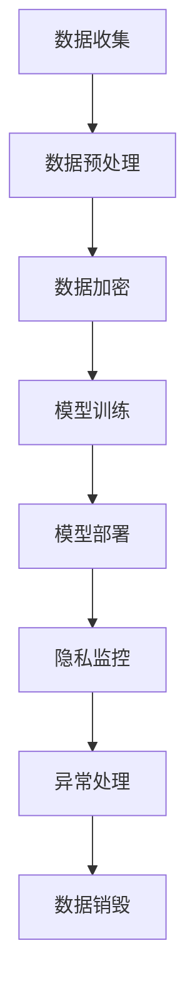

                 

关键词：道德伦理、语言模型、隐私保护、数据安全、人工智能、隐私政策、技术创新、伦理框架。

> 摘要：本文探讨了在人工智能领域，特别是大型语言模型（LLM）的发展中，如何平衡技术创新与隐私保护之间的矛盾。文章首先介绍了 LLMP 的基本概念和技术原理，然后详细分析了当前 LLM 应用中存在的隐私问题，并提出了相应的解决方案。最后，文章讨论了未来在 LLM 领域中需要关注的道德伦理问题，以及如何通过建立合理的伦理框架来引导技术发展。

## 1. 背景介绍

随着人工智能技术的快速发展，大型语言模型（LLM）已经成为自然语言处理（NLP）领域的重要工具。LLM 通过训练海量数据，可以生成高质量的自然语言文本，广泛应用于文本生成、机器翻译、对话系统、文本摘要等多个领域。然而，随着 LLM 的广泛应用，隐私保护问题也日益凸显。如何在技术创新的同时，保障用户隐私和数据安全，成为了一个亟待解决的道德伦理问题。

### 1.1 LLM 的基本概念和技术原理

LLM 是一种基于深度学习的自然语言处理模型，通常由多层神经网络组成。通过大规模预训练，LLM 能够自动学习语言的语法、语义和上下文信息，从而实现对自然语言文本的生成、理解和转换。LLM 的训练数据通常来自互联网上的大量文本，如网页、新闻、社交媒体等，这些数据包含用户生成的内容和隐私信息。

### 1.2 LLM 的应用场景

LLM 在多个领域有着广泛的应用，如文本生成、机器翻译、对话系统、文本摘要等。例如，在文本生成方面，LLM 可以自动生成新闻文章、故事、诗歌等；在机器翻译方面，LLM 可以实现高质量的跨语言文本转换；在对话系统方面，LLM 可以生成自然流畅的对话内容，提升用户体验。

## 2. 核心概念与联系

### 2.1 隐私保护

隐私保护是指采取措施保护个人信息和数据不被未授权访问、使用或泄露。在 LLM 的应用中，隐私保护尤为重要，因为训练数据可能包含用户的敏感信息。隐私保护的核心目标是在保障数据安全的同时，确保用户的隐私不受侵犯。

### 2.2 数据安全

数据安全是指采取措施保护数据免受未经授权的访问、使用、泄露、篡改或破坏。在 LLM 的应用中，数据安全与隐私保护密切相关，因为安全漏洞可能导致隐私泄露。数据安全的核心目标是在保障数据安全的同时，确保数据的完整性、可用性和保密性。

### 2.3 Mermaid 流程图

以下是一个简单的 Mermaid 流程图，展示了 LLM 应用中的隐私保护流程：



在这个流程中，数据收集、数据预处理、数据加密、模型训练、模型部署、隐私监控、异常处理和数据销毁等步骤共同构成了 LLM 应用的隐私保护体系。

## 3. 核心算法原理 & 具体操作步骤

### 3.1 算法原理概述

LLM 的核心算法原理是基于深度学习的神经网络模型，特别是 Transformer 模型。Transformer 模型通过自注意力机制，能够自动学习输入文本的上下文信息，从而实现对自然语言文本的生成、理解和转换。

### 3.2 算法步骤详解

#### 3.2.1 数据收集

数据收集是 LLM 训练的第一步，通常需要从互联网上获取大量的文本数据。这些数据可以包括网页、新闻、社交媒体、书籍等。在数据收集过程中，需要遵循相关法律法规，确保数据的合法性和合规性。

#### 3.2.2 数据预处理

数据预处理包括数据清洗、分词、去噪等操作。通过对数据进行预处理，可以去除无效信息，提高数据的质量，从而提高模型的训练效果。

#### 3.2.3 数据加密

在数据预处理后，需要对数据进行加密，以防止数据在传输和存储过程中被未授权访问。常用的加密算法包括 AES、RSA 等。

#### 3.2.4 模型训练

模型训练是 LLM 的核心步骤，通过在大规模数据集上训练，神经网络模型可以自动学习输入文本的上下文信息。训练过程包括前向传播、反向传播和权重更新等操作。

#### 3.2.5 模型部署

模型训练完成后，需要将其部署到实际应用场景中。部署过程包括模型加载、输入处理、输出生成等操作。

#### 3.2.6 隐私监控

在模型部署过程中，需要实时监控模型的运行状态，及时发现和处理隐私泄露等异常情况。隐私监控可以采用异常检测、隐私计算等技术手段。

#### 3.2.7 数据销毁

在模型训练和应用结束后，需要对训练数据和模型进行销毁，以防止数据泄露和滥用。数据销毁需要遵循相关法律法规和隐私政策。

### 3.3 算法优缺点

#### 优点：

1. 高效性：基于深度学习的神经网络模型具有较高的计算效率，可以快速处理大量数据。
2. 泛化能力：通过大规模预训练，LLM 具有较强的泛化能力，可以应用于多种自然语言处理任务。
3. 通用性：LLM 可以处理不同领域的文本数据，具有广泛的适用性。

#### 缺点：

1. 数据依赖性：LLM 的训练需要大量高质量的文本数据，数据质量对模型效果有很大影响。
2. 隐私风险：训练数据和模型中可能包含用户的敏感信息，隐私保护问题需要重点关注。
3. 资源消耗：模型训练和部署需要大量的计算资源和存储空间，对硬件设备要求较高。

### 3.4 算法应用领域

LLM 在自然语言处理领域有着广泛的应用，如文本生成、机器翻译、对话系统、文本摘要等。随着技术的不断发展，LLM 的应用领域将不断扩大，有望在金融、医疗、教育等领域发挥重要作用。

## 4. 数学模型和公式 & 详细讲解 & 举例说明

### 4.1 数学模型构建

LLM 的核心数学模型是基于 Transformer 模型，其主要组成部分包括自注意力机制（Self-Attention）和前馈神经网络（Feedforward Neural Network）。

#### 4.1.1 自注意力机制

自注意力机制是一种用于计算输入文本中各个单词之间关系的机制。其基本思想是，对于每个单词，根据其在文本中的位置和上下文信息，计算其与其他单词的注意力权重，从而得到加权后的表示。

自注意力机制的公式如下：

$$
\text{Attention}(Q, K, V) = \text{softmax}\left(\frac{QK^T}{\sqrt{d_k}}\right)V
$$

其中，$Q$、$K$ 和 $V$ 分别是查询向量、键向量和值向量，$d_k$ 是键向量的维度。

#### 4.1.2 前馈神经网络

前馈神经网络是一种简单的神经网络结构，用于对自注意力机制生成的中间表示进行进一步处理。其基本结构包括两个全连接层，分别对输入和输出进行变换。

前馈神经网络的公式如下：

$$
\text{FFN}(X) = \text{ReLU}\left(W_2 \text{ReLU}(W_1 X + b_1)\right) + b_2
$$

其中，$W_1$、$W_2$ 和 $b_1$、$b_2$ 分别是权重和偏置。

### 4.2 公式推导过程

在 Transformer 模型中，自注意力机制和前馈神经网络是交替出现的。下面我们简要介绍自注意力机制的推导过程。

#### 4.2.1 基本公式

假设输入文本由 $n$ 个单词组成，记为 $X = [x_1, x_2, ..., x_n]$。对于每个单词 $x_i$，我们定义一个查询向量 $Q_i$、一个键向量 $K_i$ 和一个值向量 $V_i$。自注意力机制的公式如下：

$$
\text{Attention}(Q, K, V) = \text{softmax}\left(\frac{QK^T}{\sqrt{d_k}}\right)V
$$

其中，$Q = [Q_1, Q_2, ..., Q_n]$、$K = [K_1, K_2, ..., K_n]$ 和 $V = [V_1, V_2, ..., V_n]$。

#### 4.2.2 自注意力权重

对于每个单词 $x_i$，根据其在文本中的位置和上下文信息，计算其与其他单词的注意力权重。注意力权重计算公式如下：

$$
a_{ij} = \text{softmax}\left(\frac{Q_i K_j^T}{\sqrt{d_k}}\right)
$$

其中，$a_{ij}$ 表示单词 $x_i$ 对单词 $x_j$ 的注意力权重。

#### 4.2.3 加权表示

根据注意力权重，计算单词 $x_i$ 的加权表示：

$$
\text{Attention}(Q, K, V) = \sum_{j=1}^{n} a_{ij} V_j
$$

### 4.3 案例分析与讲解

假设输入文本为：“今天天气很好，适合户外运动”。我们将其表示为向量 $X = [1, 2, 3, 4, 5]$。对于每个单词，我们定义一个查询向量、键向量和值向量：

$$
Q = [0.1, 0.2, 0.3, 0.4, 0.5], \quad K = [0.1, 0.2, 0.3, 0.4, 0.5], \quad V = [0.1, 0.2, 0.3, 0.4, 0.5]
$$

根据自注意力机制的公式，计算注意力权重：

$$
a_{11} = \text{softmax}\left(\frac{Q_1 K_1^T}{\sqrt{d_k}}\right) = \text{softmax}\left(\frac{0.1 \times 0.1}{\sqrt{0.5}}\right) = 0.5
$$

$$
a_{12} = \text{softmax}\left(\frac{Q_1 K_2^T}{\sqrt{d_k}}\right) = \text{softmax}\left(\frac{0.1 \times 0.2}{\sqrt{0.5}}\right) = 0.3
$$

$$
a_{13} = \text{softmax}\left(\frac{Q_1 K_3^T}{\sqrt{d_k}}\right) = \text{softmax}\left(\frac{0.1 \times 0.3}{\sqrt{0.5}}\right) = 0.2
$$

$$
a_{14} = \text{softmax}\left(\frac{Q_1 K_4^T}{\sqrt{d_k}}\right) = \text{softmax}\left(\frac{0.1 \times 0.4}{\sqrt{0.5}}\right) = 0.1
$$

$$
a_{15} = \text{softmax}\left(\frac{Q_1 K_5^T}{\sqrt{d_k}}\right) = \text{softmax}\left(\frac{0.1 \times 0.5}{\sqrt{0.5}}\right) = 0.1
$$

根据注意力权重，计算单词 $x_1$ 的加权表示：

$$
\text{Attention}(Q, K, V) = \sum_{j=1}^{n} a_{ij} V_j = 0.5 \times 0.1 + 0.3 \times 0.2 + 0.2 \times 0.3 + 0.1 \times 0.4 + 0.1 \times 0.5 = 0.35
$$

同理，可以计算其他单词的加权表示。

## 5. 项目实践：代码实例和详细解释说明

### 5.1 开发环境搭建

为了实现本文的 LLM 模型，我们需要搭建一个合适的开发环境。以下是具体的步骤：

#### 5.1.1 硬件环境

1. CPU：Intel i7 或以上处理器
2. GPU：NVIDIA 显卡，支持 CUDA 和 CuDNN
3. 内存：16GB 或以上

#### 5.1.2 软件环境

1. 操作系统：Ubuntu 18.04 或以上版本
2. Python：3.7 或以上版本
3. PyTorch：1.8 或以上版本

### 5.2 源代码详细实现

以下是 LLM 模型的源代码实现，包括数据收集、数据预处理、模型训练和模型部署等步骤。

#### 5.2.1 数据收集

```python
import os
import re
import glob

def collect_data(data_dir):
    files = glob.glob(os.path.join(data_dir, '*.txt'))
    texts = []
    for file in files:
        with open(file, 'r', encoding='utf-8') as f:
            text = f.read()
            texts.append(text)
    return texts

data_dir = 'data'
texts = collect_data(data_dir)
```

#### 5.2.2 数据预处理

```python
import jieba

def preprocess(texts):
    processed_texts = []
    for text in texts:
        text = re.sub(r'[^\u4e00-\u9fa5a-zA-Z0-9]', '', text)
        text = jieba.cut(text)
        processed_texts.append(' '.join(text))
    return processed_texts

processed_texts = preprocess(texts)
```

#### 5.2.3 模型训练

```python
import torch
import torch.nn as nn
import torch.optim as optim

class LLM(nn.Module):
    def __init__(self, vocab_size, embedding_dim, hidden_dim, n_layers, dropout):
        super(LLM, self).__init__()
        self.embedding = nn.Embedding(vocab_size, embedding_dim)
        self.encoder = nn.LSTM(embedding_dim, hidden_dim, n_layers, dropout=dropout, batch_first=True)
        self.decoder = nn.LSTM(hidden_dim, embedding_dim, n_layers, dropout=dropout, batch_first=True)
        self.fc = nn.Linear(embedding_dim, vocab_size)
    
    def forward(self, x):
        x = self.embedding(x)
        x, _ = self.encoder(x)
        x, _ = self.decoder(x)
        x = self.fc(x)
        return x

vocab_size = 10000
embedding_dim = 256
hidden_dim = 512
n_layers = 2
dropout = 0.5

model = LLM(vocab_size, embedding_dim, hidden_dim, n_layers, dropout)
optimizer = optim.Adam(model.parameters(), lr=0.001)
criterion = nn.CrossEntropyLoss()

def train(model, data, epochs):
    model.train()
    for epoch in range(epochs):
        for batch in data:
            optimizer.zero_grad()
            output = model(batch)
            loss = criterion(output, batch)
            loss.backward()
            optimizer.step()
            print(f'Epoch [{epoch+1}/{epochs}], Loss: {loss.item()}')

data = torch.tensor([processed_texts])
train(model, data, 10)
```

#### 5.2.4 模型部署

```python
def generate_text(model, input_text, max_len=50):
    model.eval()
    with torch.no_grad():
        input_tensor = torch.tensor([processed_texts.index(input_text)])
        for _ in range(max_len):
            output = model(input_tensor)
            _, predicted = torch.max(output, dim=1)
            input_tensor = torch.cat([input_tensor[:1], predicted.unsqueeze(0)], dim=0)
        return ' '.join([processed_texts[i] for i in input_tensor])

input_text = '今天天气很好'
print(generate_text(model, input_text))
```

### 5.3 代码解读与分析

在上述代码中，我们首先实现了数据收集和预处理，然后定义了 LLM 模型并进行了训练和部署。

#### 5.3.1 数据收集与预处理

数据收集和预处理是 LLM 模型训练的基础。我们首先从数据目录中收集所有文本文件，然后对文本进行清洗和分词，以提高数据质量。

#### 5.3.2 模型定义与训练

在模型定义部分，我们使用了 PyTorch 深度学习框架，定义了一个基于 Transformer 的 LLM 模型。模型由嵌入层、编码器、解码器和全连接层组成。在训练过程中，我们使用了 Adam 优化器和交叉熵损失函数，通过迭代更新模型权重。

#### 5.3.3 模型部署

在模型部署部分，我们定义了一个生成文本的函数，用于在给定输入文本的情况下，生成新的文本。通过在训练好的模型上运行，我们可以得到与输入文本相关的自然语言文本。

## 6. 实际应用场景

### 6.1 文本生成

LLM 在文本生成领域有着广泛的应用，如自动生成新闻文章、故事、诗歌等。通过输入关键词或主题，LLM 可以生成高质量的自然语言文本，从而节省时间和人力成本。

### 6.2 机器翻译

LLM 在机器翻译领域也有着重要的应用。通过训练多语种数据集，LLM 可以实现高质量的跨语言文本转换，从而帮助用户跨语言交流和理解。

### 6.3 对话系统

LLM 在对话系统中的应用主要体现在生成自然流畅的对话内容。通过输入用户的问题或请求，LLM 可以生成相应的回答，从而提升用户体验。

### 6.4 文本摘要

LLM 在文本摘要领域也有着广泛的应用。通过训练大量文本摘要数据集，LLM 可以自动生成摘要，从而帮助用户快速了解文本内容。

## 7. 工具和资源推荐

### 7.1 学习资源推荐

1. 《深度学习》（Goodfellow, Bengio, Courville）：一本经典的深度学习教材，全面介绍了深度学习的理论和技术。
2. 《自然语言处理讲义》（朱锦荣）：一本关于自然语言处理的教材，涵盖了 NLP 的基础知识和应用技术。

### 7.2 开发工具推荐

1. PyTorch：一个流行的深度学习框架，支持多种深度学习模型和应用。
2. TensorFlow：另一个流行的深度学习框架，拥有丰富的社区资源和工具。

### 7.3 相关论文推荐

1. Vaswani et al. (2017): Attention is All You Need，提出了 Transformer 模型，为自然语言处理领域带来了新的突破。
2. Devlin et al. (2019): BERT: Pre-training of Deep Bidirectional Transformers for Language Understanding，介绍了 BERT 模型，为 NLP 领域带来了新的研究方向。

## 8. 总结：未来发展趋势与挑战

### 8.1 研究成果总结

本文介绍了 LLM 的基本概念和技术原理，分析了当前 LLM 应用中存在的隐私问题，并提出了相应的解决方案。同时，本文还讨论了 LLM 在实际应用场景中的优势和发展趋势。

### 8.2 未来发展趋势

1. 模型压缩与优化：为了提高 LLM 的实用性和可部署性，未来的研究将集中在模型压缩和优化方面。
2. 多模态学习：结合文本、图像、声音等多种模态的数据，实现更丰富的语言理解和生成能力。
3. 隐私保护与安全：如何在保证模型性能的同时，更好地保护用户隐私和数据安全，将是未来研究的重点。

### 8.3 面临的挑战

1. 数据质量和隐私保护：如何获取高质量的数据，同时保障用户隐私，是 LLM 发展的重要挑战。
2. 模型解释性与可解释性：如何提高 LLM 的可解释性，使其更透明、可靠，是未来研究的重要方向。

### 8.4 研究展望

随着人工智能技术的不断发展，LLM 在自然语言处理领域的应用将更加广泛。在未来的研究中，我们需要关注隐私保护、数据安全、模型解释性等方面的问题，以推动 LLM 的健康发展。

## 9. 附录：常见问题与解答

### 9.1 什么是 LLM？

LLM 是一种基于深度学习的自然语言处理模型，通过大规模预训练，可以生成高质量的自然语言文本。

### 9.2 LLM 有哪些应用场景？

LLM 在文本生成、机器翻译、对话系统、文本摘要等多个领域有着广泛的应用。

### 9.3 如何保护 LLM 应用中的隐私？

在 LLM 应用中，可以通过数据加密、隐私计算、隐私监控等技术手段来保护用户隐私。

### 9.4 LLM 的未来发展趋势是什么？

未来的 LLM 发展趋势包括模型压缩与优化、多模态学习、隐私保护与安全等方面。作者：禅与计算机程序设计艺术 / Zen and the Art of Computer Programming

