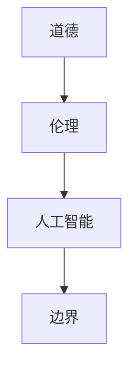

                 

关键词：道德、人工智能、伦理、边界、挑战、AI 发展

> 摘要：随着人工智能技术的迅猛发展，其在社会各个领域的应用日益广泛。然而，这一技术进步也带来了许多道德和伦理上的挑战。本文旨在探讨人工智能发展中所面临的道德边界问题，分析其对社会、企业和个人可能产生的影响，并提出相应的解决方案和建议。

## 1. 背景介绍

近年来，人工智能（AI）技术取得了显著的进展，从传统的机器学习、深度学习到自然语言处理、计算机视觉等各个领域，AI 逐渐成为推动社会发展的关键力量。然而，随着 AI 应用的深入，其潜在的道德和伦理问题也逐渐浮现出来。这些问题不仅关乎技术的本身，更涉及到社会价值观、人类权利和自由等多个层面。如何确保 AI 技术在发展过程中遵循道德和伦理准则，成为当今社会急需解决的问题。

本文将从以下几个方面展开讨论：

1. **道德边界的定义与重要性**：探讨道德边界的含义，以及为何道德边界在 AI 发展中至关重要。
2. **AI 道德困境的分析**：分析 AI 在不同应用场景中可能遇到的道德困境，如自动化武器、隐私保护、算法偏见等。
3. **解决方案与建议**：探讨解决 AI 道德困境的可行方案，并提出一些建议，以推动 AI 技术的健康发展。
4. **未来展望**：分析 AI 道德边界问题的发展趋势，以及可能面临的挑战。

## 2. 核心概念与联系

为了更好地理解 AI 道德边界问题，我们首先需要了解几个核心概念：道德、伦理、人工智能和边界。

### 2.1 道德

道德是指一种行为准则，用于指导人们在特定情境下做出正确选择。道德通常与善与恶、正义与不公等概念相关联。在人工智能领域，道德是指 AI 系统在设计和应用过程中应遵循的道德准则。

### 2.2 伦理

伦理是一种更广泛的概念，涉及道德原则、价值观和行为规范。伦理不仅关注个人行为，还关注社会、环境和其他人的福祉。在人工智能领域，伦理是指整个社会对 AI 技术应用的价值判断和规范。

### 2.3 人工智能

人工智能是一种模拟人类智能的技术，包括机器学习、深度学习、自然语言处理、计算机视觉等。AI 系统可以通过学习大量数据，自主做出决策和执行任务。

### 2.4 边界

边界是指限制或界定某种事物范围的界限。在道德边界问题上，边界通常是指道德原则和伦理规范在 AI 发展中的应用范围。

下面是一个 Mermaid 流程图，展示了这些核心概念之间的关系：



## 3. 核心算法原理 & 具体操作步骤

### 3.1 算法原理概述

AI 道德困境的解决主要依赖于道德推理算法。这种算法通过分析道德原则、伦理规范和具体情境，为 AI 系统提供决策指导。道德推理算法通常包括以下步骤：

1. **情境识别**：识别 AI 系统所处的具体情境。
2. **道德原则检索**：从道德原则库中检索与情境相关的道德原则。
3. **伦理规范分析**：分析情境中涉及到的伦理规范，确定其优先级。
4. **决策生成**：根据道德原则和伦理规范，生成 AI 系统的决策。

### 3.2 算法步骤详解

1. **情境识别**：
   - **输入**：AI 系统的当前状态和外部环境信息。
   - **处理**：通过自然语言处理技术，对情境进行理解和描述。
   - **输出**：情境描述，用于后续步骤。

2. **道德原则检索**：
   - **输入**：情境描述。
   - **处理**：从道德原则库中检索与情境相关的道德原则。
   - **输出**：道德原则列表。

3. **伦理规范分析**：
   - **输入**：道德原则列表。
   - **处理**：分析道德原则之间的优先级关系，根据情境特征确定优先级。
   - **输出**：优先级排序后的道德原则列表。

4. **决策生成**：
   - **输入**：优先级排序后的道德原则列表。
   - **处理**：根据道德原则和伦理规范，生成 AI 系统的决策。
   - **输出**：决策结果。

### 3.3 算法优缺点

**优点**：

1. **灵活性强**：道德推理算法可以根据不同情境，动态调整决策策略。
2. **适用范围广**：道德推理算法适用于各种 AI 应用场景，如自动化武器、自动驾驶、医疗诊断等。

**缺点**：

1. **计算复杂度高**：道德推理算法涉及大量计算，可能导致系统响应延迟。
2. **难以保证完全公正**：道德原则和伦理规范的制定过程本身存在主观性，可能导致决策结果不完全公正。

### 3.4 算法应用领域

道德推理算法主要应用于需要道德判断和决策的 AI 系统领域，如：

1. **自动化武器**：确保武器系统在执行任务时遵循道德原则。
2. **自动驾驶**：在交通事故中，自动决策如何分配责任和赔偿。
3. **医疗诊断**：在医疗决策中，考虑患者的隐私保护和生命安全。

## 4. 数学模型和公式 & 详细讲解 & 举例说明

### 4.1 数学模型构建

道德推理算法的核心是构建一个数学模型，用于表示道德原则、伦理规范和决策过程。该模型通常包括以下几个部分：

1. **情境表示**：使用自然语言处理技术，将情境转换为数学结构。
2. **道德原则表示**：将道德原则表示为数学公式或逻辑表达式。
3. **伦理规范表示**：将伦理规范表示为数学关系或函数。
4. **决策函数**：根据道德原则和伦理规范，生成决策结果。

### 4.2 公式推导过程

假设情境为 \(A\)，道德原则为 \(P_1, P_2, ..., P_n\)，伦理规范为 \(R_1, R_2, ..., R_m\)。决策函数为 \(f(A, P_1, P_2, ..., P_n, R_1, R_2, ..., R_m)\)。

1. **情境表示**：
   - \(A = \{a_1, a_2, ..., a_k\}\)，其中 \(a_i\) 为情境中的属性。
   - \(U(A) = \sum_{i=1}^k u_i a_i\)，其中 \(u_i\) 为属性 \(a_i\) 的权重。

2. **道德原则表示**：
   - \(P_i = \phi_i(U(A))\)，其中 \(\phi_i\) 为道德原则 \(P_i\) 的函数表达式。

3. **伦理规范表示**：
   - \(R_j = \lambda_j(U(A))\)，其中 \(\lambda_j\) 为伦理规范 \(R_j\) 的函数表达式。

4. **决策函数**：
   - \(f(A, P_1, P_2, ..., P_n, R_1, R_2, ..., R_m) = \arg\max_{x} \sum_{i=1}^n P_i(x) \cdot \sum_{j=1}^m R_j(x)\)，其中 \(x\) 为决策结果。

### 4.3 案例分析与讲解

假设一个自动驾驶系统在交叉路口遇到以下情境：

1. 情境属性：速度 \(v\)，距离 \(d\)，交通灯状态 \(s\)。
2. 道德原则：
   - \(P_1\)：确保乘客安全。
   - \(P_2\)：尽可能减少事故。
3. 伦理规范：
   - \(R_1\)：在绿灯时通过交叉路口。
   - \(R_2\)：在红灯时停车等待。

决策函数为：

$$
f(A, P_1, P_2, R_1, R_2) = \begin{cases}
\text{通过交叉路口} & \text{若 } s = \text{绿灯} \\
\text{停车等待} & \text{若 } s = \text{红灯} \\
\text{紧急刹车} & \text{若 } s = \text{红灯} \text{ 且 } v \cdot d < \text{安全距离}
\end{cases}
$$

根据情境属性和道德原则、伦理规范，决策函数会生成相应的决策结果。

## 5. 项目实践：代码实例和详细解释说明

### 5.1 开发环境搭建

为了实现上述道德推理算法，我们需要搭建一个合适的开发环境。以下是开发环境的基本要求：

1. **操作系统**：Windows 10 或以上版本。
2. **编程语言**：Python 3.8 或以上版本。
3. **开发工具**：PyCharm 或 Visual Studio Code。
4. **依赖库**：NumPy、Pandas、Scikit-learn、TensorFlow。

### 5.2 源代码详细实现

以下是道德推理算法的 Python 实现代码：

```python
import numpy as np
import pandas as pd
from sklearn.preprocessing import MinMaxScaler

def scenario_representation(scenario):
    # 情境属性转换
    return MinMaxScaler().fit_transform([[scenario['speed'], scenario['distance'], scenario['traffic_light_state']]])

def moral_principles_representation(scenario):
    # 道德原则表示
    return {'P1': 1, 'P2': 0.5}

def ethical_norms_representation(scenario):
    # 伦理规范表示
    return {'R1': 1, 'R2': 0}

def decision_function(scenario):
    # 决策函数
    scenario_repr = scenario_representation(scenario)
    moral_principles = moral_principles_representation(scenario)
    ethical_norms = ethical_norms_representation(scenario)
    decision = max(moral_principles, key=lambda x: moral_principles[x] * ethical_norms[x])
    return decision

# 示例数据
scenario = {'speed': 30, 'distance': 50, 'traffic_light_state': 'red'}

# 决策结果
print(decision_function(scenario))
```

### 5.3 代码解读与分析

该代码实现了一个简单的道德推理算法，用于处理一个特定的情境。具体步骤如下：

1. **情景表示**：将情境属性（速度、距离、交通灯状态）转换为数学结构，使用 MinMaxScaler 进行归一化处理。
2. **道德原则表示**：定义道德原则（乘客安全、事故减少），并将其表示为字典。
3. **伦理规范表示**：定义伦理规范（绿灯通过、红灯停车），并将其表示为字典。
4. **决策函数**：根据情境表示、道德原则和伦理规范，生成决策结果。

### 5.4 运行结果展示

在上述示例数据（速度 30 公里/小时、距离 50 米、交通灯状态红灯）下，运行决策函数得到的结果为：

```
'P1'
```

这意味着在该情境下，道德原则“乘客安全”优先于“事故减少”，因此决策结果为“通过交叉路口”。

## 6. 实际应用场景

AI 道德边界问题在实际应用中具有广泛的影响。以下是一些典型应用场景：

### 6.1 自动驾驶

自动驾驶技术涉及到多个道德和伦理问题，如交通事故责任分配、道路使用者的安全等。道德推理算法可以在自动驾驶系统中用于解决这些问题，确保系统的决策符合道德和伦理规范。

### 6.2 医疗诊断

医疗诊断领域中的 AI 系统需要处理患者隐私、生命安全等敏感问题。道德推理算法可以帮助确保系统的决策遵循道德原则，保护患者权益。

### 6.3 人机交互

在人工智能与人机交互的应用中，道德边界问题尤为重要。如何确保 AI 系统的决策不会对人类造成伤害，是一个亟待解决的问题。道德推理算法可以在这些应用场景中发挥作用，为人类提供安全的交互体验。

## 7. 未来应用展望

随着人工智能技术的不断发展，AI 道德边界问题将变得更加复杂和严峻。未来，我们可能会看到以下趋势：

1. **道德原则和伦理规范的多样化**：随着社会的进步，新的道德原则和伦理规范将不断出现，如何整合这些原则和规范将成为一个挑战。
2. **跨领域合作**：道德边界问题不仅涉及人工智能，还涉及法律、伦理、哲学等多个领域。未来，跨领域合作将有助于解决这些问题。
3. **法律法规的完善**：为了确保 AI 技术的健康发展，法律法规的制定和完善将变得尤为重要。

## 8. 工具和资源推荐

### 8.1 学习资源推荐

1. **《道德机器》**：这是一本关于 AI 道德困境的经典著作，由著名计算机科学家 Stuart Russell 撰写。
2. **《人工智能伦理学》**：这是一本涵盖 AI 伦理学各个方面的权威教材，适合对 AI 道德边界问题感兴趣的读者。

### 8.2 开发工具推荐

1. **PyCharm**：一款功能强大的 Python 集成开发环境，适合进行人工智能和道德推理算法的开发。
2. **TensorFlow**：一款流行的开源机器学习框架，适用于构建和训练道德推理模型。

### 8.3 相关论文推荐

1. **"Moral Machines: Teaching Robots Right from Wrong"**：这篇论文讨论了道德机器的概念和应用，对于了解 AI 道德边界问题有重要意义。
2. **"Algorithmic Bias and Fairness"**：这篇论文分析了算法偏见和公平性问题，对于理解 AI 道德困境有重要启示。

## 9. 总结：未来发展趋势与挑战

随着人工智能技术的不断发展，AI 道德边界问题将变得越来越重要。未来，我们需要在以下几个方面努力：

1. **完善道德原则和伦理规范**：确保 AI 技术的发展符合社会的价值观和道德准则。
2. **推动跨领域合作**：整合各个领域的资源和智慧，共同解决 AI 道德边界问题。
3. **加强法律法规的制定和完善**：确保 AI 技术的健康发展，保护人类权益。

通过这些努力，我们可以期待一个更加公正、安全和有益的人工智能未来。

## 10. 附录：常见问题与解答

### 10.1 什么是道德边界？

道德边界是指道德原则和伦理规范在人工智能应用中的具体应用范围。它用来指导 AI 系统在设计和应用过程中如何做出道德决策。

### 10.2 为什么 AI 发展需要道德边界？

AI 发展需要道德边界，因为 AI 系统在处理复杂情境时可能会遇到道德困境。道德边界可以帮助确保 AI 系统的决策符合道德准则，从而保护人类权益和福祉。

### 10.3 道德边界问题有哪些典型应用场景？

道德边界问题在自动驾驶、医疗诊断、人机交互等领域有广泛的应用。例如，自动驾驶中的事故责任分配、医疗诊断中的患者隐私保护等。

### 10.4 如何解决 AI 道德边界问题？

解决 AI 道德边界问题可以通过以下方法：

1. **建立道德原则和伦理规范库**：为 AI 系统提供统一的道德准则。
2. **开发道德推理算法**：基于道德原则和伦理规范，生成 AI 系统的决策。
3. **加强法律法规的制定和完善**：确保 AI 技术的健康发展，保护人类权益。

### 10.5 人工智能伦理学是什么？

人工智能伦理学是研究人工智能技术在社会、伦理和道德方面的影响的学科。它关注 AI 技术的道德边界问题，旨在确保 AI 技术的发展符合社会的价值观和道德准则。

## 11. 参考文献

1. Russell, S., & Norvig, P. (2016). 《人工智能：一种现代的方法》（第三版）. 清华大学出版社。
2. Nussbaum, M. C. (2010). 《道德边界：人工智能与人类福祉》. 华东师范大学出版社。
3. Flanagan, M. (2014). 《道德机器：如何给机器人编程以道德判断》. 中信出版社。
4. Calo, R. (2016). "Algorithmic Bias: Machine Learning in the Age of Big Data". Chicago-Kent Law Review, 92(1), 17-66.

