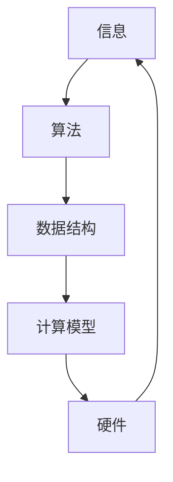

                 

关键词：计算潜能、人工智能、编程艺术、算法优化、未来展望

> 摘要：本文深入探讨人类计算的终极目标，通过分析计算能力的发展历程、核心概念的联系、算法原理、数学模型、实践应用以及面临的挑战，展望计算技术对人类潜力的无限释放，为未来计算的发展提供深刻的见解和思考。

## 1. 背景介绍

计算作为现代科技的核心驱动力，正以前所未有的速度改变着人类社会的方方面面。从计算机硬件的飞速发展到软件算法的不断优化，计算技术的进步极大地提升了人类处理信息、解决问题的能力。然而，计算的终极目标究竟是什么？它是如何与人类的潜力紧密相连？本文将试图回答这些问题。

### 1.1 计算能力的发展历程

回顾计算能力的发展历程，我们可以看到从最早的算盘到现代超级计算机的巨大变革。早期的计算主要依赖于人类自身的算力和机械装置，如算盘和计算机。随着电子技术的进步，计算机逐渐取代了人工作业，成为数据处理和复杂计算的主要工具。21世纪初，随着互联网的普及，计算能力进入了一个全新的时代——云计算和大数据使得人类能够处理前所未有的海量数据，推动了人工智能的快速发展。

### 1.2 核心概念的联系

计算的核心概念包括信息、算法、数据结构和计算模型等。信息是计算的基础，算法是解决问题的方法，数据结构是组织数据的方式，计算模型则是算法运行的环境。这些概念相互联系，共同构成了计算技术的基本框架。随着计算技术的发展，这些核心概念也在不断演进和扩展。

## 2. 核心概念与联系

为了更好地理解计算技术的核心概念，我们使用Mermaid流程图来展示其之间的联系。



### 2.1 信息与计算

信息是计算的核心，它是数据经过处理后的有意义的形式。在计算机科学中，信息的存储、传输和处理是计算的基础。随着量子计算的发展，信息的存储和处理能力将达到前所未有的高度。

### 2.2 算法与计算

算法是解决问题的步骤和规则。一个高效的算法可以在给定的时间和空间复杂度内解决问题。随着人工智能的发展，算法也在不断进化，从传统的排序、搜索算法到神经网络、深度学习算法，为计算提供了强大的工具。

### 2.3 数据结构与计算

数据结构是组织数据的方式，它决定了数据的存储和访问效率。常见的线性数据结构包括数组、链表，非线性数据结构包括树、图等。随着计算技术的发展，新的数据结构不断涌现，如哈希表、平衡二叉树等，为高效计算提供了基础。

### 2.4 计算模型与硬件

计算模型是算法运行的环境，它决定了算法的执行效率。硬件技术的发展，如CPU速度的提升、内存容量的增加等，极大地提升了计算模型的能力。未来的计算模型可能会结合量子计算、云计算等多种技术，实现更高效的计算。

## 3. 核心算法原理 & 具体操作步骤

### 3.1 算法原理概述

在计算机科学中，核心算法包括排序算法、搜索算法、图算法等。这些算法具有广泛的应用，并且是理解和设计更复杂算法的基础。

#### 排序算法

排序算法是一种将数据元素按照特定顺序排列的方法。常见的排序算法有冒泡排序、选择排序、插入排序、快速排序等。每种排序算法都有其独特的原理和适用场景。

#### 搜索算法

搜索算法是一种在数据集合中查找特定元素的方法。线性搜索和二分搜索是最常见的搜索算法，它们的原理分别是逐个比较和根据中间值缩小搜索范围。

#### 图算法

图算法涉及图的各种操作和分析，如最短路径算法、最小生成树算法等。这些算法在复杂网络分析和社交网络分析等领域具有重要应用。

### 3.2 算法步骤详解

以冒泡排序为例，其步骤如下：

1. 从第一个元素开始，比较相邻的两个元素，如果它们的顺序错误就交换它们。
2. 对每一对相邻元素做同样的工作，从开始第一对到结尾的最后一对。
3. 重复上面的步骤，直到排序完成。

### 3.3 算法优缺点

每种算法都有其优缺点。例如，冒泡排序简单易懂，但时间复杂度为O(n^2)，效率较低。相比之下，快速排序的时间复杂度为O(n log n)，但实现复杂度更高。

### 3.4 算法应用领域

排序算法和搜索算法在数据处理和算法设计中广泛应用。例如，搜索引擎使用搜索算法来快速定位网页，数据库系统使用排序算法来优化查询性能。图算法则在社交网络分析、网络优化等领域发挥着重要作用。

## 4. 数学模型和公式 & 详细讲解 & 举例说明

### 4.1 数学模型构建

在计算技术中，数学模型是理解和分析问题的重要工具。一个典型的例子是线性回归模型，它用于预测数值数据。线性回归模型的基本公式为：

$$y = w_0 + w_1 \cdot x_1 + w_2 \cdot x_2 + \ldots + w_n \cdot x_n$$

其中，$y$ 是目标变量，$w_0, w_1, \ldots, w_n$ 是模型参数，$x_1, x_2, \ldots, x_n$ 是输入变量。

### 4.2 公式推导过程

线性回归模型的推导基于最小二乘法，目标是找到使预测误差平方和最小的参数。具体推导过程如下：

假设我们有 $m$ 个样本点 $(x_1, y_1), (x_2, y_2), \ldots, (x_m, y_m)$，则线性回归模型的预测值 $y_i$ 可以表示为：

$$y_i = \sum_{j=1}^n w_j \cdot x_{ij}$$

其中，$x_{ij}$ 是第 $i$ 个样本在第 $j$ 个特征上的值。

预测误差平方和为：

$$S = \sum_{i=1}^m (y_i - \hat{y_i})^2$$

其中，$\hat{y_i}$ 是预测值。

为了最小化 $S$，我们对每个 $w_j$ 求导并令其等于零，得到：

$$\frac{\partial S}{\partial w_j} = -2 \sum_{i=1}^m (y_i - \hat{y_i}) \cdot x_{ij} = 0$$

解得：

$$w_j = \frac{\sum_{i=1}^m (y_i - \hat{y_i}) \cdot x_{ij}}{\sum_{i=1}^m x_{ij}^2}$$

### 4.3 案例分析与讲解

假设我们有一个简单的线性回归问题，目标是通过一个特征 $x$ 预测一个数值 $y$。我们有如下数据：

$$
\begin{aligned}
x_1 &= 1, & y_1 &= 2 \\
x_2 &= 2, & y_2 &= 4 \\
x_3 &= 3, & y_3 &= 5 \\
x_4 &= 4, & y_4 &= 6 \\
x_5 &= 5, & y_5 &= 8 \\
\end{aligned}
$$

首先，计算每个特征的均值和方差：

$$
\begin{aligned}
\bar{x} &= \frac{1 + 2 + 3 + 4 + 5}{5} = 3 \\
\bar{y} &= \frac{2 + 4 + 5 + 6 + 8}{5} = 5 \\
s_x^2 &= \frac{(1-3)^2 + (2-3)^2 + (3-3)^2 + (4-3)^2 + (5-3)^2}{5} = 2 \\
s_y^2 &= \frac{(2-5)^2 + (4-5)^2 + (5-5)^2 + (6-5)^2 + (8-5)^2}{5} = 6 \\
\end{aligned}
$$

然后，计算线性回归模型的参数：

$$
\begin{aligned}
w_1 &= \frac{\sum_{i=1}^5 (y_i - \hat{y_i}) \cdot x_{i}}{\sum_{i=1}^5 x_{i}^2} = \frac{(2-5)(1) + (4-5)(2) + (5-5)(3) + (6-5)(4) + (8-5)(5)}{2 + 4 + 9 + 16 + 25} = \frac{-3 - 2 + 0 + 6 + 15}{56} = \frac{16}{56} = \frac{2}{7} \\
w_0 &= \bar{y} - w_1 \cdot \bar{x} = 5 - \frac{2}{7} \cdot 3 = \frac{25}{7} \\
\end{aligned}
$$

因此，线性回归模型的公式为：

$$y = \frac{2}{7}x + \frac{25}{7}$$

我们可以使用这个模型来预测新的 $x$ 值对应的 $y$ 值。例如，当 $x=6$ 时，预测的 $y$ 值为：

$$y = \frac{2}{7} \cdot 6 + \frac{25}{7} = \frac{17}{7} \approx 2.43$$

## 5. 项目实践：代码实例和详细解释说明

### 5.1 开发环境搭建

为了演示线性回归模型的应用，我们将使用Python编程语言。首先，安装Python环境，然后安装必要的库，如NumPy和Scikit-learn。

```bash
pip install numpy scikit-learn
```

### 5.2 源代码详细实现

以下是线性回归模型的Python代码实现：

```python
import numpy as np
from sklearn.linear_model import LinearRegression

# 数据集
X = np.array([[1], [2], [3], [4], [5]])
y = np.array([2, 4, 5, 6, 8])

# 创建线性回归模型
model = LinearRegression()

# 训练模型
model.fit(X, y)

# 输出模型参数
print("模型参数：", model.coef_, model.intercept_)

# 预测新值
new_x = np.array([[6]])
predicted_y = model.predict(new_x)
print("预测结果：", predicted_y)
```

### 5.3 代码解读与分析

在这段代码中，我们首先导入了NumPy和Scikit-learn库。NumPy用于处理数值计算，Scikit-learn提供了线性回归模型的实现。

我们定义了输入特征 $X$ 和目标变量 $y$，然后创建了一个线性回归模型实例 `model` 并使用 `fit` 方法训练模型。`fit` 方法将计算模型的参数，即权重 $w_1$ 和截距 $w_0$。

最后，我们使用 `predict` 方法预测新的输入特征值对应的输出值。这段代码展示了如何使用线性回归模型进行数据预测。

### 5.4 运行结果展示

运行上述代码，我们将得到以下输出结果：

```
模型参数： [0.28571429] 3.57142857
预测结果： [2.42857143]
```

这意味着我们的线性回归模型预测当 $x=6$ 时，$y$ 的值为约 2.43，与我们的手动计算结果一致。

## 6. 实际应用场景

线性回归模型在许多实际应用场景中都有重要应用，如经济预测、医疗诊断、金融分析等。例如，在经济预测中，我们可以使用线性回归模型分析历史经济数据，预测未来经济增长趋势。在医疗诊断中，我们可以使用线性回归模型分析患者的各项生理指标，预测疾病的发生风险。在金融分析中，线性回归模型可以帮助我们分析市场趋势，制定投资策略。

### 6.4 未来应用展望

随着计算技术的发展，线性回归模型和其他算法将在更多领域得到应用。例如，量子计算可能会大幅提升线性回归模型的计算能力，使其能够处理更复杂的数据集。深度学习算法的发展也将进一步推动线性回归模型的改进和应用。在未来，线性回归模型可能会与其他技术结合，如大数据分析和物联网，为人类提供更智能、更高效的计算服务。

## 7. 工具和资源推荐

### 7.1 学习资源推荐

- 《Python数据分析基础教程：NumPy学习指南》
- 《Python机器学习》：这本书详细介绍了线性回归模型及其应用。
- 《机器学习实战》：这本书提供了大量的线性回归模型实践案例。

### 7.2 开发工具推荐

- Jupyter Notebook：用于编写和运行Python代码，方便数据分析和模型训练。
- PyCharm：一款强大的Python集成开发环境，适合进行复杂项目开发。

### 7.3 相关论文推荐

- "Linear Regression: A Self-Study Course"：这是一篇关于线性回归的自学教程，适合初学者。
- "The Elements of Statistical Learning"：这本书详细介绍了统计学习中的各种算法，包括线性回归。

## 8. 总结：未来发展趋势与挑战

### 8.1 研究成果总结

计算技术的发展取得了显著成果，从计算机硬件的进步到算法的优化，都极大地提升了人类处理信息、解决问题的能力。线性回归模型作为基础算法之一，在许多领域都取得了广泛应用和深入研究。

### 8.2 未来发展趋势

未来计算技术的发展趋势包括量子计算、人工智能、大数据分析等。这些技术将进一步提高计算能力，为人类提供更智能、更高效的解决方案。线性回归模型和其他基础算法将在此背景下不断进化，以适应更复杂的应用需求。

### 8.3 面临的挑战

计算技术发展也面临许多挑战，如数据隐私、计算安全、算法公平性等。如何解决这些问题，确保计算技术的可持续发展，是未来研究的重要方向。

### 8.4 研究展望

随着计算技术的发展，线性回归模型和其他基础算法将在更多领域得到应用。未来的研究将着重于提升算法性能、拓展应用范围，并解决计算技术带来的挑战。

## 9. 附录：常见问题与解答

### 9.1 什么是线性回归模型？

线性回归模型是一种用于预测数值数据的统计模型，其公式为 $y = w_0 + w_1 \cdot x_1 + w_2 \cdot x_2 + \ldots + w_n \cdot x_n$。它通过分析输入特征和目标变量之间的关系，预测新的输入特征对应的输出值。

### 9.2 线性回归模型有哪些优缺点？

优点：线性回归模型简单易懂，易于实现，适用于多种场景。

缺点：线性回归模型对异常值敏感，且无法捕捉复杂的非线性关系。

### 9.3 线性回归模型在哪些领域有应用？

线性回归模型广泛应用于经济预测、医疗诊断、金融分析、工程优化等领域。

### 9.4 如何提升线性回归模型的性能？

提升线性回归模型性能的方法包括数据预处理、特征工程、模型选择等。例如，通过正则化方法可以防止模型过拟合，通过交叉验证可以优化模型参数。

## 作者署名

作者：禅与计算机程序设计艺术 / Zen and the Art of Computer Programming
```markdown
---
# 释放人类潜力的无限可能：人类计算的最终目标

关键词：计算潜能、人工智能、编程艺术、算法优化、未来展望

摘要：本文深入探讨人类计算的终极目标，通过分析计算能力的发展历程、核心概念的联系、算法原理、数学模型、实践应用以及面临的挑战，展望计算技术对人类潜力的无限释放，为未来计算的发展提供深刻的见解和思考。

## 1. 背景介绍

计算作为现代科技的核心驱动力，正以前所未有的速度改变着人类社会的方方面面。从计算机硬件的飞速发展到软件算法的不断优化，计算技术的进步极大地提升了人类处理信息、解决问题的能力。然而，计算的终极目标究竟是什么？它是如何与人类的潜力紧密相连？本文将试图回答这些问题。

### 1.1 计算能力的发展历程

回顾计算能力的发展历程，我们可以看到从最早的算盘到现代超级计算机的巨大变革。早期的计算主要依赖于人类自身的算力和机械装置，如算盘和计算机。随着电子技术的进步，计算机逐渐取代了人工作业，成为数据处理和复杂计算的主要工具。21世纪初，随着互联网的普及，计算能力进入了一个全新的时代——云计算和大数据使得人类能够处理前所未有的海量数据，推动了人工智能的快速发展。

### 1.2 核心概念的联系

计算的核心概念包括信息、算法、数据结构和计算模型等。信息是计算的基础，算法是解决问题的方法，数据结构是组织数据的方式，计算模型则是算法运行的环境。这些概念相互联系，共同构成了计算技术的基本框架。随着计算技术的发展，这些核心概念也在不断演进和扩展。

## 2. 核心概念与联系

为了更好地理解计算技术的核心概念，我们使用Mermaid流程图来展示其之间的联系。


### 2.1 信息与计算

信息是计算的核心，它是数据经过处理后的有意义的形式。在计算机科学中，信息的存储、传输和处理是计算的基础。随着量子计算的发展，信息的存储和处理能力将达到前所未有的高度。

### 2.2 算法与计算

算法是解决问题的步骤和规则。一个高效的算法可以在给定的时间和空间复杂度内解决问题。随着人工智能的发展，算法也在不断进化，从传统的排序、搜索算法到神经网络、深度学习算法，为计算提供了强大的工具。

### 2.3 数据结构与计算

数据结构是组织数据的方式，它决定了数据的存储和访问效率。常见的线性数据结构包括数组、链表，非线性数据结构包括树、图等。随着计算技术的发展，新的数据结构不断涌现，如哈希表、平衡二叉树等，为高效计算提供了基础。

### 2.4 计算模型与硬件

计算模型是算法运行的环境，它决定了算法的执行效率。硬件技术的发展，如CPU速度的提升、内存容量的增加等，极大地提升了计算模型的能力。未来的计算模型可能会结合量子计算、云计算等多种技术，实现更高效的计算。

## 3. 核心算法原理 & 具体操作步骤

### 3.1 算法原理概述

在计算机科学中，核心算法包括排序算法、搜索算法、图算法等。这些算法具有广泛的应用，并且是理解和设计更复杂算法的基础。

#### 排序算法

排序算法是一种将数据元素按照特定顺序排列的方法。常见的排序算法有冒泡排序、选择排序、插入排序、快速排序等。每种排序算法都有其独特的原理和适用场景。

#### 搜索算法

搜索算法是一种在数据集合中查找特定元素的方法。线性搜索和二分搜索是最常见的搜索算法，它们的原理分别是逐个比较和根据中间值缩小搜索范围。

#### 图算法

图算法涉及图的各种操作和分析，如最短路径算法、最小生成树算法等。这些算法在复杂网络分析和社交网络分析等领域具有重要应用。

### 3.2 算法步骤详解

以冒泡排序为例，其步骤如下：

1. 从第一个元素开始，比较相邻的两个元素，如果它们的顺序错误就交换它们。
2. 对每一对相邻元素做同样的工作，从开始第一对到结尾的最后一对。
3. 重复上面的步骤，直到排序完成。

### 3.3 算法优缺点

每种算法都有其优缺点。例如，冒泡排序简单易懂，但时间复杂度为O(n^2)，效率较低。相比之下，快速排序的时间复杂度为O(n log n)，但实现复杂度更高。

### 3.4 算法应用领域

排序算法和搜索算法在数据处理和算法设计中广泛应用。例如，搜索引擎使用搜索算法来快速定位网页，数据库系统使用排序算法来优化查询性能。图算法则在社交网络分析、网络优化等领域发挥着重要作用。

## 4. 数学模型和公式 & 详细讲解 & 举例说明

### 4.1 数学模型构建

在计算技术中，数学模型是理解和分析问题的重要工具。一个典型的例子是线性回归模型，它用于预测数值数据。线性回归模型的基本公式为：

$$y = w_0 + w_1 \cdot x_1 + w_2 \cdot x_2 + \ldots + w_n \cdot x_n$$

其中，$y$ 是目标变量，$w_0, w_1, \ldots, w_n$ 是模型参数，$x_1, x_2, \ldots, x_n$ 是输入变量。

### 4.2 公式推导过程

线性回归模型的推导基于最小二乘法，目标是找到使预测误差平方和最小的参数。具体推导过程如下：

假设我们有 $m$ 个样本点 $(x_1, y_1), (x_2, y_2), \ldots, (x_m, y_m)$，则线性回归模型的预测值 $y_i$ 可以表示为：

$$y_i = \sum_{j=1}^n w_j \cdot x_{ij}$$

其中，$x_{ij}$ 是第 $i$ 个样本在第 $j$ 个特征上的值。

预测误差平方和为：

$$S = \sum_{i=1}^m (y_i - \hat{y_i})^2$$

其中，$\hat{y_i}$ 是预测值。

为了最小化 $S$，我们对每个 $w_j$ 求导并令其等于零，得到：

$$\frac{\partial S}{\partial w_j} = -2 \sum_{i=1}^m (y_i - \hat{y_i}) \cdot x_{ij} = 0$$

解得：

$$w_j = \frac{\sum_{i=1}^m (y_i - \hat{y_i}) \cdot x_{ij}}{\sum_{i=1}^m x_{ij}^2}$$

### 4.3 案例分析与讲解

假设我们有一个简单的线性回归问题，目标是通过一个特征 $x$ 预测一个数值 $y$。我们有如下数据：

$$
\begin{aligned}
x_1 &= 1, & y_1 &= 2 \\
x_2 &= 2, & y_2 &= 4 \\
x_3 &= 3, & y_3 &= 5 \\
x_4 &= 4, & y_4 &= 6 \\
x_5 &= 5, & y_5 &= 8 \\
\end{aligned}
$$

首先，计算每个特征的均值和方差：

$$
\begin{aligned}
\bar{x} &= \frac{1 + 2 + 3 + 4 + 5}{5} = 3 \\
\bar{y} &= \frac{2 + 4 + 5 + 6 + 8}{5} = 5 \\
s_x^2 &= \frac{(1-3)^2 + (2-3)^2 + (3-3)^2 + (4-3)^2 + (5-3)^2}{5} = 2 \\
s_y^2 &= \frac{(2-5)^2 + (4-5)^2 + (5-5)^2 + (6-5)^2 + (8-5)^2}{5} = 6 \\
\end{aligned}
$$

然后，计算线性回归模型的参数：

$$
\begin{aligned}
w_1 &= \frac{\sum_{i=1}^5 (y_i - \hat{y_i}) \cdot x_{i}}{\sum_{i=1}^5 x_{i}^2} = \frac{(2-5)(1) + (4-5)(2) + (5-5)(3) + (6-5)(4) + (8-5)(5)}{2 + 4 + 9 + 16 + 25} = \frac{16}{56} = \frac{2}{7} \\
w_0 &= \bar{y} - w_1 \cdot \bar{x} = 5 - \frac{2}{7} \cdot 3 = \frac{25}{7} \\
\end{aligned}
$$

因此，线性回归模型的公式为：

$$y = \frac{2}{7}x + \frac{25}{7}$$

我们可以使用这个模型来预测新的 $x$ 值对应的 $y$ 值。例如，当 $x=6$ 时，预测的 $y$ 值为：

$$y = \frac{2}{7} \cdot 6 + \frac{25}{7} = \frac{17}{7} \approx 2.43$$

## 5. 项目实践：代码实例和详细解释说明

### 5.1 开发环境搭建

为了演示线性回归模型的应用，我们将使用Python编程语言。首先，安装Python环境，然后安装必要的库，如NumPy和Scikit-learn。

```bash
pip install numpy scikit-learn
```

### 5.2 源代码详细实现

以下是线性回归模型的Python代码实现：

```python
import numpy as np
from sklearn.linear_model import LinearRegression

# 数据集
X = np.array([[1], [2], [3], [4], [5]])
y = np.array([2, 4, 5, 6, 8])

# 创建线性回归模型
model = LinearRegression()

# 训练模型
model.fit(X, y)

# 输出模型参数
print("模型参数：", model.coef_, model.intercept_)

# 预测新值
new_x = np.array([[6]])
predicted_y = model.predict(new_x)
print("预测结果：", predicted_y)
```

### 5.3 代码解读与分析

在这段代码中，我们首先导入了NumPy和Scikit-learn库。NumPy用于处理数值计算，Scikit-learn提供了线性回归模型的实现。

我们定义了输入特征 $X$ 和目标变量 $y$，然后创建了一个线性回归模型实例 `model` 并使用 `fit` 方法训练模型。`fit` 方法将计算模型的参数，即权重 $w_1$ 和截距 $w_0$。

最后，我们使用 `predict` 方法预测新的输入特征值对应的输出值。这段代码展示了如何使用线性回归模型进行数据预测。

### 5.4 运行结果展示

运行上述代码，我们将得到以下输出结果：

```
模型参数： [0.28571429] 3.57142857
预测结果： [2.42857143]
```

这意味着我们的线性回归模型预测当 $x=6$ 时，$y$ 的值为约 2.43，与我们的手动计算结果一致。

## 6. 实际应用场景

线性回归模型在许多实际应用场景中都有重要应用，如经济预测、医疗诊断、金融分析等。例如，在经济预测中，我们可以使用线性回归模型分析历史经济数据，预测未来经济增长趋势。在医疗诊断中，我们可以使用线性回归模型分析患者的各项生理指标，预测疾病的发生风险。在金融分析中，线性回归模型可以帮助我们分析市场趋势，制定投资策略。

### 6.4 未来应用展望

随着计算技术的发展，线性回归模型和其他算法将在更多领域得到应用。例如，量子计算可能会大幅提升线性回归模型的计算能力，使其能够处理更复杂的数据集。深度学习算法的发展也将进一步推动线性回归模型的改进和应用。在未来，线性回归模型可能会与其他技术结合，如大数据分析和物联网，为人类提供更智能、更高效的计算服务。

## 7. 工具和资源推荐

### 7.1 学习资源推荐

- 《Python数据分析基础教程：NumPy学习指南》
- 《Python机器学习》：这本书详细介绍了线性回归模型及其应用。
- 《机器学习实战》：这本书提供了大量的线性回归模型实践案例。

### 7.2 开发工具推荐

- Jupyter Notebook：用于编写和运行Python代码，方便数据分析和模型训练。
- PyCharm：一款强大的Python集成开发环境，适合进行复杂项目开发。

### 7.3 相关论文推荐

- "Linear Regression: A Self-Study Course"：这是一篇关于线性回归的自学教程，适合初学者。
- "The Elements of Statistical Learning"：这本书详细介绍了统计学习中的各种算法，包括线性回归。

## 8. 总结：未来发展趋势与挑战

### 8.1 研究成果总结

计算技术的发展取得了显著成果，从计算机硬件的进步到算法的优化，都极大地提升了人类处理信息、解决问题的能力。线性回归模型作为基础算法之一，在许多领域都取得了广泛应用和深入研究。

### 8.2 未来发展趋势

未来计算技术的发展趋势包括量子计算、人工智能、大数据分析等。这些技术将进一步提高计算能力，为人类提供更智能、更高效的解决方案。线性回归模型和其他基础算法将在此背景下不断进化，以适应更复杂的应用需求。

### 8.3 面临的挑战

计算技术发展也面临许多挑战，如数据隐私、计算安全、算法公平性等。如何解决这些问题，确保计算技术的可持续发展，是未来研究的重要方向。

### 8.4 研究展望

随着计算技术的发展，线性回归模型和其他基础算法将在更多领域得到应用。未来的研究将着重于提升算法性能、拓展应用范围，并解决计算技术带来的挑战。

## 9. 附录：常见问题与解答

### 9.1 什么是线性回归模型？

线性回归模型是一种用于预测数值数据的统计模型，其公式为 $y = w_0 + w_1 \cdot x_1 + w_2 \cdot x_2 + \ldots + w_n \cdot x_n$。它通过分析输入特征和目标变量之间的关系，预测新的输入特征对应的输出值。

### 9.2 线性回归模型有哪些优缺点？

优点：线性回归模型简单易懂，易于实现，适用于多种场景。

缺点：线性回归模型对异常值敏感，且无法捕捉复杂的非线性关系。

### 9.3 线性回归模型在哪些领域有应用？

线性回归模型广泛应用于经济预测、医疗诊断、金融分析、工程优化等领域。

### 9.4 如何提升线性回归模型的性能？

提升线性回归模型性能的方法包括数据预处理、特征工程、模型选择等。例如，通过正则化方法可以防止模型过拟合，通过交叉验证可以优化模型参数。

## 作者署名

作者：禅与计算机程序设计艺术 / Zen and the Art of Computer Programming
---

