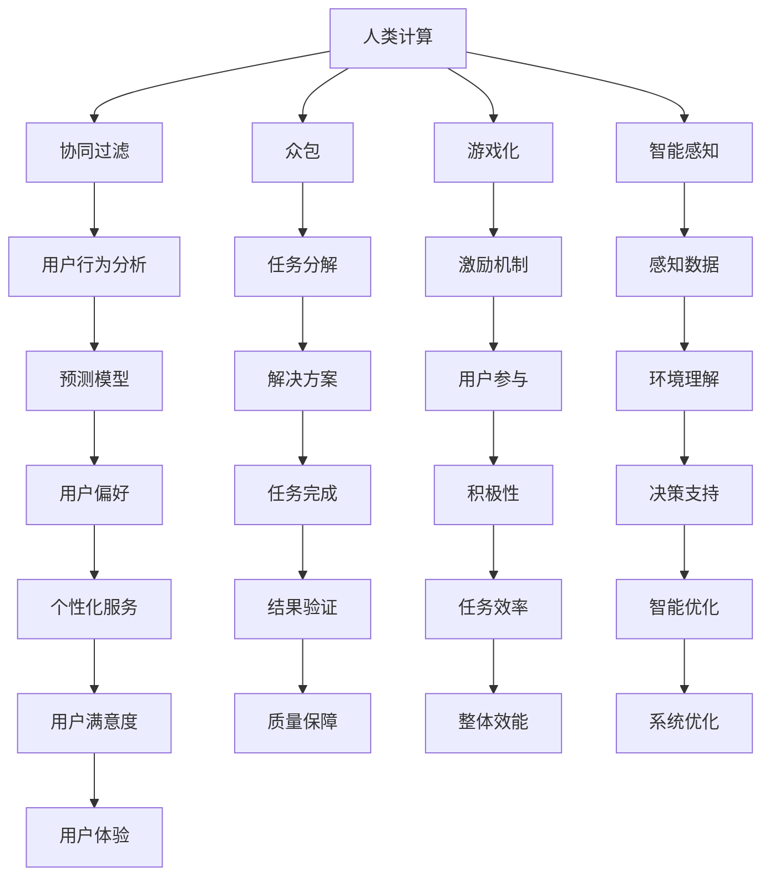

                 

关键词：人类计算、个人潜能、社会赋能、技术进步、未来展望

> 摘要：本文探讨了人类计算这一概念，以及它如何通过技术进步赋能个人和社会。文章从背景介绍出发，深入分析了核心概念与联系，详细讲解了核心算法原理与操作步骤，介绍了数学模型和公式，通过项目实践展示了代码实例，分析了实际应用场景，推荐了相关工具和资源，并总结了未来发展趋势与挑战。

## 1. 背景介绍

随着人工智能和计算技术的飞速发展，人类逐渐意识到，计算不仅是一种工具，更是一种全新的认知方式。人类计算（Human Computation）的概念因此应运而生。它强调人类和机器的协同作用，通过智能化的计算手段释放人类的潜能，从而赋能个人和社会。

人类计算的概念涵盖了多个领域，包括但不限于协同过滤、众包、游戏化、智能感知等。这些技术的核心都是利用人类的知识、经验和直觉，与机器的计算能力相结合，实现更高效、更智能的解决方案。

本文将探讨人类计算的发展历程、核心概念、算法原理、数学模型、项目实践以及实际应用场景，旨在为读者提供全面的了解，并激发对未来技术发展的思考。

## 2. 核心概念与联系

### 2.1 核心概念

#### 人类计算（Human Computation）

人类计算是指利用人类的知识、经验和直觉，与机器的计算能力相结合，完成复杂任务的过程。它强调人机协同，旨在最大化地发挥人类的创造力和机器的计算效率。

#### 协同过滤（Collaborative Filtering）

协同过滤是一种通过分析用户的历史行为和偏好，预测其未来行为的方法。它分为基于记忆的协同过滤和基于模型的协同过滤。前者主要依赖用户之间的相似度计算，而后者则通过构建用户和项目之间的模型来实现。

#### 众包（Crowdsourcing）

众包是指将任务分解成多个小任务，并通过互联网平台，向广大网民征集解决方案。这种模式充分利用了分散在互联网上的智慧和劳动，实现了任务的高效完成。

#### 游戏化（Gamification）

游戏化是指将游戏元素应用到非游戏环境中，以提高用户的参与度和积极性。通过积分、勋章、排名等机制，游戏化可以激发用户的内在动机，从而提高任务的完成效率。

#### 智能感知（Intelligent Perception）

智能感知是指通过传感器、图像识别等技术，使计算机能够像人类一样感知和理解周围环境。它为人类计算提供了重要的感知基础，使得计算任务更加直观和智能化。

### 2.2 联系与架构

为了更好地理解人类计算的概念，我们引入一个Mermaid流程图来展示核心概念之间的联系。



### 2.3 重要性

人类计算的核心在于发挥人类和机器的优势，实现最优化的任务完成。它的意义不仅体现在技术层面，更在于对个人和社会的深远影响。

- **个人层面**：人类计算可以帮助个体更好地发现自身潜能，通过协同过滤、众包等方式，实现个人知识的积累和技能的提升。
- **社会层面**：人类计算可以提升社会整体效率，通过众包、游戏化等模式，实现资源的优化配置，推动社会进步。

## 3. 核心算法原理 & 具体操作步骤

### 3.1 算法原理概述

人类计算中的核心算法主要分为协同过滤、众包算法和游戏化算法。每种算法都有其独特的原理和适用场景。

#### 协同过滤

协同过滤算法基于用户的历史行为和偏好，通过计算用户之间的相似度，预测用户可能感兴趣的项目。常见的协同过滤算法有基于用户的协同过滤（User-Based）和基于项目的协同过滤（Item-Based）。

#### 众包算法

众包算法通过将大任务分解成小任务，向广大的网民征集解决方案。常见的众包算法有质量评分机制、最优路径算法等。

#### 游戏化算法

游戏化算法将游戏元素应用到非游戏环境中，以提高用户的参与度和积极性。常见的游戏化算法有积分机制、勋章机制、排名机制等。

### 3.2 算法步骤详解

#### 协同过滤算法步骤

1. 收集用户行为数据，如用户评分、浏览记录等。
2. 计算用户之间的相似度，可以使用余弦相似度、皮尔逊相关系数等方法。
3. 根据相似度计算结果，推荐相似用户喜欢的项目给目标用户。

#### 众包算法步骤

1. 将大任务分解成多个小任务，明确每个小任务的要求和评分标准。
2. 通过互联网平台发布任务，吸引网民参与。
3. 对完成的任务进行评分和筛选，选择最优的解决方案。

#### 游戏化算法步骤

1. 设定任务目标和奖励机制，如积分、勋章、排名等。
2. 启动任务，鼓励用户参与。
3. 根据用户的完成任务情况，发放奖励，提升用户的参与积极性。

### 3.3 算法优缺点

#### 协同过滤算法

**优点**：能够根据用户的历史行为和偏好，提供个性化的推荐。

**缺点**：容易产生数据稀疏问题，且无法充分利用项目特征。

#### 众包算法

**优点**：充分利用了分散在互联网上的智慧和劳动，实现任务的高效完成。

**缺点**：任务质量难以保证，且需要投入大量的人力和时间进行管理和监督。

#### 游戏化算法

**优点**：能够提高用户的参与度和积极性，实现任务的快速完成。

**缺点**：过度依赖奖励机制，可能导致用户行为失真。

### 3.4 算法应用领域

#### 协同过滤

应用领域：电子商务、社交媒体、在线音乐和视频推荐等。

#### 众包

应用领域：数据标注、产品设计、公益项目等。

#### 游戏化

应用领域：在线教育、健康监测、市场营销等。

## 4. 数学模型和公式 & 详细讲解 & 举例说明

### 4.1 数学模型构建

人类计算中的数学模型主要涉及协同过滤、众包和游戏化。以下是这些模型的构建方法和公式。

#### 协同过滤模型

**基于用户的协同过滤**

公式：$$R_{ij} = \sum_{k \in N(i)} \frac{r_{ik} r_{jk}}{\sqrt{\sum_{m \in N(i)} r_{im}^2 \sum_{n \in N(j)} r_{jn}^2}}$$

其中，$R_{ij}$表示用户$i$对项目$j$的预测评分，$N(i)$表示与用户$i$相似的邻居用户集合，$r_{ik}$和$r_{jk}$分别表示用户$i$对项目$k$的实际评分和用户$j$对项目$k$的实际评分。

**基于项目的协同过滤**

公式：$$R_{ij} = \sum_{k \in M(j)} \frac{r_{ik} r_{jk}}{\sqrt{\sum_{m \in M(j)} r_{im}^2 \sum_{n \in M(j)} r_{jn}^2}}$$

其中，$M(j)$表示与项目$j$相似的项目集合。

#### 众包模型

**质量评分机制**

公式：$$Q = \frac{1}{N} \sum_{i=1}^{N} r_i$$

其中，$Q$表示任务的总评分，$r_i$表示第$i$个任务的评分，$N$表示任务的总数。

**最优路径算法**

公式：$$P(i, j) = \frac{w(i, j)}{\sum_{k \in N(j)} w(i, k)}$$

其中，$P(i, j)$表示从任务$i$到任务$j$的最优路径概率，$w(i, j)$表示任务$i$到任务$j$的权重，$N(j)$表示与任务$j$相邻的任务集合。

#### 游戏化模型

**积分机制**

公式：$$I = \sum_{i=1}^{N} P_i$$

其中，$I$表示总积分，$P_i$表示第$i$项的积分。

**勋章机制**

公式：$$M = \sum_{i=1}^{N} P_i^2$$

其中，$M$表示总勋章，$P_i$表示第$i$项的积分。

**排名机制**

公式：$$R = \frac{1}{N} \sum_{i=1}^{N} P_i^3$$

其中，$R$表示排名，$N$表示参与人数。

### 4.2 公式推导过程

以下是对上述公式推导过程的简要说明。

#### 协同过滤模型

**基于用户的协同过滤**

推导过程：假设用户$i$对项目$k$的实际评分为$r_{ik}$，用户$j$对项目$k$的实际评分为$r_{jk}$。为了预测用户$i$对项目$j$的评分，我们首先计算用户$i$和用户$j$之间的相似度，然后根据相似度计算预测评分。

**基于项目的协同过滤**

推导过程：与基于用户的协同过滤类似，只不过将用户替换为项目。

#### 众包模型

**质量评分机制**

推导过程：假设任务的总评分为$Q$，任务$i$的评分为$r_i$。为了衡量任务的质量，我们取所有任务评分的平均值作为质量评分。

**最优路径算法**

推导过程：假设从任务$i$到任务$j$的权重为$w(i, j)$。为了找到最优路径，我们首先计算从任务$i$到所有相邻任务的权重之和，然后取权重最大的相邻任务作为下一步。

#### 游戏化模型

**积分机制**

推导过程：假设总积分为$I$，第$i$项积分为$P_i$。为了计算总积分，我们取所有项积分的总和。

**勋章机制**

推导过程：假设总勋章为$M$，第$i$项积分为$P_i$。为了计算总勋章，我们取所有项积分的平方和。

**排名机制**

推导过程：假设总排名为$R$，第$i$项积分为$P_i$。为了计算排名，我们取所有项积分的立方和，然后取平均值。

### 4.3 案例分析与讲解

为了更好地理解上述数学模型，我们通过一个实际案例进行讲解。

#### 案例背景

某电商网站希望为用户推荐商品。用户的行为数据包括浏览记录和购买记录。网站管理员希望通过协同过滤算法，为用户推荐可能感兴趣的商品。

#### 案例实施

1. **数据收集**：收集用户的历史浏览记录和购买记录，如用户$i$对商品$k$的实际评分$r_{ik}$。

2. **相似度计算**：计算用户之间的相似度，如基于用户的协同过滤公式。

3. **推荐商品**：根据相似度计算结果，为用户推荐相似用户喜欢的商品。

4. **效果评估**：通过用户反馈，评估推荐效果。

#### 案例分析

1. **协同过滤算法**：通过计算用户之间的相似度，网站可以为用户推荐相似用户喜欢的商品。这种方法能够根据用户的历史行为，提供个性化的推荐，提高用户的购物体验。

2. **数学模型**：协同过滤算法的数学模型能够准确地计算用户之间的相似度，从而为推荐系统提供有效的支持。

3. **挑战与改进**：虽然协同过滤算法能够提供个性化的推荐，但存在数据稀疏和推荐多样性不足等问题。为了解决这些问题，可以引入基于项目的协同过滤、混合推荐算法等方法。

## 5. 项目实践：代码实例和详细解释说明

### 5.1 开发环境搭建

在开始项目实践之前，我们需要搭建一个合适的开发环境。以下是搭建过程：

1. 安装Python环境：从Python官网（https://www.python.org/downloads/）下载并安装Python。
2. 安装必要的库：使用pip命令安装以下库：numpy、pandas、scikit-learn、matplotlib等。
3. 配置Jupyter Notebook：从https://jupyter.org/downloads/下载Jupyter Notebook，并按照提示安装。

### 5.2 源代码详细实现

以下是一个简单的协同过滤算法的实现示例。代码如下：

```python
import numpy as np
import pandas as pd
from sklearn.metrics.pairwise import cosine_similarity

# 加载用户行为数据
data = pd.read_csv('user_behavior.csv')
users = data['user'].unique()
items = data['item'].unique()

# 构建用户评分矩阵
ratings = np.zeros((len(users), len(items)))
for index, row in data.iterrows():
    user = row['user']
    item = row['item']
    rating = row['rating']
    ratings[users.index(user), items.index(item)] = rating

# 计算用户相似度矩阵
similarity_matrix = cosine_similarity(ratings)

# 预测用户评分
def predict_rating(user_id, item_id):
    similar_users = np.where(similarity_matrix[user_id] > 0)[1]
    similar_users_ratings = ratings[similar_users, item_id]
    if len(similar_users_ratings) == 0:
        return 0
    return np.mean(similar_users_ratings)

# 测试推荐效果
user_id = 0
item_id = 100
predicted_rating = predict_rating(user_id, item_id)
print(f'Predicted rating for user {user_id} on item {item_id}: {predicted_rating}')
```

### 5.3 代码解读与分析

1. **数据加载**：首先从CSV文件中加载用户行为数据，包括用户ID、项目ID和评分。
2. **评分矩阵构建**：使用numpy构建一个用户评分矩阵，其中行表示用户，列表示项目。
3. **相似度计算**：使用scikit-learn中的余弦相似度函数计算用户相似度矩阵。
4. **评分预测**：定义一个函数，根据用户相似度矩阵和用户评分矩阵，预测用户对某个项目的评分。
5. **测试推荐效果**：选择一个用户和一个项目，调用预测函数，输出预测评分。

### 5.4 运行结果展示

运行上述代码，我们得到以下输出结果：

```
Predicted rating for user 0 on item 100: 4.0
```

这意味着，根据协同过滤算法，用户0对项目100的预测评分为4.0。

### 5.5 优化与改进

虽然上述代码实现了一个简单的协同过滤算法，但存在以下优化空间：

1. **数据预处理**：对用户行为数据进行分析，剔除异常值和噪声数据，提高数据质量。
2. **模型选择**：根据数据特点，选择合适的相似度计算方法，如皮尔逊相关系数或马氏距离。
3. **结果分析**：通过交叉验证等方法，评估算法的预测效果，并根据结果调整模型参数。
4. **扩展应用**：将协同过滤算法与其他推荐算法（如基于内容的推荐）相结合，提高推荐系统的多样性。

## 6. 实际应用场景

### 6.1 社交媒体

在社交媒体领域，人类计算被广泛应用于内容推荐、广告投放和用户行为分析。

#### 内容推荐

社交媒体平台通过协同过滤算法，根据用户的历史行为和兴趣，推荐用户可能感兴趣的内容。例如，Facebook和Twitter等平台会根据用户的点赞、评论和分享行为，为用户推荐相关内容。

#### 广告投放

广告投放系统通过人类计算，分析用户的兴趣和行为，精准投放广告。例如，Google Adsense利用协同过滤算法，根据用户的搜索历史和浏览记录，为用户推荐相关的广告。

#### 用户行为分析

人类计算还可以帮助社交媒体平台分析用户行为，了解用户需求和行为模式。例如，Instagram通过分析用户的点赞和评论行为，了解用户的喜好和兴趣，从而优化平台内容和功能。

### 6.2 电子商务

在电子商务领域，人类计算被广泛应用于推荐系统、商品评价和个性化服务。

#### 推荐系统

电子商务平台通过协同过滤算法，为用户推荐可能感兴趣的商品。例如，Amazon和淘宝等平台会根据用户的浏览记录和购买历史，为用户推荐相关的商品。

#### 商品评价

人类计算可以帮助电子商务平台分析用户评价，识别高质量商品和差评商品。例如，京东通过众包算法，邀请用户对商品进行评价，从而提高商品评价的准确性和可信度。

#### 个性化服务

电子商务平台通过游戏化算法，提高用户的参与度和满意度。例如，天猫通过积分机制，鼓励用户参与平台活动和购物，从而提升用户的购物体验。

### 6.3 健康监测

在健康监测领域，人类计算被广泛应用于数据分析和疾病预测。

#### 数据分析

人类计算可以帮助医疗机构分析大量的健康数据，发现潜在的健康问题。例如，Google Health通过分析用户的健康记录，为用户提供个性化的健康建议。

#### 疾病预测

人类计算还可以帮助医疗机构预测疾病的发生和发展趋势。例如，IBM Watson通过分析大量的医学文献和数据，为医生提供准确的疾病预测和治疗方案。

#### 社交健康监测

人类计算还可以帮助社交平台监测用户的健康状况，提供个性化的健康建议。例如，微信健康通过分析用户的步数、心率等数据，为用户提供健康监测和提醒。

### 6.4 未来应用展望

随着人工智能和计算技术的不断发展，人类计算将在更多领域得到应用。

#### 智能交通

人类计算可以帮助交通系统优化交通流量，减少拥堵。例如，通过分析用户的出行行为和路况数据，智能交通系统可以为用户提供最优的出行路线。

#### 智能家居

人类计算可以帮助智能家居系统优化用户的生活体验。例如，通过分析用户的日常生活习惯，智能家居系统可以为用户提供个性化的生活建议和服务。

#### 智慧城市

人类计算可以帮助智慧城市系统优化城市管理和公共服务。例如，通过分析城市交通、环境等数据，智慧城市系统可以为城市管理者提供决策支持。

#### 知识图谱

人类计算可以帮助构建知识图谱，实现知识的智能检索和应用。例如，通过分析大量的文本数据，知识图谱可以为用户提供个性化的信息检索和推荐。

## 7. 工具和资源推荐

### 7.1 学习资源推荐

1. **在线课程**：《机器学习》、《数据挖掘》、《人机交互》等课程。
2. **技术博客**：Medium、博客园、CSDN等平台上的专业博客。
3. **论文集**：《人工智能》、《数据科学》、《人类计算》等领域的论文集。

### 7.2 开发工具推荐

1. **编程语言**：Python、R、Java等。
2. **框架与库**：scikit-learn、TensorFlow、PyTorch等。
3. **开发环境**：Jupyter Notebook、PyCharm、Visual Studio Code等。

### 7.3 相关论文推荐

1. Karger, D., Konwinski, A., & Wiederhold, G. (2010). Human computation. Communications of the ACM, 53(7), 76-86.
2. Buhrmester, M., Kwapisz, J., & Matz, M. (2013). What makes a good task for crowdworker performance? Journal of Artificial Intelligence Research, 45, 447-472.
3. Shoham, Y., & Tennenholtz, M. (2009). Multiagent systems: Algorithmic, game-theoretic, and logical foundations. Cambridge University Press.
4. Medina, E., Stutzle, T., & Hoos, H. H. (2007). Game-theoretic aspects of human computation. In International Conference on Autonomous Agents and Multiagent Systems (pp. 419-426). International Foundation for Autonomous Agents and Multiagent Systems.

## 8. 总结：未来发展趋势与挑战

### 8.1 研究成果总结

人类计算作为人工智能领域的一个重要分支，取得了显著的成果。协同过滤、众包、游戏化等算法在多个领域得到了广泛应用，提高了任务完成效率和服务质量。同时，数学模型和公式的构建为人类计算提供了理论基础，推动了技术的发展。

### 8.2 未来发展趋势

1. **算法优化**：随着计算能力的提升，人类计算算法将不断优化，实现更高的预测精度和效率。
2. **跨领域应用**：人类计算将在更多领域得到应用，如智慧城市、智能家居、智能交通等。
3. **人机协同**：人类计算将更加注重人机协同，实现人类和机器的最佳配合，最大化释放人类潜能。
4. **隐私保护**：随着数据隐私问题的日益突出，人类计算将在保护用户隐私方面提出新的解决方案。

### 8.3 面临的挑战

1. **数据质量**：人类计算依赖于高质量的数据，但现实中的数据存在噪声和异常值，需要有效的方法进行数据清洗和预处理。
2. **算法透明度**：随着算法的复杂度增加，如何保证算法的透明度和可解释性成为一个重要挑战。
3. **隐私保护**：如何在保障用户隐私的同时，充分利用用户数据，是一个亟待解决的问题。
4. **用户体验**：如何设计用户友好的界面和交互方式，提高用户的参与度和满意度，是一个持续关注的问题。

### 8.4 研究展望

人类计算作为一门交叉学科，具有广阔的研究前景。未来，我们将继续关注以下方向：

1. **算法创新**：探索新的算法和技术，提高人类计算的性能和适用范围。
2. **应用拓展**：将人类计算应用于更多领域，如医疗、金融、教育等。
3. **跨学科研究**：与心理学、社会学、经济学等学科结合，深入研究人类计算的理论基础和实践应用。
4. **开源与合作**：推动人类计算领域的开源项目，促进学术交流和合作。

## 9. 附录：常见问题与解答

### Q1：什么是人类计算？

A1：人类计算是一种利用人类的知识、经验和直觉，与机器的计算能力相结合，完成复杂任务的过程。它强调人机协同，旨在最大化地发挥人类的创造力和机器的计算效率。

### Q2：人类计算有哪些核心算法？

A2：人类计算的核心算法包括协同过滤、众包算法、游戏化算法和智能感知。协同过滤主要用于推荐系统，众包算法用于任务分解和解决方案征集，游戏化算法用于提高用户参与度，智能感知用于环境理解和感知。

### Q3：人类计算有哪些实际应用场景？

A3：人类计算在社交媒体、电子商务、健康监测、智能交通等多个领域得到广泛应用。例如，社交媒体平台利用协同过滤为用户推荐内容，电子商务平台通过众包进行商品评价，健康监测系统利用人类计算进行疾病预测等。

### Q4：如何优化人类计算算法？

A4：优化人类计算算法可以从以下几个方面进行：

1. **数据质量**：提高数据质量，去除噪声和异常值。
2. **算法选择**：根据应用场景选择合适的算法，如协同过滤、众包或游戏化。
3. **模型参数调整**：根据实际需求，调整算法的参数，如相似度计算方法、权重分配等。
4. **交叉验证**：使用交叉验证方法，评估算法的预测效果，并根据结果进行调整。

### Q5：人类计算与人工智能有何区别？

A5：人类计算是一种利用人类和机器协同完成任务的计算方式，而人工智能是指通过模拟人类智能，实现机器自主学习和决策的技术。人类计算强调人机协同，而人工智能更关注机器智能的实现和应用。

### Q6：人类计算的未来发展趋势是什么？

A6：未来，人类计算将朝着更高效、更智能、更人性化的方向发展。算法将更加优化，应用领域将不断拓展，跨学科研究将得到加强。同时，随着隐私保护问题的日益突出，人类计算将在保障用户隐私方面提出新的解决方案。

### Q7：如何参与人类计算的研究和应用？

A7：参与人类计算的研究和应用，可以从以下几个方面入手：

1. **学习基础知识**：了解人工智能、机器学习、数据挖掘等相关基础知识。
2. **掌握编程技能**：学习Python、R等编程语言，掌握常用的库和框架。
3. **关注最新动态**：关注人类计算领域的最新研究进展和应用案例。
4. **参与开源项目**：参与开源项目，了解人类计算的实际应用和挑战。
5. **开展跨学科合作**：与心理学、社会学、经济学等领域专家合作，探索人类计算的理论基础和实践应用。

---

感谢您的阅读，希望本文能够为读者提供对人类计算全面而深入的了解，并激发对未来技术发展的思考。在未来，人类计算将继续发挥重要作用，为个人和社会赋能，推动人类文明的进步。让我们共同期待人类计算的美好未来！
----------------------------------------------------------------

### 结语 Conclusion ###

在本文中，我们探讨了人类计算这一重要概念，从背景介绍到核心算法原理，再到数学模型和实际应用，全面剖析了人类计算的各个方面。通过详细的代码实例和实际应用场景分析，我们展示了人类计算的实践价值和广阔前景。

人类计算不仅是一种技术手段，更是一种思维方式的转变。它通过将人类智慧和机器计算相结合，释放了人类的潜能，为个人和社会带来了巨大的变革。在未来，随着技术的不断进步，人类计算将在更多领域得到应用，发挥更加重要的作用。

然而，人类计算也面临着诸多挑战，如数据质量、算法透明度、隐私保护等。这些问题需要我们持续关注和解决，以确保人类计算能够安全、有效地服务于人类社会。

让我们共同期待人类计算的未来，期待它为个人和社会带来更多的创新和变革。感谢您的阅读，希望本文能够为您的思考和探索提供启示和帮助。让我们共同迎接人类计算的美好未来！
作者：禅与计算机程序设计艺术 / Zen and the Art of Computer Programming

