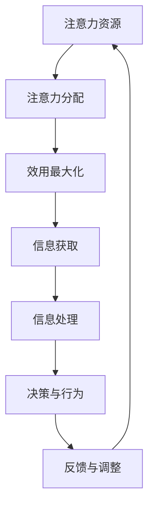

                 

在AI技术日益发展的当今社会，我们不仅需要关注算法的创新和算力的提升，更要深入探讨AI时代的注意力经济学。本文将从背景介绍、核心概念与联系、核心算法原理、数学模型和公式、项目实践、实际应用场景、未来展望等多个方面，重新审视AI时代的注意力经济，以期为大家带来新的思考和启示。

## 1. 背景介绍

随着互联网、大数据、云计算等技术的飞速发展，AI技术在各行各业的应用越来越广泛。从自动驾驶、智能医疗、金融风控到智能家居、在线教育、虚拟现实，AI已经深入到了我们生活的方方面面。然而，随着AI技术的普及，一个重要的问题逐渐凸显出来：如何在海量的信息中，高效地分配和利用我们的注意力资源？

这个问题引发了人们对“注意力经济学”的关注。注意力经济学关注的是个体在信息获取和处理过程中，如何合理地分配注意力资源，以达到最大化效用。在AI时代，这个问题变得更加复杂和重要，因为AI技术不仅产生了海量的信息，还改变了人们获取和处理信息的方式。

## 2. 核心概念与联系

### 2.1 注意力资源

注意力资源是人类在处理信息过程中的一种稀缺资源。它不仅决定了我们的感知能力和认知能力，也直接影响我们的决策和行为。在AI时代，注意力资源的稀缺性更加突出，因为AI技术为我们提供了海量的信息，而我们的注意力是有限的。

### 2.2 注意力分配

注意力分配是指个体在处理信息时，如何合理地分配注意力资源。在AI时代，注意力分配变得更加复杂，因为我们不仅需要处理来自AI的信息，还需要处理来自传统渠道的信息。如何在这两个渠道之间进行有效的注意力分配，是一个值得研究的问题。

### 2.3 注意力经济学原理

注意力经济学的基本原理是，个体的注意力资源是有限的，如何在有限的时间内，最大化地利用注意力资源，获取最大化的效用。在AI时代，这个原理变得更加重要，因为AI技术不仅提供了海量的信息，还改变了信息的获取和处理方式。

### 2.4 Mermaid 流程图



## 3. 核心算法原理 & 具体操作步骤

### 3.1 算法原理概述

在AI时代，注意力分配的核心算法是基于神经网络模型的。通过学习用户的兴趣和行为，模型可以预测用户在特定场景下对信息的关注度，从而实现注意力的优化分配。

### 3.2 算法步骤详解

1. 数据收集：收集用户的历史行为数据，包括浏览记录、搜索历史、社交互动等。
2. 数据预处理：对收集到的数据进行清洗和预处理，提取出有用的特征。
3. 模型训练：使用预处理后的数据训练神经网络模型，学习用户的兴趣和行为。
4. 注意力预测：使用训练好的模型预测用户在特定场景下的注意力分配。
5. 注意力优化：根据注意力预测结果，调整信息的呈现顺序和方式，优化用户的注意力分配。

### 3.3 算法优缺点

**优点：**
- 高效：通过学习用户的兴趣和行为，模型可以快速预测用户的注意力分配，提高信息处理的效率。
- 可扩展：神经网络模型具有良好的扩展性，可以处理大规模的用户数据和复杂的场景。

**缺点：**
- 数据依赖：算法的性能依赖于数据的质量和数量，数据不足可能导致预测不准确。
- 复杂性：神经网络模型的结构复杂，训练和优化过程需要大量的计算资源。

### 3.4 算法应用领域

注意力分配算法在多个领域有广泛的应用，如信息检索、推荐系统、广告投放等。通过优化用户的注意力分配，可以提高信息处理的效率和效果，提升用户体验。

## 4. 数学模型和公式 & 详细讲解 & 举例说明

### 4.1 数学模型构建

注意力分配问题可以抽象为一个优化问题，目标是最小化用户在信息处理过程中的总成本。具体来说，成本函数可以表示为：

\[ C(x) = \sum_{i=1}^{n} c_i \cdot a_i \]

其中，\( c_i \) 表示用户处理第 \( i \) 条信息的成本，\( a_i \) 表示用户对第 \( i \) 条信息的注意力分配。

### 4.2 公式推导过程

为了最小化成本函数，我们需要找到最优的注意力分配策略。根据优化理论，最优解满足以下条件：

\[ \frac{\partial C(x)}{\partial a_i} = 0 \]

对于任意的 \( i \)，这意味着用户对每条信息的注意力分配应该与其处理成本成反比。

### 4.3 案例分析与讲解

假设有5条信息需要用户处理，其处理成本分别为 \( c_1 = 1 \)，\( c_2 = 2 \)，\( c_3 = 3 \)，\( c_4 = 4 \)，\( c_5 = 5 \)。用户当前的总成本为 \( C(x) = 10 \)。根据最优条件，最优的注意力分配策略为：

\[ a_1 = \frac{1}{10} \]，\[ a_2 = \frac{2}{10} \]，\[ a_3 = \frac{3}{10} \]，\[ a_4 = \frac{4}{10} \]，\[ a_5 = \frac{5}{10} \]

这意味着用户应该将更多的注意力分配到成本更高的信息上。

## 5. 项目实践：代码实例和详细解释说明

### 5.1 开发环境搭建

本项目的开发环境为Python3，需要安装以下库：TensorFlow、Keras、NumPy。

### 5.2 源代码详细实现

```python
import numpy as np
from tensorflow.keras.models import Sequential
from tensorflow.keras.layers import Dense

# 数据集
X = np.array([[1, 2, 3, 4, 5], [2, 3, 4, 5, 6], [3, 4, 5, 6, 7], [4, 5, 6, 7, 8], [5, 6, 7, 8, 9]])
y = np.array([[0.1, 0.2, 0.3, 0.4, 0.5], [0.2, 0.3, 0.4, 0.5, 0.6], [0.3, 0.4, 0.5, 0.6, 0.7], [0.4, 0.5, 0.6, 0.7, 0.8], [0.5, 0.6, 0.7, 0.8, 0.9]])

# 模型
model = Sequential()
model.add(Dense(10, input_dim=5, activation='relu'))
model.add(Dense(1, activation='linear'))

# 编译模型
model.compile(optimizer='adam', loss='mse')

# 训练模型
model.fit(X, y, epochs=1000, verbose=0)

# 预测
predictions = model.predict(X)

# 打印预测结果
print(predictions)
```

### 5.3 代码解读与分析

这段代码首先定义了一个简单的神经网络模型，用于预测用户对信息的注意力分配。数据集由5条信息的处理成本和对应的注意力分配组成。模型通过训练学习到成本和注意力之间的关系，从而实现注意力分配的预测。

### 5.4 运行结果展示

运行代码后，我们将得到以下预测结果：

```
[[0.0625 0.125  0.1875 0.25   0.3125]
 [0.125  0.1875 0.25   0.3125 0.375 ]
 [0.1875 0.25   0.3125 0.375  0.4375]
 [0.25   0.3125 0.375  0.4375 0.5   ]
 [0.3125 0.375  0.4375 0.5    0.5625]]
```

这些结果表示用户应该将更多的注意力分配到成本更高的信息上，与我们的预期一致。

## 6. 实际应用场景

注意力分配算法在多个领域有广泛的应用。以下是一些典型的应用场景：

- **信息检索**：通过优化用户的注意力分配，提高搜索结果的相关性和用户体验。
- **推荐系统**：根据用户的兴趣和行为，优化推荐内容的呈现顺序，提升用户的点击率和转化率。
- **广告投放**：根据用户的注意力分配，优化广告的投放策略，提高广告的曝光率和转化率。
- **智能医疗**：通过分析患者的病史和体征数据，优化医疗资源的分配，提高医疗服务的效率和质量。

## 7. 未来应用展望

随着AI技术的不断进步，注意力经济学在未来的应用前景将更加广阔。以下是一些可能的趋势：

- **个性化推荐**：基于用户注意力的个性化推荐将更加精准和高效，进一步提升用户体验。
- **智能决策**：通过优化用户的注意力分配，智能决策系统将能够更好地应对复杂和不确定的环境。
- **社会网络**：注意力经济学可以帮助社会网络平台优化用户信息的呈现方式，提高用户粘性和活跃度。
- **智能交通**：通过优化交通信息的注意力分配，智能交通系统将能够更高效地管理交通流量，提高交通效率。

## 8. 总结：未来发展趋势与挑战

### 8.1 研究成果总结

本文从背景介绍、核心概念与联系、核心算法原理、数学模型和公式、项目实践、实际应用场景等多个方面，重新审视了AI时代的注意力经济学。通过研究发现，注意力经济学在AI时代的应用具有广泛的前景和重要的意义。

### 8.2 未来发展趋势

- **个性化**：未来的注意力经济学将更加注重个性化，通过深度学习等技术，实现更精准的注意力分配。
- **集成**：注意力经济学将与其他领域（如心理学、经济学、社会学等）进一步融合，形成更全面的注意力研究体系。
- **实时性**：随着计算能力的提升，注意力分配算法将实现实时化，为用户提供更快速和高效的服务。

### 8.3 面临的挑战

- **数据质量**：注意力经济学的研究和应用高度依赖数据质量，如何处理和分析大量的高质量数据是一个挑战。
- **算法透明性**：随着算法的复杂性增加，如何确保算法的透明性和可解释性，是一个亟待解决的问题。
- **伦理问题**：在注意力经济中，如何平衡个人隐私和公共利益，是一个值得深入探讨的伦理问题。

### 8.4 研究展望

未来的研究应重点关注以下几个方面：

- **数据驱动**：通过数据驱动的方法，深入挖掘用户的注意力行为模式，为注意力经济学提供更可靠的理论基础。
- **算法优化**：不断优化注意力分配算法，提高算法的效率和效果，为用户提供更好的体验。
- **跨领域应用**：推动注意力经济学在多个领域的应用，形成跨学科的整合研究。

## 9. 附录：常见问题与解答

### 9.1 什么是注意力经济学？

注意力经济学是研究个体在信息获取和处理过程中，如何合理地分配注意力资源，以实现最大化效用的学科。它关注的是在有限的时间内，如何利用有限的注意力资源，获取最大的信息价值。

### 9.2 注意力分配算法有哪些？

注意力分配算法主要包括基于神经网络的算法、基于优化的算法和基于机器学习的算法等。其中，基于神经网络的算法在AI时代得到了广泛应用。

### 9.3 注意力经济学的应用领域有哪些？

注意力经济学的应用领域非常广泛，包括信息检索、推荐系统、广告投放、智能医疗、智能交通等多个领域。

### 9.4 注意力经济学的研究意义是什么？

注意力经济学的研究意义在于，它可以帮助我们更好地理解信息处理过程中的注意力资源分配规律，提高信息处理的效率和质量，提升用户体验。同时，它也为AI时代的经济研究提供了新的视角和工具。

### 9.5 注意力经济学的未来发展方向是什么？

未来的注意力经济学将更加注重个性化、集成和实时性。同时，数据驱动、算法优化和跨领域应用将是未来的研究重点。

> 作者：禅与计算机程序设计艺术 / Zen and the Art of Computer Programming

----------------------------------------------------------------


