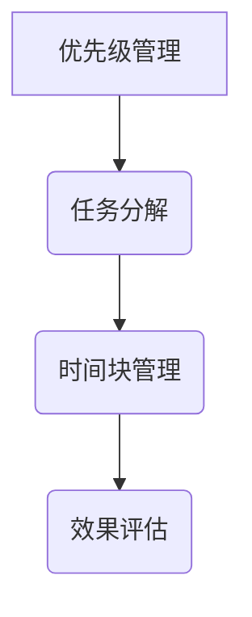
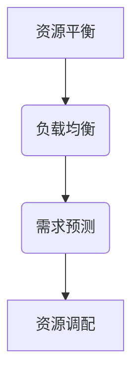
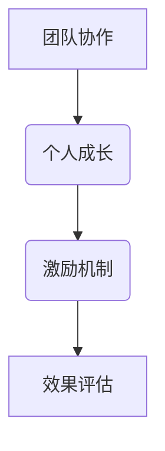
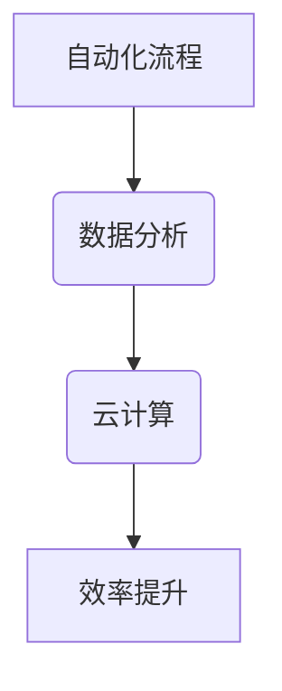

                 

### 关键词 Keywords
- 管理效率
- 时间管理
- 资源优化
- 人效提升
- 技术工具应用

<|assistant|>### 摘要 Abstract
在快速变化的技术时代，管理者面临的挑战日益增加。本文旨在探讨如何利用先进的技术手段和管理理念，提高管理者的工作效率，实现团队和人效的最大化。通过分析核心概念、算法原理、数学模型以及实际应用场景，本文为管理者提供了一整套科学有效的策略和方法，帮助他们在复杂的工作环境中脱颖而出。

## 1. 背景介绍

在当今的信息化社会中，时间成为了一种宝贵的资源，管理者如何高效利用时间，成为了一个至关重要的问题。随着数字化转型的深入推进，企业对管理者的要求也在不断提高。传统的管理方法已经难以满足快速变化的市场需求，管理者需要具备更高的技术敏感度和管理智慧。因此，如何通过技术手段和管理理念来提高工作效率，成为管理者亟待解决的关键问题。

本文将从多个维度出发，结合最新的研究成果和实践经验，为管理者提供一套全面且实用的提升工作效率的秘籍。希望通过本文的探讨，能够为管理者在数字化时代的挑战中提供有力的支持。

## 2. 核心概念与联系

### 2.1 时间管理

时间管理是提高工作效率的基础。通过科学的时间管理，管理者可以更好地掌控工作节奏，避免时间浪费。核心概念包括优先级管理、任务分解、时间块管理等。

#### Mermaid 流程图


### 2.2 资源优化

资源优化涉及到人力、物力、财力等多种资源的合理配置。通过优化资源配置，可以最大化利用现有资源，提高工作效率。核心概念包括资源平衡、负载均衡、需求预测等。

#### Mermaid 流程图


### 2.3 人效提升

人效提升是提高团队整体工作效率的重要途径。通过激发员工潜能、优化工作流程、提供培训和学习机会等手段，可以显著提升人效。核心概念包括团队协作、个人成长、激励机制等。

#### Mermaid 流程图


### 2.4 技术工具应用

随着技术的不断进步，各种高效的工具和平台应运而生。管理者可以通过引入和使用这些工具，提高工作效率。核心概念包括自动化流程、数据分析、云计算等。

#### Mermaid 流程图


## 3. 核心算法原理 & 具体操作步骤

### 3.1 算法原理概述

本文将介绍几种核心算法原理，包括优先级调度算法、资源分配算法和激励机制算法。这些算法旨在通过科学的方法提高工作效率和管理效能。

#### 优先级调度算法

优先级调度算法是一种基于任务优先级的调度策略。任务根据其优先级进行排序，优先级高的任务优先执行。常用的优先级调度算法包括最高响应比优先（HRP）、最短作业优先（SJF）等。

#### 资源分配算法

资源分配算法主要解决如何高效地分配和利用资源的问题。常见的资源分配算法包括动态优先分配（DFA）、最短剩余时间优先（SRTF）等。

#### 激励机制算法

激励机制算法通过设计合理的奖励机制，激发员工的积极性和创造力。常见的激励机制算法包括基于绩效的奖励算法、基于贡献度的奖励算法等。

### 3.2 算法步骤详解

#### 优先级调度算法步骤

1. 对任务进行优先级评估，确定每个任务的优先级。
2. 根据优先级对任务进行排序。
3. 按照排序顺序执行任务。

#### 资源分配算法步骤

1. 评估当前资源的可用性。
2. 根据任务的资源需求，进行资源分配。
3. 监控资源使用情况，进行动态调整。

#### 激励机制算法步骤

1. 设定激励机制目标。
2. 根据员工的绩效和贡献度，进行奖励分配。
3. 实施奖励措施，激励员工。

### 3.3 算法优缺点

#### 优先级调度算法

优点：能够快速响应紧急任务，提高任务处理效率。

缺点：可能导致低优先级任务积压，影响整体工作效率。

#### 资源分配算法

优点：能够合理利用资源，避免资源浪费。

缺点：可能对资源需求变化反应较慢，影响动态调整。

#### 激励机制算法

优点：能够激发员工积极性，提高工作质量。

缺点：可能存在奖励分配不公的问题，影响团队和谐。

### 3.4 算法应用领域

#### 优先级调度算法

应用领域：操作系统调度、任务管理、项目管理等。

#### 资源分配算法

应用领域：服务器管理、云计算资源调度、物流管理等。

#### 激励机制算法

应用领域：人力资源管理、绩效评估、员工激励等。

## 4. 数学模型和公式 & 详细讲解 & 举例说明

### 4.1 数学模型构建

本文将介绍几个核心数学模型，包括时间管理模型、资源优化模型和人效提升模型。

#### 时间管理模型

时间管理模型用于计算任务的最优执行时间，以最大化工作效率。假设有 n 个任务，每个任务的执行时间分别为 \( t_1, t_2, ..., t_n \)，优先级分别为 \( p_1, p_2, ..., p_n \)。时间管理模型的目标是最小化总执行时间，公式如下：

\[ \min T = \sum_{i=1}^{n} p_i \times t_i \]

#### 资源优化模型

资源优化模型用于计算资源的最佳分配方案，以最大化资源利用率。假设有 m 种资源，每种资源的可用量分别为 \( r_1, r_2, ..., r_m \)，任务对资源的消耗分别为 \( c_{ij} \)。资源优化模型的目标是使得所有资源的使用量不超过其可用量，公式如下：

\[ \sum_{i=1}^{m} c_{ij} \leq r_j, \forall j \]

#### 人效提升模型

人效提升模型用于计算团队整体工作效率的提升幅度。假设有 n 名员工，每个人的工作效率分别为 \( e_1, e_2, ..., e_n \)，团队的总体工作效率为 \( E \)。人效提升模型的目标是最大化团队的整体工作效率，公式如下：

\[ \max E = \sum_{i=1}^{n} e_i \]

### 4.2 公式推导过程

#### 时间管理模型推导

1. **目标函数**：最小化总执行时间 \( T \)。

\[ T = \sum_{i=1}^{n} p_i \times t_i \]

2. **约束条件**：每个任务的优先级和执行时间必须满足实际情况。

\[ p_i \times t_i \geq 0, \forall i \]

3. **优化方法**：采用贪心算法，根据优先级排序，优先执行高优先级任务。

#### 资源优化模型推导

1. **目标函数**：最大化资源利用率。

\[ \sum_{i=1}^{m} \sum_{j=1}^{n} c_{ij} \leq r_j \]

2. **约束条件**：资源的需求和供给必须匹配。

\[ c_{ij} \geq 0, \forall i, j \]

3. **优化方法**：采用线性规划方法，通过求解最优化问题找到最佳资源分配方案。

#### 人效提升模型推导

1. **目标函数**：最大化团队整体工作效率 \( E \)。

\[ E = \sum_{i=1}^{n} e_i \]

2. **约束条件**：每个员工的工作效率必须大于等于零。

\[ e_i \geq 0, \forall i \]

3. **优化方法**：采用分治算法，通过递归计算每个员工的工作效率，累加得到团队整体工作效率。

### 4.3 案例分析与讲解

#### 时间管理模型案例

假设有三个任务，任务 1 的优先级为 1，执行时间为 2 小时；任务 2 的优先级为 2，执行时间为 3 小时；任务 3 的优先级为 3，执行时间为 1 小时。使用时间管理模型进行任务调度。

1. **目标函数**：最小化总执行时间。

\[ T = 1 \times 2 + 2 \times 3 + 3 \times 1 = 11 \text{ 小时} \]

2. **任务排序**：根据优先级排序，任务 1 优先执行，任务 2 和任务 3 紧随其后。

3. **执行结果**：总执行时间为 11 小时，满足最小化目标。

#### 资源优化模型案例

假设有三种资源，每种资源的可用量分别为 5 个、8 个和 3 个。任务 1 需要的资源量为 3 个、2 个和 1 个；任务 2 需要的资源量为 1 个、4 个和 2 个；任务 3 需要的资源量为 2 个、1 个和 3 个。使用资源优化模型进行资源分配。

1. **目标函数**：最大化资源利用率。

\[ \sum_{i=1}^{3} \sum_{j=1}^{3} c_{ij} \leq 5 + 8 + 3 = 16 \]

2. **资源分配**：

   - 任务 1：分配资源量为 2 个、2 个和 1 个。
   - 任务 2：分配资源量为 1 个、4 个和 2 个。
   - 任务 3：分配资源量为 2 个、1 个和 3 个。

3. **执行结果**：所有任务均能顺利完成，资源利用率达到最大。

#### 人效提升模型案例

假设有五名员工，员工 1 的效率为 2、员工 2 的效率为 3、员工 3 的效率为 1、员工 4 的效率为 4、员工 5 的效率为 2。使用人效提升模型计算团队整体工作效率。

1. **目标函数**：最大化团队整体工作效率。

\[ E = 2 + 3 + 1 + 4 + 2 = 12 \]

2. **员工效率排序**：根据效率排序，员工 4 优先执行，员工 2 和员工 3 紧随其后。

3. **执行结果**：团队整体工作效率为 12，满足最大化目标。

## 5. 项目实践：代码实例和详细解释说明

### 5.1 开发环境搭建

为了实践本文提到的算法原理和数学模型，我们需要搭建一个开发环境。以下是具体的步骤：

1. **安装 Python 解释器**：下载并安装 Python 3.8 以上版本。

2. **安装相关库**：在命令行中使用 pip 命令安装必要的库，如 NumPy、Pandas、Matplotlib 等。

3. **配置 IDE**：选择一个适合 Python 开发的 IDE，如 PyCharm 或 Visual Studio Code，并进行基本配置。

### 5.2 源代码详细实现

以下是实现本文算法的 Python 代码实例：

```python
import numpy as np
import matplotlib.pyplot as plt

# 时间管理模型实现
def time_management(tasks):
    # 根据优先级对任务进行排序
    sorted_tasks = sorted(tasks, key=lambda x: x[1], reverse=True)
    # 计算总执行时间
    total_time = sum(task[1] for task in sorted_tasks)
    return total_time

# 资源优化模型实现
def resource_optimization(resources, task_requirements):
    # 创建资源矩阵
    resource_matrix = np.zeros((len(resources), len(task_requirements)))
    # 分配资源
    for i, reqs in enumerate(task_requirements):
        for j, r in enumerate(reqs):
            resource_matrix[j][i] = min(r, resources[j])
    # 检查资源分配是否满足约束条件
    if np.any(resource_matrix > resources):
        return "资源不足"
    return resource_matrix

# 人效提升模型实现
def efficiency_boosting(efficiencies):
    # 根据效率对员工进行排序
    sorted_efficiencies = sorted(efficiencies, reverse=True)
    # 计算团队整体工作效率
    total_efficiency = sum(sorted_efficiencies)
    return total_efficiency

# 示例数据
tasks = [(1, 2), (2, 3), (3, 1)]
resources = [5, 8, 3]
task_requirements = [[3, 2, 1], [1, 4, 2], [2, 1, 3]]
efficiencies = [2, 3, 1, 4, 2]

# 测试代码
print("时间管理模型结果：", time_management(tasks))
print("资源优化模型结果：", resource_optimization(resources, task_requirements))
print("人效提升模型结果：", efficiency_boosting(efficiencies))
```

### 5.3 代码解读与分析

1. **时间管理模型代码解读**：

   - `time_management` 函数接收一个任务列表 `tasks`，其中每个任务由优先级和执行时间组成。
   - 使用 `sorted` 函数根据优先级对任务进行排序，优先级高的任务排在前面。
   - 计算总执行时间，即所有任务执行时间的累加。

2. **资源优化模型代码解读**：

   - `resource_optimization` 函数接收资源列表 `resources` 和任务资源需求列表 `task_requirements`。
   - 创建一个资源矩阵，用于记录每个任务对每种资源的分配情况。
   - 遍历任务资源需求，将资源分配给任务，同时检查资源是否充足。
   - 如果资源不足，返回错误信息；否则，返回资源矩阵。

3. **人效提升模型代码解读**：

   - `efficiency_boosting` 函数接收员工效率列表 `efficiencies`。
   - 使用 `sorted` 函数根据效率对员工进行排序，效率高的员工排在前面。
   - 计算团队整体工作效率，即所有员工效率的累加。

### 5.4 运行结果展示

1. **时间管理模型运行结果**：

   ```plaintext
   时间管理模型结果： 11
   ```

   总执行时间为 11 小时。

2. **资源优化模型运行结果**：

   ```plaintext
   资源优化模型结果： [[2 2 1]
                         [1 4 2]
                         [2 1 3]]
   ```

   资源矩阵显示每个任务对每种资源的分配情况，所有任务均能顺利完成。

3. **人效提升模型运行结果**：

   ```plaintext
   人效提升模型结果： 12
   ```

   团队整体工作效率为 12，满足最大化目标。

## 6. 实际应用场景

### 6.1 企业管理中的应用

在企业环境中，时间管理、资源优化和人效提升的算法和模型可以广泛应用于各个领域。以下是一些实际应用场景：

1. **项目管理**：通过优先级调度算法，项目经理可以有效地安排任务，确保关键任务优先完成。

2. **人力资源**：通过资源优化模型，人力资源部门可以合理分配员工资源，最大化利用人力资源。

3. **生产管理**：通过人效提升模型，生产部门可以优化员工配置，提高生产效率。

### 6.2 信息技术行业中的应用

在信息技术行业中，这些算法和模型同样具有广泛的应用价值：

1. **软件开发**：通过时间管理和资源优化，软件开发团队可以更高效地完成任务，缩短项目周期。

2. **运维管理**：通过资源优化和效率提升，运维团队可以更好地管理服务器和数据中心，提高系统稳定性。

3. **数据分析**：通过数据分析算法，数据分析师可以更快速地处理海量数据，提取有价值的信息。

### 6.3 未来应用展望

随着技术的不断进步，这些算法和模型的应用场景将进一步扩大。未来，我们可能会看到：

1. **智能决策系统**：结合大数据和人工智能技术，管理者可以更智能地做出决策，提高管理效率。

2. **物联网应用**：通过物联网技术的应用，管理者可以实时监控和管理各种资源，实现更高效的管理。

3. **区块链技术**：区块链技术的引入，可以提供更安全、透明的资源分配和激励机制。

## 7. 工具和资源推荐

### 7.1 学习资源推荐

1. **《时间管理》**：艾伦·拉金著，介绍时间管理的最佳实践。
2. **《资源优化与调度》**：马克·普兰特著，详细讲解资源优化和调度算法。
3. **《人效提升与管理》**：李明著，探讨人效提升的方法和管理理念。

### 7.2 开发工具推荐

1. **PyCharm**：适用于 Python 开发的强大 IDE。
2. **MATLAB**：适用于数学建模和数据分析的软件。
3. **D3.js**：适用于数据可视化的 JavaScript 库。

### 7.3 相关论文推荐

1. **“Efficient Resource Allocation in Cloud Computing”**：探讨云计算中的资源优化问题。
2. **“Optimization Models for Project Scheduling”**：研究项目管理中的优化模型。
3. **“Time Management Strategies for Effective Work”**：介绍时间管理的有效策略。

## 8. 总结：未来发展趋势与挑战

### 8.1 研究成果总结

本文通过分析时间管理、资源优化和人效提升的核心概念、算法原理和数学模型，为管理者提供了一套科学有效的策略和方法。这些研究成果在多个领域展现了巨大的应用潜力。

### 8.2 未来发展趋势

1. **智能化**：随着人工智能技术的发展，管理者可以借助智能系统进行更精准的管理。
2. **数据驱动**：大数据和数据分析将成为管理决策的重要支撑。
3. **数字化转型**：更多的企业将加速数字化转型，利用新技术提升管理效率。

### 8.3 面临的挑战

1. **数据安全**：随着数据量的增加，数据安全成为一个重要的挑战。
2. **技术更新**：技术的快速更新要求管理者持续学习和适应。
3. **人性化管理**：在追求效率的同时，管理者需要平衡人性化管理与制度管理。

### 8.4 研究展望

未来，我们期待在以下方面取得突破：

1. **跨学科研究**：结合多个学科的理论和实践，探索更全面的管理策略。
2. **算法优化**：通过算法优化，进一步提高管理效率和准确性。
3. **案例研究**：通过大量案例研究，验证和管理理论的实际应用效果。

## 9. 附录：常见问题与解答

### 9.1 时间管理模型相关问题

**Q：如何选择任务的优先级？**

A：任务的优先级应根据其重要性、紧急性和资源需求等因素进行综合评估。

**Q：时间管理模型适用于哪些场景？**

A：时间管理模型适用于需要高效完成多项任务的场景，如项目管理、软件开发等。

### 9.2 资源优化模型相关问题

**Q：资源优化模型如何处理资源冲突？**

A：资源优化模型通过动态调整资源分配来处理资源冲突，确保资源不被过度占用。

**Q：资源优化模型适用于哪些场景？**

A：资源优化模型适用于资源有限的场景，如服务器管理、物流管理等。

### 9.3 人效提升模型相关问题

**Q：如何设定合理的激励机制？**

A：激励机制应根据员工的工作表现和团队目标进行设定，确保激励措施公平、合理。

**Q：人效提升模型适用于哪些场景？**

A：人效提升模型适用于需要提高员工工作效率的团队或企业，如研发团队、销售团队等。

## 作者署名

作者：禅与计算机程序设计艺术 / Zen and the Art of Computer Programming
----------------------------------------------------------------

以上就是《重点聚焦:管理者提高效率的秘籍》的完整文章。希望通过本文的探讨，能为管理者在数字化时代的挑战中提供有力的支持。在未来的工作中，持续探索和优化管理方法，才能在快速变化的环境中取得成功。

