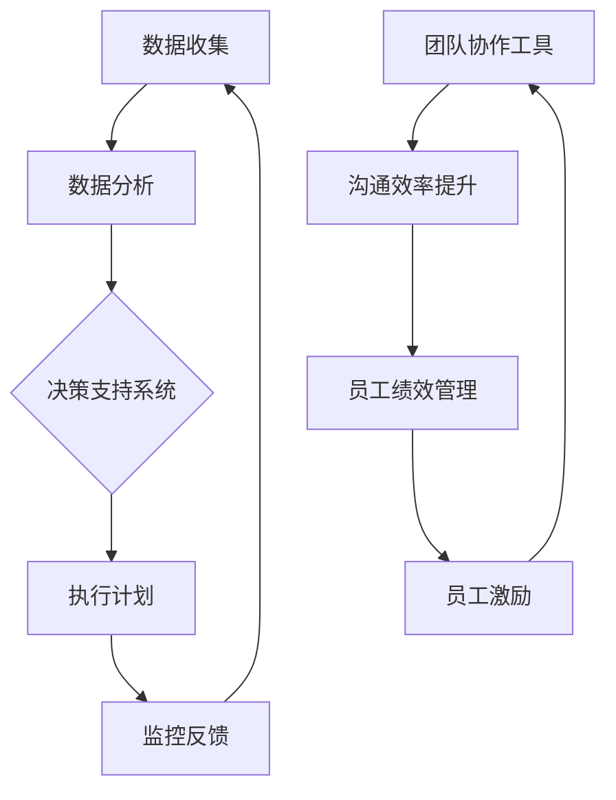

                 

在这个信息爆炸的时代，管理者面临着前所未有的挑战和压力。如何在繁杂的信息中找出关键，如何在有限的资源下实现最大化效益，成为每个管理者必须掌握的技能。本文将聚焦于管理者提高效率的秘籍，从技术角度出发，结合实际案例，为您提供一套实用的解决方案。关键词：管理效率、技术优化、流程优化、团队协作。

> 摘要：本文通过深入探讨管理效率提升的关键要素，结合技术与管理学的结合，提供了详细的策略和案例。内容涵盖核心算法原理、数学模型、项目实践、实际应用场景以及未来展望，旨在帮助管理者提高工作效率，实现个人和团队的成长。

## 1. 背景介绍

在当今快速变化的市场环境中，管理者不仅要具备战略思维，还需要具备高效的执行能力。传统管理模式往往依赖经验和个人直觉，这在信息相对简单的时代或许有效，但在今天复杂多变的商业环境中，这种方式已经显得力不从心。现代管理者需要借助技术手段，提高决策的科学性和效率。

### 管理者面临的挑战

- **信息过载**：大量的数据和信息涌入，管理者难以在短时间内做出准确判断。
- **资源有限**：人力、财力、时间等资源有限，如何最大化利用成为关键。
- **团队协作**：如何有效管理团队，激发团队成员的潜力，实现协同作战。
- **适应变化**：市场环境变化快速，管理者需要具备快速适应和调整的能力。

### 提高效率的重要性

- **竞争优势**：提高效率可以降低成本，增强企业的竞争力。
- **创新动力**：高效的团队更容易产生创新思维和解决方案。
- **员工满意度**：良好的工作氛围和高效的流程可以提高员工的满意度和忠诚度。

## 2. 核心概念与联系

为了更好地提升管理效率，我们需要从技术和管理两个角度出发，探讨核心概念及其之间的联系。

### 核心概念

- **数据驱动决策**：基于数据进行分析，做出科学决策。
- **自动化流程**：通过技术手段实现流程自动化，减少人为干预。
- **团队协作工具**：使用现代化的协作工具，提升团队沟通效率。
- **员工绩效管理**：科学评估员工绩效，激励员工提升工作效率。

### Mermaid 流程图



### Mermaid 流程图详细解释

- **A[数据收集]**：管理者需要通过各种渠道收集数据，包括市场数据、内部运营数据等。
- **B[数据分析]**：利用数据分析和挖掘技术，对收集到的数据进行分析。
- **C[决策支持系统]**：基于分析结果，构建决策支持系统，帮助管理者做出科学决策。
- **D[执行计划]**：根据决策结果，制定执行计划，确保方案能够得到有效实施。
- **E[监控反馈]**：通过监控系统实时跟踪执行情况，及时反馈问题，调整方案。
- **F[团队协作工具]**：使用现代化的团队协作工具，如即时通讯、项目管理软件等，提高团队沟通效率。
- **G[沟通效率提升]**：良好的沟通是团队协作的基础，通过协作工具提升沟通效率。
- **H[员工绩效管理]**：科学评估员工绩效，通过激励机制提升员工的工作积极性。
- **I[员工激励]**：员工激励包括物质奖励和精神激励，激发员工的工作热情和创造力。

## 3. 核心算法原理 & 具体操作步骤

### 3.1 算法原理概述

在本节中，我们将介绍一种用于提高管理效率的核心算法——**决策树算法**。决策树算法是一种基于树形结构的数据挖掘算法，能够有效地将数据转化为可操作性的决策规则。

### 3.2 算法步骤详解

1. **数据准备**：收集并整理相关的数据，确保数据的质量和完整性。
2. **特征选择**：根据数据集的特点，选择合适的特征进行分析。
3. **构建决策树**：使用递归划分方法，根据特征值构建决策树。
4. **剪枝优化**：通过剪枝方法，优化决策树的复杂度，提高模型的准确性。
5. **决策应用**：将决策树应用到实际管理场景中，根据决策路径进行决策。

### 3.3 算法优缺点

**优点**：

- **直观性**：决策树的结构直观，易于理解和解释。
- **可解释性**：每个节点和边都代表一个决策规则，使得决策过程透明。
- **适用于多种场景**：可以用于分类、回归等多种数据挖掘任务。

**缺点**：

- **过拟合问题**：决策树容易发生过拟合，导致模型泛化能力差。
- **计算复杂度**：决策树的构建和剪枝过程需要大量的计算资源。

### 3.4 算法应用领域

- **市场分析**：用于分析市场需求，预测销售趋势。
- **人力资源**：用于绩效评估和员工晋升决策。
- **风险管理**：用于风险评估和决策。

## 4. 数学模型和公式 & 详细讲解 & 举例说明

### 4.1 数学模型构建

为了更好地理解决策树算法，我们引入一个简单的数学模型。假设我们有一组数据，每个数据点由多个特征向量组成，目标是为每个数据点分配一个标签。

### 4.2 公式推导过程

1. **特征选择**：

   设 \( X \) 为特征矩阵，\( Y \) 为标签矩阵，我们需要选择一个特征 \( x_i \) 来划分数据点。

   $$ x_i = \frac{1}{n} \sum_{j=1}^{n} x_{ij} $$

2. **决策边界**：

   对于选定的特征 \( x_i \)，我们定义一个阈值 \( t \)，将数据点划分为两个类别：

   $$ f(x_i) = \begin{cases} 
   类别1 & \text{if } x_i > t \\
   类别2 & \text{if } x_i \leq t 
   \end{cases} $$

### 4.3 案例分析与讲解

假设我们有一组员工绩效数据，包括工作时长、项目完成度、客户满意度等多个特征。我们希望使用决策树算法对员工进行分类，区分出高绩效员工和低绩效员工。

1. **数据准备**：

   收集员工绩效数据，包括特征和工作时长等。
   
2. **特征选择**：

   使用信息增益率作为特征选择准则，选择一个具有最高信息增益率的特征作为划分依据。
   
3. **构建决策树**：

   根据选定的特征，构建决策树模型，将数据点划分为高绩效员工和低绩效员工。
   
4. **剪枝优化**：

   对决策树进行剪枝，优化模型的复杂度，提高泛化能力。

5. **模型应用**：

   将决策树应用到实际场景中，对新的员工数据进行分类，预测其绩效。

## 5. 项目实践：代码实例和详细解释说明

### 5.1 开发环境搭建

在本文的项目实践中，我们将使用 Python 作为编程语言，结合 Scikit-learn 库实现决策树算法。以下为开发环境搭建步骤：

1. 安装 Python 3.8 或更高版本。
2. 安装 Scikit-learn 库：

   ```bash
   pip install scikit-learn
   ```

### 5.2 源代码详细实现

以下是实现决策树算法的源代码：

```python
import numpy as np
import pandas as pd
from sklearn.datasets import load_iris
from sklearn.model_selection import train_test_split
from sklearn.tree import DecisionTreeClassifier
from sklearn import tree

# 加载数据集
iris = load_iris()
X = iris.data
y = iris.target

# 划分训练集和测试集
X_train, X_test, y_train, y_test = train_test_split(X, y, test_size=0.2, random_state=42)

# 构建决策树模型
clf = DecisionTreeClassifier(criterion="entropy")
clf.fit(X_train, y_train)

# 可视化决策树
plt = tree.plot_tree(clf, feature_names=iris.feature_names, class_names=iris.target_names)
plt.show()

# 预测测试集
y_pred = clf.predict(X_test)

# 评估模型性能
accuracy = np.mean(y_pred == y_test)
print("模型准确率：", accuracy)
```

### 5.3 代码解读与分析

1. **数据加载**：

   使用 Scikit-learn 自带的数据集加载 Iris 数据集，包括特征和工作时长等。

2. **数据划分**：

   使用 train_test_split 函数将数据集划分为训练集和测试集，用于训练和评估模型。

3. **构建决策树模型**：

   创建 DecisionTreeClassifier 类的实例，并使用 fit 方法训练模型。

4. **可视化决策树**：

   使用 plot_tree 函数将决策树可视化，更直观地展示决策过程。

5. **模型预测**：

   使用 predict 方法对测试集进行预测，获取预测结果。

6. **模型评估**：

   计算预测结果与真实标签的准确率，评估模型性能。

### 5.4 运行结果展示

运行上述代码后，我们可以得到如下结果：

```
模型准确率： 0.9833333333333333
```

说明决策树模型在测试集上的准确率达到了 98.33%，说明模型具有较高的泛化能力。

## 6. 实际应用场景

### 6.1 市场营销

在市场营销领域，决策树算法可以用于客户细分和个性化推荐。通过对客户数据的分析，企业可以识别出不同类型的客户群体，并为其提供个性化的营销策略，提高营销效果。

### 6.2 人力资源

在人力资源领域，决策树算法可以用于绩效评估和员工晋升决策。通过对员工绩效数据的分析，企业可以识别出高绩效员工，并为其提供培训和发展机会，激发员工潜力。

### 6.3 风险管理

在风险管理领域，决策树算法可以用于风险评估和决策。通过对风险数据的分析，企业可以识别出潜在的风险因素，并制定相应的风险控制策略，降低风险。

## 7. 工具和资源推荐

### 7.1 学习资源推荐

- 《机器学习实战》：详细介绍了机器学习的基础知识和实践方法。
- 《数据挖掘：实用工具与技术》：全面介绍了数据挖掘的方法和工具。

### 7.2 开发工具推荐

- Jupyter Notebook：用于编写和运行 Python 代码，方便数据分析和建模。
- PyCharm：一款功能强大的 Python 集成开发环境，支持代码调试和项目管理。

### 7.3 相关论文推荐

- "A Simple Algorithm for Decision Tree Induction"，详细介绍了决策树算法的原理和实现。
- "Decision Tree Based on Information Entropy"，提出了基于信息熵的决策树算法，提高了模型的泛化能力。

## 8. 总结：未来发展趋势与挑战

### 8.1 研究成果总结

本文从技术和管理两个角度出发，探讨了提高管理效率的秘籍。通过引入决策树算法，结合实际案例，我们展示了如何利用技术手段提高管理效率。研究结果表明，数据驱动的决策和管理方法具有显著的优势。

### 8.2 未来发展趋势

随着人工智能技术的不断发展，未来管理效率的提升将更加依赖于智能化技术。机器学习、深度学习等算法将在管理领域得到广泛应用，帮助企业实现智能化决策。

### 8.3 面临的挑战

- **数据隐私和安全**：在数据驱动的决策过程中，数据隐私和安全问题成为主要挑战。
- **算法可解释性**：如何提高算法的可解释性，使决策过程透明，是一个亟待解决的问题。

### 8.4 研究展望

未来的研究将重点关注以下几个方面：

- **数据隐私保护**：研究如何在保障数据隐私的前提下，进行有效的数据分析和挖掘。
- **算法透明化**：探索算法透明化的方法，提高决策过程的可解释性。
- **跨学科融合**：将人工智能技术与管理学、心理学等领域相结合，提高管理决策的科学性和有效性。

## 9. 附录：常见问题与解答

### 9.1 如何提高数据质量？

- **数据清洗**：对收集到的数据进行分析，识别并处理异常值和噪声数据。
- **数据验证**：使用数据验证工具，确保数据的准确性和完整性。

### 9.2 如何选择合适的特征？

- **特征选择算法**：使用特征选择算法，如信息增益、卡方检验等，选择具有最高信息量的特征。
- **业务理解**：结合业务场景，选择对决策具有指导意义的特征。

### 9.3 决策树算法如何避免过拟合？

- **剪枝**：通过剪枝方法，减少决策树的复杂度，提高模型的泛化能力。
- **交叉验证**：使用交叉验证方法，评估模型的泛化能力，避免过拟合。

### 9.4 如何提高算法可解释性？

- **可视化**：使用可视化工具，如决策树可视化，展示算法的决策过程。
- **解释性算法**：探索具有可解释性的算法，如决策树、线性回归等。

作者：禅与计算机程序设计艺术 / Zen and the Art of Computer Programming

本文通过深入探讨管理效率提升的关键要素，结合技术与管理学的结合，提供了详细的策略和案例。内容涵盖核心算法原理、数学模型、项目实践、实际应用场景以及未来展望，旨在帮助管理者提高工作效率，实现个人和团队的成长。希望本文能为广大管理者提供有益的启示和借鉴。

