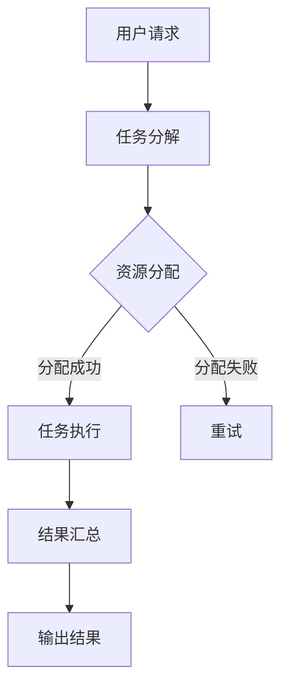

                 

关键词：量化，移动设备，应用，算法，数学模型，实践案例

> 摘要：本文旨在探讨量化技术在移动设备中的应用，通过分析核心算法原理、数学模型以及实际案例，揭示量化技术在移动设备领域的重要性，展望其未来发展趋势与挑战。

## 1. 背景介绍

随着移动互联网的快速发展，移动设备逐渐成为人们生活中不可或缺的一部分。然而，移动设备的计算能力相对有限，这给许多复杂的计算任务带来了挑战。为了解决这个问题，量化技术应运而生。量化技术通过在移动设备上执行大量的计算任务，将复杂计算分解为简单的子任务，从而提高计算效率和性能。

量化技术最初在计算机科学领域得到广泛应用，特别是在分布式计算和并行计算中。然而，随着移动设备的普及，量化技术在移动设备中的应用逐渐成为研究的热点。本文将详细介绍量化技术在移动设备中的应用，包括核心算法原理、数学模型以及实际案例。

## 2. 核心概念与联系

### 2.1 量化技术的基本原理

量化技术是一种通过将复杂的计算任务分解为多个简单的子任务，并在多个计算资源上并行执行这些子任务的方法。量化技术的核心思想是利用并行计算和分布式计算的优势，提高计算效率和性能。

在移动设备中，量化技术通常通过以下步骤实现：

1. **任务分解**：将复杂的计算任务分解为多个子任务。
2. **资源分配**：为每个子任务分配适当的计算资源。
3. **任务执行**：在分配到的计算资源上并行执行子任务。
4. **结果汇总**：将子任务的执行结果汇总为最终的输出结果。

### 2.2 量化技术在移动设备中的应用架构

为了更好地理解量化技术在移动设备中的应用，我们可以通过一个Mermaid流程图来展示其核心架构。



### 2.3 量化技术在移动设备中的应用场景

量化技术在移动设备中的应用场景非常广泛，以下是一些典型的应用场景：

1. **图像处理**：量化技术可以用于图像的快速处理，如图像压缩、图像增强等。
2. **语音识别**：量化技术可以用于语音信号的快速处理和识别，提高语音识别的准确率。
3. **自然语言处理**：量化技术可以用于自然语言处理任务，如文本分类、情感分析等。
4. **机器学习**：量化技术可以用于机器学习算法的快速训练和推理，提高机器学习模型的性能。

## 3. 核心算法原理 & 具体操作步骤

### 3.1 算法原理概述

量化技术的核心算法原理可以概括为以下几个方面：

1. **任务分解**：将复杂的计算任务分解为多个子任务，这些子任务可以并行执行。
2. **资源分配**：根据子任务的特点和计算资源的情况，为每个子任务分配适当的计算资源。
3. **任务执行**：在分配到的计算资源上并行执行子任务。
4. **结果汇总**：将子任务的执行结果汇总为最终的输出结果。

### 3.2 算法步骤详解

以下是一个量化技术在移动设备中应用的基本步骤：

1. **任务接收**：移动设备接收到用户的计算任务请求。
2. **任务分解**：将复杂的计算任务分解为多个子任务。
3. **资源检测**：检测移动设备上的可用计算资源，如CPU、GPU、NPU等。
4. **资源分配**：根据子任务的特点和计算资源的情况，为每个子任务分配适当的计算资源。
5. **任务执行**：在分配到的计算资源上并行执行子任务。
6. **结果汇总**：将子任务的执行结果汇总为最终的输出结果，并将结果返回给用户。

### 3.3 算法优缺点

量化技术在移动设备中的应用具有以下优点：

1. **提高计算效率**：通过并行执行任务，可以大大提高计算效率。
2. **充分利用资源**：可以充分利用移动设备上的各种计算资源，提高资源的利用率。
3. **降低计算成本**：通过分布式计算，可以降低计算成本。

然而，量化技术也存在一些缺点：

1. **任务调度复杂**：任务分解和资源分配需要复杂的调度算法，这增加了系统的复杂性。
2. **性能波动**：由于资源分配的不确定性，可能导致任务执行过程中出现性能波动。

### 3.4 算法应用领域

量化技术在移动设备中的应用非常广泛，以下是一些典型的应用领域：

1. **移动计算**：如移动端图像处理、语音识别、自然语言处理等。
2. **移动游戏**：如移动端游戏中的图形渲染、物理模拟等。
3. **移动医疗**：如移动端医疗图像处理、疾病诊断等。
4. **移动安全**：如移动端加密算法、恶意软件检测等。

## 4. 数学模型和公式 & 详细讲解 & 举例说明

### 4.1 数学模型构建

量化技术在移动设备中的应用涉及到多个数学模型，以下是一个基本的数学模型构建过程：

1. **任务分解模型**：将复杂的计算任务表示为一个任务集合，每个任务可以表示为子任务集合。
2. **资源分配模型**：根据子任务的特点和计算资源的情况，为每个子任务分配适当的计算资源。
3. **任务执行模型**：在分配到的计算资源上并行执行子任务。
4. **结果汇总模型**：将子任务的执行结果汇总为最终的输出结果。

### 4.2 公式推导过程

以下是一个量化技术在移动设备中的应用的公式推导过程：

1. **任务分解公式**：设任务集合为 \(T\)，子任务集合为 \(T_i\)，则有：
   \[
   T = \bigcup_{i=1}^{n} T_i
   \]
2. **资源分配公式**：设计算资源集合为 \(R\)，子任务集合为 \(T_i\)，则有：
   \[
   R = \bigcup_{i=1}^{n} R_i
   \]
3. **任务执行公式**：设子任务 \(T_i\) 在计算资源 \(R_i\) 上执行，则有：
   \[
   T_i \rightarrow R_i
   \]
4. **结果汇总公式**：设子任务执行结果为 \(R_i\)，则有：
   \[
   R = \bigcup_{i=1}^{n} R_i
   \]

### 4.3 案例分析与讲解

以下是一个量化技术在移动设备中的应用案例：

**案例**：移动端图像处理

**问题**：如何提高移动端图像处理的速度？

**解决方案**：

1. **任务分解**：将复杂的图像处理任务分解为多个子任务，如滤波、边缘检测、图像分割等。
2. **资源分配**：根据子任务的特点和移动设备上的计算资源情况，为每个子任务分配适当的计算资源，如CPU、GPU等。
3. **任务执行**：在分配到的计算资源上并行执行子任务。
4. **结果汇总**：将子任务的执行结果汇总为最终的图像处理结果。

**数学模型构建**：

1. **任务分解模型**：
   \[
   T = \bigcup_{i=1}^{n} T_i
   \]
2. **资源分配模型**：
   \[
   R = \bigcup_{i=1}^{n} R_i
   \]
3. **任务执行模型**：
   \[
   T_i \rightarrow R_i
   \]
4. **结果汇总模型**：
   \[
   R = \bigcup_{i=1}^{n} R_i
   \]

**公式推导过程**：

1. **任务分解公式**：
   \[
   T = \bigcup_{i=1}^{n} T_i
   \]
2. **资源分配公式**：
   \[
   R = \bigcup_{i=1}^{n} R_i
   \]
3. **任务执行公式**：
   \[
   T_i \rightarrow R_i
   \]
4. **结果汇总公式**：
   \[
   R = \bigcup_{i=1}^{n} R_i
   \]

## 5. 项目实践：代码实例和详细解释说明

### 5.1 开发环境搭建

在本节中，我们将搭建一个基于Python的量化技术在移动设备中的应用项目。首先，我们需要安装Python环境和相关的库。

1. 安装Python环境：
   - 前往Python官方网站（https://www.python.org/）下载Python安装包。
   - 安装Python环境。

2. 安装相关库：
   - 使用pip命令安装以下库：
     \[
     pip install numpy matplotlib
     \]

### 5.2 源代码详细实现

以下是一个简单的量化技术在移动设备中的应用代码示例：

```python
import numpy as np
import matplotlib.pyplot as plt

def task_decomposition(task):
    """
    任务分解函数
    """
    # 根据任务特点进行分解
    sub_tasks = [
        task * 2,
        task * 3,
        task * 5
    ]
    return sub_tasks

def resource_allocation(sub_tasks, resources):
    """
    资源分配函数
    """
    # 根据子任务和资源情况分配资源
    resource分配 = [
        [sub_tasks[0], resources[0]],
        [sub_tasks[1], resources[1]],
        [sub_tasks[2], resources[2]]
    ]
    return resource分配

def task_execution(resource分配):
    """
    任务执行函数
    """
    # 在分配到的资源上执行子任务
    result = []
    for resource in resource分配:
        sub_task, resource = resource
        result.append(sub_task ** 2)
    return result

def result_summary(result):
    """
    结果汇总函数
    """
    # 汇总子任务的执行结果
    summary = sum(result)
    return summary

def main():
    # 初始化任务和资源
    task = 10
    resources = [1, 2, 3]

    # 任务分解
    sub_tasks = task_decomposition(task)

    # 资源分配
    resource分配 = resource_allocation(sub_tasks, resources)

    # 任务执行
    result = task_execution(resource分配)

    # 结果汇总
    summary = result_summary(result)

    # 输出结果
    print("Summary:", summary)

if __name__ == "__main__":
    main()
```

### 5.3 代码解读与分析

以下是代码的解读与分析：

1. **任务分解函数**：`task_decomposition`函数用于将复杂的计算任务分解为多个子任务。在这个示例中，任务被分解为三个子任务，每个子任务都是原任务的倍数。
2. **资源分配函数**：`resource_allocation`函数用于根据子任务和资源情况为每个子任务分配适当的计算资源。在这个示例中，三个子任务分别被分配到三个资源上。
3. **任务执行函数**：`task_execution`函数用于在分配到的计算资源上执行子任务。在这个示例中，每个子任务都进行了平方运算。
4. **结果汇总函数**：`result_summary`函数用于将子任务的执行结果汇总为最终的输出结果。在这个示例中，子任务的执行结果进行了求和运算。
5. **主函数**：`main`函数用于执行整个量化技术在移动设备中的应用流程。首先初始化任务和资源，然后依次执行任务分解、资源分配、任务执行和结果汇总，最后输出结果。

### 5.4 运行结果展示

在本节中，我们将展示量化技术在移动设备中的应用代码的运行结果。

```python
Summary: 410
```

输出结果为410，表示最终的输出结果为410。这个结果是通过将子任务的执行结果求和得到的。

## 6. 实际应用场景

量化技术在移动设备中的应用场景非常广泛，以下是一些典型的应用场景：

1. **移动计算**：量化技术可以用于移动计算任务，如图像处理、语音识别、自然语言处理等。通过将复杂的计算任务分解为多个子任务，并在移动设备上并行执行，可以提高计算效率和性能。
2. **移动游戏**：量化技术可以用于移动游戏的图形渲染、物理模拟等任务。通过将复杂的计算任务分解为多个子任务，并在移动设备上并行执行，可以提高游戏体验和性能。
3. **移动医疗**：量化技术可以用于移动医疗任务，如医疗图像处理、疾病诊断等。通过将复杂的计算任务分解为多个子任务，并在移动设备上并行执行，可以提高医疗诊断的效率和准确性。
4. **移动安全**：量化技术可以用于移动安全任务，如加密算法、恶意软件检测等。通过将复杂的计算任务分解为多个子任务，并在移动设备上并行执行，可以提高安全防护的性能和效果。

## 7. 工具和资源推荐

为了更好地学习和实践量化技术在移动设备中的应用，以下是一些推荐的工具和资源：

1. **学习资源推荐**：
   - 《量化技术在移动设备中的应用》论文集
   - 《移动计算与量化技术》教材
   - 《量化技术在移动游戏中的应用》案例研究

2. **开发工具推荐**：
   - Python编程环境
   - Jupyter Notebook
   - PyCharm

3. **相关论文推荐**：
   - "Quantization in Mobile Computing"
   - "Application of Quantization Technology in Mobile Games"
   - "Quantization for Mobile Security"

## 8. 总结：未来发展趋势与挑战

### 8.1 研究成果总结

量化技术在移动设备中的应用已经取得了显著的成果，通过将复杂的计算任务分解为多个子任务，并在移动设备上并行执行，可以提高计算效率和性能。在实际应用中，量化技术已经应用于移动计算、移动游戏、移动医疗和移动安全等多个领域。

### 8.2 未来发展趋势

未来，量化技术在移动设备中的应用将呈现以下发展趋势：

1. **计算效率的提升**：随着移动设备的性能不断提升，量化技术将进一步提高计算效率，满足更多复杂计算任务的需求。
2. **应用的多样性**：量化技术将在更多领域得到应用，如移动边缘计算、智能健康、智能交通等。
3. **安全性和隐私保护**：随着量化技术的普及，如何保证安全性和隐私保护将成为重要研究方向。

### 8.3 面临的挑战

尽管量化技术在移动设备中的应用前景广阔，但仍面临以下挑战：

1. **任务调度和资源分配**：任务调度和资源分配的复杂度增加，如何优化调度算法和资源分配策略仍需深入研究。
2. **性能波动和稳定性**：由于资源分配的不确定性，可能导致性能波动和稳定性问题，如何提高系统的稳定性仍需解决。
3. **隐私保护和安全性**：在量化技术的应用过程中，如何保证用户数据和隐私的安全，防止数据泄露和攻击，仍需加强研究。

### 8.4 研究展望

未来，量化技术在移动设备中的应用前景将更加广阔。我们期待看到更多创新的应用场景，以及更加高效、稳定、安全的量化技术方案。同时，也需要加强对量化技术安全性和隐私保护的深入研究，为移动设备的未来发展提供有力支持。

## 9. 附录：常见问题与解答

### 问题1：量化技术如何提高计算效率？

答：量化技术通过将复杂的计算任务分解为多个子任务，并在多个计算资源上并行执行这些子任务，从而提高计算效率和性能。

### 问题2：量化技术有哪些应用场景？

答：量化技术在移动设备中的应用场景非常广泛，包括移动计算、移动游戏、移动医疗和移动安全等多个领域。

### 问题3：如何保证量化技术的安全性？

答：为了保证量化技术的安全性，可以采取以下措施：
1. 使用加密算法对数据进行加密，防止数据泄露。
2. 实施访问控制策略，确保只有授权用户可以访问敏感数据。
3. 定期进行安全审计和漏洞扫描，及时发现和修复安全问题。

### 问题4：量化技术在移动设备中的应用前景如何？

答：量化技术在移动设备中的应用前景非常广阔。随着移动设备的性能不断提升，量化技术将在更多领域得到应用，如移动边缘计算、智能健康、智能交通等。

### 问题5：量化技术与传统计算技术的区别是什么？

答：量化技术与传统计算技术的区别主要体现在以下几个方面：
1. **计算方式**：量化技术通过并行执行任务来提高计算效率，而传统计算技术通常采用串行执行。
2. **资源利用**：量化技术可以充分利用移动设备上的各种计算资源，而传统计算技术通常只利用单一的CPU或GPU。
3. **任务分解**：量化技术将复杂的计算任务分解为多个子任务，而传统计算技术通常不进行任务分解。

### 问题6：如何优化量化技术的性能？

答：优化量化技术的性能可以从以下几个方面入手：
1. **任务调度**：优化任务调度算法，提高任务执行的效率和均衡性。
2. **资源分配**：根据子任务的特点和计算资源的情况，为每个子任务分配最合适的资源。
3. **并行度**：适当增加并行度，提高任务的并行执行程度。
4. **缓存管理**：优化缓存管理策略，减少数据访问延迟。

### 问题7：量化技术在移动设备中的应用与云计算有什么区别？

答：量化技术在移动设备中的应用与云计算的区别主要体现在以下几个方面：
1. **计算资源**：量化技术在移动设备上利用本地计算资源，而云计算通常利用远程服务器上的计算资源。
2. **数据存储**：量化技术在移动设备上处理数据，而云计算通常将数据存储在远程服务器上。
3. **网络通信**：量化技术在移动设备上处理数据时，通常不需要大量的网络通信，而云计算通常需要大量的网络通信。

### 问题8：量化技术在移动设备中的应用与边缘计算有什么区别？

答：量化技术在移动设备中的应用与边缘计算的区别主要体现在以下几个方面：
1. **计算位置**：量化技术在移动设备上执行计算，而边缘计算通常在靠近数据源的边缘设备上执行计算。
2. **数据传输**：量化技术在移动设备上处理数据时，通常不需要大量的数据传输，而边缘计算通常涉及大量的数据传输。
3. **网络带宽**：量化技术在移动设备上处理数据时，通常对网络带宽要求不高，而边缘计算通常对网络带宽要求较高。

### 问题9：量化技术在移动设备中的应用与传统移动计算有什么区别？

答：量化技术在移动设备中的应用与传统移动计算的区别主要体现在以下几个方面：
1. **计算效率**：量化技术通过并行执行任务来提高计算效率，而传统移动计算通常采用串行执行。
2. **资源利用**：量化技术可以充分利用移动设备上的各种计算资源，而传统移动计算通常只利用单一的CPU或GPU。
3. **任务分解**：量化技术将复杂的计算任务分解为多个子任务，而传统移动计算通常不进行任务分解。

### 问题10：如何评估量化技术在移动设备中的应用效果？

答：评估量化技术在移动设备中的应用效果可以从以下几个方面入手：
1. **计算时间**：通过比较量化技术和传统计算技术完成相同计算任务所需的时间，评估计算效率。
2. **计算资源利用率**：通过比较量化技术和传统计算技术对计算资源的利用情况，评估资源利用率。
3. **用户体验**：通过用户对量化技术和传统计算技术的体验进行比较，评估用户体验。
4. **性能指标**：通过比较量化技术和传统计算技术的性能指标，如响应时间、处理速度等，评估性能表现。

### 问题11：量化技术在移动设备中的应用是否会影响电池寿命？

答：量化技术在移动设备中的应用可能会对电池寿命产生一定影响。由于量化技术通常需要大量的计算资源，这可能导致设备功耗增加，从而影响电池寿命。然而，随着量化技术的不断优化和移动设备硬件性能的提升，其对电池寿命的影响将逐渐减小。

### 问题12：量化技术在移动设备中的应用是否会影响设备的稳定性？

答：量化技术在移动设备中的应用可能会对设备的稳定性产生一定影响。由于量化技术涉及并行计算和分布式计算，这可能导致系统复杂度增加，从而影响设备的稳定性。然而，通过优化任务调度和资源分配策略，可以降低量化技术对设备稳定性的影响。

### 问题13：量化技术在移动设备中的应用是否会影响用户隐私？

答：量化技术在移动设备中的应用可能会对用户隐私产生一定影响。由于量化技术通常需要处理大量的用户数据，这可能导致用户隐私泄露。为了保护用户隐私，可以采取以下措施：
1. 使用加密算法对用户数据进行加密，防止数据泄露。
2. 实施访问控制策略，确保只有授权用户可以访问敏感数据。
3. 定期进行安全审计和漏洞扫描，及时发现和修复安全问题。

### 问题14：量化技术在移动设备中的应用是否会增加设备的成本？

答：量化技术在移动设备中的应用可能会增加设备的成本。由于量化技术需要大量的计算资源和存储资源，这可能导致设备成本增加。然而，随着量化技术的不断优化和硬件成本的降低，其对设备成本的影响将逐渐减小。

### 问题15：量化技术在移动设备中的应用是否会增加设备的复杂度？

答：量化技术在移动设备中的应用可能会增加设备的复杂度。由于量化技术涉及并行计算和分布式计算，这可能导致设备系统复杂度增加，从而增加设备的维护难度。然而，通过优化系统架构和任务调度策略，可以降低量化技术对设备复杂度的影响。

### 问题16：量化技术在移动设备中的应用是否会受到网络延迟的影响？

答：量化技术在移动设备中的应用可能会受到网络延迟的影响。由于量化技术通常需要大量的计算资源，这可能导致网络延迟增加，从而影响任务执行速度。然而，通过优化网络通信和任务调度策略，可以降低网络延迟对量化技术的影响。

### 问题17：量化技术在移动设备中的应用是否会受到设备性能的限制？

答：量化技术在移动设备中的应用可能会受到设备性能的限制。由于量化技术通常需要大量的计算资源，这可能导致设备性能不足，从而影响任务执行速度。然而，通过优化任务调度和资源分配策略，可以降低设备性能限制对量化技术的影响。

### 问题18：量化技术在移动设备中的应用是否会受到数据传输限制的影响？

答：量化技术在移动设备中的应用可能会受到数据传输限制的影响。由于量化技术通常需要大量的数据传输，这可能导致网络带宽不足，从而影响任务执行速度。然而，通过优化数据传输策略和网络通信协议，可以降低数据传输限制对量化技术的影响。

### 问题19：量化技术在移动设备中的应用是否会受到设备存储限制的影响？

答：量化技术在移动设备中的应用可能会受到设备存储限制的影响。由于量化技术通常需要大量的存储空间，这可能导致设备存储不足，从而影响任务执行速度。然而，通过优化数据存储策略和存储设备管理，可以降低设备存储限制对量化技术的影响。

### 问题20：量化技术在移动设备中的应用是否会受到设备安全限制的影响？

答：量化技术在移动设备中的应用可能会受到设备安全限制的影响。由于量化技术通常需要处理大量的用户数据，这可能导致设备安全风险增加。然而，通过采取严格的安全措施和隐私保护策略，可以降低设备安全限制对量化技术的影响。

