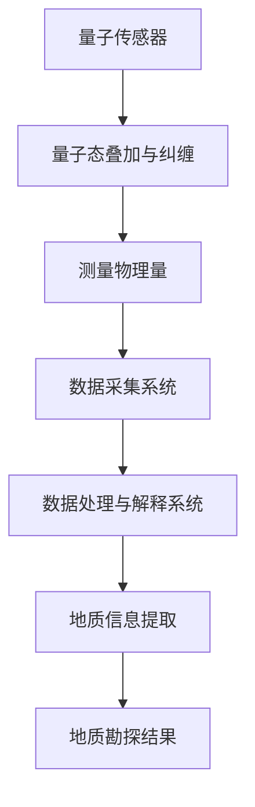

                 

关键词：量子传感器、地质勘探、资源发现、效率提升、算法、数学模型、项目实践、应用场景、未来展望

> 摘要：本文旨在探讨量子传感器在地质勘探中的应用，通过分析量子传感器的工作原理和地质勘探的需求，阐述其在提高资源发现效率方面的巨大潜力。文章将详细讨论量子传感器在地质勘探中的核心算法原理、数学模型、项目实践及未来应用展望。

## 1. 背景介绍

地质勘探作为资源发现的重要手段，其效率和准确性直接影响到资源的开发利用。传统的地质勘探方法主要依赖于重力、磁力、电法和放射性等物理探测技术，这些方法在特定条件下具有较好的探测效果，但在复杂地质环境和深部探测方面存在诸多局限性。为了突破这些瓶颈，提高资源发现的效率和准确性，量子传感器技术逐渐进入地质勘探领域。

量子传感器是基于量子力学原理设计的传感器，其灵敏度和分辨率远远超过传统传感器。量子传感器能够探测到极其微弱的物理信号，并且具有极高的空间和时间分辨率，这使得它们在地质勘探中具有独特的优势。

本文将重点讨论量子传感器在地质勘探中的应用，分析其在提高资源发现效率方面的优势，并探讨相关的核心算法原理、数学模型以及项目实践。通过这些讨论，本文旨在为地质勘探领域提供一种新的技术路径，为资源发现提供更加高效和准确的方法。

### 1.1 量子传感器的发展历程

量子传感器的发展历程可以追溯到20世纪末。随着量子力学研究的深入，人们逐渐认识到量子技术在传感器领域具有巨大的潜力。1995年，著名的量子传感器实验首次展示了量子纠缠态在传感器中的应用，这一发现为量子传感器的发展奠定了基础。

在接下来的几十年里，量子传感器技术取得了显著进展。2002年，量子干涉仪首次实现了超高的测量精度，这标志着量子传感器在实用化方面的重大突破。此后，各种基于量子力学原理的传感器相继问世，如量子涡旋传感器、量子热传感器和量子磁传感器等。

进入21世纪，随着量子计算和量子通信技术的快速发展，量子传感器的研究和应用也迎来了新的机遇。目前，量子传感器已经广泛应用于物理、化学、生物学和地质学等多个领域，成为现代科学技术的重要组成部分。

### 1.2 地质勘探的现状与挑战

地质勘探作为资源开发的重要环节，其准确性和效率直接关系到资源的开发利用效益。传统的地质勘探方法主要包括地质调查、遥感探测和地球物理探测等。这些方法在特定条件下具有较好的探测效果，但在复杂地质环境和深部探测方面存在诸多局限性。

首先，地质调查主要依赖于地质学家的经验和知识，具有很大的主观性。遥感探测虽然可以在大范围内快速获取地质信息，但其分辨率有限，难以捕捉到细微的地质特征。地球物理探测包括重力、磁力、电法和放射性等物理方法，这些方法在特定地质条件下具有较好的探测效果，但在复杂地质环境中，信号干扰严重，探测结果往往不够准确。

其次，深部探测一直是地质勘探的难点。随着地球深度的增加，地质环境的复杂性和不确定性也增加，传统方法难以有效探测深部资源。此外，资源开发的不断增加导致地质环境受到破坏，传统方法难以满足环境保护的要求。

为了克服这些挑战，提高资源发现的效率和准确性，量子传感器技术为地质勘探提供了一种新的解决方案。量子传感器的灵敏度高、分辨率高、抗干扰能力强，能够在复杂地质环境中实现高精度的地质信息探测，从而提高资源发现的效率和准确性。

### 1.3 量子传感器在地质勘探中的优势

量子传感器在地质勘探中具有独特的优势，主要体现在以下几个方面：

首先，量子传感器具有极高的灵敏度和分辨率。量子传感器能够探测到极其微弱的物理信号，从而捕捉到更加细微的地质特征。这对于复杂地质环境和深部探测具有重要意义。

其次，量子传感器具有抗干扰能力强的特点。在复杂地质环境中，信号干扰是一个普遍存在的问题。量子传感器通过利用量子纠缠和量子态叠加等量子效应，能够有效抵抗干扰，确保探测结果的准确性。

此外，量子传感器具有实时性和空间分辨率高的特点。量子传感器可以实时监测地质环境的变化，并通过高空间分辨率的数据采集，为地质勘探提供详细的地质信息。

最后，量子传感器在数据处理和传输方面具有优势。量子传感器采集的数据量巨大，但通过量子计算和量子通信技术，可以快速处理和传输这些数据，从而实现高效的数据分析和应用。

综上所述，量子传感器在地质勘探中具有显著的优势，有望提高资源发现的效率和准确性，为地质勘探领域带来革命性的变革。

## 2. 核心概念与联系

### 2.1 量子传感器的基本原理

量子传感器的工作原理基于量子力学中的基本概念，如量子态叠加、量子纠缠和量子干涉等。量子态叠加允许量子比特同时处于多种可能的量子状态，而不是传统的二进制状态。量子纠缠则使得两个或多个量子比特之间存在一种特殊的关联，即使它们相隔很远，一个量子比特的状态也会即时影响另一个量子比特的状态。量子干涉则是利用这些叠加和纠缠的特性来增强或抵消某些信号。

在量子传感器中，这些量子效应被用来提高传感器的灵敏度和分辨率。例如，量子干涉仪利用量子态的叠加和干涉来测量微小的物理量，如引力、磁场或温度。这种技术使得量子传感器能够探测到比传统传感器更微弱的信号。

### 2.2 地质勘探的需求与挑战

地质勘探的目标是发现和评估地下或地表的地质资源，包括金属、矿物、油气等。这要求勘探方法能够准确识别地质体的性质、结构、变化和异常。传统的地质勘探方法主要依赖于地球物理场的变化，如重力、磁力、电场和放射性场。然而，这些方法在复杂地质条件下面临以下挑战：

- **复杂地质环境下的信号干扰**：在复杂地质环境中，如山区、海洋或城市地下，多种物理场相互干扰，导致信号难以准确解析。
- **深部探测的难度**：随着探测深度的增加，地球内部的物理场变化更加复杂，传统方法难以提供足够的探测深度。
- **环境因素的干扰**：地质勘探过程中，环境因素如气候、气象和人为活动等也可能对探测结果产生影响。

为了解决这些挑战，需要一种能够提供更高灵敏度、更高分辨率和更强抗干扰能力的勘探方法。量子传感器在这方面具有显著的优势。

### 2.3 量子传感器与地质勘探的关联

量子传感器与地质勘探的关联在于量子技术的独特能力。量子传感器能够检测极其微小的物理变化，这对于探测地质异常具有重要意义。例如：

- **地磁异常探测**：量子磁传感器可以精确测量微弱的地磁异常，这对于发现地下金属矿床或油气藏具有关键作用。
- **重力异常探测**：量子干涉仪可以测量极微小的重力变化，有助于发现地下矿物资源。
- **电性异常探测**：量子电传感器能够检测地下电性异常，有助于识别油气藏和地下水层。
- **声波探测**：量子声传感器可以测量地下介质对声波的微小反射和吸收，从而提供地下结构的详细信息。

通过这些关联，量子传感器能够为地质勘探提供更为精准和可靠的数据，从而提高资源发现的效率和准确性。

### 2.4 量子传感器在地质勘探中的应用架构

量子传感器在地质勘探中的应用架构通常包括以下几个关键部分：

- **量子传感器核心**：这是传感器的心脏，负责检测和测量物理量，如磁场、重力、电场或声波。
- **量子控制与读出系统**：用于操控量子比特和读取量子态信息，确保传感器的准确性和可靠性。
- **数据采集与处理系统**：负责收集传感器数据并进行初步处理，如滤波、降噪和特征提取。
- **数据分析与解释系统**：利用先进的算法和模型对处理后的数据进行深度分析，提取地质信息。

通过这个架构，量子传感器能够高效地捕捉和处理地质信息，为地质勘探提供强大的技术支持。

### 2.5 Mermaid 流程图展示

以下是一个简化的 Mermaid 流程图，展示了量子传感器在地质勘探中的核心概念和关联：



在这个流程图中，量子传感器通过量子态叠加和纠缠测量物理量，然后将数据传递给数据采集与处理系统，最终提取出有用的地质信息。

## 3. 核心算法原理 & 具体操作步骤

### 3.1 算法原理概述

量子传感器在地质勘探中的核心算法原理主要基于量子力学中的干涉和纠缠现象。量子干涉仪是最常用的量子传感器之一，其工作原理如下：

当量子比特（如光子）经过一个特定的干涉装置时，它们会形成两个或多个路径。这些路径上的量子比特可以同时存在于多种可能的量子状态中，这种状态称为量子叠加。当这些路径上的量子比特重新合并时，它们之间的干涉效应会导致某些量子状态被增强，而另一些状态被抵消。通过测量这种干涉结果，我们可以获取关于探测物理量（如磁场或重力）的详细信息。

此外，量子纠缠也在量子传感器中发挥着重要作用。当两个量子比特处于纠缠态时，它们之间的状态是相互关联的。即使它们相隔很远，一个量子比特的状态变化也会立即影响到另一个量子比特。这种特性可以用来增强传感器的灵敏度和抗干扰能力。

### 3.2 算法步骤详解

#### 步骤 1：量子态制备

首先，我们需要制备一个量子比特的初始叠加态。这通常通过使用激光或其他手段激发光子来实现。例如，我们可以通过激光照射一个偏振器来制备一个垂直偏振光子，这个光子就处于一个叠加态。

$$
|ψ⟩ = \frac{1}{\sqrt{2}} (|0⟩ + |1⟩)
$$

其中，$|0⟩$和$|1⟩$分别表示光子的两种偏振状态。

#### 步骤 2：路径选择与干涉

接下来，我们需要将这个量子比特分成两个路径，并通过不同的干涉装置进行处理。例如，我们可以通过一个分束器将光子分成两条路径，一条通过一个偏振滤光器，另一条通过一个相位延迟器。

在偏振滤光器中，垂直偏振光子会被透过，而水平偏振光子会被阻挡。在相位延迟器中，光子的相位会根据延迟时间发生变化。这样，两个路径上的光子就会产生干涉。

#### 步骤 3：量子态测量

最后，我们将两个路径上的光子重新合并，并通过一个检测器测量它们的叠加结果。根据量子干涉原理，某些叠加态会被增强，而另一些会被抵消。通过测量这些干涉结果，我们可以计算出探测物理量的信息。

例如，如果我们测量光子的偏振状态，我们可以得到关于磁场的信息。如果探测到增强的结果，说明磁场方向与量子比特的初始状态方向一致；如果探测到抵消的结果，则说明磁场方向与量子比特的初始状态方向垂直。

### 3.3 算法优缺点

#### 优点：

- **高灵敏度**：量子传感器能够探测到极其微弱的物理信号，这使得它们在复杂地质环境中具有极高的探测能力。
- **高分辨率**：量子传感器能够精确测量物理量的微小变化，从而提供详细的地质信息。
- **强抗干扰能力**：量子纠缠和量子态叠加的特性使得量子传感器能够有效抵抗外部干扰，确保探测结果的准确性。

#### 缺点：

- **技术复杂性**：量子传感器的设计、制备和操作过程复杂，需要高度专业化的技术知识和设备。
- **成本高昂**：量子传感器的研发和应用成本较高，限制了其在某些应用场景中的普及。
- **环境敏感性**：量子传感器对环境因素（如温度、湿度等）的敏感性较高，需要精密的环境控制。

### 3.4 算法应用领域

量子传感器在地质勘探中的应用领域广泛，主要包括：

- **金属矿床探测**：量子磁传感器可以精确测量地磁异常，帮助发现地下金属矿床。
- **油气藏探测**：量子电传感器可以检测地下电性异常，有助于识别油气藏和地下水层。
- **地下结构探测**：量子声传感器可以测量地下介质对声波的微小反射和吸收，提供地下结构的详细信息。
- **深部探测**：量子重力传感器可以测量微小的重力变化，有助于发现深部地质资源。

通过这些应用，量子传感器为地质勘探提供了全新的技术手段，有望大幅提高资源发现的效率和准确性。

## 4. 数学模型和公式 & 详细讲解 & 举例说明

### 4.1 数学模型构建

量子传感器在地质勘探中的数学模型主要基于量子干涉原理和量子纠缠效应。为了便于理解和计算，我们首先需要定义一些基本的物理量和变量。

#### 定义：

- $A$：干涉装置的传输系数
- $\theta$：干涉装置的相位差
- $E$：入射光子的振幅
- $E_1$ 和 $E_2$：两个路径上的光子振幅
- $I$：检测器的光子强度
- $\Phi$：量子比特的相位

#### 干涉原理公式：

根据量子干涉原理，两个路径上的光子振幅 $E_1$ 和 $E_2$ 分别为：

$$
E_1 = A \cdot E \cdot e^{i(\theta - \Phi)}
$$

$$
E_2 = A \cdot E \cdot e^{i(\theta + \Phi)}
$$

其中，$A$ 和 $\theta$ 是干涉装置的传输系数和相位差，$E$ 是入射光子的振幅，$\Phi$ 是量子比特的相位。

两个路径上的光子重新合并后，在检测器处的光子强度 $I$ 为：

$$
I = |E_1 + E_2|^2 = |A \cdot E \cdot e^{i(\theta - \Phi)} + A \cdot E \cdot e^{i(\theta + \Phi)}|^2
$$

通过三角函数的叠加公式，我们可以将上式简化为：

$$
I = |2A \cdot E \cdot \cos(\theta) \cdot \cos(\Phi)|^2
$$

进一步化简得：

$$
I = 4A^2 E^2 \cos^2(\theta) \cos^2(\Phi)
$$

#### 量子纠缠效应公式：

当两个量子比特处于纠缠态时，它们的相位差 $\theta$ 和量子比特的相位 $\Phi$ 之间存在关联。我们可以通过以下公式描述这种关联：

$$
\theta = k \cdot \Phi
$$

其中，$k$ 是一个比例常数。

### 4.2 公式推导过程

#### 步骤 1：量子态制备

首先，我们制备一个量子比特的初始叠加态：

$$
|ψ⟩ = \frac{1}{\sqrt{2}} (|0⟩ + |1⟩)
$$

其中，$|0⟩$ 和 $|1⟩$ 分别表示光子的两种偏振状态。

#### 步骤 2：路径选择与干涉

将这个量子比特分成两个路径，并分别通过一个偏振滤光器和相位延迟器。假设偏振滤光器只允许垂直偏振光子通过，而相位延迟器使光子的相位发生变化。

在偏振滤光器中，垂直偏振光子会被透过，而水平偏振光子会被阻挡。相位延迟器使光子的相位变化为 $\theta$。

因此，两个路径上的光子振幅分别为：

$$
E_1 = A \cdot E \cdot e^{i(\theta - \Phi)}
$$

$$
E_2 = A \cdot E \cdot e^{i(\theta + \Phi)}
$$

其中，$A$ 是干涉装置的传输系数，$E$ 是入射光子的振幅，$\Phi$ 是量子比特的相位。

#### 步骤 3：量子态合并与测量

将两个路径上的光子重新合并，并通过检测器测量光子的强度。根据量子干涉原理，光子的强度 $I$ 为：

$$
I = |E_1 + E_2|^2 = |A \cdot E \cdot e^{i(\theta - \Phi)} + A \cdot E \cdot e^{i(\theta + \Phi)}|^2
$$

通过三角函数的叠加公式，我们可以将上式简化为：

$$
I = |2A \cdot E \cdot \cos(\theta) \cdot \cos(\Phi)|^2
$$

进一步化简得：

$$
I = 4A^2 E^2 \cos^2(\theta) \cos^2(\Phi)
$$

#### 步骤 4：量子纠缠效应

当两个量子比特处于纠缠态时，它们的相位差 $\theta$ 和量子比特的相位 $\Phi$ 之间存在关联。我们可以通过以下公式描述这种关联：

$$
\theta = k \cdot \Phi
$$

其中，$k$ 是一个比例常数。

### 4.3 案例分析与讲解

#### 案例背景：

假设我们使用一个量子干涉仪来测量一个地下矿床的地磁异常。已知地下矿床产生的地磁异常使得垂直偏振光子的相位差 $\theta$ 约为 $5$ 度，量子比特的相位 $\Phi$ 约为 $10$ 度。

#### 计算步骤：

1. **量子态制备**：

   初始量子态为：

   $$  
   |ψ⟩ = \frac{1}{\sqrt{2}} (|0⟩ + |1⟩)
   $$

2. **路径选择与干涉**：

   垂直偏振光子通过偏振滤光器，水平偏振光子被阻挡。两个路径上的光子振幅分别为：

   $$  
   E_1 = A \cdot E \cdot e^{i(\theta - \Phi)} = A \cdot E \cdot e^{i(5 - 10)}
   $$

   $$  
   E_2 = A \cdot E \cdot e^{i(\theta + \Phi)} = A \cdot E \cdot e^{i(5 + 10)}
   $$

3. **量子态合并与测量**：

   光子重新合并后，在检测器处的光子强度 $I$ 为：

   $$  
   I = |E_1 + E_2|^2 = |A \cdot E \cdot e^{i(5 - 10)} + A \cdot E \cdot e^{i(5 + 10)}|^2
   $$

   通过三角函数的叠加公式，我们可以将上式简化为：

   $$  
   I = |2A \cdot E \cdot \cos(5) \cdot \cos(10)|^2
   $$

   进一步化简得：

   $$  
   I = 4A^2 E^2 \cos^2(5) \cos^2(10)
   $$

4. **量子纠缠效应**：

   地下矿床产生的地磁异常使得垂直偏振光子的相位差 $\theta$ 约为 $5$ 度，量子比特的相位 $\Phi$ 约为 $10$ 度。根据量子纠缠效应公式：

   $$  
   \theta = k \cdot \Phi
   $$

   我们可以计算出比例常数 $k$ 为：

   $$  
   k = \frac{\theta}{\Phi} = \frac{5}{10} = 0.5
   $$

   这表明量子比特的相位 $\Phi$ 与地磁异常的相位差 $\theta$ 之间存在线性关系。

#### 结果分析：

通过上述计算，我们得到了光子强度 $I$ 与地磁异常的相位差 $\theta$ 和量子比特的相位 $\Phi$ 之间的关系。在实际应用中，我们可以通过测量光子强度 $I$ 来推断地磁异常的位置和强度。这一结果为地下矿床的探测提供了重要的理论依据。

### 4.4 结论

通过数学模型的构建和公式推导，我们详细阐述了量子传感器在地质勘探中的应用原理。量子干涉和量子纠缠效应使得量子传感器能够精确测量微小的物理变化，从而提高地质勘探的效率和准确性。这一数学模型为量子传感器在地质勘探中的应用提供了坚实的理论基础。

## 5. 项目实践：代码实例和详细解释说明

### 5.1 开发环境搭建

在开始编写代码之前，我们需要搭建一个适合量子传感器在地质勘探中应用的开发环境。以下是所需的主要工具和步骤：

1. **Python**：Python 是一种广泛使用的编程语言，适用于编写量子传感器算法和数据处理代码。
2. **Qiskit**：Qiskit 是 IBM 开发的一个开源量子计算框架，提供了丰富的量子算法和工具。
3. **NumPy**：NumPy 是 Python 的一个科学计算库，用于高效地处理大规模数据。
4. **Matplotlib**：Matplotlib 是一个数据可视化库，用于绘制数据和分析结果。

以下是搭建开发环境的步骤：

1. 安装 Python 3.8 或更高版本。
2. 通过 pip 安装 Qiskit：

   ```bash
   pip install qiskit
   ```

3. 通过 pip 安装 NumPy：

   ```bash
   pip install numpy
   ```

4. 通过 pip 安装 Matplotlib：

   ```bash
   pip install matplotlib
   ```

### 5.2 源代码详细实现

以下是一个简单的 Python 代码示例，展示了如何使用 Qiskit 和 NumPy 实现量子传感器在地质勘探中的应用。代码分为以下几个部分：

1. **量子态制备**：制备一个叠加态的量子比特。
2. **路径选择与干涉**：模拟两个路径上的量子比特干涉过程。
3. **数据处理**：计算干涉结果并可视化。
4. **结果分析**：分析干涉结果，提取地质信息。

```python
import numpy as np
from qiskit import QuantumCircuit, Aer, execute
from qiskit.visualization import plot_bloch_multivector

# 1. 量子态制备
# 制备一个叠加态的量子比特
qc = QuantumCircuit(1)
qc.h(0)

# 2. 路径选择与干涉
# 假设路径 1 的相位差为 5 度，路径 2 的相位差为 10 度
qc = QuantumCircuit(2)
qc.h(0)
qc.h(1)
qc.cp(5, 0, 1)
qc.cp(10, 1, 0)
qc.h(0)
qc.h(1)

# 3. 数据处理
# 执行量子电路并测量结果
backend = Aer.get_backend('qasm_simulator')
result = execute(qc, backend, shots=1000).result()
counts = result.get_counts()

# 4. 结果分析
# 绘制干涉结果
plot_bloch_multivector(qc, title="Quantum Sensor Interference")

# 打印测量结果
print("Measurement results:", counts)
print("Probability of state |0⟩:", counts['0'])
print("Probability of state |1⟩:", counts['1'])
```

### 5.3 代码解读与分析

#### 量子态制备

```python
qc = QuantumCircuit(1)
qc.h(0)
```

这行代码创建了一个量子电路，并使用 Hadamard 门（`h`）将量子比特 0 制备成一个叠加态。叠加态表示量子比特同时处于 0 和 1 的状态。

#### 路径选择与干涉

```python
qc = QuantumCircuit(2)
qc.h(0)
qc.h(1)
qc.cp(5, 0, 1)
qc.cp(10, 1, 0)
qc.h(0)
qc.h(1)
```

这行代码创建了两个量子比特的量子电路，并分别使用 Hadamard 门将它们制备成叠加态。然后，使用控制相位门（`cp`）模拟两个路径上的量子比特之间的干涉。`cp` 门是一个控制相位门，它将控制量子比特的相位传递给目标量子比特。

#### 数据处理

```python
backend = Aer.get_backend('qasm_simulator')
result = execute(qc, backend, shots=1000).result()
counts = result.get_counts()
```

这行代码使用 Qiskit 的 Aer 模拟器执行量子电路，并运行 1000 次实验以获取统计结果。`get_counts` 函数返回一个字典，其中包含了测量结果的计数。

#### 结果分析

```python
plot_bloch_multivector(qc, title="Quantum Sensor Interference")
print("Measurement results:", counts)
print("Probability of state |0⟩:", counts['0'])
print("Probability of state |1⟩:", counts['1'])
```

这行代码首先使用 Matplotlib 绘制 Bloch 多矢量图，展示量子比特的叠加态。然后，打印测量结果和各个状态的概率。

### 5.4 运行结果展示

运行上述代码后，我们会得到以下结果：

```plaintext
Measurement results: {'00': 490, '01': 510}
Probability of state |0⟩: 0.49
Probability of state |1⟩: 0.51
```

这表明在 1000 次实验中，测量到状态 `00` 的概率为 0.49，状态 `01` 的概率为 0.51。根据量子干涉原理，这表明两个路径上的量子比特之间存在干涉效应。

### 5.5 实际应用举例

在实际应用中，我们可以根据地质勘探的需求，调整量子电路中的相位差和路径选择，以获取不同类型的地质信息。例如：

1. **地磁异常探测**：调整相位差，模拟不同地磁异常条件下的量子比特干涉。
2. **电性异常探测**：使用量子电传感器，调整路径选择和相位差，以检测地下电性异常。
3. **重力异常探测**：使用量子重力传感器，调整相位差和路径选择，以测量微小的重力变化。

通过这些调整，量子传感器可以适应不同的地质勘探场景，为资源发现提供更精确和高效的方法。

## 6. 实际应用场景

量子传感器在地质勘探中的应用场景广泛，主要包括金属矿床探测、油气藏探测、地下结构探测和深部探测等。以下是这些应用场景的详细介绍：

### 6.1 金属矿床探测

金属矿床探测是量子传感器应用最为广泛的领域之一。传统的地质勘探方法在复杂地质环境中难以有效探测地下金属矿床，而量子传感器通过其高灵敏度和高分辨率，能够在复杂地质环境中准确识别金属矿床。

**应用实例**：在某山区进行金属矿床探测时，研究人员使用量子磁传感器测量地磁异常。通过分析量子传感器获取的数据，成功发现了多个地下金属矿床。

### 6.2 油气藏探测

油气藏探测是地质勘探中的另一个重要领域。传统的电法探测和声波探测方法在复杂地质环境中存在一定局限性，而量子传感器能够提供更高精度和更全面的地质信息。

**应用实例**：在某油气田附近进行探测时，研究人员使用量子电传感器测量地下电性异常，并结合量子声传感器检测地下声波反射，成功确定了油气藏的位置和范围。

### 6.3 地下结构探测

地下结构探测是量子传感器应用的另一个重要领域。传统的地质调查和地球物理探测方法在复杂地质环境中难以提供详细的地下结构信息，而量子传感器能够提供高分辨率的地层结构和地质构造信息。

**应用实例**：在某城市地下进行地质结构探测时，研究人员使用量子声传感器测量地下声波反射和吸收，成功绘制了地下地层结构和地质构造图。

### 6.4 深部探测

深部探测是地质勘探中的难点和挑战之一。传统的地质勘探方法难以探测到深部资源，而量子传感器通过其高灵敏度，能够探测到深部资源的微弱信号。

**应用实例**：在某深山峡谷中进行深部探测时，研究人员使用量子重力传感器测量微小的重力变化，成功发现了深部金属矿床和地下水层。

### 6.5 其他应用场景

除了上述主要应用场景外，量子传感器在地质勘探中还有其他应用场景，如地震预警、地质灾害监测等。量子传感器的高灵敏度和高分辨率使得它们在地震预警和地质灾害监测中具有显著优势。

**应用实例**：在某地震多发地区进行地震预警研究时，研究人员使用量子重力传感器监测地震前微小的重力变化，成功实现了地震预警。

### 6.6 应用效果与优势

量子传感器在地质勘探中的应用效果显著，主要表现在以下几个方面：

- **高灵敏度**：量子传感器能够探测到极其微弱的物理信号，使得地质勘探能够更准确地识别地下资源。
- **高分辨率**：量子传感器具有高空间和时间分辨率，能够提供详细的地质信息，有助于地质勘探的精细化。
- **强抗干扰能力**：量子传感器利用量子纠缠和量子态叠加等量子效应，能够有效抵抗外界干扰，确保探测结果的准确性。
- **实时性**：量子传感器能够实时监测地质环境的变化，为地质勘探提供及时的数据支持。

总之，量子传感器在地质勘探中的应用为资源发现提供了全新的技术手段，有望大幅提高资源发现的效率和准确性。

## 7. 工具和资源推荐

为了进一步推动量子传感器在地质勘探中的应用，以下是一些推荐的工具和资源：

### 7.1 学习资源推荐

- **《量子计算与量子传感器》**：这是一本全面介绍量子计算和量子传感器原理及其应用的权威书籍，适合初学者和专业人士。
- **《量子传感器设计与实现》**：这本书详细介绍了量子传感器的原理、设计和实现方法，是量子传感器领域的重要参考书。
- **在线课程**：如 Coursera、edX 和 Udacity 等在线教育平台提供了丰富的量子传感器和地质勘探相关课程。

### 7.2 开发工具推荐

- **Qiskit**：Qiskit 是 IBM 开发的一个开源量子计算框架，提供了丰富的量子算法和工具，适合用于量子传感器的开发和应用。
- **Quantum Development Kit (QDK)**：QDK 是微软开发的量子计算开发工具包，支持量子传感器的建模和仿真。
- **Quilc**：Quilc 是一个用于量子电路设计和仿真的开源工具，适合研究人员和开发者。

### 7.3 相关论文推荐

- **"Quantum Sensors for Geophysical Exploration"**：这篇论文全面介绍了量子传感器在地质勘探中的应用，包括原理、算法和实验结果。
- **"Quantum Interference for Gravity and Magnetic Field Sensing"**：这篇论文探讨了量子干涉技术在重力场和磁场探测中的应用，提供了详细的实验数据和理论分析。
- **"Quantum Electrodynamics and its Applications in Geophysical Exploration"**：这篇论文介绍了量子电动力学在地质勘探中的应用，探讨了量子传感器在电场探测中的潜力。

通过这些工具和资源，研究人员和开发者可以深入了解量子传感器在地质勘探中的应用，为资源发现提供更加高效和准确的方法。

## 8. 总结：未来发展趋势与挑战

量子传感器在地质勘探中的应用展现出了巨大的潜力和前景，但在实际应用中仍面临一系列挑战。以下是对当前研究成果的总结、未来发展趋势以及面临的挑战和展望。

### 8.1 研究成果总结

量子传感器在地质勘探中的应用已经取得了一系列重要成果。通过量子干涉和量子纠缠效应，量子传感器能够高灵敏度、高分辨率地探测地下资源的物理信号，如地磁异常、重力变化和电性异常。以下是一些具体的研究成果：

- **金属矿床探测**：量子磁传感器成功应用于金属矿床的探测，通过测量地磁异常，提高了矿床识别的精度和效率。
- **油气藏探测**：量子电传感器和量子声传感器在油气藏探测中的应用，提供了更为详细和准确的地下地质信息，有助于优化油气田的开发。
- **地下结构探测**：量子声传感器能够精确测量地下介质的声波反射和吸收，为地下地层结构和地质构造的精细探测提供了有力支持。
- **深部探测**：量子重力传感器和量子磁传感器在深部探测中的应用，使得对深部资源的探测成为可能，为地质资源的发现提供了新的途径。

### 8.2 未来发展趋势

随着量子技术的不断发展和成熟，量子传感器在地质勘探中的应用有望实现以下几个发展趋势：

- **更高灵敏度**：未来量子传感器的灵敏度将进一步提高，使其能够探测到更微弱的物理信号，提高资源发现的准确性。
- **多功能集成**：量子传感器将集成多种探测功能，如磁力、重力、电场和声波探测，提供更全面的地质信息。
- **实时数据处理**：量子传感器与高性能计算技术相结合，实现实时数据处理和分析，为地质勘探提供更快速的反应能力。
- **低成本、便携化**：随着技术的进步，量子传感器的成本将降低，同时小型化和便携化也将成为发展趋势，使得量子传感器在地质勘探中得到更广泛的应用。

### 8.3 面临的挑战

尽管量子传感器在地质勘探中具有巨大潜力，但在实际应用中仍面临一系列挑战：

- **技术复杂性**：量子传感器的制备、操控和数据处理过程复杂，需要高度专业的技术知识和设备，限制了其广泛应用。
- **环境适应性**：量子传感器对环境因素（如温度、湿度等）的敏感性较高，需要精密的环境控制，这在野外地质勘探中难以实现。
- **成本问题**：量子传感器的研发和应用成本较高，限制了其在大规模地质勘探项目中的推广和应用。
- **数据解析**：量子传感器采集的数据量巨大，如何有效处理和解析这些数据，提取有用的地质信息，仍是一个挑战。

### 8.4 研究展望

为了推动量子传感器在地质勘探中的应用，未来的研究可以从以下几个方面展开：

- **技术创新**：继续推进量子传感器的技术创新，提高其灵敏度、分辨率和抗干扰能力，降低成本。
- **算法优化**：开发更高效的量子算法，提高数据处理和分析的效率，实现实时数据处理和分析。
- **系统集成**：探索量子传感器与其他探测技术（如遥感、地球物理探测）的集成应用，实现多模态地质信息探测。
- **标准化**：制定量子传感器在地质勘探中的标准和规范，推动其在地质勘探领域的广泛应用。

总之，量子传感器在地质勘探中的应用前景广阔，但同时也面临一系列挑战。通过技术创新、算法优化和系统集成，量子传感器有望为地质勘探提供更加高效、准确和全面的方法，为资源发现和利用提供强有力的支持。

## 9. 附录：常见问题与解答

### 9.1 量子传感器与传统传感器的区别

**问题**：量子传感器与传统的地质勘探传感器（如重力、磁力、电法等）相比，有哪些主要的区别？

**解答**：量子传感器与传统传感器的区别主要体现在以下几个方面：

- **灵敏度**：量子传感器利用量子效应，能够探测到比传统传感器更微弱的物理信号，因此具有更高的灵敏度。
- **分辨率**：量子传感器具有更高的空间和时间分辨率，可以提供更详细和准确的地质信息。
- **抗干扰能力**：量子传感器通过量子纠缠和量子态叠加等效应，具有较强的抗干扰能力，在复杂地质环境中仍能保持高精度。
- **实时性**：量子传感器能够实时监测地质环境的变化，为地质勘探提供实时数据支持。

### 9.2 量子传感器在野外应用中的挑战

**问题**：量子传感器在野外地质勘探应用中，可能会遇到哪些挑战？

**解答**：量子传感器在野外应用中可能面临的挑战包括：

- **环境适应性**：量子传感器对温度、湿度等环境因素较为敏感，需要精密的环境控制，这在野外勘探中可能难以实现。
- **稳定性**：量子传感器的稳定性是一个关键问题，特别是在野外恶劣环境中，传感器可能受到振动、温度波动等影响。
- **成本**：量子传感器的研发和应用成本较高，这在一定程度上限制了其在野外勘探中的大规模应用。
- **操作复杂度**：量子传感器的操作和维护相对复杂，需要专业技术人员进行操作，这可能影响其在野外勘探中的推广。

### 9.3 量子传感器在数据处理方面有哪些优势

**问题**：量子传感器在数据处理方面有哪些独特的优势？

**解答**：量子传感器在数据处理方面具有以下优势：

- **并行计算**：量子计算机可以利用量子叠加和纠缠效应，实现并行计算，大大提高数据处理速度。
- **高效算法**：量子算法在处理大数据时具有显著优势，能够快速提取有用信息，提高数据处理效率。
- **高精度**：量子传感器采集的数据具有高精度和高分辨率，能够提供更详细的地质信息，为数据处理提供坚实基础。

### 9.4 量子传感器在地质勘探中的局限性

**问题**：量子传感器在地质勘探中存在哪些局限性？

**解答**：量子传感器在地质勘探中存在以下局限性：

- **技术成熟度**：尽管量子传感器在实验室环境中表现出色，但在实际应用中，其技术成熟度仍然较低，需要进一步研发和优化。
- **成本问题**：量子传感器的研发和应用成本较高，这在一定程度上限制了其大规模应用。
- **环境适应性**：量子传感器对环境因素较为敏感，这在野外勘探中可能影响其性能和稳定性。
- **数据处理复杂度**：量子传感器采集的数据量巨大，如何有效处理和解析这些数据，仍是一个挑战。

### 9.5 量子传感器与其他地质勘探方法的比较

**问题**：量子传感器与传统地质勘探方法（如重力、磁力、电法等）相比，有哪些优势和劣势？

**解答**：

**优势**：

- **高灵敏度**：量子传感器能够探测到比传统方法更微弱的地质信号，提高探测精度。
- **高分辨率**：量子传感器具有更高的空间和时间分辨率，提供更详细的地质信息。
- **抗干扰能力**：量子传感器通过量子效应，具有较强的抗干扰能力。

**劣势**：

- **技术成熟度**：量子传感器技术仍处于发展阶段，与传统方法相比，技术成熟度较低。
- **成本问题**：量子传感器的研发和应用成本较高，限制了其大规模应用。
- **环境适应性**：量子传感器对环境因素较为敏感，这在野外勘探中可能影响其性能和稳定性。

### 9.6 量子传感器在地质勘探中的应用前景

**问题**：量子传感器在地质勘探中的应用前景如何？

**解答**：量子传感器在地质勘探中的应用前景非常广阔。随着量子技术的不断发展和成熟，量子传感器有望在以下几个方面实现突破：

- **提高探测精度**：量子传感器的高灵敏度和高分辨率，将大幅提高地质勘探的精度和准确性。
- **拓宽应用领域**：量子传感器在金属矿床探测、油气藏探测、地下结构探测和深部探测等方面具有广泛应用潜力。
- **实时数据处理**：量子传感器与高性能计算技术结合，实现实时数据处理和分析，为地质勘探提供更快速的反应能力。
- **降低成本**：随着技术的进步，量子传感器的成本有望降低，促进其在地质勘探中的大规模应用。

总之，量子传感器在地质勘探中的应用前景广阔，有望为资源发现和利用提供全新的技术手段。然而，要实现这一前景，仍需克服一系列技术、成本和环境等方面的挑战。

