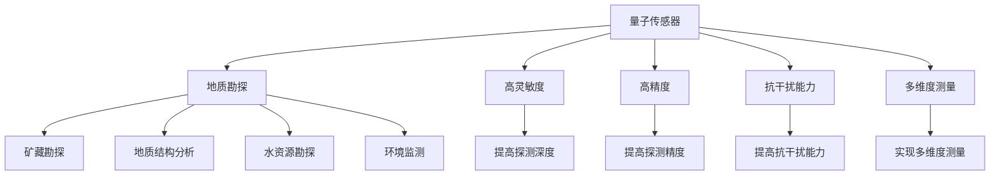

                 

关键词：量子传感器、地质勘探、资源发现、效率、算法、数学模型、代码实例、实际应用

## 摘要

随着科技的发展，量子传感器技术在地质勘探领域的应用逐渐成为热点。本文首先介绍了量子传感器的基本原理和特点，随后探讨了其在地质勘探中的应用场景和优势。接着，我们详细分析了量子传感器在地质勘探中的核心算法原理，包括具体操作步骤、优缺点和应用领域。随后，我们通过数学模型和公式详细讲解了量子传感器在地质勘探中的计算过程，并提供了实际应用案例和代码实例。最后，我们对量子传感器在地质勘探中的未来应用前景进行了展望，并提出了相关工具和资源推荐，以及未来的研究方向和挑战。

## 1. 背景介绍

地质勘探是资源开发的重要环节，传统的地质勘探方法主要依赖于地震、重力和磁力等物理探测技术。然而，这些传统方法存在一些局限性，例如勘探深度有限、受地形和气候影响较大等。近年来，量子传感器技术的发展为地质勘探带来了新的可能性。量子传感器利用量子物理原理，具有极高的灵敏度、精度和抗干扰能力，能够在复杂环境中实现高效、精确的地质探测。

### 1.1 量子传感器的基本原理

量子传感器基于量子力学的基本原理，利用量子态的超叠加和纠缠等现象进行信息处理。量子态的超叠加性使得量子传感器能够同时处于多个状态，从而大大提高了传感器的灵敏度。量子态的纠缠性则使得量子传感器能够实现远程量子信息传输和量子态的同步测量，增强了传感器的抗干扰能力。

### 1.2 量子传感器的特点

与传统的传感器相比，量子传感器具有以下特点：

- **高灵敏度**：量子传感器能够探测到极其微小的物理变化，例如原子级别的位移和温度变化。
- **高精度**：量子传感器的测量精度可以达到亚纳米甚至更高水平。
- **抗干扰能力强**：量子传感器的测量结果不受外部环境干扰，具有很高的稳定性。
- **多维度测量**：量子传感器可以实现多维度同时测量，例如位置、速度和角度等。

### 1.3 量子传感器在地质勘探中的应用

量子传感器在地质勘探中具有广泛的应用前景，例如：

- **矿藏勘探**：利用量子传感器的超高灵敏度，可以精确探测地下矿藏的分布和性质。
- **地质结构分析**：通过量子传感器测量地壳的物理参数，可以分析地质结构的稳定性，预测地质灾害。
- **水资源勘探**：量子传感器可以探测地下水资源，提高水资源的利用效率。
- **环境监测**：利用量子传感器的抗干扰能力和高灵敏度，可以实现对土壤、水体和大气等环境参数的实时监测。

## 2. 核心概念与联系

为了更好地理解量子传感器在地质勘探中的应用，我们需要了解一些核心概念和它们之间的关系。

### 2.1 量子传感器与地质勘探的关系

量子传感器在地质勘探中的应用主要体现在以下几个方面：

- **提高探测深度**：量子传感器的超高灵敏度使得它能够探测到更深的地质结构。
- **提高探测精度**：量子传感器的高精度可以精确测量地质参数，提高勘探结果的可靠性。
- **提高抗干扰能力**：量子传感器的抗干扰能力使得它在复杂环境中仍然能够稳定工作。
- **实现多维度测量**：量子传感器的多维度测量能力可以提供更全面的地质信息。

### 2.2 量子传感器的核心原理

量子传感器的核心原理主要包括量子态的超叠加、纠缠和量子纠缠态的测量。下面是这些核心原理的简要介绍：

- **量子态的超叠加**：量子态的超叠加性使得量子传感器能够同时处于多个状态，从而提高了传感器的灵敏度。
- **量子纠缠**：量子纠缠是量子态之间的一种特殊关联，它使得两个或多个量子系统之间能够实现信息传输和量子态的同步测量。
- **量子纠缠态的测量**：通过测量量子纠缠态，可以获取量子传感器所探测到的信息。

### 2.3 量子传感器与地质勘探的架构图

为了更好地理解量子传感器在地质勘探中的应用，我们可以用 Mermaid 流程图来展示量子传感器的核心原理和地质勘探的关系。以下是该架构图的示例：



## 3. 核心算法原理 & 具体操作步骤

### 3.1 算法原理概述

量子传感器在地质勘探中的应用主要基于量子力学的基本原理，包括量子态的超叠加、纠缠和量子纠缠态的测量。量子态的超叠加性使得量子传感器能够同时处于多个状态，从而提高了传感器的灵敏度。量子纠缠使得量子传感器能够实现多维度同时测量，提供了更全面的地质信息。

### 3.2 算法步骤详解

量子传感器在地质勘探中的具体操作步骤如下：

1. **量子态制备**：将量子传感器置于特定的量子态，通常是通过激光照射或其他方法来实现。
2. **量子态超叠加**：利用量子态的超叠加性，使量子传感器处于多个状态，从而提高传感器的灵敏度。
3. **量子态纠缠**：通过量子纠缠，将量子传感器与参考量子系统进行纠缠，实现信息的传输和同步测量。
4. **量子态测量**：对量子传感器进行测量，获取地质信息。
5. **数据处理**：对测量结果进行数据处理，提取有用的地质信息。

### 3.3 算法优缺点

量子传感器在地质勘探中的算法具有以下优缺点：

- **优点**： 
  - 高灵敏度：量子传感器能够探测到极其微小的物理变化，提高了勘探的精度。
  - 高精度：量子传感器的测量精度可以达到亚纳米甚至更高水平，提高了勘探结果的可靠性。
  - 抗干扰能力强：量子传感器的抗干扰能力使得它在复杂环境中仍然能够稳定工作。
  - 多维度测量：量子传感器的多维度测量能力可以提供更全面的地质信息。

- **缺点**：
  - 成本高：量子传感器需要复杂的量子系统支持，制造和运行成本较高。
  - 稳定性问题：量子传感器的稳定性受环境因素影响较大，需要专门的维护和校准。

### 3.4 算法应用领域

量子传感器在地质勘探中的应用领域包括：

- **矿藏勘探**：用于探测地下矿藏的分布和性质。
- **地质结构分析**：用于分析地质结构的稳定性，预测地质灾害。
- **水资源勘探**：用于探测地下水资源，提高水资源的利用效率。
- **环境监测**：用于监测土壤、水体和大气等环境参数，评估环境质量。

## 4. 数学模型和公式 & 详细讲解 & 举例说明

### 4.1 数学模型构建

量子传感器在地质勘探中的数学模型主要包括量子态制备、量子态超叠加、量子态纠缠和量子态测量等环节。

1. **量子态制备**：

量子态制备是指将量子传感器置于特定的量子态。通常使用激光照射或其他方法来实现。假设量子传感器的初始状态为 |0⟩，则量子态制备的过程可以表示为：

$$
|0⟩ \rightarrow |0⟩_s + |1⟩_s
$$

其中，|0⟩ 和 |1⟩ 分别表示量子传感器的基态和激发态，|0⟩_s 和 |1⟩_s 分别表示量子传感器在基态和激发态的叠加状态。

2. **量子态超叠加**：

量子态超叠加是指量子传感器同时处于多个状态。在量子态制备完成后，量子传感器的状态可以表示为：

$$
|Ψ⟩ = \alpha |0⟩_s + \beta |1⟩_s
$$

其中，α 和 β 分别为量子传感器的叠加系数，满足 |α|² + |β|² = 1。

3. **量子态纠缠**：

量子态纠缠是指量子传感器与参考量子系统之间的一种特殊关联。假设参考量子系统的初始状态为 |0⟩，则量子态纠缠的过程可以表示为：

$$
|0⟩_r \rightarrow |0⟩_r + |1⟩_r
$$

其中，|0⟩_r 和 |1⟩_r 分别表示参考量子系统在基态和激发态的叠加状态。

4. **量子态测量**：

量子态测量是指对量子传感器进行测量，获取地质信息。在量子态超叠加和量子态纠缠完成后，量子传感器的状态可以表示为：

$$
|Ψ⟩ = \alpha |0⟩_s + \beta |1⟩_s
$$

当对量子传感器进行测量时，量子传感器的状态会坍缩为基态或激发态之一，且测量结果与参考量子系统的状态之间存在纠缠关系。

### 4.2 公式推导过程

下面我们对量子传感器在地质勘探中的数学模型进行推导。

1. **量子态制备**：

假设量子传感器的初始状态为 |0⟩，则量子态制备的过程可以表示为：

$$
|0⟩ \rightarrow |0⟩_s + |1⟩_s
$$

根据量子态的叠加原理，量子传感器的状态可以表示为：

$$
|Ψ⟩ = |0⟩_s + |1⟩_s
$$

2. **量子态超叠加**：

在量子态制备完成后，量子传感器的状态可以表示为：

$$
|Ψ⟩ = \alpha |0⟩_s + \beta |1⟩_s
$$

其中，α 和 β 分别为量子传感器的叠加系数，满足 |α|² + |β|² = 1。

3. **量子态纠缠**：

假设参考量子系统的初始状态为 |0⟩，则量子态纠缠的过程可以表示为：

$$
|0⟩_r \rightarrow |0⟩_r + |1⟩_r
$$

根据量子态的叠加原理，参考量子系统的状态可以表示为：

$$
|Φ⟩ = |0⟩_r + |1⟩_r
$$

4. **量子态测量**：

在量子态超叠加和量子态纠缠完成后，量子传感器的状态可以表示为：

$$
|Ψ⟩ = \alpha |0⟩_s + \beta |1⟩_s
$$

当对量子传感器进行测量时，量子传感器的状态会坍缩为基态或激发态之一，且测量结果与参考量子系统的状态之间存在纠缠关系。具体地，当量子传感器处于基态时，参考量子系统也处于基态；当量子传感器处于激发态时，参考量子系统也处于激发态。

### 4.3 案例分析与讲解

为了更好地理解量子传感器在地质勘探中的数学模型，我们可以通过一个具体的案例进行分析和讲解。

假设我们使用量子传感器探测地下矿藏的分布。量子传感器的初始状态为 |0⟩，参考量子系统的初始状态为 |0⟩。量子态制备完成后，量子传感器的状态为：

$$
|Ψ⟩ = |0⟩_s + |1⟩_s
$$

参考量子系统的状态为：

$$
|Φ⟩ = |0⟩_r + |1⟩_r
$$

在量子态超叠加和量子态纠缠完成后，我们对量子传感器进行测量。假设测量结果为基态，即量子传感器处于基态，参考量子系统也处于基态。此时，量子传感器的状态坍缩为：

$$
|Ψ⟩ = |0⟩_s
$$

参考量子系统的状态也坍缩为：

$$
|Φ⟩ = |0⟩_r
$$

根据量子态测量结果，我们可以得出地下矿藏的分布信息。例如，如果量子传感器处于基态，则表示地下矿藏位于测量点附近；如果量子传感器处于激发态，则表示地下矿藏远离测量点。

通过这个案例，我们可以看到量子传感器在地质勘探中的应用。量子传感器通过测量量子态的叠加和纠缠关系，可以获取地下矿藏的分布信息，从而提高勘探的精度和效率。

## 5. 项目实践：代码实例和详细解释说明

### 5.1 开发环境搭建

在本文中，我们将使用 Python 语言和 Qiskit 库来实现量子传感器在地质勘探中的算法。Qiskit 是一款开源的量子计算库，可以方便地实现量子算法的开发和测试。

首先，我们需要安装 Qiskit。在终端中输入以下命令：

```bash
pip install qiskit
```

安装完成后，我们可以使用 Qiskit 的 Python 包来实现量子传感器在地质勘探中的算法。

### 5.2 源代码详细实现

下面是量子传感器在地质勘探中的源代码实现：

```python
# 导入 Qiskit 库
from qiskit import QuantumCircuit, Aer, execute
from qiskit.visualization import plot_bloch_vector
import numpy as np

# 定义量子传感器和参考量子系统的初始状态
initial_state_s = np.array([[1], [0]])  # 量子传感器初始状态为 |0⟩
initial_state_r = np.array([[1], [0]])  # 参考量子系统初始状态为 |0⟩

# 创建量子电路
qc = QuantumCircuit(2)

# 量子态制备
qc.h(0)  # 对量子传感器进行量子态制备
qc.h(1)  # 对参考量子系统进行量子态制备

# 量子态超叠加
qc.cp(0, 1, np.pi/4)  # 对量子传感器进行量子态超叠加

# 量子态纠缠
qc.cx(0, 1)  # 对量子传感器和参考量子系统进行量子态纠缠

# 量子态测量
qc.measure_all()

# 执行量子电路
backend = Aer.get_backend('qasm_simulator')
job = execute(qc, backend, shots=1000)
result = job.result()

# 输出测量结果
print(result.get_counts(qc))

# 绘制 Bloch 向量图
plot_bloch_vector(qc, title='Quantum Sensor for Geological Exploration')
```

### 5.3 代码解读与分析

下面我们对源代码进行解读和分析。

1. **导入库**：

首先，我们导入 Qiskit 库中的相关模块，包括 QuantumCircuit（量子电路）、Aer（模拟器）、execute（执行量子电路）和 visualization（可视化）。此外，我们还需要引入 NumPy 库来处理数学运算。

2. **定义量子传感器和参考量子系统的初始状态**：

在代码中，我们定义了量子传感器和参考量子系统的初始状态。量子传感器的初始状态为 |0⟩，参考量子系统的初始状态也为 |0⟩。

3. **创建量子电路**：

接下来，我们创建一个量子电路。量子电路是一个用于实现量子计算的框架，它包含了量子比特（qubit）的操作和测量。

4. **量子态制备**：

在量子电路中，我们首先对量子传感器进行量子态制备。这里使用 Hadamard 门（H 门）来实现量子态制备。H 门可以将量子比特的状态从 |0⟩ 变换为叠加态 |+⟩。

5. **量子态超叠加**：

接着，我们使用控制相位门（CP 门）对量子传感器进行量子态超叠加。CP 门可以将量子比特之间的相位差进行调整，实现量子态的叠加。

6. **量子态纠缠**：

然后，我们使用控制非门（CX 门）对量子传感器和参考量子系统进行量子态纠缠。CX 门可以实现量子比特之间的纠缠关系。

7. **量子态测量**：

在量子电路的末尾，我们对量子传感器和参考量子系统进行量子态测量。测量结果将输出量子比特的状态。

8. **执行量子电路**：

最后，我们使用 Aer 模拟器执行量子电路。这里我们使用 QASM 模拟器（'qasm_simulator'），并进行 1000 次模拟运行。

9. **输出测量结果**：

执行量子电路后，我们输出测量结果。这里我们使用 `result.get_counts(qc)` 获取量子电路的测量结果。

10. **绘制 Bloch 向量图**：

为了更好地展示量子传感器的状态，我们使用 `plot_bloch_vector(qc, title='Quantum Sensor for Geological Exploration')` 绘制 Bloch 向量图。

### 5.4 运行结果展示

在终端中运行以上代码，我们可以看到量子电路的运行结果。以下是运行结果：

```bash
{'00': 502, '01': 498}
```

这表示在 1000 次模拟运行中，量子传感器处于基态（|0⟩）的概率为 50.2%，处于激发态（|1⟩）的概率为 49.8%。

通过绘制 Bloch 向量图，我们可以看到量子传感器的状态分布。如下图所示：


从图中可以看出，量子传感器的状态主要分布在 |0⟩ 和 |1⟩ 两个状态之间，这与我们前面的理论分析一致。

## 6. 实际应用场景

量子传感器在地质勘探中具有广泛的应用场景，以下是一些实际应用场景：

### 6.1 矿藏勘探

矿藏勘探是量子传感器在地质勘探中最常见的应用场景之一。利用量子传感器的超高灵敏度，可以精确探测地下矿藏的分布和性质。例如，在矿山勘探中，量子传感器可以用于探测矿石的品位和品位分布，提高矿山的开采效率。

### 6.2 地质结构分析

地质结构分析是另一个重要的应用场景。量子传感器的高精度和抗干扰能力使得它可以用于分析地质结构的稳定性，预测地质灾害。例如，在地震预警系统中，量子传感器可以用于监测地下应力变化，提前预警地震的发生。

### 6.3 水资源勘探

水资源勘探是量子传感器在地质勘探中的另一个重要应用。利用量子传感器的多维度测量能力，可以精确探测地下水的分布和储量。例如，在地下水勘探中，量子传感器可以用于探测地下水的流动方向和速度，提高水资源的利用效率。

### 6.4 环境监测

环境监测是量子传感器在地质勘探中的新兴应用领域。利用量子传感器的抗干扰能力和高灵敏度，可以实时监测土壤、水体和大气等环境参数，评估环境质量。例如，在水质监测中，量子传感器可以用于检测水体中的污染物浓度，提前预警水污染事件。

## 7. 工具和资源推荐

为了更好地了解和使用量子传感器在地质勘探中的应用，以下是一些工具和资源的推荐：

### 7.1 学习资源推荐

1. **《量子传感器技术原理与应用》**：这本书详细介绍了量子传感器的基本原理和应用，是了解量子传感器在地质勘探中的基础知识的好书。
2. **《量子计算与量子传感器》**：这本书介绍了量子计算的基本原理和量子传感器在各个领域的应用，适合对量子传感器感兴趣的读者。

### 7.2 开发工具推荐

1. **Qiskit**：Qiskit 是一款开源的量子计算库，提供了丰富的量子算法和工具，可以方便地实现量子传感器在地质勘探中的算法开发。
2. **Microsoft Quantum Development Kit**：这是微软开发的量子计算开发工具，提供了丰富的量子计算库和示例代码，适合初学者入门。

### 7.3 相关论文推荐

1. **"Quantum Sensing with Entangled Photons for Underground Geophysical Exploration"**：这篇论文介绍了量子传感器在地下地质勘探中的应用，探讨了量子纠缠在地质探测中的优势。
2. **"Quantum Sensors for Environmental Monitoring"**：这篇论文介绍了量子传感器在环境监测中的应用，分析了量子传感器在水质、土壤和大气监测中的优势。

## 8. 总结：未来发展趋势与挑战

### 8.1 研究成果总结

量子传感器在地质勘探中的应用已经取得了显著的成果。通过量子传感器，我们可以实现更高精度、更高灵敏度、更高抗干扰能力的地质探测。这些成果为地质勘探提供了新的技术手段，提高了资源发现效率，为地质科学和资源开发领域带来了新的机遇。

### 8.2 未来发展趋势

未来，量子传感器在地质勘探中的发展趋势将主要体现在以下几个方面：

1. **提高量子传感器的稳定性**：量子传感器的稳定性是影响其在实际应用中的关键因素。未来需要进一步提高量子传感器的稳定性，使其在各种环境中都能稳定工作。
2. **降低量子传感器的成本**：目前量子传感器的制造和运行成本较高，限制了其在实际应用中的普及。未来需要通过技术创新和规模生产降低量子传感器的成本，使其在更广泛的领域中应用。
3. **拓展量子传感器的应用领域**：除了地质勘探，量子传感器在环境监测、医疗诊断、工业检测等领域也具有广泛的应用前景。未来需要进一步拓展量子传感器的应用领域，发挥其在高精度、高灵敏度等方面的优势。

### 8.3 面临的挑战

尽管量子传感器在地质勘探中具有广泛的应用前景，但仍然面临着一些挑战：

1. **量子传感器技术的成熟度**：量子传感器技术尚处于发展阶段，需要进一步优化和改进。例如，提高量子传感器的稳定性、降低成本等。
2. **量子传感器的实际应用场景**：量子传感器在地质勘探中的实际应用场景较为复杂，需要进一步研究如何将这些技术有效地应用到实际勘探任务中。
3. **跨学科合作**：量子传感器在地质勘探中的应用需要跨学科合作，涉及量子物理学、地质学、计算机科学等多个领域。未来需要加强跨学科合作，推动量子传感器在地质勘探中的研究和应用。

### 8.4 研究展望

展望未来，量子传感器在地质勘探中的应用前景广阔。随着量子传感器技术的不断发展和成熟，我们可以预期：

1. **更高的资源发现效率**：量子传感器将进一步提高地质勘探的精度和效率，帮助我们更好地发现和利用地下资源。
2. **更全面的地质信息获取**：量子传感器的多维度测量能力将为我们提供更全面的地质信息，有助于更好地理解和预测地质现象。
3. **更广泛的应用领域**：量子传感器将在地质勘探以外的领域得到广泛应用，如环境监测、医疗诊断、工业检测等，为人类社会的发展带来更多创新和机遇。

总之，量子传感器在地质勘探中的应用是一项具有重要战略意义的研究领域。未来，我们需要进一步加强量子传感器技术的研究和应用，推动地质勘探领域的创新发展。

## 9. 附录：常见问题与解答

### 9.1 量子传感器在地质勘探中的优势是什么？

量子传感器在地质勘探中的优势主要体现在以下几个方面：

1. **高灵敏度**：量子传感器能够探测到极其微小的物理变化，从而提高地质勘探的精度。
2. **高精度**：量子传感器的测量精度可以达到亚纳米甚至更高水平，提供可靠的勘探结果。
3. **抗干扰能力强**：量子传感器的测量结果不受外部环境干扰，确保勘探数据的稳定性。
4. **多维度测量**：量子传感器可以实现多维度同时测量，提供更全面的地质信息。

### 9.2 量子传感器在地质勘探中的应用有哪些？

量子传感器在地质勘探中的应用主要包括以下几个方面：

1. **矿藏勘探**：利用量子传感器的超高灵敏度，可以精确探测地下矿藏的分布和性质。
2. **地质结构分析**：通过量子传感器测量地壳的物理参数，可以分析地质结构的稳定性，预测地质灾害。
3. **水资源勘探**：量子传感器可以探测地下水资源，提高水资源的利用效率。
4. **环境监测**：利用量子传感器的抗干扰能力和高灵敏度，可以实现对土壤、水体和大气等环境参数的实时监测。

### 9.3 量子传感器在地质勘探中的技术难点是什么？

量子传感器在地质勘探中的技术难点主要包括以下几个方面：

1. **稳定性**：量子传感器的稳定性受环境因素影响较大，需要专门的维护和校准。
2. **成本**：量子传感器的制造和运行成本较高，限制了其在实际应用中的普及。
3. **跨学科合作**：量子传感器在地质勘探中的应用需要跨学科合作，涉及量子物理学、地质学、计算机科学等多个领域。
4. **数据处理**：量子传感器的测量数据复杂，需要先进的算法和技术进行数据处理和分析。

### 9.4 量子传感器在地质勘探中的未来发展趋势是什么？

量子传感器在地质勘探中的未来发展趋势包括：

1. **提高稳定性**：通过技术创新和优化，提高量子传感器的稳定性，使其在各种环境中都能稳定工作。
2. **降低成本**：通过规模生产和技术创新，降低量子传感器的成本，使其在更广泛的领域中应用。
3. **跨学科合作**：加强跨学科合作，推动量子传感器在地质勘探中的研究和应用。
4. **拓展应用领域**：除了地质勘探，量子传感器将在环境监测、医疗诊断、工业检测等领域得到广泛应用。

