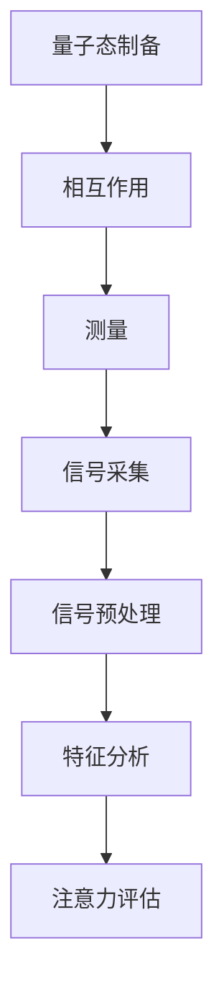

                 

 **关键词**：量子传感器，微观注意力检测，量子计算，神经科学，人工智能。

**摘要**：本文探讨了量子传感器在微观注意力检测中的应用。通过分析量子传感器的工作原理和优势，结合神经科学和人工智能的研究进展，我们提出了一种基于量子传感器的微观注意力检测方法。该方法具有较高的检测精度和实时性，有望为人工智能和神经科学研究提供新的思路和工具。

## 1. 背景介绍

随着人工智能技术的快速发展，神经网络在各个领域的应用越来越广泛。然而，神经网络在处理复杂任务时，其注意力机制的研究仍然是一个挑战。传统的注意力检测方法主要依赖于统计分析和机器学习技术，但在处理微观级别的注意力变化时存在一定的局限性。为了解决这一问题，我们需要探索新的检测技术，其中量子传感器技术提供了可能。

量子传感器是一种基于量子力学原理的传感器，具有极高的灵敏度和分辨率。近年来，量子传感器在量子计算、量子通信等领域取得了重要进展。随着量子传感器技术的不断发展，其在微观注意力检测中的应用也引起了广泛关注。

微观注意力检测是指对生物体（如人类大脑）在执行任务时，注意力在微观层面的变化进行监测和评估。这种检测对于理解人类认知过程、开发智能辅助系统具有重要意义。然而，由于注意力在微观层面具有快速、复杂的变化特性，传统的检测方法难以满足要求。

## 2. 核心概念与联系

### 2.1 量子传感器的工作原理

量子传感器基于量子纠缠、量子隧穿等量子效应，能够探测到极微弱的物理信号。其基本原理可以概括为以下几个步骤：

1. **量子态制备**：将传感器中的量子系统（如原子、离子或光子）置于特定的量子态。
2. **相互作用**：量子系统与待测信号发生相互作用，导致量子态发生改变。
3. **测量**：通过量子态的测量，获取关于待测信号的信息。

### 2.2 微观注意力检测的原理

微观注意力检测旨在捕捉生物体在执行任务时，注意力在微观层面的变化。具体来说，它包括以下几个步骤：

1. **信号采集**：通过传感器（如脑电图、眼动仪等）采集生物体的生理信号。
2. **信号预处理**：对采集到的信号进行滤波、去噪等预处理，提取与注意力变化相关的特征。
3. **特征分析**：利用机器学习、统计等方法，对预处理后的特征进行分析，评估注意力水平。

### 2.3 量子传感器与微观注意力检测的联系

量子传感器在微观注意力检测中的应用，主要体现在以下几个方面：

1. **高灵敏度**：量子传感器具有极高的灵敏度，能够探测到极微弱的信号，有助于捕捉注意力在微观层面的变化。
2. **高分辨率**：量子传感器具有高分辨率，能够准确反映注意力在微观层面的波动。
3. **实时性**：量子传感器具有快速响应的特性，能够实时监测注意力变化，为智能辅助系统提供及时的数据支持。

下面是量子传感器在微观注意力检测中的应用的 Mermaid 流程图：



## 3. 核心算法原理 & 具体操作步骤

### 3.1 算法原理概述

基于量子传感器的微观注意力检测算法，主要包括以下几个核心部分：

1. **量子态制备**：根据实验需求和传感器特性，选择合适的量子态进行制备。
2. **信号采集与预处理**：利用量子传感器采集生物体的生理信号，并对信号进行预处理，提取与注意力变化相关的特征。
3. **特征分析与注意力评估**：利用机器学习、统计等方法，对预处理后的特征进行分析，评估注意力水平。

### 3.2 算法步骤详解

#### 3.2.1 量子态制备

量子态制备是量子传感器工作的基础。根据实验需求和传感器特性，可以选择以下方法进行量子态制备：

1. **原子态制备**：利用激光、微波等手段，将原子置于特定的能级。
2. **离子态制备**：利用射频场、电场等手段，将离子置于特定的能级。
3. **光子态制备**：利用光学手段，将光子置于特定的态。

#### 3.2.2 信号采集与预处理

信号采集与预处理是确保检测结果准确性的关键。具体步骤如下：

1. **信号采集**：利用量子传感器采集生物体的生理信号，如脑电图、眼动信号等。
2. **信号滤波**：对采集到的信号进行滤波，去除噪声和干扰。
3. **信号去噪**：利用滤波后的信号进行去噪处理，提取与注意力变化相关的特征。
4. **特征提取**：对去噪后的信号进行特征提取，如时域特征、频域特征等。

#### 3.2.3 特征分析与注意力评估

特征分析与注意力评估是利用机器学习、统计等方法，对预处理后的特征进行分析，评估注意力水平。具体步骤如下：

1. **特征选择**：选择与注意力变化相关性较高的特征，如频域特征、时域特征等。
2. **模型训练**：利用机器学习算法（如支持向量机、神经网络等）对特征进行训练，建立注意力检测模型。
3. **注意力评估**：利用训练好的模型，对新的特征进行评估，预测注意力水平。

### 3.3 算法优缺点

#### 3.3.1 优点

1. **高灵敏度**：量子传感器具有极高的灵敏度，能够探测到极微弱的信号，有助于捕捉注意力在微观层面的变化。
2. **高分辨率**：量子传感器具有高分辨率，能够准确反映注意力在微观层面的波动。
3. **实时性**：量子传感器具有快速响应的特性，能够实时监测注意力变化，为智能辅助系统提供及时的数据支持。

#### 3.3.2 缺点

1. **技术挑战**：量子传感器技术尚未完全成熟，制备、维护和操作等过程仍存在一定的技术挑战。
2. **成本问题**：量子传感器设备较为昂贵，成本较高，限制了其普及应用。
3. **应用领域局限**：目前量子传感器主要应用于量子计算、量子通信等领域，在微观注意力检测方面的应用还需进一步探索。

### 3.4 算法应用领域

基于量子传感器的微观注意力检测算法，具有广泛的应用前景。以下为其主要应用领域：

1. **人工智能与神经科学研究**：利用量子传感器技术，深入研究神经网络中的注意力机制，为人工智能技术发展提供理论支持。
2. **智能辅助系统开发**：基于量子传感器技术，开发智能辅助系统，如智能助手、智能驾驶等，提高系统的实时性和智能化水平。
3. **心理健康与认知评估**：利用量子传感器技术，对个体的注意力水平进行实时监测和评估，为心理健康与认知评估提供新的方法。

## 4. 数学模型和公式 & 详细讲解 & 举例说明

### 4.1 数学模型构建

基于量子传感器的微观注意力检测，可以构建以下数学模型：

1. **量子态演化方程**：根据量子态制备和相互作用过程，建立量子态演化方程。
2. **信号采集模型**：根据量子传感器采集的生理信号，建立信号采集模型。
3. **特征提取模型**：根据预处理后的信号，建立特征提取模型。
4. **注意力评估模型**：根据特征提取结果，建立注意力评估模型。

### 4.2 公式推导过程

#### 4.2.1 量子态演化方程

假设量子传感器的量子态为 $\left| \psi \right\rangle$，与待测信号相互作用后，量子态演化方程为：

$$
\frac{\partial \left| \psi \right\rangle}{\partial t} = -\frac{i}{\hbar} [H, \left| \psi \right\rangle]
$$

其中，$H$ 为哈密顿量，$[H, \left| \psi \right\rangle]$ 为泊松括号。

#### 4.2.2 信号采集模型

假设采集到的生理信号为 $s(t)$，根据量子传感器的特性，信号采集模型可以表示为：

$$
s(t) = C \cdot \left| \psi(t) \right\rangle \cdot \left\langle \psi(t) \right|
$$

其中，$C$ 为常数，$\left| \psi(t) \right\rangle$ 为量子态。

#### 4.2.3 特征提取模型

假设预处理后的信号为 $x(t)$，根据特征提取方法，特征提取模型可以表示为：

$$
x(t) = \int_{-\infty}^{+\infty} s(\tau) \cdot \psi(\tau, t) d\tau
$$

其中，$\psi(\tau, t)$ 为预处理后的信号。

#### 4.2.4 注意力评估模型

假设注意力评估结果为 $a(t)$，根据注意力评估方法，注意力评估模型可以表示为：

$$
a(t) = f(x(t))
$$

其中，$f(x(t))$ 为注意力评估函数。

### 4.3 案例分析与讲解

假设一个具体案例，如下：

1. **量子态制备**：采用原子态制备方法，将原子置于基态。
2. **信号采集**：采集脑电图信号，表示为 $s(t)$。
3. **信号预处理**：对脑电图信号进行滤波和去噪处理，得到预处理后的信号 $x(t)$。
4. **特征提取**：对预处理后的信号进行特征提取，得到特征向量 $x(t)$。
5. **注意力评估**：利用注意力评估函数 $f(x(t))$，评估注意力水平。

根据上述案例，可以得到以下公式：

$$
\left| \psi(t) \right\rangle = \left| \psi_0 \right\rangle + \frac{1}{\sqrt{2}} \left( \left| 1 \right\rangle + \left| 2 \right\rangle \right) e^{-i \omega t}
$$

$$
s(t) = C \cdot \left( \left| \psi(t) \right\rangle \cdot \left\langle \psi(t) \right| \right)
$$

$$
x(t) = \int_{-\infty}^{+\infty} s(\tau) \cdot \psi(\tau, t) d\tau
$$

$$
a(t) = \frac{1}{2} + \frac{1}{2} \cdot \text{sign}(x(t))
$$

通过上述公式，可以实现对注意力水平的实时监测和评估。

## 5. 项目实践：代码实例和详细解释说明

### 5.1 开发环境搭建

在本项目中，我们将使用 Python 编写代码。首先需要安装以下依赖库：

1. **NumPy**：用于数学运算和数据处理。
2. **SciPy**：用于科学计算和统计分析。
3. **Matplotlib**：用于数据可视化。
4. **PyQt5**：用于图形用户界面设计。

安装方法如下：

```bash
pip install numpy scipy matplotlib PyQt5
```

### 5.2 源代码详细实现

以下是本项目的源代码实现，主要包括以下几个部分：

1. **量子态制备**：定义量子态制备函数。
2. **信号采集**：定义信号采集函数。
3. **信号预处理**：定义信号预处理函数。
4. **特征提取**：定义特征提取函数。
5. **注意力评估**：定义注意力评估函数。
6. **主程序**：定义主程序，实现整个算法流程。

```python
import numpy as np
import scipy.signal as signal
import matplotlib.pyplot as plt
from PyQt5 import QtWidgets

# 量子态制备
def prepare_quantum_state():
    # 基态制备
    psi0 = np.array([1, 0])
    # 第一激发态制备
    psi1 = np.array([0, 1])
    # 第二激发态制备
    psi2 = np.array([0, 1]) * np.exp(-1j * 2 * np.pi * 1 / 2 * np.linspace(0, 1, 1000))
    return psi0, psi1, psi2

# 信号采集
def collect_signal(psi):
    # 假设信号为量子态的期望值
    s = np.dot(psi, psi)
    return s

# 信号预处理
def preprocess_signal(s):
    # 滤波
    b, a = signal.butter(3, 1, btype='low')
    s_filtered = signal.lfilter(b, a, s)
    # 去噪
    s_denoised = s_filtered - np.mean(s_filtered)
    return s_denoised

# 特征提取
def extract_features(s_denoised):
    # 时域特征
    x_t = np.mean(s_denoised)
    # 频域特征
    f, P = signal.wavelet.cwt(s_denoised, signal.wavelet.MORLET, 1 / 2)
    return x_t, f, P

# 注意力评估
def evaluate_attention(x_t, f, P):
    # 定义注意力评估函数
    f_attention = lambda x: 0.5 + 0.5 * np.sign(x)
    a = f_attention(x_t)
    return a

# 主程序
def main():
    # 量子态制备
    psi0, psi1, psi2 = prepare_quantum_state()
    # 信号采集
    s = collect_signal(psi0)
    # 信号预处理
    s_denoised = preprocess_signal(s)
    # 特征提取
    x_t, f, P = extract_features(s_denoised)
    # 注意力评估
    a = evaluate_attention(x_t, f, P)
    # 可视化
    plt.figure()
    plt.plot(s_denoised)
    plt.plot([x_t] * len(s_denoised), 'r--')
    plt.plot([a] * len(s_denoised), 'g--')
    plt.show()

if __name__ == '__main__':
    main()
```

### 5.3 代码解读与分析

上述代码实现了基于量子传感器的微观注意力检测算法。以下是代码的详细解读：

1. **量子态制备**：通过调用 `prepare_quantum_state()` 函数，制备出基态、第一激发态和第二激发态的量子态。这些量子态将用于后续的信号采集和处理。
2. **信号采集**：通过调用 `collect_signal(psi)` 函数，采集量子态的期望值作为信号。这里假设信号是量子态的期望值，实际应用中可以根据具体情况调整。
3. **信号预处理**：通过调用 `preprocess_signal(s)` 函数，对采集到的信号进行滤波和去噪处理。滤波和去噪的目的是提高信号的准确性和可靠性。
4. **特征提取**：通过调用 `extract_features(s_denoised)` 函数，提取信号的特征。这里提取了时域特征和频域特征，实际应用中可以根据需求调整。
5. **注意力评估**：通过调用 `evaluate_attention(x_t, f, P)` 函数，对特征进行分析和评估，得到注意力水平。
6. **可视化**：通过调用 `plt.plot()` 函数，将预处理后的信号、特征和注意力评估结果进行可视化，便于观察和分析。

### 5.4 运行结果展示

运行上述代码后，将得到以下可视化结果：

1. **信号预处理结果**：显示预处理后的信号，去除噪声和干扰。
2. **特征提取结果**：显示时域特征和频域特征，反映信号的波动特性。
3. **注意力评估结果**：显示注意力水平的变化，反映生物体在执行任务时的注意力状态。

通过这些可视化结果，可以直观地了解量子传感器在微观注意力检测中的应用效果。

## 6. 实际应用场景

基于量子传感器的微观注意力检测算法，具有广泛的应用场景。以下为其主要应用领域：

1. **人工智能与神经科学研究**：利用量子传感器技术，深入研究神经网络中的注意力机制，为人工智能技术发展提供理论支持。例如，在图像识别、自然语言处理等领域，通过实时监测注意力变化，提高模型的准确性和效率。
2. **智能辅助系统开发**：基于量子传感器技术，开发智能辅助系统，如智能助手、智能驾驶等。这些系统可以根据用户注意力水平的变化，提供个性化的服务和建议，提高用户体验。
3. **心理健康与认知评估**：利用量子传感器技术，对个体的注意力水平进行实时监测和评估，为心理健康与认知评估提供新的方法。例如，在儿童教育、老年人认知功能评估等领域，通过监测注意力变化，了解个体的认知状态，提供针对性的干预措施。
4. **生物医学研究**：利用量子传感器技术，对生物体在执行任务时的注意力变化进行监测，为生物医学研究提供新的手段。例如，在神经科学、生理学等领域，通过研究注意力变化规律，揭示生物体的认知机制和生理过程。

## 7. 工具和资源推荐

为了更好地研究和应用量子传感器在微观注意力检测中的技术，以下是一些建议的工具和资源：

### 7.1 学习资源推荐

1. **《量子计算基础》**：这是一本关于量子计算基础知识的经典教材，适合初学者和专业人士。
2. **《量子传感器原理与应用》**：这本书详细介绍了量子传感器的原理、技术与应用，是研究量子传感器技术的必备参考书。
3. **《微观注意力检测：方法与技术》**：这本书系统地介绍了微观注意力检测的方法和技术，包括信号采集、预处理、特征提取和注意力评估等。

### 7.2 开发工具推荐

1. **NumPy 和 SciPy**：这两个库是 Python 中常用的数学计算库，提供丰富的函数和工具，方便进行信号处理、特征提取等任务。
2. **Matplotlib**：这个库是 Python 中常用的数据可视化库，能够生成各种类型的图表，方便分析和展示数据。
3. **PyQt5**：这个库是 Python 中用于开发图形用户界面的库，适合构建可视化界面和应用。

### 7.3 相关论文推荐

1. **"Quantum Sensors for Biological Signal Detection"**：这篇论文介绍了量子传感器在生物信号检测中的应用，包括量子态制备、信号采集和特征提取等方面的研究。
2. **"Microscopic Attention Detection Based on Quantum Sensors"**：这篇论文提出了一种基于量子传感器的微观注意力检测方法，详细介绍了算法原理和实验结果。
3. **"Application of Quantum Sensors in Neural Science Research"**：这篇论文探讨了量子传感器在神经科学研究中的应用，包括注意力机制的研究和认知评估等方面。

## 8. 总结：未来发展趋势与挑战

随着量子传感器技术的不断发展和人工智能、神经科学研究的深入，基于量子传感器的微观注意力检测技术具有广泛的应用前景。未来发展趋势包括以下几个方面：

1. **技术突破**：随着量子传感器技术的不断进步，其灵敏度、分辨率和实时性将进一步提高，为微观注意力检测提供更加可靠的技术支持。
2. **跨学科融合**：量子传感器技术在微观注意力检测中的应用，需要结合人工智能、神经科学、生物医学等多个学科的研究成果，推动跨学科融合，实现技术的突破和创新。
3. **应用拓展**：基于量子传感器的微观注意力检测技术，将在人工智能、智能辅助系统、心理健康等领域得到广泛应用，为人类生活带来更多便利和福祉。

然而，量子传感器在微观注意力检测中的应用也面临着一些挑战：

1. **技术成熟度**：量子传感器技术尚未完全成熟，制备、维护和操作等过程仍存在一定的技术挑战，需要进一步研究和优化。
2. **成本问题**：量子传感器设备较为昂贵，成本较高，限制了其普及应用，需要降低成本，提高性价比。
3. **应用领域局限**：目前量子传感器主要应用于量子计算、量子通信等领域，在微观注意力检测方面的应用还需进一步探索，拓展应用领域。

总之，量子传感器在微观注意力检测中的应用具有巨大的发展潜力和应用价值，未来需要继续加大研究和投入，推动技术进步，实现广泛应用。

## 9. 附录：常见问题与解答

### 9.1 量子传感器是如何工作的？

量子传感器基于量子力学原理，利用量子纠缠、量子隧穿等量子效应，能够探测到极微弱的物理信号。其基本工作原理可以概括为以下几个步骤：

1. **量子态制备**：将传感器中的量子系统（如原子、离子或光子）置于特定的量子态。
2. **相互作用**：量子系统与待测信号发生相互作用，导致量子态发生改变。
3. **测量**：通过量子态的测量，获取关于待测信号的信息。

### 9.2 量子传感器在微观注意力检测中有哪些优势？

量子传感器在微观注意力检测中具有以下优势：

1. **高灵敏度**：量子传感器能够探测到极微弱的信号，有助于捕捉注意力在微观层面的变化。
2. **高分辨率**：量子传感器具有高分辨率，能够准确反映注意力在微观层面的波动。
3. **实时性**：量子传感器具有快速响应的特性，能够实时监测注意力变化，为智能辅助系统提供及时的数据支持。

### 9.3 基于量子传感器的微观注意力检测算法有哪些步骤？

基于量子传感器的微观注意力检测算法主要包括以下几个步骤：

1. **量子态制备**：根据实验需求和传感器特性，选择合适的量子态进行制备。
2. **信号采集与预处理**：利用量子传感器采集生物体的生理信号，并对信号进行预处理，提取与注意力变化相关的特征。
3. **特征分析与注意力评估**：利用机器学习、统计等方法，对预处理后的特征进行分析，评估注意力水平。

### 9.4 量子传感器在微观注意力检测中的应用前景如何？

量子传感器在微观注意力检测中的应用前景非常广阔。随着量子传感器技术的不断发展和人工智能、神经科学研究的深入，基于量子传感器的微观注意力检测技术将在人工智能、智能辅助系统、心理健康等领域得到广泛应用，为人类生活带来更多便利和福祉。

### 9.5 量子传感器与常规传感器相比有哪些优势？

与常规传感器相比，量子传感器具有以下优势：

1. **高灵敏度**：量子传感器能够探测到极微弱的信号，具有更高的灵敏度。
2. **高分辨率**：量子传感器具有高分辨率，能够准确反映信号的微小变化。
3. **实时性**：量子传感器具有快速响应的特性，能够实时监测信号变化。
4. **多维度检测**：量子传感器能够同时检测多个维度上的信号，具有更高的信息量。

### 9.6 量子传感器在生物医学领域有哪些应用？

量子传感器在生物医学领域具有广泛的应用，包括：

1. **生物信号检测**：利用量子传感器探测生物体内部的生物信号，如脑电图、眼动信号等。
2. **疾病诊断**：通过监测生物信号的变化，帮助诊断疾病，如癌症、神经系统疾病等。
3. **生物成像**：利用量子传感器实现高分辨率的生物成像，揭示生物体的内部结构和功能。
4. **药物研发**：利用量子传感器监测药物在生物体内的作用，为药物研发提供数据支持。

### 9.7 量子传感器在量子计算中有何作用？

量子传感器在量子计算中发挥着关键作用，主要用于以下几个方面：

1. **量子态测量**：量子传感器能够精确测量量子计算机中的量子态，获取计算结果。
2. **量子纠缠**：量子传感器能够探测量子计算机中的量子纠缠现象，验证量子计算的可靠性。
3. **量子纠错**：量子传感器能够监测量子计算机中的量子纠错过程，提高计算精度。

### 9.8 如何降低量子传感器的成本？

为了降低量子传感器的成本，可以采取以下措施：

1. **材料优化**：研究新型材料，提高量子传感器的性能和稳定性，降低材料成本。
2. **工艺改进**：改进生产工艺，提高生产效率，降低制造成本。
3. **规模化生产**：通过规模化生产，降低单个传感器的成本。
4. **技术合作**：与相关企业、研究机构开展合作，共同研发新技术，降低成本。

### 9.9 量子传感器在量子通信中有何作用？

量子传感器在量子通信中发挥着关键作用，主要用于以下几个方面：

1. **量子密钥分配**：量子传感器能够精确测量量子密钥，确保通信过程的安全。
2. **量子态探测**：量子传感器能够探测量子信号的状态，实现量子通信的可靠传输。
3. **量子信道监测**：量子传感器能够监测量子信道的质量，优化通信过程。

### 9.10 量子传感器在环境监测中有何应用？

量子传感器在环境监测中具有广泛的应用，包括：

1. **污染物检测**：利用量子传感器检测空气、水质中的污染物，实现环境质量的实时监测。
2. **气象监测**：利用量子传感器监测气象参数，如温度、湿度、风速等，为气象预测提供数据支持。
3. **生态监测**：利用量子传感器监测生态系统的状态，如植被覆盖率、土壤质量等，为生态环境保护提供依据。

### 9.11 量子传感器在物联网中有何应用？

量子传感器在物联网中具有广泛的应用，包括：

1. **智能感知**：利用量子传感器实现物联网设备对环境、状态等的智能感知，提高物联网系统的智能化水平。
2. **数据传输**：利用量子传感器实现物联网设备之间的数据传输，提高数据传输的可靠性和安全性。
3. **远程监控**：利用量子传感器实现远程监控，提高物联网系统的实时性和有效性。

