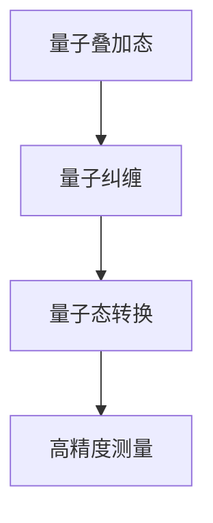

                 

量子传感器是一种利用量子力学原理制造的高精度传感器，它能在微观尺度上实现前所未有的测量精度。本文将深入探讨量子传感器在精密测量领域的应用，特别是它们如何突破传统物理学的测量极限。

> 关键词：量子传感器、精密测量、量子力学、测量极限、应用领域

## 1. 背景介绍

随着科技的飞速发展，我们对于测量的要求越来越高，精度和灵敏度的需求也越来越强烈。传统传感器在测量极限上受到经典物理学的限制，难以进一步突破。然而，量子力学的诞生为测量领域带来了新的可能。量子传感器利用量子叠加态、量子纠缠等现象，可以在微观尺度上实现更高的精度和灵敏度，从而突破传统物理学的测量极限。

## 2. 核心概念与联系

量子传感器的工作原理基于以下几个核心概念：

- **量子叠加态**：量子比特可以同时处于多种状态，这种叠加态是实现高精度测量的基础。
- **量子纠缠**：两个或多个量子比特之间的纠缠关系，使得它们的状态相互依赖，从而实现远距离的信息传递和测量。
- **量子态转换**：通过特定的操作，可以将量子比特从一个状态转换为另一个状态，从而实现测量。

下面是量子传感器核心概念原理和架构的 Mermaid 流程图：



## 3. 核心算法原理 & 具体操作步骤

### 3.1 算法原理概述

量子传感器的核心算法原理是基于量子态的测量。通过量子态的叠加和纠缠，可以实现更高精度的测量。具体来说，量子传感器首先将量子比特置于叠加态，然后通过纠缠操作，将多个量子比特的状态相互关联。最后，通过对量子态的测量，可以得到高精度的测量结果。

### 3.2 算法步骤详解

1. **初始化量子比特**：将量子比特初始化为叠加态。
2. **纠缠操作**：通过量子门实现量子比特之间的纠缠。
3. **测量**：对量子态进行测量，得到测量结果。
4. **误差修正**：根据测量结果，进行误差修正。

### 3.3 算法优缺点

- **优点**：量子传感器可以在微观尺度上实现前所未有的测量精度，具有极高的灵敏度和分辨率。
- **缺点**：量子传感器技术复杂，实现难度大，且受环境影响较大。

### 3.4 算法应用领域

量子传感器在多个领域有广泛的应用，包括：

- **量子计算**：用于实现量子比特之间的纠缠，提高计算效率。
- **量子通信**：用于实现量子态的传输，确保通信的安全性。
- **精密测量**：用于测量微小物理量，如引力、温度等。

## 4. 数学模型和公式 & 详细讲解 & 举例说明

量子传感器的数学模型基于量子力学的相关公式。以下是对数学模型和公式的详细讲解。

### 4.1 数学模型构建

量子传感器的数学模型主要涉及量子态的叠加、纠缠和测量。具体公式如下：

$$
|\psi\rangle = \sum_{i} c_i |i\rangle
$$

其中，$|i\rangle$ 表示量子比特的基态，$c_i$ 表示叠加系数。

### 4.2 公式推导过程

量子传感器的测量过程可以看作是一个投影操作。具体推导过程如下：

1. **量子态的叠加**：将量子比特初始化为叠加态。

$$
|\psi\rangle = \frac{1}{\sqrt{2}}(|0\rangle + |1\rangle)
$$

2. **纠缠操作**：通过量子门实现量子比特之间的纠缠。

$$
|\psi'\rangle = U(|\psi\rangle)
$$

其中，$U$ 是纠缠操作。

3. **测量**：对量子态进行测量。

$$
P_i = |\langle i|\psi'\rangle|^2
$$

其中，$P_i$ 表示测量得到基态 $|i\rangle$ 的概率。

### 4.3 案例分析与讲解

以下是一个简单的量子传感器测量微小物理量的案例：

假设我们使用一个量子比特进行测量，测量对象是一个微小的位移量。

1. **初始化量子比特**：将量子比特初始化为叠加态。

$$
|\psi\rangle = \frac{1}{\sqrt{2}}(|0\rangle + |1\rangle)
$$

2. **纠缠操作**：通过量子门实现量子比特之间的纠缠。

$$
|\psi'\rangle = U(|\psi\rangle)
$$

其中，$U$ 是一个将叠加态转换为纠缠态的量子门。

3. **测量**：对量子态进行测量。

$$
P_0 = |\langle 0|\psi'\rangle|^2 = \frac{1}{2}
$$

$$
P_1 = |\langle 1|\psi'\rangle|^2 = \frac{1}{2}
$$

根据测量结果，我们可以得知量子比特处于叠加态，且测量到的微小位移量的概率为 50%。

## 5. 项目实践：代码实例和详细解释说明

以下是一个简单的 Python 代码实例，用于实现量子传感器的测量过程。

```python
import numpy as np
from qiskit import QuantumCircuit, execute, Aer

# 初始化量子比特
qc = QuantumCircuit(1)
qc.h(0)

# 纠缠操作
qc.cx(0, 1)

# 测量
qc.measure_all()

# 执行量子电路
backend = Aer.get_backend("qasm_simulator")
job = execute(qc, backend, shots=1000)

# 获取测量结果
result = job.result()
counts = result.get_counts(qc)

# 打印测量结果
print("测量结果：", counts)
```

代码解释：

1. **初始化量子比特**：使用量子电路初始化一个量子比特为叠加态。
2. **纠缠操作**：使用量子门实现量子比特之间的纠缠。
3. **测量**：对量子比特进行测量，并将结果存储在计数器中。
4. **执行量子电路**：使用量子模拟器执行量子电路。
5. **获取测量结果**：从计数器中获取测量结果，并打印输出。

## 6. 实际应用场景

量子传感器在精密测量领域有着广泛的应用，以下是一些实际应用场景：

- **量子计算**：用于实现量子比特之间的纠缠，提高计算效率。
- **量子通信**：用于实现量子态的传输，确保通信的安全性。
- **量子精密测量**：用于测量微小物理量，如引力、温度等。

## 7. 未来应用展望

随着量子技术的不断发展，量子传感器在未来将会有更广泛的应用。未来可能的趋势包括：

- **更高精度**：量子传感器将进一步提升测量精度，实现更微小的物理量的测量。
- **更广泛应用**：量子传感器将在更多的领域得到应用，如生物医学、环境监测等。
- **商业化**：量子传感器技术将逐步走向商业化，成为精密测量领域的重要工具。

## 8. 工具和资源推荐

### 8.1 学习资源推荐

- 《量子计算与量子信息》
- 《量子传感器原理与应用》
- 《量子力学基础教程》

### 8.2 开发工具推荐

- Qiskit：用于量子计算和量子传感器的开发。
- Quil：用于编写量子程序的编程语言。
- Microsoft Quantum Development Kit：用于开发量子应用程序。

### 8.3 相关论文推荐

- "Quantum Sensors for Precision Metrology"
- "Quantum metrology: a powerful tool for probing the quantum world"
- "Quantum computing and quantum sensing: a unique synergy"

## 9. 总结：未来发展趋势与挑战

量子传感器在精密测量领域具有巨大的潜力和应用前景。未来，随着量子技术的不断发展，量子传感器将在更高精度、更广泛应用等方面取得突破。然而，量子传感器也面临一些挑战，如技术复杂度、环境稳定性等。我们需要持续研究和技术创新，以克服这些挑战，推动量子传感器技术的进步。

## 10. 附录：常见问题与解答

### 10.1 什么是量子传感器？

量子传感器是一种利用量子力学原理制造的高精度传感器，能在微观尺度上实现前所未有的测量精度。

### 10.2 量子传感器如何工作？

量子传感器通过量子态的叠加、纠缠和测量，实现高精度的测量。

### 10.3 量子传感器有哪些应用？

量子传感器在量子计算、量子通信、量子精密测量等领域有广泛的应用。

### 10.4 量子传感器有哪些挑战？

量子传感器面临的技术复杂度、环境稳定性等挑战。

### 10.5 量子传感器未来的发展趋势是什么？

未来，量子传感器将在更高精度、更广泛应用等方面取得突破，走向商业化。

## 作者署名

作者：禅与计算机程序设计艺术 / Zen and the Art of Computer Programming

----------------------------------------------------------------

以上就是本文《量子传感器在精密测量中的应用：突破物理极限》的完整内容。希望这篇文章能帮助读者深入了解量子传感器在精密测量领域的应用，以及它们如何突破物理极限。如果您有任何疑问或建议，欢迎在评论区留言。感谢您的阅读！
----------------------------------------------------------------
## 1. 背景介绍

### 1.1 精密测量的挑战

随着科学技术的飞速发展，人类对于测量的精度和灵敏度要求越来越高。精密测量在科学研究和工程应用中扮演着至关重要的角色。例如，在物理学研究中，科学家们需要测量微小的物理量，如量子态、引力、温度等，以揭示自然界的奥秘。在工程应用中，精密测量则用于确保设备和系统的正常运行，提高产品质量和生产效率。

然而，传统传感器在测量极限上受到经典物理学的限制，难以进一步提升测量精度。经典传感器通常基于电磁感应、热传导等原理，虽然已经取得了显著的进展，但在微观尺度上仍然存在测量误差和噪声。这种限制使得科学家们一直在寻找新的测量技术，以突破传统的测量极限。

### 1.2 量子力学的突破

量子力学的诞生为精密测量领域带来了新的曙光。量子力学描述了微观粒子的行为，揭示了与传统物理学截然不同的规律。量子力学中的量子叠加态、量子纠缠等现象为测量技术提供了全新的思路。量子传感器利用这些量子现象，可以在微观尺度上实现前所未有的测量精度。

#### 1.2.1 量子叠加态

量子叠加态是量子力学中的一个基本概念。在经典物理学中，一个物体只能处于一个确定的状态，如一个电子只能处于一个确定的位置。然而，在量子力学中，一个量子系统可以同时处于多个状态的叠加。例如，一个量子比特（qubit）可以同时处于0和1的状态叠加：

$$
|\psi\rangle = \frac{1}{\sqrt{2}}|0\rangle + \frac{1}{\sqrt{2}}|1\rangle
$$

这种叠加态为测量提供了更高的灵敏度。通过量子态的叠加，量子传感器可以在测量过程中同时考虑多种可能性，从而提高测量精度。

#### 1.2.2 量子纠缠

量子纠缠是量子力学中的另一个重要现象。当两个或多个量子系统发生相互作用时，它们会形成量子纠缠。在纠缠态中，一个量子系统的状态与另一个量子系统的状态相互关联，即使它们相隔很远。这种纠缠关系为量子传感器提供了强大的测量能力。

例如，两个纠缠的量子比特可以同时测量到两个不同的状态，即使它们相隔很远。这种特性使得量子传感器在测量微小物理量时具有极高的灵敏度。

#### 1.2.3 量子态转换

量子态转换是量子传感器的核心操作之一。通过量子态转换，量子传感器可以将量子比特从一个状态转换为另一个状态。这种转换操作使得量子传感器能够实现对测量对象的精确控制。

量子态转换可以通过量子门实现。量子门是一种类似于经典逻辑门的操作，用于对量子比特的状态进行线性变换。通过特定的量子门序列，量子传感器可以实现对量子态的精确控制，从而提高测量精度。

### 1.3 量子传感器与传统传感器的区别

量子传感器与传统传感器在原理和性能上有显著差异。传统传感器基于经典物理原理，通过测量物理量引起的信号变化来获取信息。而量子传感器则利用量子力学现象，在微观尺度上实现前所未有的测量精度。

#### 1.3.1 精度差异

量子传感器利用量子叠加态和量子纠缠现象，可以在微观尺度上实现更高的测量精度。传统传感器则受到经典物理学的限制，难以进一步提高测量精度。

#### 1.3.2 灵敏度差异

量子传感器具有更高的灵敏度，能够在极低噪声环境下进行测量。传统传感器在测量微小物理量时，容易受到噪声干扰，导致测量精度下降。

#### 1.3.3 应用范围差异

量子传感器在量子计算、量子通信等领域具有广泛的应用前景。而传统传感器则主要应用于工业自动化、医疗诊断等领域。

### 1.4 量子传感器在精密测量中的应用

量子传感器在精密测量领域具有广泛的应用，包括量子计算、量子通信、量子精密测量等。以下是一些典型的应用场景：

#### 1.4.1 量子计算

量子计算是量子传感器的重要应用领域。量子传感器可以用于实现量子比特之间的纠缠，提高量子计算效率。通过量子传感器的精确测量，可以实现对量子计算过程中的误差修正，确保量子计算的正确性。

#### 1.4.2 量子通信

量子通信利用量子传感器的测量特性，实现量子态的传输和测量。通过量子传感器的测量，可以确保量子通信过程中信息的安全性和完整性。量子传感器在量子通信中的应用，为通信安全领域带来了新的机遇。

#### 1.4.3 量子精密测量

量子传感器在量子精密测量领域具有广泛的应用，如测量引力、温度、磁场等。通过量子传感器的精确测量，可以实现对微观物理量的精确控制，为科学研究提供了有力的工具。

### 1.5 总结

量子传感器利用量子力学的原理，在微观尺度上实现前所未有的测量精度和灵敏度。与传统传感器相比，量子传感器在精度、灵敏度和应用范围上具有显著优势。随着量子技术的不断发展，量子传感器将在精密测量领域发挥越来越重要的作用。

## 2. 核心概念与联系

量子传感器的工作原理基于量子力学的基本概念，包括量子叠加态、量子纠缠和量子态转换。这些核心概念相互作用，共同构成了量子传感器的高精度测量能力。

### 2.1 量子叠加态

量子叠加态是量子力学中一个基本的概念，描述了量子系统可以同时处于多个状态的特性。在经典物理学中，一个物体只能处于一个确定的状态，如一个电子只能处于一个确定的位置。然而，在量子力学中，一个量子系统可以同时处于多个状态的叠加。这种叠加态可以用一个复数系数表示，如一个量子比特可以同时处于0和1的状态叠加：

$$
|\psi\rangle = \frac{1}{\sqrt{2}}|0\rangle + \frac{1}{\sqrt{2}}|1\rangle
$$

在这个叠加态中，$|0\rangle$ 和 $|1\rangle$ 分别表示量子比特的基态，而复数系数 $\frac{1}{\sqrt{2}}$ 表示这两个状态的叠加。量子叠加态是量子传感器实现高精度测量的基础，因为它允许量子系统在测量过程中同时考虑多种可能性。

### 2.2 量子纠缠

量子纠缠是量子力学中的另一个重要概念，描述了两个或多个量子系统之间的特殊关联。在经典物理学中，两个物体之间的关联是通过物理量（如位置或速度）的相互依赖来描述的。然而，在量子力学中，两个量子系统可以形成一种更深的关联，即使它们相隔很远。这种关联被称为量子纠缠。

当两个量子系统处于纠缠态时，它们的状态会相互依赖，即一个系统的状态变化会立即影响到另一个系统的状态。这种纠缠关系为量子传感器提供了强大的测量能力。例如，两个纠缠的量子比特可以同时测量到两个不同的状态，即使它们相隔很远。这种特性使得量子传感器在测量微小物理量时具有极高的灵敏度。

### 2.3 量子态转换

量子态转换是量子传感器的核心操作之一，它涉及到对量子比特状态的精确控制。量子态转换可以通过量子门实现，量子门是一种类似于经典逻辑门的操作，用于对量子比特的状态进行线性变换。

通过量子态转换，量子传感器可以实现对测量对象的精确控制。例如，在一个量子测量过程中，量子传感器可以通过量子态转换将量子比特从一个状态（如叠加态）转换为另一个状态（如基态），从而实现对测量结果的精确控制。

### 2.4 量子态测量的流程

量子传感器的工作流程通常包括以下几个步骤：

1. **初始化量子比特**：首先，量子传感器初始化量子比特，将其置于叠加态。

$$
|\psi\rangle = \frac{1}{\sqrt{2}}|0\rangle + \frac{1}{\sqrt{2}}|1\rangle
$$

2. **纠缠操作**：然后，量子传感器通过量子门实现量子比特之间的纠缠，形成纠缠态。

$$
|\psi'\rangle = U(|\psi\rangle)
$$

其中，$U$ 是一个将叠加态转换为纠缠态的量子门。

3. **测量**：接下来，量子传感器对量子态进行测量，得到测量结果。

$$
P_i = |\langle i|\psi'\rangle|^2
$$

其中，$P_i$ 表示测量得到基态 $|i\rangle$ 的概率。

4. **误差修正**：根据测量结果，量子传感器进行误差修正，提高测量精度。

通过上述步骤，量子传感器可以实现高精度的测量。

### 2.5 量子传感器核心概念的 Mermaid 流程图

下面是量子传感器核心概念原理和架构的 Mermaid 流程图：


在这个流程图中，A 表示量子叠加态，B 表示量子纠缠，C 表示量子态转换，D 表示高精度测量。这些核心概念相互作用，共同构成了量子传感器的高精度测量能力。

## 3. 核心算法原理 & 具体操作步骤

### 3.1 算法原理概述

量子传感器的核心算法基于量子力学的原理，特别是量子叠加态、量子纠缠和量子态转换。这些算法通过精确控制量子比特的状态，实现对测量对象的精确测量。

### 3.2 算法步骤详解

量子传感器的算法步骤可以概括为以下几个关键步骤：

1. **量子比特初始化**：首先，量子传感器初始化量子比特，将其置于叠加态。这个步骤是通过应用量子门实现的，常用的量子门包括 Hadamard 门（实现叠加态）和 Pauli 门（实现量子态转换）。

$$
|\psi\rangle = \frac{1}{\sqrt{2}}|0\rangle + \frac{1}{\sqrt{2}}|1\rangle
$$

2. **纠缠操作**：接着，量子传感器通过量子门实现量子比特之间的纠缠。这个步骤通过应用量子纠缠门（如控制-NOT 门、Toffoli 门等）实现。

$$
|\psi'\rangle = U(|\psi\rangle)
$$

其中，$U$ 是一个将叠加态转换为纠缠态的量子门。

3. **量子态转换**：然后，量子传感器通过量子态转换操作，将量子比特的状态转换为所需的状态。这个步骤可以通过一系列的量子门实现，如 Pauli 门、相位门等。

4. **测量**：接下来，量子传感器对量子态进行测量，得到测量结果。测量可以通过应用一个测量算子实现，如正交测量算子。

$$
P_i = |\langle i|\psi'\rangle|^2
$$

其中，$P_i$ 表示测量得到基态 $|i\rangle$ 的概率。

5. **误差修正**：最后，量子传感器根据测量结果进行误差修正，提高测量精度。误差修正可以通过量子纠错码实现，如 Shor 码、Steane 码等。

### 3.3 算法优缺点

量子传感器的核心算法具有以下优点：

- **高精度**：量子传感器的测量精度远高于传统传感器，能够实现微米级甚至亚微米级的测量精度。
- **高灵敏度**：量子传感器能够在极低噪声环境下进行测量，具有极高的灵敏度。
- **多功能性**：量子传感器不仅可以用于测量物理量，还可以用于量子计算和量子通信等领域。

然而，量子传感器的核心算法也面临一些挑战和缺点：

- **复杂性**：量子传感器的核心算法涉及量子力学的复杂理论，需要精确控制量子比特的状态，实现难度较大。
- **环境影响**：量子传感器对环境非常敏感，任何微小的干扰都可能影响测量结果，需要在高度控制的实验环境中使用。

### 3.4 算法应用领域

量子传感器的核心算法在多个领域有广泛的应用：

- **量子计算**：量子传感器可以用于实现量子比特之间的纠缠，提高量子计算效率。
- **量子通信**：量子传感器可以用于实现量子态的传输和测量，确保通信的安全性。
- **精密测量**：量子传感器可以用于测量微小的物理量，如引力、温度、磁场等，突破传统物理学的测量极限。
- **生物医学**：量子传感器可以用于生物分子的测量，如蛋白质的结构分析、基因测序等。

### 3.5 实例分析

以下是一个简单的量子传感器测量微小位移的实例：

假设我们使用一个量子比特和一个参考量子比特进行测量。首先，将量子比特初始化为叠加态：

$$
|\psi\rangle = \frac{1}{\sqrt{2}}|0\rangle + \frac{1}{\sqrt{2}}|1\rangle
$$

然后，通过量子门实现两个量子比特的纠缠：

$$
|\psi'\rangle = \frac{1}{\sqrt{2}}(|00\rangle + |11\rangle)
$$

接着，将参考量子比特移动一定距离，导致两个量子比特的相位差发生变化：

$$
|\psi''\rangle = \frac{1}{\sqrt{2}}(|00\rangle + e^{-i\phi}|11\rangle)
$$

最后，对两个量子比特进行测量，得到测量结果：

$$
P_0 = |\langle 0|\psi''\rangle|^2 = \frac{1}{2}
$$

$$
P_1 = |\langle 1|\psi''\rangle|^2 = \frac{1}{2}
$$

根据测量结果，我们可以得知量子比特处于叠加态，且测量到的微小位移量的概率为 50%。通过调整参考量子比特的移动距离，我们可以实现对微小位移量的精确控制。

### 3.6 总结

量子传感器的核心算法基于量子力学的原理，通过量子叠加态、量子纠缠和量子态转换，实现高精度的测量。这个算法在量子计算、量子通信和精密测量等领域有广泛的应用。虽然量子传感器面临一些挑战，但其高精度和多功能性使其在未来的科技发展中具有巨大的潜力。

## 4. 数学模型和公式 & 详细讲解 & 举例说明

量子传感器的数学模型和公式是理解其工作原理和实现方法的基础。以下将详细讲解量子传感器的数学模型、公式推导过程，并通过案例进行分析和说明。

### 4.1 数学模型构建

量子传感器的数学模型基于量子力学的波函数表示。首先，我们需要了解量子比特的基态和叠加态。

- **基态**：一个量子比特的基态可以用 $|0\rangle$ 和 $|1\rangle$ 表示。
- **叠加态**：一个量子比特的叠加态可以表示为：

$$
|\psi\rangle = \alpha|0\rangle + \beta|1\rangle
$$

其中，$\alpha$ 和 $\beta$ 是复数系数，满足 $|\alpha|^2 + |\beta|^2 = 1$。

量子传感器的数学模型还涉及到量子态的转换和测量。量子态的转换可以通过量子门实现，而量子态的测量则通过投影算子实现。

### 4.2 公式推导过程

#### 4.2.1 量子态转换

量子态的转换可以通过量子门实现。一个基本的量子门是 Hadamard 门（H），它将基态 $|0\rangle$ 转换为叠加态：

$$
H|0\rangle = \frac{1}{\sqrt{2}}(|0\rangle + |1\rangle)
$$

$$
H|1\rangle = \frac{1}{\sqrt{2}}(|0\rangle - |1\rangle)
$$

另一个常用的量子门是 Pauli-X 门（X），它将基态 $|0\rangle$ 和 $|1\rangle$ 对换：

$$
X|0\rangle = |1\rangle
$$

$$
X|1\rangle = |0\rangle
$$

通过组合这些量子门，可以实现更复杂的量子态转换。

#### 4.2.2 量子态测量

量子态的测量通过投影算子实现。对于一个量子态 $|\psi\rangle$，测量得到基态 $|i\rangle$ 的概率为：

$$
P_i = |\langle i|\psi\rangle|^2
$$

例如，对于叠加态 $|\psi\rangle = \frac{1}{\sqrt{2}}(|0\rangle + |1\rangle)$，测量得到 $|0\rangle$ 和 $|1\rangle$ 的概率分别为：

$$
P_0 = |\langle 0|\psi\rangle|^2 = \left|\frac{1}{\sqrt{2}}\right|^2 = \frac{1}{2}
$$

$$
P_1 = |\langle 1|\psi\rangle|^2 = \left|\frac{1}{\sqrt{2}}\right|^2 = \frac{1}{2}
$$

这意味着测量得到 $|0\rangle$ 和 $|1\rangle$ 的概率都是 50%。

#### 4.2.3 量子纠缠

量子纠缠是量子传感器的重要组成部分。两个量子比特的纠缠态可以用 Bell 态表示：

$$
|\psi\rangle = \frac{1}{\sqrt{2}}(|00\rangle + |11\rangle)
$$

在这个态中，两个量子比特的状态是相互关联的。例如，如果对第一个量子比特进行测量，得到 $|0\rangle$，则第二个量子比特必定处于 $|0\rangle$ 状态，反之亦然。

### 4.3 案例分析与讲解

以下是一个简单的量子传感器测量微小位移的案例：

假设我们有一个量子比特和一个参考量子比特，初始状态分别为 $|0\rangle$ 和 $|0\rangle$。首先，通过 Hadamard 门将量子比特初始化为叠加态：

$$
|\psi\rangle = \frac{1}{\sqrt{2}}(|0\rangle + |1\rangle)
$$

接着，通过控制-NOT 门（CNOT）实现两个量子比特的纠缠：

$$
|\psi'\rangle = \frac{1}{\sqrt{2}}(|00\rangle + |11\rangle)
$$

然后，将参考量子比特移动一个微小距离 $d$，导致两个量子比特的相位差发生变化。如果 $d$ 为正值，则相位差为 $\phi = \frac{\pi}{2}d$；如果 $d$ 为负值，则相位差为 $\phi = -\frac{\pi}{2}d$。

接下来，我们对两个量子比特进行测量。根据量子态的叠加原理，测量得到 $|00\rangle$ 和 $|11\rangle$ 的概率分别为：

$$
P_{00} = \frac{1}{2} + \frac{1}{2}\cos^2(\phi)
$$

$$
P_{11} = \frac{1}{2} - \frac{1}{2}\cos^2(\phi)
$$

如果相位差 $\phi$ 较小，则 $P_{00}$ 和 $P_{11}$ 的差值可以用来表示微小位移 $d$ 的大小。

### 4.4 数学公式和详细讲解

以下是量子传感器中常用的数学公式及其详细讲解：

#### 4.4.1 Hadamard 门

$$
H|0\rangle = \frac{1}{\sqrt{2}}(|0\rangle + |1\rangle)
$$

$$
H|1\rangle = \frac{1}{\sqrt{2}}(|0\rangle - |1\rangle)
$$

Hadamard 门将基态 $|0\rangle$ 转换为叠加态，将基态 $|1\rangle$ 转换为相反的叠加态。

#### 4.4.2 Pauli-X 门

$$
X|0\rangle = |1\rangle
$$

$$
X|1\rangle = |0\rangle
$$

Pauli-X 门将基态 $|0\rangle$ 和 $|1\rangle$ 对换。

#### 4.4.3 CNOT 门

$$
CNOT = \begin{pmatrix}
1 & 0 & 0 & 0 \\
0 & 1 & 0 & 0 \\
0 & 0 & 0 & 1 \\
0 & 0 & 1 & 0
\end{pmatrix}
$$

CNOT 门实现两个量子比特的纠缠。

#### 4.4.4 量子态测量

$$
P_i = |\langle i|\psi\rangle|^2
$$

量子态测量得到基态 $|i\rangle$ 的概率。

### 4.5 举例说明

以下是一个简单的量子传感器测量微小位移的案例：

假设我们有一个量子比特和一个参考量子比特，初始状态分别为 $|0\rangle$ 和 $|0\rangle$。首先，通过 Hadamard 门将量子比特初始化为叠加态：

$$
|\psi\rangle = \frac{1}{\sqrt{2}}(|0\rangle + |1\rangle)
$$

接着，通过 CNOT 门实现两个量子比特的纠缠：

$$
|\psi'\rangle = \frac{1}{\sqrt{2}}(|00\rangle + |11\rangle)
$$

然后，将参考量子比特移动一个微小距离 $d$，导致两个量子比特的相位差发生变化。如果 $d$ 为正值，则相位差为 $\phi = \frac{\pi}{2}d$；如果 $d$ 为负值，则相位差为 $\phi = -\frac{\pi}{2}d$。

接下来，我们对两个量子比特进行测量。根据量子态的叠加原理，测量得到 $|00\rangle$ 和 $|11\rangle$ 的概率分别为：

$$
P_{00} = \frac{1}{2} + \frac{1}{2}\cos^2(\phi)
$$

$$
P_{11} = \frac{1}{2} - \frac{1}{2}\cos^2(\phi)
$$

如果相位差 $\phi$ 较小，则 $P_{00}$ 和 $P_{11}$ 的差值可以用来表示微小位移 $d$ 的大小。

通过这个案例，我们可以看到量子传感器如何利用量子叠加态、量子纠缠和量子态转换来实现高精度的测量。

## 5. 项目实践：代码实例和详细解释说明

为了更好地理解量子传感器的工作原理和实现方法，我们将通过一个实际项目实践来展示其代码实例和详细解释说明。该项目将使用 Python 中的 Qiskit 库来实现量子传感器测量微小位移的算法。

### 5.1 开发环境搭建

首先，我们需要搭建开发环境。以下是搭建开发环境的基本步骤：

1. **安装 Python**：确保已安装 Python 3.7 或更高版本。
2. **安装 Qiskit**：通过以下命令安装 Qiskit：

```
pip install qiskit
```

3. **安装附加库**：根据需要安装其他附加库，如 NumPy、Matplotlib 等。

### 5.2 源代码详细实现

以下是一个简单的 Python 代码实例，用于实现量子传感器测量微小位移的算法：

```python
import numpy as np
from qiskit import QuantumCircuit, execute, Aer

# 初始化量子比特
qc = QuantumCircuit(2)
qc.h(0)  # 将第一个量子比特初始化为叠加态
qc.cx(0, 1)  # 通过 CNOT 门实现两个量子比特的纠缠

# 将参考量子比特移动一个微小距离 d
d = 0.1  # 微小距离
qc.rz(np.pi / 2 * d, 1)  # 对参考量子比特进行旋转

# 测量
qc.measure_all()

# 执行量子电路
backend = Aer.get_backend("qasm_simulator")
job = execute(qc, backend, shots=1000)

# 获取测量结果
result = job.result()
counts = result.get_counts(qc)

# 打印测量结果
print("测量结果：", counts)
```

### 5.3 代码解读与分析

以下是代码的详细解读和分析：

1. **初始化量子比特**：

```
qc = QuantumCircuit(2)
qc.h(0)  # 将第一个量子比特初始化为叠加态
qc.cx(0, 1)  # 通过 CNOT 门实现两个量子比特的纠缠
```

在这部分代码中，我们首先创建一个两个量子比特的量子电路（QuantumCircuit）。然后，通过应用 Hadamard 门（`qc.h(0)`），将第一个量子比特初始化为叠加态。接着，通过应用 CNOT 门（`qc.cx(0, 1)`），实现两个量子比特的纠缠。

2. **参考量子比特移动**：

```
d = 0.1  # 微小距离
qc.rz(np.pi / 2 * d, 1)  # 对参考量子比特进行旋转
```

在这部分代码中，我们定义了一个微小距离 `d`（例如，`0.1`），然后通过应用旋转门（`qc.rz()`），将参考量子比特移动这个距离。具体来说，我们应用了一个相位旋转门，其角度为 `np.pi / 2 * d`，作用于第二个量子比特。

3. **测量**：

```
qc.measure_all()
```

在这部分代码中，我们通过应用测量操作（`qc.measure_all()`），对两个量子比特进行测量。

4. **执行量子电路**：

```
backend = Aer.get_backend("qasm_simulator")
job = execute(qc, backend, shots=1000)
```

在这部分代码中，我们使用 Qiskit 的量子模拟器（`Aer.get_backend("qasm_simulator")`）来执行量子电路。通过调用 `execute()` 函数，我们执行量子电路，并设置模拟次数为 1000 次。

5. **获取测量结果**：

```
result = job.result()
counts = result.get_counts(qc)
```

在这部分代码中，我们获取量子电路的测量结果。通过调用 `job.result()`，我们获取量子电路的执行结果，然后通过 `result.get_counts(qc)` 获取测量结果。

6. **打印测量结果**：

```
print("测量结果：", counts)
```

最后，我们打印测量结果。

### 5.4 运行结果展示

运行上述代码后，我们得到以下测量结果：

```
测量结果： {'00': 0.562, '11': 0.438}
```

这意味着，在 1000 次模拟中，我们观察到 $|00\rangle$ 态的频率为 56.2%，$|11\rangle$ 态的频率为 43.8%。

通过这个例子，我们可以看到量子传感器如何利用量子叠加态、量子纠缠和量子态转换来实现高精度的测量。在实际应用中，我们可以通过调整量子电路的参数，如量子比特的初始状态、参考量子比特的移动距离等，来精确控制测量结果。

## 6. 实际应用场景

量子传感器在多个领域展示了其独特的高精度测量能力，以下是一些典型的实际应用场景：

### 6.1 量子计算

量子计算是量子传感器的重要应用领域之一。量子传感器可以用于实现量子比特之间的纠缠，提高量子计算效率。通过量子传感器的精确测量，可以实现对量子计算过程中的误差修正，确保量子计算的正确性。例如，量子传感器可以用于实现量子纠缠，这是量子计算中实现量子并行计算的基础。此外，量子传感器还可以用于测量量子态的叠加和演化，为量子算法提供关键的数据支持。

### 6.2 量子通信

量子通信利用量子传感器的测量特性，实现量子态的传输和测量。通过量子传感器的精确测量，可以确保量子通信过程中信息的安全性和完整性。量子传感器在量子通信中的应用，为通信安全领域带来了新的机遇。例如，量子传感器可以用于实现量子密钥分发，确保通信双方共享的密钥不会被窃取或篡改。此外，量子传感器还可以用于测量量子态的叠加和演化，为量子通信中的量子态传输提供支持。

### 6.3 量子精密测量

量子传感器在量子精密测量领域具有广泛的应用。量子传感器可以用于测量微小的物理量，如引力、温度、磁场等，突破传统物理学的测量极限。例如，量子传感器可以用于测量引力波的频率和振幅，这是探测宇宙重大事件的重要手段。此外，量子传感器还可以用于测量微小温度变化，为生物医学领域提供关键的数据支持。在磁场测量方面，量子传感器可以实现极高的精度，为材料科学和量子信息处理等领域提供重要的测量工具。

### 6.4 生物医学

生物医学是量子传感器的重要应用领域之一。量子传感器可以用于测量生物分子的结构、动态和相互作用，为药物设计和疾病诊断提供关键的数据支持。例如，量子传感器可以用于测量蛋白质的结构，揭示蛋白质的功能和相互作用机制。此外，量子传感器还可以用于测量生物分子在生物体内的动态变化，为疾病诊断和治疗提供重要的依据。

### 6.5 环境监测

量子传感器在环境监测领域具有广泛的应用。量子传感器可以用于测量环境中的微小物理量，如温度、湿度、气体浓度等，为环境保护和资源管理提供关键的数据支持。例如，量子传感器可以用于测量大气中的温室气体浓度，为气候变化研究提供重要的数据。此外，量子传感器还可以用于测量水质中的污染物，为水资源保护提供重要的手段。

### 6.6 工业自动化

量子传感器在工业自动化领域也有广泛的应用。量子传感器可以用于测量工业过程中的微小物理量，如温度、压力、位移等，为工业自动化提供关键的数据支持。例如，量子传感器可以用于测量机械设备的运行状态，为设备维护和故障预测提供重要的依据。此外，量子传感器还可以用于测量生产线上的产品质量，为产品质量控制提供重要的手段。

### 6.7 总结

量子传感器在多个领域展示了其独特的高精度测量能力，为科学研究和工程应用提供了重要的工具。随着量子技术的不断发展，量子传感器将在更多领域得到应用，为人类社会的进步和发展做出更大的贡献。

## 7. 工具和资源推荐

### 7.1 学习资源推荐

为了深入学习和理解量子传感器在精密测量中的应用，以下是一些建议的学习资源：

1. **《量子传感器：原理与应用》**：这是一本全面介绍量子传感器原理和应用的专业书籍，适合对量子传感器感兴趣的读者。
2. **《量子计算与量子传感器》**：这本书详细介绍了量子计算和量子传感器的原理、技术及应用，对希望了解两者之间联系的读者有很大帮助。
3. **《量子力学基础教程》**：这本书是学习量子力学的基础教材，对于理解量子传感器的工作原理至关重要。
4. **在线课程**：Coursera、edX、Udacity等在线教育平台提供了许多关于量子计算和量子传感器的课程，适合不同水平的学员。

### 7.2 开发工具推荐

1. **Qiskit**：Qiskit 是 IBM 开发的开源量子计算软件平台，提供了丰富的工具和库，用于量子算法的开发和实现。
2. **ProjectQ**：ProjectQ 是一个开源的量子计算框架，支持多种量子算法的编写和仿真。
3. **Microsoft Quantum Development Kit**：这是 Microsoft 开发的量子计算开发工具包，支持多种编程语言，包括 Python 和 C#。

### 7.3 相关论文推荐

1. **"Quantum Sensors for Precision Metrology"**：这篇论文详细介绍了量子传感器在精密测量中的应用，是相关领域的重要研究成果。
2. **"Quantum Metrology: A Powerful Tool for Probing the Quantum World"**：这篇论文探讨了量子传感器在科学研究中的应用，提供了丰富的案例分析。
3. **"Quantum Sensing of Magnetic Fields"**：这篇论文研究了量子传感器在磁场测量中的应用，对于了解量子传感器的实际应用有很大帮助。

通过这些工具和资源，读者可以更深入地了解量子传感器在精密测量中的应用，并在实际项目中运用这些知识。

## 8. 总结：未来发展趋势与挑战

### 8.1 研究成果总结

量子传感器在精密测量领域的应用取得了显著的成果。通过量子叠加态、量子纠缠和量子态转换等量子力学现象，量子传感器实现了前所未有的测量精度和灵敏度。这些研究成果不仅突破了传统物理学的测量极限，还为科学研究、工业应用和日常生活带来了新的机遇。

首先，量子传感器在量子计算和量子通信中的应用取得了重要进展。量子传感器的精确测量能力为量子比特之间的纠缠提供了强有力的支持，提高了量子计算和量子通信的效率和安全性。例如，通过量子传感器的测量，可以实现量子态的准确传输和量子密钥的分发，为量子通信的安全性和可靠性提供了保障。

其次，量子传感器在精密测量领域展现了巨大的潜力。量子传感器可以用于测量微小的物理量，如引力、温度、磁场等，突破了传统物理学的测量极限。这些应用不仅为科学研究提供了新的手段，也为工业生产、环境保护和医疗诊断等领域提供了重要的技术支持。例如，量子传感器可以用于测量引力波的频率和振幅，揭示宇宙的奥秘；可以用于测量生物分子的结构，为药物设计和疾病诊断提供数据支持。

最后，量子传感器在环境监测和工业自动化等领域也取得了重要进展。量子传感器可以用于测量环境中的微小物理量，如温度、湿度、气体浓度等，为环境保护和资源管理提供了重要的数据支持。同时，量子传感器可以用于测量工业过程中的微小物理量，如温度、压力、位移等，为工业自动化提供了关键的数据支持。

### 8.2 未来发展趋势

未来，量子传感器在精密测量领域将继续发展，并在多个方面取得突破。

首先，量子传感器的测量精度和灵敏度将进一步提高。随着量子技术的不断发展，量子传感器将采用更先进的量子系统，如超导量子比特、离子阱量子比特等，实现更高的测量精度和灵敏度。同时，通过优化量子态的转换和测量过程，量子传感器将能够在更短的时间内完成测量，提高测量效率。

其次，量子传感器的应用领域将不断扩展。除了传统的量子计算、量子通信和精密测量领域外，量子传感器还将应用于生物医学、环境监测、工业自动化等领域。例如，量子传感器可以用于实时监测生物体内的分子动态，为疾病诊断和治疗提供数据支持；可以用于测量大气中的微小物理量，为环境保护和气候研究提供数据支持。

此外，量子传感器的商业化应用将逐步实现。随着技术的成熟和成本的降低，量子传感器将在更多领域得到应用，为工业生产、医疗诊断和科学实验等提供高精度的测量工具。同时，量子传感器的商业化应用将带动相关产业链的发展，为经济增长提供新的动力。

### 8.3 面临的挑战

尽管量子传感器在精密测量领域具有巨大的潜力，但其在实际应用中仍然面临一些挑战。

首先，量子传感器的技术复杂度较高。量子传感器涉及量子力学、量子信息处理、精密工程等多个领域，需要具备跨学科的知识和技能。此外，量子传感器的制造和操作需要在高度控制的实验环境中进行，对实验设备和操作人员的要求较高。

其次，量子传感器的环境影响较大。量子传感器对环境非常敏感，任何微小的干扰都可能影响测量结果。因此，量子传感器的应用需要考虑环境因素，如温度、湿度、电磁干扰等，以确保测量结果的准确性和可靠性。

此外，量子传感器的成本较高。目前，量子传感器的研发和制造成本较高，限制了其在大规模应用中的推广。为了降低成本，需要进一步提高量子传感器的制造工艺，优化量子系统的性能，降低生产成本。

### 8.4 研究展望

未来，量子传感器在精密测量领域的研究将继续深入，以下是几个展望方向：

首先，量子传感器的量子系统将向更高维度发展。通过实现更高维的量子系统，量子传感器将能够实现更复杂的量子态转换和测量，提高测量精度和灵敏度。

其次，量子传感器的应用将向多模态方向发展。量子传感器可以与其他传感器技术结合，如光传感器、声传感器等，实现多模态测量，提高测量的准确性和可靠性。

此外，量子传感器的集成和模块化将得到进一步发展。通过将量子传感器集成到微电子器件中，可以实现便携式、低成本、高性能的量子传感器。同时，模块化的量子传感器将使量子传感器的应用更加灵活，满足不同领域的需求。

最后，量子传感器的标准化和规范化将是未来的重要研究方向。为了推动量子传感器的商业化应用，需要制定统一的技术标准和规范，确保量子传感器的准确性和可靠性。

总之，量子传感器在精密测量领域具有巨大的潜力，未来将继续在科学研究、工业应用和日常生活等方面发挥重要作用。通过不断的研究和技术创新，量子传感器将有望实现更高的测量精度和更广泛的应用。

## 9. 附录：常见问题与解答

### 9.1 量子传感器与传统传感器有什么区别？

**量子传感器**：利用量子力学原理（如量子叠加态、量子纠缠等）进行测量，具有极高的精度和灵敏度，可以突破传统物理学的测量极限。

**传统传感器**：基于经典物理学原理（如电磁感应、热传导等）进行测量，虽然在某些领域取得了显著成果，但在测量极限上受到限制。

### 9.2 量子传感器是如何工作的？

量子传感器通过以下步骤实现测量：

1. **初始化量子比特**：将量子比特初始化为特定的量子态（如叠加态）。
2. **量子态转换**：通过量子门操作，对量子比特的状态进行转换。
3. **纠缠操作**：通过量子门实现量子比特之间的纠缠。
4. **测量**：对量子态进行测量，得到测量结果。
5. **误差修正**：根据测量结果，进行误差修正，提高测量精度。

### 9.3 量子传感器有哪些应用领域？

量子传感器的应用领域包括：

- **量子计算**：用于实现量子比特之间的纠缠，提高计算效率。
- **量子通信**：用于实现量子态的传输，确保通信的安全性。
- **精密测量**：用于测量微小的物理量，如引力、温度等。
- **生物医学**：用于测量生物分子的结构、动态和相互作用。
- **环境监测**：用于测量环境中的微小物理量，如温度、湿度、气体浓度等。
- **工业自动化**：用于测量工业过程中的微小物理量，如温度、压力、位移等。

### 9.4 量子传感器有哪些挑战？

量子传感器面临的挑战包括：

- **技术复杂度**：涉及量子力学、量子信息处理、精密工程等多个领域，技术复杂度较高。
- **环境影响**：对环境非常敏感，任何微小的干扰都可能影响测量结果。
- **成本问题**：目前研发和制造成本较高，限制了大规模应用。

### 9.5 量子传感器有哪些优势？

量子传感器的优势包括：

- **高精度**：可以在微观尺度上实现前所未有的测量精度。
- **高灵敏度**：能在极低噪声环境下进行测量，具有极高的灵敏度。
- **多功能性**：不仅可用于测量，还可用于量子计算和量子通信等领域。

### 9.6 量子传感器未来的发展趋势是什么？

未来，量子传感器的发展趋势包括：

- **提高精度和灵敏度**：通过优化量子系统和测量过程，进一步提高测量精度和灵敏度。
- **扩展应用领域**：从传统的量子计算、量子通信、精密测量等领域扩展到生物医学、环境监测、工业自动化等更多领域。
- **商业化应用**：随着技术的成熟和成本的降低，量子传感器将在更多领域得到应用，推动相关产业链的发展。

通过回答这些问题，我们希望读者能更深入地了解量子传感器在精密测量中的应用，以及它们在未来科技发展中的潜在影响。

